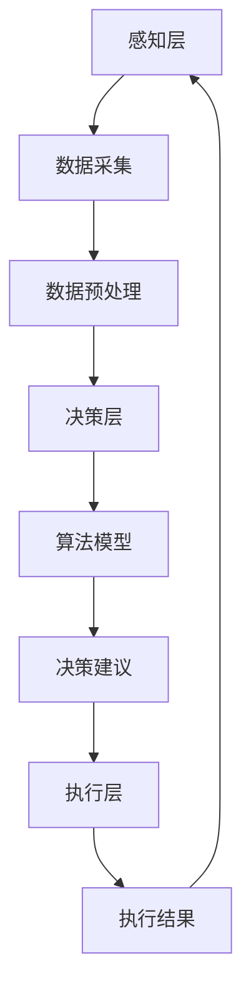

                 

关键词：AI人工智能，智能体，农业，自动化，精准农业，机器学习，数据驱动

> 摘要：随着人工智能技术的不断进步，智能体（Agent）在农业领域的应用日益广泛。本文旨在探讨AI智能体在农业中的应用，包括其核心技术、应用场景、未来展望等，以期为农业现代化提供新的思路。

## 1. 背景介绍

农业是国民经济的重要支柱，然而，随着人口增长和土地资源的日益稀缺，农业生产面临着前所未有的挑战。传统的农业方式已经无法满足现代社会对农产品的需求，因此，农业现代化已成为必然趋势。人工智能（AI）作为21世纪最具颠覆性的技术之一，正逐渐改变着各个行业的面貌。智能体（Agent）作为AI的一个重要分支，其自主性、交互性和适应性特点使其在农业领域具有巨大的潜力。

智能体最早出现在人工智能的早期研究中，最初是为了模拟人类在复杂环境中的行为。随着计算机技术和AI技术的不断发展，智能体已经从简单的模拟模型发展成为具备高度智能的软件系统。智能体能够在复杂的环境中自主地完成特定任务，通过与外部环境的交互实现自我学习和优化。在农业领域，智能体可以用于作物管理、病虫害监测、土壤检测、气象预报等，实现农业的自动化和智能化。

## 2. 核心概念与联系

### 2.1 智能体的定义

智能体是指能够感知环境、自主决策并执行任务的系统。智能体具有以下几个核心特点：

1. **感知能力**：智能体能够通过传感器或数据采集设备感知环境信息。
2. **决策能力**：智能体根据感知到的环境信息，利用算法进行决策，以实现预定的目标。
3. **行动能力**：智能体能够根据决策结果执行相应的行动。
4. **学习能力**：智能体通过学习环境信息和行动结果，不断优化决策过程。

### 2.2 智能体在农业中的应用

智能体在农业中的应用主要体现在以下几个方面：

1. **作物管理**：智能体可以通过分析土壤、气象等数据，为作物生长提供优化建议，实现精准农业。
2. **病虫害监测**：智能体可以利用图像识别、声音识别等技术，实时监测作物病虫害情况，提高病虫害防治效果。
3. **土壤检测**：智能体可以通过土壤传感器实时监测土壤质量，为农业生产提供科学依据。
4. **气象预报**：智能体可以分析气象数据，提供准确的天气预报，帮助农民合理安排农业生产活动。

### 2.3 智能体架构

智能体的架构通常包括以下几个层次：

1. **感知层**：包括各种传感器和数据采集设备，用于感知环境信息。
2. **决策层**：包括算法模型和决策引擎，用于分析感知层获取的数据，生成决策建议。
3. **执行层**：包括各种执行设备，如自动化机器、无人机等，用于执行决策层的决策结果。

下面是一个简单的智能体架构的Mermaid流程图：



## 3. 核心算法原理 & 具体操作步骤

### 3.1 算法原理概述

智能体在农业中的应用主要依赖于机器学习和数据挖掘技术。机器学习是一种让计算机从数据中学习并自动改进的算法。在农业领域，机器学习可以用于预测作物生长趋势、识别病虫害、评估土壤质量等。常见的机器学习算法包括决策树、支持向量机、神经网络等。

数据挖掘是从大量数据中提取出有价值信息的过程。在农业中，数据挖掘可以用于发现作物生长规律、分析气象数据、优化农业资源配置等。数据挖掘技术包括关联规则挖掘、聚类分析、分类分析等。

### 3.2 算法步骤详解

1. **数据收集**：收集与农业相关的各种数据，包括土壤数据、气象数据、作物生长数据等。
2. **数据预处理**：对收集到的数据进行分析和清洗，去除噪声和异常值，为后续分析做准备。
3. **特征提取**：从预处理后的数据中提取出对农业有价值的特征，如土壤湿度、温度、光照强度等。
4. **模型训练**：利用提取出的特征数据，训练机器学习模型，如决策树、支持向量机等。
5. **模型评估**：使用测试数据评估模型的准确性，优化模型参数。
6. **决策生成**：利用训练好的模型，对新的数据进行分析，生成农业管理建议。
7. **决策执行**：根据生成的决策建议，执行相应的农业管理操作，如调整灌溉方案、喷洒农药等。

### 3.3 算法优缺点

**优点**：

1. **自动化**：智能体可以自动执行农业管理任务，减少人工干预。
2. **精准化**：基于数据分析的决策建议，可以更加精准地指导农业生产。
3. **效率高**：智能体可以快速处理大量数据，提高农业生产效率。

**缺点**：

1. **初始投入高**：智能体需要大量的传感器和计算设备，初始投入较高。
2. **数据处理复杂**：农业数据通常噪声较大，处理复杂。

### 3.4 算法应用领域

智能体在农业中的应用领域非常广泛，主要包括：

1. **作物预测**：利用机器学习模型预测作物生长趋势，优化农业生产计划。
2. **病虫害监测**：利用图像识别技术监测作物病虫害，及时采取防治措施。
3. **土壤管理**：利用土壤传感器监测土壤质量，优化土壤管理措施。
4. **水资源管理**：利用智能体优化灌溉方案，提高水资源利用效率。

## 4. 数学模型和公式 & 详细讲解 & 举例说明

### 4.1 数学模型构建

在农业智能体的应用中，常见的数学模型包括线性回归、逻辑回归、决策树等。

**线性回归**：

线性回归模型的基本公式为：

\[ y = \beta_0 + \beta_1x_1 + \beta_2x_2 + \ldots + \beta_nx_n \]

其中，\( y \) 是因变量，\( x_1, x_2, \ldots, x_n \) 是自变量，\( \beta_0, \beta_1, \beta_2, \ldots, \beta_n \) 是模型的参数。

**逻辑回归**：

逻辑回归模型的基本公式为：

\[ P(y=1) = \frac{1}{1 + e^{-(\beta_0 + \beta_1x_1 + \beta_2x_2 + \ldots + \beta_nx_n)}} \]

其中，\( P(y=1) \) 是因变量为1的概率，其他参数与线性回归相同。

**决策树**：

决策树模型的基本公式为：

\[ y = \sum_{i=1}^{n} \beta_iI(x_i > t_i) \]

其中，\( y \) 是因变量，\( x_1, x_2, \ldots, x_n \) 是自变量，\( \beta_i \) 是模型参数，\( t_i \) 是阈值，\( I(x_i > t_i) \) 是指示函数，当 \( x_i > t_i \) 时取值为1，否则为0。

### 4.2 公式推导过程

以线性回归模型为例，其参数的推导过程如下：

1. **损失函数**：

   线性回归的损失函数通常使用均方误差（MSE）：

   \[ J(\theta) = \frac{1}{2m} \sum_{i=1}^{m} (h_\theta(x^{(i)}) - y^{(i)})^2 \]

   其中，\( m \) 是样本数量，\( h_\theta(x^{(i)}) \) 是模型预测值，\( y^{(i)} \) 是实际值。

2. **梯度下降**：

   为了最小化损失函数，可以使用梯度下降法：

   \[ \theta_j := \theta_j - \alpha \frac{\partial J(\theta)}{\partial \theta_j} \]

   其中，\( \alpha \) 是学习率，\( \theta_j \) 是模型参数。

3. **迭代过程**：

   通过多次迭代，逐步更新模型参数，直到损失函数达到最小值。

### 4.3 案例分析与讲解

假设我们有一个简单的线性回归问题，目标是预测作物的产量。数据集包含作物的种植面积和产量，模型公式为：

\[ y = \beta_0 + \beta_1x_1 \]

其中，\( y \) 是产量，\( x_1 \) 是种植面积。

1. **数据收集**：

   收集包含种植面积和产量的数据，例如：

   \[ (x_1^{(1)}, y^{(1)}), (x_1^{(2)}, y^{(2)}), \ldots, (x_1^{(m)}, y^{(m)}) \]

2. **数据预处理**：

   对数据进行标准化处理，使数据分布更加均匀。

3. **模型训练**：

   使用梯度下降法训练模型，得到参数 \( \beta_0 \) 和 \( \beta_1 \)。

4. **模型评估**：

   使用测试数据评估模型准确性，如计算均方误差。

5. **决策生成**：

   利用训练好的模型预测新的种植面积对应的产量。

6. **决策执行**：

   根据预测结果调整种植策略，提高作物产量。

## 5. 项目实践：代码实例和详细解释说明

### 5.1 开发环境搭建

为了实现智能体在农业中的应用，我们需要搭建一个合适的开发环境。这里我们选择使用Python作为编程语言，主要依赖于以下库：

1. **NumPy**：用于数学计算。
2. **Pandas**：用于数据操作。
3. **Scikit-learn**：用于机器学习。
4. **Matplotlib**：用于数据可视化。

### 5.2 源代码详细实现

以下是实现一个简单线性回归模型的代码实例：

```python
import numpy as np
import pandas as pd
from sklearn.linear_model import LinearRegression
from sklearn.model_selection import train_test_split
import matplotlib.pyplot as plt

# 数据收集
data = pd.read_csv('agriculture_data.csv')
X = data[['planting_area']]
y = data['yield']

# 数据预处理
X = (X - X.mean()) / X.std()

# 模型训练
model = LinearRegression()
model.fit(X, y)

# 模型评估
X_test, y_test = train_test_split(X, y, test_size=0.2)
y_pred = model.predict(X_test)
mse = np.mean((y_pred - y_test) ** 2)
print(f'MSE: {mse}')

# 决策生成
new_planting_area = np.array([50])
new_yield = model.predict(new_planting_area)
print(f'Predicted yield: {new_yield[0]}')

# 决策执行
# 根据预测结果调整种植策略，例如增加种植面积

# 数据可视化
plt.scatter(X, y)
plt.plot(X, model.predict(X), color='red')
plt.xlabel('Planting Area')
plt.ylabel('Yield')
plt.title('Yield vs Planting Area')
plt.show()
```

### 5.3 代码解读与分析

1. **数据收集**：使用Pandas库读取农业数据，包括种植面积和产量。
2. **数据预处理**：对种植面积进行标准化处理，以便于模型训练。
3. **模型训练**：使用Scikit-learn库的线性回归模型进行训练。
4. **模型评估**：使用测试数据评估模型准确性，计算均方误差。
5. **决策生成**：利用训练好的模型预测新的种植面积对应的产量。
6. **决策执行**：根据预测结果调整种植策略。
7. **数据可视化**：使用Matplotlib库绘制种植面积与产量的散点图和拟合曲线。

## 6. 实际应用场景

### 6.1 精准农业

精准农业是智能体在农业中的一个重要应用场景。通过智能体，农民可以实时监测作物生长状况，根据土壤、气象等数据优化农业生产。例如，智能体可以根据土壤湿度数据调整灌溉方案，提高水资源利用效率。

### 6.2 病虫害监测

智能体可以利用图像识别技术监测作物病虫害。通过实时分析作物图像，智能体可以快速识别病虫害类型，为农民提供及时、准确的防治建议，减少农药使用，提高农作物产量。

### 6.3 土壤检测

智能体可以通过土壤传感器实时监测土壤质量，包括土壤湿度、温度、pH值等。智能体可以根据土壤数据优化施肥方案，提高农作物产量。

### 6.4 气象预报

智能体可以分析气象数据，提供准确的天气预报。农民可以根据天气预报合理安排农业生产活动，避免自然灾害对农作物的影响。

## 7. 未来应用展望

随着人工智能技术的不断进步，智能体在农业中的应用将更加广泛。未来，智能体可能实现以下发展：

1. **智能决策支持**：智能体可以提供更加精准、个性化的农业生产决策支持，提高农业生产效率。
2. **跨领域应用**：智能体不仅可以应用于农业，还可以应用于林业、渔业等，实现农业产业链的智能化。
3. **可持续发展**：智能体可以帮助农业实现可持续发展，减少资源消耗，降低环境污染。
4. **全球化应用**：智能体可以帮助农民在全球范围内进行农业生产，实现农业全球化。

## 8. 工具和资源推荐

### 8.1 学习资源推荐

1. **《机器学习》**：由周志华教授所著，是机器学习领域的经典教材。
2. **《深度学习》**：由Ian Goodfellow等作者所著，是深度学习领域的权威教材。
3. **《Python机器学习》**：由Sebastian Raschka所著，适合初学者入门。

### 8.2 开发工具推荐

1. **Jupyter Notebook**：用于编写和运行Python代码，非常适合数据分析和机器学习项目。
2. **TensorFlow**：用于构建和训练深度学习模型，是当前最受欢迎的深度学习框架之一。
3. **PyTorch**：用于构建和训练深度学习模型，具有灵活性和高效性。

### 8.3 相关论文推荐

1. **"A Survey on Smart Agriculture using Internet of Things"**：概述了物联网在农业中的应用。
2. **"Deep Learning for Agriculture"**：讨论了深度学习在农业中的应用。
3. **"Precision Agriculture: The Challenges and Opportunities"**：探讨了精准农业的挑战和机遇。

## 9. 总结：未来发展趋势与挑战

智能体在农业中的应用前景广阔，但同时也面临着一些挑战。未来，智能体的发展趋势包括：

1. **智能化**：智能体将更加智能化，能够处理更复杂、更动态的农业环境。
2. **个性化**：智能体将能够提供更加个性化、定制化的农业生产方案。
3. **可持续发展**：智能体将帮助农业实现可持续发展，减少资源消耗，降低环境污染。

然而，智能体在农业中面临的挑战主要包括：

1. **数据质量**：农业数据的多样性和复杂性对智能体的性能有较大影响，需要提高数据质量。
2. **算法复杂性**：随着智能体应用的深入，算法的复杂度将不断增加，需要开发更加高效、可解释的算法。
3. **部署与维护**：智能体需要部署在农业环境中，这对设备的维护和升级提出了挑战。

总之，智能体在农业中的应用将是一个长期、复杂的过程，需要各方的共同努力和持续探索。

## 10. 附录：常见问题与解答

### 10.1 智能体在农业中的应用有哪些优点？

智能体在农业中的应用具有以下优点：

1. **自动化**：智能体可以自动执行农业管理任务，减少人工干预。
2. **精准化**：智能体可以基于数据分析提供精准的农业管理建议。
3. **效率高**：智能体可以快速处理大量数据，提高农业生产效率。

### 10.2 智能体在农业中面临哪些挑战？

智能体在农业中面临的挑战主要包括：

1. **数据质量**：农业数据的多样性和复杂性对智能体的性能有较大影响。
2. **算法复杂性**：随着智能体应用的深入，算法的复杂度将不断增加。
3. **部署与维护**：智能体需要部署在农业环境中，对设备的维护和升级提出了挑战。

### 10.3 如何提高智能体在农业中的应用效果？

为了提高智能体在农业中的应用效果，可以采取以下措施：

1. **提高数据质量**：通过数据清洗、数据增强等方法提高数据质量。
2. **优化算法**：开发更加高效、可解释的算法，提高智能体的性能。
3. **系统集成**：实现智能体与其他农业设备的系统集成，提高智能体的应用效果。

## 作者署名

作者：禅与计算机程序设计艺术 / Zen and the Art of Computer Programming
----------------------------------------------------------------

以上就是本文的完整内容，希望对您在智能体在农业中的应用方面有所启发。如有任何疑问，欢迎随时提问。再次感谢您的阅读！

