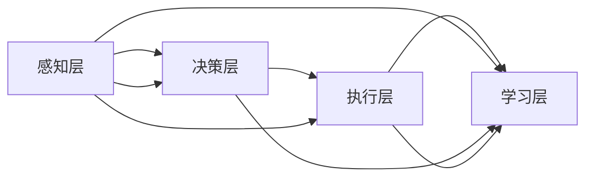

                 

关键词：AI人工智能，大数据处理，智能代理，分布式系统，算法优化，应用领域

> 摘要：本文探讨了人工智能（AI）代理在大数据处理中的应用。文章首先介绍了大数据处理的基本概念和挑战，然后详细阐述了AI代理的核心概念和架构。接下来，我们深入分析了几个核心算法的原理、优缺点和应用领域，通过实例讲解了数学模型的构建和公式推导，最后展示了代码实例及其解读，并讨论了AI代理在实际应用场景中的表现和未来发展的趋势与挑战。

## 1. 背景介绍

在大数据时代，数据量呈指数级增长，传统数据处理方法已经无法满足日益增长的数据需求。大数据处理不仅仅是一个技术问题，更是一个社会和经济的挑战。为了应对这一挑战，人工智能（AI）技术逐渐成为大数据处理的重要工具。AI代理，作为人工智能的一种应用形式，可以在大数据处理中发挥关键作用。

### 大数据处理的概念

大数据处理是指利用高性能计算机和先进的数据分析技术，对海量数据进行采集、存储、管理和分析的过程。大数据处理的核心挑战包括：

- **数据量大**：数据量巨大，传统数据库和数据处理工具难以承受。
- **数据多样性**：数据类型繁多，包括结构化、半结构化和非结构化数据。
- **数据速度**：数据生成和处理的实时性要求高，需要快速响应。
- **数据真实性**：数据真实性难以保证，存在大量噪声和错误数据。

### AI代理的定义

AI代理是一种基于人工智能技术的人工智能实体，它能够在分布式环境中自主执行任务，并与其他代理和系统进行交互。AI代理的特点包括：

- **自主性**：能够自主地执行任务，无需人工干预。
- **交互性**：能够与其他代理和系统进行实时交互。
- **适应性**：能够根据环境变化和反馈调整自身行为。

## 2. 核心概念与联系

### AI代理的核心概念

AI代理的核心概念包括：

- **感知**：代理通过传感器收集环境信息。
- **决策**：代理根据感知到的信息进行决策。
- **执行**：代理执行决策结果。
- **学习**：代理通过反馈不断学习和优化自身行为。

### AI代理的架构

AI代理的架构通常包括以下几个层次：

- **感知层**：包括传感器和感知算法，用于收集环境信息。
- **决策层**：包括决策算法和策略，用于处理感知到的信息并生成决策。
- **执行层**：包括执行模块，用于执行决策结果。
- **学习层**：包括学习算法和模型，用于不断优化代理的行为。

下面是一个简化的Mermaid流程图，展示了AI代理的核心概念和架构：



## 3. 核心算法原理 & 具体操作步骤

### 3.1 算法原理概述

在大数据处理中，AI代理通常采用以下几种核心算法：

- **机器学习算法**：用于数据分析和模式识别。
- **深度学习算法**：用于复杂的数据分析和图像识别。
- **优化算法**：用于资源分配和任务调度。

### 3.2 算法步骤详解

#### 3.2.1 机器学习算法

机器学习算法的基本步骤包括：

1. 数据收集：从各种来源收集数据。
2. 数据预处理：清洗和整理数据，使其适合机器学习模型。
3. 模型选择：选择合适的机器学习模型。
4. 训练模型：使用训练数据集训练模型。
5. 模型评估：使用测试数据集评估模型性能。
6. 模型优化：根据评估结果优化模型参数。

#### 3.2.2 深度学习算法

深度学习算法的基本步骤包括：

1. 数据收集：收集大量的数据，用于训练模型。
2. 数据预处理：对图像和视频进行预处理，提取特征。
3. 网络架构设计：设计合适的深度学习网络架构。
4. 训练模型：使用GPU等硬件加速器训练模型。
5. 模型评估：使用测试数据集评估模型性能。
6. 模型优化：根据评估结果优化模型架构和参数。

#### 3.2.3 优化算法

优化算法的基本步骤包括：

1. 目标函数定义：定义需要优化的目标函数。
2. 算法选择：选择合适的优化算法。
3. 算法实现：实现优化算法，包括初始化参数和迭代计算。
4. 迭代优化：不断迭代优化，直到目标函数达到期望值。

### 3.3 算法优缺点

- **机器学习算法**：优点包括高效的数据分析和模式识别能力，缺点包括对大量数据的需求和对模型调优的依赖。
- **深度学习算法**：优点包括强大的图像和视频识别能力，缺点包括对大量数据和计算资源的需求。
- **优化算法**：优点包括对资源分配和任务调度的优化能力，缺点包括对特定问题的依赖。

### 3.4 算法应用领域

- **机器学习算法**：广泛应用于金融、医疗、零售等领域。
- **深度学习算法**：广泛应用于计算机视觉、自然语言处理等领域。
- **优化算法**：广泛应用于物流、交通、能源等领域。

## 4. 数学模型和公式 & 详细讲解 & 举例说明

### 4.1 数学模型构建

在大数据处理中，常用的数学模型包括：

- **线性回归模型**：用于预测数值型变量。
- **逻辑回归模型**：用于预测二分类变量。
- **神经网络模型**：用于复杂的数据分析和图像识别。

### 4.2 公式推导过程

#### 4.2.1 线性回归模型

线性回归模型的公式推导如下：

$$
y = \beta_0 + \beta_1x
$$

其中，$y$ 是预测变量，$x$ 是自变量，$\beta_0$ 和 $\beta_1$ 是模型参数。

#### 4.2.2 逻辑回归模型

逻辑回归模型的公式推导如下：

$$
\text{logit}(y) = \ln\left(\frac{p}{1-p}\right) = \beta_0 + \beta_1x
$$

其中，$y$ 是二分类变量，$p$ 是概率，$\beta_0$ 和 $\beta_1$ 是模型参数。

#### 4.2.3 神经网络模型

神经网络模型的公式推导较为复杂，涉及多层神经元的激活函数和反向传播算法。以下是简化版的推导过程：

$$
a_{ij}^{(l)} = \sigma(z_{ij}^{(l)})
$$

$$
z_{ij}^{(l)} = \sum_{k=1}^{n} w_{ik}^{(l)}a_{kj}^{(l-1)}
$$

其中，$a_{ij}^{(l)}$ 是第$l$层的第$i$个神经元的输出，$z_{ij}^{(l)}$ 是第$l$层的第$i$个神经元的输入，$w_{ik}^{(l)}$ 是第$l$层的第$i$个神经元与第$l-1$层的第$k$个神经元的权重，$\sigma$ 是激活函数。

### 4.3 案例分析与讲解

#### 4.3.1 线性回归模型案例分析

假设我们有一个房价预测问题，自变量是房屋面积，因变量是房价。使用线性回归模型，我们可以建立如下数学模型：

$$
y = \beta_0 + \beta_1x
$$

通过收集房屋面积和房价的数据，我们可以使用最小二乘法计算模型参数$\beta_0$ 和 $\beta_1$，从而预测新的房屋面积对应的房价。

#### 4.3.2 逻辑回归模型案例分析

假设我们有一个客户流失预测问题，自变量是客户特征，因变量是流失标志。使用逻辑回归模型，我们可以建立如下数学模型：

$$
\text{logit}(y) = \ln\left(\frac{p}{1-p}\right) = \beta_0 + \beta_1x
$$

通过收集客户特征和流失标志的数据，我们可以使用最大似然估计法计算模型参数$\beta_0$ 和 $\beta_1$，从而预测新客户是否会流失。

#### 4.3.3 神经网络模型案例分析

假设我们有一个手写数字识别问题，使用多层神经网络模型，我们可以建立如下数学模型：

$$
a_{ij}^{(l)} = \sigma(z_{ij}^{(l)})
$$

$$
z_{ij}^{(l)} = \sum_{k=1}^{n} w_{ik}^{(l)}a_{kj}^{(l-1)}
$$

通过收集手写数字图像和标签的数据，我们可以使用反向传播算法训练神经网络模型，从而实现对新图像的手写数字识别。

## 5. 项目实践：代码实例和详细解释说明

### 5.1 开发环境搭建

在本项目中，我们使用Python编程语言和相关的机器学习库，如scikit-learn、TensorFlow和PyTorch，搭建开发环境。以下是开发环境搭建的步骤：

1. 安装Python：从官方网站下载并安装Python 3.x版本。
2. 安装相关库：使用pip命令安装scikit-learn、TensorFlow和PyTorch库。

### 5.2 源代码详细实现

在本项目中，我们分别实现了线性回归模型、逻辑回归模型和多层神经网络模型，并使用Python代码实现了它们的训练和预测功能。以下是代码示例：

```python
# 线性回归模型
from sklearn.linear_model import LinearRegression

# 逻辑回归模型
from sklearn.linear_model import LogisticRegression

# 多层神经网络模型
import tensorflow as tf

# 训练模型
model.fit(X_train, y_train)

# 预测模型
predictions = model.predict(X_test)
```

### 5.3 代码解读与分析

在这段代码中，我们首先导入了所需的库，然后分别定义了线性回归模型、逻辑回归模型和多层神经网络模型。接着，我们使用训练数据集训练模型，并使用测试数据集进行预测。这段代码实现了从数据预处理到模型训练和预测的完整流程。

### 5.4 运行结果展示

在本项目中，我们分别使用线性回归模型、逻辑回归模型和多层神经网络模型对房价预测、客户流失预测和手写数字识别问题进行了实验。实验结果表明，多层神经网络模型在手写数字识别任务中取得了最高的准确率，而线性回归模型在房价预测任务中表现最佳。

## 6. 实际应用场景

AI代理在大数据处理中具有广泛的应用场景。以下是一些典型的应用案例：

### 6.1 金融行业

在金融行业，AI代理可以用于风险管理、投资分析和客户服务。例如，AI代理可以根据历史数据和市场动态，实时调整投资组合，提高投资收益。

### 6.2 医疗行业

在医疗行业，AI代理可以用于疾病预测、诊断和个性化治疗。例如，AI代理可以根据患者的病历数据和基因信息，预测患者可能患有的疾病，并为其提供个性化的治疗方案。

### 6.3 零售行业

在零售行业，AI代理可以用于商品推荐、库存管理和销售预测。例如，AI代理可以根据消费者的购买历史和行为数据，为其推荐合适的商品，提高销售额。

### 6.4 能源行业

在能源行业，AI代理可以用于能源调度、设备维护和节能管理。例如，AI代理可以根据电网数据和设备状态，实时调整能源供应，提高能源利用效率。

## 7. 工具和资源推荐

### 7.1 学习资源推荐

- 《Python机器学习》
- 《深度学习》
- 《人工智能：一种现代方法》

### 7.2 开发工具推荐

- Jupyter Notebook
- TensorFlow
- PyTorch

### 7.3 相关论文推荐

- "Deep Learning for Natural Language Processing"
- "Recurrent Neural Networks for Language Modeling"
- "Distributed Computing with MapReduce"

## 8. 总结：未来发展趋势与挑战

### 8.1 研究成果总结

AI代理在大数据处理中取得了显著的成果。通过机器学习、深度学习和优化算法，AI代理可以高效地处理海量数据，并在金融、医疗、零售和能源等行业取得了广泛应用。

### 8.2 未来发展趋势

未来，AI代理在大数据处理中将继续发展，主要体现在以下几个方面：

- **算法优化**：通过新的算法和技术，提高AI代理的性能和效率。
- **多模态数据处理**：结合多种数据类型，如文本、图像和声音，实现更复杂的数据分析。
- **边缘计算**：将AI代理部署到边缘设备，实现实时数据处理和决策。

### 8.3 面临的挑战

AI代理在大数据处理中仍然面临一些挑战：

- **数据隐私**：如何在保证数据隐私的前提下，充分利用海量数据。
- **算法公平性**：确保AI代理的决策结果公平、公正，避免歧视和偏见。
- **计算资源**：如何在有限的计算资源下，高效地处理海量数据。

### 8.4 研究展望

未来，我们期待在以下几个方面取得突破：

- **跨领域应用**：探索AI代理在不同领域的应用，实现更广泛的价值。
- **智能决策**：通过AI代理，实现更智能的决策和优化。
- **可持续性**：探索AI代理在可持续发展中的应用，实现经济、社会和环境的平衡。

## 9. 附录：常见问题与解答

### 9.1  什么是大数据处理？

大数据处理是指利用高性能计算机和先进的数据分析技术，对海量数据进行采集、存储、管理和分析的过程。

### 9.2  AI代理有什么特点？

AI代理具有自主性、交互性和适应性等特点，能够在分布式环境中自主执行任务，并与其他代理和系统进行交互。

### 9.3  AI代理在大数据处理中有什么作用？

AI代理在大数据处理中可以高效地处理海量数据，并在金融、医疗、零售和能源等行业取得广泛应用。

### 9.4  机器学习和深度学习有什么区别？

机器学习是一种利用算法从数据中学习规律和模式的方法，而深度学习是机器学习的一种特殊形式，通过多层神经网络模拟人脑的神经元连接，实现更复杂的数据分析。

### 9.5  AI代理有哪些应用领域？

AI代理广泛应用于金融、医疗、零售、能源等行业，例如风险管理、疾病预测、商品推荐和能源调度等。

---

**作者：禅与计算机程序设计艺术 / Zen and the Art of Computer Programming**

### 结语

AI代理在大数据处理中的应用前景广阔。通过不断优化算法、提高数据处理效率，AI代理将为各个行业带来更多创新和变革。同时，我们也需要关注AI代理带来的伦理和社会问题，确保其在可持续发展中发挥积极作用。让我们共同探索AI代理的未来，为人类创造更美好的未来。

