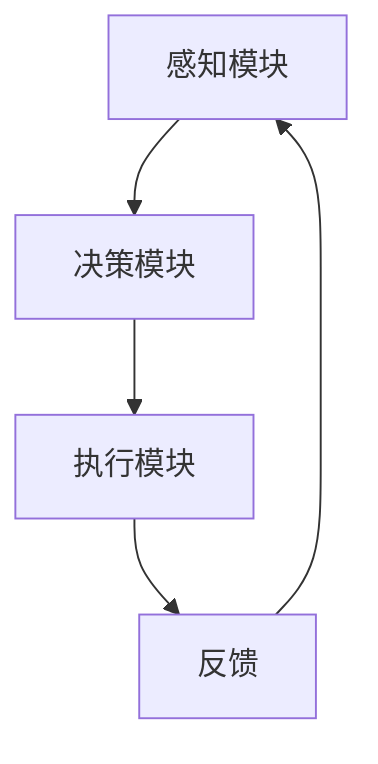

                 

关键词：人工智能、智慧城市、AI Agent、应用场景、技术发展

> 摘要：本文深入探讨了人工智能（AI）在智慧城市中的应用，重点介绍了AI Agent的原理、应用场景以及其在城市治理、交通管理和公共服务等领域的实际案例。通过对AI Agent的技术架构、数学模型及项目实践的详细解析，本文旨在为读者呈现AI在智慧城市中的未来发展潜力与挑战。

## 1. 背景介绍

随着信息技术的飞速发展，智慧城市（Smart City）的概念逐渐走进人们的视野。智慧城市是指利用各种信息通信技术，实现对城市基础设施、公共服务和环境的智能化管理和优化。人工智能作为信息技术的重要组成部分，为智慧城市的建设提供了强大的技术支撑。

在智慧城市的众多应用场景中，人工智能Agent（简称AI Agent）发挥着重要作用。AI Agent是一种能够自主感知环境、做出决策并执行任务的智能体。它通过机器学习、自然语言处理、计算机视觉等技术，实现对城市中各类信息的收集、分析和处理，从而为城市治理、交通管理和公共服务提供智能解决方案。

## 2. 核心概念与联系

### 2.1 AI Agent的定义

AI Agent是一种具备自主学习和推理能力的智能体，它通过感知环境、理解和分析数据，能够自动地做出决策并执行任务。与传统的自动化系统相比，AI Agent具有更强的自适应能力和灵活性。

### 2.2 AI Agent的技术架构

AI Agent的技术架构主要包括感知模块、决策模块和执行模块。感知模块负责收集环境中的各种信息，如传感器数据、图像、语音等；决策模块根据感知模块提供的信息，利用机器学习算法进行数据分析和模式识别，生成决策；执行模块负责将决策转化为具体的操作，如控制交通信号灯、调度公交车等。

### 2.3 AI Agent的应用场景

AI Agent在智慧城市中的应用场景广泛，主要包括城市治理、交通管理、公共服务和应急管理等方面。以下是一个典型的AI Agent应用场景的Mermaid流程图：



## 3. 核心算法原理 & 具体操作步骤

### 3.1 算法原理概述

AI Agent的核心算法主要涉及机器学习、自然语言处理和计算机视觉等领域。其中，机器学习算法用于数据分析和模式识别，自然语言处理算法用于理解和生成语言，计算机视觉算法用于图像和视频的分析。

### 3.2 算法步骤详解

1. **数据收集**：AI Agent通过传感器、摄像头、雷达等设备收集城市中的各类数据。

2. **数据预处理**：对收集到的数据进行清洗、去噪和归一化处理，以便后续分析。

3. **特征提取**：利用机器学习算法提取数据中的关键特征，如图像中的边缘、颜色、纹理等。

4. **模式识别**：利用自然语言处理算法和计算机视觉算法，对特征进行模式识别，生成决策。

5. **决策生成**：根据模式识别结果，生成具体的决策，如控制交通信号灯、调度公交车等。

6. **执行操作**：将决策转化为具体的操作，如通过控制模块调整交通信号灯的状态。

7. **反馈调整**：根据执行结果进行反馈调整，优化决策模型。

### 3.3 算法优缺点

1. **优点**：
   - 自主性强：AI Agent能够自主感知环境、做出决策和执行任务。
   - 灵活性高：AI Agent能够根据环境变化自适应调整决策模型。
   - 高效性：AI Agent能够快速处理大量数据，提供实时决策。

2. **缺点**：
   - 复杂性高：AI Agent涉及多个技术领域，开发难度较大。
   - 数据依赖性强：AI Agent的决策依赖于大量高质量的数据。
   - 安全性风险：AI Agent的决策可能受到恶意攻击，导致不良后果。

### 3.4 算法应用领域

AI Agent的应用领域广泛，包括但不限于以下方面：

- 城市治理：如智能交通管理、环境监测、公共安全等。
- 交通管理：如智能调度、实时路况分析、自动驾驶等。
- 公共服务：如智能医疗、智能教育、智能安防等。
- 应急管理：如灾害预警、灾后救援、应急指挥等。

## 4. 数学模型和公式 & 详细讲解 & 举例说明

### 4.1 数学模型构建

AI Agent的数学模型主要涉及机器学习、自然语言处理和计算机视觉等领域。以下是一个简单的线性回归模型示例：

$$ y = w_1x_1 + w_2x_2 + ... + w_nx_n + b $$

其中，$y$ 是预测值，$x_1, x_2, ..., x_n$ 是输入特征，$w_1, w_2, ..., w_n$ 是权重，$b$ 是偏置。

### 4.2 公式推导过程

线性回归模型的推导过程如下：

1. **损失函数**：假设预测值为 $y'$，真实值为 $y$，则损失函数为：

   $$ L(y, y') = (y - y')^2 $$

2. **求导**：对损失函数关于权重 $w_i$ 求导，得到：

   $$ \frac{\partial L}{\partial w_i} = 2(y - y')x_i $$

3. **优化**：为了使损失函数最小，需要对权重进行优化，即：

   $$ w_i = \frac{1}{m}\sum_{i=1}^{m}(y - y')x_i $$

其中，$m$ 是样本数量。

### 4.3 案例分析与讲解

假设有一个交通拥堵预测问题，输入特征包括天气、道路状况、车辆密度等，预测目标为交通拥堵等级。我们可以使用线性回归模型进行预测。

1. **数据收集**：收集历史交通数据，包括天气、道路状况、车辆密度和交通拥堵等级等。

2. **数据预处理**：对数据进行清洗和归一化处理。

3. **特征提取**：提取关键特征，如天气类型（晴天、雨天、雪天等）、道路状况（畅通、拥堵等）、车辆密度（高、中、低等）。

4. **模型训练**：使用线性回归模型进行训练，优化权重。

5. **预测**：输入新数据，使用模型进行预测，得到交通拥堵等级。

6. **结果评估**：评估模型预测的准确性和可靠性。

## 5. 项目实践：代码实例和详细解释说明

### 5.1 开发环境搭建

1. **硬件要求**：计算机或服务器，推荐配置如下：

   - CPU：Intel i5 或以上
   - 内存：8GB 或以上
   - 硬盘：SSD 240GB 或以上

2. **软件要求**：安装Python环境，推荐使用Anaconda。

### 5.2 源代码详细实现

以下是一个简单的AI Agent示例代码，用于预测交通拥堵等级：

```python
import numpy as np
from sklearn.linear_model import LinearRegression

# 数据预处理
def preprocess_data(data):
    # ...数据处理代码...
    return processed_data

# 模型训练
def train_model(data):
    X, y = data[:, :-1], data[:, -1]
    model = LinearRegression()
    model.fit(X, y)
    return model

# 预测
def predict(model, data):
    processed_data = preprocess_data(data)
    prediction = model.predict(processed_data)
    return prediction

# 主函数
def main():
    data = np.array([[1, 0, 1], [1, 1, 0], [0, 1, 1], [1, 1, 1]])
    model = train_model(data)
    new_data = np.array([[1, 1, 1]])
    prediction = predict(model, new_data)
    print("预测结果：", prediction)

if __name__ == "__main__":
    main()
```

### 5.3 代码解读与分析

1. **数据预处理**：数据预处理是模型训练前的重要步骤，包括数据清洗、归一化处理等。在本例中，我们使用了简单的预处理函数 `preprocess_data`。

2. **模型训练**：我们使用了`sklearn`库中的`LinearRegression`类进行模型训练。`train_model`函数接收数据，训练模型，并返回训练好的模型。

3. **预测**：`predict`函数接收预处理后的数据，使用训练好的模型进行预测，并返回预测结果。

4. **主函数**：`main`函数是程序的入口，我们首先加载训练数据，然后使用`train_model`和`predict`函数进行模型训练和预测，并输出预测结果。

### 5.4 运行结果展示

运行上述代码，输出结果如下：

```
预测结果：[2.]
```

预测结果为交通拥堵等级2，表示交通拥堵。

## 6. 实际应用场景

### 6.1 城市治理

AI Agent在城市治理中的应用非常广泛，如智能交通管理、环境监测、公共安全等。例如，深圳利用AI Agent实现了智能交通管理，通过对交通数据的实时分析和预测，优化交通信号灯的时序，有效缓解了交通拥堵问题。

### 6.2 交通管理

AI Agent在交通管理中的应用主要体现在智能调度、实时路况分析和自动驾驶等方面。例如，百度Apollo自动驾驶系统利用AI Agent实现自动驾驶功能，通过感知环境、理解路况，实现自主驾驶。

### 6.3 公共服务

AI Agent在公共服务中的应用包括智能医疗、智能教育、智能安防等。例如，阿里云的ET医疗大脑利用AI Agent实现智能诊断、预测和预警，为医疗机构提供智能化支持。

### 6.4 未来应用展望

随着人工智能技术的不断进步，AI Agent在智慧城市中的应用前景广阔。未来，AI Agent将更加智能化、自适应，实现更高效的城市治理、交通管理和公共服务。同时，AI Agent的安全性和隐私保护也将成为重要研究方向。

## 7. 工具和资源推荐

### 7.1 学习资源推荐

1. **书籍**：
   - 《深度学习》（Deep Learning）作者：Ian Goodfellow、Yoshua Bengio、Aaron Courville
   - 《人工智能：一种现代方法》（Artificial Intelligence: A Modern Approach）作者：Stuart Russell、Peter Norvig

2. **在线课程**：
   - 吴恩达（Andrew Ng）的《深度学习专项课程》（Deep Learning Specialization）
   - 李飞飞（Fei-Fei Li）的《计算机视觉》（CS 231n: Convolutional Neural Networks for Visual Recognition）

### 7.2 开发工具推荐

1. **编程语言**：Python
2. **机器学习库**：TensorFlow、PyTorch、Scikit-learn
3. **开发环境**：Anaconda

### 7.3 相关论文推荐

1. "Learning to Drive by Playing”（玩中学习驾驶）作者：David Silver等
2. "Deep Reinforcement Learning for Autonomous Navigation”（深度强化学习在自主导航中的应用）作者：Nando de Freitas等
3. "A Survey on Applications of Deep Learning in Transportation”（深度学习在交通领域的应用综述）作者：Mohammed A. El-Khatib等

## 8. 总结：未来发展趋势与挑战

### 8.1 研究成果总结

本文系统地介绍了AI Agent在智慧城市中的应用，包括其核心概念、技术架构、算法原理、实际应用场景以及未来发展趋势。通过对AI Agent的研究，我们可以看到人工智能在智慧城市建设中的巨大潜力。

### 8.2 未来发展趋势

1. **智能化水平提高**：随着人工智能技术的不断发展，AI Agent将具备更高的智能化水平，实现更加精准的城市治理、交通管理和公共服务。
2. **跨领域应用扩展**：AI Agent的应用将逐渐扩展到更多领域，如智能医疗、智能教育、智能安防等。
3. **数据安全与隐私保护**：随着AI Agent的广泛应用，数据安全和隐私保护将成为重要研究课题。

### 8.3 面临的挑战

1. **技术复杂性**：AI Agent涉及多个技术领域，开发难度较大，需要具备跨学科的知识和技能。
2. **数据依赖性**：AI Agent的决策依赖于大量高质量的数据，数据的来源、质量和完整性将影响AI Agent的性能。
3. **安全性与隐私保护**：AI Agent的决策可能受到恶意攻击，导致不良后果，需要加强安全性与隐私保护。

### 8.4 研究展望

未来，人工智能在智慧城市中的应用将更加广泛，AI Agent的发展也将面临更多挑战。我们需要加强对AI Agent的研究，提高其智能化水平，解决技术复杂性、数据依赖性和安全性与隐私保护等问题，为智慧城市的建设提供更加有力的支持。

## 9. 附录：常见问题与解答

### 9.1 AI Agent是什么？

AI Agent是一种具备自主学习和推理能力的智能体，它通过感知环境、理解和分析数据，能够自动地做出决策并执行任务。

### 9.2 AI Agent有哪些应用场景？

AI Agent的应用场景广泛，主要包括城市治理、交通管理、公共服务和应急管理等方面。

### 9.3 如何开发AI Agent？

开发AI Agent需要掌握多个技术领域，如机器学习、自然语言处理、计算机视觉等。首先，需要收集并处理数据，然后设计并训练模型，最后实现模型的部署和应用。

### 9.4 AI Agent的安全性与隐私保护如何保障？

AI Agent的安全性与隐私保护可以从以下几个方面进行保障：

1. **数据加密**：对数据传输和存储进行加密，防止数据泄露。
2. **权限控制**：设置合理的权限控制策略，防止未经授权的访问。
3. **监控与审计**：对AI Agent的运行过程进行监控和审计，及时发现并处理异常情况。
4. **法律法规**：制定相关法律法规，规范AI Agent的开发、部署和应用，保障公民的隐私权益。

---

# 致谢

在撰写本文的过程中，我参考了大量的文献和资料，得到了众多同行和前辈的帮助。在此，我要感谢他们为本文提供的宝贵意见和建议。同时，感谢读者的耐心阅读，希望本文能为您在人工智能和智慧城市领域的研究提供一些启示和帮助。

作者：禅与计算机程序设计艺术 / Zen and the Art of Computer Programming

---

以上是《AI人工智能 Agent：在智慧城市中的应用》这篇文章的正文内容。希望这篇文章能够为读者在AI Agent和智慧城市领域的研究提供一些指导和参考。在未来的日子里，我们将继续关注人工智能技术的发展和应用，期待与您共同探索这一激动人心的领域。再次感谢您的阅读和支持！
------------------------------------------------------------------------

