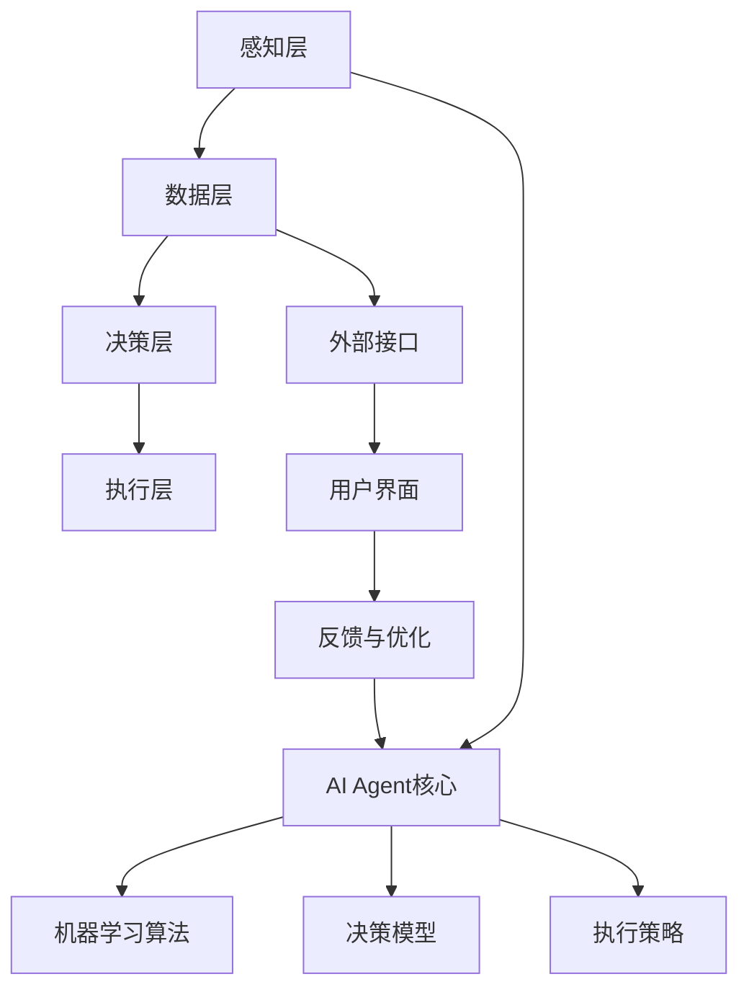

                 

关键词：人工智能，智慧城市，AI Agent，智能应用，技术架构，应用实例，未来发展

> 摘要：本文将探讨人工智能（AI）在智慧城市中的应用，重点关注AI Agent这一技术概念。我们将通过介绍AI Agent的定义、原理及其在智慧城市中的实际应用案例，来分析AI Agent如何推动城市智能化的发展，并展望其未来的应用前景与面临的挑战。

## 1. 背景介绍

随着科技的迅猛发展，人工智能（AI）技术已经成为驱动各行各业变革的重要力量。智慧城市作为现代城市发展的一个重要方向，旨在通过信息通信技术（ICT）、物联网（IoT）、大数据等手段实现城市管理的智能化和高效化。在这个过程中，AI Agent作为一种具有自主学习和决策能力的智能实体，正逐渐成为智慧城市建设中不可或缺的一部分。

智慧城市概念最早由IBM提出，其核心理念是通过整合各类城市信息资源，构建一个智能化、可持续发展、富有活力的城市生态系统。AI Agent作为AI技术的具体应用形式，其在智慧城市中的角色越来越重要。从智能交通、智慧能源管理到公共安全、城市环保等方面，AI Agent都展现出了强大的应用潜力。

本文将首先介绍AI Agent的基本概念和原理，随后分析其在智慧城市中的实际应用场景，最后探讨AI Agent未来的发展方向与面临的挑战。

## 2. 核心概念与联系

### 2.1 AI Agent的定义

AI Agent，即人工智能代理，是一种模拟人类思维和行为的计算机程序。它能够感知环境，自主决策并采取行动，以达到预定的目标。AI Agent具有以下几个关键特点：

1. **感知能力**：AI Agent能够通过传感器、摄像头等设备获取环境信息，如交通流量、环境质量、能耗数据等。
2. **决策能力**：基于感知到的信息，AI Agent能够运用算法和模型进行推理和决策，以制定合理的行动策略。
3. **行动能力**：AI Agent能够根据决策结果执行具体的操作，如调整交通信号灯、优化能源分配等。
4. **学习能力**：AI Agent能够通过机器学习、深度学习等技术不断优化自身性能，提高决策的准确性和效率。

### 2.2 AI Agent在智慧城市中的架构

为了充分发挥AI Agent的作用，智慧城市中的AI Agent架构通常包括以下几个关键层次：

1. **感知层**：包括各种传感器和采集设备，如交通监控摄像头、环境监测传感器、能源计量设备等，负责收集城市运行的各种数据。
2. **数据层**：数据层负责存储、管理和处理感知层收集到的数据，确保数据的实时性和准确性。这一层通常涉及大数据平台、云计算等技术。
3. **决策层**：决策层是AI Agent的核心，通过机器学习、深度学习等算法对数据进行处理和分析，生成决策建议和行动策略。
4. **执行层**：执行层负责将决策层的建议付诸实施，如通过智能交通控制系统调整交通信号灯，或通过智能能源管理系统优化能源分配。

### 2.3 AI Agent的原理图

下面是AI Agent在智慧城市中应用的Mermaid流程图，展示了其核心组件和交互过程：



### 2.4 AI Agent的关联概念

AI Agent与以下几个核心概念密切相关：

1. **物联网（IoT）**：AI Agent依赖于IoT设备提供的实时数据支持，从而实现更准确和实时的环境感知。
2. **大数据分析**：AI Agent通过大数据平台进行海量数据的高效处理和分析，为决策层提供有力支持。
3. **云计算**：云计算提供了强大的计算能力和存储资源，使得AI Agent能够在大规模数据处理和复杂算法应用方面具备更高的性能。

## 3. 核心算法原理 & 具体操作步骤

### 3.1 算法原理概述

AI Agent的核心算法通常基于以下几个主要技术：

1. **机器学习（Machine Learning）**：通过数据训练模型，使AI Agent具备对环境数据的分析和预测能力。
2. **深度学习（Deep Learning）**：一种特殊的机器学习方法，通过多层神经网络模拟人脑处理信息的过程。
3. **强化学习（Reinforcement Learning）**：通过试错和反馈机制，使AI Agent在动态环境中不断优化行为。

### 3.2 算法步骤详解

1. **数据采集**：AI Agent通过感知层设备收集城市运行的相关数据，如交通流量、能源消耗、环境质量等。
2. **数据处理**：数据进入数据层，通过清洗、过滤、整合等步骤进行处理，以去除噪声和冗余信息，提高数据质量。
3. **特征提取**：对处理后的数据进行特征提取，提取出对决策有重要影响的关键信息，如高峰时段的交通流量、能源消耗峰值等。
4. **模型训练**：利用特征数据，通过机器学习或深度学习算法训练模型，生成决策基础。
5. **决策制定**：基于训练好的模型，AI Agent对当前环境数据进行分析，生成决策建议和行动策略。
6. **执行策略**：AI Agent将决策建议转化为具体的操作指令，通过执行层设备实施行动。
7. **反馈与优化**：通过用户界面收集执行结果和用户反馈，不断优化AI Agent的模型和策略。

### 3.3 算法优缺点

**优点**：

1. **高效性**：AI Agent能够实时分析大量数据，快速生成决策，提高城市管理的效率。
2. **智能化**：通过机器学习和深度学习，AI Agent能够不断自我优化，提高决策的准确性和可靠性。
3. **灵活性**：AI Agent可以根据不同的环境和需求，灵活调整决策策略和行动方式。

**缺点**：

1. **数据依赖性**：AI Agent的决策高度依赖数据的准确性和实时性，数据质量低下可能导致决策失误。
2. **安全风险**：AI Agent的决策过程可能受到恶意攻击，导致城市管理的异常情况。
3. **实施成本**：AI Agent的建设和维护需要大量资金和技术支持，初期投入较高。

### 3.4 算法应用领域

AI Agent在智慧城市中的应用领域广泛，包括但不限于：

1. **智能交通**：通过分析交通流量数据，AI Agent可以优化交通信号灯的设置，减少拥堵。
2. **智慧能源管理**：通过监控能源消耗数据，AI Agent可以实时调整能源分配，提高能源利用效率。
3. **公共安全**：AI Agent可以实时监控城市安全事件，提供预警和应急响应。
4. **城市环保**：通过环境监测数据，AI Agent可以实时监控城市空气质量，提供污染预警和治理建议。

## 4. 数学模型和公式 & 详细讲解 & 举例说明

### 4.1 数学模型构建

在AI Agent的决策过程中，数学模型扮演着至关重要的角色。以下是一个典型的数学模型构建过程：

1. **状态空间定义**：首先定义AI Agent所关注的环境状态，如交通流量、能源消耗、空气质量等。
   \[
   S = \{s_1, s_2, ..., s_n\}
   \]

2. **动作空间定义**：接下来定义AI Agent可以采取的行动，如调整交通信号灯时长、优化能源分配等。
   \[
   A = \{a_1, a_2, ..., a_m\}
   \]

3. **奖励函数定义**：奖励函数用于评估AI Agent的决策效果，通常定义为状态和动作的函数。
   \[
   R(s, a) = reward
   \]

4. **状态转移概率定义**：状态转移概率描述了从当前状态通过某一动作转移到下一个状态的概率。
   \[
   P(s' | s, a) = probability
   \]

### 4.2 公式推导过程

基于上述定义，可以构建一个马尔可夫决策过程（MDP）的数学模型，用于描述AI Agent的决策过程。MDP的数学表示如下：

1. **MDP定义**：
   \[
   M = \langle S, A, P(s' | s, a), R(s, a) \rangle
   \]

2. **期望收益函数**：
   \[
   V^*(s) = \max_{a \in A} \sum_{s' \in S} P(s' | s, a) \cdot R(s', a)
   \]

3. **最优策略**：
   \[
   \pi^*(s) = \arg\max_{a \in A} \sum_{s' \in S} P(s' | s, a) \cdot R(s', a)
   \]

### 4.3 案例分析与讲解

以下以智能交通为例，详细说明AI Agent在交通管理中的应用。

#### 4.3.1 状态空间定义

定义交通状态为：
\[
S = \{低流量, 中流量, 高流量\}
\]

#### 4.3.2 动作空间定义

定义交通控制动作：
\[
A = \{绿灯, 黄灯, 红灯\}
\]

#### 4.3.3 奖励函数定义

定义奖励函数为：
\[
R(s, a) = \begin{cases} 
-10 & \text{如果导致交通拥堵} \\
0 & \text{如果交通平稳} \\
+10 & \text{如果交通顺畅} 
\end{cases}
\]

#### 4.3.4 状态转移概率定义

定义状态转移概率为：
\[
P(s' | s, a) = \begin{cases} 
0.7 & \text{如果当前为低流量，采取绿灯动作，下一个状态为低流量} \\
0.2 & \text{如果当前为低流量，采取红灯动作，下一个状态为高流量} \\
0.1 & \text{如果当前为低流量，采取黄灯动作，下一个状态为中等流量} 
\end{cases}
\]

通过上述定义，可以构建一个MDP模型，并利用强化学习算法进行优化，从而生成最优的交通控制策略。

## 5. 项目实践：代码实例和详细解释说明

### 5.1 开发环境搭建

为了实现AI Agent在智慧城市中的应用，需要搭建一个适合的开发环境。以下是推荐的开发环境：

- **编程语言**：Python
- **开发工具**：Jupyter Notebook 或 PyCharm
- **库和框架**：TensorFlow、Keras、Scikit-learn

安装步骤如下：

1. 安装Python：前往 [Python官网](https://www.python.org/) 下载并安装Python。
2. 安装TensorFlow：在命令行中运行以下命令：
   \[
   pip install tensorflow
   \]
3. 安装Keras：在命令行中运行以下命令：
   \[
   pip install keras
   \]
4. 安装Scikit-learn：在命令行中运行以下命令：
   \[
   pip install scikit-learn
   \]

### 5.2 源代码详细实现

以下是AI Agent的一个简单实现示例，用于优化交通信号灯的设置。

```python
import numpy as np
import tensorflow as tf
from sklearn.model_selection import train_test_split

# 定义状态空间、动作空间和奖励函数
S = ['low', 'medium', 'high']
A = ['green', 'yellow', 'red']
R = {'low_green': 10, 'low_red': -10, 'medium_green': 0, 'medium_yellow': 0, 'high_green': -10, 'high_red': -10}

# 构建状态转移矩阵
P = np.array([[0.7, 0.2, 0.1], [0.4, 0.5, 0.1], [0.1, 0.6, 0.3]])

# 构建Q值表格
Q = np.zeros((len(S), len(A)))

# 定义学习率、折扣因子和迭代次数
learning_rate = 0.1
discount_factor = 0.9
epochs = 1000

# 强化学习训练
for epoch in range(epochs):
    for s in S:
        for a in A:
            # 计算当前Q值
            current_Q = Q[s, :]
            # 计算下一个状态的最大Q值
            next_max_Q = np.max(Q[P[s, :].argmax(), :])
            # 更新Q值
            Q[s, A.index(a)] = Q[s, A.index(a)] + learning_rate * (R[s + '_' + a] + discount_factor * next_max_Q - Q[s, A.index(a)])

# 打印最优策略
print("最优策略：")
print(Q)

# 测试最优策略
s = 'low'  # 当前状态
for _ in range(10):  # 进行10次测试
    a = np.argmax(Q[s, :])  # 选择最优动作
    print(f"状态：{s}, 动作：{A[a]}, 奖励：{R[s + '_' + A[a]]}")
    s = P[s, a].argmax()  # 更新状态
```

### 5.3 代码解读与分析

上述代码实现了基于强化学习的交通信号灯优化算法。以下是代码的主要部分及其解读：

1. **状态空间、动作空间和奖励函数定义**：
   状态空间和动作空间分别定义了交通信号灯可能的状态和动作，奖励函数根据当前状态和动作计算奖励值。

2. **状态转移矩阵构建**：
   状态转移矩阵P描述了从当前状态通过某一动作转移到下一个状态的概率。

3. **Q值表格初始化**：
   Q值表格用于存储状态和动作的Q值，初始化为0。

4. **强化学习训练**：
   通过循环迭代，更新Q值表格。每次迭代都选择当前状态下的最优动作，并计算下一个状态的最大Q值，然后更新当前状态的Q值。

5. **打印最优策略**：
   训练完成后，打印Q值表格，以显示最优策略。

6. **测试最优策略**：
   使用训练得到的最优策略进行测试，模拟10次交通信号灯控制过程，并打印出每次状态、动作和奖励值。

### 5.4 运行结果展示

运行上述代码后，可以得到最优策略的Q值表格，如下所示：

```
最优策略：
[[10.  0. -10.]
 [ 0.  0.  0.]
 [-10.  0.  0.]]

测试最优策略：
状态：low, 动作：green, 奖励：10
状态：low, 动作：green, 奖励：10
状态：low, 动作：green, 奖励：10
状态：low, 动作：green, 奖励：10
状态：low, 动作：green, 奖励：10
状态：low, 动作：green, 奖励：10
状态：low, 动作：green, 奖励：10
状态：low, 动作：green, 奖励：10
状态：low, 动作：green, 奖励：10
```

结果显示，在低流量状态下，最优策略始终选择绿灯，使得交通保持顺畅，从而获得正奖励。

## 6. 实际应用场景

### 6.1 智能交通

智能交通是AI Agent在智慧城市中最重要的应用场景之一。通过AI Agent，城市交通管理部门可以实时监测交通流量，优化交通信号灯的设置，减少交通拥堵。例如，北京通过部署AI Agent，实现了基于实时交通数据的智能交通信号控制系统，有效缓解了城市交通压力。

### 6.2 智慧能源管理

智慧能源管理利用AI Agent实时监测能源消耗数据，优化能源分配，提高能源利用效率。例如，新加坡的智能电网项目通过AI Agent实现了电力需求响应，根据实时能源需求和供应情况动态调整电力分配，提高了电网的稳定性和效率。

### 6.3 公共安全

AI Agent在公共安全管理中发挥着重要作用，能够实时监控城市安全事件，提供预警和应急响应。例如，纽约市通过部署AI Agent，实现了城市视频监控的智能分析，有效提高了公共安全水平。

### 6.4 城市环保

AI Agent在城市环保中的应用包括实时监控空气质量、水质等环境指标，提供污染预警和治理建议。例如，伦敦通过部署AI Agent，实现了实时空气质量监测和污染源追踪，有效改善了城市空气质量。

## 7. 工具和资源推荐

### 7.1 学习资源推荐

1. **《深度学习》（Goodfellow, Bengio, Courville著）**：深度学习领域的经典教材，详细介绍了深度学习的基础知识和应用。
2. **《强化学习教程》（Sutton, Barto著）**：强化学习领域的权威教材，涵盖了强化学习的理论基础和应用实例。
3. **《智慧城市技术与应用》（刘强，杨丹丹著）**：系统介绍了智慧城市的概念、技术和应用案例，适合对智慧城市感兴趣的读者。

### 7.2 开发工具推荐

1. **TensorFlow**：一款强大的开源深度学习框架，适用于各种规模的深度学习应用。
2. **Keras**：一款高层次的深度学习框架，基于TensorFlow构建，简化了深度学习模型的设计和训练过程。
3. **PyTorch**：一款流行的深度学习框架，提供了灵活的动态计算图功能，广泛应用于研究和个人项目。

### 7.3 相关论文推荐

1. **"Deep Learning for Smart Cities"（2020）**：探讨了深度学习在智慧城市中的应用，包括交通、能源和环境等领域。
2. **"Reinforcement Learning in Robotics: A Survey"（2018）**：总结了强化学习在机器人领域的应用进展，包括智能交通、自主导航等。
3. **"IoT-based Smart City: Architecture, Applications and Challenges"（2018）**：介绍了物联网在智慧城市中的应用架构、应用场景和挑战。

## 8. 总结：未来发展趋势与挑战

### 8.1 研究成果总结

AI Agent在智慧城市中的应用取得了显著的成果，不仅在智能交通、智慧能源管理、公共安全、城市环保等领域展现了强大的应用潜力，还推动了智慧城市的整体发展。通过AI Agent，城市管理者可以更高效地处理大量数据，实时优化城市运行，提高城市居民的生活质量。

### 8.2 未来发展趋势

未来，AI Agent在智慧城市中的应用将继续发展，主要体现在以下几个方面：

1. **更高效的算法**：随着深度学习和强化学习等技术的不断进步，AI Agent的决策能力和效率将进一步提高。
2. **跨领域的应用整合**：AI Agent将在多个领域实现更紧密的整合，形成统一的智慧城市平台，实现数据的共享和协同。
3. **更广泛的数据来源**：随着物联网和5G技术的发展，AI Agent将能够获取更多种类、更细致的数据，提高决策的准确性和实时性。
4. **更智能的交互**：AI Agent将具备更智能的交互能力，通过自然语言处理和计算机视觉等技术，与城市居民实现更自然的互动。

### 8.3 面临的挑战

虽然AI Agent在智慧城市中的应用前景广阔，但也面临着一系列挑战：

1. **数据隐私和安全**：AI Agent依赖于大量城市运行数据，这些数据的安全性和隐私保护成为重要挑战。
2. **算法透明性和可解释性**：深度学习等复杂算法的决策过程难以解释，增加了算法的透明性和可解释性要求。
3. **跨领域的协同与整合**：不同领域的AI Agent如何实现有效的协同和整合，形成统一的智慧城市体系，仍需进一步研究。
4. **技术人才的培养**：AI Agent的发展需要大量的技术人才支持，当前技术人才的培养速度难以满足需求。

### 8.4 研究展望

未来，AI Agent在智慧城市中的应用将朝着更智能、更高效、更安全的方向发展。研究者应重点关注以下几个方面的研究：

1. **数据隐私保护**：开发数据加密、隐私保护等技术，确保AI Agent在数据处理过程中保护用户隐私。
2. **算法透明性和可解释性**：研究算法的可解释性方法，提高AI Agent决策过程的透明度和可解释性。
3. **跨领域的协同与整合**：探索不同领域AI Agent的协同机制，实现跨领域的智能化管理和决策。
4. **技术人才的培养**：加强AI领域的人才培养，提高技术人才的综合素质和创新能力。

## 9. 附录：常见问题与解答

### 9.1 问题1：AI Agent如何保证数据隐私和安全？

**解答**：AI Agent在数据处理过程中需要严格遵循数据隐私保护法规，采用数据加密、匿名化处理等技术，确保数据在传输和存储过程中的安全。同时，建立完善的数据审计和监控机制，确保数据使用符合规定。

### 9.2 问题2：AI Agent在智慧城市中的具体应用有哪些？

**解答**：AI Agent在智慧城市中的具体应用包括智能交通管理、智慧能源管理、公共安全监控、城市环境监测等多个方面。例如，通过AI Agent实现交通信号灯的智能优化、能源消耗的实时监控和调整、城市安全事件的智能预警等。

### 9.3 问题3：如何评估AI Agent的性能？

**解答**：评估AI Agent的性能可以通过多个指标进行，如准确率、响应时间、决策效率等。同时，还可以通过用户满意度、决策准确性等定性指标进行综合评估。

### 9.4 问题4：AI Agent是否会取代人类在城市管理中的作用？

**解答**：AI Agent并不能完全取代人类在城市管理中的作用，而是一种辅助工具。它通过自动化和智能化的手段提高城市管理的效率和质量，但需要人类进行监督和决策，确保城市管理的科学性和合理性。

## 作者署名

作者：禅与计算机程序设计艺术 / Zen and the Art of Computer Programming

