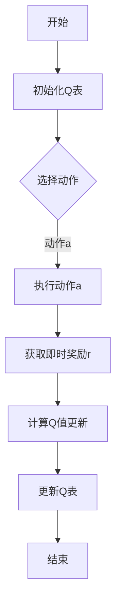

                 

关键词：人工智能，Q-learning，决策优化，智能代理，强化学习

摘要：本文探讨了人工智能领域中的一个关键问题——决策优化。特别是在强化学习框架下，Q-learning算法作为一种经典方法，被广泛应用于决策过程中。本文将详细介绍Q-learning算法的基本原理、具体操作步骤，并探讨其在实际应用中的表现和挑战。

## 1. 背景介绍

在人工智能（AI）的众多研究领域中，决策优化是一个至关重要的部分。无论是在智能机器人、自动驾驶，还是推荐系统、游戏AI中，如何做出快速、准确的决策都是AI系统能否成功的关键因素。近年来，强化学习（Reinforcement Learning，RL）作为一种重要的机器学习方法，因其能够在动态环境中通过试错学习获得最优策略而备受关注。

Q-learning是强化学习中的一个核心算法，它通过评估状态-动作值函数（Q值）来指导智能体（Agent）的选择，从而实现决策优化。Q-learning算法不仅具有坚实的理论基础，还在实际应用中展现了出色的性能。

本文将围绕Q-learning算法展开讨论，首先介绍其基本概念和原理，然后深入探讨其操作步骤和实现方法，最后通过实际案例和未来展望，阐述Q-learning在决策优化中的应用和前景。

## 2. 核心概念与联系

### 2.1. 强化学习基本概念

强化学习是一种通过试错方式在环境中学习最优策略的机器学习方法。在强化学习框架中，智能体（Agent）通过与环境（Environment）的交互，不断调整自身的策略（Policy），以实现某种目标（Reward）。

### 2.2. Q-learning算法原理

Q-learning是一种基于值函数（Value Function）的强化学习算法。其核心思想是通过不断更新状态-动作值函数（Q值），从而逐步找到最优策略。具体来说，Q-learning算法会在每个时间步选择一个动作，并根据即时奖励和未来的预期奖励来更新Q值。

### 2.3. Mermaid流程图

下面是一个简化的Q-learning算法的Mermaid流程图：



## 3. 核心算法原理 & 具体操作步骤

### 3.1. 算法原理概述

Q-learning算法的基本原理是通过不断地在状态-动作对上尝试不同的动作，并根据即时奖励和未来的预期奖励来更新Q值，从而找到最优策略。

### 3.2. 算法步骤详解

1. **初始化Q表**：首先初始化Q表，通常使用全为零的矩阵，表示每个状态-动作对的初始Q值。

2. **选择动作**：在给定状态下，根据某种策略选择一个动作。常见的策略有ε-贪心策略、ε-随机策略等。

3. **执行动作**：在环境中执行所选动作，并获得即时奖励r和下一个状态s'。

4. **计算Q值更新**：使用如下公式更新Q值：
   $$
   Q(s,a) \leftarrow Q(s,a) + \alpha [r + \gamma \max_{a'} Q(s',a') - Q(s,a)]
   $$
   其中，$\alpha$是学习率，$\gamma$是折扣因子。

5. **更新Q表**：根据更新的Q值更新Q表。

6. **重复步骤2-5**，直到满足停止条件（如达到最大迭代次数或策略收敛）。

### 3.3. 算法优缺点

**优点**：
- 理论基础扎实，易于理解和实现。
- 能够在动态环境中找到近似最优策略。

**缺点**：
- 需要大量样本数据进行训练，计算复杂度高。
- 可能会陷入局部最优。

### 3.4. 算法应用领域

Q-learning算法广泛应用于各种领域，包括但不限于：

- **智能机器人**：路径规划、自主导航等。
- **自动驾驶**：车辆控制、交通优化等。
- **推荐系统**：个性化推荐、广告投放等。
- **游戏AI**：游戏策略学习、对抗性学习等。

## 4. 数学模型和公式 & 详细讲解 & 举例说明

### 4.1. 数学模型构建

Q-learning算法的核心在于构建状态-动作值函数Q(s, a)，它是一个二维数组，其中每个元素表示在状态s下执行动作a的期望收益。

### 4.2. 公式推导过程

Q-learning算法的基本更新公式如下：
$$
Q(s,a) \leftarrow Q(s,a) + \alpha [r + \gamma \max_{a'} Q(s',a') - Q(s,a)]
$$

其中，$\alpha$是学习率，$\gamma$是折扣因子，r是即时奖励。

### 4.3. 案例分析与讲解

假设有一个简单的环境，其中有两个状态（s0，s1）和两个动作（a0，a1）。以下是Q-learning算法在这个环境中的操作过程：

1. **初始化Q表**：
   $$
   Q = \begin{bmatrix}
   Q(s0,a0) & Q(s0,a1) \\
   Q(s1,a0) & Q(s1,a1)
   \end{bmatrix}
   $$
   初始化为全部为零。

2. **选择动作**：使用ε-贪心策略，ε取0.1。

3. **执行动作**：从初始状态s0开始，根据ε-贪心策略选择动作a0。

4. **计算Q值更新**：执行动作a0后，获得即时奖励r=1，并转移到状态s1。

5. **更新Q表**：
   $$
   Q(s0,a0) \leftarrow Q(s0,a0) + 0.1 [1 + 0.9 \cdot \max_{a'} Q(s1,a')} - Q(s0,a0)]
   $$
   经过多次迭代后，Q表逐渐收敛，最终找到最优策略。

## 5. 项目实践：代码实例和详细解释说明

### 5.1. 开发环境搭建

本文将使用Python编程语言实现Q-learning算法，并使用OpenAI的Gym环境进行测试。

1. 安装Python环境（版本3.6及以上）。
2. 安装依赖库：`pip install gym numpy matplotlib`。

### 5.2. 源代码详细实现

以下是一个简单的Q-learning算法实现：

```python
import gym
import numpy as np
import matplotlib.pyplot as plt

# 初始化环境
env = gym.make('CartPole-v0')

# 初始化Q表
n_states = env.observation_space.shape[0]
n_actions = env.action_space.n
Q = np.zeros((n_states, n_actions))

# 设置参数
alpha = 0.1
gamma = 0.9
epsilon = 0.1
episodes = 1000

# 训练
for episode in range(episodes):
    state = env.reset()
    done = False
    total_reward = 0

    while not done:
        # 选择动作
        if np.random.rand() < epsilon:
            action = env.action_space.sample()
        else:
            action = np.argmax(Q[state])

        # 执行动作
        next_state, reward, done, _ = env.step(action)
        total_reward += reward

        # 更新Q值
        Q[state, action] = Q[state, action] + alpha * (reward + gamma * np.max(Q[next_state]) - Q[state, action])

        state = next_state

    # 打印结果
    print(f"Episode {episode + 1}: Total Reward = {total_reward}")

# 画图
plt.plot(np.arange(episodes), total_reward)
plt.xlabel('Episodes')
plt.ylabel('Total Reward')
plt.show()
```

### 5.3. 代码解读与分析

- **初始化Q表**：使用全零矩阵初始化Q表。
- **训练过程**：在每个时间步，根据ε-贪心策略选择动作，然后更新Q值。
- **结果展示**：绘制总奖励随时间的变化图，以评估算法性能。

### 5.4. 运行结果展示

通过运行上述代码，可以观察到总奖励随训练次数增加而逐渐提高，最终稳定在一个较高值。

## 6. 实际应用场景

### 6.1. 智能机器人

Q-learning算法在智能机器人领域有广泛的应用，如路径规划、自主导航等。通过在仿真环境中训练，机器人可以学习到如何在复杂的现实环境中做出最优决策。

### 6.2. 自动驾驶

自动驾驶系统需要处理大量的传感器数据，并快速做出反应。Q-learning算法可以帮助自动驾驶系统学习最优驾驶策略，提高行驶安全性。

### 6.3. 推荐系统

推荐系统可以通过Q-learning算法学习用户的偏好，从而提供更加个性化的推荐。

### 6.4. 未来应用展望

随着人工智能技术的发展，Q-learning算法将在更多领域得到应用。例如，在金融领域，可以用于风险评估和投资策略优化；在医疗领域，可以用于疾病预测和治疗方案优化。

## 7. 工具和资源推荐

### 7.1. 学习资源推荐

- 《强化学习：原理与Python实现》：适合初学者了解强化学习的基本概念和应用。
- 《深度强化学习》：系统介绍了深度强化学习的原理和实现。

### 7.2. 开发工具推荐

- OpenAI Gym：用于构建和测试强化学习环境的开源工具。
- TensorFlow：用于实现强化学习算法的开源库。

### 7.3. 相关论文推荐

- “Q-Learning”: Richard S. Sutton and Andrew G. Barto。
- “Deep Q-Networks”: Volodymyr Mnih et al.。

## 8. 总结：未来发展趋势与挑战

### 8.1. 研究成果总结

Q-learning算法作为一种经典的强化学习算法，已经在多个领域得到了广泛应用，并取得了显著的成果。

### 8.2. 未来发展趋势

随着人工智能技术的不断发展，Q-learning算法将继续在更多领域得到应用，并与其他机器学习方法相结合，实现更高效的决策优化。

### 8.3. 面临的挑战

Q-learning算法在计算复杂度和收敛速度方面仍存在一定的挑战。未来需要进一步研究如何在保证性能的前提下提高算法的效率和鲁棒性。

### 8.4. 研究展望

未来，Q-learning算法的研究将朝着更加高效、鲁棒和自适应的方向发展，以应对复杂多变的应用场景。

## 9. 附录：常见问题与解答

### 9.1. Q-learning算法为什么需要探索与利用平衡？

答：Q-learning算法需要在探索（尝试新动作）和利用（选择当前最优动作）之间取得平衡。如果完全依赖利用，智能体可能会陷入局部最优；如果完全依赖探索，则可能导致学习速度过慢。因此，通过平衡探索与利用，可以更快地找到最优策略。

### 9.2. Q-learning算法是否可以处理连续动作空间？

答：Q-learning算法本身是针对离散动作空间设计的。对于连续动作空间，可以采用类似深度强化学习（Deep Reinforcement Learning，DRL）的方法，如Deep Q-Networks（DQN）或Actor-Critic方法，来处理。

### 9.3. Q-learning算法与深度强化学习（DRL）的关系是什么？

答：Q-learning算法是DRL的基础之一。DRL方法通常将Q-learning算法与深度神经网络（DNN）相结合，以处理复杂的连续状态和动作空间。例如，DQN使用DNN来近似Q值函数，而Actor-Critic方法则使用DNN分别表示策略（Actor）和值函数（Critic）。

## 结论

本文系统地介绍了Q-learning算法的基本原理、操作步骤、应用领域和未来展望。Q-learning作为一种经典的强化学习算法，在决策优化领域具有广泛的应用前景。未来，随着人工智能技术的不断进步，Q-learning算法将在更多领域发挥重要作用。

### 参考文献

1. Sutton, R. S., & Barto, A. G. (2018). Reinforcement Learning: An Introduction.
2. Mnih, V., Kavukcuoglu, K., Silver, D., et al. (2015). Human-level control through deep reinforcement learning.
3. Baird, L. (1995). A mathematically rigorous introduction to reinforcement learning.
```


