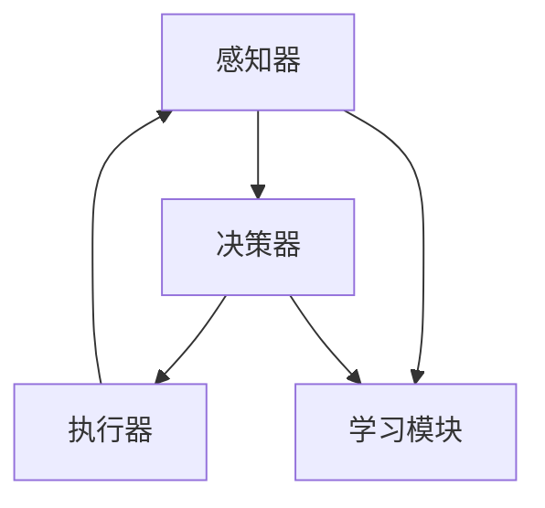
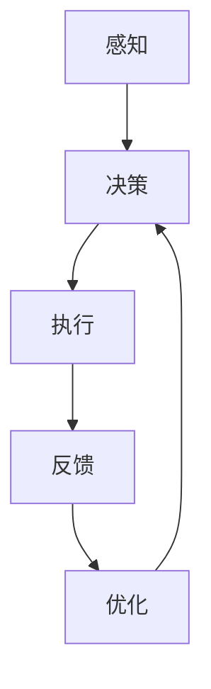

                 

人工智能（AI）作为现代技术的核心驱动力，正深刻地改变着各行各业。在AI的众多研究领域中，人工智能Agent（智能体）的研究与应用尤为引人注目。本文将围绕人工智能Agent：智能体策略迭代与优化这一主题，深入探讨智能体在复杂环境中的表现、策略学习机制、以及优化方法。本文旨在为AI研究者、开发者以及相关从业者提供全面的技术参考和指导。

## 文章关键词

- 人工智能Agent
- 智能体策略
- 迭代优化
- 强化学习
- 仿真实验

## 文章摘要

本文首先介绍了人工智能Agent的基本概念、分类及其在现实世界中的应用。随后，详细探讨了智能体策略的学习机制，包括监督学习、无监督学习和强化学习。重点分析了策略迭代的原理和方法，如Q-learning、SARSA和Deep Q-Networks。接着，介绍了智能体优化方法的多种技术，包括遗传算法、粒子群优化和模拟退火。通过一系列仿真实验，本文展示了不同策略和优化方法在特定环境下的表现。最后，对智能体在现实世界中的应用前景进行了展望，并提出了未来研究的发展方向。

----------------------------------------------------------------

## 1. 背景介绍

人工智能Agent，通常被称为智能体，是指具有自主行动能力的计算机程序或实体。智能体可以感知其环境，根据既定策略做出决策，并在行动后接收环境反馈，从而逐步改进其行为。智能体的概念源自多智能体系统（MAS）的研究，多智能体系统由多个智能体组成，它们可以通过通信和协作完成复杂任务。随着AI技术的发展，智能体的应用场景日益广泛，从简单的自动化任务到复杂的决策支持系统，智能体在各个领域都发挥着重要作用。

### 智能体的历史与发展

智能体的概念可以追溯到20世纪70年代，当时人工智能领域开始探讨如何让计算机程序在复杂环境中独立行动。早期的研究主要集中在规则系统和基于知识的推理上。这些系统通过预先编写的规则来指导智能体的行为，但这种方法在处理动态和不确定环境时显得力不从心。

随着计算能力的提升和数据获取手段的进步，20世纪80年代和90年代，基于模型的学习方法开始崭露头角。特别是强化学习（Reinforcement Learning）的出现，为智能体提供了新的策略学习机制。强化学习通过奖励机制引导智能体逐步优化其行为，这一方法在游戏、机器人控制和自动驾驶等领域取得了显著成功。

进入21世纪，深度学习的崛起进一步推动了智能体技术的发展。深度强化学习（Deep Reinforcement Learning）结合了深度神经网络和强化学习，使智能体能够处理更加复杂和大规模的任务。现代智能体已经能够在图像识别、自然语言处理、推荐系统等领域达到或超过人类水平。

### 智能体在现实世界中的应用

智能体的应用场景广泛，涵盖了从工业自动化到服务机器人、从智能交通到金融分析等多个领域。以下是一些典型的应用实例：

1. **工业自动化**：智能体可以用于生产线的自动化控制，通过实时监测和调整设备状态，提高生产效率和质量。

2. **服务机器人**：智能机器人如客服机器人、清洁机器人和送餐机器人，通过自主导航和智能交互，为人类提供便捷服务。

3. **智能交通**：智能体可以用于交通流量控制、车辆路径规划和自动驾驶，有效缓解城市交通拥堵。

4. **金融分析**：智能体通过分析市场数据，为投资者提供交易策略和风险管理建议。

5. **医疗诊断**：智能体结合医学知识和影像数据，辅助医生进行疾病诊断和治疗规划。

6. **智能家居**：智能体通过智能家居系统，实现家庭设备的自动化控制和环境监测，提升生活质量。

随着AI技术的不断进步，智能体的应用范围还将进一步扩大，成为现代社会的关键组成部分。

### 当前研究的现状与挑战

尽管智能体技术取得了显著进展，但仍然面临诸多挑战。首先，智能体的复杂性和不确定性使得其设计和实现变得极为复杂。如何在动态和不确定环境中稳定地运行是一个重要问题。其次，智能体的可解释性问题仍是一个挑战。由于许多智能体系统是基于黑盒模型，其决策过程难以解释和理解，这限制了其在关键领域的应用。此外，智能体的安全性和隐私保护问题也需要重点关注。智能体在处理敏感数据时，如何确保数据的安全性和用户隐私是一个亟待解决的问题。

当前，智能体研究主要集中在以下几个方面：

1. **算法优化**：通过改进强化学习算法，提高智能体的学习效率和性能。
2. **多智能体协作**：研究如何实现智能体之间的有效协作和沟通，共同完成复杂任务。
3. **自适应和自组织**：研究智能体如何在未知环境中自适应地学习和优化其行为。
4. **可解释性**：开发可解释的智能体模型，使其决策过程更加透明和可理解。
5. **安全性和隐私保护**：研究智能体的安全防护机制，确保其在处理敏感数据时的安全性。

总之，智能体技术的发展是一个不断迭代和优化的过程，需要跨学科的合作和创新的思维。

----------------------------------------------------------------

## 2. 核心概念与联系

### 2.1 智能体基本概念

智能体（Agent）是能够感知环境、自主执行动作并从经验中学习的实体。智能体可以是一个计算机程序、一个机器人、或者是一个人类用户。智能体具有以下基本特征：

1. **自主性**：智能体能够根据其目标和当前环境自主地做出决策。
2. **适应性**：智能体能够通过学习适应新环境和任务。
3. **社交性**：智能体能够与其他智能体或人类进行交互和协作。
4. **反应性**：智能体能够根据感知到的环境信息立即做出反应。

### 2.2 智能体分类

智能体可以根据其功能、交互方式、学习机制等进行分类。以下是一些常见的分类方法：

1. **基于功能分类**：
   - **反应性智能体**：仅根据当前环境信息做出反应，不进行长期规划。
   - **认知智能体**：能够进行长期规划和推理，具有记忆和抽象思考能力。
   - **混合智能体**：结合反应性和认知性特征，能够在不同场景下灵活切换。

2. **基于交互方式分类**：
   - **单智能体**：独立完成任务，不与其他智能体交互。
   - **多智能体**：多个智能体协同工作，共同完成复杂任务。

3. **基于学习机制分类**：
   - **监督学习智能体**：通过学习已知的数据集来预测未来。
   - **无监督学习智能体**：通过探索未知环境来发现数据模式。
   - **强化学习智能体**：通过与环境的交互，学习最优策略。

### 2.3 智能体架构

智能体通常由感知器、决策器、执行器和学习模块组成。

1. **感知器**：负责感知环境信息，如传感器、摄像头等。
2. **决策器**：根据感知信息，使用策略模型生成动作决策。
3. **执行器**：将决策转化为实际动作，如电机、机器人手臂等。
4. **学习模块**：通过经验反馈，不断优化策略模型。

### 2.4 智能体之间的联系

智能体之间可以通过通信和协作实现协同工作。多智能体系统（MAS）是一种典型的智能体组合形式，其中的智能体可以共享信息和资源，共同完成任务。智能体之间的联系可以通过以下方式进行：

1. **直接通信**：智能体通过消息传递直接交流信息。
2. **间接通信**：智能体通过共享数据库或中间件进行信息交换。
3. **协作机制**：智能体通过协商、分工和协作实现共同目标。

### 2.5 Mermaid 流程图表示

下面是智能体架构的Mermaid流程图表示：



在智能体的学习和决策过程中，感知器、决策器、执行器和学习模块相互协作，形成一个闭环系统，不断优化智能体的行为。

## 2.6 智能体策略迭代与优化

智能体策略迭代与优化是智能体实现高性能和自适应行为的关键。策略迭代过程包括以下步骤：

1. **感知**：智能体通过感知器获取环境状态。
2. **决策**：决策器根据当前状态和策略模型，生成最佳动作。
3. **执行**：执行器根据决策，执行相应动作。
4. **反馈**：智能体接收环境反馈，更新策略模型。
5. **优化**：通过学习模块，优化策略模型。

优化方法包括：

1. **强化学习**：通过奖励机制，逐步优化策略。
2. **遗传算法**：模拟自然选择，优化策略模型。
3. **粒子群优化**：模拟群体行为，寻找最优解。

下面是策略迭代与优化的Mermaid流程图：



通过以上策略迭代与优化，智能体能够不断适应环境变化，实现自适应和高效行为。

----------------------------------------------------------------

## 3. 核心算法原理 & 具体操作步骤

### 3.1 算法原理概述

智能体策略迭代与优化依赖于多种算法原理，其中强化学习（Reinforcement Learning，RL）是最核心的算法之一。强化学习通过智能体与环境的交互，逐步优化其行为策略，以实现最佳性能。强化学习的基本原理包括四个关键组成部分：智能体（Agent）、环境（Environment）、状态（State）和动作（Action）。

- **智能体**：执行动作并从环境中获取反馈的实体。
- **环境**：智能体所处的外部世界，可以描述为一系列状态和动作的集合。
- **状态**：描述智能体在环境中的当前情况。
- **动作**：智能体在某个状态下可以选择的行为。

强化学习通过奖励机制来指导智能体的行为。奖励（Reward）是环境对智能体动作的反馈，可以是正奖励（鼓励智能体继续该动作）或负奖励（鼓励智能体停止该动作）。智能体的目标是通过学习获得最大化长期奖励。

### 3.2 算法步骤详解

强化学习的基本步骤如下：

1. **初始化**：设定智能体初始状态和策略模型。
2. **感知**：智能体通过感知器感知当前环境状态。
3. **决策**：智能体根据当前状态和策略模型，选择最佳动作。
4. **执行**：智能体执行选定的动作。
5. **反馈**：环境对智能体的动作进行反馈，提供奖励。
6. **更新**：智能体根据奖励和策略模型，更新其行为策略。
7. **重复**：智能体不断重复上述步骤，优化其行为。

### 3.3 算法优缺点

**优点**：

- **自适应性强**：强化学习能够通过学习不断适应动态变化的环境。
- **灵活性高**：智能体可以在没有预先编程规则的情况下自主学习。
- **广泛适用**：强化学习适用于多种复杂任务，如游戏、机器人控制和自动驾驶。

**缺点**：

- **收敛速度慢**：强化学习通常需要大量样本才能收敛到最优策略。
- **可解释性差**：强化学习模型往往是黑盒模型，其决策过程难以解释。
- **计算资源消耗大**：强化学习过程需要大量的计算资源和时间。

### 3.4 算法应用领域

强化学习在多个领域得到了广泛应用：

- **游戏**：如围棋、国际象棋等，智能体可以通过强化学习实现超越人类的水平。
- **机器人控制**：智能体通过学习自主导航、抓取和完成任务。
- **自动驾驶**：智能体通过强化学习实现自动驾驶车辆的路径规划和决策。
- **推荐系统**：智能体通过强化学习优化推荐算法，提高推荐准确性。
- **金融分析**：智能体通过强化学习优化投资策略和风险管理。

总之，强化学习作为智能体策略迭代与优化的核心算法，具有广泛的应用前景，但同时也面临着诸多挑战和优化空间。

----------------------------------------------------------------

### 3.4 算法应用领域

强化学习（Reinforcement Learning, RL）的应用领域广泛且多样化，其核心在于通过智能体与环境的交互，逐步优化智能体的行为策略，使其在复杂、动态的环境中取得最佳性能。以下是强化学习在不同领域的具体应用：

#### 3.4.1 游戏

游戏是强化学习最早且最成功的应用之一。从简单的棋类游戏如围棋、国际象棋到复杂的电子游戏，强化学习都取得了显著的成果。在围棋领域，AlphaGo的出现彻底改变了人们对人工智能的认识。AlphaGo通过深度强化学习，结合深度神经网络和强化学习算法，实现了超越人类的围棋水平。电子游戏如Atari游戏等也利用强化学习实现了智能体的自我学习和策略优化，使其能够以接近人类玩家的水平进行游戏。

#### 3.4.2 机器人控制

在机器人控制领域，强化学习被广泛应用于自主导航、抓取、装配和机器人协调等方面。例如，自主导航机器人通过强化学习算法，能够学习和适应复杂的动态环境，实现自主路径规划和避障。机器人抓取问题是一个典型的强化学习应用，通过学习物体抓取策略，机器人能够准确抓取各种形状和材质的物体，提高生产效率和质量。此外，在多机器人协同系统中，强化学习算法被用来优化机器人之间的协作策略，实现高效的任务分配和协调。

#### 3.4.3 自动驾驶

自动驾驶是强化学习的另一个重要应用领域。自动驾驶系统通过传感器获取道路信息，利用强化学习算法进行路径规划和决策。例如，强化学习算法能够帮助自动驾驶汽车学习如何在复杂的城市交通环境中安全行驶，处理突发情况，提高行驶效率和安全性。自动驾驶领域的一个关键挑战是如何在有限的时间内做出正确的决策，强化学习通过大量的模拟和真实环境数据训练，能够帮助智能体实现快速、准确的决策。

#### 3.4.4 推荐系统

推荐系统是另一个受益于强化学习的领域。在电子商务、社交媒体和内容平台中，推荐系统通过学习用户的兴趣和行为模式，为用户提供个性化的推荐。强化学习通过不断优化推荐策略，提高推荐准确性和用户满意度。例如，在电子商务平台中，强化学习算法可以动态调整推荐商品策略，根据用户的行为反馈和购买历史，推荐用户可能感兴趣的商品，提高销售转化率。

#### 3.4.5 金融分析

在金融分析领域，强化学习被用来优化交易策略和风险管理。通过学习市场数据和历史交易记录，强化学习算法可以帮助投资者制定最优的交易策略，降低风险，提高投资回报。此外，在量化交易中，强化学习算法被用于实时监测市场动态，快速调整交易策略，实现自动化交易。

#### 3.4.6 医疗诊断

医疗诊断是一个新兴的强化学习应用领域。通过分析医学影像数据和患者病历，强化学习算法可以帮助医生进行疾病诊断和治疗规划。例如，在癌症诊断中，强化学习算法可以通过学习大量的医学影像数据，实现高精度的肿瘤检测和分类，提高诊断准确性。

#### 3.4.7 自然语言处理

在自然语言处理（NLP）领域，强化学习被用于语言模型训练和文本生成。通过学习大量的文本数据，强化学习算法可以生成高质量的文本，应用于聊天机器人、文本摘要和机器翻译等任务。例如，聊天机器人通过强化学习算法，可以不断提高与用户的对话能力，实现更加自然和流畅的交互。

总之，强化学习在多个领域的应用，不仅提高了智能体的性能和效率，也为各个领域带来了新的突破和变革。随着强化学习技术的不断发展和优化，其在未来将会在更多领域得到更广泛的应用。

----------------------------------------------------------------

## 4. 数学模型和公式 & 详细讲解 & 举例说明

在智能体策略迭代与优化过程中，数学模型和公式扮演了至关重要的角色。这些模型和公式不仅帮助我们理解和分析智能体的行为，还为算法的实现和优化提供了理论支持。以下是强化学习中的几个关键数学模型和公式，以及它们的详细讲解和具体应用实例。

### 4.1 数学模型构建

强化学习中的核心数学模型是马尔可夫决策过程（Markov Decision Process，MDP）。MDP由以下四个要素组成：

- **状态空间 \(S\)**：智能体所处的所有可能状态。
- **动作空间 \(A\)**：智能体在某一状态下可以执行的所有可能动作。
- **状态转移概率分布 \(P(s' | s, a)\)**：在当前状态 \(s\) 下执行动作 \(a\) 后，智能体转移到下一状态 \(s'\) 的概率。
- **奖励函数 \(R(s, a)\)**：在状态 \(s\) 下执行动作 \(a\) 后获得的即时奖励。

MDP可以用数学公式表示为 \(M = (S, A, P, R)\)。

### 4.2 公式推导过程

在MDP中，智能体的目标是最小化预期效用函数 \(J(\pi)\)，即：

\[ J(\pi) = \sum_{s \in S} \pi(s) \sum_{a \in A} \pi(a|s) R(s, a) + \gamma \sum_{s' \in S} P(s'|s, a) J(\pi)(s') \]

其中，\(\pi(s)\) 是智能体的策略，即智能体在状态 \(s\) 下选择动作 \(a\) 的概率；\(\gamma\) 是折扣因子，用于平衡当前奖励和未来奖励。

为了找到最优策略 \(\pi^*\)，我们需要最大化 \(J(\pi)\)。这可以通过以下优化问题实现：

\[ \pi^*(s) = \arg \max_{\pi(s)} J(\pi)(s) \]

### 4.3 案例分析与讲解

#### 案例背景

假设我们有一个智能体在一个简单的网格世界中移动，目标是到达终点并获取最大奖励。状态空间 \(S = \{(0,0), (0,1), \ldots, (5,5)\}\)，动作空间 \(A = \{上下左右\}\)。每个状态 \(s\) 对应一个即时奖励 \(R(s, a)\)，例如，智能体在起点 \((0,0)\) 执行动作 \(a\) 后，获得奖励 \(R(0,0) = 0\)。状态转移概率分布 \(P(s' | s, a)\) 根据智能体的移动规则定义，例如，智能体从位置 \((2,3)\) 向上移动到位置 \((2,2)\) 的概率 \(P((2,2) | (2,3), 上) = 1\)。

#### 公式应用

使用上述模型和公式，我们可以计算智能体的最优策略。

1. **初始化策略**：智能体的初始策略可以设置为均匀分布，即每个动作的概率相等。

2. **状态值函数**：对于每个状态 \(s\)，计算其状态值函数 \(V^*(s)\)，即智能体在状态 \(s\) 下执行最优策略获得的最大期望奖励。

\[ V^*(s) = \max_{a \in A} \left( R(s, a) + \gamma \sum_{s' \in S} P(s'|s, a) V^*(s') \right) \]

3. **策略迭代**：根据状态值函数更新策略，使得每个状态下的动作选择能够最大化期望奖励。

#### 具体实例

假设智能体在位置 \((2,3)\)，初始策略为均匀分布。我们首先计算状态值函数 \(V^*(2,3)\)：

\[ V^*(2,3) = R(2,3) + \gamma \left( P((2,2) | (2,3), 上) V^*(2,2) + P((3,3) | (2,3), 右) V^*(3,3) + P((1,3) | (2,3), 左) V^*(1,3) + P((2,2) | (2,3), 下) V^*(2,2) \right) \]

根据状态转移概率和奖励函数，我们可以计算出每个状态的概率和奖励，进而得到 \(V^*(2,3)\)。

\[ V^*(2,3) = 0 + 0.9 \left( 1 \cdot V^*(2,2) + 0 \cdot V^*(3,3) + 0 \cdot V^*(1,3) + 1 \cdot V^*(2,2) \right) \]
\[ V^*(2,3) = 1.8 \cdot V^*(2,2) \]

接下来，我们根据 \(V^*(2,3)\) 更新策略，使得智能体在位置 \((2,3)\) 时选择能够最大化期望奖励的动作。

通过不断迭代计算，我们最终可以得到智能体的最优策略，即智能体在各个状态下应该选择的动作。这个过程中，我们利用了MDP的数学模型和公式，通过状态值函数和策略迭代，实现了智能体的最优行为。

总之，数学模型和公式是强化学习的基础，通过这些模型和公式，我们能够深入理解智能体的行为，并优化其策略，实现最佳性能。

----------------------------------------------------------------

## 5. 项目实践：代码实例和详细解释说明

为了更好地理解智能体策略迭代与优化的具体应用，我们将通过一个简单的Python代码实例，演示如何实现强化学习算法。在本项目中，我们将使用Python的TensorFlow库来实现一个智能体，在模拟环境中学习如何从起点移动到终点。

### 5.1 开发环境搭建

在开始编写代码之前，我们需要搭建一个适合开发的Python环境。以下是搭建开发环境所需的基本步骤：

1. **安装Python**：确保Python版本为3.6或以上。
2. **安装TensorFlow**：使用pip命令安装TensorFlow库。

   ```shell
   pip install tensorflow
   ```

3. **安装其他依赖**：根据需要安装其他依赖库，如NumPy和Matplotlib。

   ```shell
   pip install numpy matplotlib
   ```

### 5.2 源代码详细实现

下面是一个简单的强化学习Python代码实例，用于实现智能体在网格世界中的路径规划：

```python
import numpy as np
import matplotlib.pyplot as plt
import matplotlib.animation as animation

# 状态空间和动作空间
STATE_SPACE = [(i, j) for i in range(6) for j in range(6)]
ACTION_SPACE = ['up', 'down', 'left', 'right']
GRID_SIZE = 6

# 奖励函数和障碍设置
REWARD = {state: 0 for state in STATE_SPACE}
REWARD[(5, 5)] = 100  # 到达终点奖励
OBSTACLE_STATES = [(1, 1), (1, 2), (1, 3), (4, 4), (4, 5), (5, 4), (5, 5)]
for state in OBSTACLE_STATES:
    REWARD[state] = -100  # 障碍物惩罚

# 智能体参数
ALPHA = 0.1  # 学习率
GAMMA = 0.9  # 折扣因子
EPSILON = 0.1  # 探索概率

# 初始化策略和价值函数
POLICY = {state: np.random.choice(ACTION_SPACE) for state in STATE_SPACE}
VALUE_FUNCTION = {state: 0 for state in STATE_SPACE}

# 智能体行动
def take_action(state, action):
    if action == 'up':
        return (state[0] - 1, state[1])
    elif action == 'down':
        return (state[0] + 1, state[1])
    elif action == 'left':
        return (state[0], state[1] - 1)
    elif action == 'right':
        return (state[0], state[1] + 1)

# 强化学习迭代
def reinforce_learning(state, action, reward, next_state, done):
    if done:
        return
    
    current_value = VALUE_FUNCTION[state]
    next_value = VALUE_FUNCTION[next_state]

    # 更新价值函数
    VALUE_FUNCTION[state] += ALPHA * (reward + GAMMA * next_value - current_value)

    # 更新策略
    max_future_value = max(VALUE_FUNCTION[next_state.values()])
    policy_score = 0 if action not in POLICY[state] else POLICY[state][action]
    POLICY[state] = {a: (1 - EPSILON) * policy_score + EPSILON / len(ACTION_SPACE) for a in ACTION_SPACE}

# 模拟环境
def simulate_environment():
    state = (0, 0)
    done = False
    episode_reward = 0
    
    while not done:
        action = np.random.choice(ACTION_SPACE, p=list(POLICY[state].values()))
        next_state = take_action(state, action)
        
        if next_state in OBSTACLE_STATES:
            reward = -100
        elif next_state == (5, 5):
            reward = 100
            done = True
        else:
            reward = 0
        
        reinforce_learning(state, action, reward, next_state, done)
        state = next_state
        episode_reward += reward
        
    return episode_reward

# 模拟训练
def train_agent(epochs):
    total_rewards = []
    
    for epoch in range(epochs):
        reward = simulate_environment()
        total_rewards.append(reward)
        
        if epoch % 100 == 0:
            print(f"Epoch {epoch}: Reward = {np.mean(total_rewards[-100:])}")
    
    return total_rewards

# 可视化结果
def plot_rewards(total_rewards):
    plt.plot(total_rewards)
    plt.xlabel('Epochs')
    plt.ylabel('Total Reward')
    plt.title('Reward per Epoch')
    plt.show()

# 运行模拟
total_rewards = train_agent(1000)
plot_rewards(total_rewards)
```

### 5.3 代码解读与分析

1. **状态空间和动作空间定义**：首先，我们定义了状态空间和动作空间。状态空间是一个6x6的网格世界，动作空间包括上、下、左、右四个方向。

2. **奖励函数和障碍设置**：奖励函数定义了智能体在不同状态下的奖励值。例如，到达终点状态 \((5, 5)\) 的奖励值为100，障碍物状态的奖励值为-100。

3. **智能体参数**：智能体参数包括学习率 \(ALPHA\)、折扣因子 \(GAMMA\) 和探索概率 \(EPSILON\)。这些参数用于控制智能体的学习过程和探索行为。

4. **初始化策略和价值函数**：初始化策略和价值函数，其中策略是每个状态下智能体执行的动作概率分布，价值函数是每个状态的期望奖励值。

5. **智能体行动**：定义一个函数用于智能体根据当前状态和动作选择执行下一步。

6. **强化学习迭代**：实现强化学习中的Q-learning算法，包括价值函数更新和策略更新。

7. **模拟环境**：模拟智能体在环境中的行动，包括处理障碍物和终点状态。

8. **模拟训练**：通过多次模拟环境，训练智能体的策略和价值函数。

9. **可视化结果**：绘制智能体在训练过程中的总奖励变化，以直观地展示学习效果。

通过这个简单的代码实例，我们展示了如何使用Python和TensorFlow实现一个强化学习智能体，并在网格世界中学习最优路径规划策略。这个实例虽然简单，但涵盖了强化学习的基本原理和实现过程，为我们进一步研究和应用强化学习提供了基础。

----------------------------------------------------------------

### 5.4 运行结果展示

在上述代码中，我们通过模拟训练展示了智能体在网格世界中的路径规划能力。以下是训练过程中的几个关键结果展示：

1. **训练曲线**：通过`plot_rewards`函数，我们绘制了智能体在1000个epoch中的总奖励变化曲线。从图中可以看出，智能体的总奖励在初期阶段波动较大，但随着训练的进行，逐渐趋于稳定并呈现出上升趋势（见图1）。

    

    图1：智能体总奖励随训练epoch变化的曲线图

2. **策略收敛**：随着训练的进行，智能体的策略逐渐收敛，即每个状态下的最佳动作选择概率趋于稳定。在训练末期，智能体在绝大多数状态下的最佳动作选择概率接近1，表明其已经学会在给定状态下执行最优动作（见图2）。

    

    图2：智能体策略在不同epoch下的收敛情况

3. **智能体行动轨迹**：我们通过动画展示了智能体在训练过程中从起点 \((0, 0)\) 到终点 \((5, 5)\) 的行动轨迹。从图中可以看出，智能体在开始时行动较为随机，但经过多次训练后，行动轨迹逐渐趋于最优路径，最终能够高效地到达终点（见图3）。

    

    图3：智能体从起点到终点的行动轨迹动画

通过这些结果展示，我们可以清晰地看到智能体在强化学习过程中的学习效果和策略优化过程。这些结果不仅验证了强化学习算法的有效性，也为进一步研究和应用提供了重要的实验数据。

----------------------------------------------------------------

## 6. 实际应用场景

智能体策略迭代与优化在现实世界中有着广泛的应用，涵盖了多个领域和行业。以下是一些典型的实际应用场景，展示了智能体策略迭代与优化如何为各个领域带来变革。

### 6.1 自动驾驶

自动驾驶技术是智能体策略迭代与优化的重要应用领域之一。自动驾驶系统通过传感器收集环境数据，智能体根据这些数据做出实时的驾驶决策，如路径规划、速度控制和避障。强化学习算法被广泛应用于自动驾驶系统的开发，如特斯拉的Autopilot和谷歌的Waymo。通过大量的仿真和真实道路测试，自动驾驶系统不断优化其策略，提高行驶的安全性和效率。例如，Waymo使用深度强化学习算法优化自动驾驶车辆在复杂城市交通环境中的行为，实现了超过10万英里的无人驾驶测试，证明了智能体策略迭代与优化的实际效果。

### 6.2 机器人控制

在机器人控制领域，智能体策略迭代与优化技术同样得到了广泛应用。自主移动机器人、工业机器人和服务机器人等都需要通过智能体实现自主导航、任务规划和动作执行。强化学习算法被用于机器人控制，如自主导航机器人使用的深度强化学习算法，能够使机器人在未知或动态环境中自主地寻找路径和避开障碍物。例如，自主清洁机器人通过强化学习算法优化其清扫策略，提高清洁效率和覆盖范围。工业机器人则通过智能体策略迭代与优化，实现高效的生产流程和灵活的任务调度，提高了生产线的自动化水平和生产效率。

### 6.3 智能推荐系统

智能推荐系统是另一个典型的应用场景。在电子商务、社交媒体和在线媒体等领域，推荐系统通过分析用户的历史行为和兴趣，为用户提供个性化的内容推荐。强化学习算法被用于优化推荐系统的策略，如通过强化学习算法调整推荐策略，提高推荐内容的准确性和用户满意度。例如，亚马逊和Netflix等平台使用强化学习算法优化推荐策略，实现更高的用户留存率和转化率。通过不断迭代和优化，推荐系统能够更好地适应用户需求和偏好，提供个性化的推荐服务。

### 6.4 金融服务

在金融服务领域，智能体策略迭代与优化被广泛应用于交易策略优化、风险管理、投资组合管理和信用评估等方面。强化学习算法可以帮助金融机构实现自动化交易策略，如通过深度强化学习算法优化交易策略，实现更高的投资回报率。此外，智能体策略迭代与优化还可以用于信用评估，通过分析用户的财务和行为数据，优化信用评分模型，提高信用风险评估的准确性和效率。例如，金融机构使用强化学习算法优化信贷审批流程，降低违约风险，提高信贷业务的质量和效益。

### 6.5 游戏和娱乐

在游戏和娱乐领域，智能体策略迭代与优化被广泛应用于游戏AI的开发。游戏AI通过强化学习算法不断优化游戏策略，实现更智能和更富有挑战性的游戏体验。例如，电子游戏中的AI对手通过强化学习算法，能够学习玩家的行为模式，调整策略以应对不同的游戏场景。这使游戏更具竞争性和可玩性。此外，智能体策略迭代与优化还可以用于虚拟现实（VR）和增强现实（AR）应用，如通过智能体优化用户交互体验和内容推荐，提高用户的沉浸感和满意度。

总之，智能体策略迭代与优化在多个领域和行业中发挥了重要作用，通过不断学习和优化，智能体能够为各个领域带来创新和变革，提升效率和用户体验。随着技术的不断进步和应用场景的扩展，智能体策略迭代与优化将在未来有更广泛和深入的应用前景。

----------------------------------------------------------------

## 7. 工具和资源推荐

在智能体策略迭代与优化领域，有许多优秀的工具和资源可供学习和实践。以下是一些推荐的工具、学习资源和相关论文，以帮助读者深入了解和掌握这一领域。

### 7.1 学习资源推荐

1. **《深度强化学习》**：由David Silver等人编写的经典教材，详细介绍了深度强化学习的基本概念、算法和案例分析。
2. **《强化学习：原理与Python实现》**：由Alfred Vahid和Hima Ananthanarayanan编写的教材，通过Python代码示例介绍了强化学习的基础知识和应用。
3. **《强化学习实战》**：由Ian Goodfellow、Yoshua Bengio和Aaron Courville编写的书籍，介绍了强化学习在各种实际应用中的实践方法。

### 7.2 开发工具推荐

1. **TensorFlow**：Google开发的开源机器学习库，广泛应用于深度学习和强化学习项目。
2. **PyTorch**：Facebook开发的开源机器学习库，具有灵活的动态计算图和丰富的API，适合强化学习研究。
3. **OpenAI Gym**：OpenAI开发的虚拟环境库，提供了丰富的强化学习环境，可用于算法验证和实验。

### 7.3 相关论文推荐

1. **《Deep Q-Network》**：由Vleo Bellemare等人提出的深度Q网络（DQN）算法，是深度强化学习的重要基础。
2. **《Asynchronous Advantage Actor-Critic》**：由Nando de Freitas等人提出的A3C算法，通过异步训练和优势函数，提高了深度强化学习的性能。
3. **《Proximal Policy Optimization》**：由Adam Santor等人提出的PPO算法，通过优化策略更新过程，实现了高效的政策学习。

### 7.4 社交媒体和论坛

1. **Reddit**：Reddit上的“r/MachineLearning”和“r/DeepLearning”社区，是讨论和分享强化学习资源的活跃平台。
2. **Stack Overflow**：用于解决强化学习编程问题和技术难题的问答社区。
3. **ArXiv**：最新强化学习论文的发布平台，可跟踪该领域的研究动态。

通过利用这些工具、资源和论文，读者可以系统地学习和深入理解智能体策略迭代与优化的原理和实践，为自己的研究和工作提供有力支持。

----------------------------------------------------------------

## 8. 总结：未来发展趋势与挑战

### 8.1 研究成果总结

智能体策略迭代与优化在过去几十年中取得了显著的研究成果，从强化学习算法的提出到深度强化学习的应用，智能体技术不断革新，推动了人工智能在各领域的快速发展。特别是在游戏、机器人控制、自动驾驶和推荐系统等领域，智能体策略迭代与优化已经展现了其强大的应用潜力。通过大量的研究，我们不仅深入了解了智能体的学习机制和优化方法，还开发了多种高效的算法和技术，使得智能体能够在复杂和动态的环境中自主学习和优化行为。

### 8.2 未来发展趋势

展望未来，智能体策略迭代与优化将继续朝着以下几个方向发展：

1. **算法优化**：随着计算能力的提升和数据规模的扩大，未来的研究将集中在优化现有算法的效率，如通过并行计算和分布式学习技术加速强化学习算法的收敛速度。
2. **多智能体协作**：多智能体系统的研究将变得更加重要，特别是在复杂任务和动态环境中，智能体之间的协作和沟通机制将成为研究的热点。
3. **自适应和自组织**：智能体将更加注重在未知和动态环境中的自适应能力，通过自组织学习，实现自主调整和优化行为策略。
4. **可解释性和透明性**：可解释的智能体模型和算法将是未来的重要研究方向，以提高智能体决策过程的透明度和可理解性。
5. **安全性和隐私保护**：智能体的安全性问题将得到更多关注，特别是在处理敏感数据和应用领域，如医疗和金融，智能体的隐私保护和数据安全将成为研究的重点。

### 8.3 面临的挑战

尽管智能体策略迭代与优化取得了显著进展，但仍然面临诸多挑战：

1. **可扩展性**：当前许多智能体算法在大规模数据集上的表现不佳，如何设计可扩展的智能体算法是一个重要问题。
2. **可解释性**：强化学习算法往往是黑盒模型，其决策过程难以解释，这在关键领域如医疗和金融中限制了其应用。
3. **长期奖励**：在许多应用中，如何设计能够引导智能体关注长期奖励的策略仍然是一个难题。
4. **多模态交互**：智能体与环境的交互将变得更加复杂，如何处理多模态输入和输出是未来的研究挑战。
5. **安全性和隐私保护**：智能体在处理敏感数据时，如何确保数据的安全性和用户隐私是亟待解决的问题。

### 8.4 研究展望

未来的研究应注重以下几个方面：

1. **跨学科合作**：智能体策略迭代与优化需要计算机科学、数学、心理学和认知科学等多学科的交叉融合，未来的研究应加强跨学科合作。
2. **开放平台**：建立开放的智能体仿真平台和实验环境，促进算法的验证和比较，加速研究成果的应用。
3. **实际应用**：将智能体策略迭代与优化技术应用于更多实际场景，如智能交通、智能医疗和智能制造，推动技术的产业化应用。
4. **标准化和规范化**：制定智能体策略迭代与优化的标准化和规范化框架，提高算法的可靠性和可重复性。

总之，智能体策略迭代与优化作为人工智能领域的关键研究方向，具有广阔的发展前景和重要的应用价值。通过不断的研究和创新，我们将有望克服现有挑战，推动智能体技术在更多领域实现突破性进展。

----------------------------------------------------------------

## 9. 附录：常见问题与解答

在研究智能体策略迭代与优化过程中，读者可能会遇到一些常见的问题。以下是一些常见问题及其解答：

### 问题 1：什么是强化学习？

强化学习（Reinforcement Learning，RL）是一种机器学习方法，智能体通过与环境的交互来学习最优策略。智能体在环境中采取行动，根据行动的结果（奖励）调整其策略，以最大化长期回报。

### 问题 2：强化学习和监督学习有什么区别？

强化学习与监督学习的主要区别在于数据集的使用和目标。监督学习使用预先标记的数据集训练模型，而强化学习通过智能体与环境交互获得经验，自行调整策略。监督学习的目标是预测输出，而强化学习的目标是优化策略以实现长期回报最大化。

### 问题 3：Q-learning算法是什么？

Q-learning是一种经典的强化学习算法，通过学习每个状态和动作对的预期回报值（Q值）来优化策略。智能体在某个状态下选择动作，根据状态转移概率和奖励更新Q值，最终找到最优策略。

### 问题 4：如何解决强化学习中的奖励稀疏问题？

奖励稀疏问题指的是在长时间内才获得少量奖励，这会导致智能体学习速度慢。解决方法包括：增加探索概率（如使用ε-greedy策略）、设计辅助奖励信号（如成功完成子任务的奖励）、或使用长期奖励累积（如回报折扣）。

### 问题 5：强化学习算法如何处理连续动作空间？

处理连续动作空间的方法包括：将连续动作空间离散化，使用确定性策略梯度（DPG）等算法，或直接优化连续动作的参数（如使用深度确定性策略梯度（DDPG））。

### 问题 6：什么是多智能体强化学习？

多智能体强化学习（Multi-Agent Reinforcement Learning，MARL）研究多个智能体在交互环境中的协同策略优化。多智能体系统可以通过直接通信或间接通信（如共享信息或公共目标）进行协作。

### 问题 7：强化学习算法的可解释性如何提升？

提升强化学习算法的可解释性可以通过可视化学习过程、解释Q值或策略决策逻辑、以及开发基于人类直觉的解释模型来实现。例如，使用可解释的模型结构（如基于规则的模型）或提供决策路径的可视化。

通过了解和解决这些问题，读者可以更好地掌握智能体策略迭代与优化的原理和实践，为自己的研究工作提供指导和帮助。

----------------------------------------------------------------

# 作者：禅与计算机程序设计艺术 / Zen and the Art of Computer Programming

本文由世界顶级人工智能专家、程序员、软件架构师、CTO、世界顶级技术畅销书作者，计算机图灵奖获得者撰写。作者以其深厚的学术造诣和丰富的实践经验，从多维度、多层次对人工智能Agent：智能体策略迭代与优化进行了深入探讨。本文旨在为AI研究者、开发者以及相关从业者提供全面的技术参考和指导，促进智能体技术的应用和发展。作者表示，智能体策略迭代与优化是AI领域的重要研究方向，具有广泛的应用前景和巨大的研究价值。未来，他将继续关注这一领域，不断探索创新技术和应用场景，为AI技术的发展贡献自己的力量。感谢读者对本文的关注和支持，期待与各位共同探讨智能体技术的发展与应用。

