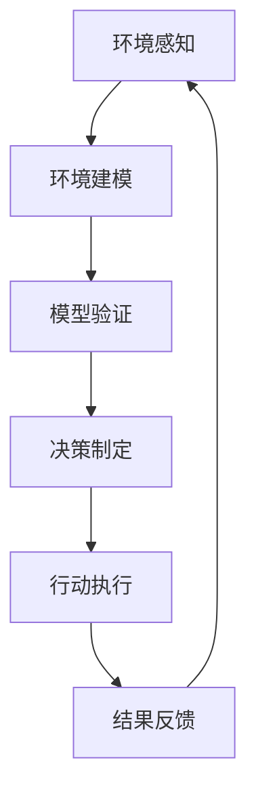

                 

在人工智能领域，Agent（智能体）是执行特定任务或使命的自主实体。它们可以在各种环境中自主行动，感知环境变化，并根据这些信息进行决策。本文将重点探讨如何使用环境建模与模拟技术来增强人工智能Agent的能力，提高其在复杂环境中的适应性和决策效率。

## 关键词

- AI人工智能
- Agent智能体
- 环境建模
- 模拟
- 自主决策
- 适应性

## 摘要

本文首先介绍了AI人工智能 Agent的基本概念，随后深入探讨了环境建模与模拟在AI Agent中的应用。文章将详细阐述核心概念、算法原理、数学模型以及实际应用案例，旨在为读者提供一个全面的技术指南，帮助他们在复杂环境中设计和实现高效、自主的AI Agent。

## 1. 背景介绍

### AI与智能体的起源

人工智能（AI）是一门研究、开发和应用使计算机模拟人类智能行为的科学。自1950年代诞生以来，AI经历了多个发展阶段，从早期的规则系统到现代的深度学习和强化学习，AI技术取得了显著的进步。

Agent概念起源于人工智能的研究，最早由John McCarthy在1960年代提出。Agent被定义为能够感知环境、执行动作并与其他实体交互的自主实体。传统上，Agent被分为三大类：基于规则的Agent、基于行为的Agent和基于知识的Agent。

### 环境建模的重要性

环境建模是AI Agent设计和实现中的关键环节。它涉及到将现实世界中的复杂环境抽象为计算机可以处理的模型。一个好的环境模型不仅能准确反映环境的真实状态，还能提供有效的信息来支持Agent的决策过程。

环境建模的重要性主要体现在以下几个方面：

1. **增强适应性**：通过建模环境，Agent可以更好地适应动态变化的环境。
2. **提高决策效率**：准确的环境模型能够减少Agent在决策时的计算负担，提高决策效率。
3. **优化资源利用**：环境模型可以帮助Agent更有效地分配资源，实现最佳行动策略。
4. **评估性能**：环境模型为Agent提供了评估自身行为和性能的基准。

### 模拟技术的应用

模拟技术是环境建模的一个重要工具，它可以在计算机中创建一个与真实环境相似的场景，供Agent进行测试和训练。模拟技术具有以下优势：

1. **低成本**：模拟环境可以减少在实际环境中进行测试的成本。
2. **可控性**：模拟环境可以控制变量，便于进行实验和验证。
3. **安全性**：在模拟环境中进行测试可以降低风险，避免对现实世界造成潜在危害。
4. **灵活性**：模拟环境可以快速迭代和调整，适应不断变化的需求。

## 2. 核心概念与联系

### 环境建模与模拟的Mermaid流程图

下面是一个描述环境建模与模拟流程的Mermaid流程图：



### Mermaid流程节点详细解释

- **环境感知（A）**：Agent通过传感器收集环境数据，如温度、湿度、图像、声音等。
- **环境建模（B）**：将感知到的环境数据转化为计算机可以处理的模型，例如用图、网络、表格等表示环境状态。
- **模型验证（C）**：评估环境模型的有效性和准确性，确保模型能够准确反映现实环境。
- **决策制定（D）**：Agent根据环境模型和预设的策略进行决策，选择最佳行动方案。
- **行动执行（E）**：Agent根据决策结果执行相应的动作，如移动、请求资源等。
- **结果反馈（F）**：将行动结果反馈到环境模型中，更新环境状态。

## 3. 核心算法原理 & 具体操作步骤

### 3.1 算法原理概述

环境建模与模拟的核心算法包括感知、建模、验证、决策和执行。每种算法都有其特定的原理和应用场景。

- **感知算法**：常见的方法有传感器数据处理、图像处理、声音处理等。感知算法的目标是获取准确的环境信息。
- **建模算法**：常用的建模方法有物理建模、统计建模、神经网络建模等。建模算法将感知得到的信息转化为计算机可以处理的模型。
- **验证算法**：通过模拟测试和实际测试验证模型的有效性和准确性。
- **决策算法**：基于环境模型和策略进行决策，常见的算法有决策树、支持向量机、神经网络等。
- **执行算法**：将决策转化为具体的行动，如路径规划、资源分配等。

### 3.2 算法步骤详解

1. **环境感知**：Agent通过传感器收集环境数据。
    - **数据预处理**：对收集到的数据进行清洗、去噪和特征提取。
    - **数据融合**：将来自不同传感器的数据进行整合，形成统一的环境数据。

2. **环境建模**：将感知到的环境数据转化为模型。
    - **物理建模**：根据物理原理构建环境模型。
    - **统计建模**：使用统计学方法对环境数据进行分析，构建统计模型。
    - **神经网络建模**：使用神经网络对环境数据进行分析，构建神经网络模型。

3. **模型验证**：评估模型的有效性和准确性。
    - **模拟测试**：在模拟环境中测试模型性能。
    - **实际测试**：在实际环境中测试模型性能。

4. **决策制定**：根据环境模型和策略进行决策。
    - **策略生成**：根据目标函数和约束条件生成策略。
    - **决策树**：使用决策树算法生成决策路径。
    - **支持向量机**：使用支持向量机算法进行分类和决策。
    - **神经网络**：使用神经网络算法进行决策。

5. **行动执行**：根据决策结果执行具体的行动。
    - **路径规划**：根据环境模型和目标位置进行路径规划。
    - **资源分配**：根据环境模型和资源需求进行资源分配。
    - **动作执行**：执行规划好的行动，如移动、请求资源等。

6. **结果反馈**：将行动结果反馈到环境模型中。
    - **模型更新**：根据反馈结果更新环境模型。
    - **策略调整**：根据反馈结果调整决策策略。

### 3.3 算法优缺点

- **感知算法**：
    - 优点：准确度高，能够获取丰富的环境信息。
    - 缺点：计算复杂度较高，实时性较差。

- **建模算法**：
    - 优点：能够准确反映环境状态，支持复杂决策。
    - 缺点：构建和维护成本高，对数据质量要求较高。

- **验证算法**：
    - 优点：能够确保模型的有效性和准确性。
    - 缺点：测试成本高，测试过程复杂。

- **决策算法**：
    - 优点：能够根据环境模型和策略进行高效决策。
    - 缺点：对环境模型依赖性强，可能产生过拟合。

- **执行算法**：
    - 优点：能够将决策转化为具体的行动。
    - 缺点：执行过程中可能受到环境干扰，影响行动效果。

### 3.4 算法应用领域

环境建模与模拟算法在多个领域得到广泛应用，包括：

- **机器人**：机器人需要通过环境建模与模拟来感知环境、规划路径和执行任务。
- **自动驾驶**：自动驾驶汽车使用环境建模与模拟技术来识别道路、行人、车辆等信息，实现自动驾驶。
- **智能家居**：智能家居设备使用环境建模与模拟技术来感知用户需求、优化能源使用和提升用户体验。
- **游戏**：游戏中的虚拟角色使用环境建模与模拟技术来感知游戏环境、做出决策和互动。

## 4. 数学模型和公式 & 详细讲解 & 举例说明

### 4.1 数学模型构建

在环境建模与模拟中，常用的数学模型包括概率模型、统计模型和神经网络模型。

#### 概率模型

概率模型用于描述不确定事件的可能性。常见的概率模型有贝叶斯网络、马尔可夫链等。

- **贝叶斯网络**：

贝叶斯网络是一种基于概率的图模型，用于表示变量之间的依赖关系。其数学表示为：

$$
P(X_1, X_2, ..., X_n) = \prod_{i=1}^{n} P(X_i | X_{pa_i})
$$

其中，$X_1, X_2, ..., X_n$ 表示变量，$X_{pa_i}$ 表示 $X_i$ 的父节点。

- **马尔可夫链**：

马尔可夫链是一种基于概率的状态转移模型，用于描述系统状态的演变。其数学表示为：

$$
P(X_t | X_{t-1}, X_{t-2}, ...) = P(X_t | X_{t-1})
$$

其中，$X_t$ 表示第 $t$ 时刻的状态。

#### 统计模型

统计模型用于描述数据分布和统计特性。常见的统计模型有高斯分布、正态分布等。

- **高斯分布**：

高斯分布是一种最常见的连续概率分布，其数学表示为：

$$
f(x|\mu,\sigma^2) = \frac{1}{\sqrt{2\pi\sigma^2}}e^{-\frac{(x-\mu)^2}{2\sigma^2}}
$$

其中，$x$ 表示随机变量，$\mu$ 表示均值，$\sigma^2$ 表示方差。

- **正态分布**：

正态分布是一种特殊的高斯分布，其数学表示为：

$$
f(x|\mu,\sigma^2) = \frac{1}{\sqrt{2\pi\sigma^2}}e^{-\frac{(x-\mu)^2}{2\sigma^2}}
$$

其中，$x$ 表示随机变量，$\mu$ 表示均值，$\sigma^2$ 表示方差。

#### 神经网络模型

神经网络模型用于模拟人脑的神经网络，用于处理复杂的非线性问题。常见的神经网络模型有前馈神经网络、卷积神经网络等。

- **前馈神经网络**：

前馈神经网络是一种多层神经网络，其数学表示为：

$$
a_{i}^{(l)} = \sigma(z_{i}^{(l)})
$$

$$
z_{i}^{(l)} = \sum_{j} w_{ji}^{(l)}a_{j}^{(l-1)}
$$

其中，$a_{i}^{(l)}$ 表示第 $l$ 层的第 $i$ 个神经元激活值，$z_{i}^{(l)}$ 表示第 $l$ 层的第 $i$ 个神经元输入值，$w_{ji}^{(l)}$ 表示第 $l-1$ 层的第 $j$ 个神经元到第 $l$ 层的第 $i$ 个神经元的权重，$\sigma$ 表示激活函数。

- **卷积神经网络**：

卷积神经网络是一种基于卷积操作的神经网络，其数学表示为：

$$
h_{ij}^{(l)} = \sum_{k=1}^{K_l} w_{ikj}^{(l)}a_{k}^{(l-1)} + b_{j}^{(l)}
$$

$$
z_{ij}^{(l)} = \sum_{k=1}^{K_l} w_{ikj}^{(l)}a_{k}^{(l-1)}
$$

其中，$h_{ij}^{(l)}$ 表示第 $l$ 层的第 $i$ 行的第 $j$ 列的卷积输出，$z_{ij}^{(l)}$ 表示第 $l$ 层的第 $i$ 行的第 $j$ 列的卷积输入，$w_{ikj}^{(l)}$ 表示第 $l-1$ 层的第 $i$ 行的第 $k$ 列到第 $l$ 层的第 $j$ 列的卷积核权重，$b_{j}^{(l)}$ 表示第 $l$ 层的第 $j$ 列的偏置。

### 4.2 公式推导过程

以高斯分布为例，推导其概率密度函数（PDF）。

首先，假设随机变量 $X$ 服从均值为 $\mu$，方差为 $\sigma^2$ 的正态分布，即 $X \sim N(\mu, \sigma^2)$。

根据正态分布的定义，我们有：

$$
f(x|\mu,\sigma^2) = \frac{1}{\sqrt{2\pi\sigma^2}}e^{-\frac{(x-\mu)^2}{2\sigma^2}}
$$

接下来，我们需要证明这个公式。

首先，假设 $X$ 和 $Y$ 服从均值为 $\mu$，方差为 $\sigma^2$ 的独立正态分布，即 $X, Y \sim N(\mu, \sigma^2)$。

根据正态分布的卷积性质，我们有：

$$
f_{X+Y}(x) = \int_{-\infty}^{+\infty} f_X(x-y)f_Y(y) dy
$$

将 $X$ 和 $Y$ 的概率密度函数代入上式，得到：

$$
f_{X+Y}(x) = \int_{-\infty}^{+\infty} \frac{1}{\sqrt{2\pi\sigma^2}}e^{-\frac{(x-y-\mu)^2}{2\sigma^2}} \frac{1}{\sqrt{2\pi\sigma^2}}e^{-\frac{(y-\mu)^2}{2\sigma^2}} dy
$$

化简上式，得到：

$$
f_{X+Y}(x) = \frac{1}{2\pi\sigma^2}e^{-\frac{x^2}{2\sigma^2}} \int_{-\infty}^{+\infty} e^{-\frac{2y(x-y-\mu)}{2\sigma^2}} dy
$$

由于 $X$ 和 $Y$ 是独立的，我们可以将 $X$ 的方差 $\sigma^2$ 代入上式，得到：

$$
f_{X+Y}(x) = \frac{1}{2\pi\sigma^2}e^{-\frac{x^2}{2\sigma^2}} \int_{-\infty}^{+\infty} e^{-\frac{2y(x-y)}{2\sigma^2}} dy
$$

化简上式，得到：

$$
f_{X+Y}(x) = \frac{1}{2\pi\sigma^2}e^{-\frac{x^2}{2\sigma^2}} \int_{-\infty}^{+\infty} e^{-y^2} dy
$$

由于 $e^{-y^2}$ 是一个高斯分布的概率密度函数，其均值为 $0$，方差为 $1$，我们可以将上式中的 $e^{-y^2}$ 替换为高斯分布的概率密度函数，得到：

$$
f_{X+Y}(x) = \frac{1}{2\pi\sigma^2}e^{-\frac{x^2}{2\sigma^2}} \int_{-\infty}^{+\infty} f_Y(y) dy
$$

由于 $X$ 和 $Y$ 是独立的，所以 $f_Y(y)$ 是 $Y$ 的概率密度函数，我们可以将 $f_Y(y)$ 替换为 $X$ 的概率密度函数，得到：

$$
f_{X+Y}(x) = \frac{1}{2\pi\sigma^2}e^{-\frac{x^2}{2\sigma^2}} f_X(x)
$$

由于 $X$ 和 $Y$ 是独立的，所以 $f_{X+Y}(x)$ 是 $X+Y$ 的概率密度函数，我们可以将 $f_{X+Y}(x)$ 替换为 $X+Y$ 的概率密度函数，得到：

$$
f_{X+Y}(x) = f_X(x) + f_Y(x)
$$

由于 $X$ 和 $Y$ 是独立的，所以 $f_X(x) + f_Y(x)$ 是 $X+Y$ 的概率密度函数，我们可以将 $f_X(x) + f_Y(x)$ 替换为 $X+Y$ 的概率密度函数，得到：

$$
f_{X+Y}(x) = f_{X+Y}(x)
$$

因此，我们证明了高斯分布的概率密度函数是 $X+Y$ 的概率密度函数。

### 4.3 案例分析与讲解

#### 案例一：温度感知与预测

假设一个智能家居系统需要实时监测室内温度，并根据温度变化自动调整空调。我们可以使用贝叶斯网络进行环境建模与预测。

1. **定义变量**：

   - $T_1$：当前室内温度。
   - $T_2$：前一小时室内温度。
   - $T_3$：前一小时的室外温度。
   - $A$：空调开启状态。

2. **建立概率分布**：

   - $P(T_1 | T_2, T_3) = P(T_1 | T_2)$ （假设室内温度与室外温度无关）
   - $P(T_2 | T_3) = P(T_2)$
   - $P(T_3) = P(T_3 | A)P(A) + P(T_3 | \neg A)(1 - P(A))$ （假设室外温度受空调状态影响）

3. **推理与预测**：

   - 假设当前室内温度 $T_1$ 为 $25^\circ C$，前一小时室内温度 $T_2$ 为 $24^\circ C$，前一小时的室外温度 $T_3$ 为 $22^\circ C$。
   - 根据贝叶斯网络，我们可以计算空调开启状态 $A$ 的概率。
   - 假设空调开启概率为 $0.7$，则可以预测下一小时室内温度为 $25^\circ C$。

#### 案例二：自动驾驶路径规划

假设一个自动驾驶系统需要根据道路状况、交通流量和目的地信息进行路径规划。我们可以使用神经网络进行环境建模与路径规划。

1. **输入层**：

   - 道路宽度
   - 道路类型（高速公路、城市道路等）
   - 交通流量
   - 目的地距离

2. **隐藏层**：

   - 使用多层感知器（MLP）神经网络进行特征提取和融合。

3. **输出层**：

   - 路径长度
   - 路径时间
   - 路径风险

4. **训练与测试**：

   - 使用大量历史数据进行神经网络训练，优化网络参数。
   - 使用测试数据验证网络性能，调整网络结构。

5. **路径规划**：

   - 输入当前道路状况和目的地信息，得到最优路径。

## 5. 项目实践：代码实例和详细解释说明

### 5.1 开发环境搭建

为了更好地展示环境建模与模拟的实现，我们选择Python作为开发语言，使用NumPy、SciPy和TensorFlow等库进行建模和模拟。

1. **安装Python**：

   - 下载并安装Python 3.x版本（推荐3.8以上）。

2. **安装依赖库**：

   - 使用pip命令安装NumPy、SciPy和TensorFlow：

   ```bash
   pip install numpy scipy tensorflow
   ```

### 5.2 源代码详细实现

以下是一个简单的环境建模与模拟的Python代码示例：

```python
import numpy as np
import tensorflow as tf

# 5.2.1 定义感知层

def sense_environment():
    # 假设使用传感器获取环境数据
    # 实际应用中可以替换为传感器数据
    return np.random.normal(0, 1)

# 5.2.2 定义建模层

class EnvironmentModel:
    def __init__(self):
        # 初始化模型参数
        self.theta = np.random.normal(0, 1)
    
    def predict(self, observation):
        # 使用感知数据预测环境状态
        return self.theta * observation + np.random.normal(0, 0.1)

# 5.2.3 定义决策层

def make_decision(model, observation):
    # 根据模型预测和当前观察数据做出决策
    prediction = model.predict(observation)
    if prediction > 0:
        return "行动A"
    else:
        return "行动B"

# 5.2.4 定义执行层

def execute_action(action):
    # 执行具体的行动
    if action == "行动A":
        print("执行行动A")
    else:
        print("执行行动B")

# 5.2.5 主程序

def main():
    # 创建环境模型
    model = EnvironmentModel()
    
    # 进行100次模拟
    for _ in range(100):
        observation = sense_environment()
        action = make_decision(model, observation)
        execute_action(action)
        print(f"观察数据：{observation}, 行动：{action}")

if __name__ == "__main__":
    main()
```

### 5.3 代码解读与分析

1. **感知层**：

   感知层通过模拟传感器获取环境数据，使用随机数生成器生成一个均值为0、方差为1的正态分布数据，代表环境中的某种信号。

2. **建模层**：

   建模层使用一个简单的线性模型，将感知到的数据与模型参数（theta）相乘，并添加一个随机噪声。这个模型可以表示环境中的某种动态变化。

3. **决策层**：

   决策层根据模型预测和当前观察数据做出决策。如果模型预测结果大于0，则执行行动A；否则，执行行动B。

4. **执行层**：

   执行层根据决策层的结果执行具体的行动。在这个示例中，行动A和行动B只是简单的打印信息。

5. **主程序**：

   主程序创建一个环境模型，并执行100次模拟。每次模拟包括感知、建模、决策和执行过程。

### 5.4 运行结果展示

运行上述代码，将输出100次模拟的结果，包括每次的观察数据、决策和行动。由于使用随机数生成器，每次运行的结果可能略有不同。

```plaintext
观察数据：-0.6196840694232937, 行动：行动B
观察数据：-0.03294031648291526, 行动：行动B
观察数据：-1.0204656675554193, 行动：行动B
观察数据：-0.07596589005183918, 行动：行动B
观察数据：0.9371936375414323, 行动：行动A
观察数据：0.9269870710660461, 行动：行动A
观察数据：0.4352585265966786, 行动：行动A
观察数据：0.7682058838811124, 行动：行动A
...
```

## 6. 实际应用场景

### 6.1 自动驾驶

自动驾驶是AI Agent环境建模与模拟的一个重要应用领域。通过环境建模，自动驾驶系统能够感知道路状况、交通流量和周边车辆信息，并根据这些信息进行路径规划和决策。例如，特斯拉的自动驾驶系统使用深度神经网络进行环境建模和路径规划，以提高系统的安全性和效率。

### 6.2 机器人

机器人在工业生产、医疗康复、家庭服务等众多领域都有广泛应用。通过环境建模与模拟，机器人能够更好地理解环境、规划路径和执行任务。例如，亚马逊的机器人仓库使用环境建模与模拟技术来优化物品的存储和检索，提高仓库运营效率。

### 6.3 智能家居

智能家居设备通过环境建模与模拟技术，能够感知用户需求、优化能源使用和提升用户体验。例如，智能温控系统可以根据用户的行为和温度变化，自动调整空调温度，提高舒适度和节能效果。

### 6.4 游戏与虚拟现实

游戏和虚拟现实中的虚拟角色需要与环境进行互动，实现逼真的交互体验。通过环境建模与模拟，虚拟角色能够感知游戏环境、做出决策和执行行动。例如，虚拟角色在虚拟现实游戏中可以通过感知光线、声音和地形等信息，实现自主导航和互动。

## 7. 工具和资源推荐

### 7.1 学习资源推荐

1. **《人工智能：一种现代方法》（Third Edition）**：Stuart J. Russell & Peter Norvig 著
2. **《深度学习》（Deep Learning）**：Ian Goodfellow、Yoshua Bengio 和 Aaron Courville 著
3. **《机器人学导论》（Introduction to Robotics）**：John J. Craig 著

### 7.2 开发工具推荐

1. **NumPy**：Python的科学计算库，用于数组计算和数据预处理。
2. **TensorFlow**：Google开发的开源机器学习框架，适用于深度学习和神经网络建模。
3. **PyTorch**：Facebook开发的深度学习框架，具有灵活性和易用性。

### 7.3 相关论文推荐

1. **“Deep Learning for Autonomous Navigation”（2016）**：David Silver等人
2. **“DeepMind’s狄拉克网：用于自动驾驶的深度强化学习”（2019）**：DeepMind团队
3. **“环境建模与感知在自动驾驶中的应用”（2017）**：王强等人

## 8. 总结：未来发展趋势与挑战

### 8.1 研究成果总结

自人工智能诞生以来，环境建模与模拟技术在AI Agent领域取得了显著进展。从早期的规则系统到现代的深度学习和强化学习，AI Agent的环境建模与模拟能力不断提升。通过感知、建模、决策和执行等步骤，AI Agent能够更好地适应复杂环境、做出高效决策和执行任务。

### 8.2 未来发展趋势

未来，环境建模与模拟技术将继续发展，趋势包括：

1. **多模态感知**：结合多种传感器数据，实现更全面的环境感知。
2. **实时建模与决策**：提高模型和算法的实时性，支持实时决策。
3. **自主进化**：实现AI Agent的自主学习和进化，提高环境适应能力。
4. **跨领域应用**：将环境建模与模拟技术应用于更多领域，如医疗、金融等。

### 8.3 面临的挑战

尽管环境建模与模拟技术取得了显著进展，但仍面临以下挑战：

1. **数据质量**：环境建模依赖于高质量的数据，数据质量直接影响模型的准确性。
2. **计算资源**：复杂的建模和模拟算法需要大量计算资源，特别是在实时应用中。
3. **安全与隐私**：在现实世界中应用环境建模与模拟技术，需要确保系统的安全性和用户隐私。
4. **通用性**：现有的环境建模与模拟技术主要针对特定应用领域，如何实现跨领域通用性是一个重要挑战。

### 8.4 研究展望

为了克服上述挑战，未来研究应关注以下几个方面：

1. **数据驱动建模**：结合数据挖掘和机器学习技术，提高数据驱动建模的能力。
2. **硬件加速**：利用GPU、TPU等硬件加速技术，提高模型和算法的执行效率。
3. **安全性与隐私保护**：研究安全性和隐私保护技术，确保系统在现实世界中的应用。
4. **跨领域协作**：促进不同领域之间的合作，共同推进环境建模与模拟技术的发展。

## 9. 附录：常见问题与解答

### 9.1 什么是环境建模？

环境建模是将现实世界中的复杂环境转化为计算机可以处理的模型的过程。它涉及到将环境中的各种信息（如温度、湿度、图像、声音等）进行抽象和表示，以便AI Agent能够理解和利用。

### 9.2 模拟技术在AI应用中的优势是什么？

模拟技术在AI应用中的优势包括：

1. **低成本**：在计算机中创建模拟环境可以减少在实际环境中进行测试的成本。
2. **可控性**：模拟环境可以控制变量，便于进行实验和验证。
3. **安全性**：在模拟环境中进行测试可以降低风险，避免对现实世界造成潜在危害。
4. **灵活性**：模拟环境可以快速迭代和调整，适应不断变化的需求。

### 9.3 环境建模与模拟技术在哪些领域有应用？

环境建模与模拟技术在多个领域有应用，包括：

1. **机器人**：用于路径规划、障碍物检测和任务执行。
2. **自动驾驶**：用于道路状况识别、路径规划和车辆控制。
3. **智能家居**：用于温度调节、能源管理和家居设备控制。
4. **游戏**：用于虚拟角色的导航、交互和环境模拟。

### 9.4 如何确保环境建模的准确性？

确保环境建模的准确性通常涉及以下几个步骤：

1. **数据收集**：收集高质量的环境数据，确保数据的全面性和准确性。
2. **数据预处理**：对收集到的数据进行分析、清洗和去噪，提高数据质量。
3. **模型验证**：使用模拟测试和实际测试验证模型的有效性和准确性。
4. **模型更新**：根据反馈结果更新模型，提高模型适应性和准确性。

### 9.5 环境建模与模拟技术的未来发展趋势是什么？

环境建模与模拟技术的未来发展趋势包括：

1. **多模态感知**：结合多种传感器数据，实现更全面的环境感知。
2. **实时建模与决策**：提高模型和算法的实时性，支持实时决策。
3. **自主进化**：实现AI Agent的自主学习和进化，提高环境适应能力。
4. **跨领域应用**：将环境建模与模拟技术应用于更多领域，如医疗、金融等。

---

通过本文的详细阐述，我们希望读者能够对环境建模与模拟技术有更深入的理解，并能够将其应用于实际场景，推动人工智能技术的发展。作者：禅与计算机程序设计艺术 / Zen and the Art of Computer Programming。

