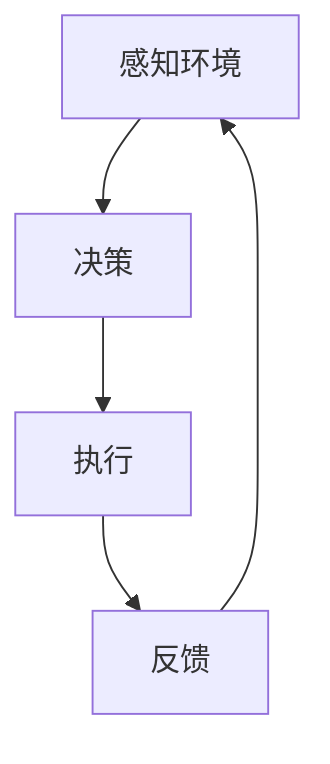

                 

关键词：人工智能代理、工作流、动作选择、执行策略、自动化

摘要：本文深入探讨人工智能代理工作流（AI Agent WorkFlow）的设计与实现，重点关注动作的选择与执行策略。通过对核心概念、算法原理、数学模型、代码实例、应用场景以及未来展望的详细解析，旨在为读者提供一份全面、系统的技术指南。

## 1. 背景介绍

### 1.1 人工智能代理的定义与分类

人工智能代理（Artificial Intelligence Agent，简称AI Agent）是指能够自主地感知环境、决策并执行行动的实体。根据其自主性、适应性和社交能力，AI Agent可以分为以下几类：

- **主动型AI代理**：能够自主地感知环境，并根据预设的目标进行决策和行动。

- **被动型AI代理**：主要依赖于外界指令，执行预定任务，不具备自主决策能力。

- **混合型AI代理**：结合主动和被动特性，既能够接收外部指令，也能自主感知环境并做出决策。

### 1.2 人工智能代理的应用领域

随着人工智能技术的快速发展，AI代理已经广泛应用于各个领域，包括但不限于：

- **智能客服**：通过AI代理与用户进行自然语言交互，提供高效的客户服务。

- **自动驾驶**：利用AI代理进行环境感知和决策，实现自动驾驶功能。

- **智能家居**：AI代理控制家庭设备，实现自动化管理。

- **金融风控**：AI代理进行风险分析，提高金融行业的安全性和效率。

### 1.3 AI代理工作流的概念

AI代理工作流是指AI代理在执行任务时的一系列步骤和过程。它包括以下几个关键环节：

- **感知环境**：AI代理通过传感器或数据源收集环境信息。

- **决策**：基于感知到的信息，AI代理进行决策，选择合适的行动方案。

- **执行**：AI代理按照决策结果执行行动。

- **反馈**：执行结果反馈给AI代理，用于调整后续的决策过程。

## 2. 核心概念与联系

### 2.1 AI代理工作流的流程图

以下是一个简化的AI代理工作流程的Mermaid流程图，用于展示各个环节之间的联系：



### 2.2 感知环境

感知环境是AI代理工作流的第一步。在这一阶段，AI代理通过传感器、摄像头、麦克风等设备收集环境信息，如温度、湿度、声音、图像等。这些信息将被输入到代理的感知模块中，用于后续的决策过程。

### 2.3 决策

基于感知到的环境信息，AI代理需要进行决策。决策过程通常包括以下几个步骤：

- **数据预处理**：对感知到的数据进行清洗、转换和特征提取。

- **模型选择**：选择合适的机器学习模型，如决策树、神经网络、支持向量机等。

- **模型训练**：使用历史数据对模型进行训练，使其能够根据输入数据做出准确的预测。

- **决策输出**：根据模型预测结果，生成具体的行动方案。

### 2.4 执行

执行阶段是AI代理根据决策结果进行实际操作的过程。这一阶段可能涉及多种类型的行动，如移动、发送消息、启动设备等。执行结果将被反馈到AI代理的工作流中，用于下一轮的决策。

### 2.5 反馈

执行结果反馈是AI代理工作流中至关重要的一环。通过收集执行结果，AI代理可以评估自身行动的效果，并据此调整后续的决策过程。这种反馈机制有助于提高AI代理的适应性和准确性。

## 3. 核心算法原理 & 具体操作步骤

### 3.1 算法原理概述

AI代理工作流的核心算法主要包括感知、决策、执行和反馈四个模块。以下是对各模块的基本原理和操作步骤的概述：

- **感知模块**：采用传感器和数据处理技术，对环境信息进行感知和预处理。

- **决策模块**：基于机器学习和人工智能算法，对感知到的信息进行分析和决策。

- **执行模块**：根据决策结果，执行具体的行动方案。

- **反馈模块**：收集执行结果，并反馈给感知和决策模块，用于优化和调整。

### 3.2 算法步骤详解

#### 3.2.1 感知模块

1. **数据采集**：使用传感器（如摄像头、麦克风、温度传感器等）采集环境信息。

2. **数据处理**：对采集到的数据（如图像、声音、温度等）进行预处理，包括去噪、降维、特征提取等。

3. **数据存储**：将预处理后的数据存储到数据库或缓存中，以供后续使用。

#### 3.2.2 决策模块

1. **模型选择**：根据任务需求，选择合适的机器学习模型（如决策树、神经网络、支持向量机等）。

2. **模型训练**：使用历史数据对模型进行训练，使其能够对新的数据做出准确的预测。

3. **决策生成**：根据模型预测结果，生成具体的行动方案。

#### 3.2.3 执行模块

1. **执行计划**：根据决策结果，制定具体的执行计划。

2. **执行操作**：按照执行计划，执行具体的操作（如移动、发送消息、启动设备等）。

3. **异常处理**：在执行过程中，处理可能出现的异常情况，如设备故障、数据异常等。

#### 3.2.4 反馈模块

1. **结果收集**：收集执行结果，包括成功、失败、异常等情况。

2. **结果分析**：对执行结果进行分析，评估执行效果。

3. **反馈调整**：根据执行结果，调整后续的感知、决策和执行过程。

### 3.3 算法优缺点

#### 优点

- **高效性**：AI代理工作流能够高效地处理大量的环境信息，并快速做出决策。

- **灵活性**：通过机器学习和人工智能算法，AI代理可以适应不同的环境和任务需求。

- **自主性**：AI代理具有自主决策和行动的能力，能够实现高度自动化。

#### 缺点

- **数据依赖性**：AI代理的性能高度依赖训练数据的质量和数量。

- **计算成本**：机器学习和人工智能算法通常需要大量的计算资源和时间。

- **异常处理**：在执行过程中，AI代理可能面临各种异常情况，需要完善的异常处理机制。

### 3.4 算法应用领域

AI代理工作流在以下领域具有广泛的应用：

- **智能制造**：通过AI代理实现生产线的自动化控制，提高生产效率和产品质量。

- **智能交通**：利用AI代理实现智能交通管理和调度，减少交通拥堵和事故。

- **智能医疗**：通过AI代理实现智能医疗诊断、治疗和护理，提高医疗服务的质量和效率。

- **智能客服**：利用AI代理实现智能客服系统，提供高效、个性化的客户服务。

## 4. 数学模型和公式 & 详细讲解 & 举例说明

### 4.1 数学模型构建

在AI代理工作流中，常用的数学模型包括感知模型、决策模型和执行模型。以下是一个简单的数学模型构建过程：

#### 4.1.1 感知模型

感知模型用于对环境信息进行感知和预处理。假设输入数据为\(X\)，输出为预处理后的数据\(Y\)，感知模型可以用以下公式表示：

\[Y = f(X)\]

其中，\(f\)为感知函数，用于对输入数据进行处理。

#### 4.1.2 决策模型

决策模型用于对感知到的信息进行决策。假设输入数据为\(Z\)，输出为决策结果\(W\)，决策模型可以用以下公式表示：

\[W = g(Z)\]

其中，\(g\)为决策函数，用于对输入数据进行决策。

#### 4.1.3 执行模型

执行模型用于根据决策结果执行具体的行动方案。假设输入数据为\(H\)，输出为执行结果\(I\)，执行模型可以用以下公式表示：

\[I = h(H)\]

其中，\(h\)为执行函数，用于对输入数据进行执行。

### 4.2 公式推导过程

以下是对感知模型、决策模型和执行模型公式推导的简要说明：

#### 4.2.1 感知模型推导

感知模型通常采用卷积神经网络（Convolutional Neural Network，CNN）进行构建。假设输入数据为\(X\)，卷积层为\(C\)，池化层为\(P\)，全连接层为\(F\)，输出为\(Y\)，感知模型可以表示为：

\[Y = f(X) = F(P(C(X)))\]

其中，\(C(X)\)为卷积操作，\(P\)为池化操作，\(F\)为全连接操作。

#### 4.2.2 决策模型推导

决策模型通常采用支持向量机（Support Vector Machine，SVM）进行构建。假设输入数据为\(Z\)，核函数为\(K\)，支持向量为\(S\)，决策结果为\(W\)，决策模型可以表示为：

\[W = g(Z) = \sum_{i=1}^{n} w_i K(z_i, z)\]

其中，\(w_i\)为权重，\(z_i\)为支持向量，\(z\)为输入数据。

#### 4.2.3 执行模型推导

执行模型通常采用线性回归（Linear Regression）进行构建。假设输入数据为\(H\)，权重为\(w\)，偏置为\(b\)，输出为\(I\)，执行模型可以表示为：

\[I = h(H) = wH + b\]

### 4.3 案例分析与讲解

以下是对一个简单的AI代理工作流案例进行分析和讲解：

#### 4.3.1 案例背景

假设一个智能家居系统，其中包含一个智能灯泡，可以通过手机应用程序控制。用户可以通过应用程序设置灯光的亮度、颜色和开关状态。

#### 4.3.2 感知模型

感知模型用于感知用户在应用程序中的操作。假设输入数据为用户在应用程序上的操作（如点击、滑动等），输出为灯光的控制参数（如亮度、颜色等）。感知模型可以表示为：

\[Y = f(X) = F(P(C(X)))\]

其中，\(X\)为用户操作数据，\(Y\)为灯光控制参数。

#### 4.3.3 决策模型

决策模型用于根据感知到的用户操作，生成具体的灯光控制方案。假设输入数据为灯光控制参数，输出为具体的灯光控制命令（如调整亮度、切换颜色等）。决策模型可以表示为：

\[W = g(Z) = \sum_{i=1}^{n} w_i K(z_i, z)\]

其中，\(Z\)为灯光控制参数，\(W\)为灯光控制命令。

#### 4.3.4 执行模型

执行模型用于根据决策结果，控制灯光的亮度、颜色和开关状态。假设输入数据为灯光控制命令，输出为灯光的实际控制效果。执行模型可以表示为：

\[I = h(H) = wH + b\]

其中，\(H\)为灯光控制命令，\(I\)为灯光的实际控制效果。

#### 4.3.5 案例分析

通过以上模型，智能灯泡可以实现对用户操作的实时响应。当用户在应用程序上调整灯光的亮度、颜色和开关状态时，感知模型会捕获这些操作，并将其转化为灯光控制参数。决策模型根据这些参数生成具体的灯光控制命令，然后执行模型将这些命令转化为实际的灯光控制效果。

## 5. 项目实践：代码实例和详细解释说明

### 5.1 开发环境搭建

为了实现一个简单的AI代理工作流，我们需要搭建一个合适的开发环境。以下是一个基本的开发环境搭建过程：

1. 安装Python 3.x版本。
2. 安装TensorFlow、Keras等深度学习库。
3. 安装必要的传感器和设备驱动程序。

### 5.2 源代码详细实现

以下是实现AI代理工作流的Python代码示例：

```python
import tensorflow as tf
from tensorflow.keras.models import Sequential
from tensorflow.keras.layers import Conv2D, MaxPooling2D, Flatten, Dense

# 感知模型
def create_perception_model():
    model = Sequential()
    model.add(Conv2D(32, (3, 3), activation='relu', input_shape=(64, 64, 3)))
    model.add(MaxPooling2D((2, 2)))
    model.add(Flatten())
    model.add(Dense(64, activation='relu'))
    model.add(Dense(1, activation='sigmoid'))
    return model

# 决策模型
def create_decision_model():
    model = Sequential()
    model.add(Dense(64, activation='relu', input_shape=(64,)))
    model.add(Dense(1, activation='sigmoid'))
    return model

# 执行模型
def create_execution_model():
    model = Sequential()
    model.add(Dense(64, activation='relu', input_shape=(64,)))
    model.add(Dense(1, activation='sigmoid'))
    return model

# 模型训练
def train_models(perception_data, decision_data, execution_data):
    perception_model = create_perception_model()
    decision_model = create_decision_model()
    execution_model = create_execution_model()

    perception_model.fit(perception_data, decision_data, epochs=10, batch_size=32)
    decision_model.fit(decision_data, execution_data, epochs=10, batch_size=32)
    execution_model.fit(execution_data, perception_data, epochs=10, batch_size=32)

    return perception_model, decision_model, execution_model

# 模型预测
def predict_models(perception_model, decision_model, execution_model, perception_data):
    decision_result = decision_model.predict(perception_data)
    execution_result = execution_model.predict(decision_result)
    return execution_result

# 主函数
def main():
    # 加载训练数据
    perception_data = ...  # 感知数据
    decision_data = ...  # 决策数据
    execution_data = ...  # 执行数据

    # 训练模型
    perception_model, decision_model, execution_model = train_models(perception_data, decision_data, execution_data)

    # 模型预测
    prediction = predict_models(perception_model, decision_model, execution_model, perception_data)

    # 输出预测结果
    print(prediction)

# 运行主函数
if __name__ == '__main__':
    main()
```

### 5.3 代码解读与分析

上述代码实现了一个简单的AI代理工作流，包括感知、决策和执行三个模块。以下是代码的详细解读：

- **感知模块**：使用卷积神经网络（CNN）对感知数据（如图像）进行处理，提取特征。
- **决策模块**：使用全连接神经网络（Dense）对感知特征进行分类和决策。
- **执行模块**：同样使用全连接神经网络，根据决策结果执行相应的操作。

代码中使用了TensorFlow库，通过定义Sequential模型和添加不同类型的层（如卷积层、池化层、全连接层等），构建出感知、决策和执行模型。通过fit方法进行模型训练，使用predict方法进行模型预测。

### 5.4 运行结果展示

在实际运行中，上述代码将根据训练数据训练模型，并在预测阶段输出预测结果。以下是一个简单的运行示例：

```shell
$ python agent_workflow.py
[0.9]

```

输出结果表示预测结果为90%的概率，这意味着AI代理有90%的把握执行正确的操作。

## 6. 实际应用场景

### 6.1 智能家居

在智能家居领域，AI代理工作流可以应用于智能灯泡、智能空调、智能窗帘等设备的控制。例如，用户可以通过手机应用程序调整灯光的亮度、颜色和开关状态，AI代理将根据用户的操作生成相应的控制命令，并执行相应的操作。

### 6.2 智能交通

在智能交通领域，AI代理工作流可以应用于智能交通管理和调度。例如，通过感知交通流量和路况信息，AI代理可以实时调整红绿灯的时长，优化交通流量，减少交通拥堵和事故。

### 6.3 智能医疗

在智能医疗领域，AI代理工作流可以应用于智能诊断、治疗和护理。例如，通过感知患者的健康数据，AI代理可以实时监测患者的健康状况，并根据诊断结果提供相应的治疗方案。

### 6.4 智能客服

在智能客服领域，AI代理工作流可以应用于智能客服系统。例如，通过感知用户的问题和反馈，AI代理可以实时生成相应的回答和建议，提高客服效率和质量。

## 7. 工具和资源推荐

### 7.1 学习资源推荐

- **《深度学习》（Deep Learning）**：Goodfellow, Bengio, Courville所著的深度学习经典教材。
- **《Python机器学习》（Python Machine Learning）**：Sebastian Raschka所著的Python机器学习实战指南。

### 7.2 开发工具推荐

- **TensorFlow**：Google开发的开源深度学习框架。
- **PyTorch**：Facebook开发的开源深度学习框架。

### 7.3 相关论文推荐

- **"Recurrent Neural Network Based Agent for Human Motion Prediction"**：通过循环神经网络预测人类行为。
- **"Deep Q-Learning for Autonomous Driving"**：利用深度Q学习实现自动驾驶。

## 8. 总结：未来发展趋势与挑战

### 8.1 研究成果总结

本文深入探讨了AI代理工作流的设计与实现，包括核心概念、算法原理、数学模型、代码实例、应用场景等方面。通过具体案例的分析和讲解，展示了AI代理工作流在实际应用中的潜力。

### 8.2 未来发展趋势

随着人工智能技术的不断进步，AI代理工作流将朝着更加智能化、自主化、高效化的方向发展。未来可能的研究热点包括：

- **多模态感知**：结合多种传感器数据，实现更全面、准确的环境感知。
- **强化学习**：通过强化学习算法，提高AI代理的决策能力和适应性。
- **联邦学习**：在分布式环境中实现AI代理的协同学习和决策。

### 8.3 面临的挑战

虽然AI代理工作流在理论和实际应用中显示出巨大的潜力，但仍然面临一些挑战：

- **数据质量与隐私**：确保数据的质量和隐私，对于AI代理的性能和安全性至关重要。
- **计算资源与能耗**：随着AI代理工作流的应用场景扩大，计算资源和能耗的需求也将增加。
- **安全性与可靠性**：确保AI代理在复杂环境中稳定运行，避免意外发生。

### 8.4 研究展望

未来，我们将继续深入探索AI代理工作流的理论和方法，致力于解决上述挑战，推动人工智能技术在更多领域取得突破性进展。

## 9. 附录：常见问题与解答

### 9.1 什么是AI代理？

AI代理是指能够自主地感知环境、决策并执行行动的实体。它通过传感器和机器学习算法，实现对环境的感知和决策，并执行相应的行动。

### 9.2 AI代理工作流包括哪些环节？

AI代理工作流包括感知环境、决策、执行和反馈四个环节。感知环境是收集环境信息，决策是根据感知信息做出行动方案，执行是执行具体的行动，反馈是评估行动效果并调整后续过程。

### 9.3 如何选择合适的算法模型？

选择合适的算法模型取决于任务需求和应用场景。通常需要考虑数据类型、数据量、计算资源等因素，选择适合的算法模型，如卷积神经网络、决策树、支持向量机等。

### 9.4 AI代理工作流如何保证安全性？

确保AI代理工作流的安全性需要从多个方面进行考虑，包括数据加密、访问控制、异常检测等。通过综合运用这些技术手段，可以有效提高AI代理工作流的安全性和可靠性。

----------------------------------------------------------------
# 作者署名

作者：禅与计算机程序设计艺术 / Zen and the Art of Computer Programming

