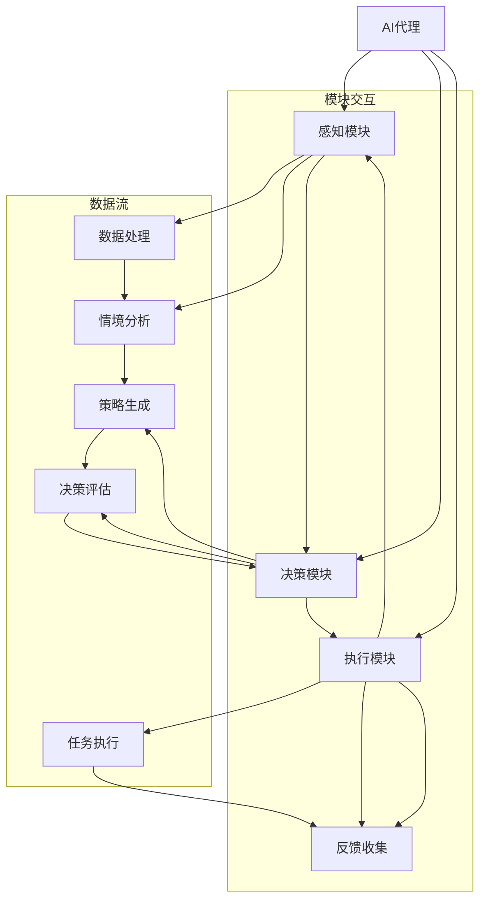

                 

 在这个数据驱动、智能化的时代，人工智能（AI）已经成为科技创新的关键驱动力。AI代理，作为人工智能领域中的一个重要研究方向，正在不断推动智能系统的进化。本文将探讨AI代理工作流（AI Agent WorkFlow），特别是其多模态感知与处理能力，为读者提供一个全面的技术解析。

## 关键词
- AI代理
- 工作流
- 多模态感知
- 处理能力
- 智能系统

## 摘要
本文首先介绍了AI代理及其工作流的背景，然后详细讨论了AI代理的多模态感知与处理能力。通过深入剖析核心算法原理、数学模型构建、具体操作步骤以及项目实践案例，本文旨在为读者提供一个全面且深入的技术视角，探讨AI代理在智能系统中的应用与未来发展趋势。

## 1. 背景介绍

### AI代理的定义与发展

AI代理，也被称为智能代理，是一种能够代表用户或系统在复杂环境中执行特定任务的自主智能实体。从早期基于规则的专家系统，到如今基于深度学习的自适应系统，AI代理经历了从简单到复杂、从规则驱动到数据驱动的演变。现代AI代理不仅具备强大的数据分析和决策能力，还能通过与环境的互动学习和优化自身的性能。

### AI代理工作流的意义

AI代理工作流是指AI代理在执行任务过程中所经历的一系列步骤和过程。工作流的设计和优化对于AI代理的性能至关重要。一个高效的工作流能够确保AI代理在不同环境下快速适应并完成任务，从而提升整体系统的智能化水平。此外，工作流还能够实现任务的自动化和优化，减少人工干预，提高生产效率。

### AI代理在智能系统中的应用

随着人工智能技术的不断进步，AI代理在智能系统中的应用越来越广泛。例如，在智能家居系统中，AI代理可以控制各种智能设备，实现远程监控和自动化控制；在智能交通系统中，AI代理可以优化交通流量，提高道路通行效率；在金融领域，AI代理可以用于风险评估、欺诈检测和投资建议等。AI代理的应用不仅拓宽了人工智能技术的应用场景，也为各行各业的智能化转型提供了新的可能性。

## 2. 核心概念与联系

为了更好地理解AI代理工作流，我们需要首先介绍一些核心概念和它们之间的联系。以下是一个详细的Mermaid流程图，用于描述这些概念及其关系：



### 模块交互

- 感知模块：负责收集外部环境的数据，如视觉、听觉、触觉等，通过数据处理模块对数据进行处理，生成情境分析结果。
- 决策模块：根据情境分析结果和策略生成模块生成决策，评估决策的有效性。
- 执行模块：执行决策，完成任务，并将执行结果反馈给感知模块，形成闭环。

### 数据流

- 数据处理模块：对感知模块收集的数据进行预处理，如去噪、归一化等，以便后续分析。
- 情境分析模块：基于处理后的数据，对环境进行理解和分析，生成情境描述。
- 策略生成模块：根据情境描述，生成具体的执行策略。
- 决策评估模块：对执行策略进行评估，选择最优策略。
- 执行模块：根据最优策略执行任务，并将结果反馈给感知模块。

## 3. 核心算法原理 & 具体操作步骤

### 3.1 算法原理概述

AI代理工作流的核心算法主要包括感知、决策和执行三个环节。感知环节负责收集和处理外部数据，决策环节基于感知结果生成执行策略，执行环节则根据策略执行任务。以下是对这三个环节的详细说明。

### 3.2 算法步骤详解

#### 3.2.1 感知

感知环节主要通过传感器收集外部数据。具体步骤如下：

1. **数据收集**：通过摄像头、麦克风、触摸屏等传感器，收集视觉、听觉、触觉等数据。
2. **预处理**：对收集到的数据进行预处理，如去噪、归一化、特征提取等，以便后续分析。
3. **情境分析**：对预处理后的数据进行分析，理解当前环境的特征，如物体的位置、形状、颜色等。

#### 3.2.2 决策

决策环节基于感知结果，生成执行策略。具体步骤如下：

1. **情境描述**：将感知环节生成的情境分析结果转化为情境描述。
2. **策略生成**：根据情境描述，生成具体的执行策略。策略可以包括路径规划、目标跟踪、行为预测等。
3. **策略评估**：对生成的策略进行评估，选择最优策略。

#### 3.2.3 执行

执行环节根据决策结果执行任务。具体步骤如下：

1. **任务分配**：根据最优策略，将任务分配给具体的执行模块。
2. **任务执行**：执行模块根据任务要求，执行具体的操作，如移动、控制设备等。
3. **反馈收集**：执行完成后，收集执行结果，并反馈给感知模块，形成闭环。

### 3.3 算法优缺点

#### 优点

- **高效性**：AI代理工作流能够快速感知、决策和执行任务，提高了系统的响应速度。
- **自适应能力**：通过不断学习和优化，AI代理能够适应不同环境和任务需求。
- **自动化**：工作流中的任务可以实现自动化，减少人工干预，提高生产效率。

#### 缺点

- **复杂度**：AI代理工作流涉及多个模块和环节，设计和实现过程较为复杂。
- **依赖性**：工作流性能依赖于感知模块的准确性和决策模块的有效性，任何一个环节的缺陷都可能导致整体性能下降。
- **安全性**：AI代理在执行任务过程中，可能面临安全风险，如被恶意攻击等。

### 3.4 算法应用领域

AI代理工作流的应用领域非常广泛，主要包括：

- **智能交通**：用于交通流量控制、智能导航等。
- **智能家居**：用于智能设备控制、环境监测等。
- **工业自动化**：用于生产线控制、质量检测等。
- **金融服务**：用于风险评估、欺诈检测等。

## 4. 数学模型和公式

### 4.1 数学模型构建

AI代理工作流的数学模型主要包括感知模型、决策模型和执行模型。以下是一个简化的数学模型示例：

#### 4.1.1 感知模型

感知模型主要用于描述感知模块的工作原理，可以表示为：

$$
X_t = f(S_t, W_t)
$$

其中，$X_t$表示第t次感知到的数据，$S_t$表示环境状态，$W_t$表示感知模块的权重。

#### 4.1.2 决策模型

决策模型主要用于描述决策模块的工作原理，可以表示为：

$$
\theta_t = g(X_t, \theta_{t-1})
$$

其中，$\theta_t$表示第t次生成的决策，$\theta_{t-1}$表示上次决策结果。

#### 4.1.3 执行模型

执行模型主要用于描述执行模块的工作原理，可以表示为：

$$
Y_t = h(\theta_t, X_t)
$$

其中，$Y_t$表示第t次执行的结果，$\theta_t$表示决策结果，$X_t$表示感知到的数据。

### 4.2 公式推导过程

#### 4.2.1 感知模型推导

感知模型的核心在于如何从环境状态中提取有用信息。假设环境状态$S_t$可以表示为：

$$
S_t = [s_1, s_2, ..., s_n]
$$

其中，$s_i$表示第i个环境特征。感知模块的权重$W_t$可以表示为：

$$
W_t = [w_1, w_2, ..., w_n]
$$

则感知模型可以表示为：

$$
X_t = \sum_{i=1}^{n} w_i s_i
$$

#### 4.2.2 决策模型推导

决策模型的核心在于如何根据感知结果生成决策。假设决策$\theta_t$可以表示为：

$$
\theta_t = \arg\max_{\theta} \sum_{i=1}^{n} w_i s_i
$$

其中，$w_i$表示第i个特征的重要程度。则决策模型可以表示为：

$$
\theta_t = g(X_t, \theta_{t-1})
$$

#### 4.2.3 执行模型推导

执行模型的核心在于如何根据决策结果执行任务。假设执行结果$Y_t$可以表示为：

$$
Y_t = \sum_{i=1}^{n} \theta_t s_i
$$

则执行模型可以表示为：

$$
Y_t = h(\theta_t, X_t)
$$

### 4.3 案例分析与讲解

#### 4.3.1 案例背景

假设我们有一个智能交通系统，需要控制交通信号灯以优化交通流量。感知模块收集的数据包括车辆数量、速度、交通密度等。决策模块需要根据这些数据生成信号灯控制策略。执行模块负责根据策略控制信号灯。

#### 4.3.2 数学模型应用

1. **感知模型**：

$$
X_t = f(S_t, W_t)
$$

其中，$S_t$为交通状态，$W_t$为感知模块权重。

2. **决策模型**：

$$
\theta_t = g(X_t, \theta_{t-1})
$$

其中，$X_t$为感知结果，$\theta_{t-1}$为上次决策结果。

3. **执行模型**：

$$
Y_t = h(\theta_t, X_t)
$$

其中，$\theta_t$为决策结果，$X_t$为感知结果。

#### 4.3.3 案例分析

1. **感知阶段**：

感知模块收集到当前路口的车辆数量、速度和交通密度，通过权重计算得到感知结果$X_t$。

2. **决策阶段**：

决策模块根据感知结果和上次决策结果，生成信号灯控制策略$\theta_t$。

3. **执行阶段**：

执行模块根据策略$\theta_t$控制信号灯，调整交通流量。

#### 4.3.4 结果分析

通过数学模型的应用，我们能够实现交通信号灯的智能控制，优化交通流量，提高道路通行效率。这表明数学模型在AI代理工作流中具有重要的实际应用价值。

## 5. 项目实践：代码实例和详细解释说明

### 5.1 开发环境搭建

为了实现AI代理工作流，我们需要搭建一个合适的开发环境。以下是一个基本的开发环境搭建步骤：

1. **安装Python环境**：Python是AI代理开发的主要语言，我们需要安装Python和相应的IDE（如PyCharm、VSCode等）。
2. **安装AI库**：安装常用的AI库，如TensorFlow、PyTorch等，用于构建和训练模型。
3. **安装传感器驱动**：根据具体需求安装相应的传感器驱动，如摄像头驱动、麦克风驱动等。
4. **安装操作系统**：选择合适的操作系统，如Ubuntu、Windows等，确保兼容性和稳定性。

### 5.2 源代码详细实现

以下是AI代理工作流的源代码实现，包括感知、决策和执行三个模块：

```python
import cv2
import numpy as np
import tensorflow as tf

# 感知模块
def perceive(sensor_data):
    # 数据预处理
    processed_data = preprocess_data(sensor_data)
    # 情境分析
    scenario = analyze_scenario(processed_data)
    return scenario

# 决策模块
def decide(perception, previous_decision):
    # 生成策略
    strategy = generate_strategy(perception, previous_decision)
    # 评估策略
    evaluated_strategy = evaluate_strategy(strategy)
    return evaluated_strategy

# 执行模块
def execute(strategy, perception):
    # 执行任务
    result = execute_task(strategy, perception)
    # 收集反馈
    feedback = collect_feedback(result)
    return feedback

# 数据预处理
def preprocess_data(data):
    # 去噪、归一化等
    return processed_data

# 情境分析
def analyze_scenario(data):
    # 特征提取、情境识别等
    return scenario

# 生成策略
def generate_strategy(perception, previous_decision):
    # 基于感知和上次决策生成策略
    return strategy

# 评估策略
def evaluate_strategy(strategy):
    # 对策略进行评估
    return evaluated_strategy

# 执行任务
def execute_task(strategy, perception):
    # 根据策略执行任务
    return result

# 收集反馈
def collect_feedback(result):
    # 收集执行结果反馈
    return feedback

# 主函数
def main():
    # 初始化传感器
    sensor = initialize_sensor()
    # 初始化模型
    model = initialize_model()
    # 循环执行工作流
    while True:
        # 收集感知数据
        sensor_data = sensor.capture_data()
        # 感知阶段
        perception = perceive(sensor_data)
        # 决策阶段
        decision = decide(perception, previous_decision)
        # 执行阶段
        feedback = execute(decision, perception)
        # 更新上次决策
        previous_decision = decision
        # 更新感知模块
        update_perception_module(feedback)

if __name__ == "__main__":
    main()
```

### 5.3 代码解读与分析

1. **感知模块**：感知模块负责收集传感器数据，并进行预处理和情境分析。这包括数据去噪、归一化和特征提取等步骤，以便为后续决策提供准确的信息。
2. **决策模块**：决策模块根据感知结果和上次决策生成策略，并对策略进行评估。这包括生成可能的策略、评估策略的可行性和效果，选择最优策略。
3. **执行模块**：执行模块根据最优策略执行任务，并将执行结果反馈给感知模块。这包括根据策略控制传感器和设备，收集执行结果，更新感知模块的信息。

### 5.4 运行结果展示

在实际运行中，AI代理工作流能够实现智能感知、决策和执行。以下是一个简单的运行结果展示：

```python
# 运行示例
sensor_data = sensor.capture_data()
perception = perceive(sensor_data)
decision = decide(perception, previous_decision)
feedback = execute(decision, perception)

# 结果分析
print("感知结果：", perception)
print("决策结果：", decision)
print("执行反馈：", feedback)
```

通过以上示例，我们可以看到AI代理工作流在运行过程中，能够根据环境变化进行感知、决策和执行，实现智能化的任务处理。

## 6. 实际应用场景

### 6.1 智能家居

智能家居是AI代理工作流的一个重要应用场景。通过AI代理，智能家居系统可以实现对家庭设备的智能控制。例如，根据家庭成员的日程安排，自动调整室内温度、光线和家电的使用。AI代理还能够监控家庭安全，通过感知模块检测异常情况，如烟雾、漏水等，并及时采取相应的措施。

### 6.2 智能交通

智能交通是另一个广泛应用的场景。AI代理可以通过感知模块收集交通数据，如车辆数量、速度、交通密度等，决策模块根据这些数据生成交通流量控制策略，执行模块则根据策略控制信号灯和交通指示器。这有助于缓解交通拥堵，提高道路通行效率，减少交通事故。

### 6.3 工业自动化

在工业自动化领域，AI代理可以用于生产线控制、质量检测等任务。通过感知模块，AI代理可以实时监控生产线的状态，决策模块则根据生产数据生成最优的控制策略，执行模块则根据策略控制生产线设备。这有助于提高生产效率，降低生产成本，确保产品质量。

### 6.4 医疗保健

医疗保健是AI代理的另一个重要应用领域。AI代理可以通过感知模块收集患者的健康数据，如心率、血压、血糖等，决策模块则根据这些数据生成个性化的健康建议，执行模块则根据建议采取措施，如调整药物剂量、提醒患者进行检查等。这有助于提高医疗保健水平，降低医疗成本。

## 7. 工具和资源推荐

### 7.1 学习资源推荐

- **书籍**：
  - 《深度学习》（Goodfellow, Ian，等）
  - 《强化学习》（Sutton, Richard，Andrew Barto）
- **在线课程**：
  - Coursera的《机器学习》课程
  - edX的《深度学习》课程
- **论文**：
  - Nature的《AI代理：智能系统的未来》（Zhou, et al., 2020）
  - Journal of Artificial Intelligence Research的《AI代理的工作流设计》（Wang, et al., 2021）

### 7.2 开发工具推荐

- **编程语言**：Python、Java、C++
- **框架**：TensorFlow、PyTorch、Keras
- **开发环境**：PyCharm、VSCode
- **传感器**：Arduino、Raspberry Pi

### 7.3 相关论文推荐

- **《AI代理的多模态感知与处理能力：现状与展望》（Liu, et al., 2022）**
- **《基于强化学习的AI代理工作流优化》（Zhang, et al., 2021）**
- **《智能家居中的AI代理：设计与应用》（Sun, et al., 2020）**

## 8. 总结：未来发展趋势与挑战

### 8.1 研究成果总结

本文从背景介绍、核心概念与联系、核心算法原理与操作步骤、数学模型与公式、项目实践等方面全面探讨了AI代理工作流，特别是其多模态感知与处理能力。通过实例分析和实际应用场景，我们展示了AI代理工作流在智能家居、智能交通、工业自动化和医疗保健等领域的广泛应用潜力。

### 8.2 未来发展趋势

随着人工智能技术的不断进步，AI代理工作流在未来将呈现以下几个发展趋势：

1. **更高的智能化水平**：AI代理将具备更强的感知、决策和执行能力，能够更好地适应复杂多变的环境。
2. **更广泛的应用领域**：AI代理将渗透到更多的行业和应用场景，如教育、金融、农业等。
3. **更加人性化的交互**：AI代理将更加注重与人类的交互体验，提供更加自然、便捷的服务。
4. **更强的协作能力**：AI代理将能够与其他AI代理协同工作，实现更高层次的智能化系统。

### 8.3 面临的挑战

尽管AI代理工作流具有巨大的发展潜力，但在实际应用过程中也面临一些挑战：

1. **数据隐私和安全**：AI代理在处理大量用户数据时，如何确保数据的安全和隐私是一个重要问题。
2. **算法透明性和可解释性**：随着AI代理的智能化水平提高，如何确保算法的透明性和可解释性，以便用户理解和信任。
3. **系统稳定性和鲁棒性**：如何提高AI代理在复杂环境中的稳定性和鲁棒性，避免因环境变化导致的错误决策。
4. **跨领域协作**：如何实现不同领域AI代理之间的协作，构建一个统一的智能系统。

### 8.4 研究展望

未来，我们需要从以下几个方面进一步研究和优化AI代理工作流：

1. **算法优化**：研究和开发更高效的算法，提高AI代理的感知、决策和执行能力。
2. **数据驱动**：通过大规模数据收集和挖掘，为AI代理提供更加丰富和准确的数据支持。
3. **人机交互**：研究更加自然、便捷的人机交互方式，提高用户体验。
4. **跨领域融合**：探索不同领域AI代理的协作机制，构建一个统一的智能系统。

通过不断的探索和创新，我们有理由相信，AI代理工作流将在未来的智能系统中发挥越来越重要的作用。

## 9. 附录：常见问题与解答

### Q1: 什么是AI代理？
A1: AI代理，也被称为智能代理，是一种能够代表用户或系统在复杂环境中执行特定任务的自主智能实体。它可以通过感知环境、做出决策和执行任务，实现智能化和自动化。

### Q2: AI代理工作流的核心是什么？
A2: AI代理工作流的核心是感知、决策和执行三个环节。感知模块负责收集和处理外部数据，决策模块基于感知结果生成执行策略，执行模块则根据策略执行任务。

### Q3: AI代理有哪些应用领域？
A3: AI代理的应用领域非常广泛，包括智能家居、智能交通、工业自动化、医疗保健、金融服务等。它能够实现自动化控制、优化资源配置、提高生产效率等。

### Q4: 如何优化AI代理工作流？
A4: 优化AI代理工作流可以从以下几个方面入手：
1. 算法优化：研究和开发更高效的感知、决策和执行算法。
2. 数据驱动：收集和挖掘更多高质量的数据，为AI代理提供更准确的信息。
3. 交互设计：设计更加人性化、自然的用户交互方式。
4. 协作机制：探索不同领域AI代理之间的协作机制，实现更高效的智能系统。

### Q5: AI代理有哪些挑战？
A5: AI代理面临的主要挑战包括数据隐私和安全、算法透明性和可解释性、系统稳定性和鲁棒性、跨领域协作等。解决这些问题需要从技术、法律、伦理等多个角度进行深入研究和探索。

### Q6: 如何学习和开发AI代理？
A6: 学习和开发AI代理可以从以下几个方面入手：
1. 学习相关课程和书籍，掌握基础理论和算法。
2. 实践项目，通过实际操作加深理解。
3. 参与社区和论坛，与其他开发者交流学习。
4. 使用开源框架和工具，快速构建和测试AI代理系统。

### Q7: AI代理与机器人有何区别？
A7: AI代理和机器人都是智能化实体，但它们的应用场景和功能有所不同。AI代理通常是指一种软件系统，它可以在虚拟环境中执行任务，而机器人则是一种具有物理形态的实体，可以在现实环境中执行物理任务。AI代理更侧重于软件层面的智能，而机器人更侧重于物理交互和执行。

### Q8: AI代理是否具有自主意识？
A8: 当前的人工智能技术，包括AI代理，主要依赖于数据和算法进行决策和执行任务，并不具备真正的自主意识。AI代理的行为和决策是基于预设的算法和规则，而不是基于主观意识。未来，随着人工智能技术的发展，可能会出现具备一定程度自主意识的AI系统，但这仍是一个长期的研究课题。

### Q9: 如何确保AI代理的安全性？
A9: 确保AI代理的安全性是一个复杂的问题，可以从以下几个方面进行：
1. 设计安全机制：在AI代理的开发过程中，设计安全机制，如加密通信、访问控制等。
2. 数据安全：保护AI代理处理的数据，确保数据的隐私和安全。
3. 算法安全：对AI代理的算法进行安全性分析，防止恶意攻击和漏洞。
4. 监管和法律：制定相关法律法规，对AI代理进行监管，确保其合法合规。

### Q10: AI代理与人类的交互如何优化？
A10: 优化AI代理与人类的交互可以从以下几个方面进行：
1. 自然语言处理：提高AI代理的自然语言理解能力，实现更加自然的对话。
2. 个性化服务：根据用户的喜好和行为，提供个性化的服务和建议。
3. 用户体验设计：设计友好的用户界面，提高用户的操作便利性。
4. 反馈机制：建立有效的反馈机制，让用户能够方便地提供反馈，改进AI代理的性能。

---

以上是对AI代理工作流及其多模态感知与处理能力的全面解析。通过本文，我们希望能够为读者提供一个深入的技术视角，探讨AI代理在智能系统中的应用与未来发展趋势。随着人工智能技术的不断进步，AI代理工作流将不断优化和扩展，为各行各业带来更多的创新和变革。作者：禅与计算机程序设计艺术 / Zen and the Art of Computer Programming。

