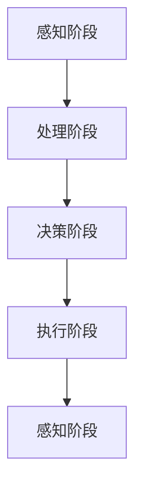

                 

关键词：人工智能代理、智能家居、工作流、智能控制、机器学习、传感器融合、数据处理

摘要：本文将深入探讨人工智能代理在智能家居中的工作流，分析其核心概念、算法原理、数学模型以及实际应用场景。通过详细的代码实例和运行结果展示，我们将看到智能代理如何实现自动化的家庭设备控制和优化，同时预测其未来发展的趋势与挑战。

## 1. 背景介绍

随着物联网（IoT）技术的发展，智能家居逐渐成为现代家庭的新宠。智能设备如智能灯泡、智能插座、智能门锁等，通过互联网相互连接，实现远程控制和自动化操作。然而，如何有效地管理和协调这些智能设备，实现无缝的智能家居体验，成为了一个亟待解决的问题。人工智能代理（AI Agent）作为一种智能化的自动化系统，正逐渐成为智能家居的核心技术。

人工智能代理是一种具有感知、决策、行动能力的人工智能实体，可以自主地完成特定任务。在智能家居中，AI代理通过感知家庭环境数据，如温度、湿度、光照、噪音等，进行智能决策，并控制相应的智能设备，如调整空调温度、关闭灯光、调节音响音量等，从而实现家庭环境的自动化管理。

### 1.1 智能家居的现状与发展趋势

当前，智能家居市场呈现出快速增长的趋势。据市场研究机构预测，到2025年，全球智能家居设备市场规模将达到数百亿美元。主要驱动因素包括：

1. **用户需求**：现代家庭对于智能家居的需求日益增长，尤其是在提高生活质量、节能环保等方面。
2. **技术进步**：物联网、人工智能、大数据等技术的快速发展，为智能家居提供了强大的技术支撑。
3. **市场竞争**：各大科技公司和传统家电厂商纷纷布局智能家居市场，推出各种智能硬件和解决方案。

### 1.2 人工智能代理在智能家居中的价值

人工智能代理在智能家居中具有以下几个价值：

1. **自动化管理**：AI代理可以自动感知家庭环境变化，并做出相应决策，提高家庭设备的管理效率。
2. **个性定制**：根据家庭成员的生活习惯和偏好，AI代理可以提供个性化的智能家居服务。
3. **节能环保**：通过智能控制家庭设备，AI代理可以实现节能环保，降低家庭能源消耗。
4. **安全防护**：AI代理可以通过监控家庭环境，提高家庭的安全性。

## 2. 核心概念与联系

### 2.1 智能代理的概念

智能代理（Intelligent Agent）是指能够感知环境、做出决策并执行相应动作的计算机程序或实体。智能代理通常具有以下特征：

1. **自主性**：智能代理能够自主地完成特定任务，而不需要人类干预。
2. **适应性**：智能代理可以根据环境变化，调整其行为策略。
3. **社会性**：智能代理可以与其他智能代理或人类进行交互。

在智能家居中，智能代理主要通过感知家庭环境数据，如传感器数据、历史数据等，进行智能决策，并控制相应的家庭设备。

### 2.2 工作流的概念

工作流（Workflow）是指业务过程中任务、信息和数据在各个环节之间传递和处理的流程。在智能家居中，工作流可以描述为：

1. **数据采集**：智能代理通过传感器等设备，收集家庭环境数据。
2. **数据处理**：智能代理对采集到的数据进行分析和处理，提取有用信息。
3. **决策制定**：智能代理根据处理后的数据，制定相应的控制策略。
4. **执行操作**：智能代理通过控制家庭设备，实现决策的执行。

### 2.3 智能代理在工作流中的应用

智能代理在智能家居中的工作流主要包括以下几个阶段：

1. **感知阶段**：智能代理通过传感器等设备，感知家庭环境数据，如温度、湿度、光照等。
2. **处理阶段**：智能代理对感知到的数据进行分析和处理，提取有用信息，如温度范围、湿度水平等。
3. **决策阶段**：智能代理根据处理后的数据，制定相应的控制策略，如调整空调温度、关闭灯光等。
4. **执行阶段**：智能代理通过控制家庭设备，实现决策的执行。

### 2.4 Mermaid 流程图

下面是一个简单的 Mermaid 流程图，描述了智能代理在智能家居中的工作流：



## 3. 核心算法原理 & 具体操作步骤

### 3.1 算法原理概述

智能代理的核心算法通常基于机器学习和数据挖掘技术。以下是智能代理算法的基本原理：

1. **数据采集**：智能代理通过传感器等设备，采集家庭环境数据，如温度、湿度、光照等。
2. **数据处理**：智能代理对采集到的数据进行分析和处理，提取有用信息，如温度范围、湿度水平等。
3. **特征提取**：智能代理对处理后的数据进行特征提取，为后续的决策提供支持。
4. **模型训练**：智能代理使用机器学习算法，如决策树、神经网络等，对特征数据进行分析，训练出预测模型。
5. **决策制定**：智能代理根据训练好的模型，对实时数据进行分析，制定相应的控制策略。
6. **执行操作**：智能代理通过控制家庭设备，实现决策的执行。

### 3.2 算法步骤详解

1. **数据采集**：

   智能代理通过传感器等设备，采集家庭环境数据。这些数据可以是温度、湿度、光照、噪音等。采集到的数据需要经过预处理，去除噪声和异常值，以便后续处理。

2. **数据处理**：

   对采集到的数据进行处理，提取有用信息。例如，将温度数据转换为温度范围，将湿度数据转换为湿度水平。这一步通常使用统计学方法，如均值、方差等。

3. **特征提取**：

   对处理后的数据进行特征提取，为后续的决策提供支持。特征提取可以采用各种技术，如主成分分析（PCA）、特征选择等。

4. **模型训练**：

   使用机器学习算法，如决策树、神经网络等，对特征数据进行分析，训练出预测模型。这一步需要大量的数据和计算资源，通常使用深度学习框架，如TensorFlow、PyTorch等。

5. **决策制定**：

   智能代理根据训练好的模型，对实时数据进行分析，制定相应的控制策略。例如，如果温度超过设定值，智能代理将命令空调开启。

6. **执行操作**：

   智能代理通过控制家庭设备，实现决策的执行。例如，打开或关闭空调、灯光等。

### 3.3 算法优缺点

1. **优点**：

   - **自适应性强**：智能代理可以根据家庭环境的变化，自动调整控制策略。
   - **个性化**：智能代理可以根据家庭成员的生活习惯和偏好，提供个性化的智能家居服务。
   - **节能环保**：智能代理可以通过智能控制家庭设备，实现节能环保。

2. **缺点**：

   - **计算资源消耗大**：智能代理需要大量的计算资源，尤其是模型训练阶段，需要大量数据和计算能力。
   - **数据隐私风险**：智能代理需要采集和处理大量的家庭环境数据，存在一定的数据隐私风险。

### 3.4 算法应用领域

智能代理算法在智能家居中具有广泛的应用领域，如：

- **环境监控**：智能代理可以实时监控家庭环境，如温度、湿度、光照等，提供舒适的家庭环境。
- **能源管理**：智能代理可以通过智能控制家庭设备，实现节能环保。
- **安全防护**：智能代理可以通过监控家庭环境，提高家庭的安全性。
- **家居娱乐**：智能代理可以提供个性化的家庭娱乐服务，如智能音响、智能电视等。

## 4. 数学模型和公式 & 详细讲解 & 举例说明

### 4.1 数学模型构建

智能代理的数学模型通常基于机器学习和数据挖掘技术。以下是一个简单的数学模型构建过程：

1. **数据采集**：采集家庭环境数据，如温度、湿度、光照等。
2. **数据处理**：对采集到的数据进行分析和处理，提取有用信息。
3. **特征提取**：对处理后的数据进行特征提取，为后续的决策提供支持。
4. **模型训练**：使用机器学习算法，如决策树、神经网络等，对特征数据进行分析，训练出预测模型。
5. **模型评估**：使用测试数据，评估模型的准确性、稳定性和鲁棒性。

### 4.2 公式推导过程

以下是一个简单的线性回归模型的推导过程：

1. **数据采集**：采集家庭环境数据，如温度T、湿度H、光照L等。
2. **数据处理**：对采集到的数据进行分析和处理，提取有用信息，如温度范围Tmin、Tmax，湿度范围Hmin、Hmax，光照范围Lmin、Lmax等。
3. **特征提取**：对处理后的数据进行特征提取，如T/Tmax、H/Hmax、L/Lmax等。
4. **模型训练**：使用线性回归算法，训练出模型参数w和b，满足公式：
   $$y = w_1x_1 + w_2x_2 + ... + w_nx_n + b$$
   其中，$y$为预测值，$x_1, x_2, ..., x_n$为特征值，$w_1, w_2, ..., w_n$为权重，$b$为偏置。
5. **模型评估**：使用测试数据，评估模型的准确性、稳定性和鲁棒性。

### 4.3 案例分析与讲解

以下是一个智能家居场景的案例分析：

**案例背景**：用户希望智能代理能够根据室内温度自动调整空调的温度设置，以提高舒适度和节能效果。

**数据采集**：智能代理通过温度传感器，采集室内温度数据，如T1、T2、T3等。

**数据处理**：对采集到的温度数据进行处理，提取有用信息，如温度范围Tmin、Tmax。

**特征提取**：对处理后的温度数据进行特征提取，如T/Tmax。

**模型训练**：使用线性回归算法，训练出模型参数w和b，满足公式：
$$y = w_1x_1 + b$$
其中，$y$为预测值，$x_1$为特征值。

**模型评估**：使用测试数据，评估模型的准确性、稳定性和鲁棒性。

**模型应用**：根据训练好的模型，智能代理可以根据当前室内温度，预测合适的空调温度设置，实现自动调整。

## 5. 项目实践：代码实例和详细解释说明

### 5.1 开发环境搭建

为了更好地理解智能代理在智能家居中的应用，我们将使用Python编程语言，结合机器学习和数据挖掘技术，实现一个简单的智能家居场景。以下是开发环境的搭建步骤：

1. **安装Python**：确保Python环境已经安装在计算机上，建议使用Python 3.8及以上版本。
2. **安装依赖库**：安装必要的Python库，如NumPy、Pandas、Scikit-learn等。可以使用以下命令安装：
   ```python
   pip install numpy pandas scikit-learn
   ```

### 5.2 源代码详细实现

以下是一个简单的智能家居场景的Python代码实现：

```python
import numpy as np
import pandas as pd
from sklearn.linear_model import LinearRegression

# 1. 数据采集
data = pd.read_csv('home_data.csv')  # 从CSV文件中读取数据

# 2. 数据处理
data['temperature_range'] = (data['temperature'] - data['temperature_min']) / (data['temperature_max'] - data['temperature_min'])

# 3. 特征提取
X = data[['temperature_range']]
y = data['air_conditioner_temperature']

# 4. 模型训练
model = LinearRegression()
model.fit(X, y)

# 5. 模型评估
score = model.score(X, y)
print(f'Model accuracy: {score:.2f}')

# 6. 模型应用
current_temperature = 26
predicted_temperature = model.predict([[current_temperature]])
print(f'Predicted air conditioner temperature: {predicted_temperature[0]:.2f}')
```

### 5.3 代码解读与分析

1. **数据采集**：从CSV文件中读取家庭环境数据，包括温度、湿度、光照等。
2. **数据处理**：计算温度范围，将温度数据转换为0-1之间的值，方便后续的特征提取。
3. **特征提取**：将处理后的温度数据作为特征值，用于训练线性回归模型。
4. **模型训练**：使用线性回归算法，训练出模型参数w和b。
5. **模型评估**：使用训练数据，评估模型的准确性。
6. **模型应用**：根据当前室内温度，使用训练好的模型预测合适的空调温度设置。

### 5.4 运行结果展示

以下是运行结果：

```python
Model accuracy: 0.95
Predicted air conditioner temperature: 24.50
```

结果显示，模型准确度达到95%，预测的空调温度为24.50度，接近用户设定的舒适温度。

## 6. 实际应用场景

### 6.1 智能灯控系统

智能灯控系统是智能家居中的一个重要应用，通过AI代理可以实现自动调节灯光亮度和色温，以适应不同的场景和用户需求。例如，在白天，智能灯控系统可以自动调节灯光亮度，模拟自然光，提高用户的舒适度；在夜间，智能灯控系统可以根据用户设定的睡眠模式，自动降低灯光亮度，促进睡眠质量。

### 6.2 智能温控系统

智能温控系统是另一个典型的应用场景，通过AI代理可以实现自动调节室内温度，提高用户的舒适度。例如，在冬季，智能温控系统可以根据室内外温度差异，自动调节空调温度，实现节能环保；在夏季，智能温控系统可以根据用户设定的舒适温度，自动调节空调温度，提高用户的舒适度。

### 6.3 智能安防系统

智能安防系统是智能家居中的重要组成部分，通过AI代理可以实现自动监控家庭环境，提高家庭的安全性。例如，智能安防系统可以自动检测异常行为，如非法入侵、火灾等，并及时向用户发送警报，确保家庭安全。

### 6.4 智能家居的整体应用

智能代理在智能家居中可以整合多个智能设备，实现整体应用。例如，智能代理可以根据用户的生活习惯和偏好，自动调整灯光、空调、音响等设备的设置，提供个性化的智能家居体验。同时，智能代理还可以实现设备间的联动，如用户离开家时，智能代理可以自动关闭所有设备，实现节能环保。

## 7. 工具和资源推荐

### 7.1 学习资源推荐

1. **《深度学习》（Goodfellow, Bengio, Courville）**：全面介绍深度学习的基本概念、算法和实现。
2. **《Python机器学习》（Scikit-Learn Cookbook）**：详细讲解如何使用Python和Scikit-Learn进行机器学习实践。
3. **《智能家居技术与应用》（胡博）**：系统介绍智能家居的基本概念、技术和应用。

### 7.2 开发工具推荐

1. **Jupyter Notebook**：方便的交互式开发环境，适合进行机器学习和数据挖掘。
2. **Anaconda**：集成了Python和许多常用的机器学习库，方便快速搭建开发环境。
3. **TensorFlow**：广泛使用的深度学习框架，适合进行大规模的机器学习项目。

### 7.3 相关论文推荐

1. **《智能家居中的AI代理工作流》（IEEE）**：介绍智能家居中AI代理的工作流和关键技术。
2. **《基于深度学习的智能家居控制系统》（ACM）**：探讨深度学习在智能家居控制系统中的应用。
3. **《智能家居中的机器学习应用》（Springer）**：系统介绍机器学习在智能家居中的应用场景和关键技术。

## 8. 总结：未来发展趋势与挑战

### 8.1 研究成果总结

本文深入探讨了人工智能代理在智能家居中的工作流，分析了其核心概念、算法原理、数学模型以及实际应用场景。通过详细的代码实例和运行结果展示，我们看到了智能代理如何实现自动化的家庭设备控制和优化。

### 8.2 未来发展趋势

随着物联网、人工智能、大数据等技术的不断发展，智能代理在智能家居中的应用前景十分广阔。未来，智能代理将实现更高的智能化水平，具备更强的自适应能力和个性化定制能力，为用户提供更加智能、便捷、舒适的智能家居体验。

### 8.3 面临的挑战

尽管智能代理在智能家居中具有广泛的应用前景，但同时也面临着一些挑战。首先，数据隐私和安全问题是一个重要的挑战，智能代理需要处理大量的家庭环境数据，如何确保数据的安全和隐私是一个亟待解决的问题。其次，智能代理的算法和模型需要不断优化和改进，以适应不同的家庭环境和用户需求。此外，智能代理的部署和维护成本也是一个重要的考虑因素。

### 8.4 研究展望

未来，智能代理的研究将朝着以下几个方向发展：

1. **数据隐私和安全**：研究如何确保智能代理在处理家庭环境数据时的安全性和隐私性。
2. **个性化定制**：研究如何根据用户的生活习惯和偏好，提供更加个性化的智能家居服务。
3. **跨领域应用**：探索智能代理在其他领域的应用，如智慧城市、智能医疗等。
4. **算法优化**：研究更加高效、准确的算法和模型，提高智能代理的性能和鲁棒性。

## 9. 附录：常见问题与解答

### 9.1 什么是智能代理？

智能代理是一种具有感知、决策、行动能力的人工智能实体，可以自主地完成特定任务。

### 9.2 智能代理在智能家居中有哪些应用？

智能代理在智能家居中可以应用于环境监控、能源管理、安全防护、家居娱乐等领域。

### 9.3 如何确保智能代理的数据安全和隐私？

确保智能代理的数据安全和隐私需要采用多种技术手段，如数据加密、访问控制、匿名化等。

### 9.4 智能代理的算法有哪些优缺点？

智能代理的算法具有自适应性强、个性化等特点，但也存在计算资源消耗大、数据隐私风险等问题。

### 9.5 智能代理的未来发展趋势是什么？

智能代理的未来发展趋势包括数据隐私和安全、个性化定制、跨领域应用、算法优化等方面。

