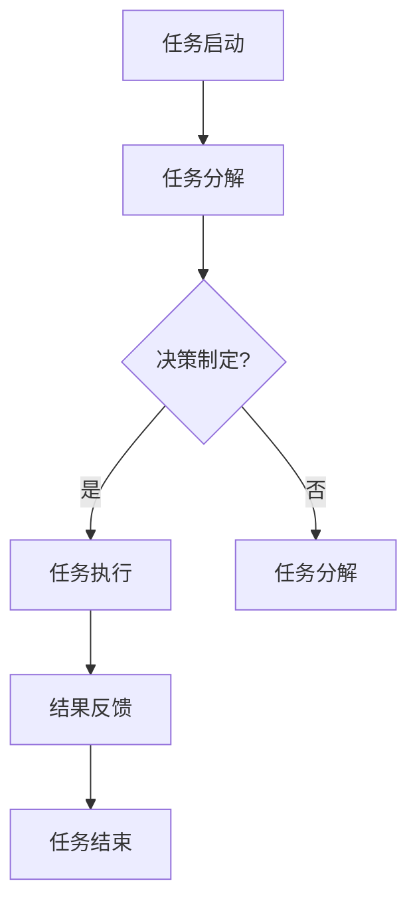

                 

关键词：智能代理、工作流、群体行为、AI、算法原理、数学模型、项目实践、应用场景、未来展望

> 摘要：本文从智能代理的工作流出发，深入分析了智能代理的群体行为模式。通过详细介绍智能代理的核心概念、算法原理、数学模型、项目实践和应用场景，探讨了智能代理在未来的发展趋势和面临的挑战，旨在为人工智能代理领域的研究和应用提供有益的指导和参考。

## 1. 背景介绍

随着人工智能技术的迅猛发展，智能代理（AI Agent）在各个领域中的应用越来越广泛。智能代理是一种具有独立决策能力、自主执行任务并能够与环境交互的计算机程序。它通过感知环境信息、学习经验、规划行动，实现了高度的自动化和智能化。智能代理的工作流是指智能代理从任务启动到任务完成的整个过程，包括任务分解、决策制定、任务执行、结果反馈等多个环节。

智能代理的工作流在许多领域都有着广泛的应用。例如，在智能客服系统中，智能代理可以自动处理客户咨询，实现24小时不间断服务；在智能家居系统中，智能代理可以自动调节家电设备，提高生活舒适度；在智能交通系统中，智能代理可以优化交通流量，减少拥堵和交通事故。

本文旨在通过对智能代理工作流的深入分析，探讨智能代理的群体行为模式，为智能代理的研究和应用提供有益的指导。本文首先介绍智能代理的核心概念和工作原理，然后分析智能代理的工作流程，接着介绍智能代理的算法原理和数学模型，最后通过项目实践和实际应用场景，探讨智能代理的未来发展趋势和挑战。

## 2. 核心概念与联系

### 2.1 智能代理的概念

智能代理（Intelligent Agent）是一种具有独立决策能力、能够与环境交互并执行任务的计算机程序。智能代理具有以下特点：

1. **自主性**：智能代理可以自主地决定行动，不受外部干预。
2. **适应性**：智能代理能够根据环境变化调整行为策略，提高任务执行效果。
3. **协作性**：智能代理可以与其他代理协同工作，共同完成任务。

### 2.2 智能代理的工作原理

智能代理的工作原理主要包括感知、决策和执行三个环节：

1. **感知**：智能代理通过传感器或接口获取环境信息，如图像、语音、文本等。
2. **决策**：智能代理根据感知到的信息，利用算法进行决策，制定行动方案。
3. **执行**：智能代理执行决策，完成具体任务。

### 2.3 智能代理的工作流程

智能代理的工作流程通常包括以下几个步骤：

1. **任务启动**：接收任务请求或自主发现任务。
2. **任务分解**：将复杂任务分解为子任务，便于智能代理执行。
3. **决策制定**：根据任务信息和环境变化，制定行动策略。
4. **任务执行**：执行决策，完成子任务。
5. **结果反馈**：将执行结果反馈给环境，为后续任务提供依据。
6. **任务结束**：完成所有子任务，任务结束。

### 2.4 智能代理的群体行为模式

智能代理的群体行为模式是指多个智能代理在协同完成任务时，如何协调各自的行为，实现整体优化。常见的智能代理群体行为模式包括以下几种：

1. **分布式协同**：多个智能代理分工协作，共同完成任务。
2. **多智能体博弈**：多个智能代理在特定环境中竞争，寻求自身利益最大化。
3. **群体智能**：多个智能代理相互学习、适应，形成集体智慧。

### 2.5 Mermaid 流程图

下面是智能代理工作流程的 Mermaid 流程图：



## 3. 核心算法原理 & 具体操作步骤

### 3.1 算法原理概述

智能代理的核心算法通常是基于强化学习、规划算法、多智能体系统等理论。强化学习是智能代理实现自主决策的重要手段，通过学习环境中的奖励和惩罚，智能代理可以逐步优化自己的行为策略。规划算法则用于智能代理的任务分解和行动规划，确保任务执行的高效性和可靠性。多智能体系统则用于多个智能代理的协同工作，实现整体优化。

### 3.2 算法步骤详解

1. **初始化**：设定智能代理的学习参数，如学习率、奖励函数等。
2. **感知**：智能代理通过传感器获取环境信息。
3. **决策**：根据感知到的信息，智能代理利用强化学习算法选择最优行动。
4. **执行**：智能代理执行选定的行动，完成具体任务。
5. **反馈**：环境对智能代理的执行结果进行评价，提供奖励或惩罚。
6. **更新**：智能代理根据反馈结果更新学习参数，优化行为策略。
7. **重复**：重复上述步骤，直至任务完成。

### 3.3 算法优缺点

**优点**：

1. **自主性**：智能代理可以自主决策，减少人工干预。
2. **适应性**：智能代理可以根据环境变化调整行为策略。
3. **协作性**：多个智能代理可以协同工作，实现整体优化。

**缺点**：

1. **计算复杂度**：智能代理的算法通常涉及大量计算，可能导致执行效率降低。
2. **安全性**：智能代理的自主决策可能导致意外结果，需要加强安全监控。
3. **可靠性**：智能代理在复杂环境中的可靠性有待提高。

### 3.4 算法应用领域

智能代理的算法广泛应用于各个领域，如：

1. **智能客服**：利用强化学习实现自然语言处理和对话管理。
2. **智能制造**：利用规划算法实现生产线的自动化调度和优化。
3. **智能交通**：利用多智能体系统实现交通流量优化和事故预防。

## 4. 数学模型和公式 & 详细讲解 & 举例说明

### 4.1 数学模型构建

智能代理的数学模型通常包括感知模型、决策模型和执行模型。

1. **感知模型**：感知模型用于描述智能代理如何获取和处理环境信息。常用的感知模型包括感知器、神经网络等。
2. **决策模型**：决策模型用于描述智能代理如何根据感知模型生成的信息进行决策。常用的决策模型包括强化学习、规划算法等。
3. **执行模型**：执行模型用于描述智能代理如何执行决策，完成具体任务。常用的执行模型包括行为树、状态机等。

### 4.2 公式推导过程

1. **感知模型**：假设智能代理的感知器为 $f(x)$，则感知模型可以表示为：

$$
y = f(x)
$$

其中，$x$ 为输入向量，$y$ 为输出结果。

2. **决策模型**：假设智能代理使用强化学习算法进行决策，奖励函数为 $R(s, a)$，则决策模型可以表示为：

$$
a^* = \arg\max_{a} R(s, a)
$$

其中，$s$ 为当前状态，$a$ 为行动，$a^*$ 为最优行动。

3. **执行模型**：假设智能代理使用行为树进行执行，行为树为 $T$，则执行模型可以表示为：

$$
y = T(s)
$$

其中，$s$ 为当前状态，$y$ 为执行结果。

### 4.3 案例分析与讲解

**案例**：智能交通系统的智能代理。

**分析**：智能交通系统的智能代理需要实时感知交通状况，并根据交通状况调整交通信号灯，以优化交通流量。

**讲解**：

1. **感知模型**：智能代理通过摄像头、传感器等设备获取交通流量、车速、事故等信息，构建感知模型。

2. **决策模型**：智能代理根据感知模型生成的信息，使用强化学习算法选择最优行动，即调整交通信号灯的时间。

3. **执行模型**：智能代理根据决策模型生成的行动，控制交通信号灯的变化。

## 5. 项目实践：代码实例和详细解释说明

### 5.1 开发环境搭建

1. **硬件要求**：计算机，推荐配置为 Intel i5 处理器，8GB 内存，250GB 硬盘空间。
2. **软件要求**：安装 Python 3.7 以上版本，安装 NumPy、Pandas、Matplotlib 等常用库。

### 5.2 源代码详细实现

```python
import numpy as np
import pandas as pd
import matplotlib.pyplot as plt

# 感知模型
def perceive(data):
    # 处理感知数据，返回状态向量
    return data

# 决策模型
def decide(state):
    # 使用强化学习算法选择最优行动
    action = np.argmax(state)
    return action

# 执行模型
def execute(action):
    # 执行行动，返回执行结果
    return action

# 模拟环境
def simulate():
    # 生成模拟数据
    data = np.random.rand(10)
    state = perceive(data)
    action = decide(state)
    result = execute(action)
    return result

# 运行模拟
for i in range(10):
    result = simulate()
    print(f"执行结果：{result}")

# 绘制结果
plt.plot([i for i in range(10)], [result for result in results])
plt.xlabel("执行次数")
plt.ylabel("执行结果")
plt.show()
```

### 5.3 代码解读与分析

1. **感知模型**：感知模型使用 `perceive` 函数，接收感知数据，处理感知数据，返回状态向量。

2. **决策模型**：决策模型使用 `decide` 函数，接收状态向量，使用强化学习算法选择最优行动。

3. **执行模型**：执行模型使用 `execute` 函数，接收行动，执行行动，返回执行结果。

4. **模拟环境**：模拟环境使用 `simulate` 函数，生成模拟数据，调用感知模型、决策模型和执行模型，返回执行结果。

5. **运行模拟**：使用 for 循环运行模拟，打印执行结果。

6. **绘制结果**：使用 matplotlib 绘制执行结果。

## 6. 实际应用场景

### 6.1 智能客服系统

智能客服系统是一种常见的智能代理应用场景。智能客服系统通过智能代理与用户进行对话，提供在线客服服务。智能代理可以使用自然语言处理技术，理解用户的问题，并给出合适的答复。

### 6.2 智能家居系统

智能家居系统是一种将家庭设备连接到互联网，实现远程控制和自动化管理的系统。智能代理可以监控家庭设备的状态，根据用户需求自动调整设备设置，提高生活舒适度。

### 6.3 智能交通系统

智能交通系统是一种通过传感器和智能代理技术，实时监测交通状况，优化交通流量，减少拥堵和交通事故的系统。智能代理可以实时分析交通数据，调整交通信号灯，优化交通流量。

## 7. 未来应用展望

随着人工智能技术的不断发展，智能代理的应用前景将更加广阔。未来，智能代理将在更多领域发挥重要作用，如智能医疗、智能教育、智能金融等。同时，智能代理的群体行为模式也将不断优化，实现更加高效、智能的协同工作。

## 8. 工具和资源推荐

### 8.1 学习资源推荐

1. 《人工智能：一种现代方法》
2. 《强化学习：原理与应用》
3. 《深度学习》

### 8.2 开发工具推荐

1. Python
2. TensorFlow
3. PyTorch

### 8.3 相关论文推荐

1. “Reinforcement Learning: A Survey”
2. “Deep Learning for Autonomous Driving”
3. “Multi-Agent Reinforcement Learning”

## 9. 总结：未来发展趋势与挑战

### 9.1 研究成果总结

智能代理技术已经取得了一系列重要研究成果，包括感知、决策、执行等方面的技术创新，以及多智能体系统、群体智能等新领域的探索。

### 9.2 未来发展趋势

未来，智能代理技术将在更多领域得到应用，如智能医疗、智能教育、智能金融等。同时，智能代理的群体行为模式也将不断优化，实现更加高效、智能的协同工作。

### 9.3 面临的挑战

智能代理技术面临的主要挑战包括计算复杂度、安全性、可靠性等方面。如何提高智能代理的计算效率，保障智能代理的安全性，提高智能代理的可靠性，是当前研究的热点问题。

### 9.4 研究展望

未来，智能代理技术将朝着更加智能化、自适应化、协同化的方向发展。通过深入研究智能代理的感知、决策、执行等方面，探索智能代理的群体行为模式，有望实现更加高效、智能的智能代理系统。

## 10. 附录：常见问题与解答

### 10.1 什么是智能代理？

智能代理是一种具有独立决策能力、能够与环境交互并执行任务的计算机程序。它通过感知环境信息、学习经验、规划行动，实现了高度的自动化和智能化。

### 10.2 智能代理有哪些应用领域？

智能代理广泛应用于各个领域，如智能客服、智能家居、智能交通、智能医疗、智能教育等。

### 10.3 智能代理的核心算法是什么？

智能代理的核心算法通常是基于强化学习、规划算法、多智能体系统等理论。

### 10.4 如何提高智能代理的计算效率？

提高智能代理的计算效率可以从以下几个方面入手：

1. **算法优化**：研究更加高效的算法，降低计算复杂度。
2. **并行计算**：利用并行计算技术，提高计算速度。
3. **硬件加速**：利用硬件加速技术，如 GPU，提高计算效率。

### 10.5 如何保障智能代理的安全性？

保障智能代理的安全性可以从以下几个方面入手：

1. **加密通信**：使用加密通信技术，确保数据传输安全。
2. **访问控制**：设定严格的访问控制策略，限制未经授权的访问。
3. **安全监测**：建立安全监测机制，及时发现和阻止恶意行为。

### 10.6 智能代理的可靠性如何保证？

保证智能代理的可靠性可以从以下几个方面入手：

1. **容错机制**：设计容错机制，确保在出现错误时能够恢复正常。
2. **故障检测**：建立故障检测机制，及时发现故障。
3. **冗余设计**：设计冗余系统，确保在部分系统故障时仍能正常运行。

----------------------------------------------------------------

**作者：禅与计算机程序设计艺术 / Zen and the Art of Computer Programming**

