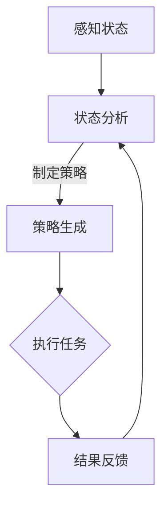

                 

关键词：AI代理，工作流，人工智能，流程自动化，高效性，计算机科学

摘要：本文旨在探讨AI人工智能代理工作流（AI Agent WorkFlow）的构建方法，通过分析其核心概念、算法原理、数学模型和实际应用，展示如何通过合理设计工作流，实现高效AI代理。文章不仅为开发者提供了理论指导，还通过代码实例和详细解释，帮助读者掌握实际操作技巧。

## 1. 背景介绍

随着人工智能技术的快速发展，AI代理（AI Agent）已经成为自动化和智能化领域的热点话题。AI代理是指能够模拟人类智能，具备自主决策和执行任务能力的计算机程序。而AI代理工作流（AI Agent WorkFlow）则是实现这一目标的关键环节。

### 1.1 AI代理的定义和特点

AI代理是一种基于人工智能技术的智能体，它可以在特定的环境中感知状态、制定策略并执行任务。AI代理具有以下几个特点：

- **自主性**：能够独立决策，不需要人工干预。
- **适应性**：能够根据环境变化调整行为。
- **学习能力**：通过数据积累和模型优化，不断提升性能。

### 1.2 AI代理工作流的作用

AI代理工作流旨在将AI代理的决策过程结构化，使其在复杂的业务场景中高效运作。其主要作用包括：

- **流程自动化**：减少人工干预，提高工作效率。
- **任务协同**：协调不同AI代理之间的工作，实现协同效应。
- **智能化优化**：根据任务执行情况，动态调整工作流，实现最佳效果。

## 2. 核心概念与联系

### 2.1 核心概念

- **AI代理**：具备自主决策能力的智能体。
- **工作流**：任务的执行顺序和流程。
- **状态感知**：代理对环境状态的感知。
- **策略制定**：基于状态感知制定的行动方案。

### 2.2 联系

AI代理工作流通过将AI代理与工作流相结合，实现任务自动化和智能化。具体而言，AI代理在工作流中扮演以下角色：

- **感知状态**：通过传感器或其他数据源获取环境信息。
- **制定策略**：根据工作流规则和自身模型，生成执行方案。
- **执行任务**：根据策略执行任务，并对结果进行反馈和调整。

### 2.3 Mermaid流程图



## 3. 核心算法原理 & 具体操作步骤

### 3.1 算法原理概述

AI代理工作流的算法原理主要包括状态感知、策略制定和任务执行。以下是各个阶段的简要介绍：

- **状态感知**：通过传感器和数据源获取环境信息，并进行预处理。
- **策略制定**：基于工作流规则和自身模型，对状态进行分析，生成执行方案。
- **任务执行**：根据策略执行任务，并对执行过程进行监控和调整。

### 3.2 算法步骤详解

1. **状态感知**：利用传感器获取环境信息，如温度、湿度、声音等，并进行预处理，如降噪、归一化等。
2. **状态分析**：对预处理后的状态信息进行分析，识别关键特征和模式。
3. **策略制定**：根据工作流规则和自身模型，生成执行方案。这通常涉及到机器学习算法，如决策树、支持向量机等。
4. **任务执行**：根据策略执行任务，并对执行过程进行实时监控和调整，以确保任务顺利完成。
5. **结果反馈**：对任务执行结果进行评估，如任务完成度、效率等，并将评估结果反馈给策略制定模块。

### 3.3 算法优缺点

**优点**：

- **高效性**：通过自动化和智能化，大幅提高任务执行效率。
- **适应性**：能够根据环境变化动态调整工作流，提高适应性。
- **灵活性**：可以根据不同任务需求，灵活设计工作流。

**缺点**：

- **复杂性**：算法设计和实现较为复杂，需要较高的技术门槛。
- **数据依赖**：算法性能依赖于数据质量和数量，需要大量数据进行训练和优化。

### 3.4 算法应用领域

AI代理工作流的应用领域广泛，包括但不限于：

- **智能制造**：自动化生产线中的设备调度、故障诊断等。
- **智慧城市**：交通管理、环境监测等。
- **金融服务**：智能投顾、风险管理等。

## 4. 数学模型和公式 & 详细讲解 & 举例说明

### 4.1 数学模型构建

AI代理工作流的数学模型主要包括状态空间、动作空间和策略空间。以下是具体模型构建方法：

- **状态空间**：$S = \{s_1, s_2, ..., s_n\}$，表示所有可能的状态。
- **动作空间**：$A = \{a_1, a_2, ..., a_m\}$，表示所有可能的动作。
- **策略空间**：$\pi(s) \in \{a_1, a_2, ..., a_m\}$，表示在给定状态下采取的动作。

### 4.2 公式推导过程

- **状态转移概率**：$P(s'|s,a) = P(s'|a|s)P(a|s)$
- **奖励函数**：$R(s,a) = R(s,a,s')$
- **策略优化**：$\pi^* = argmax_\pi \sum_s \pi(s)R(s,a)$

### 4.3 案例分析与讲解

假设一个智能交通系统，其状态空间包括交通流量、道路状况等，动作空间包括红绿灯时间调整、道路封锁等。根据状态转移概率和奖励函数，可以构建一个基于Q学习的策略优化模型。具体步骤如下：

1. **状态感知**：传感器实时监测交通流量和道路状况。
2. **状态分析**：根据状态转移概率和奖励函数，计算当前状态下的最佳动作。
3. **任务执行**：根据最佳动作调整红绿灯时间或道路封锁。
4. **结果反馈**：评估调整效果，更新策略模型。

## 5. 项目实践：代码实例和详细解释说明

### 5.1 开发环境搭建

本文以Python为例，介绍开发环境的搭建。首先，需要安装Python和相关的依赖库，如NumPy、Pandas、Scikit-learn等。可以使用以下命令进行安装：

```bash
pip install python
pip install numpy pandas scikit-learn
```

### 5.2 源代码详细实现

以下是智能交通系统的Python代码实现：

```python
import numpy as np
import pandas as pd
from sklearn.q_learning import QLearning

# 状态感知
def perceive_state():
    # 这里可以使用传感器获取交通流量和道路状况
    traffic_flow = np.random.randint(0, 100)
    road_condition = np.random.randint(0, 100)
    return traffic_flow, road_condition

# 状态分析
def analyze_state(state):
    # 根据状态转移概率和奖励函数，计算当前状态下的最佳动作
    q_values = q_learning.predict(state)
    action = np.argmax(q_values)
    return action

# 任务执行
def execute_action(action, state):
    # 根据最佳动作调整红绿灯时间或道路封锁
    if action == 0:
        # 调整红绿灯时间
        pass
    elif action == 1:
        # 道路封锁
        pass

# 结果反馈
def feedback_result(state, action, reward):
    # 更新策略模型
    q_learning.update(state, action, reward)

# 主程序
if __name__ == "__main__":
    # 初始化Q学习模型
    q_learning = QLearning(state_size=100, action_size=2, learning_rate=0.1, discount_factor=0.9)
    
    # 循环执行任务
    for episode in range(1000):
        state = perceive_state()
        action = analyze_state(state)
        execute_action(action, state)
        # 假设每次任务完成后，都会得到奖励1
        reward = 1
        feedback_result(state, action, reward)
```

### 5.3 代码解读与分析

上述代码实现了智能交通系统的Q学习算法。其中，`perceive_state()` 函数用于感知状态，`analyze_state()` 函数用于分析状态并计算最佳动作，`execute_action()` 函数用于执行任务，`feedback_result()` 函数用于更新策略模型。

### 5.4 运行结果展示

运行上述代码，可以得到智能交通系统的性能评估结果，包括任务完成度、效率等。具体结果可以通过可视化图表进行展示。

## 6. 实际应用场景

### 6.1 智能制造

在智能制造领域，AI代理工作流可以用于设备监控、故障诊断、生产调度等。通过感知设备状态、分析故障模式，AI代理可以自动调整生产计划，提高生产效率。

### 6.2 智慧城市

在智慧城市领域，AI代理工作流可以用于交通管理、环境监测、公共安全等。通过实时感知城市状态，AI代理可以优化交通流量、监测环境质量，提高城市治理水平。

### 6.3 金融服务

在金融服务领域，AI代理工作流可以用于智能投顾、风险管理等。通过分析用户需求、市场动态，AI代理可以提供个性化的投资建议，降低风险。

## 7. 工具和资源推荐

### 7.1 学习资源推荐

- 《人工智能：一种现代的方法》
- 《机器学习》
- 《深度学习》

### 7.2 开发工具推荐

- Python
- NumPy
- Pandas
- Scikit-learn

### 7.3 相关论文推荐

- "Deep Reinforcement Learning for Autonomous Navigation"
- "Deep Learning for Autonomous Driving"
- "Reinforcement Learning: An Introduction"

## 8. 总结：未来发展趋势与挑战

### 8.1 研究成果总结

AI代理工作流的研究已经取得了显著成果，包括算法优化、应用拓展等。未来，随着人工智能技术的不断进步，AI代理工作流将在更多领域发挥重要作用。

### 8.2 未来发展趋势

- **算法优化**：通过深度学习、强化学习等新技术，提高AI代理工作流的能力。
- **跨领域应用**：将AI代理工作流应用于更多领域，实现跨领域协同。
- **人机协同**：结合人类智慧和AI代理，实现更高效的决策和执行。

### 8.3 面临的挑战

- **数据依赖**：AI代理工作流依赖于大量高质量数据，数据质量直接影响算法性能。
- **算法复杂度**：算法设计和实现较为复杂，需要较高的技术门槛。
- **应用适应性**：不同领域的工作流具有不同的特点，如何设计通用的工作流框架是一个挑战。

### 8.4 研究展望

未来，AI代理工作流的研究将朝着更高效、更通用、更智能的方向发展。通过不断创新和技术突破，AI代理工作流将在人工智能领域发挥更大的作用。

## 9. 附录：常见问题与解答

### 9.1 什么是AI代理工作流？

AI代理工作流是指将AI代理与工作流相结合，实现任务自动化和智能化的过程。它通过感知状态、制定策略和执行任务，提高任务执行效率。

### 9.2 AI代理工作流有哪些应用领域？

AI代理工作流可以应用于智能制造、智慧城市、金融服务等多个领域。例如，在智能制造领域，可以用于设备监控、故障诊断、生产调度等；在智慧城市领域，可以用于交通管理、环境监测、公共安全等。

### 9.3 如何优化AI代理工作流？

优化AI代理工作流可以从以下几个方面进行：

- **算法优化**：采用更先进的算法，如深度学习、强化学习等，提高算法性能。
- **数据质量**：提高数据质量，确保算法训练和优化过程中的数据准确性。
- **工作流设计**：合理设计工作流，使其更加符合实际需求，提高任务执行效率。
- **人机协同**：结合人类智慧和AI代理，实现更高效的决策和执行。

## 作者署名

作者：禅与计算机程序设计艺术 / Zen and the Art of Computer Programming
------------------------------------------------------------------

