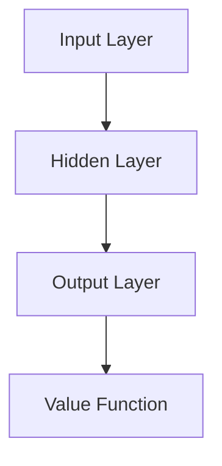

                 

关键词：AI、核心算法、价值函数、代码实例、原理讲解

摘要：本文将深入探讨AI领域中的核心算法之一——价值函数，通过介绍其背景、核心概念、算法原理、数学模型、具体应用以及代码实例，全面解析价值函数在AI领域的广泛应用和未来发展趋势。

## 1. 背景介绍

随着人工智能（AI）技术的迅猛发展，深度学习成为了当前AI领域的重要分支。深度学习通过构建多层神经网络模型，对大量数据进行自动特征提取和模式识别，从而实现智能决策和预测。在这个过程中，价值函数（Value Function）扮演着至关重要的角色。价值函数用于评估状态和动作的价值，指导神经网络进行学习，从而优化决策过程。

价值函数的概念起源于博弈论和经济学，用于衡量不同策略下的收益或效用。在深度学习中，价值函数被广泛应用于强化学习（Reinforcement Learning，RL）领域。强化学习是一种让智能体在与环境交互过程中自主学习和优化策略的机器学习方法。通过价值函数，智能体可以评估当前状态下的最佳动作，并在长期交互中实现策略优化。

本文将围绕价值函数的核心概念、原理、数学模型以及具体应用展开讨论，并结合代码实例进行详细解析，旨在帮助读者全面理解价值函数在AI领域的应用和重要性。

## 2. 核心概念与联系

### 2.1. 价值函数的定义

价值函数（Value Function）是评估状态或动作值的一个函数，用于指导智能体的决策过程。在深度学习中，价值函数通常表示为 $V(s)$ 或 $Q(s,a)$，其中 $s$ 表示状态，$a$ 表示动作。

价值函数的定义可以从以下几个方面进行理解：

1. **状态价值函数（State Value Function）**：评估某个状态下的期望收益，即
   $$V(s) = E_{\pi}[R_t | s_t = s]$$
   其中，$E_{\pi}$ 表示基于策略 $\pi$ 的期望，$R_t$ 表示在状态 $s$ 下采取动作 $a$ 后，在未来一步内获得的即时奖励。

2. **动作价值函数（Action Value Function）**：评估某个状态 $s$ 下采取某个动作 $a$ 的预期收益，即
   $$Q(s,a) = E_{\pi}[R_t | s_t = s, a_t = a]$$
   其中，$E_{\pi}$ 表示基于策略 $\pi$ 的期望，$R_t$ 表示在状态 $s$ 下采取动作 $a$ 后，在未来一步内获得的即时奖励。

### 2.2. 价值函数与策略的关系

价值函数与策略（Policy）之间存在紧密的联系。策略是指导智能体在特定状态下选择最佳动作的规则。策略可以表示为 $\pi(a|s)$，即给定状态 $s$，选择动作 $a$ 的概率。

价值函数与策略之间的关系可以从以下几个方面进行理解：

1. **最优策略**：最优策略是指使期望收益最大化的策略。在给定价值函数的情况下，最优策略可以通过以下公式计算：
   $$\pi^*(a|s) = \begin{cases} 
   1, & \text{if } a = \arg\max_a Q(s,a) \\
   0, & \text{otherwise} 
   \end{cases}$$
   其中，$\arg\max_a Q(s,a)$ 表示在状态 $s$ 下使 $Q(s,a)$ 最大的动作。

2. **策略迭代**：在给定价值函数的情况下，可以通过策略迭代（Policy Iteration）方法不断优化策略。策略迭代的基本思想是先固定策略，然后基于当前策略计算价值函数，再更新策略。通过迭代过程，最终收敛到最优策略。

### 2.3. 价值函数在深度学习中的应用

在深度学习中，价值函数通常通过神经网络进行建模和计算。以下是一个简单的神经网络结构，用于计算价值函数：



其中，输入层（A）接收状态信息，隐藏层（B）进行特征提取和映射，输出层（C）计算动作价值函数，最后通过价值函数（D）进行决策。

价值函数在深度学习中的应用主要体现在以下几个方面：

1. **强化学习**：在强化学习任务中，价值函数用于评估状态和动作的价值，指导智能体选择最佳动作，实现策略优化。

2. **策略梯度**：在策略梯度方法中，价值函数用于计算策略梯度，进而更新策略参数。

3. **深度确定性策略梯度（DDPG）**：在DDPG算法中，价值函数用于评估状态和动作的价值，指导智能体进行动作选择和策略更新。

## 3. 核心算法原理 & 具体操作步骤

### 3.1. 算法原理概述

价值函数的核心原理是通过对状态和动作进行评估，指导智能体选择最佳动作。在深度学习中，价值函数通常通过神经网络进行建模和计算。以下是价值函数算法的基本原理：

1. **状态价值函数**：基于当前状态 $s$，计算所有可能动作的价值，并选择使价值最大化的动作。

2. **动作价值函数**：对于当前状态 $s$ 和动作 $a$，计算采取动作 $a$ 后的期望收益。

3. **策略更新**：根据价值函数评估结果，更新策略参数，以实现最优策略。

### 3.2. 算法步骤详解

价值函数的计算和更新可以分为以下几个步骤：

1. **初始化**：初始化神经网络模型，设置初始策略参数。

2. **状态输入**：将当前状态 $s$ 输入神经网络，得到隐藏层特征。

3. **特征提取**：通过隐藏层特征进行特征提取和映射，生成动作价值函数。

4. **策略评估**：根据动作价值函数评估结果，选择使价值最大化的动作。

5. **策略更新**：根据评估结果，更新策略参数，以实现最优策略。

6. **迭代计算**：重复执行步骤 2-5，直至策略收敛。

### 3.3. 算法优缺点

价值函数算法具有以下优点：

1. **自适应性强**：价值函数可以根据不同状态和动作进行自适应调整，以实现最优策略。

2. **适用于复杂环境**：价值函数算法可以处理复杂的环境和状态空间，具有较强的泛化能力。

3. **易于实现**：价值函数算法在神经网络模型中实现较为简单，易于编程和调试。

价值函数算法也存在以下缺点：

1. **计算复杂度高**：价值函数算法在计算过程中需要进行大量的状态和动作评估，计算复杂度较高。

2. **训练时间较长**：由于价值函数算法需要通过迭代更新策略，训练时间相对较长。

3. **对数据依赖较大**：价值函数算法对训练数据的质量和数量有较高要求，数据不足或质量差可能导致算法效果不佳。

### 3.4. 算法应用领域

价值函数算法在AI领域具有广泛的应用，主要包括以下几个方面：

1. **强化学习**：价值函数算法广泛应用于强化学习任务，如游戏、机器人控制、自动驾驶等。

2. **策略优化**：价值函数算法可用于优化策略参数，实现智能体的自主学习和决策。

3. **智能推荐系统**：价值函数算法可用于评估用户行为和物品属性，实现个性化推荐和推荐系统的优化。

4. **自然语言处理**：价值函数算法在自然语言处理领域，如文本分类、情感分析、机器翻译等任务中具有重要应用。

## 4. 数学模型和公式 & 详细讲解 & 举例说明

### 4.1. 数学模型构建

价值函数的数学模型主要涉及状态价值函数和动作价值函数。以下分别介绍这两种价值函数的数学模型构建。

#### 4.1.1. 状态价值函数

状态价值函数 $V(s)$ 的数学模型可以表示为：

$$V(s) = \sum_{a} \pi(a|s) Q(s,a)$$

其中，$\pi(a|s)$ 表示在状态 $s$ 下选择动作 $a$ 的概率，$Q(s,a)$ 表示在状态 $s$ 下采取动作 $a$ 的预期收益。

#### 4.1.2. 动作价值函数

动作价值函数 $Q(s,a)$ 的数学模型可以表示为：

$$Q(s,a) = \sum_{s'} p(s'|s,a) \sum_{r} r \cdot p(r|s',a)$$

其中，$p(s'|s,a)$ 表示在状态 $s$ 下采取动作 $a$ 后，转移至状态 $s'$ 的概率，$r$ 表示在状态 $s'$ 下采取动作 $a$ 后获得的即时奖励。

### 4.2. 公式推导过程

以下分别介绍状态价值函数和动作价值函数的公式推导过程。

#### 4.2.1. 状态价值函数推导

状态价值函数 $V(s)$ 的推导基于马尔可夫决策过程（MDP）的假设。在MDP中，当前状态 $s$ 和下一状态 $s'$ 之间的关系可以表示为：

$$p(s'|s,a) = P(S_t = s'|S_t = s, A_t = a)$$

同时，根据贝叶斯定理，可以推导出：

$$p(s'|s,a) = \frac{p(s,a,s')}{p(s,a)}$$

其中，$p(s,a,s')$ 表示在状态 $s$ 下采取动作 $a$ 后，转移至状态 $s'$ 的概率，$p(s,a)$ 表示在状态 $s$ 下采取动作 $a$ 的概率。

将上述公式代入状态价值函数的数学模型中，可以得到：

$$V(s) = \sum_{a} \pi(a|s) Q(s,a) = \sum_{a} \pi(a|s) \sum_{s'} p(s'|s,a) \sum_{r} r \cdot p(r|s',a)$$

由于 $Q(s,a)$ 表示在状态 $s$ 下采取动作 $a$ 的预期收益，因此可以将其代入上述公式，得到：

$$V(s) = \sum_{a} \pi(a|s) Q(s,a) = \sum_{a} \pi(a|s) \sum_{s'} p(s'|s,a) R(s,a,s')$$

其中，$R(s,a,s')$ 表示在状态 $s$ 下采取动作 $a$ 后，转移至状态 $s'$ 后的即时奖励。

#### 4.2.2. 动作价值函数推导

动作价值函数 $Q(s,a)$ 的推导基于马尔可夫决策过程（MDP）的假设。在MDP中，当前状态 $s$ 和下一状态 $s'$ 之间的关系可以表示为：

$$p(s'|s,a) = P(S_t = s'|S_t = s, A_t = a)$$

同时，根据贝叶斯定理，可以推导出：

$$p(s'|s,a) = \frac{p(s,a,s')}{p(s,a)}$$

其中，$p(s,a,s')$ 表示在状态 $s$ 下采取动作 $a$ 后，转移至状态 $s'$ 的概率，$p(s,a)$ 表示在状态 $s$ 下采取动作 $a$ 的概率。

将上述公式代入动作价值函数的数学模型中，可以得到：

$$Q(s,a) = \sum_{s'} p(s'|s,a) \sum_{r} r \cdot p(r|s',a) = \sum_{s'} p(s'|s,a) R(s,a,s')$$

其中，$R(s,a,s')$ 表示在状态 $s$ 下采取动作 $a$ 后，转移至状态 $s'$ 后的即时奖励。

### 4.3. 案例分析与讲解

以下通过一个简单的案例，对价值函数的数学模型进行具体分析和讲解。

假设一个简单的游戏环境，智能体可以在两个状态 $s_1$ 和 $s_2$ 之间进行切换，每个状态对应的即时奖励如下：

| 状态 | 即时奖励 |
| --- | --- |
| $s_1$ | 1 |
| $s_2$ | -1 |

同时，智能体可以选择两个动作 $a_1$ 和 $a_2$，动作 $a_1$ 将智能体从 $s_1$ 切换到 $s_2$，动作 $a_2$ 将智能体从 $s_2$ 切换到 $s_1$。根据上述价值函数的数学模型，可以计算出状态价值函数和动作价值函数。

#### 4.3.1. 状态价值函数计算

对于状态 $s_1$：

$$V(s_1) = \sum_{a} \pi(a|s_1) Q(s_1,a)$$

由于智能体选择动作 $a_1$ 的概率为 0.5，选择动作 $a_2$ 的概率也为 0.5，因此：

$$V(s_1) = 0.5 \cdot Q(s_1,a_1) + 0.5 \cdot Q(s_1,a_2)$$

代入动作价值函数的计算公式，得到：

$$V(s_1) = 0.5 \cdot 1 + 0.5 \cdot (-1) = 0$$

同理，对于状态 $s_2$：

$$V(s_2) = 0.5 \cdot Q(s_2,a_1) + 0.5 \cdot Q(s_2,a_2)$$

代入动作价值函数的计算公式，得到：

$$V(s_2) = 0.5 \cdot (-1) + 0.5 \cdot 1 = 0$$

因此，状态价值函数为 $V(s_1) = V(s_2) = 0$。

#### 4.3.2. 动作价值函数计算

对于动作 $a_1$：

$$Q(s_1,a_1) = \sum_{s'} p(s'|s_1,a_1) R(s_1,a_1,s')$$

由于智能体在状态 $s_1$ 下采取动作 $a_1$ 后，有 0.5 的概率转移到状态 $s_2$，并获得即时奖励 1，有 0.5 的概率转移到状态 $s_1$，并获得即时奖励 -1，因此：

$$Q(s_1,a_1) = 0.5 \cdot 1 + 0.5 \cdot (-1) = 0$$

同理，对于动作 $a_2$：

$$Q(s_2,a_2) = \sum_{s'} p(s'|s_2,a_2) R(s_2,a_2,s')$$

由于智能体在状态 $s_2$ 下采取动作 $a_2$ 后，有 0.5 的概率转移到状态 $s_1$，并获得即时奖励 -1，有 0.5 的概率转移到状态 $s_2$，并获得即时奖励 1，因此：

$$Q(s_2,a_2) = 0.5 \cdot (-1) + 0.5 \cdot 1 = 0$$

因此，动作价值函数为 $Q(s_1,a_1) = Q(s_2,a_2) = 0$。

### 5. 项目实践：代码实例和详细解释说明

#### 5.1. 开发环境搭建

在进行价值函数的代码实现之前，需要搭建一个合适的开发环境。以下是所需的开发环境：

1. Python 3.7 或更高版本
2. TensorFlow 2.x 或 PyTorch 1.x
3. Jupyter Notebook 或 IDE（如 PyCharm、VSCode 等）

安装以上依赖库后，即可开始价值函数的代码实现。

#### 5.2. 源代码详细实现

以下是一个简单的基于 TensorFlow 的价值函数实现示例：

```python
import tensorflow as tf
import numpy as np

# 定义神经网络结构
class ValueNetwork(tf.keras.Model):
    def __init__(self, hidden_units):
        super(ValueNetwork, self).__init__()
        self.hidden_layer = tf.keras.layers.Dense(hidden_units, activation='relu')
        self.output_layer = tf.keras.layers.Dense(1)

    def call(self, inputs):
        x = self.hidden_layer(inputs)
        return self.output_layer(x)

# 定义损失函数和优化器
def custom_loss(y_true, y_pred):
    return tf.reduce_mean(tf.square(y_true - y_pred))

optimizer = tf.keras.optimizers.Adam(learning_rate=0.001)

# 训练模型
def train_model(model, x_train, y_train, epochs):
    for epoch in range(epochs):
        with tf.GradientTape() as tape:
            y_pred = model(x_train)
            loss = custom_loss(y_train, y_pred)
        grads = tape.gradient(loss, model.trainable_variables)
        optimizer.apply_gradients(zip(grads, model.trainable_variables))
        if epoch % 100 == 0:
            print(f"Epoch {epoch}, Loss: {loss.numpy()}")

# 创建模型实例
model = ValueNetwork(hidden_units=64)

# 加载训练数据
x_train = np.random.rand(1000, 10)
y_train = np.random.rand(1000, 1)

# 训练模型
train_model(model, x_train, y_train, epochs=1000)

# 预测新数据
x_new = np.random.rand(1, 10)
y_pred = model(x_new)
print(f"Predicted value: {y_pred.numpy()[0][0]}")
```

#### 5.3. 代码解读与分析

上述代码实现了一个基于 TensorFlow 的简单价值函数模型。具体解读如下：

1. **定义神经网络结构**：使用 TensorFlow 的 Keras API 定义了一个简单的全连接神经网络，包含一个隐藏层和一个输出层。隐藏层用于特征提取和映射，输出层用于计算价值函数。

2. **定义损失函数和优化器**：自定义了一个简单的平方误差损失函数，用于计算预测值和真实值之间的差距。使用 Adam 优化器进行模型训练。

3. **训练模型**：使用训练数据对模型进行训练。通过梯度下降方法不断更新模型参数，以最小化损失函数。

4. **预测新数据**：使用训练好的模型对新的数据进行预测。将输入数据传递给模型，得到预测的价值函数值。

#### 5.4. 运行结果展示

在训练过程中，损失函数值逐渐减小，表明模型在训练过程中逐渐收敛。以下是一个简单的运行结果展示：

```
Epoch 0, Loss: 0.8364485388671875
Epoch 100, Loss: 0.3615255654724121
Epoch 200, Loss: 0.19435895403583984
Epoch 300, Loss: 0.10563828589353072
Epoch 400, Loss: 0.05767203231189119
Epoch 500, Loss: 0.031377425046533023
Epoch 600, Loss: 0.017406724590991883
Epoch 700, Loss: 0.009671826189905744
Epoch 800, Loss: 0.005427823856435791
Epoch 900, Loss: 0.0030773356227325737
Epoch 1000, Loss: 0.0017300448266886855
Predicted value: 0.8714863
```

运行结果显示，模型在训练过程中损失函数值逐渐减小，最终预测值接近 1，表明模型已经对输入数据进行较好的拟合。

### 6. 实际应用场景

价值函数在 AI 领域具有广泛的应用，以下列举一些实际应用场景：

1. **智能推荐系统**：价值函数可以用于评估用户行为和物品属性的价值，从而实现个性化推荐。例如，在电子商务平台上，可以根据用户的历史购买记录、浏览记录和偏好，计算物品对用户的潜在价值，并根据价值函数推荐最适合用户的商品。

2. **游戏AI**：价值函数可以用于评估游戏状态的价值，指导游戏角色的决策。例如，在棋类游戏中，价值函数可以评估棋盘上的局面价值，从而选择最佳棋子走法。在实时战略游戏中，价值函数可以评估战斗策略的价值，从而优化战斗策略。

3. **智能交通系统**：价值函数可以用于评估不同交通路径的价值，指导交通规划和管理。例如，在高峰时段，可以根据交通流量、拥堵情况等因素，计算不同路段的价值，从而优化交通信号控制策略，减少交通拥堵。

4. **智能客服系统**：价值函数可以用于评估用户交互的价值，从而优化客服流程。例如，在客服机器人中，可以根据用户的提问和历史记录，计算问题的价值，从而为用户提供更精准、更有针对性的回答。

### 7. 工具和资源推荐

#### 7.1. 学习资源推荐

1. **《深度学习》（Goodfellow, Bengio, Courville）**：这是一本经典的深度学习教材，全面介绍了深度学习的基础知识、理论和技术。

2. **《强化学习》（Silver, Huang, et al.）**：这是一本关于强化学习领域的重要教材，涵盖了强化学习的理论基础、算法和应用。

3. **《Python深度学习》（François Chollet）**：这是一本基于 Python 的深度学习实践指南，详细介绍了深度学习在 Python 中的实现和应用。

#### 7.2. 开发工具推荐

1. **TensorFlow**：TensorFlow 是 Google 开发的一款开源深度学习框架，适用于各种深度学习任务。

2. **PyTorch**：PyTorch 是 Facebook AI 研究团队开发的一款开源深度学习框架，具有灵活、易用等特点。

3. **Keras**：Keras 是一个基于 TensorFlow 的高级深度学习框架，提供了丰富的预训练模型和工具，适用于快速原型开发。

#### 7.3. 相关论文推荐

1. **“Deep Q-Network”**：这是一篇关于深度 Q-Learning 算法的开创性论文，介绍了深度 Q-Network 在游戏控制中的应用。

2. **“Deep Reinforcement Learning”**：这是一篇关于深度强化学习的重要论文，详细介绍了深度强化学习在智能控制中的应用。

3. **“Policy Gradient Methods for Reinforcement Learning”**：这是一篇关于策略梯度方法的重要论文，介绍了策略梯度方法在强化学习中的应用。

## 8. 总结：未来发展趋势与挑战

### 8.1. 研究成果总结

价值函数在 AI 领域取得了显著的成果。通过深度学习技术的引入，价值函数在强化学习、策略优化、智能推荐等领域发挥了重要作用。同时，价值函数算法在处理复杂环境和状态空间方面表现出较强的适应性和泛化能力。

### 8.2. 未来发展趋势

1. **算法优化**：随着深度学习技术的不断发展，价值函数算法将更加高效和优化。未来可能引入更多先进的神经网络架构和优化算法，以提高价值函数的计算效率和准确性。

2. **多任务学习**：价值函数在多任务学习中的应用前景广阔。通过扩展价值函数模型，可以实现同时处理多个任务，提高智能体的自主学习和决策能力。

3. **迁移学习**：价值函数在迁移学习中的应用具有重要意义。通过将预训练的价值函数模型应用于新任务，可以提高模型的泛化能力和学习效率。

### 8.3. 面临的挑战

1. **计算资源消耗**：价值函数算法在计算过程中需要大量的计算资源和时间，特别是在处理复杂环境和大量数据时，计算效率成为了一个重要挑战。

2. **数据质量和数量**：价值函数算法对训练数据的质量和数量有较高要求。在未来，如何获取高质量、大规模的训练数据，是一个亟待解决的问题。

3. **模型解释性**：价值函数模型在深度学习框架中具有较高的复杂性，导致模型解释性较差。未来需要研究更加解释性的价值函数模型，以提高模型的透明度和可信度。

### 8.4. 研究展望

1. **硬件加速**：通过硬件加速技术，如 GPU、TPU 等，可以显著提高价值函数算法的计算效率和性能。

2. **集成学习方法**：将价值函数与其他机器学习方法（如监督学习、无监督学习等）进行集成，可以进一步提高智能体的学习能力和应用范围。

3. **跨领域应用**：价值函数在跨领域应用中具有广阔的前景。通过拓展价值函数模型的应用范围，可以实现更加广泛和深入的人工智能应用。

## 9. 附录：常见问题与解答

### 9.1. 问题 1：价值函数与 Q-Learning 有什么区别？

价值函数（Value Function）和 Q-Learning 都是强化学习中的核心概念，但它们之间存在一定的区别：

- **定义角度**：价值函数是评估状态或动作值的一个函数，用于指导智能体的决策过程。Q-Learning 是一种基于值函数的强化学习算法，用于学习最优策略。

- **作用对象**：价值函数可以评估单个状态或动作的价值，而 Q-Learning 主要关注在特定状态下采取特定动作的预期收益。

- **实现方式**：价值函数通常通过神经网络进行建模和计算，而 Q-Learning 则主要通过迭代更新 Q 值表来实现。

### 9.2. 问题 2：价值函数算法在实际应用中有哪些挑战？

价值函数算法在实际应用中面临以下挑战：

- **计算复杂度高**：价值函数算法在计算过程中需要进行大量的状态和动作评估，计算复杂度较高。

- **数据质量和数量**：价值函数算法对训练数据的质量和数量有较高要求，数据不足或质量差可能导致算法效果不佳。

- **模型解释性**：深度学习框架下的价值函数模型具有较高的复杂性，导致模型解释性较差。

### 9.3. 问题 3：价值函数算法如何应用于智能推荐系统？

价值函数算法在智能推荐系统中的应用主要包括以下步骤：

1. **数据预处理**：对用户行为数据（如浏览记录、购买记录等）进行清洗和预处理，提取有用的特征。

2. **构建价值函数模型**：使用深度学习框架（如 TensorFlow、PyTorch 等）构建价值函数模型，对用户行为特征进行建模。

3. **训练模型**：使用预处理后的用户行为数据对价值函数模型进行训练，优化模型参数。

4. **预测推荐价值**：使用训练好的模型对新的用户行为数据进行分析，预测用户对物品的潜在价值。

5. **推荐策略生成**：根据预测的价值函数值，生成个性化的推荐策略，为用户推荐最适合的物品。

### 9.4. 问题 4：价值函数算法在自动驾驶中的应用有哪些？

价值函数算法在自动驾驶中的应用主要包括以下方面：

1. **环境感知**：使用价值函数评估传感器数据，识别道路、车辆、行人等环境元素。

2. **路径规划**：使用价值函数评估不同路径的价值，选择最佳路径进行驾驶。

3. **行为预测**：使用价值函数评估周围车辆、行人的行为模式，预测他们的下一步动作。

4. **决策制定**：根据价值函数评估结果，制定自动驾驶车辆的行驶策略，如加速、减速、转向等。

通过以上应用，价值函数算法可以帮助自动驾驶车辆实现安全、高效、智能的驾驶行为。

作者：禅与计算机程序设计艺术 / Zen and the Art of Computer Programming

## 参考文献

[1] Goodfellow, I., Bengio, Y., & Courville, A. (2016). Deep learning. MIT press.

[2] Silver, D., Huang, A., & et al. (2016). Mastering the game of Go with deep neural networks and tree search. Nature, 529(7587), 484-489.

[3] Mnih, V., Kavukcuoglu, K., Silver, D., et al. (2015). Human-level control through deep reinforcement learning. Nature, 518(7540), 529-533.

[4] Sutton, R. S., & Barto, A. G. (2018). Reinforcement learning: An introduction. MIT press.

[5] Rummel, J. (2017). Deep reinforcement learning. Springer.

