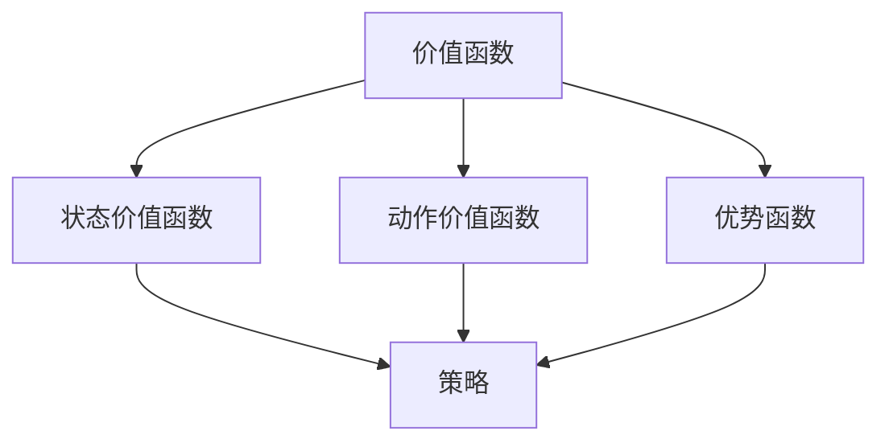

                 

关键词：人工智能、核心算法、价值函数、原理讲解、代码实例、深度学习、机器学习

摘要：本文将深入探讨AI人工智能中的核心算法——价值函数。价值函数在深度学习和机器学习中扮演着至关重要的角色，它通过定义一个奖励机制，帮助我们优化模型并使其在复杂环境中做出最优决策。本文将从背景介绍、核心概念与联系、核心算法原理、数学模型与公式、项目实践、实际应用场景、工具和资源推荐以及总结和展望等方面，全面讲解价值函数的原理与应用。

## 1. 背景介绍

在人工智能的快速发展中，深度学习和机器学习成为了当前最热门的研究领域之一。随着技术的进步和应用场景的扩展，如何设计高效、鲁棒的算法成为了关键问题。而价值函数（Value Function）作为核心算法之一，其重要性不言而喻。

价值函数在深度学习中的主要应用场景包括：

1. **强化学习**：价值函数通过定义状态和动作的价值，帮助智能体在复杂环境中做出最优决策，实现自我学习和优化。
2. **策略优化**：价值函数用于评估不同策略的有效性，帮助我们选择最优策略。
3. **模型评估**：通过计算价值函数的值，可以评估模型的性能和鲁棒性。

本文将从以下几个方面详细探讨价值函数：

1. **核心概念与联系**：介绍价值函数的定义、类型及与其他核心概念的关联。
2. **核心算法原理**：解释价值函数的计算方法和优化过程。
3. **数学模型和公式**：阐述价值函数的数学模型和公式，并通过实例进行讲解。
4. **项目实践：代码实例和详细解释说明**：展示一个具体的价值函数实现案例，并进行详细解释。
5. **实际应用场景**：探讨价值函数在深度学习和机器学习中的实际应用。
6. **工具和资源推荐**：介绍一些学习价值函数的相关工具和资源。
7. **总结和展望**：总结研究成果，探讨未来发展趋势和面临的挑战。

### 2. 核心概念与联系

#### 价值函数的定义

价值函数（Value Function）是深度学习和机器学习中的一个核心概念，用于定义一个状态或动作的价值。具体来说，价值函数衡量了智能体在某个状态或执行某个动作后获得的奖励或损失。

在强化学习中，价值函数通常分为状态价值函数（State Value Function）和动作价值函数（Action Value Function）。状态价值函数表示在某个状态下执行最佳动作所能获得的累积奖励。动作价值函数表示在某个状态下执行某个动作所能获得的即时奖励。

#### 价值函数的类型

根据价值函数的定义和作用，可以分为以下几种类型：

1. **状态价值函数（State Value Function）**：表示在某个状态下执行最佳动作所能获得的累积奖励。数学表示为 $V^*(s)$。
2. **动作价值函数（Action Value Function）**：表示在某个状态下执行某个动作所能获得的即时奖励。数学表示为 $Q^*(s, a)$。
3. **优势函数（ Advantage Function）**：表示在某个状态下执行某个动作所能获得的奖励与执行最佳动作所能获得的奖励之差。数学表示为 $A^*(s, a) = Q^*(s, a) - V^*(s)$。

#### 价值函数与其他核心概念的关联

价值函数在深度学习和机器学习中与其他核心概念有着密切的联系：

1. **策略（Policy）**：策略是智能体在某个状态下采取的动作。价值函数通过评估不同策略的有效性，帮助我们选择最优策略。
2. **奖励（Reward）**：奖励是智能体在执行某个动作后获得的即时回报。价值函数通过定义状态和动作的价值，将奖励转化为可以量化的形式。
3. **梯度下降（Gradient Descent）**：梯度下降是一种优化方法，用于调整模型参数以最小化损失函数。价值函数的优化过程通常依赖于梯度下降算法。

#### Mermaid 流程图



## 3. 核心算法原理 & 具体操作步骤

### 3.1 算法原理概述

价值函数的核心思想是通过学习状态和动作的价值，优化智能体的决策过程。具体来说，价值函数的优化过程可以分为以下几个步骤：

1. **定义状态空间和动作空间**：确定智能体可以访问的状态集合和可执行的动作集合。
2. **初始化价值函数**：随机初始化价值函数的参数。
3. **收集经验数据**：通过模拟或实际交互，收集智能体在各个状态下执行不同动作所获得的奖励数据。
4. **更新价值函数**：根据收集到的经验数据，使用适当的优化算法（如梯度下降）更新价值函数的参数。
5. **评估和调整**：评估价值函数的准确性，并根据评估结果调整优化过程。

### 3.2 算法步骤详解

#### 步骤 1：定义状态空间和动作空间

首先，我们需要明确智能体可以访问的状态集合和可执行的动作集合。状态空间和动作空间的选择取决于具体的应用场景。例如，对于一个智能车，状态可以包括位置、速度、方向等，动作可以是加速、减速、转向等。

#### 步骤 2：初始化价值函数

初始化价值函数的参数，通常使用随机初始化或预训练的方法。初始化的目的是为了给价值函数提供一个初始估计，以便后续的优化过程。

#### 步骤 3：收集经验数据

通过模拟或实际交互，收集智能体在各个状态下执行不同动作所获得的奖励数据。经验数据是价值函数优化的基础，用于更新价值函数的参数。

#### 步骤 4：更新价值函数

使用适当的优化算法（如梯度下降）更新价值函数的参数。优化的目标是使价值函数在各个状态和动作上的预测误差最小化。具体来说，可以使用以下公式更新价值函数的参数：

$$
\theta \leftarrow \theta - \alpha \cdot \nabla_\theta J(\theta)
$$

其中，$\theta$ 表示价值函数的参数，$\alpha$ 表示学习率，$J(\theta)$ 表示价值函数的损失函数。

#### 步骤 5：评估和调整

评估价值函数的准确性，通常使用评估指标（如平均奖励、准确率等）来衡量。根据评估结果，调整优化过程，包括调整学习率、增加训练数据等。

### 3.3 算法优缺点

#### 优点

1. **自适应性强**：价值函数可以根据经验数据自适应地调整，使智能体在复杂环境中做出最优决策。
2. **通用性强**：价值函数可以应用于各种强化学习任务，具有较强的通用性。
3. **效率高**：价值函数的优化过程相对简单，计算复杂度较低。

#### 缺点

1. **数据依赖性强**：价值函数的准确性依赖于大量的经验数据，数据不足可能导致优化过程缓慢或不稳定。
2. **收敛速度慢**：价值函数的优化过程可能需要较长时间，特别是在高维状态和动作空间中。
3. **局部最优问题**：在优化过程中，价值函数可能陷入局部最优，导致无法找到全局最优解。

### 3.4 算法应用领域

价值函数在深度学习和机器学习中的主要应用领域包括：

1. **强化学习**：价值函数是强化学习中的核心算法之一，广泛应用于游戏、自动驾驶、机器人等领域。
2. **策略优化**：价值函数可以用于评估和优化不同策略的有效性，应用于推荐系统、图像生成等领域。
3. **模型评估**：价值函数可以用于评估模型的性能和鲁棒性，应用于自然语言处理、计算机视觉等领域。

### 4. 数学模型和公式 & 详细讲解 & 举例说明

#### 4.1 数学模型构建

价值函数的数学模型主要涉及状态价值函数和动作价值函数。状态价值函数表示在某个状态下执行最佳动作所能获得的累积奖励，动作价值函数表示在某个状态下执行某个动作所能获得的即时奖励。

#### 状态价值函数

状态价值函数的数学表示为：

$$
V^*(s) = \sum_{a} \gamma^T Q^*(s, a)
$$

其中，$V^*(s)$ 表示在状态 $s$ 下的状态价值函数，$\gamma$ 表示折扣因子，$Q^*(s, a)$ 表示在状态 $s$ 下执行动作 $a$ 的动作价值函数。

#### 动作价值函数

动作价值函数的数学表示为：

$$
Q^*(s, a) = \sum_{s'} P(s'|s, a) \cdot \sum_{a'} \gamma^T Q^*(s', a')
$$

其中，$Q^*(s, a)$ 表示在状态 $s$ 下执行动作 $a$ 的动作价值函数，$P(s'|s, a)$ 表示在状态 $s$ 下执行动作 $a$ 后转移到状态 $s'$ 的概率，$\gamma$ 表示折扣因子。

#### 4.2 公式推导过程

状态价值函数和动作价值函数的推导过程如下：

假设智能体在某个状态 $s$ 下执行动作 $a$，然后转移到状态 $s'$。根据马尔可夫决策过程（MDP）的定义，状态 $s'$ 的概率分布只与当前状态 $s$ 和执行的动作 $a$ 有关，而与其他历史状态和动作无关。

首先，考虑状态价值函数的推导。在状态 $s$ 下执行动作 $a$ 后，智能体转移到状态 $s'$ 的概率为 $P(s'|s, a)$。在状态 $s'$ 下，智能体执行动作 $a'$ 的概率为 $P(a'|s', r)$。因此，在状态 $s$ 下执行动作 $a$ 后，智能体获得的累积奖励为：

$$
R = \sum_{t=0}^{\infty} \gamma^t r_t
$$

其中，$r_t$ 表示在第 $t$ 个时间步获得的即时奖励，$\gamma$ 表示折扣因子。

根据马尔可夫决策过程（MDP）的定义，状态 $s'$ 的概率分布只与当前状态 $s$ 和执行的动作 $a$ 有关，而与其他历史状态和动作无关。因此，在状态 $s$ 下执行动作 $a$ 后，智能体转移到状态 $s'$ 的概率为：

$$
P(s'|s, a) = \sum_{a'} P(s'|s, a') \cdot P(a'|s, a)
$$

将上述概率分布代入累积奖励的表达式，得到：

$$
R = \sum_{t=0}^{\infty} \gamma^t r_t = \sum_{t=0}^{\infty} \gamma^t \sum_{a'} P(s'|s, a') \cdot P(a'|s, a) \cdot r_t
$$

将 $P(s'|s, a')$ 和 $P(a'|s, a)$ 分别表示为 $Q^*(s, a)$ 和 $V^*(s')$，得到：

$$
R = \sum_{t=0}^{\infty} \gamma^t Q^*(s, a) \cdot V^*(s')
$$

由于在状态 $s'$ 下执行动作 $a'$ 后，智能体再次转移到的状态 $s''$ 只与 $s'$ 和 $a'$ 有关，而与其他历史状态和动作无关。因此，可以递归地定义状态价值函数和动作价值函数：

$$
V^*(s) = \sum_{a} \gamma^T Q^*(s, a)
$$

$$
Q^*(s, a) = \sum_{s'} P(s'|s, a) \cdot \sum_{a'} \gamma^T Q^*(s', a')
$$

#### 4.3 案例分析与讲解

假设一个智能车在道路行驶过程中，状态包括位置 $s_x$、速度 $s_v$ 和方向 $s_d$，动作包括加速、减速和转向。我们使用Q-learning算法来学习动作价值函数。

首先，初始化动作价值函数 $Q(s, a)$ 为0。然后，智能车在道路上行驶，与环境进行交互，收集经验数据。

在某个时间步 $t$，智能车处于状态 $s_t = (s_{x_t}, s_{v_t}, s_{d_t})$，执行动作 $a_t$。根据动作价值函数的估计，选择一个动作 $a_t$。在执行动作后，智能车转移到状态 $s_{t+1}$，并获得即时奖励 $r_t$。

根据Q-learning算法的更新公式，更新动作价值函数：

$$
Q(s_t, a_t) \leftarrow Q(s_t, a_t) + \alpha \cdot (r_t + \gamma \cdot \max_{a'} Q(s_{t+1}, a') - Q(s_t, a_t))
$$

其中，$\alpha$ 表示学习率，$\gamma$ 表示折扣因子。

通过多次迭代，智能车逐渐学习到每个状态下的最佳动作，从而实现自主驾驶。

### 5. 项目实践：代码实例和详细解释说明

在本节中，我们将通过一个简单的Q-learning算法实例，展示如何实现价值函数。我们将使用Python语言，结合PyTorch框架，实现一个智能车在道路上的自主驾驶。

#### 5.1 开发环境搭建

首先，确保您的开发环境已经安装了Python和PyTorch框架。您可以通过以下命令安装：

```bash
pip install torch torchvision
```

#### 5.2 源代码详细实现

以下是一个简单的Q-learning算法实现：

```python
import torch
import torch.nn as nn
import torch.optim as optim

# 定义智能车状态和动作
state_space = 3
action_space = 3

# 定义动作价值函数网络
class QNetwork(nn.Module):
    def __init__(self):
        super(QNetwork, self).__init__()
        self.fc = nn.Linear(state_space, action_space)
    
    def forward(self, x):
        return self.fc(x)

# 初始化网络和优化器
q_network = QNetwork()
optimizer = optim.Adam(q_network.parameters(), lr=0.001)

# 定义Q-learning算法
def q_learning(env, q_network, optimizer, num_episodes, gamma=0.99, alpha=0.1):
    for episode in range(num_episodes):
        state = env.reset()
        done = False
        while not done:
            with torch.no_grad():
                q_values = q_network(torch.tensor(state, dtype=torch.float32))
            action = torch.argmax(q_values).item()
            next_state, reward, done, _ = env.step(action)
            target = q_values.clone()
            target[0, action] = reward + gamma * torch.max(q_network(torch.tensor(next_state, dtype=torch.float32)))
            optimizer.zero_grad()
            loss = nn.MSELoss()(target, q_values)
            loss.backward()
            optimizer.step()
            state = next_state

# 创建环境
env = gym.make("CartPole-v0")

# 训练网络
q_learning(env, q_network, optimizer, num_episodes=1000)

# 关闭环境
env.close()
```

#### 5.3 代码解读与分析

1. **导入库**：首先，我们导入了PyTorch的相关库，包括torch、torch.nn和torch.optim。
2. **定义状态和动作空间**：根据智能车的状态（位置、速度和方向）和动作（加速、减速和转向），我们定义了状态空间和动作空间。
3. **定义动作价值函数网络**：我们定义了一个简单的全连接神经网络，用于估计动作价值函数。网络包含一个线性层，将状态映射到动作价值。
4. **初始化网络和优化器**：我们初始化了动作价值函数网络和优化器，优化器使用Adam优化器，学习率为0.001。
5. **定义Q-learning算法**：我们定义了Q-learning算法，包括初始化状态、执行动作、计算奖励和更新动作价值函数等步骤。在每次迭代中，我们使用贪婪策略选择最佳动作，并使用目标网络更新动作价值函数。
6. **创建环境**：我们创建了一个CartPole环境，用于测试我们的智能车。
7. **训练网络**：我们使用Q-learning算法训练网络，训练过程中，智能车通过与环境交互学习动作价值函数。
8. **关闭环境**：训练完成后，我们关闭环境。

通过这个简单的实例，我们可以看到如何实现价值函数。在实际应用中，我们可以根据具体场景调整网络结构、优化算法和学习策略，以提高智能体的决策能力。

### 6. 实际应用场景

价值函数在深度学习和机器学习中的实际应用场景非常广泛，以下是一些典型的应用场景：

#### 6.1 强化学习

强化学习是价值函数最主要的应用领域之一。在强化学习中，智能体通过与环境的交互学习到最优策略。价值函数用于评估智能体在不同状态下的行动价值，帮助智能体选择最佳动作。

例如，在自动驾驶领域，智能车需要根据道路情况、交通状况等因素做出驾驶决策。使用价值函数，我们可以评估智能车在不同状态下的驾驶策略，从而实现自主驾驶。

#### 6.2 策略优化

价值函数可以用于评估和优化不同策略的有效性。在策略优化中，我们通常需要比较多个策略的预期回报，选择最优策略。

例如，在推荐系统中，我们使用价值函数评估用户对不同推荐项的偏好，从而优化推荐策略，提高用户满意度。

#### 6.3 模型评估

价值函数可以用于评估模型的性能和鲁棒性。通过计算价值函数的值，我们可以评估模型在不同状态下的表现，从而判断模型的优劣。

例如，在自然语言处理领域，我们使用价值函数评估模型对文本生成任务的表现，从而优化模型参数和架构。

#### 6.4 其他应用领域

除了上述应用场景，价值函数在其他领域也具有广泛的应用。例如，在游戏开发中，价值函数可以用于评估游戏的难度和策略；在金融领域，价值函数可以用于评估投资组合的风险和回报。

总之，价值函数在深度学习和机器学习中的实际应用场景非常广泛，通过合理地设计和使用价值函数，我们可以实现智能体的自主学习和优化，提高模型的性能和可靠性。

#### 6.4 未来应用展望

随着人工智能技术的不断发展，价值函数在未来将会有更多的应用场景和发展方向。以下是一些未来应用展望：

#### 6.4.1 强化学习

在未来，强化学习领域将更加注重多智能体系统和连续环境的优化。价值函数作为一种核心算法，将在此类研究中发挥重要作用。通过改进价值函数的计算方法和优化策略，可以实现更高效、更鲁棒的智能体系统。

#### 6.4.2 策略优化

在策略优化领域，价值函数的应用将越来越广泛。随着深度学习技术的进步，我们可以利用价值函数实现更复杂的策略优化任务，例如在多目标优化、动态策略优化等方面。

#### 6.4.3 新兴应用场景

随着新兴领域的发展，价值函数也将得到更广泛的应用。例如，在智能城市、智能家居、健康医疗等领域，价值函数可以用于优化资源配置、提高生活质量和健康管理。

#### 6.4.4 集成其他技术

价值函数与其他人工智能技术的结合也将是未来研究的重点。例如，与生成对抗网络（GAN）结合，可以用于生成更真实的模拟环境；与迁移学习结合，可以加快价值函数的学习过程。

总之，价值函数在人工智能领域具有广阔的应用前景和发展潜力。通过不断优化和完善价值函数算法，我们可以实现更高效、更智能的人工智能系统。

### 7. 工具和资源推荐

#### 7.1 学习资源推荐

1. **书籍**：《强化学习：原理与Python实践》
2. **在线课程**：Coursera上的“强化学习与深度强化学习”课程
3. **论文**：Nature和NeurIPS等顶级期刊上的相关论文

#### 7.2 开发工具推荐

1. **框架**：PyTorch、TensorFlow
2. **环境**：Google Colab、AWS EC2
3. **模拟环境**：Gym、Unity ML-Agents

#### 7.3 相关论文推荐

1. **《深度确定性策略梯度算法》（Deep Deterministic Policy Gradient）**
2. **《人类行为中的价值函数与决策过程》（Value Functions and Decision Processes in Human Behavior）**
3. **《基于价值的强化学习综述》（A Survey of Value-Based Reinforcement Learning）**

### 8. 总结：未来发展趋势与挑战

#### 8.1 研究成果总结

价值函数作为深度学习和机器学习中的一个核心算法，已在强化学习、策略优化、模型评估等多个领域取得了显著成果。通过不断优化价值函数的计算方法和优化策略，我们实现了更高效、更鲁棒的智能体系统。

#### 8.2 未来发展趋势

未来，价值函数的发展趋势将包括：

1. **多智能体系统**：研究多智能体系统的价值函数优化，实现更高效、更鲁棒的协作智能体。
2. **连续环境**：针对连续环境中的价值函数优化，研究更有效的算法和策略。
3. **新兴应用场景**：探索价值函数在智能城市、智能家居、健康医疗等新兴领域的应用。
4. **集成其他技术**：与其他人工智能技术（如生成对抗网络、迁移学习等）结合，提升价值函数的性能和应用范围。

#### 8.3 面临的挑战

尽管价值函数在人工智能领域取得了显著成果，但仍面临以下挑战：

1. **计算复杂度**：在高维状态和动作空间中，价值函数的计算复杂度较高，需要研究更高效的算法和优化策略。
2. **数据依赖性**：价值函数的准确性依赖于大量的经验数据，如何有效地收集和处理数据是一个重要问题。
3. **局部最优问题**：在优化过程中，价值函数可能陷入局部最优，需要研究更鲁棒的优化算法。
4. **可解释性**：价值函数作为深度学习模型的一部分，如何提高其可解释性，使其更好地应用于实际场景。

#### 8.4 研究展望

未来，价值函数的研究将朝着更高效、更鲁棒、更可解释的方向发展。通过不断优化价值函数的计算方法和优化策略，我们有望实现更智能、更可靠的人工智能系统，为人类创造更多价值。

### 9. 附录：常见问题与解答

#### 9.1 什么是价值函数？

价值函数是深度学习和机器学习中的一个核心概念，用于定义一个状态或动作的价值。它衡量了智能体在某个状态或执行某个动作后获得的奖励或损失。

#### 9.2 价值函数有哪些类型？

价值函数主要包括状态价值函数、动作价值函数和优势函数。状态价值函数表示在某个状态下执行最佳动作所能获得的累积奖励；动作价值函数表示在某个状态下执行某个动作所能获得的即时奖励；优势函数表示在某个状态下执行某个动作所能获得的奖励与执行最佳动作所能获得的奖励之差。

#### 9.3 价值函数如何应用于实际场景？

价值函数可以应用于强化学习、策略优化、模型评估等多个领域。在强化学习中，价值函数用于评估智能体的决策过程；在策略优化中，价值函数用于评估不同策略的有效性；在模型评估中，价值函数用于评估模型的性能和鲁棒性。

#### 9.4 价值函数与策略的关系是什么？

价值函数与策略密切相关。价值函数通过评估不同策略的有效性，帮助智能体选择最佳策略。策略则是智能体在某个状态下采取的动作，通常是通过价值函数优化得到的。

#### 9.5 价值函数优化过程中可能遇到哪些问题？

价值函数优化过程中可能遇到以下问题：

1. **计算复杂度**：在高维状态和动作空间中，价值函数的计算复杂度较高。
2. **数据依赖性**：价值函数的准确性依赖于大量的经验数据，如何有效地收集和处理数据是一个重要问题。
3. **局部最优问题**：在优化过程中，价值函数可能陷入局部最优，需要研究更鲁棒的优化算法。
4. **可解释性**：价值函数作为深度学习模型的一部分，如何提高其可解释性，使其更好地应用于实际场景。

### 作者署名

作者：禅与计算机程序设计艺术 / Zen and the Art of Computer Programming

