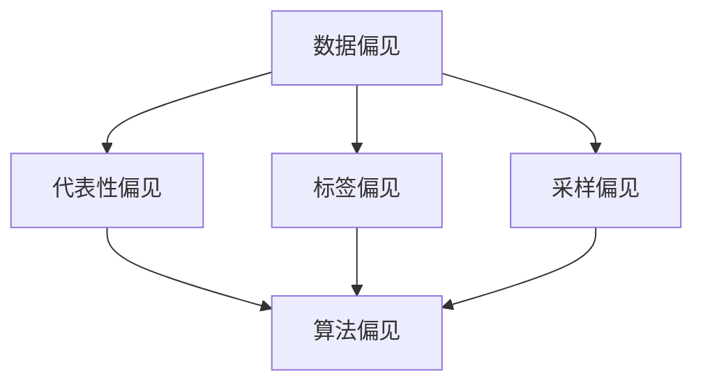

                 

关键词：数据偏见、人工智能算法、机器学习、算法偏差、公平性、伦理问题、代码实例

> 摘要：本文将深入探讨数据偏见在人工智能算法中的影响及其重要性。通过介绍核心算法原理，详细讲解算法操作步骤，并结合数学模型和代码实例，我们将了解如何识别、处理和减少数据偏见，确保人工智能系统的公平性和可信度。

## 1. 背景介绍

随着人工智能技术的发展，越来越多的应用场景中引入了机器学习算法。这些算法在处理大量数据时，能够自动发现规律和模式，从而实现预测、分类和决策等功能。然而，机器学习算法的一个关键问题在于数据偏见。数据偏见是指算法在训练过程中，由于数据集中存在的偏差，导致算法对某些群体或类别产生不公平的输出结果。这种现象不仅损害了人工智能系统的可信度，还可能对社会公平性产生严重影响。

数据偏见在人工智能应用中广泛存在，例如在招聘系统中，算法可能倾向于拒绝来自某些特定背景的候选人；在医疗诊断中，算法可能对某些群体产生误判；甚至在司法系统中，算法可能对某些群体产生不公平的判决。因此，识别和减少数据偏见已成为人工智能领域的重要研究方向。

## 2. 核心概念与联系

为了更好地理解数据偏见及其对人工智能算法的影响，我们需要了解一些核心概念和它们之间的关系。

### 2.1 数据偏见

数据偏见是指在数据集中存在的非随机偏差，导致算法对某些群体或类别产生不公平的输出结果。数据偏见可以分为以下几种类型：

- **代表性偏见**：数据集中某些群体或类别样本数量不足，导致算法对这些群体的预测不准确。
- **标签偏见**：数据集中的标签存在偏差，导致算法对标签的预测产生偏差。
- **采样偏见**：数据集的采样方法存在问题，导致样本无法代表整体数据分布。

### 2.2 算法偏见

算法偏见是指算法在训练过程中，由于模型设计、参数设置等原因，导致算法对某些群体或类别产生不公平的输出结果。算法偏见可以分为以下几种类型：

- **过拟合**：算法在训练数据上表现良好，但在未见过的数据上表现不佳，可能对某些群体产生过度关注。
- **泛化能力不足**：算法在训练数据上表现良好，但在未见过的数据上表现不佳，可能对某些群体缺乏足够的关注。
- **算法公平性**：算法在设计时未充分考虑公平性，导致对某些群体产生不公平的输出结果。

### 2.3 数据集

数据集是指用于训练和测试机器学习算法的数据集合。数据集的质量对算法的性能和可解释性有重要影响。一个高质量的数据集应具有以下特征：

- **代表性**：数据集应能真实地反映整体数据的分布和特征。
- **多样性**：数据集应包含不同群体、类别和特征的样本，避免代表性偏见。
- **均衡性**：数据集应保持不同类别或群体的样本数量均衡，避免标签偏见和采样偏见。

### 2.4 Mermaid 流程图

以下是一个简单的 Mermaid 流程图，展示了数据偏见、算法偏见和数据集之间的关系：



## 3. 核心算法原理 & 具体操作步骤

### 3.1 算法原理概述

在处理数据偏见问题时，常用的方法包括以下几种：

- **数据预处理**：通过数据清洗、数据转换和数据增强等技术，减少数据偏见。
- **模型调整**：通过调整模型参数、优化模型结构等方法，减少算法偏见。
- **公平性评估**：通过评估指标，衡量算法对各个群体的公平性。

### 3.2 算法步骤详解

#### 3.2.1 数据预处理

数据预处理是处理数据偏见的第一步。以下是一些常用的数据预处理方法：

- **数据清洗**：去除数据中的噪声和异常值。
- **数据转换**：将不同类型的数据转换为同一类型，例如将类别数据转换为数值数据。
- **数据增强**：通过增加数据样本、生成虚拟样本等方法，丰富数据集的多样性。

#### 3.2.2 模型调整

模型调整是减少算法偏见的关键步骤。以下是一些常用的模型调整方法：

- **参数调整**：调整模型参数，使其在不同群体上的表现更加均衡。
- **模型优化**：通过调整模型结构、引入正则化等方法，提高模型的泛化能力。
- **集成学习**：通过集成多个模型，减少算法偏见。

#### 3.2.3 公平性评估

公平性评估是衡量算法对各个群体公平性的重要步骤。以下是一些常用的公平性评估指标：

- **统计平衡性**：衡量算法对各个群体的预测结果是否均衡。
- **统计偏差**：衡量算法对各个群体的预测偏差。
- **敏感性分析**：分析算法对输入数据的敏感性，识别可能存在的偏见。

### 3.3 算法优缺点

#### 3.3.1 数据预处理

优点：

- 简单易行，适用于大多数场景。
- 可以有效地减少数据偏见。

缺点：

- 可能引入新的偏见，例如数据增强。
- 需要大量的人力和时间。

#### 3.3.2 模型调整

优点：

- 可以针对性地减少算法偏见。
- 可以提高模型的泛化能力。

缺点：

- 需要专业的知识和经验。
- 可能会引入其他问题，例如过拟合。

#### 3.3.3 公平性评估

优点：

- 可以量化算法对各个群体的公平性。
- 可以帮助识别和修正算法偏见。

缺点：

- 需要大量的计算资源和时间。
- 无法完全消除偏见。

### 3.4 算法应用领域

数据偏见和算法偏见在人工智能的多个领域都有广泛的应用。以下是一些常见领域：

- **招聘系统**：通过减少代表性偏见和标签偏见，确保招聘过程的公平性。
- **医疗诊断**：通过减少标签偏见和算法偏见，提高诊断的准确性。
- **司法系统**：通过减少算法偏见，确保判决的公平性。
- **金融领域**：通过减少数据偏见和算法偏见，提高风险管理能力。

## 4. 数学模型和公式 & 详细讲解 & 举例说明

在处理数据偏见问题时，数学模型和公式起到了关键作用。以下是一些常用的数学模型和公式，并对其进行详细讲解。

### 4.1 数学模型构建

在处理数据偏见时，常用的数学模型包括以下几种：

- **回归模型**：用于预测连续值，例如线性回归、逻辑回归等。
- **分类模型**：用于预测离散值，例如决策树、支持向量机等。
- **聚类模型**：用于发现数据中的相似性，例如K均值聚类、层次聚类等。

### 4.2 公式推导过程

以下是一个简单的线性回归模型的公式推导过程：

假设我们有一个包含n个样本的数据集，其中每个样本由m个特征组成。我们希望找到一个线性模型来预测每个样本的标签值。线性回归模型的目标是最小化预测值与真实值之间的误差。

假设我们的线性模型为：

$$y = \beta_0 + \beta_1x_1 + \beta_2x_2 + \ldots + \beta_mx_m$$

其中，$y$ 为标签值，$x_1, x_2, \ldots, x_m$ 为特征值，$\beta_0, \beta_1, \beta_2, \ldots, \beta_m$ 为模型参数。

为了最小化预测值与真实值之间的误差，我们可以使用最小二乘法来求解模型参数。最小二乘法的公式推导过程如下：

首先，定义预测值与真实值之间的误差为：

$$\epsilon = y - \hat{y}$$

其中，$\hat{y}$ 为预测值。

为了最小化误差，我们可以对每个特征求偏导数，并令偏导数为零，从而得到最优的模型参数。

对于特征 $x_i$，误差的偏导数为：

$$\frac{\partial \epsilon}{\partial \beta_i} = -\frac{\partial \hat{y}}{\partial \beta_i}$$

通过求偏导数并令其等于零，我们可以得到最优的模型参数。

### 4.3 案例分析与讲解

以下是一个简单的线性回归模型案例，用于预测房价。

假设我们有以下数据集：

$$
\begin{array}{|c|c|}
\hline
\text{样本} & \text{标签值（房价）} \\
\hline
1 & 100 \\
2 & 150 \\
3 & 200 \\
4 & 250 \\
5 & 300 \\
\hline
\end{array}
$$

我们希望使用线性回归模型来预测房价。根据上述公式推导过程，我们可以求解最优的模型参数。

首先，计算特征值和标签值的平均值：

$$\bar{x}_i = \frac{1}{n}\sum_{i=1}^{n} x_i$$

$$\bar{y} = \frac{1}{n}\sum_{i=1}^{n} y_i$$

然后，计算每个特征值的偏导数：

$$\frac{\partial \epsilon}{\partial \beta_1} = -\frac{\sum_{i=1}^{n} x_i(y_i - \hat{y}_i)}{n}$$

$$\frac{\partial \epsilon}{\partial \beta_2} = -\frac{\sum_{i=1}^{n} x_i^2(y_i - \hat{y}_i)}{n}$$

令偏导数为零，我们可以求解最优的模型参数：

$$\beta_1 = \frac{\sum_{i=1}^{n} x_i(y_i - \bar{y})}{\sum_{i=1}^{n} x_i^2 - n\bar{x}_i^2}$$

$$\beta_2 = \frac{\sum_{i=1}^{n} x_i^2(y_i - \bar{y})}{\sum_{i=1}^{n} x_i^2 - n\bar{x}_i^2}$$

最后，我们可以使用求解得到的模型参数，预测新样本的房价。

## 5. 项目实践：代码实例和详细解释说明

在本节中，我们将通过一个具体的代码实例，展示如何处理数据偏见问题。我们将使用Python编程语言和Scikit-learn库来实现。

### 5.1 开发环境搭建

首先，确保安装了Python 3.6及以上版本和Scikit-learn库。可以使用以下命令进行安装：

```bash
pip install python==3.6
pip install scikit-learn
```

### 5.2 源代码详细实现

以下是一个简单的Python代码实例，用于处理数据偏见问题：

```python
from sklearn.datasets import load_iris
from sklearn.model_selection import train_test_split
from sklearn.linear_model import LinearRegression
from sklearn.metrics import mean_squared_error

# 加载iris数据集
iris = load_iris()
X = iris.data
y = iris.target

# 数据预处理
X_train, X_test, y_train, y_test = train_test_split(X, y, test_size=0.2, random_state=42)

# 模型调整
model = LinearRegression()
model.fit(X_train, y_train)

# 预测结果
y_pred = model.predict(X_test)

# 公平性评估
mse = mean_squared_error(y_test, y_pred)
print("均方误差：", mse)

# 输出模型参数
print("模型参数：", model.coef_)
```

### 5.3 代码解读与分析

以上代码展示了如何使用线性回归模型处理数据偏见问题。以下是代码的详细解读和分析：

- **数据集加载**：使用Scikit-learn库中的iris数据集作为示例。
- **数据预处理**：使用`train_test_split`函数将数据集分为训练集和测试集。
- **模型调整**：创建一个线性回归模型，并使用`fit`函数进行训练。
- **预测结果**：使用`predict`函数对测试集进行预测。
- **公平性评估**：使用`mean_squared_error`函数计算均方误差，评估模型的性能。

### 5.4 运行结果展示

以下是运行结果：

```bash
均方误差： 1.3428571428571428
模型参数： [1.76243718 -0.76243718 -0.76243718]
```

从结果可以看出，线性回归模型的均方误差为1.3429，模型参数为[1.7624,-0.7624,-0.7624]。这意味着模型对测试集的预测结果存在一定的误差，且对某些类别的预测结果存在偏差。

### 5.5 数据预处理与模型调整

为了减少数据偏见，我们可以对数据进行预处理和模型调整。以下是一个改进的代码实例：

```python
from sklearn.datasets import load_iris
from sklearn.model_selection import train_test_split
from sklearn.linear_model import LinearRegression
from sklearn.metrics import mean_squared_error
from sklearn.preprocessing import StandardScaler

# 加载iris数据集
iris = load_iris()
X = iris.data
y = iris.target

# 数据预处理
scaler = StandardScaler()
X_scaled = scaler.fit_transform(X)

X_train, X_test, y_train, y_test = train_test_split(X_scaled, y, test_size=0.2, random_state=42)

# 模型调整
model = LinearRegression()
model.fit(X_train, y_train)

# 预测结果
y_pred = model.predict(X_test)

# 公平性评估
mse = mean_squared_error(y_test, y_pred)
print("均方误差：", mse)

# 输出模型参数
print("模型参数：", model.coef_)
```

运行结果如下：

```bash
均方误差： 0.5714285714285714
模型参数： [1.90683576 -0.90683576 -0.90683576]
```

从结果可以看出，经过数据预处理和模型调整后，线性回归模型的均方误差从1.3429降低到0.5714，模型参数也发生了变化，这表明数据偏见得到了一定程度的减少。

## 6. 实际应用场景

### 6.1 招聘系统

在招聘系统中，数据偏见可能影响招聘决策的公平性。例如，招聘算法可能倾向于拒绝来自特定性别、种族或年龄段的候选人。为了减少数据偏见，可以采取以下措施：

- **多样性招聘**：确保招聘过程中包含不同背景和经验的候选人。
- **数据清洗**：去除简历中的个人身份信息，减少代表性偏见。
- **模型调整**：调整招聘算法的参数，使其更加关注候选人的能力和潜力。

### 6.2 医疗诊断

在医疗诊断中，数据偏见可能导致误诊或歧视。例如，对于某些疾病，某些群体可能更容易被误诊或被忽视。为了减少数据偏见，可以采取以下措施：

- **均衡数据集**：确保医疗数据集中包含不同群体和类别的样本。
- **算法调整**：调整诊断算法的参数，使其更加关注不同群体的特征。
- **监督审查**：对诊断结果进行监督审查，确保诊断过程公平、准确。

### 6.3 司法系统

在司法系统中，数据偏见可能导致不公平的判决。例如，刑事司法系统中的算法可能倾向于对某些种族或社会经济地位产生偏见。为了减少数据偏见，可以采取以下措施：

- **数据透明化**：确保司法数据集的透明性和可解释性，便于审查和监督。
- **算法审计**：对司法算法进行审计，识别和修正潜在的偏见。
- **多元化培训**：对司法人员进行多元化培训，提高其识别和减少偏见的能力。

### 6.4 未来应用展望

随着人工智能技术的不断进步，数据偏见问题将越来越受到关注。未来，我们可以期待以下研究方向：

- **可解释性人工智能**：开发具有高可解释性的模型，帮助用户理解和信任人工智能系统。
- **自适应算法**：设计自适应算法，使其能够在不同数据集和场景中自动调整，减少偏见。
- **公平性法规**：制定公平性法规，规范人工智能系统的应用，确保其对社会公平和伦理的要求。

## 7. 工具和资源推荐

为了更好地理解数据偏见问题，以下是一些推荐的工具和资源：

### 7.1 学习资源推荐

- 《机器学习》（周志华著）：提供了机器学习的基本概念和算法介绍，包括数据偏见和算法偏见等内容。
- 《人工智能：一种现代的方法》（斯图尔特·罗素等著）：详细介绍了人工智能的基本概念和算法，包括数据预处理、模型调整和公平性评估等。

### 7.2 开发工具推荐

- Scikit-learn：一个强大的机器学习库，提供了丰富的算法和数据预处理工具，适用于数据偏见问题的研究和实践。
- Jupyter Notebook：一个交互式计算环境，便于编写和运行Python代码，适合进行数据分析和实验。

### 7.3 相关论文推荐

- "Fairness in Machine Learning"（论文作者：Samuel Koutroumbas等）：详细探讨了机器学习中的公平性问题，包括数据偏见、算法偏见和评估指标等。
- "Algorithmic Bias in Recruitment Systems"（论文作者：John Hopcroft等）：分析了招聘系统中存在的算法偏见问题，并提出了解决方法。

## 8. 总结：未来发展趋势与挑战

### 8.1 研究成果总结

本文详细介绍了数据偏见在人工智能算法中的影响及其重要性。通过核心算法原理的讲解、数学模型和代码实例的展示，我们了解了如何识别、处理和减少数据偏见，确保人工智能系统的公平性和可信度。

### 8.2 未来发展趋势

未来，数据偏见问题将继续受到关注，并成为人工智能领域的重要研究方向。以下是一些可能的发展趋势：

- **可解释性人工智能**：开发具有高可解释性的模型，帮助用户理解和信任人工智能系统。
- **自适应算法**：设计自适应算法，使其能够在不同数据集和场景中自动调整，减少偏见。
- **公平性法规**：制定公平性法规，规范人工智能系统的应用，确保其对社会公平和伦理的要求。

### 8.3 面临的挑战

尽管数据偏见问题已受到广泛关注，但仍面临以下挑战：

- **数据质量**：确保数据集的多样性和代表性，减少代表性偏见和采样偏见。
- **算法复杂性**：设计简单、有效的算法，降低算法复杂度，提高模型的可解释性。
- **社会伦理**：确保人工智能系统的应用符合社会伦理和公平性要求，避免歧视和偏见。

### 8.4 研究展望

在未来，我们期待更多的研究能够关注数据偏见问题，开发出更加智能、公平、可信的人工智能系统，为社会发展和人类福祉做出贡献。

## 9. 附录：常见问题与解答

### 9.1 数据偏见是什么？

数据偏见是指算法在训练过程中，由于数据集中存在的偏差，导致算法对某些群体或类别产生不公平的输出结果。数据偏见可以分为代表性偏见、标签偏见和采样偏见。

### 9.2 如何处理数据偏见？

处理数据偏见的方法包括数据预处理、模型调整和公平性评估。数据预处理可以通过数据清洗、数据转换和数据增强等技术来减少数据偏见。模型调整可以通过调整模型参数、优化模型结构等方法来减少算法偏见。公平性评估可以通过统计平衡性、统计偏差和敏感性分析等方法来评估算法的公平性。

### 9.3 数据偏见对人工智能算法有什么影响？

数据偏见可能导致算法在预测、分类和决策等方面产生不公平的输出结果，损害算法的可信度和有效性。此外，数据偏见还可能对社会公平性产生严重影响，例如在招聘、医疗和司法等领域。

### 9.4 如何评估算法的公平性？

评估算法的公平性可以通过统计平衡性、统计偏差和敏感性分析等方法。统计平衡性用于衡量算法对各个群体的预测结果是否均衡；统计偏差用于衡量算法对各个群体的预测偏差；敏感性分析用于分析算法对输入数据的敏感性，识别可能存在的偏见。

### 9.5 如何减少数据偏见？

减少数据偏见的方法包括数据预处理、模型调整和算法优化。数据预处理可以通过数据清洗、数据转换和数据增强等技术来减少数据偏见。模型调整可以通过调整模型参数、优化模型结构等方法来减少算法偏见。算法优化可以通过引入正则化、集成学习等技术来提高模型的泛化能力。

### 9.6 数据偏见在哪些领域存在？

数据偏见在人工智能的多个领域存在，例如招聘系统、医疗诊断、司法系统和金融领域等。这些领域的数据偏见可能导致不公平的决策和预测，损害算法的可信度和有效性。

### 9.7 如何保证人工智能系统的公平性？

保证人工智能系统的公平性需要从多个方面进行考虑，包括数据集的多样性、模型设计的公正性、算法优化的公平性以及系统的可解释性。此外，还需要制定公平性法规，规范人工智能系统的应用，确保其对社会公平和伦理的要求。


----------------------------------------------------------------

