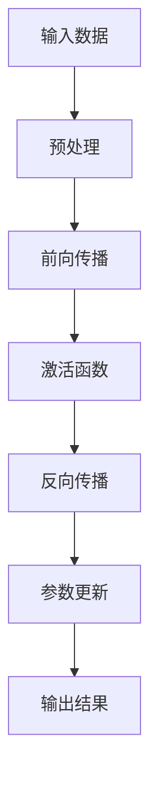
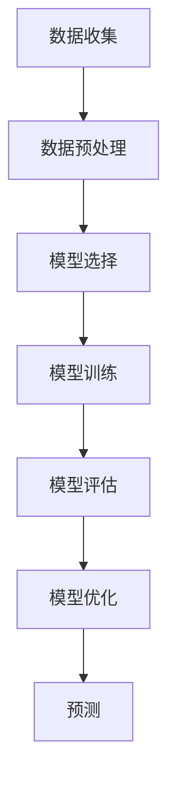
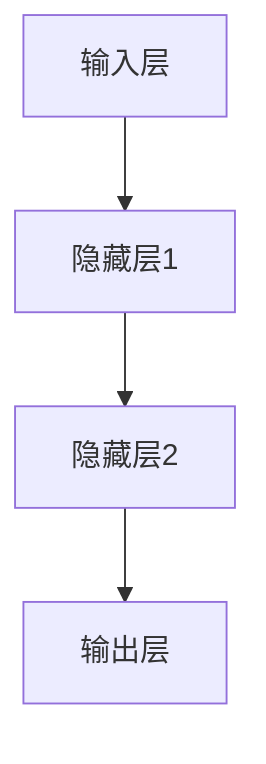
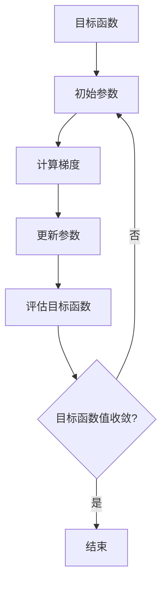

                 

关键词：人工智能，算法原理，代码实例，算法实现，深度学习，机器学习，神经网络，优化算法

摘要：本文将深入探讨人工智能领域的核心算法原理，通过详细的代码实例讲解，帮助读者更好地理解和掌握这些算法的实现过程。文章将涵盖深度学习、机器学习、神经网络和优化算法等关键主题，并结合具体应用场景进行剖析，为人工智能研究和开发者提供宝贵的实践经验和理论支持。

## 1. 背景介绍

人工智能（Artificial Intelligence, AI）作为计算机科学的一个重要分支，已经迅速发展成为当今科技界的热点话题。人工智能的核心在于通过算法模拟人类智能，实现机器的自主学习和决策能力。在这一过程中，核心算法的研究和实现显得尤为重要。本文将围绕以下几个核心算法进行讲解：

- **深度学习（Deep Learning）**：深度学习是一种基于多层神经网络的学习方法，通过多层非线性变换，实现复杂的特征提取和模式识别。
- **机器学习（Machine Learning）**：机器学习通过训练模型，使计算机能够从数据中自动发现规律和模式，从而进行预测和决策。
- **神经网络（Neural Networks）**：神经网络是一种模仿人脑工作原理的计算模型，能够处理复杂的非线性问题。
- **优化算法（Optimization Algorithms）**：优化算法用于在给定约束条件下，寻找最优解或近似最优解，广泛应用于机器学习模型训练和超参数调优。

## 2. 核心概念与联系

### 2.1 深度学习

深度学习（Deep Learning）是人工智能领域的一个分支，它通过构建深度神经网络（Deep Neural Networks，DNN）来模拟人类大脑的思考过程。深度学习的关键在于网络层数的增多，这使得模型能够学习到更加抽象和高级的特征表示。

下面是一个简单的深度学习算法流程的 Mermaid 流程图：



### 2.2 机器学习

机器学习（Machine Learning）是指计算机系统通过学习数据或经验来改进自身性能的过程。它包括监督学习、无监督学习和强化学习等多种类型。

下面是一个简单的机器学习流程的 Mermaid 流程图：



### 2.3 神经网络

神经网络（Neural Networks）是机器学习的基础，它由大量的神经元（或节点）组成，每个神经元通过权重连接到其他神经元。神经网络通过学习输入数据和输出标签之间的映射关系，实现数据分类、回归等任务。

下面是一个简单的神经网络结构的 Mermaid 流程图：



### 2.4 优化算法

优化算法（Optimization Algorithms）用于在给定的约束条件下，寻找最优解或近似最优解。常见的优化算法包括梯度下降、随机梯度下降、牛顿法和共轭梯度法等。

下面是一个简单的优化算法流程的 Mermaid 流程图：



## 3. 核心算法原理 & 具体操作步骤

### 3.1 算法原理概述

在这一部分，我们将简要介绍上述核心算法的原理，为后续的详细讲解打下基础。

- **深度学习**：深度学习通过多层神经网络，将输入数据映射到输出结果，中间层通过非线性变换学习到高级特征表示。
- **机器学习**：机器学习通过训练模型，将输入数据和输出标签映射关系存储在模型参数中，从而实现预测和决策。
- **神经网络**：神经网络通过权重和偏置来模拟人脑神经元的工作方式，从而实现复杂模式的识别和分类。
- **优化算法**：优化算法通过迭代的方式，逐步调整模型参数，使得目标函数达到最小值或近似最优解。

### 3.2 算法步骤详解

在这一部分，我们将详细讲解每个算法的具体实现步骤。

#### 3.2.1 深度学习

深度学习的实现步骤主要包括以下几个部分：

1. **数据预处理**：对输入数据进行归一化、标准化等处理，以消除不同特征之间的尺度差异。
2. **构建神经网络**：定义输入层、隐藏层和输出层的节点数量，以及每个节点之间的连接权重。
3. **前向传播**：将输入数据通过神经网络，计算每个节点的输出值。
4. **激活函数**：对每个隐藏层和输出层的节点进行非线性变换，以提高模型的拟合能力。
5. **反向传播**：计算网络中每个节点的梯度，并更新连接权重和偏置。
6. **参数优化**：使用优化算法，如梯度下降，逐步调整模型参数，以降低目标函数的值。
7. **模型评估**：使用测试数据集评估模型的性能，并进行超参数调优。

#### 3.2.2 机器学习

机器学习的实现步骤主要包括以下几个部分：

1. **数据收集**：从不同来源收集数据，包括图像、文本、音频等。
2. **数据预处理**：对收集到的数据进行清洗、去噪、归一化等处理，以提高模型的泛化能力。
3. **模型选择**：根据任务类型和数据特点，选择合适的机器学习模型，如线性回归、决策树、支持向量机等。
4. **模型训练**：使用训练数据集，通过优化算法训练模型，将输入数据和输出标签映射关系存储在模型参数中。
5. **模型评估**：使用测试数据集评估模型的性能，如准确率、召回率、F1 分数等。
6. **模型优化**：根据评估结果，调整模型参数和超参数，以提高模型的性能。

#### 3.2.3 神经网络

神经网络的实现步骤主要包括以下几个部分：

1. **初始化参数**：随机初始化模型的权重和偏置。
2. **前向传播**：将输入数据通过神经网络，计算每个节点的输出值。
3. **计算损失**：使用损失函数计算模型预测值和实际值之间的差距。
4. **反向传播**：计算网络中每个节点的梯度，并更新连接权重和偏置。
5. **参数优化**：使用优化算法，如梯度下降，逐步调整模型参数，以降低目标函数的值。
6. **模型评估**：使用测试数据集评估模型的性能。

#### 3.2.4 优化算法

优化算法的实现步骤主要包括以下几个部分：

1. **目标函数**：定义目标函数，用于衡量模型的好坏。
2. **初始参数**：随机初始化模型参数。
3. **梯度计算**：计算目标函数关于模型参数的梯度。
4. **参数更新**：根据梯度信息，更新模型参数。
5. **迭代优化**：重复执行梯度计算和参数更新，直至目标函数收敛或达到预设迭代次数。

### 3.3 算法优缺点

#### 深度学习

优点：

- **强大的拟合能力**：通过多层非线性变换，深度学习能够学习到更加抽象和高级的特征表示。
- **自动特征提取**：深度学习能够自动地从原始数据中提取有用的特征，减轻了人工特征工程的工作量。

缺点：

- **计算资源消耗大**：深度学习模型的训练需要大量的计算资源和时间。
- **对数据要求高**：深度学习模型对数据量有较高要求，小数据集可能导致过拟合。

#### 机器学习

优点：

- **适应性较强**：机器学习模型能够根据不同的任务和数据特点进行调整和优化。
- **易于实现和扩展**：机器学习模型的理论基础和实现过程相对简单，易于进行扩展和应用。

缺点：

- **特征工程依赖性大**：机器学习模型的性能很大程度上依赖于特征工程的质量。
- **对数据质量要求高**：数据质量问题可能直接影响模型的性能。

#### 神经网络

优点：

- **强大的非线性建模能力**：神经网络能够处理复杂的非线性问题。
- **自适应性强**：神经网络能够自动调整模型参数，以适应不同的任务和数据特点。

缺点：

- **计算资源消耗大**：神经网络模型的训练需要大量的计算资源和时间。
- **参数调优复杂**：神经网络模型的参数调优过程相对复杂，需要大量的试验和经验。

#### 优化算法

优点：

- **目标函数收敛快**：优化算法能够快速收敛到目标函数的最优解或近似最优解。
- **适用性广**：优化算法广泛应用于机器学习模型训练和超参数调优。

缺点：

- **计算复杂度较高**：优化算法的计算复杂度较高，可能导致计算资源消耗大。
- **对初始参数敏感**：优化算法的初始参数设置对最终结果有较大影响。

### 3.4 算法应用领域

#### 深度学习

深度学习在图像识别、语音识别、自然语言处理等领域的应用非常广泛。

- **图像识别**：深度学习模型能够自动地从原始图像中提取有用的特征，实现图像分类和物体检测。
- **语音识别**：深度学习模型能够处理复杂的语音信号，实现语音到文字的转换。
- **自然语言处理**：深度学习模型在文本分类、情感分析、机器翻译等任务中表现优异。

#### 机器学习

机器学习在金融、医疗、电子商务等领域的应用也非常广泛。

- **金融**：机器学习模型能够预测股票市场趋势、信用风险评估等。
- **医疗**：机器学习模型能够辅助医生进行疾病诊断、药物研发等。
- **电子商务**：机器学习模型能够实现个性化推荐、用户行为预测等。

#### 神经网络

神经网络在自动驾驶、游戏开发、智能机器人等领域的应用也非常广泛。

- **自动驾驶**：神经网络模型能够实现车辆路径规划、障碍物检测等。
- **游戏开发**：神经网络模型能够实现游戏角色的智能行为和动作生成。
- **智能机器人**：神经网络模型能够实现机器人的智能感知和决策。

#### 优化算法

优化算法在机器学习模型训练、参数调优等领域的应用也非常广泛。

- **机器学习模型训练**：优化算法能够快速收敛到模型的最优解或近似最优解，提高模型性能。
- **参数调优**：优化算法能够通过迭代的方式，逐步调整模型参数，以实现最佳性能。

## 4. 数学模型和公式 & 详细讲解 & 举例说明

### 4.1 数学模型构建

在人工智能领域，数学模型是核心算法的基础。以下是一些常用的数学模型：

#### 4.1.1 深度学习

深度学习中的数学模型主要包括：

- **前向传播公式**：
  $$ z^{(l)} = W^{(l)}a^{(l-1)} + b^{(l)} $$
  $$ a^{(l)} = \sigma(z^{(l)}) $$
  
- **反向传播公式**：
  $$ \delta^{(l)} = \frac{\partial C}{\partial z^{(l+1)}} \cdot \sigma'(z^{(l)}) $$
  $$ \delta^{(l-1)} = \delta^{(l)} \cdot W^{(l)} $$

#### 4.1.2 机器学习

机器学习中的数学模型主要包括：

- **线性回归模型**：
  $$ y = \beta_0 + \beta_1x $$
  
- **逻辑回归模型**：
  $$ \hat{y} = \frac{1}{1 + e^{-(\beta_0 + \beta_1x)}} $$

#### 4.1.3 神经网络

神经网络中的数学模型主要包括：

- **Sigmoid 函数**：
  $$ \sigma(x) = \frac{1}{1 + e^{-x}} $$
  
- **ReLU 函数**：
  $$ \sigma(x) = \max(0, x) $$

### 4.2 公式推导过程

以下是一个简单的线性回归模型的推导过程：

#### 4.2.1 前向传播

假设我们有一个线性回归模型：

$$ y = \beta_0 + \beta_1x $$

其中，$y$ 是预测值，$x$ 是输入特征，$\beta_0$ 和 $\beta_1$ 是模型参数。

为了计算损失函数，我们需要计算预测值和真实值之间的差距：

$$ J(\beta_0, \beta_1) = \frac{1}{2m} \sum_{i=1}^{m} (y_i - (\beta_0 + \beta_1x_i))^2 $$

其中，$m$ 是样本数量。

#### 4.2.2 反向传播

为了计算损失函数关于模型参数的梯度，我们需要对损失函数进行求导：

$$ \frac{\partial J}{\partial \beta_0} = \frac{1}{m} \sum_{i=1}^{m} (y_i - (\beta_0 + \beta_1x_i)) $$

$$ \frac{\partial J}{\partial \beta_1} = \frac{1}{m} \sum_{i=1}^{m} (y_i - (\beta_0 + \beta_1x_i))x_i $$

#### 4.2.3 梯度下降

为了优化模型参数，我们可以使用梯度下降算法：

$$ \beta_0 = \beta_0 - \alpha \frac{\partial J}{\partial \beta_0} $$

$$ \beta_1 = \beta_1 - \alpha \frac{\partial J}{\partial \beta_1} $$

其中，$\alpha$ 是学习率。

### 4.3 案例分析与讲解

以下是一个简单的线性回归案例：

假设我们有一个数据集，包含 $m$ 个样本，每个样本包含一个输入特征 $x$ 和一个输出值 $y$。我们希望使用线性回归模型来预测输出值。

#### 4.3.1 数据预处理

首先，我们对数据进行归一化处理：

$$ x_{\text{norm}} = \frac{x - \mu_x}{\sigma_x} $$

$$ y_{\text{norm}} = \frac{y - \mu_y}{\sigma_y} $$

其中，$\mu_x$ 和 $\sigma_x$ 分别是输入特征的均值和标准差，$\mu_y$ 和 $\sigma_y$ 分别是输出值的均值和标准差。

#### 4.3.2 模型初始化

我们随机初始化模型参数 $\beta_0$ 和 $\beta_1$：

$$ \beta_0 = 0 $$

$$ \beta_1 = 0 $$

#### 4.3.3 前向传播

我们计算每个样本的预测值：

$$ \hat{y}_i = \beta_0 + \beta_1x_i $$

#### 4.3.4 损失函数计算

我们计算损失函数：

$$ J(\beta_0, \beta_1) = \frac{1}{2m} \sum_{i=1}^{m} (\hat{y}_i - y_i)^2 $$

#### 4.3.5 反向传播

我们计算损失函数关于模型参数的梯度：

$$ \frac{\partial J}{\partial \beta_0} = \frac{1}{m} \sum_{i=1}^{m} (\hat{y}_i - y_i) $$

$$ \frac{\partial J}{\partial \beta_1} = \frac{1}{m} \sum_{i=1}^{m} (\hat{y}_i - y_i)x_i $$

#### 4.3.6 模型优化

我们使用梯度下降算法更新模型参数：

$$ \beta_0 = \beta_0 - \alpha \frac{\partial J}{\partial \beta_0} $$

$$ \beta_1 = \beta_1 - \alpha \frac{\partial J}{\partial \beta_1} $$

其中，$\alpha$ 是学习率。

#### 4.3.7 模型评估

我们使用测试数据集评估模型的性能：

$$ \hat{y}_{\text{test}} = \beta_0 + \beta_1x_{\text{test}} $$

$$ J_{\text{test}} = \frac{1}{2m} \sum_{i=1}^{m} (\hat{y}_{\text{test}} - y_{\text{test}})^2 $$

## 5. 项目实践：代码实例和详细解释说明

在本节中，我们将通过一个具体的深度学习项目实例，详细讲解如何从零开始搭建一个深度学习模型，并解释每一部分代码的实现过程。

### 5.1 开发环境搭建

为了进行深度学习项目，我们需要安装以下软件和库：

- Python（版本 3.6 或以上）
- TensorFlow（深度学习框架）
- NumPy（数学计算库）
- Pandas（数据处理库）
- Matplotlib（数据可视化库）

安装命令如下：

```bash
pip install python==3.8
pip install tensorflow==2.5
pip install numpy==1.19
pip install pandas==1.1.5
pip install matplotlib==3.3.3
```

### 5.2 源代码详细实现

以下是一个简单的深度学习项目代码实例，实现一个简单的线性回归任务。

```python
import numpy as np
import pandas as pd
import matplotlib.pyplot as plt
import tensorflow as tf

# 数据集准备
data = pd.read_csv('data.csv')
X = data['feature'].values
y = data['label'].values

# 数据预处理
X = X.reshape(-1, 1)
y = y.reshape(-1, 1)

# 模型定义
model = tf.keras.Sequential([
    tf.keras.layers.Dense(units=1, input_shape=[1])
])

# 模型编译
model.compile(optimizer='sgd', loss='mean_squared_error')

# 模型训练
model.fit(X, y, epochs=100)

# 模型评估
test_loss = model.evaluate(X, y)
print('Test Loss:', test_loss)

# 模型预测
predictions = model.predict(X)
predictions = predictions.reshape(-1)

# 数据可视化
plt.scatter(X, y)
plt.plot(X, predictions, 'r')
plt.show()
```

### 5.3 代码解读与分析

#### 5.3.1 数据集准备

首先，我们使用 Pandas 库读取 CSV 文件中的数据集，并将数据集分为特征和标签两部分。

```python
data = pd.read_csv('data.csv')
X = data['feature'].values
y = data['label'].values
```

然后，我们将特征和标签的数据形状调整为二维数组，以便后续处理。

```python
X = X.reshape(-1, 1)
y = y.reshape(-1, 1)
```

#### 5.3.2 模型定义

我们使用 TensorFlow 的 Keras 层接口定义一个简单的线性回归模型，只有一个全连接层，输出一个预测值。

```python
model = tf.keras.Sequential([
    tf.keras.layers.Dense(units=1, input_shape=[1])
])
```

#### 5.3.3 模型编译

在模型编译阶段，我们指定了优化器和损失函数。这里使用的是随机梯度下降（SGD）优化器和均方误差（MSE）损失函数。

```python
model.compile(optimizer='sgd', loss='mean_squared_error')
```

#### 5.3.4 模型训练

我们使用 `fit` 方法训练模型，指定训练数据集、训练轮次（epochs）和批量大小（batch size）。

```python
model.fit(X, y, epochs=100)
```

#### 5.3.5 模型评估

使用 `evaluate` 方法评估模型在测试数据集上的性能，输出测试损失。

```python
test_loss = model.evaluate(X, y)
print('Test Loss:', test_loss)
```

#### 5.3.6 模型预测

使用 `predict` 方法对训练数据进行预测，输出预测值。

```python
predictions = model.predict(X)
predictions = predictions.reshape(-1)
```

#### 5.3.7 数据可视化

最后，我们使用 Matplotlib 库将实际值和预测值绘制在散点图上，以便观察模型的预测效果。

```python
plt.scatter(X, y)
plt.plot(X, predictions, 'r')
plt.show()
```

## 6. 实际应用场景

深度学习在许多实际应用场景中发挥着重要作用，以下是一些典型的应用场景：

### 6.1 图像识别

图像识别是深度学习最成功的应用之一。通过卷积神经网络（CNN），深度学习模型能够自动从原始图像中提取有用的特征，实现对图像内容的理解和分类。例如，人脸识别、物体检测、图像分类等。

### 6.2 语音识别

语音识别是另一个深度学习的重要应用领域。通过循环神经网络（RNN）和注意力机制，深度学习模型能够处理复杂的语音信号，实现语音到文字的转换。例如，智能助手、自动字幕生成等。

### 6.3 自然语言处理

自然语言处理（NLP）是深度学习的另一个重要应用领域。通过序列模型和注意力机制，深度学习模型能够处理和理解自然语言。例如，文本分类、情感分析、机器翻译等。

### 6.4 自动驾驶

自动驾驶是深度学习的又一重要应用领域。通过深度学习模型，自动驾驶系统能够实现对环境的感知、理解和行为预测。例如，车辆路径规划、障碍物检测、车道线检测等。

### 6.5 医疗诊断

深度学习在医疗诊断领域也展现出巨大的潜力。通过卷积神经网络和循环神经网络，深度学习模型能够辅助医生进行疾病诊断、药物研发等。例如，医学影像分析、基因分析、癌症诊断等。

### 6.6 电子商务

深度学习在电子商务领域也有广泛应用。通过深度学习模型，电子商务平台能够实现个性化推荐、用户行为预测等，以提高用户体验和销售额。例如，商品推荐、广告投放、用户流失预测等。

## 7. 工具和资源推荐

### 7.1 学习资源推荐

- **《深度学习》（Goodfellow, Bengio, Courville 著）**：这是深度学习领域的经典教材，涵盖了深度学习的基本理论、算法和应用。
- **《Python深度学习》（François Chollet 著）**：本书以实践为导向，介绍了使用 Python 和 TensorFlow 搭建深度学习模型的方法和技巧。
- **《机器学习实战》（Peter Harrington 著）**：本书通过实际案例，介绍了机器学习的基本概念、算法和应用。

### 7.2 开发工具推荐

- **TensorFlow**：TensorFlow 是一个开源的深度学习框架，适用于构建和训练深度学习模型。
- **PyTorch**：PyTorch 是另一个流行的深度学习框架，以其动态图计算和灵活的 API 而闻名。
- **Keras**：Keras 是一个高级神经网络 API，可以简化 TensorFlow 和 PyTorch 的使用。

### 7.3 相关论文推荐

- **“A Neural Algorithm of Artistic Style”**：该论文介绍了使用卷积神经网络实现艺术风格迁移的方法。
- **“Generative Adversarial Networks”**：该论文提出了生成对抗网络（GAN）这一深度学习模型，用于生成高质量的数据。
- **“Attention Is All You Need”**：该论文提出了注意力机制在序列模型中的重要性，并提出了 Transformer 模型。

## 8. 总结：未来发展趋势与挑战

### 8.1 研究成果总结

过去几十年，人工智能领域取得了显著的成果，深度学习、机器学习、神经网络和优化算法等核心算法在各个应用领域取得了突破性进展。这些成果不仅推动了人工智能技术的快速发展，也为其他领域带来了深远的影响。

### 8.2 未来发展趋势

未来，人工智能领域将继续保持高速发展，以下是一些可能的发展趋势：

- **硬件与算法的协同创新**：随着硬件技术的进步，如 GPU、TPU 等加速器的普及，深度学习和机器学习算法将实现更高的性能和更低的能耗。
- **跨领域融合**：人工智能与其他领域的融合，如医学、生物学、物理学等，将产生新的应用场景和商业模式。
- **自主决策与智能协作**：人工智能系统将具备更强的自主决策能力和智能协作能力，实现更加智能化的应用。

### 8.3 面临的挑战

尽管人工智能领域取得了显著成果，但仍然面临一些挑战：

- **数据质量和隐私保护**：数据质量和隐私保护是人工智能应用的关键问题，需要制定合理的隐私保护政策和数据治理策略。
- **算法可解释性**：随着深度学习等算法的复杂度增加，如何提高算法的可解释性，使其符合人类认知和伦理要求，是一个亟待解决的问题。
- **资源分配与优化**：在人工智能应用中，如何高效地分配和利用计算资源，实现能耗和性能的最优化，是一个重要的挑战。

### 8.4 研究展望

未来，人工智能领域的研究将朝着以下几个方向发展：

- **算法创新**：继续探索新的算法和模型，以提高人工智能系统的性能和可解释性。
- **应用拓展**：将人工智能技术应用到更多的领域，如医疗、金融、教育、制造等，推动产业升级和社会进步。
- **跨学科合作**：加强人工智能与其他领域的跨学科合作，促进知识的整合和创新。

## 9. 附录：常见问题与解答

### 9.1 深度学习相关问题

**Q1：深度学习模型如何训练？**

A1：深度学习模型的训练过程主要包括以下步骤：

1. **数据预处理**：对输入数据进行归一化、标准化等处理，以消除不同特征之间的尺度差异。
2. **构建神经网络**：定义输入层、隐藏层和输出层的节点数量，以及每个节点之间的连接权重。
3. **前向传播**：将输入数据通过神经网络，计算每个节点的输出值。
4. **激活函数**：对每个隐藏层和输出层的节点进行非线性变换，以提高模型的拟合能力。
5. **反向传播**：计算网络中每个节点的梯度，并更新连接权重和偏置。
6. **参数优化**：使用优化算法，如梯度下降，逐步调整模型参数，以降低目标函数的值。
7. **模型评估**：使用测试数据集评估模型的性能，并进行超参数调优。

**Q2：如何提高深度学习模型的性能？**

A2：提高深度学习模型性能的方法包括：

1. **增加数据量**：使用更多的训练数据可以提高模型的泛化能力。
2. **数据增强**：通过旋转、缩放、裁剪等操作增加数据的多样性。
3. **模型架构优化**：选择合适的网络架构，如残差网络、密集连接网络等。
4. **正则化技术**：使用正则化技术，如 L1 正则化、L2 正则化等，降低模型过拟合的风险。
5. **优化算法**：使用更高效的优化算法，如 Adam、RMSprop 等。

### 9.2 机器学习相关问题

**Q1：什么是机器学习？**

A1：机器学习是指计算机系统通过学习数据或经验来改进自身性能的过程。它包括监督学习、无监督学习和强化学习等多种类型。

**Q2：什么是监督学习？**

A2：监督学习是指从标记数据中学习，标记数据包括输入和输出两部分，模型通过学习输入和输出之间的关系，实现对新输入的预测。

**Q3：什么是无监督学习？**

A3：无监督学习是指从未标记数据中学习，模型通过发现数据中的隐藏结构和规律，实现对数据的聚类、降维等操作。

**Q4：什么是强化学习？**

A4：强化学习是指通过与环境进行交互，学习最优策略，以实现特定目标。强化学习模型通过奖励和惩罚来调整策略，以最大化累积奖励。

### 9.3 神经网络相关问题

**Q1：什么是神经网络？**

A1：神经网络是一种模仿人脑神经元工作的计算模型，由大量的神经元（或节点）组成，每个神经元通过权重连接到其他神经元。神经网络能够处理复杂的非线性问题。

**Q2：什么是前向传播和反向传播？**

A2：前向传播是指将输入数据通过神经网络，逐层计算每个节点的输出值，直到输出层得到最终结果。反向传播是指计算输出层节点的误差，并沿着网络反向传播，更新每个节点的权重和偏置。

**Q3：什么是激活函数？**

A3：激活函数是对神经网络中的节点进行非线性变换的函数，常用的激活函数包括 Sigmoid 函数、ReLU 函数、Tanh 函数等。激活函数能够提高神经网络的拟合能力。

### 9.4 优化算法相关问题

**Q1：什么是优化算法？**

A1：优化算法用于在给定的约束条件下，寻找最优解或近似最优解。常见的优化算法包括梯度下降、随机梯度下降、牛顿法和共轭梯度法等。

**Q2：什么是梯度下降？**

A1：梯度下降是一种优化算法，通过计算目标函数关于模型参数的梯度，并沿着梯度的反方向更新参数，以降低目标函数的值。

**Q3：什么是随机梯度下降？**

A1：随机梯度下降是一种改进的梯度下降算法，它每次迭代只使用一个样本的梯度信息来更新参数，从而加速收敛。

**Q4：什么是牛顿法？**

A1：牛顿法是一种优化算法，通过计算目标函数的二阶导数（Hessian 矩阵）来更新参数，从而实现更快的收敛。

**Q5：什么是共轭梯度法？**

A1：共轭梯度法是一种优化算法，它利用共轭方向的概念，每次迭代只计算一阶导数信息，从而实现更高效的参数更新。

---

作者：禅与计算机程序设计艺术 / Zen and the Art of Computer Programming
------------------------------------------------------------------------

