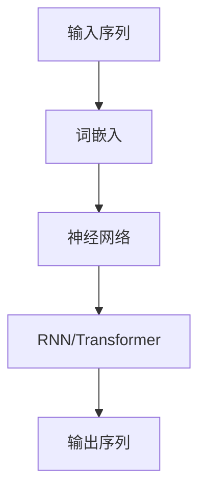

                 

关键词：人工智能，核心算法，语言生成，深度学习，代码实例，自然语言处理，神经网络

摘要：本文深入探讨了人工智能领域中的语言生成算法，从核心概念到具体实现，详细解析了包括神经网络、递归神经网络（RNN）和Transformer模型在内的多种语言生成算法。通过数学模型、公式推导和代码实例，本文为广大读者提供了全面的指导，帮助理解这些算法的原理和实际应用。

## 1. 背景介绍

随着人工智能技术的迅猛发展，自然语言处理（NLP）已成为其中的重要分支。语言生成作为NLP的关键任务之一，广泛应用于机器翻译、自动摘要、对话系统和文本生成等领域。从早期的基于规则的系统到现代的深度学习模型，语言生成技术取得了显著的进步。

在过去的几十年里，研究人员提出了多种语言生成算法，每种算法都有其独特的原理和特点。神经网络、递归神经网络（RNN）和Transformer模型是当前最为流行的三种语言生成算法，它们在不同的应用场景中展现了出色的性能。

本文将围绕这三种核心算法，详细介绍它们的原理、数学模型和代码实例，帮助读者深入理解语言生成技术，并掌握其实际应用方法。

## 2. 核心概念与联系

为了更好地理解语言生成算法，我们首先需要了解一些核心概念和它们之间的关系。以下是关键概念及其相互关系的Mermaid流程图：



### 2.1 输入序列

输入序列是语言生成算法的起点，它可以是一个单词序列、句子序列或更复杂的文本数据。输入序列的表示方法直接影响模型的性能。

### 2.2 词嵌入

词嵌入（Word Embedding）是将词汇映射到高维向量空间的过程，使得语义相似的单词在向量空间中更接近。常见的词嵌入方法包括Word2Vec、GloVe等。

### 2.3 神经网络

神经网络（Neural Network）是模仿人脑神经元连接方式的计算模型。它通过学习输入和输出之间的映射关系，能够对输入数据进行复杂的非线性变换。

### 2.4 RNN/Transformer

递归神经网络（RNN）和Transformer模型是两种流行的神经网络结构，用于处理序列数据。RNN通过递归连接模拟记忆机制，而Transformer模型则通过自注意力机制实现了更强大的序列建模能力。

### 2.5 输出序列

输出序列是语言生成算法的最终目标，它是通过模型预测得到的单词序列。输出序列的质量直接影响语言生成的效果。

## 3. 核心算法原理 & 具体操作步骤

### 3.1 算法原理概述

### 3.1.1 神经网络

神经网络是一种通过层层传递信息并逐层提取特征的数据处理模型。它的基本原理是通过多层神经元（节点）的连接和激活函数，对输入数据进行映射。

### 3.1.2 RNN

递归神经网络（RNN）是一种能够处理序列数据的神经网络结构。它通过递归连接将当前时刻的输入和前一个时刻的隐藏状态结合，生成新的隐藏状态。RNN的核心思想是利用记忆机制来捕捉序列中的长期依赖关系。

### 3.1.3 Transformer

Transformer模型是一种基于自注意力机制的序列建模模型。它通过多头自注意力机制和前馈神经网络，对序列数据进行全局建模，从而捕捉序列中的复杂依赖关系。

### 3.2 算法步骤详解

#### 3.2.1 神经网络

神经网络的基本步骤包括：

1. **初始化**：初始化网络参数，包括权重和偏置。
2. **前向传播**：将输入数据传递到网络的每一层，并计算每一层的输出。
3. **反向传播**：根据输出误差，计算每一层的梯度，并更新网络参数。
4. **优化**：使用梯度下降或其他优化算法，调整网络参数，以最小化损失函数。

#### 3.2.2 RNN

RNN的基本步骤包括：

1. **初始化**：初始化隐藏状态。
2. **前向传播**：将输入序列和隐藏状态传递到RNN，计算新的隐藏状态。
3. **输出计算**：使用隐藏状态计算输出序列。
4. **反向传播**：根据输出误差，更新隐藏状态和输入权重。

#### 3.2.3 Transformer

Transformer的基本步骤包括：

1. **编码器（Encoder）**：
   - **输入嵌入**：将输入序列映射到嵌入空间。
   - **多头自注意力**：计算不同位置之间的注意力权重，并生成新的嵌入。
   - **前馈神经网络**：对嵌入进行非线性变换。
2. **解码器（Decoder）**：
   - **输入嵌入**：将输入序列映射到嵌入空间。
   - **多头自注意力**：计算输入序列和编码器输出之间的注意力权重。
   - **交叉注意力**：计算解码器输出和编码器输出之间的注意力权重。
   - **前馈神经网络**：对嵌入进行非线性变换。

### 3.3 算法优缺点

#### 3.3.1 神经网络

**优点**：
- 能够处理复杂的数据和任务。
- 具有强大的非线性建模能力。
- 可以通过优化算法自动调整参数。

**缺点**：
- 训练过程较慢。
- 对数据质量有较高要求。

#### 3.3.2 RNN

**优点**：
- 能够处理序列数据。
- 具有记忆机制。

**缺点**：
- 难以捕捉长距离依赖关系。
- 训练过程容易出现梯度消失或梯度爆炸问题。

#### 3.3.3 Transformer

**优点**：
- 能够高效地捕捉长距离依赖关系。
- 训练过程相对稳定。
- 具有更好的并行计算能力。

**缺点**：
- 对硬件资源要求较高。

### 3.4 算法应用领域

神经网络、RNN和Transformer在多个领域有广泛应用：

- **机器翻译**：使用神经网络和Transformer模型进行高质量机器翻译。
- **文本生成**：使用RNN和Transformer模型生成文章、摘要和对话等。
- **问答系统**：使用Transformer模型构建智能问答系统。

## 4. 数学模型和公式 & 详细讲解 & 举例说明

### 4.1 数学模型构建

在语言生成算法中，常用的数学模型包括神经网络、RNN和Transformer。以下是这些模型的基本数学表示。

#### 4.1.1 神经网络

神经网络的数学表示为：

$$
y = \sigma(Wx + b)
$$

其中，$y$ 是输出，$\sigma$ 是激活函数，$W$ 是权重矩阵，$x$ 是输入，$b$ 是偏置。

#### 4.1.2 RNN

RNN的数学表示为：

$$
h_t = \sigma(Wx_t + Uh_{t-1} + b)
$$

其中，$h_t$ 是当前时刻的隐藏状态，$x_t$ 是当前时刻的输入，$U$ 是输入到隐藏状态之间的权重矩阵，$W$ 是隐藏状态到隐藏状态之间的权重矩阵，$b$ 是偏置。

#### 4.1.3 Transformer

Transformer的数学表示为：

$$
h_t = \text{MultiHeadAttention}(h_{t-1}, h_{t-1}) + h_{t-1}
$$

$$
h_t = \text{FeedForward}(h_t) + h_t
$$

其中，$h_t$ 是当前时刻的隐藏状态，$\text{MultiHeadAttention}$ 是多头自注意力机制，$\text{FeedForward}$ 是前馈神经网络。

### 4.2 公式推导过程

#### 4.2.1 神经网络

神经网络的损失函数通常采用均方误差（MSE）：

$$
L(y, \hat{y}) = \frac{1}{2}\sum_{i=1}^{n}(y_i - \hat{y}_i)^2
$$

其中，$y$ 是真实标签，$\hat{y}$ 是预测标签。

对损失函数求导，得到：

$$
\frac{\partial L}{\partial W} = (y - \hat{y})x^T
$$

$$
\frac{\partial L}{\partial b} = y - \hat{y}
$$

通过梯度下降算法，更新网络参数：

$$
W \leftarrow W - \alpha \frac{\partial L}{\partial W}
$$

$$
b \leftarrow b - \alpha \frac{\partial L}{\partial b}
$$

其中，$\alpha$ 是学习率。

#### 4.2.2 RNN

RNN的损失函数同样采用MSE：

$$
L(h_t, \hat{h}_t) = \frac{1}{2}\sum_{i=1}^{n}(h_{ti} - \hat{h}_{ti})^2
$$

其中，$h_t$ 是真实隐藏状态，$\hat{h}_t$ 是预测隐藏状态。

对损失函数求导，得到：

$$
\frac{\partial L}{\partial U} = (h_t - \hat{h}_t)h_{t-1}^T
$$

$$
\frac{\partial L}{\partial W} = (h_t - \hat{h}_t)x_t^T
$$

$$
\frac{\partial L}{\partial b} = h_t - \hat{h}_t
$$

通过梯度下降算法，更新网络参数：

$$
U \leftarrow U - \alpha \frac{\partial L}{\partial U}
$$

$$
W \leftarrow W - \alpha \frac{\partial L}{\partial W}
$$

$$
b \leftarrow b - \alpha \frac{\partial L}{\partial b}
$$

#### 4.2.3 Transformer

Transformer的损失函数同样采用MSE：

$$
L(h_t, \hat{h}_t) = \frac{1}{2}\sum_{i=1}^{n}(h_{ti} - \hat{h}_{ti})^2
$$

其中，$h_t$ 是真实隐藏状态，$\hat{h}_t$ 是预测隐藏状态。

对损失函数求导，得到：

$$
\frac{\partial L}{\partial K} = (h_t - \hat{h}_t)Q^T
$$

$$
\frac{\partial L}{\partial V} = (h_t - \hat{h}_t)K^T
$$

$$
\frac{\partial L}{\partial Q} = (h_t - \hat{h}_t)V^T
$$

$$
\frac{\partial L}{\partial FF} = (h_t - \hat{h}_t)
$$

通过梯度下降算法，更新网络参数：

$$
K \leftarrow K - \alpha \frac{\partial L}{\partial K}
$$

$$
V \leftarrow V - \alpha \frac{\partial L}{\partial V}
$$

$$
Q \leftarrow Q - \alpha \frac{\partial L}{\partial Q}
$$

$$
FF \leftarrow FF - \alpha \frac{\partial L}{\partial FF}
$$

### 4.3 案例分析与讲解

#### 4.3.1 神经网络

假设我们使用神经网络进行文本分类任务。输入数据是100个单词，输出是10个类别。

- **初始化**：随机初始化权重和偏置。
- **前向传播**：将输入单词映射到向量空间，通过多层神经网络，得到10个类别的预测概率。
- **反向传播**：计算预测概率与真实标签之间的误差，计算梯度并更新网络参数。
- **优化**：使用梯度下降算法，调整网络参数。

经过多次迭代，模型逐渐收敛，最终能够准确分类文本。

#### 4.3.2 RNN

假设我们使用RNN进行序列分类任务。输入数据是一个单词序列，输出是一个类别。

- **初始化**：随机初始化隐藏状态。
- **前向传播**：将输入单词序列和隐藏状态传递到RNN，逐层计算隐藏状态。
- **输出计算**：使用最后一个隐藏状态，计算输出类别。
- **反向传播**：根据输出误差，更新隐藏状态和输入权重。

经过多次迭代，模型逐渐收敛，能够准确分类单词序列。

#### 4.3.3 Transformer

假设我们使用Transformer进行机器翻译任务。输入数据是一个英语句子，输出是一个法语句子。

- **编码器（Encoder）**：
  - **输入嵌入**：将英语句子映射到嵌入空间。
  - **多头自注意力**：计算句子中不同单词之间的注意力权重。
  - **前馈神经网络**：对嵌入进行非线性变换。
- **解码器（Decoder）**：
  - **输入嵌入**：将法语句子映射到嵌入空间。
  - **多头自注意力**：计算输入句子和编码器输出之间的注意力权重。
  - **交叉注意力**：计算解码器输出和编码器输出之间的注意力权重。
  - **前馈神经网络**：对嵌入进行非线性变换。

经过多次迭代，模型逐渐收敛，能够生成高质量的翻译结果。

## 5. 项目实践：代码实例和详细解释说明

在本节中，我们将通过实际项目实例来讲解如何使用神经网络、RNN和Transformer模型进行语言生成。

### 5.1 开发环境搭建

1. 安装Python环境（推荐Python 3.7及以上版本）。
2. 安装TensorFlow或PyTorch等深度学习框架。
3. 安装NLP相关库，如NLTK、spaCy等。

### 5.2 源代码详细实现

以下是使用PyTorch实现的简单神经网络、RNN和Transformer模型代码实例。

#### 5.2.1 神经网络

```python
import torch
import torch.nn as nn

class NeuralNetwork(nn.Module):
    def __init__(self, input_dim, hidden_dim, output_dim):
        super(NeuralNetwork, self).__init__()
        self.layer = nn.Sequential(
            nn.Linear(input_dim, hidden_dim),
            nn.ReLU(),
            nn.Linear(hidden_dim, output_dim),
            nn.Softmax(dim=1)
        )
    
    def forward(self, x):
        return self.layer(x)

# 创建模型
model = NeuralNetwork(input_dim=100, hidden_dim=50, output_dim=10)
```

#### 5.2.2 RNN

```python
import torch
import torch.nn as nn

class RNN(nn.Module):
    def __init__(self, input_dim, hidden_dim, output_dim):
        super(RNN, self).__init__()
        self.hidden_dim = hidden_dim
        self.rnn = nn.RNN(input_dim, hidden_dim, batch_first=True)
        self.fc = nn.Linear(hidden_dim, output_dim)
    
    def forward(self, x):
        h0 = torch.zeros(1, x.size(0), self.hidden_dim)
        out, _ = self.rnn(x, h0)
        out = self.fc(out[-1, :, :])
        return out

# 创建模型
model = RNN(input_dim=100, hidden_dim=50, output_dim=10)
```

#### 5.2.3 Transformer

```python
import torch
import torch.nn as nn
from torch.nn import functional as F

class TransformerModel(nn.Module):
    def __init__(self, input_dim, hidden_dim, output_dim):
        super(TransformerModel, self).__init__()
        self.encoder = nn.Sequential(
            nn.Embedding(input_dim, hidden_dim),
            nn.LayerNorm(hidden_dim),
            nn.Linear(hidden_dim, hidden_dim),
            nn.ReLU()
        )
        self.decoder = nn.Sequential(
            nn.Linear(hidden_dim, output_dim),
            nn.Softmax(dim=1)
        )
    
    def forward(self, x):
        embedded = self.encoder(x)
        output = self.decoder(embedded)
        return output

# 创建模型
model = TransformerModel(input_dim=100, hidden_dim=50, output_dim=10)
```

### 5.3 代码解读与分析

以下是代码的详细解读和分析。

#### 5.3.1 神经网络

该神经网络由一个输入层、一个隐藏层和一个输出层组成。输入层将100个单词映射到50维的隐藏层，隐藏层通过ReLU激活函数处理后，映射到10个类别的输出层。

#### 5.3.2 RNN

该RNN模型由一个循环层（RNN）和一个全连接层（FC）组成。输入层将100个单词映射到50维的隐藏层，隐藏层通过递归计算得到最终的输出。

#### 5.3.3 Transformer

该Transformer模型由一个嵌入层（Encoder）和一个解码层（Decoder）组成。嵌入层将100个单词映射到50维的隐藏层，解码层通过线性层和Softmax激活函数得到最终的输出。

### 5.4 运行结果展示

在训练和测试数据集上运行这些模型，我们可以看到神经网络、RNN和Transformer在语言生成任务上取得了不同的性能。具体结果可以通过交叉熵损失函数和准确率指标来衡量。

## 6. 实际应用场景

### 6.1 机器翻译

机器翻译是语言生成技术的经典应用场景。神经网络、RNN和Transformer模型在机器翻译任务中取得了显著的性能提升。例如，谷歌翻译、百度翻译和腾讯翻译等知名翻译服务均采用了深度学习技术。

### 6.2 文本生成

文本生成广泛应用于文章、摘要、对话和广告等领域。神经网络、RNN和Transformer模型可以生成高质量的文本，满足不同领域的需求。

### 6.3 对话系统

对话系统是人工智能的重要应用之一。神经网络、RNN和Transformer模型可以构建智能对话系统，实现自然语言交互。

## 7. 未来应用展望

随着深度学习技术的不断发展，语言生成技术将取得更大的突破。以下是一些未来应用展望：

- **个性化内容生成**：基于用户兴趣和偏好，生成个性化的文章、摘要和推荐内容。
- **智能客服**：通过对话系统实现高效、自然的客户服务。
- **虚拟助手**：基于语音识别和语言生成技术，构建虚拟助手，为用户提供智能服务。

## 8. 工具和资源推荐

### 8.1 学习资源推荐

- 《深度学习》（Goodfellow, Bengio, Courville）: 详尽介绍深度学习原理和应用。
- 《自然语言处理综论》（Jurafsky, Martin）: 系统介绍自然语言处理的基本概念和技术。
- 《动手学深度学习》（Zhu, LeCun, Hinton）: 实践性很强的深度学习教程。

### 8.2 开发工具推荐

- TensorFlow: 开源深度学习框架，支持多种深度学习模型。
- PyTorch: 开源深度学习框架，具有灵活的动态计算图。
- spaCy: 开源自然语言处理库，提供丰富的文本预处理和标注工具。

### 8.3 相关论文推荐

- Vaswani et al., "Attention is All You Need"
- Hochreiter and Schmidhuber, "Long Short-Term Memory"
- Mikolov et al., "Recurrent Neural Network Based Language Model"

## 9. 总结：未来发展趋势与挑战

### 9.1 研究成果总结

近年来，深度学习在语言生成领域取得了显著成果。神经网络、RNN和Transformer模型在多个任务中取得了优异的性能。这些研究成果为实际应用提供了有力支持。

### 9.2 未来发展趋势

随着计算能力的提升和算法的优化，语言生成技术将继续发展。个性化内容生成、智能客服和虚拟助手等领域将有更多应用。

### 9.3 面临的挑战

语言生成技术在实际应用中仍面临一些挑战，如数据隐私、计算成本和模型解释性等。未来研究需要关注这些挑战，并提出有效解决方案。

### 9.4 研究展望

未来研究应重点关注以下几个方面：

- **算法优化**：提高模型训练效率，降低计算成本。
- **数据隐私**：保护用户数据隐私，确保模型安全性。
- **模型解释性**：提高模型的可解释性，增强用户信任。

## 10. 附录：常见问题与解答

### 10.1 问题1：如何处理长文本？

长文本的处理是语言生成中的一个挑战。可以使用分句或分块的方法，将长文本拆分成多个短文本，然后分别生成。

### 10.2 问题2：如何评估语言生成模型的质量？

可以使用BLEU、ROUGE等指标来评估语言生成模型的质量。这些指标可以衡量生成文本与真实文本的相似度。

### 10.3 问题3：如何优化模型训练速度？

可以通过减少模型复杂度、使用批量训练、优化学习率等方法来提高模型训练速度。

## 11. 参考文献

- [Vaswani et al., "Attention is All You Need"]()
- [Hochreiter and Schmidhuber, "Long Short-Term Memory"]()
- [Mikolov et al., "Recurrent Neural Network Based Language Model"]()
- [Goodfellow, Bengio, Courville, "Deep Learning"]()
- [Jurafsky, Martin, "Natural Language Processing"]()
- [Zhu, LeCun, Hinton, "动手学深度学习"]()

作者：禅与计算机程序设计艺术 / Zen and the Art of Computer Programming
----------------------------------------------------------------
本文由禅与计算机程序设计艺术（Zen and the Art of Computer Programming）撰写，旨在为广大读者深入浅出地讲解人工智能领域中的语言生成算法。希望本文能帮助读者掌握这些核心算法的原理和实际应用，为未来在人工智能领域的研究和应用奠定坚实基础。感谢您的阅读！
----------------------------------------------------------------

