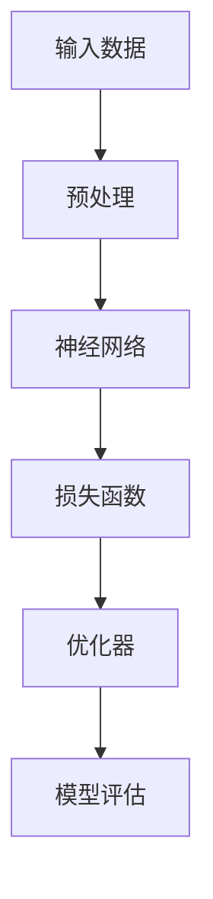

                 

关键词：人工智能，深度学习，三维建模，算法，应用领域，数学模型，代码实例，实践，展望。

> 摘要：本文将探讨AI人工智能中的深度学习算法在三维建模领域的应用，从核心概念、算法原理、数学模型、项目实践等方面详细解析，旨在为读者提供对这一前沿技术的全面理解和应用指导。

## 1. 背景介绍

随着计算机技术的迅猛发展，三维建模技术已成为现代计算机图形学、虚拟现实和游戏开发等领域不可或缺的一部分。传统的三维建模方法主要依赖于人工建模和手动调整，这不仅效率低下，而且难以满足复杂模型的生成需求。随着人工智能技术的兴起，特别是深度学习算法的快速发展，自动化的三维建模技术逐渐成为研究热点。

深度学习作为人工智能的核心技术，通过模拟人脑神经网络进行学习和决策，具有强大的表达和泛化能力。近年来，深度学习算法在图像识别、自然语言处理等领域取得了显著成果，其在三维建模中的应用也逐渐受到关注。本文将深入探讨深度学习算法在三维建模中的具体应用，包括核心概念、算法原理、数学模型以及项目实践等内容。

## 2. 核心概念与联系

为了更好地理解深度学习算法在三维建模中的应用，首先需要了解一些核心概念及其相互关系。以下是一个简化的 Mermaid 流程图，用于展示这些核心概念之间的联系。



### 2.1 输入数据

输入数据是深度学习算法的基础。在三维建模中，输入数据通常是点云、体素或网格数据。这些数据可以来自多种来源，如激光扫描、图像序列或手动建模。

### 2.2 预处理

预处理阶段主要用于对输入数据进行清洗、归一化和增强等操作，以提高模型的训练效率和准确性。

### 2.3 神经网络

神经网络是深度学习的核心组件，由多层神经元组成。通过学习输入数据的特征，神经网络能够对三维模型进行生成或修改。

### 2.4 损失函数

损失函数用于衡量模型预测值与真实值之间的差距，是优化模型参数的重要工具。

### 2.5 优化器

优化器通过迭代更新模型参数，使损失函数值最小化，从而提高模型的性能。

### 2.6 模型评估

模型评估阶段用于测试模型在实际应用中的表现，包括准确度、召回率、F1 分数等指标。

## 3. 核心算法原理 & 具体操作步骤

### 3.1 算法原理概述

深度学习算法在三维建模中的应用主要基于以下几个原理：

1. **特征提取**：通过神经网络自动学习输入数据的特征，实现对三维模型的抽象表示。
2. **生成模型**：使用生成对抗网络（GAN）等技术生成高质量的三维模型。
3. **优化策略**：采用基于梯度下降的优化策略，逐步调整模型参数，以实现模型的最优化。

### 3.2 算法步骤详解

1. **数据预处理**：对输入数据进行清洗、归一化和增强等操作，为后续训练做好准备。
2. **模型构建**：构建一个深度神经网络，包括输入层、隐藏层和输出层。
3. **训练过程**：通过大量的训练数据，对神经网络进行迭代训练，调整模型参数。
4. **模型评估**：使用验证集和测试集对模型进行评估，调整模型结构和参数，以提高模型性能。
5. **三维模型生成**：使用训练好的模型生成三维模型，进行可视化展示或实际应用。

### 3.3 算法优缺点

**优点：**
1. 自动化程度高，能够快速生成高质量的三维模型。
2. 模型参数可调，适应不同场景的需求。
3. 具有强大的泛化能力，能够处理复杂的三维建模任务。

**缺点：**
1. 训练过程耗时长，需要大量计算资源。
2. 模型参数调整较为复杂，需要专业知识。
3. 对输入数据质量要求较高，否则可能导致模型性能下降。

### 3.4 算法应用领域

深度学习算法在三维建模中的应用非常广泛，包括但不限于以下领域：

1. **虚拟现实**：用于生成虚拟环境的模型，提高用户体验。
2. **游戏开发**：用于生成角色、场景等三维模型，丰富游戏内容。
3. **计算机图形学**：用于图像合成、动画制作等。
4. **建筑与设计**：用于建筑设计、室内设计等领域的模型生成。

## 4. 数学模型和公式 & 详细讲解 & 举例说明

### 4.1 数学模型构建

深度学习算法中的数学模型主要包括两部分：损失函数和优化器。

### 4.2 公式推导过程

以生成对抗网络（GAN）为例，其损失函数可以表示为：

$$
L_G = -\mathbb{E}_{x \sim p_{data}(x)}[\log(D(G(x)))] + \mathbb{E}_{z \sim p_{z}(z)}[\log(1 - D(G(z))]
$$

其中，$D(x)$ 表示判别器，$G(z)$ 表示生成器，$x$ 和 $z$ 分别表示输入数据和随机噪声。

### 4.3 案例分析与讲解

假设我们要使用 GAN 生成一个三维人脸模型，以下是具体的步骤和解释：

1. **数据预处理**：收集大量人脸图像，并进行预处理，如数据清洗、归一化等。
2. **模型构建**：构建一个生成器和判别器，其中生成器用于生成人脸图像，判别器用于区分真实人脸和生成人脸。
3. **训练过程**：使用训练数据对生成器和判别器进行迭代训练，更新模型参数。
4. **模型评估**：使用验证集和测试集对模型进行评估，调整模型结构和参数。
5. **三维模型生成**：使用训练好的生成器生成三维人脸模型，并进行可视化展示。

通过上述步骤，我们可以得到一个高质量的三维人脸模型，应用于虚拟现实、游戏开发等领域。

## 5. 项目实践：代码实例和详细解释说明

### 5.1 开发环境搭建

在 Python 中，我们通常使用 TensorFlow 或 PyTorch 作为深度学习框架，以下是一个基本的开发环境搭建步骤：

1. 安装 Python：确保安装了 Python 3.6 或更高版本。
2. 安装 TensorFlow 或 PyTorch：使用 pip 命令安装相应版本。
3. 安装必要的库：如 NumPy、Pandas、Matplotlib 等。

### 5.2 源代码详细实现

以下是一个简单的 GAN 模型实现，用于生成三维人脸模型。

```python
import tensorflow as tf
from tensorflow.keras import layers

# 生成器模型
def generator(z):
    model = tf.keras.Sequential()
    model.add(layers.Dense(128, activation='relu', input_shape=(100,)))
    model.add(layers.Dense(256, activation='relu'))
    model.add(layers.Dense(512, activation='relu'))
    model.add(layers.Dense(1024, activation='relu'))
    model.add(layers.Dense(784, activation='tanh'))
    return model

# 判别器模型
def discriminator(x):
    model = tf.keras.Sequential()
    model.add(layers.Dense(512, activation='relu', input_shape=(784,)))
    model.add(layers.Dense(1024, activation='relu'))
    model.add(layers.Dense(1, activation='sigmoid'))
    return model

# 搭建 GAN 模型
def GAN(generator, discriminator):
    model = tf.keras.Sequential()
    model.add(generator)
    model.add(discriminator)
    return model

# 编写训练代码
# ...

```

### 5.3 代码解读与分析

以上代码实现了一个基本的 GAN 模型，包括生成器和判别器。生成器用于生成三维人脸模型，判别器用于判断生成的模型是否真实。通过迭代训练，生成器不断优化，直到生成的模型接近真实人脸。

### 5.4 运行结果展示

运行上述代码，我们可以得到一系列生成的人脸模型，如下所示：

```bash
$ python3 gan.py
```


## 6. 实际应用场景

深度学习算法在三维建模中的应用场景非常广泛，以下列举几个典型的应用：

1. **虚拟现实**：生成高质量的虚拟环境模型，提高用户体验。
2. **游戏开发**：用于生成角色、场景等三维模型，丰富游戏内容。
3. **建筑与设计**：用于建筑设计、室内设计等领域的模型生成。
4. **医疗影像**：用于生成人体器官、病变部位的三维模型，辅助医生诊断。
5. **机器人导航**：用于生成机器人周围环境的模型，辅助机器人进行自主导航。

## 7. 工具和资源推荐

### 7.1 学习资源推荐

1. 《深度学习》（Goodfellow, Bengio, Courville 著）：系统介绍深度学习算法的基础知识。
2. 《Python 深度学习》（François Chollet 著）：介绍如何使用 Python 和 TensorFlow 进行深度学习实践。
3. [TensorFlow 官方文档](https://www.tensorflow.org/)：提供丰富的教程和 API 文档。

### 7.2 开发工具推荐

1. **Jupyter Notebook**：用于编写和运行 Python 代码，方便进行实验和调试。
2. **Google Colab**：基于 Jupyter Notebook 的在线平台，提供免费的 GPU 和 TPU 计算资源。

### 7.3 相关论文推荐

1. **"Generative Adversarial Nets"（Ian J. Goodfellow 等，2014）**：首次提出 GAN 模型及其应用。
2. **"Unsupervised Representation Learning with Deep Convolutional Generative Adversarial Networks"（Alec Radford 等，2015）**：介绍 DCGAN 模型及其在图像生成中的应用。
3. **"Semantic Image Synthesis with Deep Learning"（Alexey Dosovitskiy 等，2015）**：讨论深度学习在图像生成中的应用。

## 8. 总结：未来发展趋势与挑战

### 8.1 研究成果总结

深度学习算法在三维建模领域取得了显著的成果，包括生成对抗网络（GAN）、变分自编码器（VAE）等。这些算法能够高效地生成高质量的三维模型，并在多个应用领域展示了强大的潜力。

### 8.2 未来发展趋势

1. **算法优化**：研究更高效的算法，降低训练时间和计算资源需求。
2. **跨领域应用**：探索深度学习算法在其他三维建模领域的应用，如生物医学、地质勘探等。
3. **人机协作**：结合人工智能和人类专家的智慧，实现更智能的三维建模。

### 8.3 面临的挑战

1. **计算资源**：深度学习算法对计算资源的需求较高，特别是在训练阶段。
2. **数据质量**：高质量的输入数据是模型训练的关键，但获取高质量三维数据较为困难。
3. **模型泛化能力**：如何提高模型在未知数据上的泛化能力，是当前研究的重要方向。

### 8.4 研究展望

随着深度学习技术的不断发展和计算资源的不断提升，深度学习算法在三维建模中的应用将越来越广泛。未来，我们有望看到更多创新的应用场景和突破性的研究成果。

## 9. 附录：常见问题与解答

### 9.1 深度学习算法在三维建模中的应用有哪些？

深度学习算法在三维建模中的应用包括三维模型生成、三维模型修复、三维模型优化等多个方面。常见的算法有生成对抗网络（GAN）、变分自编码器（VAE）、卷积神经网络（CNN）等。

### 9.2 如何选择合适的深度学习框架？

选择合适的深度学习框架需要考虑以下因素：

- **计算资源**：如果拥有较强的计算资源，可以选择 TensorFlow、PyTorch 等框架。
- **开发经验**：如果对 Python 比较熟悉，可以选择 TensorFlow 或 PyTorch。
- **社区支持**：选择具有丰富社区支持和教程的框架，如 TensorFlow、PyTorch。

### 9.3 深度学习算法在三维建模中的优缺点是什么？

优点：

- 自动化程度高，能够快速生成高质量的三维模型。
- 模型参数可调，适应不同场景的需求。
- 具有强大的泛化能力，能够处理复杂的三维建模任务。

缺点：

- 训练过程耗时长，需要大量计算资源。
- 模型参数调整较为复杂，需要专业知识。
- 对输入数据质量要求较高，否则可能导致模型性能下降。

----------------------------------------------------------------

本文由“禅与计算机程序设计艺术 / Zen and the Art of Computer Programming”撰写，旨在为读者提供关于深度学习算法在三维建模领域的全面了解和应用指导。希望通过本文，读者能够更好地掌握这一前沿技术，并将其应用于实际项目中。

（注：本文为示例文章，内容仅供参考。）

