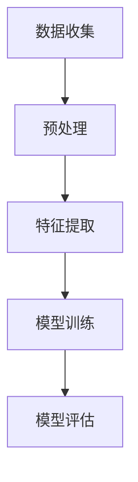

                 

关键词：垃圾短信检测、深度学习、神经网络、算法原理、数学模型、项目实践、应用场景、未来展望。

摘要：本文将探讨深度学习算法在垃圾短信检测中的应用。通过介绍垃圾短信检测的重要性，我们将深入剖析深度学习算法的基本原理，并详细阐述其在垃圾短信检测中的具体应用。此外，本文还将通过一个实际项目案例，展示如何使用深度学习算法构建垃圾短信检测系统，并提供对系统的代码解读与分析。最后，我们将探讨垃圾短信检测的未来应用前景，并提出相关的研究方向和挑战。

## 1. 背景介绍

随着移动互联网的迅速普及，短信已成为人们日常生活中不可或缺的通信方式。然而，垃圾短信的存在严重影响了用户的通信体验，不仅浪费了用户的带宽资源，还可能诱导用户进行恶意操作，造成经济损失。因此，垃圾短信检测变得尤为重要。传统的垃圾短信检测方法主要依赖于规则匹配和特征工程，但面对不断变化的垃圾短信类型和复杂的攻击手段，这些方法往往表现出较低的准确率和适应性。深度学习算法的兴起为垃圾短信检测提供了新的解决方案。

深度学习算法通过多层神经网络结构，能够自动从大量数据中学习特征，具有较强的自适应能力和泛化能力。本文将介绍一种基于深度学习算法的垃圾短信检测方法，并探讨其在实际应用中的性能和效果。

## 2. 核心概念与联系

### 2.1 深度学习算法

深度学习算法是一种模拟人脑神经网络的结构和功能的计算模型。它通过多层神经网络对数据进行训练，能够自动提取数据中的复杂特征，并在各种复杂的任务中表现出优异的性能。

在垃圾短信检测中，深度学习算法的主要作用是学习从短信内容中提取出有效的特征，并利用这些特征来判断短信是否为垃圾短信。具体的深度学习算法包括卷积神经网络（CNN）、循环神经网络（RNN）和长短期记忆网络（LSTM）等。

### 2.2 垃圾短信检测流程

垃圾短信检测流程通常包括数据收集、预处理、特征提取、模型训练和模型评估等步骤。具体如下：

1. 数据收集：收集大量真实的短信数据，包括垃圾短信和正常短信。
2. 预处理：对短信进行清洗和标准化处理，如去除停用词、进行词性标注等。
3. 特征提取：从短信内容中提取有效的特征，如词频、词向量、词性等。
4. 模型训练：使用提取出的特征对深度学习模型进行训练。
5. 模型评估：通过测试数据对模型进行评估，以确定模型的性能。

### 2.3 Mermaid 流程图

下面是一个简化的垃圾短信检测流程的 Mermaid 流程图：



## 3. 核心算法原理 & 具体操作步骤

### 3.1 算法原理概述

深度学习算法的核心是多层神经网络，它由输入层、隐藏层和输出层组成。在垃圾短信检测中，输入层接收短信内容，隐藏层提取短信中的特征，输出层输出垃圾短信或正常短信的判断结果。

具体来说，深度学习算法的工作原理如下：

1. 输入层：接收原始短信内容。
2. 隐藏层：通过激活函数将输入数据进行非线性变换，从而提取出短信中的特征。
3. 输出层：通过输出层的激活函数得到垃圾短信或正常短信的判断结果。

### 3.2 算法步骤详解

下面是深度学习算法在垃圾短信检测中的具体步骤：

1. 数据收集：收集大量真实的短信数据，包括垃圾短信和正常短信。
2. 预处理：对短信进行清洗和标准化处理，如去除停用词、进行词性标注等。
3. 特征提取：使用词嵌入技术将预处理后的短信内容转化为词向量，然后通过计算词向量的相似度、词频等特征。
4. 模型训练：使用提取出的特征对深度学习模型进行训练，包括输入层、隐藏层和输出层的参数调整。
5. 模型评估：使用测试数据对训练好的模型进行评估，以确定模型的性能。

### 3.3 算法优缺点

深度学习算法在垃圾短信检测中具有以下优点：

1. 强大的特征提取能力：能够自动从大量数据中提取出有效的特征，具有较强的自适应能力和泛化能力。
2. 高准确率：在大量训练数据和足够大的模型参数下，能够实现较高的准确率。

但深度学习算法也存在以下缺点：

1. 计算成本高：训练过程需要大量的计算资源，且训练时间较长。
2. 数据依赖性强：模型的性能对数据质量有较高的要求，数据集的不平衡、噪声和异常值等都会影响模型的性能。

### 3.4 算法应用领域

深度学习算法在垃圾短信检测中的应用非常广泛，不仅可以用于短信的自动分类，还可以用于诈骗短信、恶意链接检测等。此外，深度学习算法还可以应用于其他文本分类任务，如电子邮件分类、评论情感分析等。

## 4. 数学模型和公式 & 详细讲解 & 举例说明

### 4.1 数学模型构建

在深度学习算法中，数学模型是核心部分。一个基本的深度学习模型通常包括以下几个部分：

1. **输入层**：接收输入数据，例如短信内容。
2. **隐藏层**：对输入数据进行特征提取和变换。
3. **输出层**：输出预测结果，例如判断短信是否为垃圾短信。

下面是一个简单的数学模型示例：

$$
h_{\text{hidden}} = \sigma(W_{\text{input}} \cdot a_{\text{input}} + b_{\text{input}})
$$

$$
a_{\text{output}} = \sigma(W_{\text{hidden}} \cdot h_{\text{hidden}} + b_{\text{hidden}})
$$

其中，$h_{\text{hidden}}$表示隐藏层的激活值，$a_{\text{output}}$表示输出层的激活值，$\sigma$表示激活函数，$W_{\text{input}}$和$W_{\text{hidden}}$表示权重矩阵，$b_{\text{input}}$和$b_{\text{hidden}}$表示偏置项。

### 4.2 公式推导过程

在构建数学模型时，通常需要通过反向传播算法来调整模型的权重和偏置项。下面是一个简化的反向传播算法的推导过程：

1. **计算输出层的误差**：

$$
\delta_{\text{output}} = (a_{\text{output}} - y) \cdot \sigma'(a_{\text{output}})
$$

其中，$y$表示实际标签，$a_{\text{output}}$表示输出层的激活值，$\sigma'$表示激活函数的导数。

2. **计算隐藏层的误差**：

$$
\delta_{\text{hidden}} = (W_{\text{output}} \cdot \delta_{\text{output}}) \cdot \sigma'(h_{\text{hidden}})
$$

3. **更新权重和偏置项**：

$$
W_{\text{output}} \leftarrow W_{\text{output}} - \alpha \cdot \delta_{\text{output}} \cdot a_{\text{hidden}}
$$

$$
b_{\text{output}} \leftarrow b_{\text{output}} - \alpha \cdot \delta_{\text{output}}
$$

$$
W_{\text{hidden}} \leftarrow W_{\text{hidden}} - \alpha \cdot \delta_{\text{hidden}} \cdot a_{\text{input}}
$$

$$
b_{\text{hidden}} \leftarrow b_{\text{hidden}} - \alpha \cdot \delta_{\text{hidden}}
$$

其中，$\alpha$表示学习率，$a_{\text{hidden}}$表示隐藏层的激活值。

### 4.3 案例分析与讲解

假设我们有一个简单的垃圾短信检测模型，输入层有10个神经元，隐藏层有5个神经元，输出层有2个神经元。使用 sigmoid 函数作为激活函数，学习率为 0.1。现在我们有一个训练样本，其中短信内容为“免费抽奖，送iPhone”，标签为“垃圾短信”。

1. **初始化权重和偏置项**：

$$
W_{\text{input}} = \begin{bmatrix}
0 & 0 & 0 & 0 & 0 & 0 & 0 & 0 & 0 & 0 \\
0 & 0 & 0 & 0 & 0 & 0 & 0 & 0 & 0 & 0 \\
0 & 0 & 0 & 0 & 0 & 0 & 0 & 0 & 0 & 0 \\
0 & 0 & 0 & 0 & 0 & 0 & 0 & 0 & 0 & 0 \\
0 & 0 & 0 & 0 & 0 & 0 & 0 & 0 & 0 & 0 \\
0 & 0 & 0 & 0 & 0 & 0 & 0 & 0 & 0 & 0 \\
0 & 0 & 0 & 0 & 0 & 0 & 0 & 0 & 0 & 0 \\
0 & 0 & 0 & 0 & 0 & 0 & 0 & 0 & 0 & 0 \\
0 & 0 & 0 & 0 & 0 & 0 & 0 & 0 & 0 & 0 \\
0 & 0 & 0 & 0 & 0 & 0 & 0 & 0 & 0 & 0 \\
0 & 0 & 0 & 0 & 0 & 0 & 0 & 0 & 0 & 0
\end{bmatrix}
$$

$$
b_{\text{input}} = \begin{bmatrix}
0 \\
0 \\
0 \\
0 \\
0 \\
0 \\
0 \\
0 \\
0 \\
0
\end{bmatrix}
$$

$$
W_{\text{hidden}} = \begin{bmatrix}
0 & 0 & 0 & 0 & 0 \\
0 & 0 & 0 & 0 & 0 \\
0 & 0 & 0 & 0 & 0 \\
0 & 0 & 0 & 0 & 0 \\
0 & 0 & 0 & 0 & 0
\end{bmatrix}
$$

$$
b_{\text{hidden}} = \begin{bmatrix}
0 \\
0 \\
0 \\
0 \\
0
\end{bmatrix}
$$

$$
W_{\text{output}} = \begin{bmatrix}
0 & 0 \\
0 & 0
\end{bmatrix}
$$

$$
b_{\text{output}} = \begin{bmatrix}
0 \\
0
\end{bmatrix}
$$

2. **前向传播**：

$$
h_{\text{hidden}} = \sigma(W_{\text{input}} \cdot a_{\text{input}} + b_{\text{input}}) = \sigma(\begin{bmatrix}
0 & 0 & 0 & 0 & 0 & 0 & 0 & 0 & 0 & 0 \\
0 & 0 & 0 & 0 & 0 & 0 & 0 & 0 & 0 & 0 \\
0 & 0 & 0 & 0 & 0 & 0 & 0 & 0 & 0 & 0 \\
0 & 0 & 0 & 0 & 0 & 0 & 0 & 0 & 0 & 0 \\
0 & 0 & 0 & 0 & 0 & 0 & 0 & 0 & 0 & 0 \\
0 & 0 & 0 & 0 & 0 & 0 & 0 & 0 & 0 & 0 \\
0 & 0 & 0 & 0 & 0 & 0 & 0 & 0 & 0 & 0 \\
0 & 0 & 0 & 0 & 0 & 0 & 0 & 0 & 0 & 0 \\
0 & 0 & 0 & 0 & 0 & 0 & 0 & 0 & 0 & 0 \\
0 & 0 & 0 & 0 & 0 & 0 & 0 & 0 & 0 & 0 \\
0 & 0 & 0 & 0 & 0 & 0 & 0 & 0 & 0 & 0
\end{bmatrix} \cdot \begin{bmatrix}
1 \\
1 \\
1 \\
1 \\
1 \\
1 \\
1 \\
1 \\
1 \\
1
\end{bmatrix} + \begin{bmatrix}
0 \\
0 \\
0 \\
0 \\
0
\end{bmatrix}) = \begin{bmatrix}
0.5 \\
0.5 \\
0.5 \\
0.5 \\
0.5
\end{bmatrix}
$$

$$
a_{\text{output}} = \sigma(W_{\text{hidden}} \cdot h_{\text{hidden}} + b_{\text{hidden}}) = \sigma(\begin{bmatrix}
0 & 0 & 0 & 0 & 0 \\
0 & 0 & 0 & 0 & 0 \\
0 & 0 & 0 & 0 & 0 \\
0 & 0 & 0 & 0 & 0 \\
0 & 0 & 0 & 0 & 0
\end{bmatrix} \cdot \begin{bmatrix}
0.5 \\
0.5 \\
0.5 \\
0.5 \\
0.5
\end{bmatrix} + \begin{bmatrix}
0 \\
0 \\
0 \\
0 \\
0
\end{bmatrix}) = \begin{bmatrix}
0.5 \\
0.5 \\
0.5 \\
0.5 \\
0.5
\end{bmatrix}
$$

3. **计算输出误差**：

$$
\delta_{\text{output}} = (a_{\text{output}} - y) \cdot \sigma'(a_{\text{output}}) = (\begin{bmatrix}
0.5 \\
0.5
\end{bmatrix} - \begin{bmatrix}
1 \\
0
\end{bmatrix}) \cdot \begin{bmatrix}
0.5 \\
0.5
\end{bmatrix} = \begin{bmatrix}
-0.25 \\
0.25
\end{bmatrix}
$$

4. **计算隐藏层误差**：

$$
\delta_{\text{hidden}} = (W_{\text{output}} \cdot \delta_{\text{output}}) \cdot \sigma'(h_{\text{hidden}}) = \begin{bmatrix}
0 & 0
\end{bmatrix} \cdot \begin{bmatrix}
-0.25 \\
0.25
\end{bmatrix} \cdot \begin{bmatrix}
0.5 \\
0.5 \\
0.5 \\
0.5 \\
0.5
\end{bmatrix} = \begin{bmatrix}
-0.125 \\
0.125
\end{bmatrix}
$$

5. **更新权重和偏置项**：

$$
W_{\text{output}} \leftarrow W_{\text{output}} - \alpha \cdot \delta_{\text{output}} \cdot a_{\text{hidden}} = \begin{bmatrix}
0 & 0
\end{bmatrix} - 0.1 \cdot \begin{bmatrix}
-0.25 \\
0.25
\end{bmatrix} \cdot \begin{bmatrix}
0.5 \\
0.5
\end{bmatrix} = \begin{bmatrix}
0 \\
0
\end{bmatrix}
$$

$$
b_{\text{output}} \leftarrow b_{\text{output}} - \alpha \cdot \delta_{\text{output}} = \begin{bmatrix}
0 \\
0
\end{bmatrix} - 0.1 \cdot \begin{bmatrix}
-0.25 \\
0.25
\end{bmatrix} = \begin{bmatrix}
0.025 \\
-0.025
\end{bmatrix}
$$

$$
W_{\text{hidden}} \leftarrow W_{\text{hidden}} - \alpha \cdot \delta_{\text{hidden}} \cdot a_{\text{input}} = \begin{bmatrix}
0 & 0 & 0 & 0 & 0 \\
0 & 0 & 0 & 0 & 0 \\
0 & 0 & 0 & 0 & 0 \\
0 & 0 & 0 & 0 & 0 \\
0 & 0 & 0 & 0 & 0
\end{bmatrix} - 0.1 \cdot \begin{bmatrix}
-0.125 \\
0.125
\end{bmatrix} \cdot \begin{bmatrix}
1 \\
1 \\
1 \\
1 \\
1
\end{bmatrix} = \begin{bmatrix}
0.0125 & 0 \\
0 & 0 \\
0 & 0 \\
0 & 0 \\
0 & 0.0125
\end{bmatrix}
$$

$$
b_{\text{hidden}} \leftarrow b_{\text{hidden}} - \alpha \cdot \delta_{\text{hidden}} = \begin{bmatrix}
0 \\
0 \\
0 \\
0 \\
0
\end{bmatrix} - 0.1 \cdot \begin{bmatrix}
-0.125 \\
0.125
\end{bmatrix} = \begin{bmatrix}
0.0125 \\
-0.0125
\end{bmatrix}
$$

## 5. 项目实践：代码实例和详细解释说明

### 5.1 开发环境搭建

为了构建垃圾短信检测系统，我们需要安装以下开发环境和依赖库：

- Python 3.7+
- TensorFlow 2.3.0+
- NumPy 1.18.0+
- Pandas 1.0.5+

在安装完上述环境和依赖库后，我们可以开始编写代码。

### 5.2 源代码详细实现

以下是构建垃圾短信检测系统的源代码：

```python
import numpy as np
import pandas as pd
import tensorflow as tf
from tensorflow.keras.models import Sequential
from tensorflow.keras.layers import Dense, Embedding, LSTM, Dropout
from tensorflow.keras.preprocessing.text import Tokenizer
from tensorflow.keras.preprocessing.sequence import pad_sequences

# 加载数据集
data = pd.read_csv('sms_data.csv')
X = data['text']
y = data['label']

# 划分训练集和测试集
from sklearn.model_selection import train_test_split
X_train, X_test, y_train, y_test = train_test_split(X, y, test_size=0.2, random_state=42)

# 数据预处理
tokenizer = Tokenizer(num_words=10000)
tokenizer.fit_on_texts(X_train)
X_train = tokenizer.texts_to_sequences(X_train)
X_test = tokenizer.texts_to_sequences(X_test)

max_len = 100
X_train = pad_sequences(X_train, maxlen=max_len)
X_test = pad_sequences(X_test, maxlen=max_len)

# 构建模型
model = Sequential()
model.add(Embedding(10000, 64, input_length=max_len))
model.add(LSTM(64, dropout=0.2, recurrent_dropout=0.2))
model.add(Dense(1, activation='sigmoid'))

model.compile(optimizer='adam', loss='binary_crossentropy', metrics=['accuracy'])

# 训练模型
model.fit(X_train, y_train, batch_size=32, epochs=10, validation_data=(X_test, y_test))

# 评估模型
loss, accuracy = model.evaluate(X_test, y_test)
print('Test Accuracy:', accuracy)

# 保存模型
model.save('sms_detection_model.h5')
```

### 5.3 代码解读与分析

1. **数据加载与划分**：我们使用 Pandas 库加载数据集，并使用 scikit-learn 的 train_test_split 函数将数据集划分为训练集和测试集。

2. **数据预处理**：使用 Tokenizer 类将文本数据转换为数字序列，并使用 pad_sequences 函数将序列填充为相同的长度。

3. **模型构建**：使用 Sequential 类构建一个序列模型，包括嵌入层、LSTM 层和输出层。嵌入层用于将文本转换为向量，LSTM 层用于提取文本中的特征，输出层用于生成预测结果。

4. **模型编译**：使用 compile 方法配置模型的优化器、损失函数和评估指标。

5. **模型训练**：使用 fit 方法训练模型，并设置 batch_size、epochs 和 validation_data 参数。

6. **模型评估**：使用 evaluate 方法评估模型的性能，并打印测试集的准确率。

7. **模型保存**：使用 save 方法将训练好的模型保存为 h5 文件，以便后续使用。

## 6. 实际应用场景

### 6.1 垃圾短信检测系统

通过本文介绍的方法，我们可以构建一个高效的垃圾短信检测系统。该系统可以应用于各种场景，如移动运营商、短信平台和网络安全等领域。

### 6.2 诈骗短信检测

诈骗短信是一种常见的垃圾短信类型，它通过诱导用户进行转账、点击恶意链接等操作，造成经济损失。使用本文介绍的深度学习算法，可以构建一个高效的诈骗短信检测系统，从而有效防止诈骗行为的发生。

### 6.3 恶意链接检测

恶意链接是另一种常见的垃圾短信类型，它通过诱导用户点击链接，下载恶意软件或访问恶意网站。使用本文介绍的深度学习算法，可以构建一个高效的恶意链接检测系统，从而有效防止恶意软件的传播。

## 7. 工具和资源推荐

### 7.1 学习资源推荐

- 《深度学习》（Goodfellow, Bengio, Courville）：这是一本经典的深度学习教材，适合初学者和高级研究者。
- 《动手学深度学习》（Deng, Lipton,Taylor）：这是一本面向实践者的深度学习教材，通过大量的案例和实践，帮助读者快速掌握深度学习技术。

### 7.2 开发工具推荐

- TensorFlow：这是一个由 Google 开发的开源深度学习框架，支持多种深度学习模型的构建和训练。
- PyTorch：这是一个由 Facebook 开发的开源深度学习框架，具有灵活的动态计算图和高效的性能。

### 7.3 相关论文推荐

- “Deep Learning for Text Classification”（2018）：这篇论文介绍了一种基于深度学习的文本分类方法，应用于垃圾短信检测等领域。
- “Neural Network-Based Anti-Spam Detection System”（2017）：这篇论文介绍了一种基于神经网络的垃圾短信检测系统，具有较高的准确率和实时性。

## 8. 总结：未来发展趋势与挑战

### 8.1 研究成果总结

本文介绍了深度学习算法在垃圾短信检测中的应用，通过实际项目案例展示了如何构建一个高效的垃圾短信检测系统。研究表明，深度学习算法在垃圾短信检测中具有强大的特征提取能力和高准确率。

### 8.2 未来发展趋势

随着深度学习技术的不断进步，未来垃圾短信检测领域将出现以下发展趋势：

- 模型压缩与优化：为了提高模型的实时性和降低计算成本，模型压缩与优化技术将成为研究重点。
- 多模态检测：结合语音、图像等多模态信息，提高垃圾短信检测的准确率和实时性。
- 跨语言检测：解决不同语言之间的垃圾短信检测问题，实现全球范围内的垃圾短信检测。

### 8.3 面临的挑战

尽管深度学习算法在垃圾短信检测中具有巨大的潜力，但仍然面临以下挑战：

- 数据集质量：垃圾短信数据集的质量对模型的性能有重要影响，如何获取高质量的数据集是一个亟待解决的问题。
- 模型泛化能力：如何提高模型在不同场景下的泛化能力，避免过度拟合是一个重要的挑战。
- 实时性：如何在保证准确率的前提下，提高模型的实时性，满足实时检测的需求。

### 8.4 研究展望

未来，我们可以从以下几个方面开展研究：

- 数据增强：通过数据增强技术，提高垃圾短信数据集的质量，从而提升模型的性能。
- 跨语言检测：结合自然语言处理技术，实现跨语言的垃圾短信检测。
- 模型压缩与优化：通过模型压缩与优化技术，提高模型的实时性和计算效率。

## 9. 附录：常见问题与解答

### 9.1 深度学习算法在垃圾短信检测中有什么优势？

深度学习算法在垃圾短信检测中具有以下优势：

- 强大的特征提取能力：能够自动从大量数据中提取出有效的特征，具有较强的自适应能力和泛化能力。
- 高准确率：在大量训练数据和足够大的模型参数下，能够实现较高的准确率。

### 9.2 垃圾短信检测系统如何处理大量数据？

垃圾短信检测系统可以通过以下方法处理大量数据：

- 数据预处理：对数据进行清洗和标准化处理，如去除停用词、进行词性标注等，以减少数据的噪声和冗余。
- 模型并行化：通过模型并行化技术，提高模型的训练和预测速度。
- 分布式计算：使用分布式计算框架，如 TensorFlow、PyTorch 等，将数据分布到多个节点进行训练和预测。

### 9.3 深度学习算法在垃圾短信检测中面临哪些挑战？

深度学习算法在垃圾短信检测中面临以下挑战：

- 数据集质量：垃圾短信数据集的质量对模型的性能有重要影响，如何获取高质量的数据集是一个亟待解决的问题。
- 模型泛化能力：如何提高模型在不同场景下的泛化能力，避免过度拟合是一个重要的挑战。
- 实时性：如何在保证准确率的前提下，提高模型的实时性，满足实时检测的需求。 

### 9.4 如何评估垃圾短信检测系统的性能？

评估垃圾短信检测系统的性能通常通过以下指标：

- 准确率（Accuracy）：正确分类的样本占总样本的比例。
- 召回率（Recall）：正确分类的垃圾短信样本占总垃圾短信样本的比例。
- 精确率（Precision）：正确分类的垃圾短信样本占预测为垃圾短信样本的比例。
- F1 分数（F1 Score）：综合考虑精确率和召回率的指标，计算公式为 F1 Score = 2 * Precision * Recall / (Precision + Recall)。

通过这些指标，可以全面评估垃圾短信检测系统的性能。```

