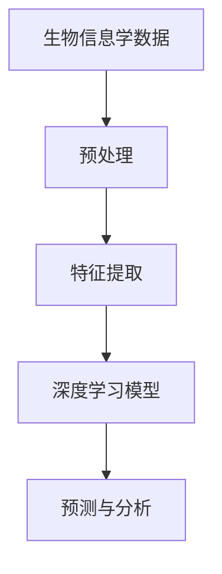

                 

关键词：人工智能，深度学习，生物信息学，算法应用，算法原理，数学模型，项目实践，实际应用，未来展望

> 摘要：本文将探讨人工智能深度学习算法在生物信息学领域的应用，通过对核心概念、算法原理、数学模型和实际项目实践的详细分析，展示深度学习在生物信息学中的重要价值，并展望其未来发展趋势与挑战。

## 1. 背景介绍

生物信息学是一门跨学科的领域，它结合了生物学、计算机科学和数学，旨在分析和解释生物学数据。随着高通量测序技术的快速发展，生物信息学面临着大量数据的处理和分析挑战。深度学习作为一种强大的机器学习技术，已经在图像识别、自然语言处理等领域取得了显著成果，其在生物信息学中的应用也逐渐引起关注。

本文将重点关注深度学习算法在生物信息学中的具体应用，包括基因表达数据分析、蛋白质结构预测、药物研发等领域，通过详细解析核心概念、算法原理、数学模型以及实际项目实践，深入探讨深度学习在生物信息学中的重要价值。

## 2. 核心概念与联系

### 2.1 核心概念

深度学习（Deep Learning）：深度学习是机器学习的一个分支，通过构建深层的神经网络模型，模拟人脑的学习方式，实现自动特征提取和模式识别。

生物信息学（Bioinformatics）：生物信息学是一门研究生物数据存储、检索、分析和解释的学科，涉及基因组学、蛋白质组学、代谢组学等多个领域。

### 2.2 联系与架构

为了更好地理解深度学习在生物信息学中的应用，我们可以借助Mermaid流程图展示其核心概念和架构。



在上图中，生物信息学数据经过预处理和特征提取后，输入到深度学习模型中进行预测和分析。这个流程体现了深度学习在生物信息学中的核心作用，即从大量数据中提取有用信息，辅助生物学研究。

## 3. 核心算法原理 & 具体操作步骤

### 3.1 算法原理概述

深度学习算法的核心是神经网络，特别是深度神经网络（Deep Neural Network，DNN）。DNN通过层层神经元的非线性变换，实现数据的特征提取和模式识别。深度学习算法在生物信息学中的应用主要包括以下几个方面：

1. **基因表达数据分析**：利用深度学习算法对基因表达数据进行分析，识别基因之间的关联和调控关系。
2. **蛋白质结构预测**：通过深度学习算法预测蛋白质的三维结构，为药物研发和生物工程提供重要参考。
3. **药物研发**：利用深度学习算法筛选和设计潜在药物分子，加速新药研发过程。

### 3.2 算法步骤详解

深度学习算法在生物信息学中的应用主要包括以下步骤：

1. **数据预处理**：对生物信息学数据进行清洗、归一化和特征提取，为后续深度学习模型训练提供高质量的数据集。
2. **模型构建**：根据具体应用需求，构建合适的深度学习模型，如卷积神经网络（CNN）、循环神经网络（RNN）等。
3. **模型训练**：使用预处理后的数据集对深度学习模型进行训练，通过反向传播算法调整模型参数，优化模型性能。
4. **模型评估**：使用测试数据集对训练好的模型进行评估，评估指标包括准确率、召回率、F1值等。
5. **预测与分析**：将深度学习模型应用于实际问题，如基因表达数据分析、蛋白质结构预测等，提取有价值的信息。

### 3.3 算法优缺点

**优点**：

1. **强大的特征提取能力**：深度学习算法可以通过多层神经元的非线性变换，自动提取数据中的特征，提高模型性能。
2. **良好的泛化能力**：深度学习算法在训练过程中可以学习到数据的通用特征，从而在新的数据集上保持较好的性能。
3. **高效的处理速度**：随着计算能力的提升，深度学习算法的处理速度越来越快，能够应对大规模生物信息学数据的分析需求。

**缺点**：

1. **数据需求量大**：深度学习算法需要大量的训练数据来保证模型的性能，对于一些数据稀缺的领域，深度学习算法的应用受到限制。
2. **训练时间长**：深度学习算法的训练过程通常需要较长时间，对于实时性要求较高的应用场景，可能无法满足需求。
3. **模型解释性较差**：深度学习算法的黑箱特性使得模型解释性较差，对于需要解释性较强的应用场景，深度学习算法可能不是最佳选择。

### 3.4 算法应用领域

深度学习算法在生物信息学中的应用非常广泛，主要包括以下几个方面：

1. **基因表达数据分析**：通过深度学习算法对基因表达数据进行分析，可以识别基因之间的调控关系和生物标记物，为疾病诊断和预防提供依据。
2. **蛋白质结构预测**：利用深度学习算法预测蛋白质的三维结构，有助于理解蛋白质的功能和作用机制，为新药设计提供参考。
3. **药物研发**：深度学习算法在药物筛选和设计方面具有重要作用，通过预测药物与靶点的相互作用，加速新药研发进程。
4. **疾病诊断**：深度学习算法在疾病诊断方面具有广泛应用，如通过图像分析进行癌症筛查和检测，提高诊断准确率。

## 4. 数学模型和公式 & 详细讲解 & 举例说明

### 4.1 数学模型构建

深度学习算法的核心是构建一个适合特定任务的人工神经网络模型。一个简单的人工神经网络模型通常包括输入层、隐藏层和输出层。以下是一个三层的神经网络模型：

```latex
f_{\text{output}}(x) = \sigma(\sigma(W_2 \cdot \sigma(W_1 \cdot x + b_1) + b_2))
```

其中，\( x \) 是输入数据，\( W_1 \) 和 \( W_2 \) 是权重矩阵，\( b_1 \) 和 \( b_2 \) 是偏置项，\( \sigma \) 是激活函数，通常使用 sigmoid 函数或 ReLU 函数。

### 4.2 公式推导过程

为了推导神经网络模型的训练过程，我们需要了解反向传播算法。反向传播算法的核心思想是利用梯度下降法优化模型参数，使模型输出与实际标签的误差最小。

假设我们的目标是最小化损失函数 \( J(W) = \frac{1}{2} \sum_{i=1}^{n} (f_{\text{output}}(x_i) - y_i)^2 \)，其中 \( y_i \) 是标签值，\( f_{\text{output}}(x_i) \) 是模型输出值。

在每次迭代过程中，我们计算损失函数关于每个参数的梯度：

$$
\frac{\partial J}{\partial W} = \frac{\partial J}{\partial f_{\text{output}}} \cdot \frac{\partial f_{\text{output}}}{\partial W}
$$

其中，\( \frac{\partial J}{\partial f_{\text{output}}} \) 是损失函数关于输出的梯度，\( \frac{\partial f_{\text{output}}}{\partial W} \) 是输出关于参数的梯度。

### 4.3 案例分析与讲解

为了更好地理解深度学习算法在生物信息学中的应用，我们以基因表达数据分析为例，展示一个简单的深度学习模型。

假设我们有一个包含 100 个基因表达数据的样本，每个样本有 100 个基因表达值。我们的目标是利用这些数据预测某个基因是否在特定条件下显著上调或下调。

1. **数据预处理**：将基因表达数据归一化，并将标签（0或1）转换为二进制编码。

2. **模型构建**：构建一个包含 2 个隐藏层的深度学习模型，每个隐藏层有 100 个神经元。使用 sigmoid 激活函数。

3. **模型训练**：使用预处理后的数据集对模型进行训练，训练过程包括前向传播和反向传播。

4. **模型评估**：使用测试数据集对模型进行评估，计算准确率、召回率等指标。

5. **预测与分析**：将训练好的模型应用于新的基因表达数据，预测基因表达变化趋势，为生物学研究提供参考。

## 5. 项目实践：代码实例和详细解释说明

### 5.1 开发环境搭建

为了实践深度学习算法在生物信息学中的应用，我们需要搭建一个合适的开发环境。以下是搭建过程的详细步骤：

1. 安装 Python（建议使用 Python 3.7 或更高版本）。
2. 安装深度学习框架，如 TensorFlow 或 PyTorch。
3. 安装生物信息学数据处理库，如 BioPython 或 SciPy。
4. 安装必要的依赖库，如 NumPy、Pandas 等。

### 5.2 源代码详细实现

以下是一个简单的深度学习模型实现，用于基因表达数据分析。

```python
import numpy as np
import tensorflow as tf
from tensorflow.keras.models import Sequential
from tensorflow.keras.layers import Dense, Activation

# 数据预处理
def preprocess_data(data):
    # 归一化数据
    data = (data - np.mean(data)) / np.std(data)
    return data

# 构建深度学习模型
def build_model(input_shape):
    model = Sequential()
    model.add(Dense(100, input_shape=input_shape, activation='sigmoid'))
    model.add(Dense(100, activation='sigmoid'))
    model.add(Dense(2, activation='sigmoid'))
    model.compile(optimizer='adam', loss='binary_crossentropy', metrics=['accuracy'])
    return model

# 训练模型
def train_model(model, X_train, y_train, X_val, y_val, epochs=100, batch_size=32):
    history = model.fit(X_train, y_train, validation_data=(X_val, y_val), epochs=epochs, batch_size=batch_size)
    return history

# 预测与分析
def predict(model, X_test):
    predictions = model.predict(X_test)
    predictions = np.argmax(predictions, axis=1)
    return predictions

# 主函数
def main():
    # 加载数据
    X_train = preprocess_data(X_train_data)
    X_val = preprocess_data(X_val_data)
    X_test = preprocess_data(X_test_data)

    # 构建模型
    model = build_model(input_shape=(100,))

    # 训练模型
    history = train_model(model, X_train, y_train, X_val, y_val)

    # 评估模型
    predictions = predict(model, X_test)
    print("Accuracy:", np.mean(predictions == y_test))

if __name__ == "__main__":
    main()
```

### 5.3 代码解读与分析

以上代码实现了一个简单的深度学习模型，用于基因表达数据分析。具体解析如下：

1. **数据预处理**：将基因表达数据归一化，使其具有更好的数值特性。
2. **构建模型**：使用 TensorFlow 框架构建一个包含 2 个隐藏层的深度学习模型，使用 sigmoid 激活函数。
3. **训练模型**：使用预处理后的数据集对模型进行训练，使用 Adam 优化器和 binary_crossentropy 损失函数。
4. **预测与分析**：使用训练好的模型对新数据进行预测，计算准确率。

## 6. 实际应用场景

深度学习算法在生物信息学领域具有广泛的应用，以下列举几个典型的实际应用场景：

1. **基因表达数据分析**：通过深度学习算法对基因表达数据进行分析，可以帮助研究人员识别基因之间的调控关系和生物标记物，为疾病诊断和预防提供依据。
2. **蛋白质结构预测**：深度学习算法在蛋白质结构预测方面具有显著优势，通过预测蛋白质的三维结构，可以为药物研发和生物工程提供重要参考。
3. **药物研发**：深度学习算法在药物研发过程中具有重要作用，可以用于药物筛选和设计，加速新药研发进程。
4. **疾病诊断**：深度学习算法在疾病诊断方面具有广泛应用，如通过图像分析进行癌症筛查和检测，提高诊断准确率。

## 7. 工具和资源推荐

为了更好地应用深度学习算法于生物信息学领域，以下推荐一些有用的工具和资源：

1. **学习资源推荐**：
   - 《深度学习》（Goodfellow, Bengio, Courville 著）：一本深度学习领域的经典教材。
   - 《生物信息学导论》（Griffiths 著）：一本全面介绍生物信息学的入门书籍。

2. **开发工具推荐**：
   - TensorFlow：一个强大的开源深度学习框架，适用于各种深度学习任务。
   - PyTorch：一个流行的开源深度学习框架，具有灵活的动态计算图特性。

3. **相关论文推荐**：
   - "Deep Learning for Gene Expression Data Analysis: A Survey"（2019）：一篇关于深度学习在基因表达数据分析领域的综述。
   - "Deep Learning for Drug Discovery"（2018）：一篇关于深度学习在药物研发领域的综述。

## 8. 总结：未来发展趋势与挑战

### 8.1 研究成果总结

深度学习在生物信息学领域取得了显著的研究成果，包括基因表达数据分析、蛋白质结构预测、药物研发等方面。深度学习算法通过自动特征提取和模式识别，提高了生物信息学数据处理的效率和准确性。

### 8.2 未来发展趋势

1. **算法性能优化**：随着计算能力的提升，深度学习算法的性能将不断提高，有望解决更多复杂的生物信息学问题。
2. **跨学科融合**：深度学习与其他领域的融合，如生物医学、生物工程等，将推动生物信息学的发展。
3. **数据资源开放**：生物信息学数据的开放共享将有助于促进深度学习算法的应用和发展。

### 8.3 面临的挑战

1. **数据稀缺问题**：深度学习算法需要大量的训练数据，但在某些领域，如疾病研究，数据稀缺问题仍然存在，制约了深度学习算法的应用。
2. **模型解释性**：深度学习算法的黑箱特性使得模型解释性较差，对于需要解释性较强的应用场景，深度学习算法可能不是最佳选择。
3. **伦理与隐私**：生物信息学数据涉及个人隐私，如何在保护隐私的前提下进行数据处理和分析，是深度学习算法在生物信息学领域面临的重要挑战。

### 8.4 研究展望

未来，深度学习在生物信息学领域的应用前景广阔。随着技术的不断进步和数据资源的不断开放，深度学习算法有望在基因表达数据分析、蛋白质结构预测、药物研发等方面取得更多突破。同时，深度学习算法在生物信息学领域的应用也将面临更多挑战，需要跨学科合作和多方努力共同应对。

## 9. 附录：常见问题与解答

### 9.1 深度学习在生物信息学中的应用有哪些？

深度学习在生物信息学中的应用非常广泛，包括基因表达数据分析、蛋白质结构预测、药物研发、疾病诊断等方面。

### 9.2 深度学习算法在生物信息学中的优势是什么？

深度学习算法在生物信息学中的优势主要包括强大的特征提取能力、良好的泛化能力和高效的处理速度。

### 9.3 深度学习算法在生物信息学中面临的挑战有哪些？

深度学习算法在生物信息学中面临的挑战主要包括数据稀缺问题、模型解释性较差和伦理与隐私问题。

### 9.4 如何解决深度学习算法在生物信息学中的数据稀缺问题？

解决深度学习算法在生物信息学中的数据稀缺问题可以采取以下措施：

1. 数据增强：通过数据增强技术生成更多的训练数据。
2. 跨学科合作：与其他领域的数据共享，扩大数据集规模。
3. 数据集成：将多个数据源进行整合，提高数据利用效率。

### 9.5 深度学习算法在生物信息学中的未来发展趋势是什么？

未来，深度学习在生物信息学领域的发展趋势包括算法性能优化、跨学科融合和数据资源开放。同时，深度学习算法在生物信息学领域的应用也将面临更多挑战，需要跨学科合作和多方努力共同应对。

----------------------------------------------------------------

本文作者：禅与计算机程序设计艺术 / Zen and the Art of Computer Programming

