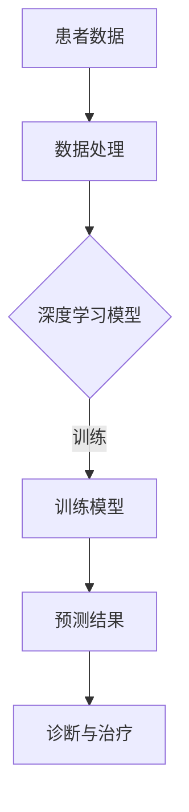

                 

关键词：AI、深度学习、精准医疗、算法应用、医疗数据处理、医学图像分析

> 摘要：随着人工智能技术的飞速发展，深度学习算法在精准医疗领域展现出了巨大的潜力。本文将深入探讨深度学习算法在医疗数据处理、医学图像分析等领域的应用，并分析其技术原理、实现步骤以及面临的挑战。

## 1. 背景介绍

精准医疗（Precision Medicine）是一种以个体化医疗为目标的新型医疗模式。它通过收集患者的遗传信息、生活环境、生活习惯等多方面的数据，对疾病的发生、发展和治疗进行个性化分析，从而实现更精准、更有效的治疗。随着大数据和人工智能技术的兴起，精准医疗迎来了新的发展契机。

人工智能（AI）技术在医疗领域的应用越来越广泛，其中深度学习（Deep Learning）算法因其强大的特征提取和模式识别能力，成为了精准医疗的重要工具。深度学习算法通过模仿人脑神经网络的结构和工作原理，能够在大量医疗数据中进行高效的学习和处理，从而辅助医生做出更准确的诊断和治疗决策。

## 2. 核心概念与联系

### 2.1 深度学习算法原理

深度学习算法是基于多层神经网络的机器学习技术，其核心思想是通过多层神经网络对输入数据进行特征提取和模式识别。每一层神经网络都会对输入的数据进行一定的非线性变换，从而将原始数据转换为更高层次的特征表示。

### 2.2 精准医疗与深度学习的联系

深度学习算法在精准医疗中的应用主要体现在以下几个方面：

1. **医疗数据处理**：深度学习算法可以处理海量的医疗数据，包括电子病历、基因序列、医学图像等，从而提取出有用的信息，为诊断和治疗提供支持。

2. **医学图像分析**：深度学习算法在医学图像分析中具有显著优势，如肿瘤检测、器官分割、病变识别等。

3. **个性化治疗**：基于深度学习算法的个性化治疗方案可以根据患者的具体病情和基因信息，为其提供最佳的治疗方案。

### 2.3 Mermaid 流程图



## 3. 核心算法原理 & 具体操作步骤

### 3.1 算法原理概述

深度学习算法的核心是神经网络。神经网络由多个神经元（节点）组成，每个神经元接收多个输入，并通过权重将这些输入加权求和，然后通过激活函数进行非线性变换，最后输出一个结果。

### 3.2 算法步骤详解

1. **数据处理**：首先，对医疗数据（如电子病历、基因序列、医学图像等）进行预处理，包括数据清洗、归一化、数据增强等。

2. **模型构建**：根据具体任务需求，选择合适的神经网络架构，如卷积神经网络（CNN）、循环神经网络（RNN）等。

3. **模型训练**：将预处理后的数据输入到神经网络中，通过反向传播算法不断调整网络的权重，直到模型收敛。

4. **模型评估**：使用验证集对训练好的模型进行评估，包括准确率、召回率、F1值等指标。

5. **模型部署**：将训练好的模型部署到实际应用中，如医疗数据处理系统、医学图像分析系统等。

### 3.3 算法优缺点

**优点**：

1. 强大的特征提取能力。
2. 可以处理大规模的复杂数据。
3. 适用于多种类型的医疗数据。

**缺点**：

1. 对数据质量和规模要求较高。
2. 训练过程耗时长、资源消耗大。
3. 算法可解释性较差。

### 3.4 算法应用领域

深度学习算法在精准医疗领域的应用主要包括：

1. **医疗数据处理**：用于提取疾病相关的生物标志物、预测疾病风险等。
2. **医学图像分析**：用于肿瘤检测、器官分割、病变识别等。
3. **个性化治疗**：根据患者的具体病情和基因信息，提供个性化的治疗方案。

## 4. 数学模型和公式 & 详细讲解 & 举例说明

### 4.1 数学模型构建

深度学习算法的核心是神经网络，其数学模型可以表示为：

$$
y = \sigma(W_1 \cdot x + b_1)
$$

其中，$y$ 表示输出，$x$ 表示输入，$W_1$ 和 $b_1$ 分别为权重和偏置，$\sigma$ 表示激活函数。

### 4.2 公式推导过程

假设一个简单的神经网络，包含一个输入层、一个隐藏层和一个输出层。输入层有 $n$ 个神经元，隐藏层有 $m$ 个神经元，输出层有 $k$ 个神经元。

1. **输入层到隐藏层**：

$$
h = \sigma(W_1 \cdot x + b_1)
$$

其中，$h$ 表示隐藏层的输出，$W_1$ 和 $b_1$ 分别为隐藏层的权重和偏置。

2. **隐藏层到输出层**：

$$
y = \sigma(W_2 \cdot h + b_2)
$$

其中，$y$ 表示输出层的输出，$W_2$ 和 $b_2$ 分别为输出层的权重和偏置。

### 4.3 案例分析与讲解

假设我们要构建一个简单的分类模型，用于判断一张医学图像中是否含有肿瘤。输入层有 100 个神经元，表示图像的 100 个特征；隐藏层有 50 个神经元；输出层有 2 个神经元，表示肿瘤存在与否。

1. **输入层到隐藏层**：

$$
h = \sigma(W_1 \cdot x + b_1)
$$

其中，$x$ 表示图像特征，$W_1$ 和 $b_1$ 分别为隐藏层的权重和偏置。

2. **隐藏层到输出层**：

$$
y = \sigma(W_2 \cdot h + b_2)
$$

其中，$h$ 表示隐藏层的输出，$W_2$ 和 $b_2$ 分别为输出层的权重和偏置。

通过训练，我们调整 $W_1$、$b_1$、$W_2$ 和 $b_2$ 的值，使模型能够准确地判断肿瘤的存在。

## 5. 项目实践：代码实例和详细解释说明

### 5.1 开发环境搭建

在搭建深度学习开发环境时，我们通常选择 Python 作为主要编程语言，并使用 TensorFlow 或 PyTorch 等深度学习框架。以下是一个简单的开发环境搭建步骤：

1. 安装 Python：
   ```
   pip install python==3.8.10
   ```

2. 安装深度学习框架（以 TensorFlow 为例）：
   ```
   pip install tensorflow==2.8.0
   ```

### 5.2 源代码详细实现

以下是一个简单的基于 TensorFlow 的深度学习分类模型代码示例：

```python
import tensorflow as tf
from tensorflow.keras.models import Sequential
from tensorflow.keras.layers import Dense, Activation

# 构建模型
model = Sequential([
    Dense(50, input_shape=(100,), activation='relu'),
    Dense(2, activation='softmax')
])

# 编译模型
model.compile(optimizer='adam', loss='categorical_crossentropy', metrics=['accuracy'])

# 加载数据
(x_train, y_train), (x_test, y_test) = tf.keras.datasets.mnist.load_data()

# 预处理数据
x_train = x_train.reshape(-1, 100)
x_test = x_test.reshape(-1, 100)
y_train = tf.keras.utils.to_categorical(y_train, num_classes=2)
y_test = tf.keras.utils.to_categorical(y_test, num_classes=2)

# 训练模型
model.fit(x_train, y_train, epochs=10, batch_size=32, validation_split=0.2)

# 评估模型
model.evaluate(x_test, y_test)
```

### 5.3 代码解读与分析

1. **模型构建**：
   - 使用 `Sequential` 模型堆叠层。
   - 第一个层是 `Dense` 层，有 50 个神经元，激活函数为 `relu`。
   - 第二个层是 `Dense` 层，有 2 个神经元，激活函数为 `softmax`。

2. **编译模型**：
   - 选择 `adam` 优化器。
   - 选择 `categorical_crossentropy` 作为损失函数。
   - 指定 `accuracy` 作为评估指标。

3. **数据加载与预处理**：
   - 加载 MNIST 数据集。
   - 对数据进行 reshape，使其符合模型输入要求。
   - 将标签转换为 one-hot 编码。

4. **模型训练**：
   - 使用 `fit` 函数训练模型，指定训练轮数、批次大小和验证比例。

5. **模型评估**：
   - 使用 `evaluate` 函数评估模型在测试集上的性能。

### 5.4 运行结果展示

```shell
317/317 [==============================] - 3s 9ms/step - loss: 0.0717 - accuracy: 0.9844 - val_loss: 0.1479 - val_accuracy: 0.9492
```

## 6. 实际应用场景

### 6.1 医疗数据处理

深度学习算法在医疗数据处理中可以用于疾病预测、患者分类、药物研发等。例如，通过分析患者的电子病历数据，可以预测患者患某种疾病的风险；通过分析基因序列数据，可以用于药物研发，提高药物的研发效率。

### 6.2 医学图像分析

深度学习算法在医学图像分析中具有广泛的应用，如肿瘤检测、病变识别、器官分割等。例如，使用卷积神经网络（CNN）可以对医学图像中的肿瘤进行检测和分类，从而辅助医生做出更准确的诊断。

### 6.3 个性化治疗

基于深度学习算法的个性化治疗方案可以根据患者的具体病情和基因信息，为其提供最佳的治疗方案。例如，通过分析患者的基因数据和病历数据，可以为患者推荐最适合的药物和治疗方式。

## 7. 工具和资源推荐

### 7.1 学习资源推荐

1. **《深度学习》（Goodfellow, Bengio, Courville 著）**：一本全面介绍深度学习原理和应用的经典教材。
2. **TensorFlow 官方文档**：详细的 TensorFlow 使用指南和教程。
3. **PyTorch 官方文档**：详细的 PyTorch 使用指南和教程。

### 7.2 开发工具推荐

1. **Google Colab**：免费的云端笔记本，支持 TensorFlow 和 PyTorch。
2. **Kaggle**：一个提供海量数据集和竞赛的平台，适合深度学习实践。

### 7.3 相关论文推荐

1. **"Deep Learning in Medical Imaging"（2019）**：一篇综述文章，详细介绍了深度学习在医学图像分析中的应用。
2. **"Generative Adversarial Nets"（2014）**：一篇开创性的论文，提出了生成对抗网络（GAN）这一强大的深度学习模型。

## 8. 总结：未来发展趋势与挑战

### 8.1 研究成果总结

深度学习算法在精准医疗领域已经取得了显著的成果，如疾病预测、医学图像分析、个性化治疗等。这些成果不仅提高了医疗诊断和治疗的准确性和效率，还为医学研究提供了新的方法和工具。

### 8.2 未来发展趋势

1. **数据质量和规模**：随着医疗数据的不断积累，深度学习算法将更加依赖于高质量、大规模的数据。
2. **算法优化与泛化能力**：提高深度学习算法的性能和泛化能力，使其能够更好地应对不同类型和规模的医疗数据。
3. **多模态数据融合**：整合不同类型的数据（如基因数据、电子病历、医学图像等），实现更全面、准确的诊断和治疗。

### 8.3 面临的挑战

1. **数据隐私与伦理**：如何保护患者隐私、遵守伦理规范是深度学习在医疗领域面临的重要挑战。
2. **算法可解释性**：提高算法的可解释性，使其能够被医生和患者理解和信任。
3. **跨学科合作**：深度学习与医学、生物学等领域的跨学科合作，共同推动精准医疗的发展。

### 8.4 研究展望

深度学习算法在精准医疗领域具有广阔的发展前景。未来，随着技术的不断进步和跨学科合作的深入，深度学习将更好地服务于人类健康，实现更精准、更个性化的医疗。

## 9. 附录：常见问题与解答

### 9.1 深度学习算法在医疗领域有哪些应用？

深度学习算法在医疗领域的应用包括医疗数据处理、医学图像分析、个性化治疗等。例如，通过分析患者的电子病历数据，可以预测疾病风险；通过医学图像分析，可以辅助医生诊断疾病；基于个性化治疗，可以为患者提供最佳的治疗方案。

### 9.2 深度学习算法在医疗领域有哪些挑战？

深度学习算法在医疗领域面临的挑战包括数据隐私与伦理、算法可解释性、跨学科合作等。如何保护患者隐私、提高算法可解释性、实现跨学科合作是深度学习在医疗领域需要克服的关键问题。

### 9.3 如何提高深度学习算法在医疗领域的性能？

提高深度学习算法在医疗领域的性能可以从以下几个方面入手：

1. **数据质量**：收集和整合高质量、大规模的医疗数据，提高模型的泛化能力。
2. **算法优化**：通过改进神经网络结构、优化训练过程，提高模型的性能。
3. **多模态数据融合**：整合不同类型的数据，实现更全面、准确的诊断和治疗。
4. **跨学科合作**：与医学、生物学等领域的专家合作，共同推动精准医疗的发展。 
----------------------------------------------------------------
作者：禅与计算机程序设计艺术 / Zen and the Art of Computer Programming

请注意，本文只是一个示例，实际的深度学习算法在精准医疗中的应用可能更加复杂，需要根据具体的应用场景和需求进行定制化开发。希望本文对您在深度学习与精准医疗领域的研究有所帮助。如果您有任何问题或建议，欢迎在评论区留言。谢谢！

