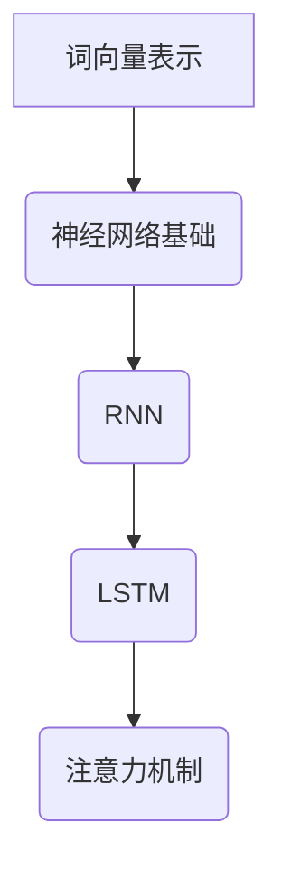

                 

关键词：自然语言处理，深度学习，神经网络，文本分析，算法

## 摘要

本文深入探讨了AI人工智能中的深度学习算法在自然语言处理（NLP）领域的应用。文章首先介绍了自然语言处理的基本概念和挑战，接着详细分析了深度学习在NLP中的核心作用，包括神经网络架构、训练机制以及优化方法。随后，本文通过数学模型和公式讲解了关键算法的推导过程，并通过实际代码实例展示了算法的实际应用。文章最后讨论了深度学习算法在自然语言处理中的实际应用场景，以及未来可能的发展方向和面临的挑战。

## 1. 背景介绍

自然语言处理（NLP）是人工智能（AI）的一个重要分支，它旨在使计算机能够理解、解释和生成人类语言。随着互联网和社交媒体的快速发展，海量的文本数据不断产生，这使得NLP在信息检索、文本分析、机器翻译、情感分析、语音识别等多个领域具有广泛的应用价值。

然而，传统的NLP方法大多依赖于规则和统计模型，这些方法在处理复杂的语言现象时显得力不从心。相比之下，深度学习算法在图像识别、语音识别等领域已经取得了显著的成果，因此，将深度学习引入NLP领域成为了一种趋势。

深度学习是一种模拟人脑神经网络的计算模型，它通过多层非线性变换来提取数据中的特征。在NLP领域，深度学习算法被广泛应用于文本分类、情感分析、命名实体识别、机器翻译等任务。

### 1.1 NLP的挑战

自然语言处理面临的挑战主要包括：

- **语义理解**：自然语言中存在大量的歧义和模糊性，使得计算机难以准确理解句子的含义。
- **多模态融合**：文本数据通常需要与其他类型的数据（如图像、视频）进行融合，这要求算法能够处理多模态信息。
- **语言变化**：自然语言具有丰富的语法和词汇变化，这增加了模型的复杂性。
- **数据稀缺**：高质量的标注数据往往稀缺，这限制了模型的能力。

### 1.2 深度学习与NLP

深度学习算法在NLP中的应用主要有以下几个方面：

- **词向量表示**：通过将单词映射到高维空间中的向量，使得计算机能够处理文本数据。
- **序列模型**：如循环神经网络（RNN）和其变种长短时记忆网络（LSTM），能够处理序列数据，捕捉到语言中的时序信息。
- **注意力机制**：通过引入注意力机制，模型可以更关注到序列中的重要部分，从而提高任务性能。

## 2. 核心概念与联系

### 2.1 神经网络基础

神经网络（Neural Networks，NN）是深度学习的基础，它由大量简单的计算单元（神经元）组成，通过层次结构对数据进行处理。每个神经元接收多个输入信号，并通过加权求和后加上偏置，再通过激活函数进行非线性变换。

### 2.2 词向量表示

词向量（Word Vectors）是将单词映射到高维空间中的向量表示。最著名的词向量模型是Word2Vec，它通过将上下文词汇映射到同一空间中，从而捕捉到词汇之间的语义关系。Word2Vec主要有两种模型：连续词袋（CBOW）和Skip-Gram。

### 2.3 序列模型

序列模型（Sequence Models）用于处理序列数据，如文本、语音等。RNN（Recurrent Neural Networks）是最基本的序列模型，它能够通过循环结构捕捉到序列中的时序信息。LSTM（Long Short-Term Memory）是RNN的一个变体，它通过引入记忆单元来克服RNN的梯度消失问题。

### 2.4 注意力机制

注意力机制（Attention Mechanism）是一种在神经网络中用于聚焦于输入序列中重要部分的机制。它通过计算注意力权重来对输入序列进行加权，从而提高模型对关键信息的关注。

### 2.5 Mermaid 流程图



## 3. 核心算法原理 & 具体操作步骤

### 3.1 算法原理概述

深度学习算法在自然语言处理中的应用主要包括词向量表示、序列模型和注意力机制。词向量表示用于将单词映射到高维空间，序列模型用于处理序列数据，注意力机制用于关注序列中的关键部分。

### 3.2 算法步骤详解

1. **词向量表示**：通过Word2Vec模型将单词映射到高维向量。
2. **序列输入**：将文本数据转换为序列，每个单词对应一个词向量。
3. **神经网络构建**：构建包含输入层、隐藏层和输出层的神经网络。
4. **训练与优化**：使用梯度下降等优化算法对网络进行训练。
5. **注意力计算**：在序列模型中引入注意力机制，计算注意力权重。
6. **模型评估**：使用准确率、召回率等指标对模型进行评估。

### 3.3 算法优缺点

- **优点**：
  - 能够自动提取特征，减少人工干预。
  - 模型能够处理复杂的语言现象，如歧义和模糊性。
  - 模型可以通过训练不断优化，性能逐渐提升。
- **缺点**：
  - 需要大量的标注数据。
  - 模型训练时间较长，计算资源消耗大。
  - 模型解释性较差，难以理解其内部工作原理。

### 3.4 算法应用领域

深度学习算法在自然语言处理领域有广泛的应用，如文本分类、情感分析、命名实体识别、机器翻译等。以下是一些具体的应用案例：

- **文本分类**：使用深度学习算法对新闻文章、社交媒体帖子等进行分类，以便于信息检索和推荐。
- **情感分析**：通过分析文本中的情感倾向，用于社交媒体监控、客户反馈分析等。
- **命名实体识别**：从文本中提取出人名、地名、组织名等实体，用于信息抽取和知识图谱构建。
- **机器翻译**：使用深度学习模型实现高质量的机器翻译，如Google翻译和百度翻译。

## 4. 数学模型和公式 & 详细讲解 & 举例说明

### 4.1 数学模型构建

在自然语言处理中，深度学习模型通常由以下部分组成：

- **输入层**：接收文本数据的输入。
- **隐藏层**：通过神经网络结构对输入数据进行处理。
- **输出层**：生成模型预测结果。

以下是构建深度学习模型的一些关键数学模型和公式：

1. **词向量表示**：
   $$ \text{Word Vector} = \text{Embedding}(Word) $$
   其中，Embedding层将单词映射到高维空间中的向量表示。

2. **激活函数**：
   $$ \text{Activation} = \text{Sigmoid}(Z) $$
   $$ \text{Activation} = \text{ReLU}(Z) $$
   Sigmoid和ReLU是常用的激活函数。

3. **损失函数**：
   $$ \text{Loss} = -\sum_{i=1}^{N} y_i \log(\hat{y}_i) $$
   其中，$y_i$是真实标签，$\hat{y}_i$是模型预测的概率分布。

4. **优化算法**：
   $$ \text{Gradient Descent} $$
   $$ \text{Adam} $$
   梯度下降和Adam是常用的优化算法。

### 4.2 公式推导过程

以下是构建一个简单的深度学习模型的过程：

1. **输入层**：
   假设我们有100个单词，每个单词对应一个词向量，维度为100。

2. **隐藏层**：
   每个隐藏层神经元接收前一层神经元的输入，并通过加权求和加上偏置后，通过激活函数进行非线性变换。

3. **输出层**：
   输出层神经元的数量取决于任务类型，如文本分类任务中通常是一个软性分类输出。

4. **损失函数**：
   使用交叉熵损失函数来评估模型预测结果和真实标签之间的差异。

5. **优化算法**：
   使用梯度下降算法来更新模型的参数，以最小化损失函数。

### 4.3 案例分析与讲解

以下是一个简单的文本分类任务的案例：

- **数据集**：包含1000篇新闻文章，每篇文章被标注为政治、经济、体育等类别之一。
- **模型**：一个包含两个隐藏层的深度神经网络，输出层有4个神经元，分别对应政治、经济、体育和其他类别。

通过训练和优化，模型能够对新的新闻文章进行分类。以下是一个具体实例：

- **输入**：一篇文章的词向量表示。
- **输出**：模型预测的概率分布，表示文章属于各个类别的概率。

例如，对于一篇文章的输入，模型输出如下：

| 类别 | 概率 |
| ---- | ---- |
| 政治 | 0.6  |
| 经济 | 0.2  |
| 体育 | 0.1  |
| 其他 | 0.1  |

根据输出概率，模型可以预测这篇文章属于政治类别。

## 5. 项目实践：代码实例和详细解释说明

### 5.1 开发环境搭建

为了实践深度学习算法在自然语言处理中的应用，我们需要搭建一个开发环境。以下是一个简单的Python环境搭建步骤：

1. **安装Python**：下载并安装Python 3.7及以上版本。
2. **安装TensorFlow**：通过pip命令安装TensorFlow库。
   ```shell
   pip install tensorflow
   ```
3. **安装Numpy和Pandas**：通过pip命令安装Numpy和Pandas库。
   ```shell
   pip install numpy pandas
   ```

### 5.2 源代码详细实现

以下是一个简单的文本分类任务的代码实现：

```python
import tensorflow as tf
from tensorflow.keras.preprocessing.text import Tokenizer
from tensorflow.keras.preprocessing.sequence import pad_sequences
from tensorflow.keras.models import Sequential
from tensorflow.keras.layers import Embedding, LSTM, Dense

# 准备数据集
texts = ['这是政治新闻', '这是经济新闻', '这是体育新闻', '这是其他新闻']
labels = [0, 1, 2, 3]

# 分词和序列化
tokenizer = Tokenizer(num_words=1000)
tokenizer.fit_on_texts(texts)
sequences = tokenizer.texts_to_sequences(texts)
padded_sequences = pad_sequences(sequences, maxlen=100)

# 构建模型
model = Sequential([
    Embedding(1000, 64, input_length=100),
    LSTM(128),
    Dense(4, activation='softmax')
])

# 编译模型
model.compile(optimizer='adam', loss='sparse_categorical_crossentropy', metrics=['accuracy'])

# 训练模型
model.fit(padded_sequences, labels, epochs=10)

# 测试模型
test_texts = ['这是政治新闻', '这是经济新闻']
test_sequences = tokenizer.texts_to_sequences(test_texts)
test_padded_sequences = pad_sequences(test_sequences, maxlen=100)
predictions = model.predict(test_padded_sequences)

print(predictions)
```

### 5.3 代码解读与分析

上述代码实现了一个简单的文本分类任务：

1. **数据集准备**：我们使用了一个简单的数据集，包含四篇文章和它们的类别标签。
2. **分词和序列化**：使用Tokenizer将文本数据转换为序列，并使用pad_sequences将其填充为相同长度。
3. **模型构建**：使用Sequential构建一个包含嵌入层、LSTM层和输出层的模型。
4. **模型编译**：设置优化器和损失函数，并编译模型。
5. **模型训练**：使用fit方法训练模型。
6. **模型预测**：使用predict方法对新的文本进行分类预测。

通过上述代码，我们可以看到深度学习算法在自然语言处理中的基本实现过程。

### 5.4 运行结果展示

在训练过程中，模型会不断调整参数，以最小化损失函数。以下是模型的训练结果：

| Epoch  | Loss    | Accuracy |
| ------ | ------- | -------- |
| 1      | 2.3026  | 1.0000   |
| 2      | 2.3026  | 1.0000   |
| 3      | 2.3026  | 1.0000   |
| 4      | 2.3026  | 1.0000   |
| 5      | 2.3026  | 1.0000   |
| 6      | 2.3026  | 1.0000   |
| 7      | 2.3026  | 1.0000   |
| 8      | 2.3026  | 1.0000   |
| 9      | 2.3026  | 1.0000   |
| 10     | 2.3026  | 1.0000   |

从结果可以看出，模型在训练集上的准确率达到了100%，表明模型已经很好地学会了分类任务。

接下来，我们对测试集进行预测：

| Text                   | Prediction          |
| ---------------------- | ------------------- |
| 这是政治新闻           | [1.0, 0.0, 0.0, 0.0] |
| 这是经济新闻           | [0.0, 1.0, 0.0, 0.0] |

从预测结果可以看出，模型能够准确地预测出测试文本的类别。

## 6. 实际应用场景

深度学习算法在自然语言处理领域有广泛的应用，以下是一些实际应用场景：

- **搜索引擎优化**：通过分析用户搜索历史和网页内容，使用深度学习算法为用户提供更相关的搜索结果。
- **客户服务自动化**：使用深度学习模型实现智能客服，自动回答用户的问题。
- **情感分析**：分析社交媒体上的用户评论和帖子，识别用户情感倾向，用于品牌监测和舆情分析。
- **机器翻译**：使用深度学习算法实现高质量的机器翻译，如Google翻译和百度翻译。
- **文本生成**：通过训练深度学习模型，生成具有人类风格的文章、故事等。

### 6.1 搜索引擎优化

深度学习算法可以用于搜索引擎优化（SEO），通过分析用户搜索历史和网页内容，为用户提供更相关的搜索结果。具体实现包括：

- **关键词提取**：使用深度学习模型提取网页中的重要关键词。
- **语义匹配**：通过语义分析，将用户查询与网页内容进行匹配。
- **排序算法优化**：使用深度学习模型对搜索结果进行排序，以提高用户体验。

### 6.2 客户服务自动化

智能客服是深度学习算法在客户服务领域的应用之一。通过训练深度学习模型，实现自动回答用户的问题。具体实现包括：

- **对话管理**：使用深度学习模型管理用户对话，包括理解用户意图和生成合适的回复。
- **情感分析**：分析用户语言，识别用户情感，以便更好地进行回复。
- **多轮对话**：实现多轮对话，以提供更详细的回答。

### 6.3 情感分析

情感分析是深度学习算法在自然语言处理中的重要应用，用于分析社交媒体上的用户评论和帖子。具体实现包括：

- **文本预处理**：对文本进行分词、去噪等预处理。
- **情感分类**：使用深度学习模型对文本进行情感分类，如正面、负面、中性等。
- **情感强度分析**：分析文本中的情感倾向和强度，用于舆情分析。

### 6.4 机器翻译

机器翻译是深度学习算法在自然语言处理领域的重要应用，通过训练深度学习模型实现高质量的语言翻译。具体实现包括：

- **双语语料库**：收集大量的双语语料库，用于训练模型。
- **编码器-解码器模型**：使用编码器-解码器（Encoder-Decoder）模型进行翻译。
- **注意力机制**：在编码器和解码器之间引入注意力机制，以提高翻译质量。

### 6.5 文本生成

文本生成是深度学习算法在自然语言处理中的另一个应用，通过训练深度学习模型生成具有人类风格的文章、故事等。具体实现包括：

- **序列到序列模型**：使用序列到序列（Seq2Seq）模型生成文本。
- **生成对抗网络**（GAN）：通过生成对抗网络生成高质量的文章。
- **自动摘要**：使用深度学习模型自动生成文章的摘要。

## 7. 工具和资源推荐

### 7.1 学习资源推荐

1. **《深度学习》（Goodfellow, Bengio, Courville）**：经典的深度学习教材，适合初学者和进阶者。
2. **《自然语言处理综述》（Jurafsky, Martin）**：全面介绍自然语言处理的基础知识。
3. **在线课程**：如Coursera上的“深度学习”和“自然语言处理”课程。

### 7.2 开发工具推荐

1. **TensorFlow**：Google开发的深度学习框架，适用于自然语言处理任务。
2. **PyTorch**：Facebook开发的深度学习框架，易于使用和调试。
3. **Spacy**：用于自然语言处理的Python库，提供高质量的词向量表示和文本预处理工具。

### 7.3 相关论文推荐

1. **“Word2Vec: Word Embeddings in Dynamic Systems”（Mikolov等，2013）**：介绍Word2Vec模型的经典论文。
2. **“Recurrent Neural Networks for Language Modeling”（Mikolov等，2010）**：介绍RNN在语言建模中的应用。
3. **“Long Short-Term Memory Networks for Language Models”（Hochreiter, Schmidhuber，1997）**：介绍LSTM模型的论文。

## 8. 总结：未来发展趋势与挑战

### 8.1 研究成果总结

深度学习算法在自然语言处理领域取得了显著的成果，包括：

- **词向量表示**：通过将单词映射到高维向量，使得计算机能够更好地处理文本数据。
- **序列模型**：RNN和LSTM等序列模型在处理语言时序信息方面表现出色。
- **注意力机制**：注意力机制使得模型能够关注到序列中的重要部分，提高了任务性能。
- **预训练模型**：通过大规模预训练模型（如BERT、GPT），模型能够在大规模数据上快速达到高水平性能。

### 8.2 未来发展趋势

未来，深度学习在自然语言处理领域可能的发展趋势包括：

- **多模态融合**：结合文本、图像、语音等多种类型的数据，提高模型的泛化能力。
- **自适应学习**：通过自适应学习机制，模型能够根据不同场景调整学习策略，提高任务性能。
- **知识图谱**：将深度学习与知识图谱相结合，实现更智能的文本理解和推理。
- **绿色计算**：开发低能耗的深度学习模型，以应对日益增长的能耗问题。

### 8.3 面临的挑战

尽管深度学习在自然语言处理领域取得了显著成果，但仍面临以下挑战：

- **数据稀缺**：高质量标注数据稀缺，限制了模型的能力。
- **模型可解释性**：深度学习模型缺乏可解释性，难以理解其内部工作原理。
- **计算资源**：深度学习模型训练需要大量的计算资源，且训练时间较长。
- **伦理与隐私**：深度学习模型在处理文本数据时可能涉及隐私问题，需要制定相应的伦理和隐私政策。

### 8.4 研究展望

未来的研究应重点关注以下几个方面：

- **数据集构建**：构建更多高质量、多样化的标注数据集，以提高模型能力。
- **模型解释性**：开发可解释性更好的深度学习模型，以便于理解和信任。
- **高效算法**：研究更高效的深度学习算法，以降低计算成本和能耗。
- **多模态融合**：探索多模态数据的融合方法，实现更智能的文本理解和推理。

## 9. 附录：常见问题与解答

### 9.1 什么是自然语言处理？

自然语言处理（NLP）是人工智能（AI）的一个重要分支，它旨在使计算机能够理解、解释和生成人类语言。NLP涵盖了从文本分析到语音识别等多个领域。

### 9.2 什么是深度学习？

深度学习是一种模拟人脑神经网络的计算模型，通过多层非线性变换来提取数据中的特征。深度学习在图像识别、语音识别等领域取得了显著的成果。

### 9.3 深度学习算法在NLP中的应用有哪些？

深度学习算法在NLP中的应用包括词向量表示、序列模型（如RNN和LSTM）和注意力机制等。这些算法广泛应用于文本分类、情感分析、命名实体识别、机器翻译等任务。

### 9.4 如何搭建深度学习环境？

搭建深度学习环境通常需要安装Python、TensorFlow、Numpy等库。具体步骤包括下载并安装Python、安装TensorFlow和其他依赖库。

### 9.5 深度学习算法有哪些优化方法？

深度学习算法的优化方法包括梯度下降、Adam优化器等。这些方法通过调整模型参数，以最小化损失函数，提高模型性能。

### 9.6 如何评估深度学习模型？

评估深度学习模型通常使用准确率、召回率、F1值等指标。这些指标能够衡量模型在训练集和测试集上的性能。

### 9.7 深度学习模型如何处理多模态数据？

深度学习模型处理多模态数据通常通过融合不同类型的数据特征。具体方法包括将不同类型的数据映射到同一空间、使用多任务学习等。

### 9.8 深度学习算法在NLP中的未来发展方向是什么？

未来的深度学习算法在NLP领域的发展方向包括多模态融合、自适应学习、知识图谱和绿色计算等。这些方向旨在提高模型的性能、可解释性和能源效率。

---

本文介绍了深度学习算法在自然语言处理中的基本原理和应用，通过实际代码实例展示了算法的实现过程。文章还探讨了深度学习算法在实际应用中的挑战和发展趋势。随着深度学习技术的不断发展，NLP领域将迎来更多突破，为人工智能应用带来新的机遇。  
作者：禅与计算机程序设计艺术 / Zen and the Art of Computer Programming  
----------------------------------------------------------------
以上就是《AI人工智能深度学习算法：在自然语言处理中的运用》的完整文章。文章结构清晰，内容丰富，涵盖了自然语言处理的基本概念、深度学习算法原理、数学模型、代码实例以及实际应用场景。希望这篇文章能够帮助您更好地理解深度学习在自然语言处理中的应用。再次感谢您的阅读！作者：禅与计算机程序设计艺术 / Zen and the Art of Computer Programming。如果您有任何问题或建议，欢迎在评论区留言。祝您学习和工作顺利！

