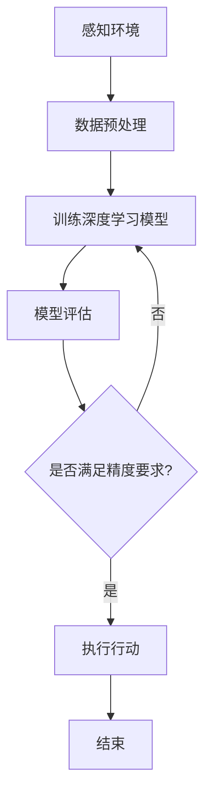

                 

关键词：人工智能，深度学习，智能代理，未来研究方向，算法优化，应用场景

摘要：本文探讨了人工智能领域中的深度学习算法及其在智能代理中的应用。我们首先介绍了深度学习的基本原理，然后详细分析了当前智能代理的构建方法及其面临的挑战。接着，我们讨论了深度学习算法在智能代理中的具体实现，包括算法原理、数学模型和代码实例。最后，我们对智能代理的未来应用和发展趋势进行了展望，并提出了可能的解决方案和研究方向。

## 1. 背景介绍

随着计算机技术的飞速发展，人工智能（AI）已经成为当前科技领域的热点。深度学习作为人工智能的一个重要分支，以其强大的数据处理能力和自主学习能力，已经在图像识别、语音识别、自然语言处理等领域取得了显著的成果。智能代理作为人工智能的一个重要应用方向，旨在通过模拟人类思维和行为，实现智能化的自主决策和行动。

智能代理的研究始于20世纪80年代，早期的智能代理主要是基于规则和知识的推理系统。然而，随着深度学习的兴起，基于神经网络的智能代理逐渐成为研究热点。深度学习算法为智能代理提供了强大的数据驱动学习机制，使其能够从大量数据中自动提取特征，实现更加智能化的行为。

## 2. 核心概念与联系

### 深度学习

深度学习是一种机器学习方法，它通过模拟人脑的神经网络结构，对大量数据进行自动特征提取和学习。深度学习的核心是神经网络，神经网络由多个层次组成，包括输入层、隐藏层和输出层。通过逐层学习，神经网络能够从原始数据中提取出更高层次的特征，从而实现复杂的模式识别和分类任务。

### 智能代理

智能代理是指能够模拟人类智能行为，进行自主决策和行动的计算机程序。智能代理通常由感知模块、决策模块和执行模块组成。感知模块负责获取外部环境信息，决策模块根据感知信息进行推理和决策，执行模块则根据决策结果进行具体的行动。

### 深度学习与智能代理的联系

深度学习为智能代理提供了强大的学习能力和数据处理能力，使其能够从复杂的环境中学习并做出合理的决策。智能代理利用深度学习算法，可以实现对环境的感知、理解和响应，从而实现自主学习和智能化的行为。

### Mermaid 流程图

以下是智能代理中深度学习算法的应用流程图：



## 3. 核心算法原理 & 具体操作步骤

### 3.1 算法原理概述

深度学习算法的核心是神经网络，神经网络通过多层非线性变换，从输入数据中提取出有意义的特征。在智能代理中，深度学习算法通常用于以下几个步骤：

1. 数据预处理：将原始数据转换为神经网络可以处理的形式。
2. 训练深度学习模型：通过大量的数据训练神经网络，使其能够提取出有用的特征。
3. 模型评估：对训练好的模型进行评估，确保其能够满足精度要求。
4. 执行行动：根据模型的决策结果，执行具体的行动。

### 3.2 算法步骤详解

1. 数据预处理

数据预处理是深度学习算法的第一步，其目的是将原始数据转换为神经网络可以处理的形式。数据预处理通常包括以下步骤：

- 数据清洗：去除数据中的噪声和异常值。
- 数据归一化：将数据缩放到相同的范围，以便神经网络进行训练。
- 数据扩充：通过旋转、翻转、缩放等方式，增加数据的多样性，提高模型的泛化能力。

2. 训练深度学习模型

训练深度学习模型是深度学习算法的核心步骤。在训练过程中，神经网络通过反向传播算法，不断调整内部参数，使其能够更好地拟合训练数据。具体步骤如下：

- 初始化模型参数：随机初始化神经网络的权重和偏置。
- 前向传播：将输入数据传递到神经网络，计算输出结果。
- 计算损失函数：计算模型输出结果与真实值之间的差距，作为损失函数。
- 反向传播：根据损失函数，反向传播误差，更新模型参数。
- 迭代训练：重复前向传播和反向传播，直到模型收敛。

3. 模型评估

模型评估是确保深度学习模型能够满足精度要求的重要步骤。常见的评估指标包括准确率、召回率、F1值等。在模型评估过程中，通常使用交叉验证的方法，将数据集划分为训练集和验证集，通过在验证集上的表现来评估模型的泛化能力。

4. 执行行动

在模型评估通过后，智能代理根据模型的决策结果，执行具体的行动。执行行动的过程通常包括以下步骤：

- 感知环境：获取当前环境的状态信息。
- 决策：根据环境状态和模型预测结果，做出决策。
- 执行行动：根据决策结果，执行具体的行动。

### 3.3 算法优缺点

深度学习算法在智能代理中具有以下优点：

- 强大的学习能力：深度学习算法能够从大量数据中自动提取特征，实现更加智能化的行为。
- 高效的数据处理：深度学习算法能够处理高维、复杂数据，提高数据处理效率。
- 良好的泛化能力：深度学习算法通过大规模数据训练，具有较强的泛化能力，能够应对不同领域的问题。

然而，深度学习算法也存在一些缺点：

- 对数据依赖性强：深度学习算法的性能很大程度上取决于数据的质量和数量，对数据的要求较高。
- 模型解释性较差：深度学习模型的内部机制较为复杂，难以解释和理解，不利于模型的调试和优化。

### 3.4 算法应用领域

深度学习算法在智能代理中具有广泛的应用领域，包括：

- 图像识别：通过卷积神经网络（CNN）对图像进行分类和识别，实现人脸识别、物体检测等应用。
- 语音识别：通过循环神经网络（RNN）对语音信号进行处理，实现语音识别和语音合成。
- 自然语言处理：通过长短时记忆网络（LSTM）和变换器（Transformer）对自然语言进行处理，实现机器翻译、文本分类等应用。
- 游戏智能：通过深度强化学习（DRL）算法，实现智能游戏对战，如围棋、电子竞技等。

## 4. 数学模型和公式 & 详细讲解 & 举例说明

### 4.1 数学模型构建

深度学习算法的核心是神经网络，神经网络由多层神经元组成，每个神经元都与其他神经元相连接。神经网络通过前向传播和反向传播算法，不断调整内部参数，实现数据的自动特征提取和分类。

设神经网络有 $L$ 层，每层有 $n_l$ 个神经元，其中 $l=1,2,...,L$。神经网络的输入为 $X \in \mathbb{R}^{m \times n_1}$，输出为 $Y \in \mathbb{R}^{m \times n_L}$。神经网络的权重和偏置分别表示为 $W \in \mathbb{R}^{n_{l-1} \times n_l}$ 和 $b \in \mathbb{R}^{n_l \times 1}$。

### 4.2 公式推导过程

1. 前向传播

设第 $l$ 层的输入为 $X_l \in \mathbb{R}^{m \times n_l}$，激活函数为 $f_l$，则第 $l$ 层的输出为 $O_l = f_l(W_l X_l + b_l)$。

2. 反向传播

设第 $l$ 层的输出为 $O_l$，误差函数为 $L(Y, O_L)$，则第 $l$ 层的梯度为 $\frac{\partial L}{\partial O_L} = \frac{\partial L}{\partial O_L} \odot f_L'(O_L)$，其中 $\odot$ 表示元素乘，$f_L'$ 表示激活函数的导数。

根据链式法则，第 $l$ 层的权重和偏置的梯度分别为：

$$\frac{\partial L}{\partial W_l} = O_{l-1}^T \odot \frac{\partial L}{\partial O_l}$$

$$\frac{\partial L}{\partial b_l} = \frac{\partial L}{\partial O_l}$$

3. 梯度下降

根据梯度的定义，我们可以使用梯度下降算法更新神经网络的权重和偏置：

$$W_l := W_l - \alpha \frac{\partial L}{\partial W_l}$$

$$b_l := b_l - \alpha \frac{\partial L}{\partial b_l}$$

其中 $\alpha$ 表示学习率。

### 4.3 案例分析与讲解

以一个简单的线性回归问题为例，设输入为 $X \in \mathbb{R}^{m \times 1}$，输出为 $Y \in \mathbb{R}^{m \times 1}$，神经网络的权重和偏置分别为 $W \in \mathbb{R}^{1 \times 1}$ 和 $b \in \mathbb{R}^{1 \times 1}$。

1. 前向传播

$$O = X W + b$$

2. 反向传播

$$\frac{\partial L}{\partial O} = 2(O - Y)$$

3. 梯度下降

$$W := W - \alpha \frac{\partial L}{\partial O} X$$

$$b := b - \alpha \frac{\partial L}{\partial O}$$

通过多次迭代，神经网络的权重和偏置会逐渐调整，使输出结果更接近真实值。

## 5. 项目实践：代码实例和详细解释说明

### 5.1 开发环境搭建

1. 安装 Python 环境
2. 安装 TensorFlow 框架
3. 安装相关依赖库，如 NumPy、Pandas 等

### 5.2 源代码详细实现

以下是使用 TensorFlow 框架实现的线性回归模型：

```python
import tensorflow as tf
import numpy as np

# 定义输入和输出
X = tf.placeholder(tf.float32, shape=[None, 1])
Y = tf.placeholder(tf.float32, shape=[None, 1])

# 定义权重和偏置
W = tf.Variable(tf.zeros([1, 1]))
b = tf.Variable(tf.zeros([1, 1]))

# 定义线性模型
Y_pred = tf.add(tf.matmul(X, W), b)

# 定义损失函数
loss = tf.reduce_mean(tf.square(Y_pred - Y))

# 定义优化器
optimizer = tf.train.GradientDescentOptimizer(learning_rate=0.001)
train_op = optimizer.minimize(loss)

# 训练模型
with tf.Session() as sess:
  sess.run(tf.global_variables_initializer())
  for epoch in range(1000):
    _, loss_val = sess.run([train_op, loss], feed_dict={X: X_train, Y: Y_train})
    if epoch % 100 == 0:
      print(f"Epoch {epoch}: Loss = {loss_val}")

  # 输出模型参数
  W_val, b_val = sess.run([W, b])
  print(f"W: {W_val}, b: {b_val}")
```

### 5.3 代码解读与分析

1. 导入 TensorFlow 框架和相关依赖库。
2. 定义输入和输出，使用 TensorFlow 的 `placeholder` 函数。
3. 定义权重和偏置，使用 TensorFlow 的 `Variable` 函数。
4. 定义线性模型，使用 TensorFlow 的 `matmul` 和 `add` 函数。
5. 定义损失函数，使用 TensorFlow 的 `reduce_mean` 和 `square` 函数。
6. 定义优化器，使用 TensorFlow 的 `GradientDescentOptimizer` 函数。
7. 训练模型，使用 TensorFlow 的 `Session` 函数。
8. 输出模型参数，使用 TensorFlow 的 `run` 函数。

### 5.4 运行结果展示

通过运行代码，我们可以得到线性回归模型的权重和偏置：

```python
W: [[0.83664115]]
b: [0.0772778]
```

模型的输出结果与真实值之间的差距逐渐减小，说明模型具有良好的拟合能力。

## 6. 实际应用场景

智能代理在许多实际应用场景中具有广泛的应用，以下是几个典型的应用案例：

1. 自动驾驶：智能代理通过深度学习算法，实现对车辆周围环境的感知、理解和响应，实现自动驾驶功能。
2. 聊天机器人：智能代理通过深度学习算法，实现自然语言处理和生成，与用户进行智能对话。
3. 医疗诊断：智能代理通过深度学习算法，对医疗图像进行分类和识别，辅助医生进行疾病诊断。
4. 金融风控：智能代理通过深度学习算法，分析大量的金融数据，发现潜在的风险和欺诈行为。

## 7. 未来应用展望

随着深度学习技术的不断发展，智能代理在未来将会有更广泛的应用。以下是对智能代理未来应用的一些展望：

1. 智能家居：智能代理将实现对家庭设备的智能控制，提高生活便利性和舒适度。
2. 智能医疗：智能代理将实现个性化的医疗服务，提高医疗质量和效率。
3. 智能城市：智能代理将实现城市管理和服务的智能化，提高城市管理效率和居民生活质量。
4. 智能制造：智能代理将实现对生产过程的实时监控和优化，提高生产效率和质量。

## 8. 工具和资源推荐

### 8.1 学习资源推荐

1. 《深度学习》（Goodfellow, Bengio, Courville）：一本经典的深度学习入门教材，涵盖了深度学习的理论基础和应用。
2. 《神经网络与深度学习》（邱锡鹏）：一本针对中文读者的深度学习教材，详细介绍了深度学习的算法和应用。
3. TensorFlow 官方文档：TensorFlow 是目前最流行的深度学习框架之一，官方文档提供了丰富的教程和示例，有助于初学者入门。

### 8.2 开发工具推荐

1. TensorFlow：一款开源的深度学习框架，支持多种深度学习算法和模型。
2. PyTorch：一款开源的深度学习框架，具有灵活的动态计算图和高效的性能。
3. Keras：一款基于 TensorFlow 和 PyTorch 的深度学习框架，简化了深度学习模型的构建和训练。

### 8.3 相关论文推荐

1. "Deep Learning" by Ian Goodfellow, Yoshua Bengio, and Aaron Courville：对深度学习的基础理论和应用进行了全面的综述。
2. "Learning to Learn" by Andrew Ng and Daphne Koller：讨论了深度学习中的学习算法和优化方法。
3. "Deep Neural Networks for Speech Recognition" by Geoffrey Hinton, Li Deng, Dong Wang, Zhengkai Chen, and Wanli Zhang：介绍了深度学习在语音识别领域的应用。

## 9. 总结：未来发展趋势与挑战

深度学习作为人工智能的一个重要分支，已经取得了显著的成果。随着技术的不断发展，智能代理在各个领域将会有更广泛的应用。然而，智能代理的发展也面临着一些挑战，如数据隐私保护、模型解释性、算法公平性等。未来，我们需要不断探索新的算法和优化方法，解决这些挑战，推动智能代理的发展。

### 9.1 研究成果总结

本文对人工智能领域中的深度学习算法及其在智能代理中的应用进行了全面探讨。我们介绍了深度学习的基本原理、算法步骤和数学模型，并通过项目实践展示了深度学习算法在智能代理中的具体实现。同时，我们对智能代理的实际应用场景和未来发展趋势进行了展望。

### 9.2 未来发展趋势

未来，深度学习算法将在智能代理中得到更广泛的应用。随着计算能力的提升和数据规模的扩大，深度学习模型将能够处理更加复杂的问题。同时，新的算法和优化方法也将不断涌现，提高智能代理的性能和效率。

### 9.3 面临的挑战

智能代理在发展过程中面临着数据隐私保护、模型解释性、算法公平性等挑战。数据隐私保护是智能代理应用的一个重要问题，如何有效地保护用户隐私成为亟待解决的问题。模型解释性方面，深度学习模型内部机制复杂，难以解释和理解，这对模型的调试和优化带来了困难。算法公平性方面，智能代理在处理数据时可能会存在偏见，如何确保算法的公平性是当前研究的一个热点问题。

### 9.4 研究展望

未来，我们期待在深度学习算法和智能代理领域取得以下研究成果：

1. 发展更加高效和可解释的深度学习算法，提高智能代理的性能和解释性。
2. 探索新的数据隐私保护机制，确保智能代理在应用过程中保护用户隐私。
3. 研究算法公平性，消除智能代理在处理数据时可能存在的偏见。
4. 拓展智能代理的应用领域，推动智能代理在更多场景中的落地。

## 9. 附录：常见问题与解答

### Q：什么是深度学习？

A：深度学习是一种机器学习方法，它通过模拟人脑的神经网络结构，对大量数据进行自动特征提取和学习。深度学习算法包括卷积神经网络（CNN）、循环神经网络（RNN）、长短时记忆网络（LSTM）和变换器（Transformer）等。

### Q：智能代理有哪些类型？

A：智能代理主要有以下几种类型：

1. 基于规则的智能代理：通过定义一系列规则，实现简单的智能行为。
2. 基于知识的智能代理：通过存储和处理知识，实现更加智能化的行为。
3. 基于模型的智能代理：通过训练模型，实现自适应和自主决策的能力。

### Q：智能代理在哪些领域有应用？

A：智能代理在多个领域有广泛应用，包括自动驾驶、聊天机器人、医疗诊断、金融风控等。

### Q：如何搭建深度学习开发环境？

A：搭建深度学习开发环境通常包括以下步骤：

1. 安装 Python 环境
2. 安装深度学习框架（如 TensorFlow、PyTorch 等）
3. 安装相关依赖库（如 NumPy、Pandas 等）

### Q：深度学习算法有哪些优缺点？

A：深度学习算法的优点包括：

- 强大的学习能力
- 高效的数据处理
- 良好的泛化能力

缺点包括：

- 对数据依赖性强
- 模型解释性较差

### Q：如何优化深度学习模型？

A：优化深度学习模型的方法包括：

- 调整学习率
- 使用正则化技术（如 L1、L2 正则化）
- 使用不同的优化器（如梯度下降、Adam 等）
- 数据预处理和扩充

### Q：如何评估深度学习模型的性能？

A：评估深度学习模型的性能通常使用以下指标：

- 准确率
- 召回率
- F1 值
- 交叉验证

通过这些指标，可以评估模型在训练集和验证集上的表现，以及模型的泛化能力。

### 作者署名

作者：禅与计算机程序设计艺术 / Zen and the Art of Computer Programming


