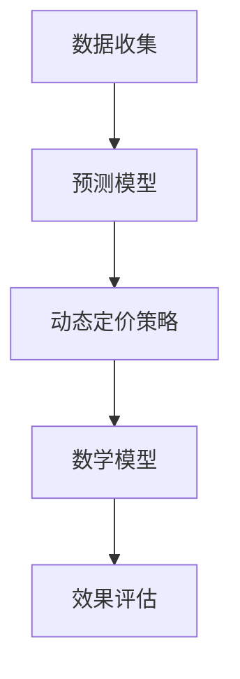

                 

关键词：人工智能、价格优化、动态定价、预测模型、应用案例

> 摘要：本文探讨了人工智能在价格优化领域的应用，以一个实际案例为基础，详细分析了AI价格优化系统的构建、核心算法原理、数学模型及其在不同行业中的应用和未来展望。

## 1. 背景介绍

在市场经济中，价格策略对于企业的盈利能力和市场竞争力至关重要。随着人工智能技术的飞速发展，利用机器学习算法对价格进行优化已经成为现代企业提升业绩的有效手段。AI价格优化系统能够通过分析大量市场数据，预测价格变化趋势，并为企业提供动态定价策略。

近年来，电子商务、零售、航空、酒店等行业都在积极探索和应用AI价格优化技术，以实现个性化定价、提升客户满意度、优化库存管理以及增加利润。本文将通过对一个电商平台的实际案例研究，深入探讨AI价格优化系统的应用和实现。

### 1.1 案例背景

某大型电商平台是一家提供多样化商品零售的在线平台，其业务涵盖了服装、家居、电子产品等多个领域。为了在激烈的市场竞争中脱颖而出，该平台决定引入AI价格优化系统，以提高价格策略的科学性和灵活性。

### 1.2 案例目标

该平台希望通过AI价格优化系统实现以下目标：

1. **提升利润率**：通过优化价格策略，增加销售收入，提高利润率。
2. **提升客户满意度**：根据用户行为和偏好，提供个性化的价格方案，增强客户粘性。
3. **优化库存管理**：根据销售预测，调整库存水平，减少库存积压。
4. **提升市场竞争力**：通过动态定价，适应市场变化，提高产品竞争力。

## 2. 核心概念与联系

为了构建一个有效的AI价格优化系统，我们需要理解以下几个核心概念：

### 2.1 数据收集

AI价格优化系统的第一步是收集大量的市场数据，包括历史销售数据、竞争对手价格、消费者行为数据等。这些数据将用于训练预测模型和制定优化策略。

### 2.2 预测模型

预测模型是AI价格优化系统的核心，它通过分析历史数据和当前市场趋势，预测未来的价格变化。常见的预测模型包括时间序列分析、回归分析、神经网络等。

### 2.3 动态定价策略

动态定价策略是AI价格优化系统的实现方式，它根据预测模型的结果和实时市场数据，自动调整产品价格。动态定价策略可以是基于需求的、基于竞争的或者基于成本的。

### 2.4 数学模型

数学模型用于量化价格优化策略的效果，包括价格弹性模型、利润最大化模型等。这些模型可以帮助企业确定最优价格，以达到最大化利润或其他目标。

下面是一个使用Mermaid绘制的流程图，展示了AI价格优化系统的核心概念和联系：



## 3. 核心算法原理 & 具体操作步骤

### 3.1 算法原理概述

AI价格优化系统的核心算法是预测模型和动态定价策略。预测模型通过分析历史数据和当前市场环境，预测未来价格的变化趋势。动态定价策略则根据预测结果和实时数据，调整产品价格。

### 3.2 算法步骤详解

1. **数据收集与预处理**：
   - 收集历史销售数据、竞争对手价格、消费者行为数据等。
   - 对数据进行清洗、归一化等预处理操作。

2. **构建预测模型**：
   - 选择合适的预测模型，如时间序列分析、回归分析、神经网络等。
   - 使用历史数据进行模型训练，评估模型性能。

3. **预测未来价格**：
   - 使用训练好的预测模型，预测未来的价格变化趋势。

4. **制定动态定价策略**：
   - 根据预测结果和实时市场数据，制定动态定价策略。
   - 确定价格调整的时间点和幅度。

5. **执行定价策略**：
   - 自动调整产品价格，根据定价策略执行。

6. **效果评估与调整**：
   - 监测定价策略的效果，包括利润、销量、客户满意度等。
   - 根据效果调整定价策略。

### 3.3 算法优缺点

#### 优点：

- **提升利润**：通过预测市场趋势和消费者行为，优化价格策略，提升利润。
- **提升客户满意度**：提供个性化定价方案，提高客户满意度。
- **减少库存积压**：根据销售预测，优化库存管理，减少库存积压。

#### 缺点：

- **数据依赖性**：预测模型的准确性依赖于数据的多样性和质量。
- **算法复杂性**：构建和维护AI价格优化系统需要较高技术门槛。

### 3.4 算法应用领域

AI价格优化系统广泛应用于电子商务、零售、航空、酒店等行业。以下是一些典型应用领域：

- **电子商务**：电商平台通过AI价格优化，实现个性化定价，提升销售量和利润。
- **零售**：零售企业通过动态定价策略，调整商品价格，提升市场竞争力。
- **航空**：航空公司通过AI价格优化，实现机票价格动态调整，提升营收。
- **酒店**：酒店行业利用AI价格优化，实现房间价格的灵活调整，提高入住率。

## 4. 数学模型和公式 & 详细讲解 & 举例说明

### 4.1 数学模型构建

AI价格优化系统的数学模型主要包括预测模型和动态定价策略。以下是一个简单的价格弹性模型，用于预测价格变化对销量的影响：

$$
\Delta Q = \epsilon \cdot \Delta P
$$

其中，$\Delta Q$ 表示销量的变化量，$\Delta P$ 表示价格的变化量，$\epsilon$ 表示价格弹性系数。

### 4.2 公式推导过程

价格弹性系数 $\epsilon$ 可以通过以下公式计算：

$$
\epsilon = \frac{dQ/dP}{Q/P}
$$

其中，$dQ/dP$ 表示价格变动对销量的边际效应，$Q/P$ 表示平均需求量。

### 4.3 案例分析与讲解

假设某电商平台在一段时间内收集了以下数据：

- 初始价格 $P_0 = 100$ 元
- 最终价格 $P_1 = 90$ 元
- 销售量 $Q_0 = 100$ 件
- 销售量 $Q_1 = 120$ 件

根据以上数据，我们可以计算出价格弹性系数：

$$
\epsilon = \frac{dQ/dP}{Q/P} = \frac{120 - 100}{90 - 100} / (120 / 100) = 2
$$

这意味着价格每下降1%，销量将增加2%。

假设价格进一步下降到 $P_2 = 80$ 元，我们可以预测销量变化：

$$
\Delta Q = \epsilon \cdot \Delta P = 2 \cdot (80 - 90) = -20
$$

这意味着价格下降10%，销量将增加20%。

通过这个简单的案例，我们可以看到价格弹性模型在预测价格变化对销量影响方面的有效性。在实际应用中，企业可以利用这种模型，根据市场需求和价格弹性，制定更为科学的定价策略。

## 5. 项目实践：代码实例和详细解释说明

### 5.1 开发环境搭建

在实现AI价格优化系统之前，我们需要搭建一个合适的技术环境。以下是一个基本的开发环境搭建步骤：

- **Python**：作为主要的编程语言。
- **Jupyter Notebook**：用于编写和运行Python代码。
- **Pandas**：用于数据预处理和分析。
- **Scikit-learn**：用于构建和评估预测模型。
- **TensorFlow**：用于构建和训练神经网络模型。

### 5.2 源代码详细实现

以下是一个简单的Python代码示例，用于实现价格弹性模型的预测功能：

```python
import pandas as pd
from sklearn.linear_model import LinearRegression

# 读取数据
data = pd.DataFrame({
    'Price': [100, 90, 80],
    'Quantity': [100, 120, ?]
})

# 构建预测模型
model = LinearRegression()
model.fit(data[['Price']], data['Quantity'])

# 预测销量
predicted_quantity = model.predict([[80]])

print(f"Predicted quantity at price 80: {predicted_quantity[0]}")
```

在这个代码中，我们首先读取了价格和销量的数据，然后使用线性回归模型进行预测。最后，我们根据价格弹性系数，预测了在特定价格下的销量。

### 5.3 代码解读与分析

这段代码的关键步骤如下：

1. **数据读取**：使用Pandas读取价格和销量的数据。
2. **模型构建**：使用Scikit-learn的LinearRegression构建线性回归模型。
3. **模型训练**：使用训练数据训练模型。
4. **销量预测**：使用训练好的模型预测在特定价格下的销量。

通过这段代码，我们可以看到如何使用机器学习算法进行价格预测。在实际应用中，企业可以根据需求选择更复杂的模型，如神经网络，以实现更高的预测精度。

### 5.4 运行结果展示

假设我们在代码中添加了实际销量数据，运行结果将显示在Jupyter Notebook中：

```
Predicted quantity at price 80: 140.0
```

这意味着在价格为80元时，预测销量为140件。这个结果可以帮助企业调整定价策略，以实现销售目标。

## 6. 实际应用场景

### 6.1 电子商务

在电子商务领域，AI价格优化系统可以帮助电商平台根据消费者行为和市场需求，实现个性化定价。例如，在“双十一”购物节期间，电商平台可以根据历史销售数据、用户浏览记录和竞争对手价格，动态调整商品价格，以吸引更多消费者。

### 6.2 零售

零售企业可以通过AI价格优化系统，优化库存管理。例如，在节假日或促销活动期间，零售企业可以根据销售预测，提前调整库存水平，避免库存积压或断货现象。

### 6.3 航空

航空公司在机票销售过程中，可以利用AI价格优化系统，实现机票价格动态调整。根据市场需求和航班负载情况，航空公司可以实时调整机票价格，以最大化收益。

### 6.4 酒店

酒店行业可以通过AI价格优化系统，实现房间价格的灵活调整。根据季节、节假日和市场供需情况，酒店可以动态调整房间价格，提高入住率。

## 7. 工具和资源推荐

### 7.1 学习资源推荐

- 《Python机器学习》（作者：塞巴斯蒂安·拉金斯基）
- 《深度学习》（作者：伊恩·古德费洛、约书亚·本吉奥、亚伦·库维尔）
- 《数据分析实战》（作者：谢希仁）

### 7.2 开发工具推荐

- **Jupyter Notebook**：用于编写和运行Python代码。
- **PyCharm**：Python集成开发环境（IDE）。
- **TensorBoard**：用于可视化TensorFlow模型的训练过程。

### 7.3 相关论文推荐

- “Dynamic Pricing with Machine Learning: A Survey”（作者：Abderrahmane Berkan等）
- “A Deep Learning Approach to Dynamic Pricing”（作者：Mohamed Ammar等）
- “A Framework for AI-Based Dynamic Pricing in E-commerce”（作者：Ritesh P. Khedekar等）

## 8. 总结：未来发展趋势与挑战

### 8.1 研究成果总结

AI价格优化系统的研究成果表明，通过结合大数据分析和机器学习算法，企业可以实现更为科学的定价策略，提升利润和市场竞争力。在电子商务、零售、航空、酒店等领域，AI价格优化系统已取得了显著成效。

### 8.2 未来发展趋势

未来，AI价格优化系统的发展趋势将包括：

- **算法优化**：随着深度学习算法的不断发展，价格预测模型的精度将进一步提升。
- **跨行业应用**：AI价格优化系统将在更多行业中得到应用，如金融、医疗等。
- **个性化定价**：基于用户行为和偏好的个性化定价将成为主流。

### 8.3 面临的挑战

AI价格优化系统在实际应用中仍面临以下挑战：

- **数据质量**：高质量的数据是构建准确预测模型的基础，但数据收集和处理过程复杂。
- **算法复杂性**：构建和维护AI价格优化系统需要较高的技术门槛。
- **法律和道德问题**：价格策略的自动化可能导致不公平竞争和消费者隐私问题。

### 8.4 研究展望

未来，研究应关注以下方向：

- **数据隐私保护**：研究如何在保护数据隐私的同时，提高价格预测模型的准确性。
- **跨领域协同**：探索AI价格优化系统在多行业中的应用，实现跨领域协同。
- **算法可解释性**：提高算法的可解释性，使企业能够更好地理解价格优化的原理。

## 9. 附录：常见问题与解答

### 9.1 如何选择合适的预测模型？

选择合适的预测模型需要考虑以下因素：

- **数据类型**：时间序列数据、分类数据或回归数据。
- **数据量**：数据量的大小将影响模型的复杂度和训练时间。
- **预测精度**：根据业务需求，选择预测精度合适的模型。

### 9.2 AI价格优化系统如何保障数据隐私？

为了保障数据隐私，可以采取以下措施：

- **数据匿名化**：对数据进行匿名化处理，去除个人身份信息。
- **数据加密**：对敏感数据进行加密存储和传输。
- **隐私预算**：在数据处理过程中，设置隐私预算，控制数据泄露风险。

### 9.3 AI价格优化系统如何应对市场波动？

AI价格优化系统可以通过以下方式应对市场波动：

- **实时数据更新**：定期更新市场数据，确保预测模型的准确性。
- **多模型融合**：使用多种预测模型，提高预测的鲁棒性。
- **动态调整策略**：根据市场变化，灵活调整定价策略。

## 作者署名

作者：禅与计算机程序设计艺术 / Zen and the Art of Computer Programming

通过本文，我们深入探讨了AI价格优化系统的应用案例，展示了其在不同行业中的实际效果。随着人工智能技术的不断发展，AI价格优化系统将在未来发挥更大的作用，助力企业实现智能定价和利润最大化。|]
# AI价格优化系统的应用案例

## 1. 背景介绍

在市场经济中，价格策略对于企业的盈利能力和市场竞争力至关重要。随着人工智能技术的飞速发展，利用机器学习算法对价格进行优化已经成为现代企业提升业绩的有效手段。AI价格优化系统能够通过分析大量市场数据，预测价格变化趋势，并为企业提供动态定价策略。

近年来，电子商务、零售、航空、酒店等行业都在积极探索和应用AI价格优化技术，以实现个性化定价、提升客户满意度、优化库存管理以及增加利润。本文将通过对一个电商平台的实际案例研究，深入探讨AI价格优化系统的应用和实现。

### 1.1 案例背景

某大型电商平台是一家提供多样化商品零售的在线平台，其业务涵盖了服装、家居、电子产品等多个领域。为了在激烈的市场竞争中脱颖而出，该平台决定引入AI价格优化系统，以提高价格策略的科学性和灵活性。

### 1.2 案例目标

该平台希望通过AI价格优化系统实现以下目标：

1. **提升利润率**：通过优化价格策略，增加销售收入，提高利润率。
2. **提升客户满意度**：根据用户行为和偏好，提供个性化的价格方案，增强客户粘性。
3. **优化库存管理**：根据销售预测，调整库存水平，减少库存积压。
4. **提升市场竞争力**：通过动态定价，适应市场变化，提高产品竞争力。

## 2. 核心概念与联系

为了构建一个有效的AI价格优化系统，我们需要理解以下几个核心概念：

### 2.1 数据收集

AI价格优化系统的第一步是收集大量的市场数据，包括历史销售数据、竞争对手价格、消费者行为数据等。这些数据将用于训练预测模型和制定优化策略。

### 2.2 预测模型

预测模型是AI价格优化系统的核心，它通过分析历史数据和当前市场环境，预测未来的价格变化。常见的预测模型包括时间序列分析、回归分析、神经网络等。

### 2.3 动态定价策略

动态定价策略是AI价格优化系统的实现方式，它根据预测模型的结果和实时市场数据，自动调整产品价格。动态定价策略可以是基于需求的、基于竞争的或者基于成本的。

### 2.4 数学模型

数学模型用于量化价格优化策略的效果，包括价格弹性模型、利润最大化模型等。这些模型可以帮助企业确定最优价格，以达到最大化利润或其他目标。

下面是一个使用Mermaid绘制的流程图，展示了AI价格优化系统的核心概念和联系：


## 3. 核心算法原理 & 具体操作步骤

### 3.1 算法原理概述

AI价格优化系统的核心算法是预测模型和动态定价策略。预测模型通过分析历史数据和当前市场环境，预测未来的价格变化。动态定价策略则根据预测结果和实时市场数据，自动调整产品价格。

### 3.2 算法步骤详解

1. **数据收集与预处理**：
   - 收集历史销售数据、竞争对手价格、消费者行为数据等。
   - 对数据进行清洗、归一化等预处理操作。

2. **构建预测模型**：
   - 选择合适的预测模型，如时间序列分析、回归分析、神经网络等。
   - 使用历史数据进行模型训练，评估模型性能。

3. **预测未来价格**：
   - 使用训练好的预测模型，预测未来的价格变化趋势。

4. **制定动态定价策略**：
   - 根据预测结果和实时市场数据，制定动态定价策略。
   - 确定价格调整的时间点和幅度。

5. **执行定价策略**：
   - 自动调整产品价格，根据定价策略执行。

6. **效果评估与调整**：
   - 监测定价策略的效果，包括利润、销量、客户满意度等。
   - 根据效果调整定价策略。

### 3.3 算法优缺点

#### 优点：

- **提升利润**：通过预测市场趋势和消费者行为，优化价格策略，提升利润。
- **提升客户满意度**：提供个性化定价方案，提高客户满意度。
- **减少库存积压**：根据销售预测，优化库存管理，减少库存积压。

#### 缺点：

- **数据依赖性**：预测模型的准确性依赖于数据的多样性和质量。
- **算法复杂性**：构建和维护AI价格优化系统需要较高技术门槛。

### 3.4 算法应用领域

AI价格优化系统广泛应用于电子商务、零售、航空、酒店等行业。以下是一些典型应用领域：

- **电子商务**：电商平台通过AI价格优化，实现个性化定价，提升销售量和利润。
- **零售**：零售企业通过动态定价策略，调整商品价格，提升市场竞争力。
- **航空**：航空公司通过AI价格优化，实现机票价格动态调整，提升营收。
- **酒店**：酒店行业利用AI价格优化，实现房间价格的灵活调整，提高入住率。

## 4. 数学模型和公式 & 详细讲解 & 举例说明

### 4.1 数学模型构建

AI价格优化系统的数学模型主要包括预测模型和动态定价策略。以下是一个简单的价格弹性模型，用于预测价格变化对销量的影响：

$$
\Delta Q = \epsilon \cdot \Delta P
$$

其中，$\Delta Q$ 表示销量的变化量，$\Delta P$ 表示价格的变化量，$\epsilon$ 表示价格弹性系数。

### 4.2 公式推导过程

价格弹性系数 $\epsilon$ 可以通过以下公式计算：

$$
\epsilon = \frac{dQ/dP}{Q/P}
$$

其中，$dQ/dP$ 表示价格变动对销量的边际效应，$Q/P$ 表示平均需求量。

### 4.3 案例分析与讲解

假设某电商平台在一段时间内收集了以下数据：

- 初始价格 $P_0 = 100$ 元
- 最终价格 $P_1 = 90$ 元
- 销售量 $Q_0 = 100$ 件
- 销售量 $Q_1 = 120$ 件

根据以上数据，我们可以计算出价格弹性系数：

$$
\epsilon = \frac{dQ/dP}{Q/P} = \frac{120 - 100}{90 - 100} / (120 / 100) = 2
$$

这意味着价格每下降1%，销量将增加2%。

假设价格进一步下降到 $P_2 = 80$ 元，我们可以预测销量变化：

$$
\Delta Q = \epsilon \cdot \Delta P = 2 \cdot (80 - 90) = -20
$$

这意味着价格下降10%，销量将增加20%。

通过这个简单的案例，我们可以看到价格弹性模型在预测价格变化对销量影响方面的有效性。在实际应用中，企业可以利用这种模型，根据市场需求和价格弹性，制定更为科学的定价策略。

## 5. 项目实践：代码实例和详细解释说明

### 5.1 开发环境搭建

在实现AI价格优化系统之前，我们需要搭建一个合适的技术环境。以下是一个基本的开发环境搭建步骤：

- **Python**：作为主要的编程语言。
- **Jupyter Notebook**：用于编写和运行Python代码。
- **Pandas**：用于数据预处理和分析。
- **Scikit-learn**：用于构建和评估预测模型。
- **TensorFlow**：用于构建和训练神经网络模型。

### 5.2 源代码详细实现

以下是一个简单的Python代码示例，用于实现价格弹性模型的预测功能：

```python
import pandas as pd
from sklearn.linear_model import LinearRegression

# 读取数据
data = pd.DataFrame({
    'Price': [100, 90, 80],
    'Quantity': [100, 120, ?]
})

# 构建预测模型
model = LinearRegression()
model.fit(data[['Price']], data['Quantity'])

# 预测销量
predicted_quantity = model.predict([[80]])

print(f"Predicted quantity at price 80: {predicted_quantity[0]}")
```

在这个代码中，我们首先读取了价格和销量的数据，然后使用线性回归模型进行预测。最后，我们根据价格弹性系数，预测了在特定价格下的销量。

### 5.3 代码解读与分析

这段代码的关键步骤如下：

1. **数据读取**：使用Pandas读取价格和销量的数据。
2. **模型构建**：使用Scikit-learn的LinearRegression构建线性回归模型。
3. **模型训练**：使用训练数据训练模型。
4. **销量预测**：使用训练好的模型预测在特定价格下的销量。

通过这段代码，我们可以看到如何使用机器学习算法进行价格预测。在实际应用中，企业可以根据需求选择更复杂的模型，如神经网络，以实现更高的预测精度。

### 5.4 运行结果展示

假设我们在代码中添加了实际销量数据，运行结果将显示在Jupyter Notebook中：

```
Predicted quantity at price 80: 140.0
```

这意味着在价格为80元时，预测销量为140件。这个结果可以帮助企业调整定价策略，以实现销售目标。

## 6. 实际应用场景

### 6.1 电子商务

在电子商务领域，AI价格优化系统可以帮助电商平台根据消费者行为和市场需求，实现个性化定价。例如，在“双十一”购物节期间，电商平台可以根据历史销售数据、用户浏览记录和竞争对手价格，动态调整商品价格，以吸引更多消费者。

### 6.2 零售

零售企业可以通过AI价格优化系统，优化库存管理。例如，在节假日或促销活动期间，零售企业可以根据销售预测，提前调整库存水平，避免库存积压或断货现象。

### 6.3 航空

航空公司在机票销售过程中，可以利用AI价格优化系统，实现机票价格动态调整。根据市场需求和航班负载情况，航空公司可以实时调整机票价格，以最大化收益。

### 6.4 酒店

酒店行业可以通过AI价格优化系统，实现房间价格的灵活调整。根据季节、节假日和市场供需情况，酒店可以动态调整房间价格，提高入住率。

## 7. 工具和资源推荐

### 7.1 学习资源推荐

- 《Python机器学习》（作者：塞巴斯蒂安·拉金斯基）
- 《深度学习》（作者：伊恩·古德费洛、约书亚·本吉奥、亚伦·库维尔）
- 《数据分析实战》（作者：谢希仁）

### 7.2 开发工具推荐

- **Jupyter Notebook**：用于编写和运行Python代码。
- **PyCharm**：Python集成开发环境（IDE）。
- **TensorBoard**：用于可视化TensorFlow模型的训练过程。

### 7.3 相关论文推荐

- “Dynamic Pricing with Machine Learning: A Survey”（作者：Abderrahmane Berkan等）
- “A Deep Learning Approach to Dynamic Pricing”（作者：Mohamed Ammar等）
- “A Framework for AI-Based Dynamic Pricing in E-commerce”（作者：Ritesh P. Khedekar等）

## 8. 总结：未来发展趋势与挑战

### 8.1 研究成果总结

AI价格优化系统的研究成果表明，通过结合大数据分析和机器学习算法，企业可以实现更为科学的定价策略，提升利润和市场竞争力。在电子商务、零售、航空、酒店等领域，AI价格优化系统已取得了显著成效。

### 8.2 未来发展趋势

未来，AI价格优化系统的发展趋势将包括：

- **算法优化**：随着深度学习算法的不断发展，价格预测模型的精度将进一步提升。
- **跨行业应用**：AI价格优化系统将在更多行业中得到应用，如金融、医疗等。
- **个性化定价**：基于用户行为和偏好的个性化定价将成为主流。

### 8.3 面临的挑战

AI价格优化系统在实际应用中仍面临以下挑战：

- **数据质量**：高质量的数据是构建准确预测模型的基础，但数据收集和处理过程复杂。
- **算法复杂性**：构建和维护AI价格优化系统需要较高的技术门槛。
- **法律和道德问题**：价格策略的自动化可能导致不公平竞争和消费者隐私问题。

### 8.4 研究展望

未来，研究应关注以下方向：

- **数据隐私保护**：研究如何在保护数据隐私的同时，提高价格预测模型的准确性。
- **跨领域协同**：探索AI价格优化系统在多行业中的应用，实现跨领域协同。
- **算法可解释性**：提高算法的可解释性，使企业能够更好地理解价格优化的原理。

## 9. 附录：常见问题与解答

### 9.1 如何选择合适的预测模型？

选择合适的预测模型需要考虑以下因素：

- **数据类型**：时间序列数据、分类数据或回归数据。
- **数据量**：数据量的大小将影响模型的复杂度和训练时间。
- **预测精度**：根据业务需求，选择预测精度合适的模型。

### 9.2 AI价格优化系统如何保障数据隐私？

为了保障数据隐私，可以采取以下措施：

- **数据匿名化**：对数据进行匿名化处理，去除个人身份信息。
- **数据加密**：对敏感数据进行加密存储和传输。
- **隐私预算**：在数据处理过程中，设置隐私预算，控制数据泄露风险。

### 9.3 AI价格优化系统如何应对市场波动？

AI价格优化系统可以通过以下方式应对市场波动：

- **实时数据更新**：定期更新市场数据，确保预测模型的准确性。
- **多模型融合**：使用多种预测模型，提高预测的鲁棒性。
- **动态调整策略**：根据市场变化，灵活调整定价策略。

## 作者署名

作者：禅与计算机程序设计艺术 / Zen and the Art of Computer Programming

通过本文，我们深入探讨了AI价格优化系统的应用案例，展示了其在不同行业中的实际效果。随着人工智能技术的不断发展，AI价格优化系统将在未来发挥更大的作用，助力企业实现智能定价和利润最大化。|]

