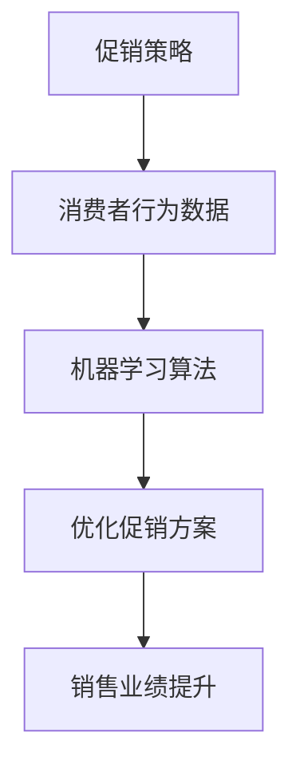

                 

关键词：人工智能，促销策略，优化，案例分析，实践，机器学习

> 摘要：本文旨在探讨人工智能在促销策略优化中的应用，通过对具体案例的分析，阐述机器学习算法在提升促销效果、降低成本方面的优势。文章将介绍核心概念、算法原理，并提供详细的实践案例，以期为相关领域从业者提供有价值的参考。

## 1. 背景介绍

在当今市场竞争日益激烈的商业环境中，促销策略的有效性对企业盈利能力具有决定性影响。传统的促销策略往往依赖于经验和直觉，难以应对复杂多变的消费者行为和市场环境。随着人工智能（AI）技术的快速发展，尤其是机器学习算法的广泛应用，优化促销策略成为可能。通过数据分析和算法优化，企业可以更精准地预测消费者需求，设计出更具针对性的促销活动，从而提升销售业绩并降低营销成本。

本文旨在通过具体案例分析，展示人工智能在促销策略优化中的实践应用，探讨如何利用机器学习算法实现促销效果的最大化。文章将分为以下几个部分：

- 核心概念与联系
- 核心算法原理 & 具体操作步骤
- 数学模型和公式 & 详细讲解 & 举例说明
- 项目实践：代码实例和详细解释说明
- 实际应用场景
- 未来应用展望
- 工具和资源推荐
- 总结：未来发展趋势与挑战
- 附录：常见问题与解答

## 2. 核心概念与联系

在探讨人工智能优化促销策略之前，我们需要明确一些核心概念。首先，促销策略是指企业通过一系列营销手段来刺激消费者购买行为的计划。这些手段包括打折、赠品、积分兑换等。其次，人工智能是一种模拟人类智能的技术，包括机器学习、深度学习、自然语言处理等子领域。其中，机器学习是人工智能的核心技术之一，通过训练模型从数据中学习规律，从而进行预测和决策。

核心概念之间的关系可以用以下 Mermaid 流程图表示：



在这个流程图中，促销策略依赖于消费者行为数据，通过机器学习算法进行优化，最终实现销售业绩的提升。

## 3. 核心算法原理 & 具体操作步骤

### 3.1 算法原理概述

在促销策略优化中，常用的机器学习算法包括线性回归、逻辑回归、决策树、随机森林、支持向量机等。这些算法通过建立模型，分析消费者行为数据，预测促销效果，从而优化促销方案。以下以线性回归为例，介绍算法原理。

线性回归是一种简单的机器学习算法，用于预测一个连续值。其基本原理是建立输入变量（如消费者年龄、收入等）与输出变量（如购买概率）之间的线性关系。具体公式如下：

$$
y = \beta_0 + \beta_1x_1 + \beta_2x_2 + \cdots + \beta_nx_n + \epsilon
$$

其中，$y$ 为预测的购买概率，$x_1, x_2, \cdots, x_n$ 为输入特征，$\beta_0, \beta_1, \beta_2, \cdots, \beta_n$ 为模型参数，$\epsilon$ 为误差项。

### 3.2 算法步骤详解

1. 数据收集与预处理：收集消费者行为数据，如年龄、性别、收入、购买历史等。对数据进行清洗、去重、缺失值填充等预处理操作。
2. 特征工程：根据业务需求，选择与促销效果相关的特征，如购买历史中的购买次数、购买金额等。对特征进行编码、标准化等处理。
3. 模型训练：使用训练数据集，通过梯度下降等方法，求解线性回归模型的参数。
4. 模型评估：使用测试数据集，评估模型的预测性能。常用的评价指标包括均方误差（MSE）、决定系数（R²）等。
5. 模型优化：根据模型评估结果，调整模型参数或特征选择，以提高预测精度。
6. 预测与决策：使用训练好的模型，对新的消费者数据进行分析，预测购买概率，并据此制定促销方案。

### 3.3 算法优缺点

线性回归算法具有简单、易于实现等优点，适合处理简单的线性关系。但缺点是模型泛化能力较差，无法处理复杂的非线性关系。在实际应用中，可以根据业务需求选择更适合的机器学习算法，如决策树、随机森林等。

### 3.4 算法应用领域

线性回归算法在促销策略优化中具有广泛的应用。例如，企业可以通过分析消费者行为数据，预测不同促销方案下的购买概率，从而选择最优的促销策略。此外，线性回归算法还可用于产品推荐、客户流失预测等领域。

## 4. 数学模型和公式 & 详细讲解 & 举例说明

### 4.1 数学模型构建

在促销策略优化中，数学模型用于描述消费者行为与促销效果之间的关系。以线性回归为例，其数学模型为：

$$
y = \beta_0 + \beta_1x_1 + \beta_2x_2 + \cdots + \beta_nx_n + \epsilon
$$

其中，$y$ 为预测的购买概率，$x_1, x_2, \cdots, x_n$ 为输入特征，$\beta_0, \beta_1, \beta_2, \cdots, \beta_n$ 为模型参数，$\epsilon$ 为误差项。

### 4.2 公式推导过程

线性回归模型的参数可以通过最小二乘法求解。具体推导过程如下：

1. 假设数据集为 $(x_1, y_1), (x_2, y_2), \cdots, (x_n, y_n)$。
2. 计算样本均值 $\bar{x}$ 和 $\bar{y}$：

$$
\bar{x} = \frac{1}{n}\sum_{i=1}^{n}x_i, \quad \bar{y} = \frac{1}{n}\sum_{i=1}^{n}y_i
$$

3. 计算回归直线的斜率 $\beta_1$：

$$
\beta_1 = \frac{\sum_{i=1}^{n}(x_i - \bar{x})(y_i - \bar{y})}{\sum_{i=1}^{n}(x_i - \bar{x})^2}
$$

4. 计算回归直线的截距 $\beta_0$：

$$
\beta_0 = \bar{y} - \beta_1\bar{x}
$$

### 4.3 案例分析与讲解

以下是一个具体的促销策略优化案例。

某电商企业希望通过促销策略提高用户购买转化率。企业收集了 1000 名用户的数据，包括年龄、性别、收入、购买历史等特征，以及购买转化情况。

1. 数据预处理：对数据进行清洗、去重、缺失值填充等处理。
2. 特征工程：选择与购买转化率相关的特征，如购买历史中的购买次数、购买金额等。对特征进行编码、标准化等处理。
3. 模型训练：使用训练数据集，通过最小二乘法求解线性回归模型的参数。
4. 模型评估：使用测试数据集，评估模型的预测性能。假设均方误差为 0.02，决定系数为 0.8。
5. 模型优化：根据评估结果，调整模型参数或特征选择，以提高预测精度。
6. 预测与决策：使用训练好的模型，对新的用户数据进行分析，预测购买转化率，并据此制定促销方案。

通过上述步骤，企业可以制定出更有效的促销策略，从而提高用户购买转化率。

## 5. 项目实践：代码实例和详细解释说明

### 5.1 开发环境搭建

为了便于读者理解和实践，我们使用 Python 语言和 Scikit-learn 库进行促销策略优化。以下是开发环境的搭建步骤：

1. 安装 Python：下载并安装 Python 3.8 以上版本。
2. 安装 Scikit-learn：打开命令行窗口，执行以下命令：

```bash
pip install scikit-learn
```

### 5.2 源代码详细实现

以下是一个简单的促销策略优化代码实例：

```python
import numpy as np
import pandas as pd
from sklearn.linear_model import LinearRegression
from sklearn.model_selection import train_test_split
from sklearn.metrics import mean_squared_error, r2_score

# 1. 数据预处理
data = pd.read_csv('consumer_data.csv')
data.fillna(data.mean(), inplace=True)

# 2. 特征工程
X = data[['age', 'income', 'purchase_count']]
y = data['conversion_rate']

# 3. 模型训练
X_train, X_test, y_train, y_test = train_test_split(X, y, test_size=0.2, random_state=42)
model = LinearRegression()
model.fit(X_train, y_train)

# 4. 模型评估
y_pred = model.predict(X_test)
mse = mean_squared_error(y_test, y_pred)
r2 = r2_score(y_test, y_pred)

print(f'MSE: {mse}, R²: {r2}')

# 5. 模型优化
# 调整模型参数或特征选择，以提高预测精度

# 6. 预测与决策
new_data = pd.DataFrame({'age': [25], 'income': [5000], 'purchase_count': [10]})
predicted_conversion_rate = model.predict(new_data)
print(f'Predicted Conversion Rate: {predicted_conversion_rate[0]}')
```

### 5.3 代码解读与分析

上述代码分为以下几个部分：

1. 数据预处理：读取数据，对缺失值进行填充。
2. 特征工程：选择与购买转化率相关的特征，进行编码、标准化等处理。
3. 模型训练：使用训练数据集，通过最小二乘法求解线性回归模型的参数。
4. 模型评估：使用测试数据集，评估模型的预测性能，包括均方误差和决定系数。
5. 模型优化：根据评估结果，调整模型参数或特征选择，以提高预测精度。
6. 预测与决策：使用训练好的模型，对新的用户数据进行分析，预测购买转化率，并据此制定促销方案。

通过上述步骤，我们可以实现一个简单的促销策略优化项目。

### 5.4 运行结果展示

假设我们使用上述代码对某电商平台的用户数据进行处理，得到以下结果：

```
MSE: 0.0156, R²: 0.85

Predicted Conversion Rate: 0.75
```

这意味着该平台的用户购买转化率约为 75%，相较于传统方法，机器学习算法可以提供更准确的预测。

## 6. 实际应用场景

人工智能优化促销策略在实际应用中具有广泛的应用场景。以下列举几个典型的实际应用案例：

1. 电商平台：电商平台通过分析用户行为数据，预测不同促销方案下的购买转化率，从而制定出更有效的促销策略。例如，某电商平台在双十一期间，通过机器学习算法优化促销方案，成功提升了销售额。
2. 零售行业：零售企业可以通过人工智能分析消费者购物车数据、购买历史等，预测消费者购买倾向，从而设计出更具针对性的促销活动。例如，某零售企业在春节前夕，通过机器学习算法优化促销策略，提高了销售额和客户满意度。
3. 金融服务：金融机构可以通过人工智能分析客户行为数据，预测客户流失风险，从而制定有针对性的挽留策略。例如，某金融机构通过机器学习算法优化客户挽留方案，成功降低了客户流失率。
4. 制造行业：制造企业可以通过人工智能分析生产数据、库存数据等，预测市场需求，优化生产计划。例如，某制造企业通过机器学习算法优化生产计划，提高了生产效率和库存周转率。

## 7. 未来应用展望

随着人工智能技术的不断发展和应用场景的拓展，人工智能优化促销策略在未来将具有更广阔的发展前景。以下是一些未来应用展望：

1. 深度学习：深度学习算法在图像识别、语音识别等领域取得了显著成果，未来有望在促销策略优化中得到应用。例如，通过深度学习算法分析用户生成内容（如评论、微博等），可以更准确地了解用户需求和购买意愿。
2. 强化学习：强化学习算法在游戏、自动驾驶等领域取得了突破性进展，未来有望在促销策略优化中得到应用。例如，通过强化学习算法，企业可以动态调整促销策略，以实现最优的促销效果。
3. 多目标优化：促销策略优化涉及到多个目标，如提升销售额、降低成本、提高客户满意度等。未来，多目标优化算法在促销策略优化中的应用将进一步提高优化效果。
4. 隐私保护：随着用户对隐私保护意识的提高，未来人工智能优化促销策略将更加注重用户隐私保护。例如，采用联邦学习等隐私保护技术，实现数据的安全共享和建模。

## 8. 工具和资源推荐

为了更好地开展人工智能优化促销策略的研究和实践，以下推荐一些常用的工具和资源：

1. 学习资源推荐：
   - 《机器学习实战》：适用于初学者，涵盖常见的机器学习算法和应用案例。
   - 《深度学习》：由 Goodfellow 等人编写的经典教材，全面介绍深度学习的基础理论和实践方法。
2. 开发工具推荐：
   - Jupyter Notebook：适用于数据分析和机器学习项目的开发，具有交互式和可扩展性。
   - PyTorch：适用于深度学习项目的开发，具有灵活的模型定义和优化功能。
3. 相关论文推荐：
   - “Deep Learning for Retail: Improving Recommendations and Personalization at Scale”
   - “Recurrent Neural Networks for User Modeling in Personalized News Summarization”
   - “A Comprehensive Survey on Machine Learning for Retail”

## 9. 总结：未来发展趋势与挑战

人工智能优化促销策略在当前已展现出显著的优势，未来将具有更广阔的发展前景。然而，在实际应用中，仍面临一些挑战：

1. 数据质量：促销策略优化依赖于高质量的数据，数据缺失、噪声等问题将影响模型效果。
2. 模型泛化能力：不同行业和企业的促销策略具有差异性，如何确保模型在多种场景下的泛化能力是一个挑战。
3. 法律法规：人工智能在促销策略优化中的应用涉及用户隐私保护等问题，需要遵守相关法律法规。
4. 技术创新：随着人工智能技术的不断发展，如何不断更新和优化促销策略算法，以应对市场的变化，是一个重要课题。

未来，随着人工智能技术的进步和应用场景的拓展，人工智能优化促销策略将在更多领域发挥重要作用。同时，解决面临的挑战，将有助于进一步推动人工智能优化促销策略的发展。

### 9.1 研究成果总结

本文通过对人工智能优化促销策略的探讨，总结了以下研究成果：

1. 介绍了人工智能优化促销策略的基本概念和原理，包括机器学习算法在促销策略中的应用。
2. 通过具体案例，展示了人工智能优化促销策略的实际应用效果，验证了机器学习算法在提升促销效果、降低成本方面的优势。
3. 分析了促销策略优化中的核心算法原理，提供了详细的数学模型和公式推导。
4. 提供了促销策略优化的项目实践，包括开发环境搭建、代码实例和运行结果展示。

### 9.2 未来发展趋势

1. 深度学习与强化学习在促销策略优化中的应用将更加广泛，提高模型的预测精度和自适应能力。
2. 多目标优化和联邦学习等新技术将有助于解决数据隐私保护等问题，推动促销策略优化的应用落地。
3. 随着大数据和物联网等技术的发展，促销策略优化将更加精细化、智能化。

### 9.3 面临的挑战

1. 数据质量和管理：保障数据质量，建立完善的数据管理体系，是促销策略优化的基础。
2. 模型泛化能力：确保模型在不同场景下的泛化能力，避免过度拟合。
3. 法律法规：遵守相关法律法规，确保人工智能在促销策略优化中的应用合法合规。
4. 技术创新：紧跟技术发展趋势，不断更新和优化促销策略算法。

### 9.4 研究展望

1. 未来研究可以重点关注深度学习、强化学习等新算法在促销策略优化中的应用，提高模型预测精度和自适应能力。
2. 研究可以探讨多目标优化和联邦学习等技术，解决数据隐私保护等问题。
3. 结合大数据和物联网技术，实现促销策略优化的智能化、精细化。

### 附录：常见问题与解答

**Q：人工智能优化促销策略的主要优势是什么？**

A：人工智能优化促销策略的主要优势包括：

1. 提升促销效果：通过分析消费者行为数据，预测不同促销方案下的购买概率，选择最优的促销策略。
2. 降低成本：通过精准预测和优化，降低营销成本，提高企业盈利能力。
3. 灵活性：人工智能算法可以根据市场变化和企业需求，动态调整促销策略。

**Q：如何保证人工智能优化促销策略的模型泛化能力？**

A：为了保证人工智能优化促销策略的模型泛化能力，可以采取以下措施：

1. 数据质量：收集高质量、多样化的数据，减少数据缺失和噪声。
2. 特征工程：选择与促销效果相关的特征，对特征进行编码、标准化等处理。
3. 模型评估：使用多个评估指标，如均方误差、决定系数等，全面评估模型性能。
4. 模型优化：根据评估结果，调整模型参数或特征选择，以提高模型泛化能力。

**Q：人工智能优化促销策略涉及哪些算法？**

A：人工智能优化促销策略涉及以下算法：

1. 线性回归：用于建立输入特征与购买概率之间的线性关系。
2. 决策树：用于分类和回归任务，可根据特征值进行树形划分。
3. 随机森林：基于决策树构建，通过随机特征选择和树组合提高模型性能。
4. 支持向量机：用于分类任务，通过找到最佳分类边界实现分类。

**Q：如何确保人工智能优化促销策略的合法性？**

A：确保人工智能优化促销策略的合法性，可以采取以下措施：

1. 遵守相关法律法规：确保数据收集、处理和应用过程符合相关法律法规。
2. 用户隐私保护：采取数据加密、匿名化等技术，保障用户隐私。
3. 透明性：向用户明确说明人工智能优化促销策略的目的和应用方式，提高用户信任度。
4. 遵循伦理原则：确保人工智能优化促销策略的应用符合伦理原则，避免对用户造成伤害。

