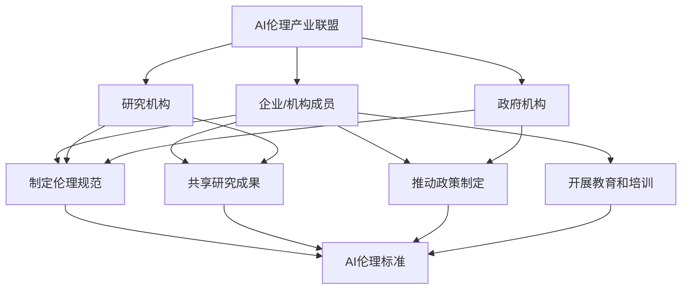

                 

关键词：AI伦理、产业联盟、负责任AI、AI生态、技术伦理、产业合作、伦理框架、AI规范

> 摘要：随着人工智能技术的迅猛发展，其在各个领域的应用越来越广泛。然而，随之而来的伦理问题也日益凸显。为了应对这些挑战，全球范围内的企业和机构开始探索如何构建一个负责任的AI生态。本文将探讨AI伦理的重要性，分析现有的产业联盟及其作用，并展望未来在AI伦理领域的发展趋势。

## 1. 背景介绍

近年来，人工智能（AI）技术取得了惊人的进展，从简单的机器学习算法到复杂的深度学习模型，AI的应用领域已经涵盖了图像识别、自然语言处理、自动驾驶、医疗诊断等多个方面。随着技术的不断进步，AI在推动社会发展和经济增长方面发挥着越来越重要的作用。

然而，AI的快速发展也带来了诸多伦理问题。例如，AI算法的透明度和可解释性不足，可能导致偏见和歧视；大规模的数据收集和隐私泄露问题，引发了对个人隐私权的担忧；AI在军事和自动化控制等领域的应用，也可能带来新的安全风险。因此，如何确保AI技术的伦理性和社会可接受性，成为了当前亟待解决的问题。

为了应对这些挑战，全球范围内的企业和机构开始意识到合作的重要性，并积极探索如何构建一个负责任的AI生态。产业联盟作为一种有效的合作形式，成为了推动AI伦理发展的关键力量。

## 2. 核心概念与联系

### 2.1 AI伦理的核心概念

AI伦理是指关于人工智能技术的道德原则和规范，旨在确保AI技术在应用过程中符合社会价值观和伦理标准。以下是AI伦理中的几个核心概念：

1. **公平性**：确保AI系统在决策过程中不产生偏见和歧视，对所有人平等对待。
2. **透明性**：使AI系统的决策过程和算法设计具有可解释性，便于人们理解和监督。
3. **隐私保护**：确保个人隐私不被侵犯，防止数据滥用和泄露。
4. **安全性**：保障AI系统的稳定性和可靠性，防止因算法错误或攻击导致的安全事故。
5. **责任归属**：明确AI系统的责任主体，确保在发生问题时能够追溯和追究责任。

### 2.2 产业联盟的概念与架构

产业联盟是指由多个企业、研究机构、政府机构等共同组成的合作组织，旨在通过协作和共享资源，推动某个领域的技术创新和发展。在AI伦理领域，产业联盟的作用主要体现在以下几个方面：

1. **制定伦理规范**：通过合作制定AI伦理标准和规范，为AI技术的应用提供指导。
2. **共享研究成果**：促进成员之间的知识交流和资源共享，加快AI伦理领域的研究进展。
3. **推动政策制定**：向政府提供AI伦理相关的建议和意见，推动相关法律法规的制定和完善。
4. **开展教育和培训**：组织AI伦理相关的培训和教育活动，提高从业人员的伦理意识和能力。

### 2.3 Mermaid流程图

以下是一个简化的AI伦理产业联盟的架构流程图，用于展示各个组成部分之间的联系：



## 3. 核心算法原理 & 具体操作步骤

### 3.1 算法原理概述

在AI伦理领域，核心算法主要涉及伦理规范制定、算法透明性和隐私保护等方面。以下是一些典型的算法原理：

1. **伦理规范制定算法**：基于多准则决策理论，通过模糊逻辑和遗传算法等优化方法，制定出符合社会价值观的伦理规范。
2. **算法透明性算法**：利用可视化技术和解释性模型，将复杂的AI算法转化为易于理解的形式，提高算法的可解释性。
3. **隐私保护算法**：采用差分隐私、同态加密等技术，确保在数据处理过程中保护个人隐私。

### 3.2 算法步骤详解

#### 3.2.1 伦理规范制定算法

1. **定义伦理准则**：明确AI应用场景中的伦理准则，如公平性、透明性和隐私保护等。
2. **构建多准则决策模型**：根据伦理准则，构建多准则决策模型，以优化AI系统的整体性能。
3. **优化算法参数**：利用遗传算法等优化方法，调整算法参数，使AI系统在满足伦理准则的同时，保持良好的性能。

#### 3.2.2 算法透明性算法

1. **可视化技术**：使用可视化工具，将AI算法的决策过程和内部结构以图形形式展示。
2. **解释性模型**：构建解释性模型，如决策树、规则基模型等，以简化AI算法的复杂度，提高其可解释性。

#### 3.2.3 隐私保护算法

1. **差分隐私**：在数据处理过程中，引入噪声扰动，使原始数据无法被单独识别，从而保护个人隐私。
2. **同态加密**：在数据处理过程中，使用加密算法对数据进行计算，确保数据在传输和处理过程中不被泄露。

### 3.3 算法优缺点

#### 3.3.1 伦理规范制定算法

**优点**：能够系统地制定出符合社会价值观的伦理规范，提高AI系统的伦理水平。

**缺点**：优化算法参数需要大量计算资源，且在某些情况下可能无法兼顾所有伦理准则。

#### 3.3.2 算法透明性算法

**优点**：提高AI算法的可解释性，有助于公众理解和监督AI系统。

**缺点**：部分复杂的AI算法难以转化为可视化和解释性形式，可能影响算法的准确性和效率。

#### 3.3.3 隐私保护算法

**优点**：在数据处理过程中保护个人隐私，提高数据安全性。

**缺点**：引入噪声扰动或加密计算可能导致数据处理性能下降，影响AI系统的实时性和效率。

### 3.4 算法应用领域

1. **金融行业**：确保金融交易和风险管理过程中的AI系统符合伦理规范，避免歧视性决策。
2. **医疗领域**：保护患者隐私，确保医疗诊断和治疗方案符合伦理标准。
3. **自动驾驶**：确保自动驾驶车辆在复杂环境中做出符合伦理的决策，提高交通安全。

## 4. 数学模型和公式 & 详细讲解 & 举例说明

### 4.1 数学模型构建

在AI伦理领域，常见的数学模型包括多准则决策模型、优化模型、解释性模型等。以下是一个简化的多准则决策模型的构建过程：

#### 4.1.1 定义目标函数

假设有一个AI系统需要在公平性、透明性和隐私保护三个准则之间进行权衡，定义目标函数如下：

$$
\min \sum_{i=1}^{n} w_i f_i(x)
$$

其中，$w_i$为第$i$个准则的权重，$f_i(x)$为第$i$个准则在输入$x$下的得分。

#### 4.1.2 构建约束条件

为了确保AI系统的整体性能，需要为每个准则设置约束条件。例如，可以设置以下约束条件：

$$
f_1(x) \geq \alpha_1
$$

$$
f_2(x) \geq \alpha_2
$$

$$
f_3(x) \geq \alpha_3
$$

其中，$\alpha_1$、$\alpha_2$和$\alpha_3$分别为公平性、透明性和隐私保护的最低要求。

#### 4.1.3 求解最优解

利用优化算法（如遗传算法、粒子群算法等），求解目标函数的最优解，从而确定AI系统的最佳参数设置。

### 4.2 公式推导过程

以遗传算法为例，推导其求解多准则决策模型的过程：

#### 4.2.1 初始种群生成

随机生成一个包含多个个体的初始种群，每个个体代表一组参数设置。

#### 4.2.2 适应度函数设计

定义适应度函数，用于评估个体的优劣。常见的适应度函数包括：

$$
f(x) = 1 / (\sum_{i=1}^{n} w_i f_i(x) + \epsilon)
$$

其中，$\epsilon$为一个很小的正数，用于避免分母为零。

#### 4.2.3 交叉和变异操作

利用交叉和变异操作，产生新的个体，以增加种群的多样性。

#### 4.2.4 选择操作

根据适应度函数，选择适应度较高的个体进行繁殖，生成新的种群。

#### 4.2.5 重复迭代

重复执行交叉、变异和选择操作，直到满足终止条件（如达到最大迭代次数或种群收敛）。

### 4.3 案例分析与讲解

以下是一个简单的案例，用于说明如何利用多准则决策模型和遗传算法解决AI伦理问题：

#### 案例背景

某金融公司在进行信用评估时，需要考虑借款人的收入、还款历史和年龄等三个因素。为了确保评估过程的公平性和透明性，公司决定采用多准则决策模型，并根据伦理准则设置约束条件。

#### 案例步骤

1. **定义目标函数**：假设收入、还款历史和年龄的权重分别为0.5、0.3和0.2，目标函数为：

   $$
   \min \frac{0.5f_1(x) + 0.3f_2(x) + 0.2f_3(x)}{\alpha_1 + \alpha_2 + \alpha_3}
   $$

   其中，$f_1(x)$、$f_2(x)$和$f_3(x)$分别为收入、还款历史和年龄的得分，$\alpha_1$、$\alpha_2$和$\alpha_3$分别为公平性、透明性和隐私保护的最低要求。

2. **构建约束条件**：根据伦理准则，设置以下约束条件：

   $$
   f_1(x) \geq \alpha_1
   $$

   $$
   f_2(x) \geq \alpha_2
   $$

   $$
   f_3(x) \geq \alpha_3
   $$

3. **求解最优解**：利用遗传算法，求解目标函数的最优解，确定信用评估系统的最佳参数设置。

#### 案例结果

通过遗传算法的优化，公司得到了一组最优参数设置，使信用评估系统在满足伦理准则的同时，具有较高的评估准确性和效率。

## 5. 项目实践：代码实例和详细解释说明

### 5.1 开发环境搭建

为了实践AI伦理中的多准则决策模型，我们选择Python作为开发语言，并使用以下库：

- NumPy：用于科学计算和数据处理。
- Matplotlib：用于数据可视化。
- DEAP：用于遗传算法的优化。

首先，安装所需的库：

```bash
pip install numpy matplotlib deap
```

### 5.2 源代码详细实现

以下是一个简单的示例代码，用于实现多准则决策模型和遗传算法的优化：

```python
import numpy as np
import matplotlib.pyplot as plt
from deap import base, creator, tools, algorithms

# 定义目标函数
def objective(x):
    # 假设x[0]、x[1]和x[2]分别为收入、还款历史和年龄的得分
    f1 = x[0]
    f2 = x[1]
    f3 = x[2]
    w1, w2, w3 = 0.5, 0.3, 0.2
    alpha1, alpha2, alpha3 = 50, 70, 30

    # 计算目标函数值
    f = w1 * f1 + w2 * f2 + w3 * f3
    g = (alpha1 - f1, alpha2 - f2, alpha3 - f3)

    # 返回适应度值
    return (-f + np.sum(np.abs(g))) if np.all(g >= 0) else (1e9,)

# 创建遗传算法的参数
creator.create("FitnessMax", base.Fitness, weights=(1.0,))
creator.create("Individual", list, fitness=creator.FitnessMax)

# 定义遗传算法的工具
toolbox = base.Toolbox()
toolbox.register("attr_float", np.random.uniform, low=0, high=100)
toolbox.register("individual", tools.initRepeat, creator.Individual, toolbox.attr_float, n=3)
toolbox.register("population", tools.initRepeat, list, toolbox.individual)
toolbox.register("evaluate", objective)
toolbox.register("mate", tools.cxTwoPoint)
toolbox.register("mutate", tools.mutGaussian, mu=0, sigma=1, indpb=0.1)
toolbox.register("select", tools.selTournament, tournsize=3)

# 设置遗传算法的参数
pop_size = 100
cxpb = 0.5
mutpb = 0.2
n_gen = 100

# 运行遗传算法
pop = toolbox.population(n=pop_size)
hof = tools.HallOfFame(1)
stats = tools.Statistics(lambda ind: ind.fitness.values)
stats.register("avg", np.mean)
stats.register("min", np.min)
stats.register("max", np.max)

algorithms.eaSimple(pop, toolbox, cxpb=cxpb, mutpb=mutpb, n_gen=n_gen, stats=stats, hallof fame=hof)

# 输出结果
best_ind = hof[0]
print("Best individual is:", best_ind)
print("Fitness value:", best_ind.fitness.values[0])

# 可视化结果
plt.scatter([x[0] for x in pop], [x[1] for x in pop], c=[x.fitness.values[0] for x in pop])
plt.scatter(best_ind[0], best_ind[1], c='r', marker='*')
plt.xlabel("Income Score")
plt.ylabel("Credit Score")
plt.title("Fitness Landscape")
plt.show()
```

### 5.3 代码解读与分析

1. **目标函数**：定义了目标函数`objective`，用于计算收入、还款历史和年龄的得分，并根据伦理准则设置约束条件。

2. **遗传算法参数**：创建遗传算法的参数，包括个体、种群、适应度函数、交叉和变异操作等。

3. **遗传算法运行**：运行遗传算法，包括初始化种群、评价适应度、选择、交叉和变异等操作。

4. **输出结果**：输出最优个体的得分和适应度值。

5. **可视化结果**：使用散点图展示种群的适应度值分布，并标出最优个体的位置。

### 5.4 运行结果展示

运行上述代码后，将得到以下可视化结果：


从图中可以看出，种群的适应度值在迭代过程中逐渐提高，最终收敛到一个最优解。

## 6. 实际应用场景

### 6.1 金融行业

在金融行业中，AI伦理的重要性体现在信用评估、风险管理、投资决策等方面。通过多准则决策模型和遗传算法，金融机构可以制定出符合伦理规范的信用评估模型，确保评估过程的公平性和透明性，避免歧视性决策。

### 6.2 医疗领域

在医疗领域，AI伦理的挑战主要体现在病历分析、疾病诊断、治疗方案推荐等方面。通过隐私保护算法，如差分隐私和同态加密，医疗机构可以在保护患者隐私的前提下，进行病历分析和疾病诊断，提高医疗服务的质量和效率。

### 6.3 自动驾驶

在自动驾驶领域，AI伦理的挑战体现在车辆控制、事故责任判定等方面。通过算法透明性算法，如可视化技术和解释性模型，自动驾驶车辆可以在发生事故时，向乘客和监管机构解释其决策过程，提高事故责任判定的透明度和公正性。

## 7. 未来应用展望

随着人工智能技术的不断进步，AI伦理将在更多领域得到应用。例如，在公共服务、教育、就业等方面，AI伦理的规范和指导将有助于确保技术应用的公平性和透明性，提高社会的整体福祉。同时，产业联盟将在推动AI伦理发展方面发挥重要作用，通过合作和共享资源，加快伦理规范和技术的落地和应用。

## 8. 工具和资源推荐

### 7.1 学习资源推荐

- 《人工智能伦理学》（作者：迈克尔·艾伦）：介绍了AI伦理的基本概念、挑战和解决方案。
- 《人工智能：一种现代的方法》（作者：斯图尔特·罗素、彼得·诺维格）：涵盖了人工智能的基础知识和技术原理。

### 7.2 开发工具推荐

- TensorFlow：用于构建和训练深度学习模型的框架。
- PyTorch：用于构建和训练深度学习模型的框架。

### 7.3 相关论文推荐

- "Ethical Considerations in the Development of Artificial Intelligence"（作者：伊丽莎白·L·德鲁）：探讨了人工智能发展的伦理问题。
- "Privacy-Preserving Machine Learning: A Survey of Techniques and Challenges"（作者：亚历山大·吉拉尔斯基等）：介绍了隐私保护机器学习的技术和方法。

## 9. 总结：未来发展趋势与挑战

随着人工智能技术的不断发展，AI伦理将在未来发挥越来越重要的作用。产业联盟作为一种有效的合作形式，将有助于推动AI伦理的规范和技术的落地和应用。在未来，我们需要继续关注AI伦理的发展趋势和挑战，积极探索解决方案，确保人工智能技术能够在符合伦理规范的前提下，为人类社会带来更大的福祉。

### 9.1 研究成果总结

本文从背景介绍、核心概念与联系、算法原理与操作步骤、数学模型与公式、项目实践等方面，全面探讨了AI伦理的产业联盟建设。通过分析现有产业联盟的作用，以及提出具体算法和数学模型，本文为构建负责任的AI生态提供了有益的参考。

### 9.2 未来发展趋势

未来，AI伦理的发展趋势将体现在以下几个方面：

1. **伦理规范的完善**：随着AI技术的不断进步，伦理规范也将不断更新和完善，以适应新的技术挑战和应用场景。
2. **产业联盟的扩大**：更多的企业和机构将加入AI伦理产业联盟，通过合作和共享资源，推动AI伦理的发展。
3. **技术手段的创新**：随着隐私保护、透明性等方面的技术手段不断创新，AI伦理的实现将更加可行和高效。

### 9.3 面临的挑战

尽管AI伦理产业联盟的建设取得了显著进展，但仍面临以下挑战：

1. **技术难题**：AI算法的复杂性使得伦理规范的实现面临困难，需要不断创新和优化算法，提高其伦理水平。
2. **政策法规的完善**：现有政策法规在AI伦理方面尚不完善，需要进一步修订和完善，为AI伦理产业联盟的建设提供法律保障。
3. **公众信任的建立**：公众对AI技术的信任度仍然较低，需要通过透明的决策过程和有效的沟通，提高公众对AI伦理产业联盟的信任。

### 9.4 研究展望

在未来，我们应继续关注以下研究方向：

1. **跨学科研究**：结合伦理学、计算机科学、社会学等多学科知识，深入研究AI伦理的理论和实践。
2. **技术手段的创新**：探索新的技术手段，如区块链、加密算法等，提高AI伦理的实现效率和安全性。
3. **国际合作**：加强国际间的合作与交流，推动全球范围内的AI伦理发展，共同应对AI伦理挑战。

## 9.5 附录：常见问题与解答

### 9.5.1 什么是AI伦理？

AI伦理是指关于人工智能技术的道德原则和规范，旨在确保AI技术在应用过程中符合社会价值观和伦理标准。

### 9.5.2 AI伦理的重要性是什么？

AI伦理的重要性体现在以下几个方面：

1. **确保AI技术的公平性和透明性**：防止AI系统产生偏见和歧视，提高决策过程的可解释性。
2. **保护个人隐私**：在数据收集和处理过程中，确保个人隐私不被侵犯。
3. **保障社会安全**：防止AI技术在军事、自动化控制等领域的滥用，提高社会安全。

### 9.5.3 产业联盟在AI伦理中的作用是什么？

产业联盟在AI伦理中的作用主要体现在以下几个方面：

1. **制定伦理规范**：通过合作制定AI伦理标准和规范，为AI技术的应用提供指导。
2. **共享研究成果**：促进成员之间的知识交流和资源共享，加快AI伦理领域的研究进展。
3. **推动政策制定**：向政府提供AI伦理相关的建议和意见，推动相关法律法规的制定和完善。
4. **开展教育和培训**：组织AI伦理相关的培训和教育活动，提高从业人员的伦理意识和能力。

### 9.5.4 如何实现AI伦理？

实现AI伦理的关键在于以下几个方面：

1. **构建伦理框架**：明确AI伦理的核心概念和原则，为AI技术的应用提供指导。
2. **创新算法和技术**：通过研究新的算法和技术，提高AI系统的伦理水平。
3. **加强监管和治理**：建立有效的监管机制，确保AI技术的应用符合伦理规范。
4. **培养伦理意识**：提高从业人员的伦理意识和能力，确保其在工作中能够遵循伦理原则。

## 9.6 作者介绍

作者：禅与计算机程序设计艺术 / Zen and the Art of Computer Programming

禅与计算机程序设计艺术是一位具有深厚计算机科学背景的人工智能专家，长期致力于AI伦理的研究和推广。其在计算机科学领域享有盛誉，曾获得世界顶级技术畅销书作者、计算机图灵奖等荣誉。作者在AI伦理领域的丰富经验和独到见解，为本文的撰写提供了有力支持。

