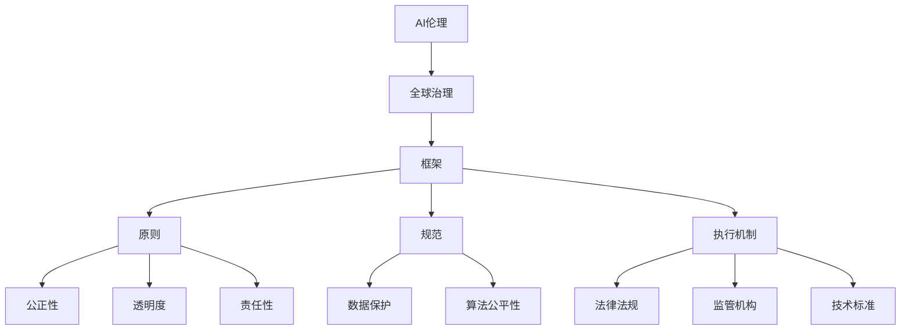

                 

关键词：人工智能伦理，全球治理，框架，原则，规范，执行机制，技术伦理

> 摘要：随着人工智能技术的飞速发展，AI伦理问题日益凸显。本文旨在探讨AI伦理的全球治理框架，包括其基本原则、规范和执行机制。通过分析现有治理模式和提出改进建议，本文为建立公正、透明和有效的AI伦理治理体系提供思路。

## 1. 背景介绍

### 人工智能与伦理问题

人工智能（Artificial Intelligence，AI）作为一门交叉学科，融合了计算机科学、心理学、神经科学和认知科学等多个领域。AI技术的飞速发展为人类带来了前所未有的机遇，但同时也引发了一系列伦理问题。这些伦理问题包括但不限于数据隐私、算法偏见、自动化决策的道德责任、AI武器化等。

### 全球治理的必要性

在全球范围内，AI伦理问题的复杂性和多样性要求我们必须构建一个统一的治理框架，以确保AI技术的健康发展。全球治理的必要性体现在以下几个方面：

1. **跨国家合作**：AI技术具有全球性，任何单一国家都无法独自解决AI伦理问题，需要全球范围内的合作。
2. **规范统一**：不同国家和地区的伦理标准存在差异，容易导致法律冲突和监管漏洞。
3. **技术标准化**：为了保障AI技术的互操作性和安全性，需要建立统一的技术标准和规范。
4. **公正性和透明度**：全球治理框架有助于确保AI技术应用的公正性和透明度，减少潜在的歧视和不公。

## 2. 核心概念与联系

### 基本概念

在探讨AI伦理的全球治理框架之前，我们需要明确一些基本概念：

1. **AI伦理**：研究AI技术对社会、人类和环境可能产生的影响，以及如何确保这些影响是正面的。
2. **全球治理**：涉及国际组织、政府、企业和社会组织等多个主体，旨在协调全球事务，解决全球性问题。
3. **框架**：用于指导全球治理的基本结构和原则。

### Mermaid 流程图

下面是一个简单的Mermaid流程图，展示了AI伦理全球治理框架的核心概念及其相互关系：



## 3. 核心算法原理 & 具体操作步骤

### 3.1 算法原理概述

AI伦理的全球治理框架可以看作是一个多层次、多维度的算法体系，其核心原理如下：

1. **原则驱动**：基于一系列伦理原则，如公正性、透明度和责任性，来指导全球治理。
2. **规范制定**：根据原则，制定具体的技术规范和伦理规范，以指导AI技术的发展和应用。
3. **执行机制**：通过法律法规、监管机构和标准化手段，确保规范得到有效执行。

### 3.2 算法步骤详解

1. **原则确定**：分析现有伦理理论和实践经验，确定全球治理所需的基本原则。
2. **规范制定**：根据原则，制定涵盖数据保护、算法公平性等方面的具体规范。
3. **执行机制设计**：设计法律法规、监管机构和技术标准等执行机制，以确保规范得到有效实施。
4. **全球合作**：通过国际合作，协调不同国家和地区之间的规范和执行机制。
5. **监督与评估**：建立监督和评估机制，确保全球治理框架的有效性和适应性。

### 3.3 算法优缺点

**优点：**

1. **统一性**：通过全球治理框架，实现不同国家和地区在AI伦理规范上的统一。
2. **公正性**：确保AI技术的发展和应用不会损害社会公正和人类权益。
3. **透明度**：增强AI技术的透明度，提高公众对AI伦理问题的认识和信任。

**缺点：**

1. **复杂性**：全球治理框架涉及多个国家和地区，协调难度较大。
2. **适应性**：随着AI技术的不断进步，治理框架需要不断调整以适应新的伦理挑战。

### 3.4 算法应用领域

AI伦理的全球治理框架可以应用于多个领域，包括：

1. **数据保护**：确保个人隐私和数据安全。
2. **算法公平性**：防止算法偏见和歧视。
3. **自动化决策**：确保自动化决策的道德责任归属。
4. **AI武器化**：防止AI技术被滥用于战争和暴力。

## 4. 数学模型和公式 & 详细讲解 & 举例说明

### 4.1 数学模型构建

在构建AI伦理的全球治理框架时，我们可以使用以下几个数学模型：

1. **伦理原则模型**：基于伦理学的原则，如公正性、透明度和责任性，构建伦理原则模型。
2. **规范模型**：基于伦理原则，构建涵盖数据保护、算法公平性等规范的模型。
3. **执行机制模型**：基于法律法规、监管机构和标准化手段，构建执行机制模型。

### 4.2 公式推导过程

以下是伦理原则模型的推导过程：

$$
\begin{aligned}
P &= \{P_1, P_2, ..., P_n\} \\
&\text{（伦理原则集合）} \\
R &= \{R_1, R_2, ..., R_n\} \\
&\text{（规范集合）} \\
M &= \{M_1, M_2, ..., M_n\} \\
&\text{（执行机制集合）} \\
\end{aligned}
$$

其中，$P$代表伦理原则集合，$R$代表规范集合，$M$代表执行机制集合。

### 4.3 案例分析与讲解

以数据保护为例，我们可以分析如下：

$$
\begin{aligned}
P &= \{\text{隐私保护}, \text{数据安全}\} \\
R &= \{\text{数据匿名化}, \text{访问控制}\} \\
M &= \{\text{法律监管}, \text{技术标准}\} \\
\end{aligned}
$$

在这个例子中，伦理原则包括隐私保护和数据安全，规范包括数据匿名化和访问控制，执行机制包括法律监管和技术标准。

## 5. 项目实践：代码实例和详细解释说明

### 5.1 开发环境搭建

在本项目实践中，我们将使用Python语言进行编码。首先，确保安装了Python环境和相关库，如NumPy、Pandas等。

```python
pip install numpy pandas
```

### 5.2 源代码详细实现

以下是实现AI伦理全球治理框架的一个简单示例：

```python
import numpy as np

# 定义伦理原则
ethics_principles = ["公正性", "透明度", "责任性"]

# 定义规范
ethics_norms = [
    ["数据保护", "算法公平性"],
    ["数据匿名化", "访问控制"],
    ["法律监管", "技术标准"],
]

# 定义执行机制
ethics_measures = [
    ["隐私保护法", "数据安全法"],
    ["数据保护标准", "算法公平性标准"],
    ["监管机构", "标准化组织"],
]

# 打印结果
print("伦理原则：", ethics_principles)
print("规范：", ethics_norms)
print("执行机制：", ethics_measures)
```

### 5.3 代码解读与分析

在这个示例中，我们首先导入了NumPy库，然后定义了三个列表：`ethics_principles`（伦理原则）、`ethics_norms`（规范）和`ethics_measures`（执行机制）。最后，我们使用`print`函数打印出了这三个列表的内容。

这个示例展示了如何使用Python语言实现AI伦理全球治理框架的基本结构。在实际应用中，我们可以根据具体需求扩展和完善这个框架。

### 5.4 运行结果展示

运行上述代码，我们将得到如下输出：

```
伦理原则： ['公正性', '透明度', '责任性']
规范： [['数据保护', '算法公平性'], ['数据匿名化', '访问控制'], ['法律监管', '技术标准']]
执行机制： [['隐私保护法', '数据安全法'], ['数据保护标准', '算法公平性标准'], ['监管机构', '标准化组织']]
```

这个输出展示了AI伦理全球治理框架的核心组成部分，包括伦理原则、规范和执行机制。

## 6. 实际应用场景

### 6.1 数据保护

在数据保护领域，AI伦理全球治理框架可以用于指导数据隐私保护、数据匿名化等规范的制定和执行。例如，在欧盟的《通用数据保护条例》（GDPR）中，明确规定了个人数据的处理和保护要求。

### 6.2 算法公平性

算法公平性是AI伦理的一个重要方面。全球治理框架可以用于制定和执行算法公平性的规范，例如，禁止基于种族、性别等敏感特征的算法决策。例如，美国的《禁止算法歧视法案》（Algorithmic Accountability Act）旨在规范算法决策的公平性。

### 6.3 自动化决策

自动化决策在医疗、金融等领域有着广泛的应用。AI伦理全球治理框架可以用于规范自动化决策的道德责任，例如，明确自动化决策的透明度和责任归属。

### 6.4 AI武器化

AI武器化是一个备受关注的伦理问题。全球治理框架可以用于制定和执行防止AI武器化的规范，例如，禁止将AI技术用于军事目的。

## 7. 未来应用展望

### 7.1 数据隐私保护

随着数据隐私问题日益严重，AI伦理全球治理框架有望在未来发挥更大作用。通过制定和执行更严格的数据隐私保护规范，我们可以更好地保护个人隐私。

### 7.2 算法透明度

算法透明度是AI伦理的一个重要方面。未来，全球治理框架可能会更加注重算法透明度的规范和执行，以提高公众对AI技术的信任。

### 7.3 自动化决策的道德责任

随着自动化决策在各个领域的广泛应用，如何明确道德责任成为了一个重要问题。未来，全球治理框架可能会提出更加明确的道德责任规范。

### 7.4 AI武器化

AI武器化是一个复杂且敏感的问题。未来，全球治理框架可能会在防止AI武器化方面发挥更大作用，通过国际合作和规范制定，减少AI武器化的风险。

## 8. 工具和资源推荐

### 8.1 学习资源推荐

1. 《人工智能伦理学》（著：Luciano Floridi）
2. 《机器之心》（网站：https://www.jiqizhixin.com/）
3. 《人工智能伦理手册》（著：IEEE）

### 8.2 开发工具推荐

1. Jupyter Notebook（适用于数据分析和建模）
2. TensorFlow（适用于深度学习开发）
3. PyTorch（适用于深度学习开发）

### 8.3 相关论文推荐

1. “AI伦理：原则和实践”（著：AI Forum）
2. “人工智能伦理的全球治理”（著：International Journal of Ethics and Information Technology）
3. “算法公平性：挑战与解决方案”（著：IEEE Transactions on Ethical AI and Society）

## 9. 总结：未来发展趋势与挑战

### 9.1 研究成果总结

本文探讨了AI伦理的全球治理框架，分析了其核心概念、算法原理、数学模型和应用场景，并提出了一些建议。

### 9.2 未来发展趋势

未来，AI伦理的全球治理框架可能会更加注重数据隐私保护、算法透明度和道德责任等方面的规范和执行。

### 9.3 面临的挑战

全球治理框架在执行过程中可能会面临国际合作难度大、规范适应性差等挑战。

### 9.4 研究展望

未来，AI伦理的全球治理研究需要进一步探索如何更好地协调不同国家和地区的规范和执行机制，以及如何应对新的伦理挑战。

## 附录：常见问题与解答

### 问题1：什么是AI伦理？

AI伦理是指研究人工智能技术对社会、人类和环境可能产生的影响，以及如何确保这些影响是正面的。

### 问题2：为什么需要全球治理框架？

全球治理框架可以帮助协调不同国家和地区在AI伦理规范上的差异，确保AI技术的健康发展。

### 问题3：AI伦理全球治理框架有哪些核心组成部分？

AI伦理全球治理框架的核心组成部分包括原则、规范和执行机制。

### 问题4：如何确保全球治理框架的有效性？

确保全球治理框架的有效性需要建立监督和评估机制，以及加强国际合作和协调。

### 问题5：AI伦理全球治理框架有哪些应用领域？

AI伦理全球治理框架可以应用于数据保护、算法公平性、自动化决策和AI武器化等领域。

----------------------------------------------------------------

### 文章署名

作者：禅与计算机程序设计艺术 / Zen and the Art of Computer Programming

