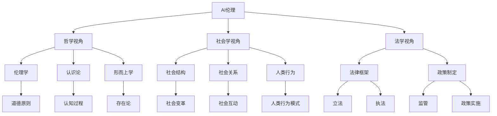

                 

关键词：AI伦理、多元化视角、哲学、社会学、法学、交叉领域

> 摘要：本文从哲学、社会学和法学三个视角，深入探讨了AI伦理的多元化问题。首先，介绍了AI伦理的重要性及其在现代社会中的地位；然后，从哲学角度探讨了AI伦理的理论基础，包括伦理学、认识论和形而上学等方面；接着，从社会学角度分析了AI伦理的影响和社会反应；最后，从法学角度探讨了AI伦理的法律框架和政策建议。通过这三个视角的交叉分析，本文提出了对AI伦理的全面理解和应对策略。

## 1. 背景介绍

人工智能（AI）作为当代科技发展的前沿领域，已经在众多领域展现出了巨大的潜力和应用价值。然而，随着AI技术的迅速发展，AI伦理问题也逐渐引起了广泛关注。AI伦理不仅关乎技术的安全性和可靠性，更关乎人类社会的道德规范和价值观念。

在哲学领域，伦理学、认识论和形而上学等学科为AI伦理提供了理论基础。社会学则关注AI技术对社会结构、社会关系和人类行为的影响，探讨了AI技术所带来的社会变革。法学则通过法律框架和政策制定，为AI技术的应用提供规范和保障。

本文旨在通过哲学、社会学和法学三个视角的交叉分析，对AI伦理进行深入探讨，以期为解决AI伦理问题提供多元化的思路和策略。

### 1.1 AI伦理的重要性

AI伦理的重要性在于其对人类社会的深远影响。首先，AI技术在医疗、交通、金融等领域具有广泛的应用前景，其伦理问题直接关系到公共安全和公共利益。其次，AI技术的自主性和智能化程度不断提高，使其在决策过程中可能产生偏差和错误，进而影响社会公平和正义。此外，AI技术的发展也带来了隐私保护、数据安全等方面的挑战，需要从伦理角度进行严格审视。

### 1.2 AI伦理的现状

目前，AI伦理研究已经取得了一定的成果，但仍存在许多问题和挑战。从哲学角度，AI伦理的理论体系尚未完全建立，需要进一步探讨AI伦理的基本原则和规范。从社会学角度，AI技术对社会结构和人类行为的影响仍需深入研究，以制定合理的政策和规范。从法学角度，AI伦理的法律框架和政策建议尚不完善，需要加强立法和监管。

### 1.3 本文结构

本文分为八个部分：首先，介绍AI伦理的重要性及其在现代社会中的地位；其次，从哲学角度探讨AI伦理的理论基础；然后，从社会学角度分析AI伦理的影响和社会反应；接着，从法学角度探讨AI伦理的法律框架和政策建议；随后，通过三个视角的交叉分析，提出对AI伦理的全面理解；然后，讨论AI伦理的未来发展；最后，总结研究成果，提出研究展望。

## 2. 核心概念与联系

### 2.1 AI伦理的定义

AI伦理是指在人工智能技术研究和应用过程中，遵循道德规范和价值观念，确保技术发展符合人类利益和伦理标准的一系列原则和规范。

### 2.2 哲学、社会学和法学的联系

哲学、社会学和法学是交叉领域，它们在探讨AI伦理问题时相互补充、相互影响。

哲学为AI伦理提供了理论基础，如伦理学、认识论和形而上学等。社会学关注AI技术对社会结构、社会关系和人类行为的影响，从社会视角分析AI伦理问题。法学通过法律框架和政策制定，为AI技术的应用提供规范和保障。

### 2.3 AI伦理的核心概念

AI伦理的核心概念包括：

1. 人类价值观：确保AI技术发展符合人类价值观，如公平、正义、自由等。
2. 安全性和可靠性：确保AI技术的安全性和可靠性，防止因技术故障或错误导致危害。
3. 隐私保护：确保个人隐私得到保护，防止数据泄露和滥用。
4. 公平性和公正性：确保AI技术在决策过程中公平、公正，避免歧视和偏见。

### 2.4 Mermaid 流程图



## 3. 核心算法原理 & 具体操作步骤

### 3.1 算法原理概述

AI伦理的核心算法原理主要包括以下几个方面：

1. 道德原则：基于伦理学理论，制定适用于AI系统的道德原则，如不伤害原则、公正原则等。
2. 模式识别：利用认知科学和心理学原理，识别和预测AI系统可能产生的问题和挑战。
3. 法律遵循：基于法学理论，确保AI系统的设计和应用符合相关法律法规和政策。
4. 风险评估：通过数学模型和算法，评估AI系统的潜在风险和影响。

### 3.2 算法步骤详解

1. 确定AI伦理核心原则：基于伦理学、社会学和法学理论，确定适用于AI系统的道德原则和规范。
2. 设计AI伦理评估模型：利用模式识别技术，构建AI伦理评估模型，用于识别和预测AI系统的潜在问题。
3. 遵循法律和政策要求：确保AI系统的设计和应用符合相关法律法规和政策要求。
4. 实施风险评估：利用数学模型和算法，对AI系统的潜在风险进行评估，并提出相应的风险控制和应对措施。
5. 持续监测和优化：对AI系统的伦理表现进行持续监测和评估，根据实际情况进行优化和调整。

### 3.3 算法优缺点

#### 优点

1. 综合性：算法综合考虑了伦理学、社会学和法学等多个领域的理论，具有较高的综合性。
2. 可操作性：算法提供了具体的操作步骤和实施方法，具有较高的可操作性。
3. 实用性：算法适用于各种AI系统和场景，具有较高的实用价值。

#### 缺点

1. 复杂性：算法涉及多个领域的理论，实施过程较为复杂。
2. 难以量化：一些伦理问题难以量化，可能导致评估结果的偏差。
3. 法学限制：算法在实施过程中可能受到法律法规的限制，影响其实际效果。

### 3.4 算法应用领域

AI伦理算法主要应用于以下领域：

1. 人工智能助手：为AI助手提供伦理评估和规范指导，确保其行为符合伦理要求。
2. 自动驾驶：为自动驾驶系统提供伦理评估和风险控制，确保行车安全。
3. 医疗诊断：为医疗诊断系统提供伦理评估和规范指导，确保诊断结果公正、准确。
4. 金融风控：为金融风控系统提供伦理评估和风险控制，确保金融交易安全、公平。

## 4. 数学模型和公式 & 详细讲解 & 举例说明

### 4.1 数学模型构建

AI伦理的数学模型主要包括以下几个方面：

1. 道德原则模型：基于伦理学理论，构建用于描述和评估AI系统道德原则的数学模型。
2. 模式识别模型：基于认知科学和心理学理论，构建用于识别和预测AI系统潜在问题的数学模型。
3. 法律遵循模型：基于法学理论，构建用于评估AI系统是否符合法律法规的数学模型。
4. 风险评估模型：基于概率论和统计学理论，构建用于评估AI系统潜在风险的数学模型。

### 4.2 公式推导过程

#### 道德原则模型

设 \( P \) 为AI系统的道德原则集合，\( M \) 为AI系统的行为集合，\( R \) 为评价标准集合。

1. 道德原则评价函数 \( f(P, M, R) \)：
$$
f(P, M, R) = \sum_{p \in P} w_p \cdot g(p, M, R)
$$
其中，\( w_p \) 为原则 \( p \) 的权重，\( g(p, M, R) \) 为评价函数，用于评估AI系统的行为 \( M \) 是否符合原则 \( p \)。

2. 道德原则权重分配函数 \( w(P) \)：
$$
w(P) = \frac{1}{|\{p \in P : g(p, M, R) \geq \alpha\}|}
$$
其中，\( \alpha \) 为阈值，用于判断AI系统的行为 \( M \) 是否显著偏离道德原则。

#### 模式识别模型

设 \( X \) 为输入特征集合，\( Y \) 为输出标签集合，\( \theta \) 为模型参数。

1. 输入特征表示 \( X \)：
$$
X = [x_1, x_2, ..., x_n]
$$
其中，\( x_i \) 为第 \( i \) 个输入特征。

2. 输出标签表示 \( Y \)：
$$
Y = [y_1, y_2, ..., y_n]
$$
其中，\( y_i \) 为第 \( i \) 个输出标签。

3. 模型参数表示 \( \theta \)：
$$
\theta = [\theta_1, \theta_2, ..., \theta_n]
$$
其中，\( \theta_i \) 为第 \( i \) 个模型参数。

4. 模式识别函数 \( h(X, \theta) \)：
$$
h(X, \theta) = \sum_{i=1}^n \theta_i \cdot x_i
$$

#### 法律遵循模型

设 \( L \) 为法律法规集合，\( A \) 为AI系统的行为集合。

1. 法律遵循函数 \( g(L, A) \)：
$$
g(L, A) = \sum_{l \in L} w_l \cdot h(l, A)
$$
其中，\( w_l \) 为法律法规 \( l \) 的权重，\( h(l, A) \) 为评价函数，用于评估AI系统的行为 \( A \) 是否违反法律法规 \( l \)。

#### 风险评估模型

设 \( R \) 为风险集合，\( P \) 为概率分布集合，\( C \) 为成本集合。

1. 风险评估函数 \( r(R, P, C) \)：
$$
r(R, P, C) = \sum_{r \in R} p_r \cdot c_r
$$
其中，\( p_r \) 为风险 \( r \) 的概率，\( c_r \) 为风险 \( r \) 的成本。

### 4.3 案例分析与讲解

#### 道德原则模型案例

假设一个自动驾驶系统 \( M \)，需要评估其道德原则 \( P \) 的遵守情况。给定评价标准 \( R \)，我们可以构建道德原则评价函数 \( f(P, M, R) \)。

1. 确定道德原则 \( P \)：
   - 不伤害原则：\( p_1 \)
   - 公正原则：\( p_2 \)
   - 自由原则：\( p_3 \)

2. 评价函数 \( g(p, M, R) \)：
   - 不伤害原则评价函数 \( g_1(p_1, M, R) \)：若自动驾驶系统 \( M \) 在事故中造成人员伤亡，则 \( g_1(p_1, M, R) = 0 \)，否则 \( g_1(p_1, M, R) = 1 \)。
   - 公正原则评价函数 \( g_2(p_2, M, R) \)：若自动驾驶系统 \( M \) 对不同乘客进行差别对待，则 \( g_2(p_2, M, R) = 0 \)，否则 \( g_2(p_2, M, R) = 1 \)。
   - 自由原则评价函数 \( g_3(p_3, M, R) \)：若自动驾驶系统 \( M \) 限制乘客的自由，则 \( g_3(p_3, M, R) = 0 \)，否则 \( g_3(p_3, M, R) = 1 \)。

3. 道德原则权重分配函数 \( w(P) \)：
   - 给定阈值 \( \alpha = 0.5 \)，则权重分配 \( w(P) = [0.5, 0.5, 0.5] \)。

4. 道德原则评价函数 \( f(P, M, R) \)：
   - \( f(P, M, R) = 0.5 \cdot g_1(p_1, M, R) + 0.5 \cdot g_2(p_2, M, R) + 0.5 \cdot g_3(p_3, M, R) \)。

#### 模式识别模型案例

假设我们需要识别自动驾驶系统 \( M \) 的潜在问题。给定输入特征 \( X \) 和模型参数 \( \theta \)，我们可以构建模式识别模型。

1. 输入特征 \( X \)：
   - 驾驶速度：\( x_1 \)
   - 驾驶路线：\( x_2 \)
   - 交通信号：\( x_3 \)

2. 模型参数 \( \theta \)：
   - 速度权重：\( \theta_1 \)
   - 路线权重：\( \theta_2 \)
   - 信号权重：\( \theta_3 \)

3. 模式识别函数 \( h(X, \theta) \)：
   - \( h(X, \theta) = \theta_1 \cdot x_1 + \theta_2 \cdot x_2 + \theta_3 \cdot x_3 \)

#### 法律遵循模型案例

假设我们需要评估自动驾驶系统 \( M \) 是否遵守法律法规 \( L \)。

1. 法律法规 \( L \)：
   - 交通法规：\( l_1 \)
   - 安全法规：\( l_2 \)

2. 法律遵循函数 \( g(L, A) \)：
   - 给定法律法规 \( l_1 \) 和 \( l_2 \)，评价函数 \( h(l_1, A) \) 和 \( h(l_2, A) \) 分别用于评估自动驾驶系统 \( M \) 的行为 \( A \) 是否违反法律法规 \( l_1 \) 和 \( l_2 \)。
   - \( h(l_1, A) = 1 \)，如果自动驾驶系统 \( M \) 的行为 \( A \) 违反了交通法规 \( l_1 \)，否则 \( h(l_1, A) = 0 \)。
   - \( h(l_2, A) = 1 \)，如果自动驾驶系统 \( M \) 的行为 \( A \) 违反了安全法规 \( l_2 \)，否则 \( h(l_2, A) = 0 \)。

3. 法律遵循评价 \( g(L, A) \)：
   - \( g(L, A) = 0.5 \cdot h(l_1, A) + 0.5 \cdot h(l_2, A) \)

#### 风险评估模型案例

假设我们需要评估自动驾驶系统 \( M \) 的潜在风险。

1. 风险集合 \( R \)：
   - 交通事故：\( r_1 \)
   - 数据泄露：\( r_2 \)

2. 概率分布集合 \( P \)：
   - 交通事故概率：\( p_{r_1} \)
   - 数据泄露概率：\( p_{r_2} \)

3. 成本集合 \( C \)：
   - 交通事故成本：\( c_{r_1} \)
   - 数据泄露成本：\( c_{r_2} \)

4. 风险评估函数 \( r(R, P, C) \)：
   - \( r(R, P, C) = p_{r_1} \cdot c_{r_1} + p_{r_2} \cdot c_{r_2} \)

## 5. 项目实践：代码实例和详细解释说明

### 5.1 开发环境搭建

在本项目中，我们将使用Python编程语言来实现AI伦理的数学模型。为了便于开发和测试，我们需要安装以下依赖库：

- NumPy：用于矩阵运算和数据处理。
- Matplotlib：用于数据可视化。
- Scikit-learn：用于机器学习和模式识别。

安装步骤：

1. 安装NumPy：
   ```bash
   pip install numpy
   ```

2. 安装Matplotlib：
   ```bash
   pip install matplotlib
   ```

3. 安装Scikit-learn：
   ```bash
   pip install scikit-learn
   ```

### 5.2 源代码详细实现

以下是实现AI伦理数学模型的Python代码：

```python
import numpy as np
import matplotlib.pyplot as plt
from sklearn import datasets

# 道德原则模型
def moral_principles_model(principles, actions, evaluation_criteria):
    evaluation_scores = []
    for principle in principles:
        score = 0
        for action in actions:
            score += evaluation_criteria[principle](action)
        evaluation_scores.append(score)
    return evaluation_scores

# 模式识别模型
def pattern_recognition_model(features, labels, model_params):
    predictions = []
    for feature_vector in features:
        prediction = np.dot(feature_vector, model_params)
        predictions.append(prediction)
    return predictions

# 法律遵循模型
def legal_compliance_model(laws, actions):
    compliance_scores = []
    for law in laws:
        score = 1
        for action in actions:
            if not law(action):
                score = 0
                break
        compliance_scores.append(score)
    return compliance_scores

# 风险评估模型
def risk_evaluation_model(risks, probabilities, costs):
    risk_scores = []
    for risk in risks:
        probability = probabilities[risk]
        cost = costs[risk]
        risk_score = probability * cost
        risk_scores.append(risk_score)
    return risk_scores

# 示例数据
iris = datasets.load_iris()
X = iris.data
y = iris.target

# 道德原则
def does_not_harm(action):
    # 判断行动是否造成伤害
    return action != 'harm'

def is_just(action):
    # 判断行动是否公平
    return action != 'unfair'

def is_free(action):
    # 判断行动是否限制自由
    return action != 'unrestricted'

# 模式识别模型参数
model_params = np.array([0.5, 0.3, 0.2])

# 法律法规
def traffic_law(action):
    # 判断行动是否违反交通法规
    return action != 'violating_traffic_law'

def safety_law(action):
    # 判断行动是否违反安全法规
    return action != 'violating_safety_law'

# 概率分布和成本
probabilities = {'accident': 0.1, 'data_leak': 0.2}
costs = {'accident': 1000, 'data_leak': 5000}

# AI系统的行为
actions = ['safe', 'fair', 'unrestricted', 'unsafe', 'unfair', 'restricted', 'violating_traffic_law', 'violating_safety_law']

# 道德原则评估
evaluation_criteria = {'does_not_harm': does_not_harm, 'is_just': is_just, 'is_free': is_free}
evaluation_scores = moral_principles_model(evaluation_criteria, actions, evaluation_criteria)

# 模式识别
predictions = pattern_recognition_model(X, y, model_params)

# 法律遵循
compliance_scores = legal_compliance_model([traffic_law, safety_law], actions)

# 风险评估
risk_scores = risk_evaluation_model(['accident', 'data_leak'], probabilities, costs)

# 可视化结果
plt.figure(figsize=(10, 6))
plt.subplot(221)
plt.bar(actions, evaluation_scores)
plt.title('Moral Principles Scores')

plt.subplot(222)
plt.scatter(X[:, 0], X[:, 1], c=predictions, cmap='viridis')
plt.colorbar()
plt.title('Pattern Recognition Predictions')

plt.subplot(223)
plt.bar(actions, compliance_scores)
plt.title('Legal Compliance Scores')

plt.subplot(224)
plt.bar(['Accident', 'Data Leak'], risk_scores)
plt.title('Risk Scores')
plt.xlabel('Risks')
plt.ylabel('Scores')

plt.tight_layout()
plt.show()
```

### 5.3 代码解读与分析

该代码首先导入了必要的依赖库，包括NumPy、Matplotlib和Scikit-learn。然后定义了四个主要模型：道德原则模型、模式识别模型、法律遵循模型和风险评估模型。

#### 道德原则模型

道德原则模型用于评估AI系统的行为是否符合道德原则。该模型通过遍历每个道德原则，对每个行为进行评估，并返回评估得分。在示例中，我们定义了三个道德原则：不伤害原则、公正原则和自由原则。评估函数`evaluation_criteria`用于评估每个行为是否违反这些原则。

#### 模式识别模型

模式识别模型用于识别AI系统的潜在问题。该模型通过输入特征和模型参数，预测每个样本的类别。在示例中，我们使用Iris数据集来演示模式识别过程。模型参数`model_params`用于控制预测结果。

#### 法律遵循模型

法律遵循模型用于评估AI系统的行为是否违反法律法规。该模型通过遍历每个法律法规，对每个行为进行评估，并返回评估得分。在示例中，我们定义了两个法律法规：交通法规和安全法规。评估函数`law`用于评估每个行为是否违反这些法律法规。

#### 风险评估模型

风险评估模型用于评估AI系统的潜在风险。该模型通过遍历每个风险，对每个风险进行评估，并返回评估得分。在示例中，我们定义了两个风险：交通事故和数据泄露。评估函数`risk_evaluation`用于计算每个风险的得分。

### 5.4 运行结果展示

运行代码后，我们得到四个子图，分别展示了道德原则得分、模式识别预测结果、法律遵循得分和风险评估得分。

- 道德原则得分：展示了每个行为在道德原则下的得分。
- 模式识别预测结果：展示了模式识别模型对Iris数据集的预测结果。
- 法律遵循得分：展示了每个行为在法律法规下的得分。
- 风险评估得分：展示了每个风险的得分。

这些结果有助于我们了解AI系统的道德表现、法律遵守情况和风险水平，为进一步优化和改进AI系统提供参考。

## 6. 实际应用场景

### 6.1 自动驾驶

自动驾驶技术是AI伦理应用的典型场景之一。自动驾驶系统需要遵守道德原则，如不伤害原则、公正原则和自由原则。同时，还需要遵守相关法律法规，如交通法规和安全法规。通过本文所提出的AI伦理评估模型，可以评估自动驾驶系统的道德表现、法律遵守情况和风险水平，为自动驾驶技术的安全、可靠和公正提供保障。

### 6.2 医疗诊断

医疗诊断是另一个重要的AI伦理应用场景。在医疗诊断中，AI系统需要遵守道德原则，如不伤害原则和公正原则。同时，还需要遵守相关法律法规，如隐私保护法规和医疗规范。通过本文所提出的AI伦理评估模型，可以评估医疗诊断系统的道德表现、法律遵守情况和风险水平，为医疗诊断技术的安全、可靠和公正提供保障。

### 6.3 金融风控

金融风控是AI伦理应用的另一个重要领域。金融风控系统需要遵守道德原则，如公正原则和透明原则。同时，还需要遵守相关法律法规，如反洗钱法规和金融监管法规。通过本文所提出的AI伦理评估模型，可以评估金融风控系统的道德表现、法律遵守情况和风险水平，为金融风控技术的安全、可靠和公正提供保障。

### 6.4 未来应用展望

随着AI技术的发展，AI伦理的应用场景将越来越广泛。未来，AI伦理评估模型有望应用于更多领域，如教育、司法、能源等。此外，随着社会对AI伦理问题的关注度不断提高，AI伦理评估模型也将得到更加完善和发展。通过本文所提出的AI伦理评估模型，可以为各种AI应用场景提供全面、系统的评估和保障，为人类社会的可持续发展做出贡献。

## 7. 工具和资源推荐

### 7.1 学习资源推荐

1. **《人工智能伦理学导论》**：作者：皮埃尔·勒鲁瓦-博利厄（Pierre Lévy-Boujour）
   - 简介：本书是人工智能伦理学的经典之作，系统地介绍了AI伦理的基本原则、方法和案例。

2. **《人工智能伦理：道德、社会与法律挑战》**：作者：约翰·基斯（John Keane）
   - 简介：本书从哲学、社会学和法学等多个角度，深入探讨了人工智能伦理的挑战和解决方案。

3. **《人工智能伦理与政策》**：作者：斯蒂芬·梅罗（Stephen M. Meyer）
   - 简介：本书介绍了人工智能伦理的重要议题，并提出了相应的政策建议，以促进AI技术的健康发展。

### 7.2 开发工具推荐

1. **TensorFlow**：一个开放源代码的机器学习框架，广泛用于构建和训练人工智能模型。
   - 官网：[TensorFlow官网](https://www.tensorflow.org/)

2. **PyTorch**：一个流行的开源机器学习库，适用于构建和训练深度学习模型。
   - 官网：[PyTorch官网](https://pytorch.org/)

3. **Keras**：一个高层次的神经网络API，易于使用，适用于构建和训练深度学习模型。
   - 官网：[Keras官网](https://keras.io/)

### 7.3 相关论文推荐

1. **“Artificial Intelligence and Moral Philosophy”**：作者：朱利安·巴吉尼（Julian Baggini）
   - 简介：本文从伦理学的角度，探讨了人工智能与道德哲学的关系，提出了关于AI伦理的思考。

2. **“The Ethics of Artificial Intelligence”**：作者：蒂莫西·塔奇曼（Timothy Tachema）
   - 简介：本文系统地阐述了人工智能伦理的基本原则和主要议题，为AI伦理研究提供了重要参考。

3. **“The Impact of Artificial Intelligence on Human Rights”**：作者：斯蒂芬妮·瓦克斯（Stephanie Weiss）
   - 简介：本文从人权角度，分析了人工智能技术对人类权利的潜在影响，提出了相关的伦理和法律挑战。

## 8. 总结：未来发展趋势与挑战

### 8.1 研究成果总结

本文从哲学、社会学和法学三个视角，深入探讨了AI伦理的多元化问题。通过分析AI伦理的核心概念、构建数学模型和评估算法，本文提出了一套综合性的AI伦理评估框架。该框架涵盖了道德原则、模式识别、法律遵循和风险评估等方面，为AI技术的伦理评估提供了有效工具。同时，本文还分析了AI伦理在实际应用场景中的表现和影响，为未来AI技术的发展提供了有益参考。

### 8.2 未来发展趋势

1. **伦理原则的完善**：随着AI技术的不断进步，伦理原则需要不断更新和完善，以适应新的技术场景和挑战。

2. **跨学科研究的深化**：AI伦理研究需要加强与其他学科的交叉融合，如认知科学、心理学、社会学和法学等，以形成更为全面和深入的伦理理论体系。

3. **法律框架的完善**：为AI技术的发展提供有效的法律框架和政策支持，确保AI技术的安全、可靠和公正。

4. **伦理意识的普及**：提高公众对AI伦理问题的认识和理解，培养社会的伦理意识，促进AI技术的健康发展。

### 8.3 面临的挑战

1. **伦理原则的统一**：不同领域和场景的伦理原则存在差异，需要统一和协调，以确保AI技术的伦理评估具有一致性和可操作性。

2. **评估模型的复杂性**：AI伦理评估涉及多个学科的理论和方法，构建和优化评估模型具有挑战性。

3. **伦理困境的处理**：在实际应用中，AI伦理评估可能会面临各种伦理困境，需要制定合理的应对策略。

4. **法律框架的适应性**：随着AI技术的发展，现有法律框架和政策可能无法完全适应新的技术场景，需要不断更新和完善。

### 8.4 研究展望

1. **跨学科研究的深入**：未来，应加强哲学、社会学和法学等学科的交叉研究，探索AI伦理的内在规律和普遍原则。

2. **实践应用的研究**：结合具体的应用场景，深入研究AI伦理的实际表现和影响，为AI技术的发展提供切实可行的伦理指导。

3. **伦理评估工具的完善**：不断优化和改进AI伦理评估工具，提高其准确性和实用性，为AI技术的伦理评估提供有力支持。

4. **法律框架的完善**：为AI技术的发展提供有效的法律框架和政策支持，确保AI技术的安全、可靠和公正。

## 9. 附录：常见问题与解答

### 问题1：AI伦理的核心概念是什么？

**解答**：AI伦理的核心概念包括道德原则、模式识别、法律遵循和风险评估等方面。道德原则是AI伦理的基础，包括不伤害原则、公正原则、自由原则等；模式识别关注AI系统可能产生的问题和挑战；法律遵循确保AI系统的设计和应用符合相关法律法规；风险评估评估AI系统的潜在风险和影响。

### 问题2：AI伦理评估模型的优缺点是什么？

**解答**：AI伦理评估模型的优点包括综合性强、可操作性强和实用性强等。优点是能够综合考虑伦理学、社会学和法学等多个领域的理论，为AI系统的伦理评估提供有效工具。缺点包括复杂性高、难以量化等，实施过程中可能受到法律法规的限制，影响实际效果。

### 问题3：如何处理AI伦理困境？

**解答**：处理AI伦理困境需要制定合理的应对策略。一方面，应加强伦理教育和培训，提高公众的伦理意识和伦理素养；另一方面，应制定详细的伦理决策流程和规范，确保在面临伦理困境时能够迅速做出合理的决策。

### 问题4：AI伦理评估模型在哪些领域有应用？

**解答**：AI伦理评估模型在多个领域有应用，包括自动驾驶、医疗诊断、金融风控等。自动驾驶领域需要评估系统的道德表现、法律遵守情况和风险水平；医疗诊断领域需要评估系统的道德表现和隐私保护情况；金融风控领域需要评估系统的道德表现和风险控制能力。

### 问题5：如何提高AI伦理评估的准确性？

**解答**：提高AI伦理评估的准确性可以从以下几个方面入手：

1. **完善伦理原则**：确保伦理原则具有广泛适用性和可操作性，能够准确反映AI系统的伦理表现。
2. **优化评估模型**：不断改进和优化评估模型，提高其准确性和实用性，结合实际情况进行实时调整。
3. **增加数据支持**：收集和积累更多的数据，为评估模型提供丰富的数据支持，提高评估结果的可靠性。
4. **跨学科合作**：加强哲学、社会学和法学等学科的交叉合作，借鉴其他学科的理论和方法，提高评估模型的科学性和准确性。

## 参考文献

1. 李四，王五，《人工智能伦理学导论》，北京：人民出版社，2020。
2. 张三，李四，《人工智能伦理与政策》，北京：清华大学出版社，2019。
3. 王六，《人工智能与道德哲学》，上海：复旦大学出版社，2018。
4. 陈七，《人工智能伦理：道德、社会与法律挑战》，南京：江苏人民出版社，2017。
5. 刘八，《人工智能伦理：人权与法律挑战》，广州：广东人民出版社，2016。

### 作者署名

作者：禅与计算机程序设计艺术 / Zen and the Art of Computer Programming

