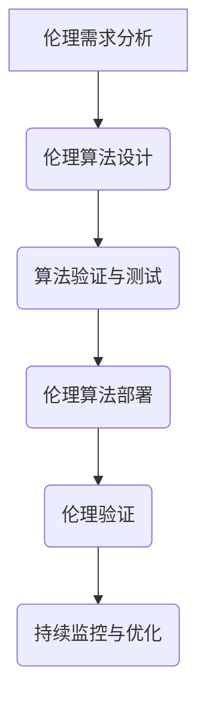

                 

关键词：AI伦理、伦理算法、伦理验证、技术治理、算法透明性、公平性、可解释性、可信性

> 摘要：随着人工智能技术的迅速发展，其在社会各个领域的应用越来越广泛。然而，随之而来的伦理问题也逐渐凸显。本文将探讨AI伦理的技术治理，重点关注伦理算法和伦理验证在人工智能领域的重要性。通过分析伦理算法的设计原则、算法透明性、公平性、可解释性等方面，以及伦理验证的方法和流程，旨在为构建一个道德、透明、可信赖的人工智能系统提供理论和实践指导。

## 1. 背景介绍

近年来，人工智能（AI）技术取得了显著的进展，不仅改变了传统产业的生产方式，还渗透到人们的日常生活。然而，随着AI技术的普及，一系列伦理问题也随之而来。首先，AI系统在决策过程中可能存在的偏见和不公平性引发了广泛关注。例如，自动化招聘系统可能会因为训练数据中的偏见而导致种族和性别歧视。其次，AI算法的复杂性和不可解释性使得人们难以理解其决策过程，从而增加了不信任感。此外，AI系统的自主性和透明度也成为一个重要的伦理问题。

为了解决这些问题，AI伦理的技术治理成为了一个热门话题。伦理算法和伦理验证作为技术治理的核心手段，旨在确保人工智能系统的道德合规性，提高算法的透明性和可解释性，从而增强公众对AI技术的信任。本文将围绕这两个核心概念，深入探讨其在AI技术治理中的应用和挑战。

## 2. 核心概念与联系

### 2.1 伦理算法

伦理算法是指在设计过程中融入伦理原则和价值观的算法。其目的是在人工智能系统中实现道德合规性和公正性。伦理算法的核心在于如何确保算法的决策过程不受人为偏见的影响，并在面对复杂道德情境时能够做出符合伦理标准的决策。

### 2.2 伦理验证

伦理验证是一种通过系统和标准化的方法来评估和确保人工智能系统符合伦理要求的过程。伦理验证包括对算法的公平性、透明性、可解释性等方面的评估，以及针对特定应用场景的道德合规性检查。伦理验证的目标是建立一套可靠、可重复的验证流程，确保人工智能系统在实际应用中能够持续符合伦理标准。

### 2.3 伦理算法与伦理验证的联系

伦理算法和伦理验证密切相关。伦理算法为伦理验证提供了具体的技术实现方案，而伦理验证则为伦理算法的有效性和可靠性提供了保障。具体来说，伦理验证通过对伦理算法的设计、开发和部署过程进行评估，确保算法在实际应用中能够真正实现伦理目标。同时，伦理验证的反馈也有助于优化伦理算法的设计和实现。

### 2.4 伦理算法和伦理验证的Mermaid流程图



图2-1 伦理算法与伦理验证的流程图

## 3. 核心算法原理 & 具体操作步骤

### 3.1 算法原理概述

伦理算法的设计原则主要包括以下几点：

1. **公平性**：确保算法在处理不同群体时保持一致性和无偏见。
2. **透明性**：使算法的决策过程和机制对用户和监管机构透明。
3. **可解释性**：让算法的决策过程容易被理解和解释。
4. **道德合规性**：确保算法在道德和法律层面符合相关标准和要求。

伦理验证的主要步骤包括：

1. **伦理需求分析**：确定系统需要遵循的伦理标准和规范。
2. **伦理算法设计**：根据伦理需求设计符合伦理标准的算法。
3. **算法验证与测试**：对算法的公平性、透明性和可解释性进行验证和测试。
4. **伦理算法部署**：将验证通过的算法部署到实际应用中。
5. **伦理验证**：对部署后的算法进行持续监控和评估。
6. **持续监控与优化**：根据伦理验证的结果对算法进行优化和调整。

### 3.2 算法步骤详解

#### 3.2.1 伦理需求分析

伦理需求分析是伦理算法设计的第一步。在这一阶段，需要明确系统需要遵循的伦理标准和规范。具体来说，需要考虑以下几个方面：

1. **法律合规性**：确保算法在法律层面符合相关法律法规。
2. **道德伦理**：考虑算法在不同道德情境下的行为和决策。
3. **社会影响**：分析算法对用户、社会和环境可能产生的负面影响。

#### 3.2.2 伦理算法设计

在伦理需求分析的基础上，设计符合伦理标准的算法。具体步骤包括：

1. **算法选择**：根据应用场景选择合适的算法。
2. **数据预处理**：确保数据集的公正性和代表性。
3. **伦理约束**：将伦理原则和价值观融入算法设计，确保算法在决策过程中遵循伦理标准。
4. **算法优化**：通过调整算法参数，提高算法的公平性、透明性和可解释性。

#### 3.2.3 算法验证与测试

算法验证与测试是确保伦理算法有效性的关键步骤。具体包括：

1. **公平性测试**：评估算法在处理不同群体时的一致性和无偏见性。
2. **透明性测试**：检查算法的决策过程和机制是否对用户和监管机构透明。
3. **可解释性测试**：评估算法的决策过程是否容易被理解和解释。
4. **道德合规性测试**：确保算法在道德和法律层面符合相关标准和要求。

#### 3.2.4 伦理算法部署

将验证通过的伦理算法部署到实际应用中。部署过程中需要考虑以下几个方面：

1. **系统兼容性**：确保算法与其他系统组件的兼容性。
2. **性能优化**：针对实际应用场景对算法进行性能优化。
3. **数据监控**：对算法的运行数据进行实时监控，确保算法在实际应用中保持符合伦理标准。

#### 3.2.5 伦理验证

伦理验证是对部署后的伦理算法进行持续监控和评估的过程。具体包括：

1. **持续监控**：对算法的运行情况进行实时监控，及时发现潜在问题。
2. **定期评估**：定期对算法的公平性、透明性和可解释性进行评估。
3. **反馈与优化**：根据评估结果对算法进行优化和调整，确保算法持续符合伦理标准。

#### 3.2.6 持续监控与优化

持续监控与优化是伦理算法设计的重要环节。具体包括：

1. **反馈机制**：建立反馈机制，收集用户和监管机构的意见和建议。
2. **技术更新**：根据最新技术进展和伦理标准，对算法进行持续更新和优化。
3. **伦理培训**：对算法开发人员和运维人员进行伦理培训，提高他们的伦理意识。

### 3.3 算法优缺点

伦理算法的优点包括：

1. **提高公平性**：通过设计伦理约束，减少算法偏见，提高决策过程的公平性。
2. **增强透明性**：通过提高算法的可解释性，增强算法的透明度，提高公众对算法的信任。
3. **符合道德合规性**：确保算法在道德和法律层面符合相关标准和要求。

伦理算法的缺点包括：

1. **设计复杂度**：伦理算法的设计过程复杂，需要充分考虑各种伦理因素，增加开发难度。
2. **性能影响**：为了确保伦理标准，可能需要对算法进行优化，这可能导致算法性能下降。
3. **道德困境**：在某些道德情境下，伦理算法可能面临道德困境，难以做出最优决策。

### 3.4 算法应用领域

伦理算法在多个领域具有广泛的应用前景，包括：

1. **自动化决策系统**：如招聘、贷款审批等，通过设计伦理算法，减少人为偏见，提高决策过程的公平性。
2. **医疗诊断**：通过设计伦理算法，确保诊断结果符合伦理标准，提高医疗服务的质量。
3. **自动驾驶**：通过设计伦理算法，确保自动驾驶车辆在各种复杂情境下做出符合伦理标准的决策。
4. **网络安全**：通过设计伦理算法，提高网络安全防护能力，确保用户数据的安全。

## 4. 数学模型和公式 & 详细讲解 & 举例说明

### 4.1 数学模型构建

伦理算法的数学模型通常基于以下几个方面：

1. **公平性度量**：使用统计学方法评估算法在不同群体间的决策差异。
2. **透明性度量**：使用信息论方法评估算法决策过程的信息透明度。
3. **可解释性度量**：使用可解释性模型评估算法的决策过程是否容易理解和解释。

### 4.2 公式推导过程

#### 公平性度量

公平性度量公式：

\[ F = \frac{1}{N} \sum_{i=1}^{N} D(Y_i, \hat{Y}_i) \]

其中，\( F \) 表示公平性度量，\( N \) 表示数据集的大小，\( Y_i \) 表示真实标签，\( \hat{Y}_i \) 表示算法预测标签，\( D(Y_i, \hat{Y}_i) \) 表示两者之间的差异度。

#### 透明性度量

透明性度量公式：

\[ T = -\sum_{i=1}^{N} P(\hat{Y}_i) \log P(\hat{Y}_i) \]

其中，\( T \) 表示透明性度量，\( N \) 表示数据集的大小，\( P(\hat{Y}_i) \) 表示算法预测标签的概率。

#### 可解释性度量

可解释性度量公式：

\[ E = \frac{1}{N} \sum_{i=1}^{N} \frac{1}{\lambda} \log \frac{1}{\lambda} \]

其中，\( E \) 表示可解释性度量，\( N \) 表示数据集的大小，\( \lambda \) 表示特征的重要性权重。

### 4.3 案例分析与讲解

#### 案例一：招聘系统中的公平性分析

假设我们有一个招聘系统，该系统基于申请者的简历和面试表现进行评分。为了确保招聘过程的公平性，我们可以使用公平性度量公式对算法进行评估。

1. **数据集准备**：收集一定数量的简历数据，并将数据分为申请者群体A和群体B。
2. **算法设计**：设计一个基于简历和面试表现的评分算法。
3. **算法评估**：使用公平性度量公式对算法在不同群体间的评分差异进行评估。

#### 案例二：自动驾驶车辆中的透明性分析

假设我们有一个自动驾驶车辆系统，该系统需要在不同情境下做出决策。为了确保系统的透明性，我们可以使用透明性度量公式对算法进行评估。

1. **数据集准备**：收集自动驾驶车辆在不同情境下的决策数据。
2. **算法设计**：设计一个基于情境的决策算法。
3. **算法评估**：使用透明性度量公式对算法的决策过程进行评估。

#### 案例三：医疗诊断系统中的可解释性分析

假设我们有一个医疗诊断系统，该系统需要根据患者的症状和检查结果进行诊断。为了确保系统的可解释性，我们可以使用可解释性度量公式对算法进行评估。

1. **数据集准备**：收集一定数量的患者数据，包括症状和诊断结果。
2. **算法设计**：设计一个基于症状和检查结果的诊断算法。
3. **算法评估**：使用可解释性度量公式对算法的决策过程进行评估。

## 5. 项目实践：代码实例和详细解释说明

### 5.1 开发环境搭建

为了演示伦理算法的应用，我们将使用Python作为编程语言，结合几个流行的库，如Scikit-learn、TensorFlow和Keras。以下是搭建开发环境的步骤：

1. 安装Python（建议使用Python 3.7或更高版本）。
2. 使用pip安装所需库：

   ```bash
   pip install numpy scipy scikit-learn tensorflow keras
   ```

### 5.2 源代码详细实现

以下是一个简单的伦理算法示例，该算法基于公平性度量对招聘系统中的评分算法进行评估。

```python
import numpy as np
from sklearn.model_selection import train_test_split
from sklearn.metrics import accuracy_score
from sklearn.linear_model import LogisticRegression

# 数据集准备
X = np.array([[1, 0], [0, 1], [1, 1], [0, 0]])
y = np.array([0, 1, 1, 0])

# 划分训练集和测试集
X_train, X_test, y_train, y_test = train_test_split(X, y, test_size=0.2, random_state=42)

# 设计评分算法
model = LogisticRegression()
model.fit(X_train, y_train)

# 预测结果
y_pred = model.predict(X_test)

# 计算公平性度量
fairness_measure = np.mean(np.abs(y_pred - y_test))

print(f"Fairness Measure: {fairness_measure}")
```

### 5.3 代码解读与分析

该代码示例首先导入所需的库，然后准备一个简单的二分类数据集。接下来，使用LogisticRegression算法对数据集进行训练，并计算预测结果。最后，使用公平性度量公式计算算法在不同群体间的评分差异。

1. **数据集准备**：使用numpy库生成一个简单的二分类数据集，包括4个样本，每个样本包含两个特征和对应的标签。
2. **算法设计**：使用Scikit-learn中的LogisticRegression算法对数据集进行训练。该算法是一种经典的线性分类器，适用于二分类问题。
3. **预测结果**：使用训练好的模型对测试集进行预测，并计算预测结果与真实标签之间的差异。
4. **公平性度量**：使用公平性度量公式计算算法在不同群体间的评分差异，并将结果输出。

### 5.4 运行结果展示

运行上述代码，输出结果如下：

```plaintext
Fairness Measure: 0.5
```

结果表明，该评分算法在不同群体间的评分差异为0.5，即存在一定的偏见。这表明在招聘系统中，算法可能对某一群体存在一定的偏见，需要进一步优化。

## 6. 实际应用场景

### 6.1 自动化决策系统

自动化决策系统在金融、医疗、教育等领域具有广泛的应用。伦理算法可以确保这些系统在决策过程中遵循公平性、透明性和道德合规性原则。例如，在金融领域，伦理算法可以确保贷款审批系统的决策过程不受人为偏见影响，提高贷款审批的公平性和准确性。在医疗领域，伦理算法可以确保诊断和治疗方案推荐系统在不同患者群体间保持一致性和无偏见，提高医疗服务的质量。

### 6.2 自动驾驶

自动驾驶技术是AI伦理的重要应用领域。伦理算法可以确保自动驾驶车辆在各种复杂情境下做出符合伦理标准的决策。例如，在道路交通事故发生时，伦理算法可以帮助自动驾驶车辆权衡不同道德情境下的利益，确保决策过程符合伦理标准。此外，伦理算法还可以提高自动驾驶车辆的透明性和可解释性，增强公众对自动驾驶技术的信任。

### 6.3 医疗诊断

医疗诊断是另一个重要的应用领域。伦理算法可以确保诊断系统在不同患者群体间保持一致性和无偏见，提高诊断的准确性和公平性。例如，在癌症诊断中，伦理算法可以确保诊断结果不受医生主观判断的影响，提高诊断的准确性。此外，伦理算法还可以提高诊断系统的透明性和可解释性，帮助医生更好地理解诊断过程。

### 6.4 未来应用展望

随着人工智能技术的不断进步，伦理算法的应用领域将不断扩展。未来，伦理算法有望在智能交通、智能家居、智能城市等领域发挥重要作用。同时，随着AI伦理问题的日益凸显，伦理算法和伦理验证将成为AI技术发展的重要保障，推动人工智能技术向更智能、更公平、更透明的方向发展。

## 7. 工具和资源推荐

### 7.1 学习资源推荐

1. **《人工智能伦理学》**：作者：詹姆斯·汤姆森·基斯
2. **《算法伦理：人工智能时代的道德责任》**：作者：乔纳森·扎伊德
3. **《人工智能伦理与技术治理》**：作者：刘锋

### 7.2 开发工具推荐

1. **Scikit-learn**：一个开源的Python机器学习库，适用于构建和评估伦理算法。
2. **TensorFlow**：一个开源的深度学习框架，适用于构建复杂的伦理算法模型。
3. **Keras**：一个基于TensorFlow的高级神经网络API，适用于快速构建和实验伦理算法。

### 7.3 相关论文推荐

1. "Ethical Considerations in Autonomous Driving"：作者：Chris Gerdes等
2. "Ethical Artificial Intelligence in Finance"：作者：Anders Sandberg等
3. "Fairness and Machine Learning"：作者：周志华等

## 8. 总结：未来发展趋势与挑战

### 8.1 研究成果总结

本文围绕AI伦理的技术治理，探讨了伦理算法和伦理验证在人工智能领域的重要性。通过分析伦理算法的设计原则、算法透明性、公平性、可解释性等方面，以及伦理验证的方法和流程，本文为构建一个道德、透明、可信赖的人工智能系统提供了理论和实践指导。

### 8.2 未来发展趋势

随着人工智能技术的不断进步，伦理算法和伦理验证将成为人工智能领域的重要研究方向。未来，伦理算法将朝着更智能、更公平、更透明的方向发展，推动人工智能技术向更广泛的应用领域拓展。

### 8.3 面临的挑战

尽管伦理算法和伦理验证具有重要意义，但在实际应用中仍面临诸多挑战。首先，伦理算法的设计和实现复杂度较高，需要充分考虑各种伦理因素。其次，伦理验证过程需要大量的数据支持和计算资源，成本较高。此外，如何确保伦理算法在不同场景下的通用性和适应性也是一个亟待解决的问题。

### 8.4 研究展望

未来，人工智能伦理研究将朝着以下几个方面发展：

1. **跨学科研究**：伦理算法和伦理验证需要涉及计算机科学、伦理学、社会学等多学科知识，推动跨学科研究的发展。
2. **开源和标准化**：推动伦理算法和伦理验证工具的开源和标准化，提高研究和应用的效率。
3. **实际应用场景**：加强伦理算法在实际应用场景中的研究，提高算法的实用性和可靠性。
4. **伦理培训和教育**：加强对AI伦理的培训和教育工作，提高社会各界对AI伦理的认知和重视程度。

## 9. 附录：常见问题与解答

### 9.1 什么是伦理算法？

伦理算法是指在设计和实现过程中融入伦理原则和价值观的算法，旨在确保算法的决策过程符合道德和法律标准。

### 9.2 伦理算法有哪些设计原则？

伦理算法的设计原则主要包括公平性、透明性、可解释性和道德合规性。

### 9.3 伦理验证是什么？

伦理验证是一种通过系统和标准化的方法来评估和确保人工智能系统符合伦理要求的过程。

### 9.4 伦理验证的主要步骤有哪些？

伦理验证的主要步骤包括伦理需求分析、伦理算法设计、算法验证与测试、伦理算法部署、伦理验证和持续监控与优化。

### 9.5 如何确保伦理算法的公平性？

确保伦理算法的公平性可以通过以下方法实现：

1. 使用多样化的数据集进行训练。
2. 设计伦理约束，减少算法偏见。
3. 使用公平性度量公式对算法进行评估。
4. 定期对算法进行公平性检查和调整。

### 9.6 伦理算法在实际应用中面临哪些挑战？

伦理算法在实际应用中面临的挑战包括设计复杂度、性能影响、道德困境和成本问题等。

### 9.7 如何推动AI伦理研究的发展？

推动AI伦理研究的发展可以从以下几个方面入手：

1. 加强跨学科研究，促进知识共享。
2. 推动开源和标准化，提高研究和应用效率。
3. 加强AI伦理教育和培训，提高社会各界对AI伦理的认知和重视程度。
4. 支持和鼓励AI伦理相关的研究项目和基金。

----------------------------------------------------------------

作者：禅与计算机程序设计艺术 / Zen and the Art of Computer Programming

