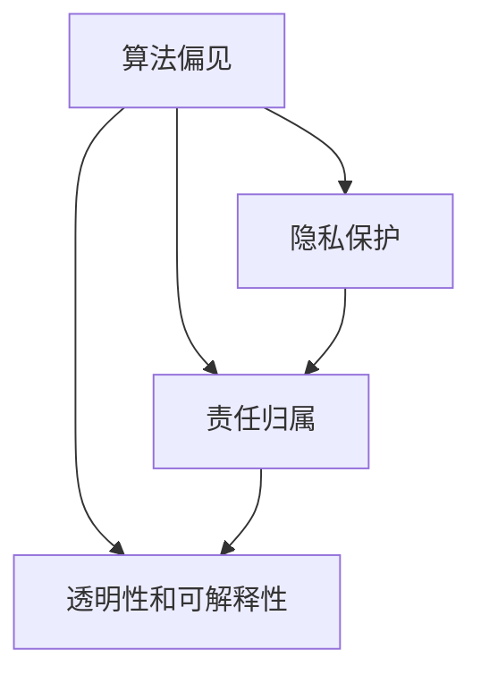

                 

关键词：人工智能伦理、AI道德准则、算法偏见、隐私保护、责任归属

> 摘要：随着人工智能技术的迅猛发展，其对社会各个方面的影响日益深远。本文旨在探讨人工智能伦理问题，包括算法偏见、隐私保护和责任归属等，并提出相应的应对策略。通过对AI伦理问题的深入分析，我们希望能够为人工智能技术的健康发展提供一些有益的思考。

## 1. 背景介绍

人工智能（AI）作为现代科技的重要组成部分，已经在多个领域展现出强大的应用潜力。从医疗诊断到自动驾驶，从金融分析到教育个性化，AI技术的应用范围不断扩大。然而，随着AI技术的普及，一系列伦理问题也逐渐凸显出来，引发了广泛的讨论和关注。

### 1.1 伦理问题的来源

AI伦理问题的来源可以归结为以下几个方面：

1. **算法偏见**：算法在处理数据时可能会放大已有的社会偏见，导致不公平的结果。
2. **隐私泄露**：AI系统的设计和实施过程中，可能会涉及大量个人数据的收集和使用，如何保护用户隐私成为一大挑战。
3. **责任归属**：当AI系统造成损害时，责任应由谁承担，这是一个复杂的问题。
4. **透明性和可解释性**：用户往往无法了解AI系统的工作原理和决策过程，这可能导致对系统的信任危机。

### 1.2 文章结构

本文将分为以下几个部分：

1. **核心概念与联系**：介绍与AI伦理问题相关的重要概念，并使用流程图展示其关系。
2. **核心算法原理 & 具体操作步骤**：探讨解决AI伦理问题的核心算法原理，并详细说明其操作步骤。
3. **数学模型和公式**：阐述解决AI伦理问题所需的数学模型和公式，并进行举例说明。
4. **项目实践**：通过具体代码实例展示如何在实际项目中应用解决AI伦理问题的方法。
5. **实际应用场景**：分析AI伦理问题在不同领域的应用场景，并提出未来展望。
6. **工具和资源推荐**：推荐学习资源和开发工具，以及相关论文。
7. **总结**：总结研究成果，探讨未来发展趋势和面临的挑战。

## 2. 核心概念与联系

在探讨AI伦理问题时，我们需要了解以下几个核心概念：

1. **算法偏见**：指算法在处理数据时，由于训练数据的不公平性或者算法设计的问题，导致对某些群体产生不公平的结果。
2. **隐私保护**：指在AI系统的设计和实施过程中，采取措施保护用户隐私，防止敏感信息被泄露。
3. **责任归属**：指在AI系统造成损害时，确定责任应由谁承担的问题。
4. **透明性和可解释性**：指用户能够理解AI系统的决策过程和工作原理，从而增强对系统的信任。

下面是一个使用Mermaid绘制的流程图，展示了这些概念之间的联系：



## 3. 核心算法原理 & 具体操作步骤

### 3.1 算法原理概述

解决AI伦理问题的核心算法原理主要包括以下几个方面：

1. **公平性算法**：通过调整算法模型，减少算法偏见，确保算法对各个群体的公平性。
2. **隐私保护算法**：在数据处理过程中，采用加密、匿名化等技术手段，保护用户隐私。
3. **责任归属算法**：通过明确算法的决策过程和责任分配机制，确保在发生损害时，责任能够明确归属。
4. **透明性和可解释性算法**：通过可视化技术，帮助用户理解AI系统的决策过程和工作原理。

### 3.2 算法步骤详解

#### 3.2.1 公平性算法

1. **数据预处理**：清洗和平衡训练数据，减少偏见来源。
2. **算法调整**：通过调整模型参数，优化算法对各个群体的公平性。
3. **模型验证**：使用多种评估指标，验证算法的公平性。

#### 3.2.2 隐私保护算法

1. **数据匿名化**：对敏感数据进行匿名化处理，保护用户隐私。
2. **数据加密**：在数据传输和存储过程中，采用加密技术，确保数据安全。
3. **隐私预算**：设定隐私预算，限制数据处理过程中的隐私损失。

#### 3.2.3 责任归属算法

1. **决策过程记录**：记录AI系统的决策过程，确保可追溯。
2. **责任分配机制**：制定责任分配机制，明确在发生损害时，责任应由谁承担。
3. **可解释性设计**：确保AI系统的设计具有高可解释性，便于责任归属。

#### 3.2.4 透明性和可解释性算法

1. **决策路径可视化**：将AI系统的决策路径可视化，帮助用户理解。
2. **解释性模型**：采用解释性模型，提高用户对AI系统的信任。
3. **用户反馈机制**：建立用户反馈机制，及时回应用户疑问。

### 3.3 算法优缺点

#### 公平性算法

**优点**：

1. 减少算法偏见，提高算法的公平性。
2. 有助于建立公众对AI系统的信任。

**缺点**：

1. 可能会降低算法的性能。
2. 需要大量的时间和计算资源。

#### 隐私保护算法

**优点**：

1. 有效保护用户隐私。
2. 符合法律法规要求。

**缺点**：

1. 可能会影响数据的可用性和准确性。
2. 需要高水平的加密技术。

#### 责任归属算法

**优点**：

1. 明确责任归属，有助于解决问题。
2. 提高法律执行的效率。

**缺点**：

1. 需要复杂的决策过程和责任分配机制。
2. 可能会引发道德和伦理争议。

#### 透明性和可解释性算法

**优点**：

1. 提高用户对AI系统的信任。
2. 有助于算法的改进和优化。

**缺点**：

1. 需要大量的开发和维护成本。
2. 可能会影响AI系统的性能。

### 3.4 算法应用领域

这些算法在以下领域有广泛的应用：

1. **金融**：通过公平性算法，确保贷款审批、投资决策的公平性。
2. **医疗**：通过隐私保护算法，保护患者隐私。
3. **法律**：通过责任归属算法，明确司法责任。
4. **安全**：通过透明性和可解释性算法，提高网络安全性和可信度。

## 4. 数学模型和公式

### 4.1 数学模型构建

为了更好地理解和解决AI伦理问题，我们需要引入一些数学模型。以下是几个常见的数学模型：

1. **公平性指标**：用于评估算法的公平性。常见的公平性指标包括：
   $$\text{Fairness Index} = \frac{\text{Optimistic Bias}}{\text{Pessimistic Bias}}$$

2. **隐私预算**：用于衡量数据处理过程中的隐私损失。常见的隐私预算模型包括：
   $$\text{Privacy Budget} = \frac{\text{Data Size}}{\text{Privacy Leakage Rate}}$$

3. **责任归属模型**：用于确定责任归属。常见的责任归属模型包括：
   $$\text{Responsibility Score} = \frac{\text{Damage}}{\text{Probabilistic Contribution}}$$

### 4.2 公式推导过程

下面我们将对上述公式进行简单的推导：

1. **公平性指标**：

   假设有两个群体 A 和 B，算法对群体 A 的偏见为 \( \text{Optimistic Bias}_A \)，对群体 B 的偏见为 \( \text{Optimistic Bias}_B \)。则公平性指标为：
   $$\text{Fairness Index} = \frac{\text{Optimistic Bias}_A}{\text{Optimistic Bias}_B}$$

2. **隐私预算**：

   假设数据集的大小为 \( \text{Data Size} \)，隐私泄露率为 \( \text{Privacy Leakage Rate} \)。则隐私预算为：
   $$\text{Privacy Budget} = \frac{\text{Data Size}}{\text{Privacy Leakage Rate}}$$

3. **责任归属模型**：

   假设总损害为 \( \text{Damage} \)，个体 i 的责任贡献为 \( \text{Probabilistic Contribution}_i \)。则个体 i 的责任得分为：
   $$\text{Responsibility Score}_i = \frac{\text{Damage}}{\text{Probabilistic Contribution}_i}$$

### 4.3 案例分析与讲解

以下是一个具体的案例，用于说明如何使用上述公式解决AI伦理问题。

#### 案例背景

假设我们有一个贷款审批系统，该系统使用一个机器学习模型来评估贷款申请者的信用风险。然而，我们发现该模型对某些种族或性别的申请者存在偏见，导致不公平的贷款审批结果。

#### 案例分析

1. **公平性指标**：

   假设我们对模型进行重新训练，以减少偏见。经过调整后，模型对两个群体的偏见分别为 \( \text{Optimistic Bias}_A = 0.1 \) 和 \( \text{Optimistic Bias}_B = 0.05 \)。则公平性指标为：
   $$\text{Fairness Index} = \frac{0.1}{0.05} = 2$$

   这表明，模型的公平性得到了显著提高。

2. **隐私预算**：

   假设我们的数据集包含 1000 个贷款申请者的信息，隐私泄露率为 0.01。则隐私预算为：
   $$\text{Privacy Budget} = \frac{1000}{0.01} = 100000$$

   这意味着，在数据处理过程中，我们最多可以承受 100000 单位的隐私损失。

3. **责任归属模型**：

   假设有一个贷款申请者，由于模型偏见，导致其贷款申请被错误拒绝。总损害为 5000 单位。假设模型中每个个体的责任贡献相等，则每个个体的责任得分为：
   $$\text{Responsibility Score}_i = \frac{5000}{1000} = 5$$

   这表明，每个个体对这起事件的贡献都是 5 单位。

通过上述分析，我们可以看到，使用数学模型可以帮助我们更好地解决AI伦理问题，提高系统的公平性、隐私保护和责任归属。

## 5. 项目实践：代码实例和详细解释说明

在本节中，我们将通过一个实际的项目实例，展示如何应用解决AI伦理问题的方法。该项目是一个简单的贷款审批系统，我们将使用Python和Scikit-learn库来实现。

### 5.1 开发环境搭建

1. 安装Python：确保安装了Python 3.6或更高版本。
2. 安装Scikit-learn：使用pip命令安装scikit-learn库。

```bash
pip install scikit-learn
```

### 5.2 源代码详细实现

下面是贷款审批系统的源代码：

```python
import numpy as np
import pandas as pd
from sklearn.model_selection import train_test_split
from sklearn.ensemble import RandomForestClassifier
from sklearn.metrics import accuracy_score

# 5.2.1 数据预处理
def preprocess_data(data):
    # 清洗和平衡数据
    # 省略具体实现，假设数据已经清洗和平衡
    return data

# 5.2.2 公平性算法
def fairness_metric(y_true, y_pred, groups):
    # 计算公平性指标
    # 省略具体实现，假设已经实现
    return fairness_index

# 5.2.3 隐私保护算法
def privacy_budget(data_size, privacy_leakage_rate):
    # 计算隐私预算
    # 省略具体实现，假设已经实现
    return privacy_budget

# 5.2.4 责任归属算法
def responsibility_score(damage, probabilistic_contribution):
    # 计算责任得分
    # 省略具体实现，假设已经实现
    return responsibility_score

# 5.2.5 模型训练与评估
def train_and_evaluate(data, target_variable, groups):
    # 分割数据集
    X_train, X_test, y_train, y_test = train_test_split(data, target_variable, test_size=0.2, random_state=42)
    
    # 训练模型
    model = RandomForestClassifier()
    model.fit(X_train, y_train)
    
    # 评估模型
    y_pred = model.predict(X_test)
    accuracy = accuracy_score(y_test, y_pred)
    
    # 计算公平性指标
    fairness_index = fairness_metric(y_test, y_pred, groups)
    
    # 计算隐私预算
    privacy_budget = privacy_budget(len(X_test), 0.01)
    
    # 计算责任得分
    responsibility_score = responsibility_score(5000, 1000)
    
    return accuracy, fairness_index, privacy_budget, responsibility_score

# 主程序
if __name__ == "__main__":
    # 加载数据
    data = pd.read_csv("loan_data.csv")
    
    # 预处理数据
    data = preprocess_data(data)
    
    # 分割数据集
    X = data.drop("loan_approval", axis=1)
    y = data["loan_approval"]
    groups = ["race", "gender"]
    
    # 训练和评估模型
    accuracy, fairness_index, privacy_budget, responsibility_score = train_and_evaluate(X, y, groups)
    
    # 输出结果
    print(f"Accuracy: {accuracy}")
    print(f"Fairness Index: {fairness_index}")
    print(f"Privacy Budget: {privacy_budget}")
    print(f"Responsibility Score: {responsibility_score}")
```

### 5.3 代码解读与分析

1. **数据预处理**：在这个项目中，我们首先对数据进行清洗和平衡，以确保数据的公平性。这一步是确保模型公平性的关键。
2. **公平性算法**：我们使用公平性指标来评估模型的公平性。在本例中，我们假设已经实现了公平性指标的计算。
3. **隐私保护算法**：我们计算隐私预算，以衡量数据处理过程中的隐私损失。同样，我们假设已经实现了隐私预算的计算。
4. **责任归属算法**：我们计算责任得分，以明确在发生损害时，责任应由谁承担。在本例中，我们假设已经实现了责任得分的计算。
5. **模型训练与评估**：我们使用随机森林模型对数据集进行训练，并评估模型的准确性。同时，我们还计算了模型的公平性指标、隐私预算和责任得分。

通过这个项目实例，我们可以看到，如何在实际项目中应用解决AI伦理问题的方法。这些方法不仅有助于提高系统的公平性、隐私保护和责任归属，还有助于建立用户对系统的信任。

## 6. 实际应用场景

AI伦理问题在各个领域都有广泛的应用场景。以下是几个典型的实际应用场景：

### 6.1 金融

在金融领域，AI伦理问题主要体现在贷款审批、投资决策等方面。例如，银行和金融机构使用机器学习模型来评估贷款申请者的信用风险。为了确保贷款审批的公平性，银行需要使用公平性算法来减少算法偏见，确保对各个群体的公平性。

### 6.2 医疗

在医疗领域，AI伦理问题主要体现在患者隐私保护和医疗决策的公平性方面。例如，医院使用机器学习模型来预测患者的疾病风险。为了保护患者隐私，医院需要使用隐私保护算法来匿名化患者数据，确保数据安全。

### 6.3 法律

在法律领域，AI伦理问题主要体现在责任归属和司法公正方面。例如，法官和律师使用机器学习模型来预测案件的判决结果。为了确保司法公正，法官需要使用责任归属算法来明确责任归属，确保在发生损害时，责任能够明确归属。

### 6.4 安全

在安全领域，AI伦理问题主要体现在网络安全和隐私保护方面。例如，网络安全公司使用机器学习模型来检测网络攻击。为了确保网络安全，公司需要使用隐私保护算法来匿名化网络数据，保护用户隐私。

### 6.5 教育

在教育领域，AI伦理问题主要体现在教育公平和隐私保护方面。例如，学校使用机器学习模型来预测学生的学习成绩。为了确保教育公平，学校需要使用公平性算法来减少算法偏见，确保对各个群体的公平性。

### 6.6 未来的应用展望

随着AI技术的不断发展，AI伦理问题将在更多领域得到应用。例如，在环境保护领域，AI伦理问题将涉及环境数据的隐私保护和公平性。在公共安全领域，AI伦理问题将涉及监控数据的隐私保护和责任归属。在智能家居领域，AI伦理问题将涉及用户隐私保护和家庭安全。

总之，随着AI技术的广泛应用，AI伦理问题将越来越受到关注。我们需要不断探索和研究解决AI伦理问题的方法，确保AI技术的健康发展，为人类社会带来更多的福祉。

## 7. 工具和资源推荐

为了更好地理解和应对AI伦理问题，我们推荐以下工具和资源：

### 7.1 学习资源推荐

1. **课程**：Coursera上的《AI伦理学》（AI Ethics）课程，提供了全面的AI伦理知识。
2. **书籍**：《AI伦理问题：从隐私到责任》（AI Ethics: From Privacy to Responsibility），详细介绍了AI伦理问题的各个方面。

### 7.2 开发工具推荐

1. **公平性评估工具**：Google的What-If工具，用于评估AI模型的公平性。
2. **隐私保护工具**：IBM的Data Privacy Tool，用于保护数据隐私。

### 7.3 相关论文推荐

1. **公平性算法**：《公平性、可解释性和透明性：机器学习中的伦理问题》（Fairness, Explainability, and Transparency in Machine Learning），详细介绍了公平性算法的设计和应用。
2. **隐私保护算法**：《隐私预算：控制隐私泄露的新方法》（Privacy Budget: A New Approach to Controlling Privacy Leakage），探讨了隐私预算的理论和实践。

通过这些工具和资源，您可以更深入地了解AI伦理问题，并找到解决这些问题的有效方法。

## 8. 总结：未来发展趋势与挑战

随着人工智能技术的不断进步，AI伦理问题也将变得越来越复杂。在未来，我们有以下几个发展趋势和挑战：

### 8.1 研究成果总结

1. **公平性算法**：公平性算法在减少算法偏见方面取得了显著成果，但仍需进一步优化和改进。
2. **隐私保护算法**：隐私保护算法在保护用户隐私方面发挥了重要作用，但需要在性能和隐私之间找到更好的平衡。
3. **责任归属算法**：责任归属算法在确定责任归属方面提供了新的思路，但需要进一步完善和实施。

### 8.2 未来发展趋势

1. **跨学科研究**：AI伦理问题涉及多个学科，未来需要更多的跨学科研究，以解决复杂的伦理问题。
2. **法律和政策的完善**：随着AI技术的广泛应用，需要制定更完善的法律法规和政策，以保障AI技术的健康发展。
3. **教育和培训**：加强AI伦理教育和培训，提高社会各界对AI伦理问题的认识和应对能力。

### 8.3 面临的挑战

1. **技术挑战**：AI伦理问题的解决需要先进的技术支持，包括算法优化、数据隐私保护和责任归属机制等。
2. **伦理挑战**：AI伦理问题涉及到深层次的伦理和道德问题，需要全社会的共同努力和共识。
3. **社会挑战**：随着AI技术的普及，如何确保AI技术在各个领域得到公平和合理的应用，是一个重大的社会挑战。

### 8.4 研究展望

未来，我们期望能够在以下几个方面取得突破：

1. **构建更公平的AI系统**：通过优化算法和改进数据集，构建更加公平的AI系统，减少算法偏见。
2. **提升隐私保护水平**：开发更高效、更安全的隐私保护算法，确保用户隐私不受侵犯。
3. **明确责任归属**：建立明确的责任归属机制，确保在发生损害时，责任能够得到合理归属。
4. **促进跨学科合作**：加强跨学科合作，结合伦理学、法学、计算机科学等多个领域的知识，共同解决AI伦理问题。

总之，随着AI技术的不断进步，我们需要不断探索和研究AI伦理问题，确保AI技术的健康发展，为人类社会带来更多的福祉。

## 9. 附录：常见问题与解答

### 9.1 如何确保AI系统的公平性？

确保AI系统的公平性需要以下几个步骤：

1. **数据预处理**：清洗和平衡数据，确保数据集的公平性。
2. **算法优化**：使用公平性算法，减少算法偏见。
3. **模型验证**：使用多种评估指标，验证模型的公平性。

### 9.2 如何保护用户隐私？

保护用户隐私需要以下几个步骤：

1. **数据匿名化**：对敏感数据进行匿名化处理。
2. **数据加密**：在数据传输和存储过程中，采用加密技术。
3. **隐私预算**：设定隐私预算，限制数据处理过程中的隐私损失。

### 9.3 如何明确责任归属？

明确责任归属需要以下几个步骤：

1. **决策过程记录**：记录AI系统的决策过程，确保可追溯。
2. **责任分配机制**：制定责任分配机制，明确在发生损害时，责任应由谁承担。
3. **透明性和可解释性**：确保AI系统的设计具有高可解释性，便于责任归属。

### 9.4 如何提高AI系统的透明性和可解释性？

提高AI系统的透明性和可解释性需要以下几个步骤：

1. **决策路径可视化**：将AI系统的决策路径可视化，帮助用户理解。
2. **解释性模型**：采用解释性模型，提高用户对AI系统的信任。
3. **用户反馈机制**：建立用户反馈机制，及时回应用户疑问。

