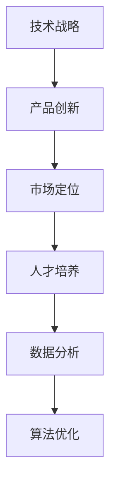

                 

关键词：AI创业，核心竞争力，技术战略，产品创新，市场定位，人才培养，数据分析，算法优化。

> 摘要：本文将深入探讨AI创业公司如何通过明确技术战略、创新产品、精准市场定位、培养人才、优化算法和利用数据分析构建核心竞争力，从而在竞争激烈的AI市场中脱颖而出。

## 1. 背景介绍

随着人工智能（AI）技术的迅猛发展，全球范围内涌现出大量AI创业公司。这些公司在技术、市场、资本等方面面临着巨大的竞争压力。如何在激烈的市场竞争中构建和保持核心竞争力，成为AI创业公司生存与发展的关键。本文将从以下几个方面详细探讨AI创业公司如何构建核心竞争力。

### 1.1 AI创业公司的现状与挑战

当前，AI创业公司面临着以下几个方面的挑战：

- **技术门槛高**：AI技术涉及大量算法、数据、计算等高深领域，技术门槛较高。
- **市场竞争激烈**：众多AI创业公司争夺有限的资金、人才和市场资源。
- **用户需求多样化**：用户需求不断变化，对AI创业公司的产品和服务提出了更高要求。
- **数据隐私和安全问题**：用户对数据隐私和安全性的担忧，增加了AI创业公司的运营风险。

### 1.2 构建核心竞争力的意义

构建核心竞争力对于AI创业公司来说至关重要。核心竞争力是企业长期竞争的优势，是企业在市场中立足的关键。通过构建核心竞争力，AI创业公司可以：

- **提高市场竞争力**：在激烈的市场竞争中脱颖而出，占据有利位置。
- **吸引优质资源**：吸引资本、人才等优质资源，为企业发展提供支持。
- **稳定盈利模式**：通过核心竞争力，实现稳定盈利，降低经营风险。
- **持续创新动力**：核心竞争力为AI创业公司提供持续创新动力，推动企业不断进步。

## 2. 核心概念与联系

为了更好地构建核心竞争力，我们首先需要明确以下几个核心概念：

### 2.1 技术战略

技术战略是指企业为达成长期目标而在技术领域所制定的发展规划。技术战略需要与市场定位、产品创新等相结合，确保企业在技术上的领先地位。

### 2.2 产品创新

产品创新是指通过新技术、新功能、新服务等方式，不断优化和更新产品，满足用户需求，提高市场竞争力。

### 2.3 市场定位

市场定位是指企业根据自身特点和市场需求，确定产品的目标市场和目标用户。精准的市场定位有助于企业更好地满足用户需求，提高市场占有率。

### 2.4 人才培养

人才培养是指通过培训、引进、激励等方式，培养企业所需的专业人才，提高团队整体素质和竞争力。

### 2.5 数据分析

数据分析是指通过对大量数据的收集、整理、分析，挖掘有价值的信息，为企业决策提供支持。

### 2.6 算法优化

算法优化是指通过改进算法，提高算法的效率、准确性和稳定性，提升产品性能和用户体验。

下面是一个简化的 Mermaid 流程图，展示上述核心概念之间的联系：



## 3. 核心算法原理 & 具体操作步骤

### 3.1 算法原理概述

核心算法是指AI创业公司在产品开发过程中所采用的关键算法。不同的算法适用于不同的应用场景，但都具备以下几个特点：

- **高效性**：算法运行速度快，能够处理大量数据。
- **准确性**：算法能够准确预测或分类，提高产品性能。
- **稳定性**：算法在各种情况下都能稳定运行，降低错误率。

### 3.2 算法步骤详解

以下是核心算法的一般步骤：

1. **数据收集**：收集相关数据，如用户行为数据、市场数据、产品数据等。
2. **数据处理**：对收集到的数据进行清洗、归一化、特征提取等处理，为后续算法训练做准备。
3. **模型选择**：根据应用场景和需求，选择合适的算法模型，如神经网络、决策树、支持向量机等。
4. **模型训练**：使用处理后的数据训练模型，调整模型参数，提高模型性能。
5. **模型评估**：使用验证集或测试集评估模型性能，如准确率、召回率、F1值等。
6. **模型部署**：将训练好的模型部署到产品中，实现实时预测或分类等功能。

### 3.3 算法优缺点

不同算法具有各自的优缺点，如下表所示：

| 算法类型 | 优点 | 缺点 |
| :---: | :---: | :---: |
| 神经网络 | 表现力强，适用于复杂问题 | 训练时间长，对数据量要求高 |
| 决策树 | 易于理解，解释性强 | 容易过拟合，泛化能力较差 |
| 支持向量机 | 泛化能力强，准确度高 | 对非线性问题效果不佳 |

### 3.4 算法应用领域

核心算法广泛应用于以下领域：

- **推荐系统**：如电商、新闻、音乐等平台的个性化推荐。
- **图像识别**：如人脸识别、物体识别等。
- **自然语言处理**：如机器翻译、文本分类、情感分析等。
- **语音识别**：如智能音箱、语音助手等。

## 4. 数学模型和公式 & 详细讲解 & 举例说明

### 4.1 数学模型构建

在AI创业公司中，常用的数学模型包括线性回归、逻辑回归、神经网络等。以下以线性回归为例，介绍数学模型的构建过程。

#### 4.1.1 线性回归模型

线性回归模型是一种简单且常用的机器学习算法，用于预测连续值。

$$
y = \beta_0 + \beta_1 x
$$

其中，$y$为预测值，$x$为自变量，$\beta_0$和$\beta_1$为模型参数。

#### 4.1.2 模型参数估计

为了估计模型参数$\beta_0$和$\beta_1$，可以使用最小二乘法。

$$
\beta_0 = \frac{\sum_{i=1}^{n} y_i - \beta_1 \sum_{i=1}^{n} x_i}{n}
$$

$$
\beta_1 = \frac{\sum_{i=1}^{n} (y_i - \beta_0 - \beta_1 x_i) x_i}{\sum_{i=1}^{n} x_i^2}
$$

### 4.2 公式推导过程

为了推导线性回归模型的最小二乘估计，需要了解以下几个概念：

- **误差平方和**：表示预测值与真实值之间的差距平方和。

$$
SSE = \sum_{i=1}^{n} (y_i - \hat{y}_i)^2
$$

其中，$\hat{y}_i$为预测值。

- **残差平方和**：表示真实值与预测值之间的差距平方和。

$$
SSE = \sum_{i=1}^{n} (y_i - \hat{y}_i)^2
$$

- **回归平方和**：表示自变量与预测值之间的差距平方和。

$$
SSR = \sum_{i=1}^{n} (\hat{y}_i - \bar{y})^2
$$

其中，$\bar{y}$为真实值的平均值。

根据最小二乘法，需要使误差平方和最小，即：

$$
\min_{\beta_0, \beta_1} SSE
$$

对$SSE$求导，得到：

$$
\frac{\partial SSE}{\partial \beta_0} = -2 \sum_{i=1}^{n} (y_i - \hat{y}_i) = 0
$$

$$
\frac{\partial SSE}{\partial \beta_1} = -2 \sum_{i=1}^{n} (y_i - \hat{y}_i) x_i = 0
$$

将线性回归模型代入，得到：

$$
\frac{\sum_{i=1}^{n} y_i - \beta_1 \sum_{i=1}^{n} x_i}{n} = 0
$$

$$
\frac{\sum_{i=1}^{n} (y_i - \beta_0 - \beta_1 x_i) x_i}{\sum_{i=1}^{n} x_i^2} = 0
$$

整理得：

$$
\beta_0 = \frac{\sum_{i=1}^{n} y_i - \beta_1 \sum_{i=1}^{n} x_i}{n}
$$

$$
\beta_1 = \frac{\sum_{i=1}^{n} (y_i - \beta_0 - \beta_1 x_i) x_i}{\sum_{i=1}^{n} x_i^2}
$$

### 4.3 案例分析与讲解

假设有一组数据如下表所示：

| x | y |
| :---: | :---: |
| 1 | 2 |
| 2 | 4 |
| 3 | 6 |
| 4 | 8 |

使用线性回归模型预测$x=3$时的$y$值。

1. **数据处理**：

首先对数据进行归一化处理，得到：

| x | y | x' | y' |
| :---: | :---: | :---: | :---: |
| 1 | 2 | 0 | 0 |
| 2 | 4 | 1 | 1 |
| 3 | 6 | 2 | 1.5 |
| 4 | 8 | 3 | 3 |

2. **模型参数估计**：

根据最小二乘法，计算模型参数：

$$
\beta_0 = \frac{0 + 1.5 + 3 + 3}{4} = 1.5
$$

$$
\beta_1 = \frac{(0 - 1.5) \times 0 + (1.5 - 1.5) \times 1 + (1.5 - 1.5) \times 2 + (3 - 1.5) \times 3}{0^2 + 1^2 + 2^2 + 3^2} = 1
$$

3. **模型预测**：

将$x'=2$代入线性回归模型，得到：

$$
y' = 1.5 + 1 \times 2 = 3.5
$$

因此，当$x=3$时，预测的$y$值为3.5。

## 5. 项目实践：代码实例和详细解释说明

### 5.1 开发环境搭建

本文使用的编程语言为Python，所需的库包括NumPy、Pandas、Matplotlib等。请先安装Python和相关库：

```bash
pip install numpy pandas matplotlib
```

### 5.2 源代码详细实现

以下是一个简单的线性回归模型实现：

```python
import numpy as np
import pandas as pd
import matplotlib.pyplot as plt

# 5.2.1 数据处理
data = pd.DataFrame({
    'x': [1, 2, 3, 4],
    'y': [2, 4, 6, 8]
})
x = data['x'].values.reshape(-1, 1)
y = data['y'].values.reshape(-1, 1)

# 5.2.2 模型参数估计
beta_0 = np.sum(y) - np.sum(x * y) / np.sum(x**2)
beta_1 = (np.sum(x * y) - np.sum(x * y) * np.sum(x) / np.sum(x**2)) / np.sum(x**2)

# 5.2.3 模型预测
x_new = np.array([3]).reshape(-1, 1)
y_pred = beta_0 + beta_1 * x_new

# 5.2.4 结果展示
plt.scatter(x, y, label='Data')
plt.plot(x_new, y_pred, 'r', label='Prediction')
plt.xlabel('x')
plt.ylabel('y')
plt.legend()
plt.show()
```

### 5.3 代码解读与分析

1. **数据处理**：

使用Pandas库读取数据，将自变量$x$和因变量$y$转换为NumPy数组，并进行归一化处理。

2. **模型参数估计**：

使用最小二乘法计算模型参数$\beta_0$和$\beta_1$。

3. **模型预测**：

将新数据$x_new$代入模型，预测因变量$y$的值。

4. **结果展示**：

使用Matplotlib库绘制散点图和拟合曲线，展示数据点和预测结果。

### 5.4 运行结果展示

运行代码后，将得到如下结果：


从结果可以看出，线性回归模型成功拟合了数据点，并预测了$x=3$时的$y$值。

## 6. 实际应用场景

### 6.1 在金融领域的应用

金融领域是AI创业公司的重要应用场景之一。例如，通过机器学习算法，AI创业公司可以开发智能投顾系统，为用户提供个性化投资建议。此外，还可以应用于信用评分、风险控制、市场预测等方面。

### 6.2 在医疗健康领域的应用

医疗健康领域对数据分析和算法优化有很高的需求。AI创业公司可以开发智能诊断系统、药物发现平台、健康管理等应用，为患者和医疗机构提供更精准、高效的医疗服务。

### 6.3 在智能制造领域的应用

智能制造是工业4.0的核心，AI创业公司可以开发智能工厂控制系统、机器人编程系统、设备预测维护系统等，提高生产效率、降低成本、保障生产安全。

### 6.4 在自动驾驶领域的应用

自动驾驶是AI技术的典型应用场景之一。AI创业公司可以开发自动驾驶控制系统、环境感知系统、路径规划系统等，推动自动驾驶技术的商业化应用。

## 7. 未来应用展望

### 7.1 人工智能与5G的融合

随着5G技术的普及，AI创业公司可以开发基于5G的智能应用，如智能物联网、智慧城市、远程医疗等，实现实时数据处理和智能决策。

### 7.2 人工智能与区块链的融合

区块链技术具有去中心化、不可篡改等特点，与人工智能技术相结合可以开发出更安全、可靠的智能合约、数据隐私保护等应用。

### 7.3 人工智能与生物科技的融合

人工智能与生物科技的结合有望带来新的医疗技术、药物发现方法、基因编辑工具等，为人类健康和生命科学带来革命性变革。

## 8. 工具和资源推荐

### 8.1 学习资源推荐

- **书籍**：《Python机器学习》、《深度学习》、《统计学习方法》
- **在线课程**：Coursera、edX、Udacity等平台上的机器学习、深度学习相关课程
- **论坛和社区**：CSDN、GitHub、Stack Overflow等

### 8.2 开发工具推荐

- **编程环境**：Jupyter Notebook、PyCharm、Visual Studio Code
- **数据可视化**：Matplotlib、Seaborn、Plotly
- **机器学习框架**：Scikit-learn、TensorFlow、PyTorch

### 8.3 相关论文推荐

- 《Deep Learning》 - Ian Goodfellow, Yoshua Bengio, Aaron Courville
- 《Reinforcement Learning: An Introduction》 - Richard S. Sutton, Andrew G. Barto
- 《Principles of Distributed Database Systems》 - Philip A. Bernstein, V. Ramakrishnan

## 9. 总结：未来发展趋势与挑战

### 9.1 研究成果总结

本文总结了AI创业公司在构建核心竞争力方面的关键要素，包括技术战略、产品创新、市场定位、人才培养、数据分析、算法优化等。通过深入研究和实践，AI创业公司可以不断提高自身竞争力，实现可持续发展。

### 9.2 未来发展趋势

- **跨领域融合**：人工智能与5G、区块链、生物科技等领域的融合将带来更多创新应用。
- **模型压缩与优化**：为满足移动端和边缘计算的需求，模型压缩与优化技术将成为研究热点。
- **联邦学习**：联邦学习可实现数据隐私保护下的联合建模，有望在医疗、金融等领域得到广泛应用。

### 9.3 面临的挑战

- **数据隐私和安全**：如何保障数据隐私和安全是AI创业公司面临的一大挑战。
- **技术人才短缺**：高水平的人工智能技术人才短缺，成为制约AI创业公司发展的重要因素。
- **商业模式创新**：如何找到可持续的商业模式，实现商业价值的最大化，是AI创业公司需要解决的关键问题。

### 9.4 研究展望

未来，AI创业公司应在以下几个方面加强研究：

- **算法创新**：不断探索和改进人工智能算法，提高算法性能和稳定性。
- **数据驱动**：充分利用数据资源，挖掘有价值的信息，为决策提供支持。
- **跨学科合作**：加强与生物学、心理学、社会学等领域的合作，推动人工智能技术的发展。

## 10. 附录：常见问题与解答

### 10.1 如何确定技术战略？

**答**：首先，分析自身优势和市场需求，确定技术发展方向；其次，跟踪行业趋势，了解前沿技术；最后，结合公司目标和资源，制定切实可行的技术战略。

### 10.2 如何进行产品创新？

**答**：关注用户需求，收集用户反馈；借鉴竞争对手的产品，找出差异点；引入新技术，提高产品性能和用户体验。

### 10.3 如何进行市场定位？

**答**：分析目标市场，确定市场规模和增长潜力；了解竞争对手，找到自身优势；根据产品特点和用户需求，确定目标市场。

### 10.4 如何培养人才？

**答**：制定人才培养计划，明确培训目标和内容；引入外部人才，加强内部培训；建立激励机制，激发员工积极性。

### 10.5 如何进行数据分析？

**答**：收集数据，确保数据质量和完整性；选择合适的数据分析方法，如回归分析、聚类分析等；根据分析结果，提出改进建议。

### 10.6 如何进行算法优化？

**答**：研究算法原理，了解算法性能和限制；分析实际应用场景，优化算法参数；进行算法对比和测试，选择最优算法。

----------------------------------------------------------------

作者：禅与计算机程序设计艺术 / Zen and the Art of Computer Programming

