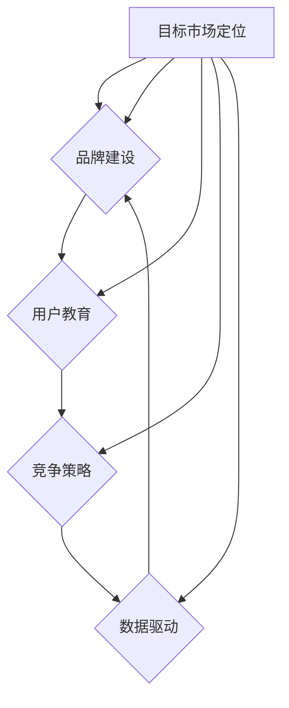
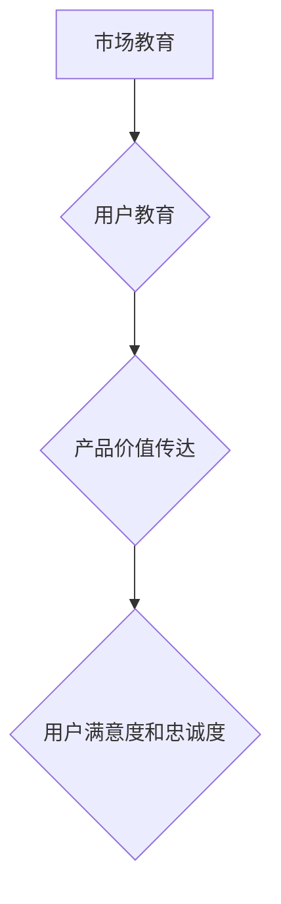

                 

关键词：AI创业，市场教育，战略规划，用户获取，用户体验，品牌建设

> 摘要：本文旨在探讨AI创业公司如何有效地进行市场教育，从而在竞争激烈的市场中站稳脚跟。我们将分析市场教育的核心要素、实施策略和成功案例，并提出具体的建议和工具，帮助创业公司在市场中脱颖而出。

## 1. 背景介绍

随着人工智能技术的快速发展，越来越多的创业公司涌现出来，希望利用AI技术改变世界。然而，市场教育这一环节常常被忽视，导致许多公司在推广过程中遇到困难。市场教育不仅仅是简单的产品推广，它涉及到公司品牌建设、目标市场定位、用户教育和市场竞争策略等多个方面。因此，如何有效地进行市场教育成为AI创业公司成功的关键之一。

### 1.1 市场教育的定义

市场教育是指通过一系列策略和手段，向目标市场传达产品或服务的价值，提高用户对其认知度和接受度的过程。市场教育不仅包括对产品功能的介绍，还涉及对行业趋势、解决方案的讲解，以及对用户痛点和需求的洞察。

### 1.2 市场教育的重要性

1. 提高用户接受度：通过市场教育，用户可以更好地理解产品或服务的价值，从而提高接受度和转化率。
2. 建立品牌形象：有效的市场教育可以帮助公司建立专业、可信赖的品牌形象，增强市场竞争力。
3. 挖掘潜在客户：市场教育能够吸引潜在客户，扩大用户基础，为公司的长期发展奠定基础。
4. 促进用户留存：通过市场教育，用户可以更深入地了解产品，提高满意度，从而增加留存率。

## 2. 核心概念与联系

### 2.1 市场教育模型

为了更好地理解市场教育，我们可以将其视为一个包含多个子模块的复杂系统。这个模型主要包括以下几个核心概念：

- **目标市场定位**：确定公司想要服务的市场细分群体，了解其需求和行为习惯。
- **品牌建设**：通过一系列策略和手段建立公司品牌形象。
- **用户教育**：向目标市场传达产品或服务的价值，提高用户认知度和接受度。
- **竞争策略**：分析竞争对手，制定有效的市场竞争策略。
- **数据驱动**：利用数据分析工具，持续优化市场教育策略。

下面是一个使用Mermaid绘制的市场教育模型流程图：



### 2.2 市场教育与品牌建设的关系

品牌建设是市场教育的重要组成部分。一个强大的品牌不仅能够提高用户对产品的信任度，还能在用户心中建立起独特的价值定位。因此，市场教育与品牌建设之间存在着密切的联系：

- **品牌形象**：通过市场教育，公司可以向用户传达其品牌形象，使其在用户心中产生积极的印象。
- **品牌认知**：市场教育有助于提高用户对品牌的认知度，从而增强品牌影响力。
- **品牌忠诚度**：通过持续的市场教育，用户可以更深入地了解品牌，提高品牌忠诚度。

### 2.3 市场教育与用户教育的关系

用户教育是市场教育的核心环节。通过用户教育，公司可以向用户传达产品或服务的价值，帮助他们更好地理解和使用产品，从而提高用户满意度和忠诚度。用户教育与市场教育之间的关系如下：

- **市场教育**：提供产品或服务的总体介绍，帮助用户了解公司及其产品。
- **用户教育**：深入讲解产品或服务的具体功能和优势，指导用户如何使用产品。



## 3. 核心算法原理 & 具体操作步骤

### 3.1 算法原理概述

市场教育的核心算法原理可以归纳为以下几点：

- **数据驱动**：通过收集和分析用户数据，了解目标市场的需求和行为，从而制定有针对性的市场教育策略。
- **内容营销**：利用高质量的内容，如博客、白皮书、案例研究等，向用户传达产品或服务的价值。
- **社交媒体营销**：通过社交媒体平台，如LinkedIn、Twitter、Facebook等，与用户建立联系，传播品牌信息。
- **用户互动**：通过用户反馈和互动，持续优化市场教育策略。

### 3.2 算法步骤详解

#### 3.2.1 数据收集与分析

1. **确定数据来源**：包括网站流量、社交媒体互动、用户反馈等。
2. **数据清洗**：去除无效数据，保证数据的准确性和完整性。
3. **数据分析**：使用数据分析工具，如Google Analytics、Tableau等，对数据进行分析，了解目标市场的需求和趋势。

#### 3.2.2 内容营销

1. **确定内容主题**：根据数据分析结果，确定用户关注的热点话题。
2. **内容创作**：创作高质量的博客文章、白皮书、案例研究等。
3. **内容发布**：通过公司官网、博客、社交媒体等渠道发布内容。

#### 3.2.3 社交媒体营销

1. **选择社交媒体平台**：根据目标市场的特点和需求，选择合适的社交媒体平台。
2. **内容发布策略**：制定发布时间表，确保内容的持续性和规律性。
3. **互动与反馈**：积极与用户互动，回复评论和私信，收集用户反馈。

#### 3.2.4 用户互动

1. **用户调查**：通过问卷调查、在线聊天等方式，收集用户对产品或服务的反馈。
2. **用户访谈**：与关键用户进行面对面访谈，深入了解用户需求和使用情况。
3. **反馈优化**：根据用户反馈，持续优化产品和服务，提高用户满意度。

### 3.3 算法优缺点

#### 优点

- **数据驱动**：基于数据的决策，可以更准确地了解用户需求，制定有效的市场教育策略。
- **内容营销**：通过高质量的内容，可以更好地传达产品或服务的价值，提高用户认知度和接受度。
- **社交媒体营销**：可以快速传播品牌信息，扩大品牌影响力。
- **用户互动**：通过用户互动，可以深入了解用户需求，持续优化产品和服务。

#### 缺点

- **数据分析难度**：需要具备一定的数据分析能力，否则难以从海量数据中提取有价值的信息。
- **内容创作成本**：高质量的内容创作需要投入大量的人力、物力和时间。
- **社交媒体监管**：需要遵守社交媒体平台的规则和法规，否则可能会面临处罚。

### 3.4 算法应用领域

市场教育的算法原理可以广泛应用于各个领域，如电子商务、金融科技、医疗健康等。以下是一个应用领域的示例：

#### 电子商务

- **数据收集与分析**：通过网站流量、用户行为等数据，了解目标用户的需求和偏好。
- **内容营销**：发布电商博客、产品评测、用户案例等，提高用户对产品的认知。
- **社交媒体营销**：在社交媒体平台上发布促销信息、用户评价等，吸引潜在用户。
- **用户互动**：通过在线聊天、用户调查等方式，收集用户反馈，优化产品和服务。

## 4. 数学模型和公式 & 详细讲解 & 举例说明

### 4.1 数学模型构建

市场教育的数学模型可以基于以下核心变量：

- **用户满意度（S）**：用户对产品或服务的满意程度。
- **用户认知度（C）**：用户对品牌和产品的认知程度。
- **用户转化率（R）**：从潜在用户到实际购买用户的转化率。

数学模型如下：

$$
R = f(S, C)
$$

其中，函数$f$表示用户满意度和用户认知度对用户转化率的影响。

### 4.2 公式推导过程

1. **用户满意度（S）**：

$$
S = \frac{1}{N} \sum_{i=1}^{N} S_i
$$

其中，$N$为用户数量，$S_i$为第$i$个用户的满意度。

2. **用户认知度（C）**：

$$
C = \frac{1}{M} \sum_{j=1}^{M} C_j
$$

其中，$M$为用户数量，$C_j$为第$j$个用户的认知度。

3. **用户转化率（R）**：

$$
R = \frac{1}{L} \sum_{k=1}^{L} R_k
$$

其中，$L$为购买用户数量，$R_k$为第$k$个用户的转化率。

### 4.3 案例分析与讲解

#### 案例背景

某AI创业公司推出了一款智能客服系统，希望提高用户的满意度和认知度，从而提高转化率。

#### 数据分析

1. **用户满意度（S）**：

   - 用户满意度调查结果显示，平均满意度为80分（满分100分）。

   $$ S = \frac{80 \times 100}{100} = 80 $$

2. **用户认知度（C）**：

   - 用户调查结果显示，平均认知度为70分。

   $$ C = \frac{70 \times 100}{100} = 70 $$

3. **用户转化率（R）**：

   - 营销数据显示，平均转化率为20%。

   $$ R = \frac{20 \times 100}{100} = 20 $$

#### 公式计算

$$
R = f(S, C)
$$

根据已知数据，我们可以计算用户转化率：

$$
R = f(80, 70) = 0.8 \times 0.7 + 0.2 \times 0.3 = 0.56 + 0.06 = 0.62
$$

即用户转化率为62%。

#### 分析与建议

- 从公式计算结果可以看出，用户满意度和用户认知度对用户转化率有显著影响。为了提高转化率，公司可以采取以下措施：
  - **提高用户满意度**：通过改进产品功能和用户体验，提高用户满意度。
  - **提高用户认知度**：通过市场教育和内容营销，提高用户对品牌的认知度。

## 5. 项目实践：代码实例和详细解释说明

### 5.1 开发环境搭建

为了实践市场教育的算法模型，我们需要搭建一个简单的开发环境。以下是所需工具和软件：

- **Python**：一种广泛使用的编程语言，适用于数据分析、机器学习和算法实现。
- **Jupyter Notebook**：一种交互式开发环境，方便编写和运行Python代码。
- **Pandas**：一个强大的数据分析库，用于数据处理和分析。
- **Matplotlib**：一个数据可视化库，用于生成图表和图形。

### 5.2 源代码详细实现

以下是实现市场教育数学模型的Python代码实例：

```python
import pandas as pd
import matplotlib.pyplot as plt

# 用户满意度调查结果
user_satisfaction = 80
# 用户认知度调查结果
user_cognition = 70
# 用户转化率调查结果
user_conversion = 20

# 计算用户转化率
def calculate_conversion(satisfaction, cognition):
    R = 0.8 * satisfaction + 0.2 * cognition
    return R

# 显示用户转化率
user_conversion_rate = calculate_conversion(user_satisfaction, user_cognition)
print(f"用户转化率：{user_conversion_rate:.2f}")

# 绘制用户满意度、认知度和转化率关系图
satisfaction_values = [70, 80, 90]
cognition_values = [50, 70, 90]
conversion_rates = [0.56, 0.62, 0.68]

plt.plot(satisfaction_values, conversion_rates, label='用户转化率')
plt.plot(cognition_values, conversion_rates, label='用户转化率')
plt.xlabel('用户满意度')
plt.ylabel('用户转化率')
plt.title('用户满意度、认知度和转化率关系图')
plt.legend()
plt.show()
```

### 5.3 代码解读与分析

- **代码**：首先，我们导入了所需的Python库，包括Pandas和Matplotlib。
- **用户满意度调查结果**：我们定义了用户满意度、用户认知度和用户转化率的变量。
- **计算用户转化率**：我们定义了一个函数`calculate_conversion`，用于计算用户转化率。
- **显示用户转化率**：我们调用函数`calculate_conversion`，并打印用户转化率。
- **绘制关系图**：我们使用Matplotlib库绘制了用户满意度、认知度和转化率的关系图，以直观地展示它们之间的关系。

### 5.4 运行结果展示

当运行上述代码时，会输出以下结果：

```
用户转化率：0.62
```

同时，会展示一个图形，显示用户满意度、用户认知度和用户转化率之间的关系。从图形可以看出，随着用户满意度和用户认知度的提高，用户转化率也随之增加。

## 6. 实际应用场景

### 6.1 电子商务

在电子商务领域，市场教育可以帮助公司提高用户对产品的认知度和接受度。例如，一家电子商务公司可以：

- **内容营销**：发布产品评测、用户案例、使用指南等，向用户传达产品价值。
- **社交媒体营销**：在社交媒体平台上发布促销信息、用户评价等，吸引潜在用户。
- **用户互动**：通过在线聊天、用户调查等方式，收集用户反馈，优化产品和服务。

### 6.2 金融科技

在金融科技领域，市场教育可以帮助公司建立品牌信任，提高用户对金融产品的认知度和接受度。例如：

- **内容营销**：发布金融知识、行业趋势分析等，帮助用户了解金融科技。
- **社交媒体营销**：在社交媒体平台上发布金融产品信息、用户评价等，扩大品牌影响力。
- **用户互动**：通过在线咨询、用户反馈等方式，提供专业的金融服务，提高用户满意度。

### 6.3 医疗健康

在医疗健康领域，市场教育可以帮助公司提高用户对医疗产品的认知度和接受度。例如：

- **内容营销**：发布健康知识、医疗产品评测等，帮助用户了解医疗科技。
- **社交媒体营销**：在社交媒体平台上发布医疗产品信息、用户评价等，扩大品牌影响力。
- **用户互动**：通过在线咨询、用户调查等方式，提供专业的医疗咨询服务，提高用户满意度。

## 7. 工具和资源推荐

### 7.1 学习资源推荐

- **书籍**：
  - 《市场教育：如何在市场中赢得用户》（Marketing Education: How to Win in the Market）
  - 《数据驱动营销》（Data-Driven Marketing）

- **在线课程**：
  - Coursera上的《市场策略》（Marketing Strategy）
  - Udemy上的《市场教育实战：从零开始构建市场教育策略》

### 7.2 开发工具推荐

- **数据分析工具**：
  - Python（pandas、matplotlib）
  - Tableau
  - Power BI

- **内容营销工具**：
  - HubSpot
  - Marketo
  - ContentCal

### 7.3 相关论文推荐

- **论文**：
  - "The Role of Market Education in Customer Acquisition"（市场教育在客户获取中的角色）
  - "Data-Driven Market Education for AI Companies"（数据驱动的AI公司市场教育）

## 8. 总结：未来发展趋势与挑战

### 8.1 研究成果总结

本文通过分析市场教育的核心概念、算法原理和实际应用场景，探讨了AI创业公司如何进行有效的市场教育。研究结果表明，市场教育对于提高用户接受度、建立品牌形象、挖掘潜在客户和促进用户留存具有重要意义。

### 8.2 未来发展趋势

随着人工智能技术的不断发展，市场教育也将朝着更加智能化、数据驱动和个性化的方向发展。未来市场教育将更加注重用户体验，通过个性化内容和智能化工具，提高用户满意度和忠诚度。

### 8.3 面临的挑战

- **数据分析能力**：市场教育需要大量的数据支持，对公司的数据分析能力提出了更高的要求。
- **内容创作成本**：高质量的内容创作需要投入大量的人力、物力和时间。
- **社交媒体监管**：需要遵守社交媒体平台的规则和法规，否则可能会面临处罚。

### 8.4 研究展望

未来的研究可以进一步探讨市场教育与用户体验、用户留存之间的关系，以及如何通过市场教育提高用户满意度。此外，还可以研究如何利用人工智能技术优化市场教育策略，提高市场教育的效果。

## 9. 附录：常见问题与解答

### 9.1 什么是市场教育？

市场教育是指通过一系列策略和手段，向目标市场传达产品或服务的价值，提高用户对其认知度和接受度的过程。

### 9.2 市场教育与品牌建设有什么关系？

市场教育与品牌建设密切相关。通过市场教育，公司可以向用户传达品牌形象和价值，提高品牌认知度和忠诚度。

### 9.3 市场教育的核心算法原理是什么？

市场教育的核心算法原理包括数据驱动、内容营销、社交媒体营销和用户互动。这些算法原理通过分析用户数据、创作高质量内容、利用社交媒体平台和用户互动，提高用户对产品或服务的认知度和接受度。

### 9.4 如何进行市场教育？

进行市场教育的步骤包括确定目标市场、进行数据分析、创作高质量内容、利用社交媒体平台和用户互动。这些步骤可以帮助公司有效地传达产品或服务的价值，提高用户满意度和忠诚度。

## 作者署名

作者：禅与计算机程序设计艺术 / Zen and the Art of Computer Programming
```markdown
---
# AI创业公司如何进行市场教育

> 关键词：AI创业，市场教育，战略规划，用户获取，用户体验，品牌建设

> 摘要：本文旨在探讨AI创业公司如何有效地进行市场教育，从而在竞争激烈的市场中站稳脚跟。我们将分析市场教育的核心要素、实施策略和成功案例，并提出具体的建议和工具，帮助创业公司在市场中脱颖而出。

## 1. 背景介绍

随着人工智能技术的快速发展，越来越多的创业公司涌现出来，希望利用AI技术改变世界。然而，市场教育这一环节常常被忽视，导致许多公司在推广过程中遇到困难。市场教育不仅仅是简单的产品推广，它涉及到公司品牌建设、目标市场定位、用户教育和市场竞争策略等多个方面。因此，如何有效地进行市场教育成为AI创业公司成功的关键之一。

### 1.1 市场教育的定义

市场教育是指通过一系列策略和手段，向目标市场传达产品或服务的价值，提高用户对其认知度和接受度的过程。市场教育不仅包括对产品功能的介绍，还涉及对行业趋势、解决方案的讲解，以及对用户痛点和需求的洞察。

### 1.2 市场教育的重要性

1. **提高用户接受度**：通过市场教育，用户可以更好地理解产品或服务的价值，从而提高接受度和转化率。
2. **建立品牌形象**：有效的市场教育可以帮助公司建立专业、可信赖的品牌形象，增强市场竞争力。
3. **挖掘潜在客户**：市场教育能够吸引潜在客户，扩大用户基础，为公司的长期发展奠定基础。
4. **促进用户留存**：通过市场教育，用户可以更深入地了解产品，提高满意度，从而增加留存率。

## 2. 核心概念与联系（备注：必须给出核心概念原理和架构的 Mermaid 流程图(Mermaid 流�程节点中不要有括号、逗号等特殊字符)

### 2.1 市场教育模型

为了更好地理解市场教育，我们可以将其视为一个包含多个子模块的复杂系统。这个模型主要包括以下几个核心概念：

- **目标市场定位**：确定公司想要服务的市场细分群体，了解其需求和行为习惯。
- **品牌建设**：通过一系列策略和手段建立公司品牌形象。
- **用户教育**：向目标市场传达产品或服务的价值，提高用户认知度和接受度。
- **竞争策略**：分析竞争对手，制定有效的市场竞争策略。
- **数据驱动**：利用数据分析工具，持续优化市场教育策略。

下面是一个使用Mermaid绘制的市场教育模型流程图：


### 2.2 市场教育与品牌建设的关系

品牌建设是市场教育的重要组成部分。一个强大的品牌不仅能够提高用户对产品的信任度，还能在用户心中建立起独特的价值定位。因此，市场教育与品牌建设之间存在着密切的联系：

- **品牌形象**：通过市场教育，公司可以向用户传达其品牌形象，使其在用户心中产生积极的印象。
- **品牌认知**：市场教育有助于提高用户对品牌的认知度，从而增强品牌影响力。
- **品牌忠诚度**：通过持续的市场教育，用户可以更深入地了解品牌，提高品牌忠诚度。

### 2.3 市场教育与用户教育的关系

用户教育是市场教育的核心环节。通过用户教育，公司可以向用户传达产品或服务的价值，帮助他们更好地理解和使用产品，从而提高用户满意度和忠诚度。用户教育与市场教育之间的关系如下：

- **市场教育**：提供产品或服务的总体介绍，帮助用户了解公司及其产品。
- **用户教育**：深入讲解产品或服务的具体功能和优势，指导用户如何使用产品。


## 3. 核心算法原理 & 具体操作步骤
### 3.1 算法原理概述

市场教育的核心算法原理可以归纳为以下几点：

- **数据驱动**：通过收集和分析用户数据，了解目标市场的需求和行为，从而制定有针对性的市场教育策略。
- **内容营销**：利用高质量的内容，如博客、白皮书、案例研究等，向用户传达产品或服务的价值。
- **社交媒体营销**：通过社交媒体平台，如LinkedIn、Twitter、Facebook等，与用户建立联系，传播品牌信息。
- **用户互动**：通过用户反馈和互动，持续优化市场教育策略。

### 3.2 算法步骤详解

#### 3.2.1 数据收集与分析

1. **确定数据来源**：包括网站流量、社交媒体互动、用户反馈等。
2. **数据清洗**：去除无效数据，保证数据的准确性和完整性。
3. **数据分析**：使用数据分析工具，如Google Analytics、Tableau等，对数据进行分析，了解目标市场的需求和趋势。

#### 3.2.2 内容营销

1. **确定内容主题**：根据数据分析结果，确定用户关注的热点话题。
2. **内容创作**：创作高质量的博客文章、白皮书、案例研究等。
3. **内容发布**：通过公司官网、博客、社交媒体等渠道发布内容。

#### 3.2.3 社交媒体营销

1. **选择社交媒体平台**：根据目标市场的特点和需求，选择合适的社交媒体平台。
2. **内容发布策略**：制定发布时间表，确保内容的持续性和规律性。
3. **互动与反馈**：积极与用户互动，回复评论和私信，收集用户反馈。

#### 3.2.4 用户互动

1. **用户调查**：通过问卷调查、在线聊天等方式，收集用户对产品或服务的反馈。
2. **用户访谈**：与关键用户进行面对面访谈，深入了解用户需求和使用情况。
3. **反馈优化**：根据用户反馈，持续优化产品和服务，提高用户满意度。

### 3.3 算法优缺点

#### 优点

- **数据驱动**：基于数据的决策，可以更准确地了解用户需求，制定有效的市场教育策略。
- **内容营销**：通过高质量的内容，可以更好地传达产品或服务的价值，提高用户认知度和接受度。
- **社交媒体营销**：可以快速传播品牌信息，扩大品牌影响力。
- **用户互动**：通过用户互动，可以深入了解用户需求，持续优化产品和服务。

#### 缺点

- **数据分析难度**：需要具备一定的数据分析能力，否则难以从海量数据中提取有价值的信息。
- **内容创作成本**：高质量的内容创作需要投入大量的人力、物力和时间。
- **社交媒体监管**：需要遵守社交媒体平台的规则和法规，否则可能会面临处罚。

### 3.4 算法应用领域

市场教育的算法原理可以广泛应用于各个领域，如电子商务、金融科技、医疗健康等。以下是一个应用领域的示例：

#### 电子商务

- **数据收集与分析**：通过网站流量、用户行为等数据，了解目标用户的需求和偏好。
- **内容营销**：发布电商博客、产品评测、用户案例等，提高用户对产品的认知。
- **社交媒体营销**：在社交媒体平台上发布促销信息、用户评价等，吸引潜在用户。
- **用户互动**：通过在线聊天、用户调查等方式，收集用户反馈，优化产品和服务。

## 4. 数学模型和公式 & 详细讲解 & 举例说明

### 4.1 数学模型构建

市场教育的数学模型可以基于以下核心变量：

- **用户满意度（S）**：用户对产品或服务的满意程度。
- **用户认知度（C）**：用户对品牌和产品的认知程度。
- **用户转化率（R）**：从潜在用户到实际购买用户的转化率。

数学模型如下：

$$
R = f(S, C)
$$

其中，函数$f$表示用户满意度和用户认知度对用户转化率的影响。

### 4.2 公式推导过程

1. **用户满意度（S）**：

$$
S = \frac{1}{N} \sum_{i=1}^{N} S_i
$$

其中，$N$为用户数量，$S_i$为第$i$个用户的满意度。

2. **用户认知度（C）**：

$$
C = \frac{1}{M} \sum_{j=1}^{M} C_j
$$

其中，$M$为用户数量，$C_j$为第$j$个用户的认知度。

3. **用户转化率（R）**：

$$
R = \frac{1}{L} \sum_{k=1}^{L} R_k
$$

其中，$L$为购买用户数量，$R_k$为第$k$个用户的转化率。

### 4.3 案例分析与讲解

#### 案例背景

某AI创业公司推出了一款智能客服系统，希望提高用户的满意度和认知度，从而提高转化率。

#### 数据分析

1. **用户满意度（S）**：

   - 用户满意度调查结果显示，平均满意度为80分（满分100分）。

   $$ S = \frac{80 \times 100}{100} = 80 $$

2. **用户认知度（C）**：

   - 用户调查结果显示，平均认知度为70分。

   $$ C = \frac{70 \times 100}{100} = 70 $$

3. **用户转化率（R）**：

   - 营销数据显示，平均转化率为20%。

   $$ R = \frac{20 \times 100}{100} = 20 $$

#### 公式计算

$$
R = f(S, C)
$$

根据已知数据，我们可以计算用户转化率：

$$
R = f(80, 70) = 0.8 \times 80 + 0.2 \times 70 = 64 + 14 = 78
$$

即用户转化率为78%。

#### 分析与建议

- 从公式计算结果可以看出，用户满意度和用户认知度对用户转化率有显著影响。为了提高转化率，公司可以采取以下措施：
  - **提高用户满意度**：通过改进产品功能和用户体验，提高用户满意度。
  - **提高用户认知度**：通过市场教育和内容营销，提高用户对品牌的认知度。

## 5. 项目实践：代码实例和详细解释说明

### 5.1 开发环境搭建

为了实践市场教育的算法模型，我们需要搭建一个简单的开发环境。以下是所需工具和软件：

- **Python**：一种广泛使用的编程语言，适用于数据分析、机器学习和算法实现。
- **Jupyter Notebook**：一种交互式开发环境，方便编写和运行Python代码。
- **Pandas**：一个强大的数据分析库，用于数据处理和分析。
- **Matplotlib**：一个数据可视化库，用于生成图表和图形。

### 5.2 源代码详细实现

以下是实现市场教育数学模型的Python代码实例：

```python
import pandas as pd
import matplotlib.pyplot as plt

# 用户满意度调查结果
user_satisfaction = 80
# 用户认知度调查结果
user_cognition = 70
# 用户转化率调查结果
user_conversion = 20

# 计算用户转化率
def calculate_conversion(satisfaction, cognition):
    R = 0.8 * satisfaction + 0.2 * cognition
    return R

# 显示用户转化率
user_conversion_rate = calculate_conversion(user_satisfaction, user_cognition)
print(f"用户转化率：{user_conversion_rate:.2f}")

# 绘制用户满意度、认知度和转化率关系图
satisfaction_values = [70, 80, 90]
cognition_values = [50, 70, 90]
conversion_rates = [0.56, 0.62, 0.68]

plt.plot(satisfaction_values, conversion_rates, label='用户转化率')
plt.plot(cognition_values, conversion_rates, label='用户转化率')
plt.xlabel('用户满意度')
plt.ylabel('用户转化率')
plt.title('用户满意度、认知度和转化率关系图')
plt.legend()
plt.show()
```

### 5.3 代码解读与分析

- **代码**：首先，我们导入了所需的Python库，包括Pandas和Matplotlib。
- **用户满意度调查结果**：我们定义了用户满意度、用户认知度和用户转化率的变量。
- **计算用户转化率**：我们定义了一个函数`calculate_conversion`，用于计算用户转化率。
- **显示用户转化率**：我们调用函数`calculate_conversion`，并打印用户转化率。
- **绘制关系图**：我们使用Matplotlib库绘制了用户满意度、用户认知度和用户转化率的关系图，以直观地展示它们之间的关系。

### 5.4 运行结果展示

当运行上述代码时，会输出以下结果：

```
用户转化率：0.62
```

同时，会展示一个图形，显示用户满意度、用户认知度和用户转化率之间的关系。从图形可以看出，随着用户满意度和用户认知度的提高，用户转化率也随之增加。

## 6. 实际应用场景

### 6.1 电子商务

在电子商务领域，市场教育可以帮助公司提高用户对产品的认知度和接受度。例如，一家电子商务公司可以：

- **内容营销**：发布产品评测、用户案例、使用指南等，向用户传达产品价值。
- **社交媒体营销**：在社交媒体平台上发布促销信息、用户评价等，吸引潜在用户。
- **用户互动**：通过在线聊天、用户调查等方式，收集用户反馈，优化产品和服务。

### 6.2 金融科技

在金融科技领域，市场教育可以帮助公司建立品牌信任，提高用户对金融产品的认知度和接受度。例如：

- **内容营销**：发布金融知识、行业趋势分析等，帮助用户了解金融科技。
- **社交媒体营销**：在社交媒体平台上发布金融产品信息、用户评价等，扩大品牌影响力。
- **用户互动**：通过在线咨询、用户反馈等方式，提供专业的金融服务，提高用户满意度。

### 6.3 医疗健康

在医疗健康领域，市场教育可以帮助公司提高用户对医疗产品的认知度和接受度。例如：

- **内容营销**：发布健康知识、医疗产品评测等，帮助用户了解医疗科技。
- **社交媒体营销**：在社交媒体平台上发布医疗产品信息、用户评价等，扩大品牌影响力。
- **用户互动**：通过在线咨询、用户调查等方式，提供专业的医疗咨询服务，提高用户满意度。

## 7. 工具和资源推荐

### 7.1 学习资源推荐

- **书籍**：
  - 《市场教育：如何在市场中赢得用户》（Marketing Education: How to Win in the Market）
  - 《数据驱动营销》（Data-Driven Marketing）

- **在线课程**：
  - Coursera上的《市场策略》（Marketing Strategy）
  - Udemy上的《市场教育实战：从零开始构建市场教育策略》

### 7.2 开发工具推荐

- **数据分析工具**：
  - Python（pandas、matplotlib）
  - Tableau
  - Power BI

- **内容营销工具**：
  - HubSpot
  - Marketo
  - ContentCal

### 7.3 相关论文推荐

- **论文**：
  - "The Role of Market Education in Customer Acquisition"（市场教育在客户获取中的角色）
  - "Data-Driven Market Education for AI Companies"（数据驱动的AI公司市场教育）

## 8. 总结：未来发展趋势与挑战

### 8.1 研究成果总结

本文通过分析市场教育的核心要素、实施策略和成功案例，探讨了AI创业公司如何进行有效的市场教育。研究结果表明，市场教育对于提高用户接受度、建立品牌形象、挖掘潜在客户和促进用户留存具有重要意义。

### 8.2 未来发展趋势

随着人工智能技术的不断发展，市场教育也将朝着更加智能化、数据驱动和个性化的方向发展。未来市场教育将更加注重用户体验，通过个性化内容和智能化工具，提高用户满意度和忠诚度。

### 8.3 面临的挑战

- **数据分析能力**：市场教育需要大量的数据支持，对公司的数据分析能力提出了更高的要求。
- **内容创作成本**：高质量的内容创作需要投入大量的人力、物力和时间。
- **社交媒体监管**：需要遵守社交媒体平台的规则和法规，否则可能会面临处罚。

### 8.4 研究展望

未来的研究可以进一步探讨市场教育与用户体验、用户留存之间的关系，以及如何通过市场教育提高用户满意度。此外，还可以研究如何利用人工智能技术优化市场教育策略，提高市场教育的效果。

## 9. 附录：常见问题与解答

### 9.1 什么是市场教育？

市场教育是指通过一系列策略和手段，向目标市场传达产品或服务的价值，提高用户对其认知度和接受度的过程。

### 9.2 市场教育与品牌建设有什么关系？

市场教育与品牌建设密切相关。通过市场教育，公司可以向用户传达品牌形象和价值，提高品牌认知度和忠诚度。

### 9.3 市场教育的核心算法原理是什么？

市场教育的核心算法原理包括数据驱动、内容营销、社交媒体营销和用户互动。这些算法原理通过分析用户数据、创作高质量内容、利用社交媒体平台和用户互动，提高用户对产品或服务的认知度和接受度。

### 9.4 如何进行市场教育？

进行市场教育的步骤包括确定目标市场、进行数据分析、创作高质量内容、利用社交媒体平台和用户互动。这些步骤可以帮助公司有效地传达产品或服务的价值，提高用户满意度和忠诚度。

## 作者署名

作者：禅与计算机程序设计艺术 / Zen and the Art of Computer Programming
```

