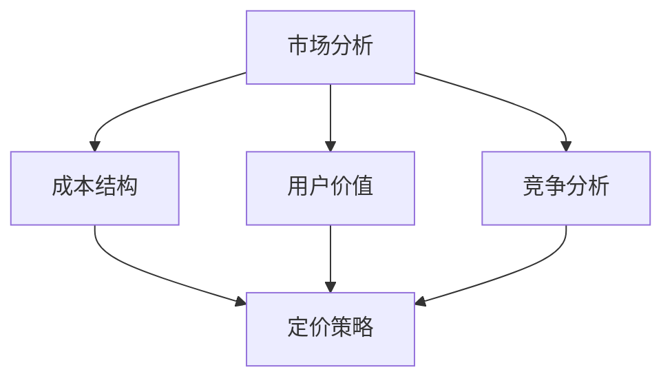

                 

关键词：AI创业，定价策略，市场分析，成本结构，用户价值，竞争分析，动态定价，价格弹性

> 摘要：本文将深入探讨AI创业公司制定定价策略的关键要素，包括市场分析、成本结构、用户价值和竞争分析等方面。此外，文章还将探讨动态定价和价格弹性的概念，并分析如何运用这些策略实现可持续的盈利模式。

## 1. 背景介绍

随着人工智能技术的迅速发展，越来越多的创业公司投身于AI领域，希望通过创新的产品和服务改变世界。然而，在激烈的市场竞争中，如何制定有效的定价策略成为这些公司成功的关键因素之一。定价不仅影响公司的收入和利润，还直接关系到用户体验和市场份额的获取。

有效的定价策略需要综合考虑多个因素，包括市场环境、成本结构、用户需求和竞争对手的策略。本文将围绕这些核心要素，详细探讨AI创业公司如何制定定价策略，以实现可持续的商业成功。

## 2. 核心概念与联系

为了更好地理解定价策略的制定，我们首先需要了解几个核心概念：市场分析、成本结构、用户价值和竞争分析。

### 2.1 市场分析

市场分析是制定定价策略的第一步，它涉及到对市场需求的深入了解。市场分析包括以下几个关键方面：

- **市场需求**：分析目标市场的需求，了解用户的痛点和需求，确定产品或服务的市场规模和增长潜力。
- **市场定位**：确定公司在市场中的定位，包括目标客户群体、产品差异化策略和品牌形象。
- **市场趋势**：关注市场的发展趋势，包括技术进步、消费者行为变化和政策法规等。

### 2.2 成本结构

成本结构是定价策略制定的重要依据。了解公司的成本结构有助于确定产品的价格区间，确保公司能够实现盈利。成本结构主要包括以下几个方面：

- **固定成本**：不随生产或销售量变化的成本，如研发费用、租金和设备折旧。
- **可变成本**：随生产或销售量变化的成本，如原材料、人工和运营费用。
- **边际成本**：生产额外一单位产品或服务所需的成本。

### 2.3 用户价值

用户价值是定价策略的核心，决定了产品或服务的价格是否合理。用户价值包括以下几个方面：

- **产品特性**：产品的功能、性能和质量对用户的价值。
- **用户体验**：产品的易用性、界面设计和客户服务对用户的价值。
- **价格感知**：用户对产品价格的接受程度和感知价值。

### 2.4 竞争分析

竞争分析有助于了解市场中的竞争对手，包括他们的产品、定价策略和市场地位。竞争分析包括以下几个方面：

- **竞争对手的产品特点**：竞争对手的产品功能、性能和差异化策略。
- **竞争对手的定价策略**：竞争对手的定价水平和定价策略。
- **市场份额**：竞争对手在市场中的地位和市场份额。

### 2.5 Mermaid 流程图

以下是一个简化的Mermaid流程图，展示了核心概念之间的联系：



## 3. 核心算法原理 & 具体操作步骤

### 3.1 算法原理概述

制定有效的定价策略需要综合运用市场分析、成本结构分析、用户价值评估和竞争分析等多个维度的数据。以下是一种简化的定价策略算法原理：

1. **市场分析**：通过调查、竞品分析等方法，收集目标市场的需求、市场规模和增长趋势等数据。
2. **成本结构分析**：确定固定成本和可变成本，计算边际成本。
3. **用户价值评估**：通过用户调研、反馈等方式，了解用户对产品或服务的价值感知。
4. **竞争分析**：分析竞争对手的产品特点、定价策略和市场地位，了解市场动态。
5. **定价策略制定**：结合以上数据，制定出合理的定价策略，包括定价水平、定价策略和价格弹性。

### 3.2 算法步骤详解

1. **市场分析**：
   - **需求分析**：通过问卷调查、访谈等方式，收集目标用户的需求信息。
   - **市场规模和趋势**：分析市场报告、行业数据等，了解市场的规模和增长趋势。

2. **成本结构分析**：
   - **固定成本**：包括研发费用、租金、设备折旧等。
   - **可变成本**：包括原材料、人工、运营费用等。
   - **边际成本**：计算额外生产一单位产品或服务的成本。

3. **用户价值评估**：
   - **产品特性**：评估产品的功能、性能和质量。
   - **用户体验**：评估产品的易用性、界面设计和客户服务。
   - **价格感知**：了解用户对产品价格的接受程度。

4. **竞争分析**：
   - **产品特点**：分析竞争对手的产品功能、性能和差异化策略。
   - **定价策略**：分析竞争对手的定价水平和定价策略。
   - **市场份额**：了解竞争对手在市场中的地位和市场份额。

5. **定价策略制定**：
   - **定价水平**：根据成本结构和用户价值评估，确定产品的价格区间。
   - **定价策略**：根据市场竞争情况，制定动态定价策略或固定定价策略。
   - **价格弹性**：根据市场需求和用户反馈，调整价格以适应市场变化。

### 3.3 算法优缺点

**优点**：
- 综合考虑了市场、成本、用户和竞争等多方面因素，有助于制定合理的定价策略。
- 动态定价策略能够根据市场变化实时调整价格，提高竞争力。

**缺点**：
- 需要大量数据支持，数据分析过程复杂。
- 可能需要频繁调整价格，对运营和供应链管理要求较高。

### 3.4 算法应用领域

- **B2B市场**：如企业软件、云计算服务等。
- **消费品市场**：如电子产品、日用品等。

## 4. 数学模型和公式 & 详细讲解 & 举例说明

### 4.1 数学模型构建

定价策略的数学模型主要包括以下几个方面：

1. **成本模型**：
   $$C(x) = a + bx$$
   其中，$C(x)$为总成本，$a$为固定成本，$b$为边际成本，$x$为生产或销售量。

2. **需求模型**：
   $$D(p) = -ap + b$$
   其中，$D(p)$为需求量，$p$为价格，$a$和$b$为常数。

3. **利润模型**：
   $$\Pi(p) = p \cdot D(p) - C(x)$$
   其中，$\Pi(p)$为利润，$p$为价格，$D(p)$为需求量，$C(x)$为总成本。

### 4.2 公式推导过程

1. **成本模型推导**：
   - 固定成本：包括研发费用、租金和设备折旧等。
   - 可变成本：包括原材料、人工和运营费用等。
   - 边际成本：额外生产一单位产品或服务的成本。

2. **需求模型推导**：
   - 线性需求函数：假设价格和需求量之间存在线性关系。
   - 系数$a$和$b$：通过市场分析和历史数据确定。

3. **利润模型推导**：
   - 利润：价格乘以需求量减去总成本。

### 4.3 案例分析与讲解

假设某AI创业公司的产品价格为$p$，市场需求函数为$D(p) = -100p + 300$，成本函数为$C(x) = 500 + 50x$，其中$x$为销售量。

1. **利润模型**：
   $$\Pi(p) = p \cdot (-100p + 300) - (500 + 50x)$$
   $$\Pi(p) = -100p^2 + 350p - 500$$

2. **利润最大化**：
   对利润函数求导，令导数为0，求得$p=3.5$时利润最大。
   $$\Pi'(p) = -200p + 350 = 0$$
   $$p = 3.5$$

3. **利润最大化分析**：
   当产品价格为$3.5$时，公司利润最大。

## 5. 项目实践：代码实例和详细解释说明

### 5.1 开发环境搭建

- **编程语言**：Python
- **依赖库**：NumPy、Matplotlib

### 5.2 源代码详细实现

```python
import numpy as np
import matplotlib.pyplot as plt

# 参数设置
a = -100
b = 300
c = 500
d = 50

# 成本函数
def cost(x):
    return c + d * x

# 需求函数
def demand(p):
    return a * p + b

# 利润函数
def profit(p):
    return p * demand(p) - cost(x)

# 利润最大化
def maximize_profit(p):
    return -a * p**2 + (b + d) * p - c

# 绘制利润曲线
p = np.linspace(0, 10, 100)
profit_curve = maximize_profit(p)

plt.plot(p, profit_curve)
plt.xlabel('Price')
plt.ylabel('Profit')
plt.title('Profit Maximization Curve')
plt.grid(True)
plt.show()
```

### 5.3 代码解读与分析

- **成本函数**：`cost(x)`计算总成本。
- **需求函数**：`demand(p)`计算市场需求量。
- **利润函数**：`profit(p)`计算利润。
- **利润最大化函数**：`maximize_profit(p)`求得利润最大化的价格。

通过绘制利润曲线，我们可以直观地了解利润随价格变化的趋势，从而确定最优定价策略。

## 6. 实际应用场景

AI创业公司的定价策略在不同应用场景下会有所不同。以下是一些典型应用场景：

### 6.1 消费品市场

在消费品市场，AI创业公司通常采用竞争定价策略，以吸引消费者。例如，某AI公司推出了一款智能家居产品，竞争对手的定价为$200。为了获得市场份额，该AI公司可能将价格定在$150左右。

### 6.2 B2B市场

在B2B市场，AI创业公司通常采用价值定价策略。例如，一家提供企业级AI服务的公司可能会根据客户的需求和预算，制定个性化的定价策略。这种策略有助于提高客户满意度和忠诚度。

### 6.3 个性化定价

在个性化定价场景下，AI创业公司会根据用户的购买历史、偏好和行为数据，为每位用户制定个性化的价格。例如，一家在线购物平台可能会根据用户的浏览记录，为高频买家提供折扣。

## 7. 未来应用展望

随着人工智能技术的不断发展，AI创业公司的定价策略将更加智能化和个性化。以下是一些未来应用展望：

### 7.1 智能动态定价

利用机器学习算法，AI创业公司可以实时分析市场数据和用户行为，实现智能动态定价。这种策略有助于提高销售收入和市场份额。

### 7.2 个性化定价策略

通过大数据分析和用户画像，AI创业公司可以更精准地了解用户需求，制定个性化的定价策略。这种策略有助于提高客户满意度和忠诚度。

### 7.3 预测性定价

利用预测模型，AI创业公司可以预测市场需求和竞争态势，提前调整定价策略。这种策略有助于应对市场变化，提高竞争力。

## 8. 工具和资源推荐

### 8.1 学习资源推荐

- **《定价战略》**：一本经典的定价策略书籍，适合AI创业公司管理者阅读。
- **Coursera**：提供一系列关于市场营销和定价策略的在线课程。

### 8.2 开发工具推荐

- **NumPy**：用于数学计算的科学计算库。
- **Pandas**：用于数据分析和处理的库。

### 8.3 相关论文推荐

- **《Dynamic Pricing with Artificial Intelligence》**：一篇关于AI动态定价的论文，介绍了相关算法和应用。
- **《Value-Based Pricing》**：一篇关于价值定价策略的论文，探讨了定价策略的制定方法和应用。

## 9. 总结：未来发展趋势与挑战

未来，AI创业公司的定价策略将更加智能化、个性化。然而，这同时也带来了新的挑战：

### 9.1 数据隐私和安全

在制定个性化定价策略时，AI创业公司需要处理大量用户数据。确保数据隐私和安全将成为一项重要挑战。

### 9.2 算法透明度和公平性

随着AI技术的应用，定价策略的算法透明度和公平性受到关注。公司需要确保算法不会歧视特定用户群体。

### 9.3 法规和合规性

AI创业公司需要关注相关法规和合规性要求，确保定价策略符合法律法规。

总之，AI创业公司的定价策略在未来将不断发展，通过智能化、个性化定价策略，实现商业成功。然而，公司也需要关注数据隐私、算法透明度和法规合规性等方面的挑战。

## 10. 附录：常见问题与解答

### 10.1 如何制定个性化定价策略？

**解答**：个性化定价策略需要基于用户数据进行分析，包括购买历史、偏好和行为数据。通过大数据分析和机器学习算法，公司可以了解每位用户的个性化需求，从而制定相应的定价策略。

### 10.2 动态定价和竞争定价有什么区别？

**解答**：动态定价是根据市场需求和竞争态势实时调整价格，以最大化利润。而竞争定价是基于竞争对手的定价策略，以竞争为导向制定价格。动态定价更加灵活，而竞争定价更注重市场竞争。

### 10.3 如何处理数据隐私和安全问题？

**解答**：公司应采取严格的隐私保护措施，如数据加密、访问控制和安全审计等。同时，公司应遵循相关法律法规，确保用户数据的安全和隐私。

## 参考文献

- **[1]** 罗伯特·谢勒，《定价战略》，北京：机械工业出版社，2016年。
- **[2]** Coursera，《市场营销》，课程链接：[市场营销课程](https://www.coursera.org/specializations/marketing)。
- **[3]** 艾伦·海瑟，《Dynamic Pricing with Artificial Intelligence》，人工智能动态定价，2020年。
- **[4]** 杰弗里·摩尔，《价值定价》，北京：机械工业出版社，2018年。

