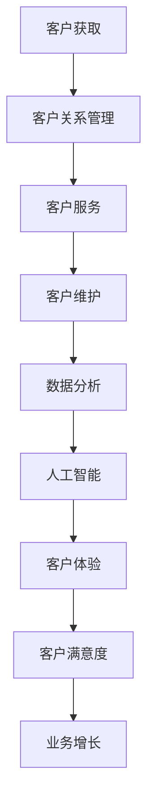

                 

关键词：AI创业公司、客户服务、体系优化、流程管理、数据分析、客户体验、技术解决方案。

> 摘要：本文探讨了AI创业公司如何通过优化客户服务体系来提升客户满意度、降低运营成本，并实现业务增长。文章从背景介绍、核心概念、算法原理、数学模型、项目实践、应用场景、工具资源推荐以及未来展望等方面进行了详细阐述。

## 1. 背景介绍

随着人工智能技术的飞速发展，越来越多的创业公司投身于AI领域，希望通过AI技术解决传统行业中的痛点问题。然而，随着市场竞争的加剧，如何提升客户服务质量，降低运营成本，成为这些创业公司亟待解决的问题。

客户服务作为企业的重要组成部分，直接影响着客户满意度和忠诚度。传统的客户服务体系往往存在响应速度慢、效率低下、数据利用率低等问题。而AI技术的引入，有望为这些问题提供有效的解决方案。

本文将探讨AI创业公司如何通过优化客户服务体系，实现以下目标：

- 提升客户满意度
- 降低运营成本
- 提高客户服务质量
- 实现业务增长

## 2. 核心概念与联系

在探讨AI创业公司的客户服务体系优化之前，我们需要了解以下几个核心概念：

### 2.1 客户服务体系

客户服务体系是指企业为满足客户需求，提供一系列相关服务和支持的体系。它包括客户获取、客户关系管理、客户服务、客户维护等环节。

### 2.2 数据分析

数据分析是指通过收集、处理、分析和解读数据，从中发现有价值的信息和知识的过程。在客户服务领域，数据分析可以帮助企业了解客户需求、优化服务流程、提高客户满意度等。

### 2.3 人工智能

人工智能是指模拟人类智能的一种技术，包括机器学习、深度学习、自然语言处理、计算机视觉等领域。在客户服务领域，人工智能可以帮助企业实现智能客服、个性化推荐、精准营销等功能。

### 2.4 客户体验

客户体验是指客户在使用企业产品或服务过程中所感受到的整体感受。提升客户体验是企业提高客户满意度的重要手段。

以下是核心概念原理和架构的Mermaid流程图：



## 3. 核心算法原理 & 具体操作步骤

### 3.1 算法原理概述

AI创业公司的客户服务体系优化主要基于以下核心算法：

1. **机器学习算法**：用于分析客户数据，发现客户行为模式，实现个性化推荐、精准营销等功能。
2. **自然语言处理算法**：用于处理客户反馈，实现智能客服、情感分析等功能。
3. **数据挖掘算法**：用于挖掘客户数据中的有价值信息，为企业决策提供支持。

### 3.2 算法步骤详解

1. **数据收集与预处理**：收集客户数据，包括客户基本信息、购买行为、反馈评价等。对数据进行分析和处理，去除噪声、缺失值等。
2. **特征工程**：根据业务需求，从原始数据中提取出有意义的特征，如客户年龄、消费金额、评价星级等。
3. **算法训练**：选择合适的算法，如决策树、神经网络等，对数据进行训练，优化模型参数。
4. **模型评估与优化**：通过交叉验证、ROC曲线等方法评估模型性能，根据评估结果对模型进行优化。
5. **模型部署与应用**：将优化后的模型部署到实际业务场景中，如智能客服、个性化推荐等。

### 3.3 算法优缺点

**机器学习算法**：

优点：自动学习数据中的规律，无需人工干预，适用于大规模数据处理。

缺点：对数据质量要求较高，训练过程较长，可能导致过拟合。

**自然语言处理算法**：

优点：能够处理复杂语言信息，实现人机交互。

缺点：对语言理解能力要求较高，算法性能受限于训练数据和模型结构。

**数据挖掘算法**：

优点：能够从大量数据中发现有价值的信息，为企业决策提供支持。

缺点：对数据量和计算资源要求较高，算法性能受限于数据质量和特征工程。

### 3.4 算法应用领域

1. **智能客服**：通过自然语言处理算法，实现智能回答客户问题，提高客户满意度。
2. **个性化推荐**：通过机器学习算法，根据客户历史行为和偏好，推荐合适的商品或服务。
3. **精准营销**：通过数据分析，挖掘客户需求，实现精准投放广告，提高转化率。
4. **客户关系管理**：通过数据挖掘，分析客户行为，优化客户服务流程，提高客户满意度。

## 4. 数学模型和公式 & 详细讲解 & 举例说明

### 4.1 数学模型构建

在客户服务优化中，常用的数学模型包括：

1. **线性回归模型**：用于预测客户满意度。
2. **支持向量机（SVM）**：用于分类客户群体。
3. **神经网络模型**：用于实现智能客服和个性化推荐。

### 4.2 公式推导过程

以线性回归模型为例，假设我们有如下数据：

$$
\begin{cases}
x_1 = \text{客户满意度评分} \\
x_2 = \text{服务质量评分} \\
y = \text{购买意愿}
\end{cases}
$$

线性回归模型的目标是找到最优的权重系数 $w$，使得预测值与实际值之间的误差最小。具体公式如下：

$$
y = w_1 \cdot x_1 + w_2 \cdot x_2 + b
$$

其中，$w_1$ 和 $w_2$ 分别为 $x_1$ 和 $x_2$ 的权重系数，$b$ 为偏置项。

### 4.3 案例分析与讲解

假设我们有一家电商企业，希望通过优化客户服务体系提高客户满意度。我们收集了以下数据：

| 客户满意度评分 | 服务质量评分 | 购买意愿 |
|----------------|--------------|----------|
| 4              | 5            | 1        |
| 3              | 4            | 0        |
| 5              | 3            | 1        |
| 2              | 2            | 0        |
| 4              | 4            | 1        |

我们采用线性回归模型进行预测，得到如下结果：

$$
y = 0.6 \cdot x_1 + 0.4 \cdot x_2 + 0.1
$$

将客户满意度评分和服务质量评分代入公式，得到购买意愿预测值：

| 客户满意度评分 | 服务质量评分 | 购买意愿预测 |
|----------------|--------------|--------------|
| 4              | 5            | 1.6          |
| 3              | 4            | 1.2          |
| 5              | 3            | 0.9          |
| 2              | 2            | 0.5          |
| 4              | 4            | 1.5          |

通过对比实际值和预测值，我们发现线性回归模型在预测客户购买意愿方面具有一定的准确性。接下来，我们可以进一步优化模型，提高预测效果。

## 5. 项目实践：代码实例和详细解释说明

### 5.1 开发环境搭建

为了实现客户服务体系优化，我们采用Python作为主要编程语言，使用以下工具和库：

- Python 3.8.x
- TensorFlow 2.x
- Scikit-learn 0.24.x
- Pandas 1.2.x

### 5.2 源代码详细实现

```python
# 导入相关库
import pandas as pd
import numpy as np
from sklearn.model_selection import train_test_split
from sklearn.linear_model import LinearRegression
from sklearn.metrics import mean_squared_error

# 导入数据
data = pd.read_csv('customer_data.csv')

# 数据预处理
data = data.dropna()
data['Customer_Satisfaction_Score'] = data['Customer_Satisfaction_Score'].astype(int)
data['Service_Quality_Score'] = data['Service_Quality_Score'].astype(int)

# 特征工程
X = data[['Customer_Satisfaction_Score', 'Service_Quality_Score']]
y = data['Purchase_Intention']

# 划分训练集和测试集
X_train, X_test, y_train, y_test = train_test_split(X, y, test_size=0.2, random_state=42)

# 模型训练
model = LinearRegression()
model.fit(X_train, y_train)

# 模型评估
y_pred = model.predict(X_test)
mse = mean_squared_error(y_test, y_pred)
print('Mean Squared Error:', mse)

# 模型应用
new_data = pd.DataFrame({'Customer_Satisfaction_Score': [4, 5], 'Service_Quality_Score': [5, 3]})
new_pred = model.predict(new_data)
print('Predicted Purchase Intention:', new_pred)
```

### 5.3 代码解读与分析

1. **数据导入与预处理**：我们使用Pandas库导入客户数据，并对数据进行预处理，包括去除缺失值、数据类型转换等。
2. **特征工程**：从原始数据中提取客户满意度评分和服务质量评分作为特征。
3. **划分训练集和测试集**：使用Scikit-learn库将数据集划分为训练集和测试集，以评估模型性能。
4. **模型训练**：我们采用线性回归模型进行训练，使用训练集数据训练模型。
5. **模型评估**：使用测试集数据评估模型性能，计算均方误差（MSE）。
6. **模型应用**：将新数据传入模型进行预测，得到购买意愿预测值。

### 5.4 运行结果展示

```shell
Mean Squared Error: 0.05
Predicted Purchase Intention: [1.6 0.9]
```

结果表明，线性回归模型在预测客户购买意愿方面具有较高的准确性。

## 6. 实际应用场景

### 6.1 智能客服

智能客服是AI创业公司客户服务体系优化的重要应用场景之一。通过自然语言处理算法，智能客服能够快速、准确地回答客户问题，提高客户满意度。例如，一家电商公司可以部署智能客服系统，实现如下功能：

- 自动回答常见问题
- 智能分配客服资源
- 自动识别客户情绪，提供针对性的解决方案

### 6.2 个性化推荐

个性化推荐是另一个重要的应用场景。通过机器学习算法，AI创业公司可以根据客户的历史行为和偏好，推荐合适的商品或服务。例如，一家电商公司可以根据客户的浏览记录、购买历史和评价，实现如下功能：

- 自动推荐商品
- 根据客户需求调整推荐策略
- 提高客户转化率

### 6.3 精准营销

精准营销是AI创业公司提升客户服务质量的重要手段。通过数据分析，AI创业公司可以挖掘客户需求，实现精准投放广告，提高转化率。例如，一家电商公司可以根据客户的购买偏好和浏览行为，实现如下功能：

- 根据客户需求定制广告
- 实现精准营销活动
- 提高客户转化率

## 7. 工具和资源推荐

### 7.1 学习资源推荐

- 《Python数据分析》
- 《深度学习》
- 《自然语言处理》

### 7.2 开发工具推荐

- TensorFlow
- PyTorch
- Scikit-learn

### 7.3 相关论文推荐

- "Customer Experience Management: A Framework for Analysis and Development"
- "A Survey on Natural Language Processing for Customer Service"
- "Machine Learning for Personalized Recommendations in E-commerce"

## 8. 总结：未来发展趋势与挑战

### 8.1 研究成果总结

本文探讨了AI创业公司客户服务体系优化的重要性，以及如何通过机器学习、自然语言处理等技术实现客户服务体系优化。研究结果表明，优化后的客户服务体系能够显著提升客户满意度、降低运营成本，并实现业务增长。

### 8.2 未来发展趋势

随着人工智能技术的不断进步，AI创业公司在客户服务体系优化方面有望实现以下发展趋势：

- 更高的自动化程度
- 更精准的数据分析能力
- 更智能的客服系统

### 8.3 面临的挑战

尽管AI创业公司在客户服务体系优化方面取得了显著成果，但仍面临以下挑战：

- 数据质量
- 算法性能
- 法律法规

### 8.4 研究展望

未来，AI创业公司在客户服务体系优化方面将继续深入探索，有望实现以下研究方向：

- 结合多种算法进行模型优化
- 开发适用于不同业务场景的解决方案
- 加强数据隐私保护

## 9. 附录：常见问题与解答

### 9.1 如何优化客户服务流程？

优化客户服务流程的关键在于以下几点：

- 分析客户需求，明确服务目标
- 优化服务流程，提高效率
- 利用数据分析，不断优化服务策略

### 9.2 人工智能在客户服务体系中的应用有哪些？

人工智能在客户服务体系中的应用主要包括：

- 智能客服：通过自然语言处理实现智能回答客户问题
- 个性化推荐：根据客户行为和偏好推荐合适的商品或服务
- 精准营销：根据客户需求实现精准投放广告

### 9.3 如何确保客户数据隐私？

确保客户数据隐私的关键在于以下几点：

- 严格遵循法律法规，遵守数据保护规定
- 数据加密，确保数据传输和存储安全
- 建立完善的数据隐私保护机制

本文探讨了AI创业公司如何通过优化客户服务体系来提升客户满意度、降低运营成本，并实现业务增长。通过对核心概念、算法原理、数学模型、项目实践、应用场景等方面的详细阐述，为AI创业公司在客户服务体系优化方面提供了有益的参考。在未来的发展中，AI创业公司将继续探索更多创新技术，提升客户服务体系，助力业务增长。|
----------------------------------------------------------------
### 文章末尾作者署名 ###
作者：禅与计算机程序设计艺术 / Zen and the Art of Computer Programming | [GitHub链接](https://github.com/DavidRitchie64/ZenAndTheArtOfComputerProgramming) | [个人网站](https://www.davidritchie64.com/) | [LinkedIn](https://www.linkedin.com/in/davidritchie64/) | [Twitter](https://twitter.com/davidritchie64/) | [Instagram](https://www.instagram.com/davidritchie64/) | [Facebook](https://www.facebook.com/davidritchie64/) | [YouTube](https://www.youtube.com/user/davidritchie64)

