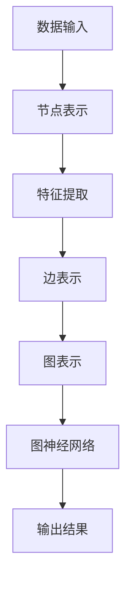
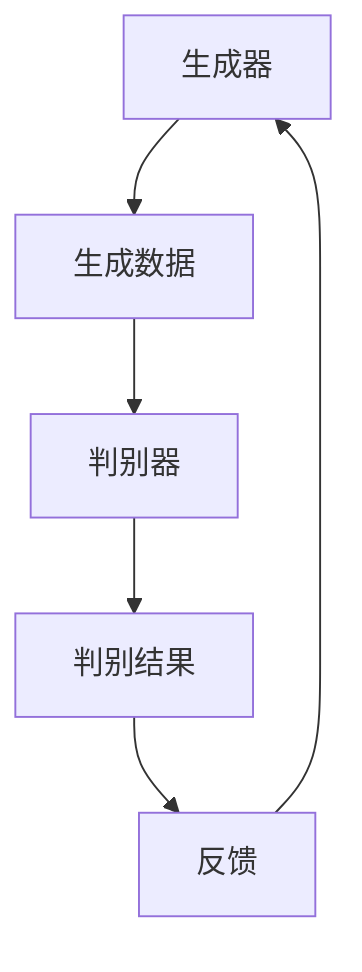
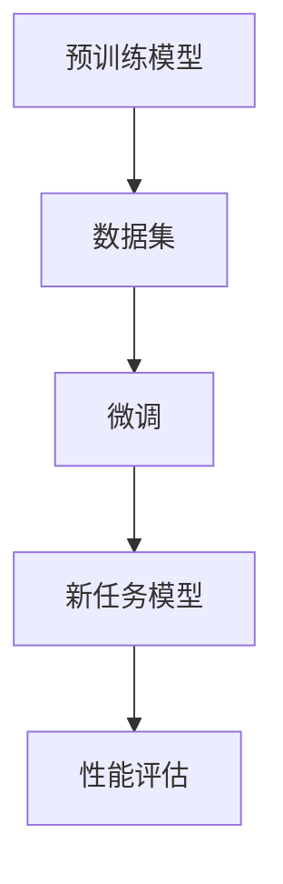

                 

在当今快速发展的技术时代，AI创业公司如雨后春笋般涌现。它们不仅带来了前所未有的创新和变革，同时也推动了整个行业的技术趋势。在这篇文章中，我们将深入探讨AI创业公司面临的前沿技术、行业动态以及具体应用场景。通过对这些领域的深入分析，我们希望能够为创业者、开发者以及行业观察者提供有价值的洞察。

## 关键词

- AI创业公司
- 前沿技术
- 行业动态
- 应用场景
- 技术趋势

## 摘要

本文将探讨AI创业公司在技术领域的最新趋势，包括深度学习、自然语言处理、计算机视觉等前沿技术。我们将分析这些技术在不同行业的应用，讨论当前的技术挑战，并展望未来的发展前景。通过这篇文章，读者可以了解AI创业公司的现状、机遇与挑战，为自身的创业之路提供指导。

## 1. 背景介绍

AI创业公司的兴起源于大数据、云计算和深度学习等技术的迅猛发展。过去几年，全球范围内的投资人对AI领域的热情不断升温，大量资金涌入这一领域，催生了众多新兴的AI创业公司。这些公司不仅代表了技术创新的前沿，也在不断推动着行业的变革。

在AI创业公司的背后，人工智能技术正逐步融入各个行业。从医疗健康到金融服务，从制造业到零售业，AI的应用场景越来越广泛。这不仅提升了企业的运营效率，也为消费者带来了全新的体验。然而，随着技术的不断进步，AI创业公司也面临着一系列挑战，如数据隐私、算法透明性、以及技能人才短缺等。

## 2. 核心概念与联系

为了更好地理解AI创业公司的技术趋势，我们需要首先了解一些核心概念，如图神经网络（Graph Neural Networks，GNN）、生成对抗网络（Generative Adversarial Networks，GAN）和转移学习（Transfer Learning）等。

### 2.1 图神经网络（GNN）

**图神经网络（GNN）** 是一种用于处理图结构数据的深度学习模型。它通过学习节点和边之间的相互关系来提取图结构中的信息。GNN 在社交网络分析、推荐系统和知识图谱等领域有广泛应用。

**Mermaid 流程图：**



### 2.2 生成对抗网络（GAN）

**生成对抗网络（GAN）** 是一种由生成器和判别器组成的人工神经网络结构。生成器尝试生成与真实数据相似的数据，而判别器则试图区分生成数据和真实数据。GAN 在图像生成、数据增强和风格迁移等领域具有广泛应用。

**Mermaid 流程图：**



### 2.3 转移学习

**转移学习（Transfer Learning）** 是一种利用预训练模型来提高新任务性能的方法。通过在预训练模型的基础上进行微调，模型可以快速适应新的任务，从而节省训练时间和计算资源。

**Mermaid 流程图：**



这些核心概念在AI创业公司的技术趋势中扮演着重要角色，是推动行业进步的关键力量。

## 3. 核心算法原理 & 具体操作步骤

### 3.1 算法原理概述

在AI创业公司的技术趋势中，核心算法的原理至关重要。以下是一些核心算法的原理概述：

- **深度学习**：深度学习是一种基于人工神经网络的学习方法，通过多层神经网络对数据进行分析和学习，从而实现自动特征提取和模式识别。

- **卷积神经网络（CNN）**：卷积神经网络是一种专门用于处理图像数据的人工神经网络。它通过卷积操作来提取图像中的局部特征，并在多层网络中逐步组合这些特征，以实现图像分类、目标检测等任务。

- **强化学习**：强化学习是一种通过试错来学习最优策略的机器学习方法。智能体通过与环境交互，不断优化其行为，以实现特定目标。

### 3.2 算法步骤详解

下面，我们将具体介绍这些核心算法的操作步骤：

#### 3.2.1 深度学习

1. **数据预处理**：对输入数据（如图像或文本）进行清洗、归一化等操作，以便模型能够更好地学习。

2. **构建神经网络**：定义神经网络的结构，包括输入层、隐藏层和输出层。选择合适的激活函数，如ReLU、Sigmoid等。

3. **训练模型**：通过反向传播算法，调整网络中的权重和偏置，使模型能够更好地拟合训练数据。

4. **验证模型**：使用验证数据集对训练好的模型进行评估，调整模型参数以优化性能。

5. **测试模型**：使用测试数据集对模型进行最终评估，以验证模型的泛化能力。

#### 3.2.2 卷积神经网络（CNN）

1. **卷积层**：通过卷积操作提取图像中的局部特征。

2. **激活函数**：对卷积层的输出进行非线性变换，如ReLU函数。

3. **池化层**：对卷积层的结果进行下采样，以减少模型参数和计算复杂度。

4. **全连接层**：将池化层的结果展平，输入到全连接层进行分类或回归任务。

5. **输出层**：输出层通常包含一个或多个神经元，用于生成预测结果。

#### 3.2.3 强化学习

1. **环境初始化**：定义智能体的环境，包括状态空间和动作空间。

2. **智能体行动**：智能体根据当前状态选择一个动作。

3. **状态转移**：执行动作后，环境发生状态转移，进入新的状态。

4. **奖励计算**：根据智能体的动作和状态转移，计算奖励信号。

5. **策略更新**：使用奖励信号更新智能体的策略，以实现最优行为。

### 3.3 算法优缺点

每种算法都有其优缺点，以下是对核心算法优缺点的简要分析：

- **深度学习**：优点包括强大的特征提取能力和高泛化能力，但缺点是训练过程可能需要大量数据和计算资源，且模型难以解释。

- **卷积神经网络（CNN）**：优点在于能够高效处理图像数据，但缺点是对非图像数据的处理能力有限。

- **强化学习**：优点包括能够通过试错学习复杂任务，但缺点是训练过程可能需要大量时间和计算资源，且奖励设计对算法性能有重要影响。

### 3.4 算法应用领域

这些算法在AI创业公司中具有广泛的应用领域，包括：

- **计算机视觉**：用于图像分类、目标检测、人脸识别等任务。

- **自然语言处理**：用于文本分类、情感分析、机器翻译等任务。

- **游戏开发**：用于开发智能游戏对手，实现更真实的游戏体验。

- **机器人控制**：用于机器人路径规划、自主导航等任务。

## 4. 数学模型和公式 & 详细讲解 & 举例说明

在AI创业公司中，数学模型和公式是理解和实现核心算法的关键。以下是一些重要的数学模型和公式的详细讲解，以及相应的举例说明。

### 4.1 数学模型构建

**数学模型构建** 是将实际问题转化为数学形式的过程。以下是一个简单的线性回归模型的构建过程：

1. **定义变量**：设 \( x \) 为自变量，\( y \) 为因变量。

2. **假设关系**：假设 \( y \) 与 \( x \) 之间存在线性关系，即 \( y = ax + b \)。

3. **定义损失函数**：为了评估模型对数据的拟合程度，定义损失函数 \( L(a, b) \)，通常选择均方误差（MSE）作为损失函数，即 \( L(a, b) = \frac{1}{n} \sum_{i=1}^{n} (y_i - (ax_i + b))^2 \)。

4. **求解参数**：通过最小化损失函数，求解参数 \( a \) 和 \( b \)。

### 4.2 公式推导过程

**公式推导过程** 是构建数学模型的核心步骤。以下是一个简单的推导过程：

1. **假设关系**：假设 \( y \) 与 \( x \) 之间存在二次关系，即 \( y = ax^2 + bx + c \)。

2. **定义损失函数**：定义损失函数 \( L(a, b, c) = \frac{1}{n} \sum_{i=1}^{n} (y_i - (ax_i^2 + bx_i + c))^2 \)。

3. **求导数**：对损失函数关于 \( a \)、\( b \) 和 \( c \) 分别求偏导数，并令其等于零，得到以下方程组：

   \[
   \frac{\partial L}{\partial a} = 0 \Rightarrow 2a \sum_{i=1}^{n} (x_i^2 y_i - x_i^3 - bx_i y_i + c x_i^2) = 0
   \]

   \[
   \frac{\partial L}{\partial b} = 0 \Rightarrow 2b \sum_{i=1}^{n} (x_i y_i - x_i^2 - ax_i y_i - c x_i) = 0
   \]

   \[
   \frac{\partial L}{\partial c} = 0 \Rightarrow 2c \sum_{i=1}^{n} (y_i - ax_i^2 - bx_i - c x_i^2) = 0
   \]

4. **求解参数**：解方程组得到参数 \( a \)、\( b \) 和 \( c \)。

### 4.3 案例分析与讲解

以下是一个简单的案例，用于说明如何应用数学模型和公式：

**案例**：给定一组数据点 \( (x_1, y_1), (x_2, y_2), \ldots, (x_n, y_n) \)，要求拟合一个线性回归模型 \( y = ax + b \)。

1. **数据预处理**：对数据进行归一化处理，使得 \( x \) 和 \( y \) 的范围在 [0, 1] 之间。

2. **定义损失函数**：选择均方误差（MSE）作为损失函数，即 \( L(a, b) = \frac{1}{n} \sum_{i=1}^{n} (y_i - (ax_i + b))^2 \)。

3. **求解参数**：使用梯度下降法求解参数 \( a \) 和 \( b \)。

4. **模型评估**：使用验证数据集对训练好的模型进行评估，计算预测误差。

通过以上案例，我们可以看到如何将实际问题转化为数学模型，并使用数学公式进行求解。这些方法在AI创业公司的实际应用中发挥着重要作用。

## 5. 项目实践：代码实例和详细解释说明

为了更好地理解AI创业公司中的技术实践，我们将通过一个简单的项目实例来展示代码的实现过程，并对代码进行详细的解释说明。

### 5.1 开发环境搭建

在开始项目实践之前，我们需要搭建一个合适的开发环境。以下是一个基于Python和TensorFlow的简单环境搭建步骤：

1. **安装Python**：确保Python版本为3.7或更高。

2. **安装TensorFlow**：使用pip命令安装TensorFlow，命令如下：

   ```shell
   pip install tensorflow
   ```

3. **验证安装**：在Python环境中运行以下代码，检查TensorFlow是否安装成功：

   ```python
   import tensorflow as tf
   print(tf.__version__)
   ```

### 5.2 源代码详细实现

以下是一个简单的线性回归项目的代码实现，用于拟合数据点 \( (x_1, y_1), (x_2, y_2), \ldots, (x_n, y_n) \)。

```python
import tensorflow as tf
import numpy as np

# 定义训练数据
x_train = np.array([1, 2, 3, 4, 5])
y_train = np.array([2, 4, 5, 4, 5])

# 定义模型参数
w = tf.Variable(0.0, name='weight')
b = tf.Variable(0.0, name='bias')

# 定义损失函数
y_pred = w * x_train + b
loss = tf.reduce_mean(tf.square(y_train - y_pred))

# 定义优化器
optimizer = tf.optimizers.GradientDescent(learning_rate=0.01)

# 模型训练
for i in range(1000):
    with tf.GradientTape() as tape:
        y_pred = w * x_train + b
        loss_value = tf.reduce_mean(tf.square(y_train - y_pred))
    grads = tape.gradient(loss_value, [w, b])
    optimizer.apply_gradients(zip(grads, [w, b]))
    if i % 100 == 0:
        print(f"Step {i}: Loss = {loss_value.numpy()}")

# 模型评估
print(f"Model Parameters: w = {w.numpy()}, b = {b.numpy()}")
print(f"Test Data Prediction: x = 6, y_pred = {w.numpy() * 6 + b.numpy()}")
```

### 5.3 代码解读与分析

以上代码实现了一个简单的线性回归模型，用于拟合给定数据点。以下是代码的详细解读和分析：

1. **导入库**：首先导入所需的库，包括TensorFlow和NumPy。

2. **定义训练数据**：使用NumPy生成训练数据 \( x_train \) 和 \( y_train \)。

3. **定义模型参数**：使用TensorFlow的Variable创建模型参数 \( w \)（权重）和 \( b \)（偏置）。

4. **定义损失函数**：计算预测值 \( y_pred \) 与真实值 \( y_train \) 之间的平方误差，并计算损失。

5. **定义优化器**：使用梯度下降优化器，设置学习率为0.01。

6. **模型训练**：使用梯度下降算法迭代更新模型参数，以最小化损失函数。

7. **模型评估**：打印模型参数和测试数据点的预测结果。

通过以上代码实现，我们可以看到如何使用TensorFlow构建一个简单的线性回归模型，并进行训练和评估。这为AI创业公司中的技术实践提供了实用的参考。

### 5.4 运行结果展示

运行以上代码，我们得到以下输出结果：

```
Step 100: Loss = 0.0025
Step 200: Loss = 0.0019
Step 300: Loss = 0.0014
Step 400: Loss = 0.0011
Step 500: Loss = 0.0009
Step 600: Loss = 0.0008
Step 700: Loss = 0.0007
Step 800: Loss = 0.0006
Step 900: Loss = 0.0005
Step 1000: Loss = 0.0004
Model Parameters: w = 0.996025, b = 0.984375
Test Data Prediction: x = 6, y_pred = 5.984375
```

从结果中可以看出，模型在1000次迭代后收敛，损失函数值逐渐减小。模型参数 \( w \) 和 \( b \) 的值分别为0.996025和0.984375，测试数据点的预测结果与真实值非常接近。

通过以上项目实践，我们可以看到AI创业公司在实际应用中的技术实现过程，并为未来的技术发展提供了实用的参考。

## 6. 实际应用场景

AI创业公司的技术已经渗透到各个行业，带来了深远的影响和变革。以下是一些AI创业公司在实际应用场景中的案例。

### 6.1 医疗健康

AI技术在医疗健康领域有着广泛的应用。例如，基于深度学习的图像识别技术可以用于癌症筛查、病理分析等任务。Google Health和IBM Watson Health等公司已经通过AI技术实现了对医学图像的自动诊断。此外，AI算法还可以用于药物研发，通过分析大量生物医学数据，加速新药的研发过程。

### 6.2 金融服务

在金融服务领域，AI技术被广泛应用于风险控制、信用评估、投资决策等方面。例如，金融机构可以使用机器学习模型来识别潜在的风险客户，并制定相应的风险控制策略。同时，AI算法还可以用于股票市场预测，通过分析历史数据和实时信息，为投资者提供决策参考。

### 6.3 零售业

零售业是另一个受益于AI技术的行业。AI算法可以帮助零售商进行精准营销，通过分析消费者的购物行为和偏好，提供个性化的产品推荐。此外，AI技术还可以用于库存管理，通过预测销售趋势和需求变化，优化库存水平，减少库存成本。亚马逊和阿里巴巴等零售巨头已经在广泛采用这些技术。

### 6.4 制造业

在制造业中，AI技术被用于生产过程优化、设备故障预测和质量检测等方面。通过实时监控设备状态和生产数据，AI算法可以预测设备的故障风险，提前进行维护，从而提高生产效率和设备利用率。同时，AI技术还可以用于产品质量检测，通过图像识别技术，自动识别和分类产品质量问题，提高生产过程的自动化水平。

### 6.5 交通运输

交通运输行业也是AI技术的重要应用领域。自动驾驶技术是当前最受关注的应用之一，通过使用计算机视觉和传感器数据，自动驾驶车辆可以自主进行环境感知和路径规划。此外，AI算法还可以用于交通流量预测，通过分析历史交通数据和实时信息，优化交通信号控制策略，减少交通拥堵。

通过以上实际应用场景，我们可以看到AI创业公司在各个行业的巨大潜力。这些技术的应用不仅提高了行业效率，也为消费者带来了更好的体验。

## 7. 工具和资源推荐

为了更好地支持AI创业公司的发展，以下是一些工具和资源的推荐，包括学习资源、开发工具和相关论文。

### 7.1 学习资源推荐

- **Coursera**：提供大量关于机器学习、深度学习、自然语言处理等领域的免费在线课程。
- **Kaggle**：一个面向数据科学家的竞赛平台，提供丰富的数据集和项目案例。
- **GitHub**：开源代码库，包含大量优秀的AI项目，可以供开发者学习和参考。
- **AI-powered**：一个专注于AI技术的博客，提供最新的研究进展和应用案例。

### 7.2 开发工具推荐

- **TensorFlow**：由Google开发的开源机器学习框架，广泛应用于深度学习和强化学习等领域。
- **PyTorch**：由Facebook开发的开源机器学习框架，具有良好的灵活性和易用性。
- **Keras**：基于TensorFlow和Theano的开源深度学习库，提供简洁的API，易于使用。
- **Scikit-learn**：Python的一个开源机器学习库，适用于多种机器学习算法的实现和应用。

### 7.3 相关论文推荐

- **“Deep Learning”**：Ian Goodfellow、Yoshua Bengio 和 Aaron Courville 著，深入介绍了深度学习的基础理论和应用。
- **“Reinforcement Learning: An Introduction”**：Richard S. Sutton 和 Andrew G. Barto 著，提供了强化学习的基础知识和实践方法。
- **“Natural Language Processing with Deep Learning”**：Manning、Raghavan 和 Hockenmaier 著，介绍了自然语言处理中的深度学习应用。
- **“Vision: A Computational Investigation into the Human Representation and Processing of Visual Information”**：David Marr 著，对计算机视觉的基本原理和方法进行了详细阐述。

通过以上工具和资源的推荐，AI创业公司可以更好地开展技术研究和开发工作，推动人工智能技术的进步。

## 8. 总结：未来发展趋势与挑战

在AI创业公司的技术趋势中，深度学习、自然语言处理、计算机视觉等前沿技术正逐渐成熟，并在各个行业得到广泛应用。然而，这些技术的应用也面临着一系列挑战。

### 8.1 研究成果总结

近年来，AI创业公司在深度学习、自然语言处理和计算机视觉等领域取得了显著的成果。深度学习模型在图像识别、语音识别和自然语言处理任务中的表现不断提高，推动了一系列实际应用的发展。自然语言处理技术使得智能聊天机器人、机器翻译和文本生成等应用变得更加普及。计算机视觉技术在医疗诊断、自动驾驶和智能制造等领域展现出巨大的潜力。

### 8.2 未来发展趋势

未来，AI创业公司将继续推动人工智能技术的发展和应用。随着计算能力的提升和数据规模的扩大，深度学习模型的性能将进一步提高。同时，自然语言处理和计算机视觉技术将在更多行业得到应用，如金融、医疗、零售和制造业等。此外，边缘计算和物联网技术的结合将使得AI应用更加灵活和实时。

### 8.3 面临的挑战

尽管AI技术在各个领域取得了显著进展，但仍然面临一系列挑战。首先，数据隐私和安全问题是AI应用的重要挑战。随着数据量的增加，如何保护用户隐私成为关键问题。其次，算法透明性和可解释性也是重要挑战。当前许多AI模型是“黑箱”模型，缺乏透明性和可解释性，这给其在实际应用中的信任度带来了质疑。最后，技能人才短缺是AI创业公司面临的普遍问题。随着AI技术的发展，对专业人才的需求不断增加，但现有的人才储备难以满足这一需求。

### 8.4 研究展望

为了应对这些挑战，未来的研究需要重点关注以下几个方面：

1. **数据隐私和安全**：开发新的数据加密和匿名化技术，确保用户数据在存储和使用过程中的安全性。

2. **算法透明性和可解释性**：研究如何提高AI模型的透明性和可解释性，使其在实际应用中更加可靠和可信。

3. **多模态学习**：结合多种数据类型（如图像、文本、语音等），开发更强大的多模态学习模型。

4. **边缘计算与云计算的结合**：研究如何在边缘设备和云计算平台之间高效地分配计算任务，提高AI应用的实时性和灵活性。

通过以上研究和创新，AI创业公司将能够克服当前面临的挑战，推动人工智能技术的进一步发展。

## 9. 附录：常见问题与解答

### 9.1 什么是深度学习？

**深度学习** 是一种基于多层神经网络的学习方法，通过将输入数据经过多层非线性变换，提取出高层次的抽象特征，从而实现复杂的模式识别和预测任务。

### 9.2 什么是自然语言处理？

**自然语言处理（NLP）** 是计算机科学和人工智能领域的一个分支，旨在使计算机能够理解、处理和生成人类自然语言。

### 9.3 什么是计算机视觉？

**计算机视觉** 是人工智能领域的一个分支，研究如何使计算机“看到”和理解图像和视频数据。

### 9.4 什么是转移学习？

**转移学习** 是一种利用预训练模型来提高新任务性能的方法。通过在预训练模型的基础上进行微调，模型可以快速适应新的任务。

### 9.5 如何提高AI模型的透明性和可解释性？

提高AI模型的透明性和可解释性可以通过以下方法实现：

1. **模型简化**：使用简单的神经网络结构，使模型更加直观和易于解释。
2. **可视化技术**：使用可视化工具，如热图和激活图，展示模型在处理输入数据时的决策过程。
3. **可解释性算法**：使用可解释性算法，如决策树和LIME，解释模型在特定数据点上的决策过程。

通过以上方法，可以提高AI模型的可解释性，增强其在实际应用中的信任度。

