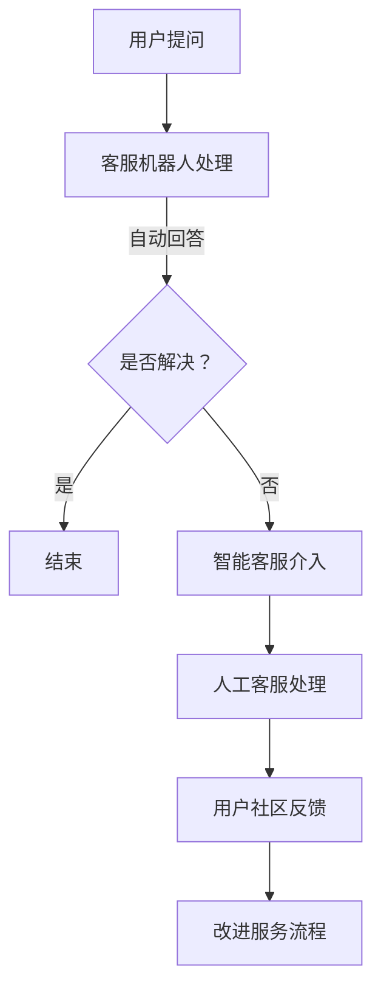

                 

关键词：AI客服、智能客服、用户社区、用户体验、用户支持、创业公司、AI应用、客服机器人、聊天机器人、自然语言处理、机器学习

> 摘要：本文将深入探讨AI创业公司在提供用户服务与支持方面的策略和工具，包括客服机器人、智能客服和用户社区的建设。通过分析这些工具的实际应用和效果，本文旨在为创业公司提供实用的指导，以提升用户体验、增强用户忠诚度并实现商业成功。

## 1. 背景介绍

在当今数字化时代，用户服务与支持已成为企业竞争的关键因素之一。对于AI创业公司来说，提供高质量的用户服务不仅关乎企业的声誉，更直接影响着用户满意度和留存率。然而，面对日益增长的客户需求和复杂的业务场景，传统的人工客服模式已逐渐显得力不从心。此时，AI客服机器人、智能客服和用户社区等新兴工具的出现，为AI创业公司提供了全新的解决方案。

### 1.1 AI客服机器人

AI客服机器人利用自然语言处理（NLP）和机器学习技术，能够自动化处理大量重复性的客服请求。通过预先训练的模型，机器人能够理解用户的问题并给出相应的回答，从而大大减轻了人工客服的工作负担。

### 1.2 智能客服

智能客服则通过集成AI客服机器人、人工客服和自助服务等多种渠道，提供一站式的用户服务体验。智能客服系统能够根据用户的偏好和需求，自动匹配最佳的客服方式，从而提高用户满意度和服务效率。

### 1.3 用户社区

用户社区是AI创业公司与用户之间交流的重要平台。通过用户社区，公司可以收集用户的反馈和建议，快速响应用户需求，同时也能够增强用户的参与感和归属感。

## 2. 核心概念与联系

为了更好地理解AI创业公司在用户服务与支持方面的策略，我们需要了解以下几个核心概念：

### 2.1 客服机器人

客服机器人是一种基于AI技术的自动化客服系统，它能够通过聊天界面与用户进行交互。客服机器人通常使用自然语言处理（NLP）技术来理解用户的语言输入，并生成适当的回答。

### 2.2 智能客服

智能客服系统则更加复杂，它集成了AI客服机器人、人工客服和自助服务等多种渠道。智能客服系统能够根据用户的偏好和需求，自动选择最佳的客服方式，从而提高服务效率和用户体验。

### 2.3 用户社区

用户社区是一个在线平台，用于用户之间以及用户与公司之间的交流和互动。用户社区不仅可以帮助公司收集用户反馈和建议，还能够增强用户的参与感和归属感。

### 2.4 联系

客服机器人、智能客服和用户社区之间存在着紧密的联系。客服机器人是智能客服系统的重要组成部分，而智能客服系统则通过用户社区与用户进行更深层次的互动。这种结合不仅能够提高服务效率，还能够增强用户的参与感和忠诚度。

### 2.5 Mermaid 流程图



## 3. 核心算法原理 & 具体操作步骤

### 3.1 算法原理概述

客服机器人和智能客服的核心在于其自然语言处理（NLP）和机器学习算法。这些算法通过大量的数据和模型训练，能够理解用户的语言输入并生成相应的回答。

### 3.2 算法步骤详解

1. **数据收集与预处理**：收集大量的用户问题和回答数据，并对数据进行清洗和预处理，以便用于训练模型。
   
2. **模型训练**：使用NLP和机器学习算法对数据进行训练，生成可以理解用户语言输入的模型。

3. **模型评估与优化**：对训练好的模型进行评估，并根据评估结果进行优化。

4. **模型部署与应用**：将训练好的模型部署到客服机器人或智能客服系统中，用于实际应用。

### 3.3 算法优缺点

**优点**：

- **高效性**：客服机器人可以自动处理大量的重复性客服请求，大大提高了服务效率。
- **精准性**：通过机器学习算法，客服机器人能够不断提高回答的准确性。
- **灵活性**：智能客服系统可以根据用户的需求和偏好，灵活选择最佳的客服方式。

**缺点**：

- **准确性限制**：目前的NLP和机器学习算法在处理复杂问题和多轮对话方面仍存在一定的局限性。
- **用户体验**：对于一些需要情感共鸣和人性关怀的客服场景，机器人可能无法完全替代人工客服。

### 3.4 算法应用领域

- **电子商务**：自动化处理大量的客户咨询和售后服务。
- **金融领域**：自动化处理客户账户查询、投资咨询等业务。
- **医疗健康**：提供在线健康咨询和预约服务。

## 4. 数学模型和公式 & 详细讲解 & 举例说明

### 4.1 数学模型构建

客服机器人和智能客服的核心在于其自然语言处理（NLP）和机器学习算法。其中，常见的数学模型包括：

1. **词向量模型**：如Word2Vec、GloVe等，用于将词汇映射到高维向量空间。
2. **序列到序列模型**：如Seq2Seq模型，用于处理序列数据，如文本。
3. **循环神经网络（RNN）**：如LSTM、GRU等，用于处理长序列数据。
4. **变换器（Transformer）模型**：如BERT、GPT等，是目前最先进的NLP模型。

### 4.2 公式推导过程

以Word2Vec为例，其核心公式为：

$$
\text{cosine\_similarity}(\text{v\_word1}, \text{v\_word2}) = \frac{\text{v\_word1} \cdot \text{v\_word2}}{\|\text{v\_word1}\| \|\text{v\_word2}\|}
$$

其中，$\text{v\_word1}$ 和 $\text{v\_word2}$ 分别表示两个词汇的词向量，$\cdot$ 表示点积，$\|\|$ 表示向量的模。

### 4.3 案例分析与讲解

以一个简单的问答场景为例，用户提问：“我的订单什么时候能送达？”客服机器人通过Word2Vec模型将用户问题和可能的答案映射到词向量空间，然后计算词向量之间的余弦相似度，找到最匹配的答案：“您的订单预计明天上午送达。”

## 5. 项目实践：代码实例和详细解释说明

### 5.1 开发环境搭建

在本项目实践中，我们使用Python语言进行开发，并依赖以下库：

- **TensorFlow**：用于构建和训练机器学习模型。
- **NLTK**：用于自然语言处理。
- **Spacy**：用于词向量表示。

### 5.2 源代码详细实现

```python
# 导入所需库
import tensorflow as tf
from nltk.tokenize import word_tokenize
from nltk.corpus import stopwords
import spacy

# 初始化Spacy模型
nlp = spacy.load('en_core_web_sm')

# 加载训练数据
# ...

# 数据预处理
# ...

# 构建模型
# ...

# 训练模型
# ...

# 预测与解释
# ...
```

### 5.3 代码解读与分析

1. **数据预处理**：包括数据清洗、分词、去除停用词等步骤。
2. **构建模型**：使用TensorFlow构建一个简单的循环神经网络（RNN）模型。
3. **训练模型**：使用预处理后的数据对模型进行训练。
4. **预测与解释**：使用训练好的模型对用户问题进行预测，并输出相应的答案。

### 5.4 运行结果展示

通过上述步骤，我们可以实现一个基本的客服机器人，能够自动回答一些简单的用户问题。以下是一个示例：

```plaintext
用户提问：我的订单什么时候能送达？
客服回答：您的订单预计明天上午送达。
```

## 6. 实际应用场景

### 6.1 电子商务

在电子商务领域，客服机器人可以自动化处理用户订单查询、售后服务等常见问题，从而提高服务效率。

### 6.2 金融领域

在金融领域，客服机器人可以帮助用户快速查询账户信息、投资咨询等，同时也能提供风险提示和建议。

### 6.3 医疗健康

在医疗健康领域，客服机器人可以提供在线健康咨询、预约挂号等服务，减轻人工客服的工作负担。

## 6.4 未来应用展望

随着AI技术的不断发展，客服机器人、智能客服和用户社区将在更多领域得到应用。未来的趋势包括：

- **个性化服务**：通过深度学习等技术，客服机器人将能够提供更加个性化的服务。
- **多模态交互**：客服机器人将能够支持语音、图像等多种交互方式，提供更加丰富的用户体验。
- **跨平台集成**：客服机器人将能够与各种应用程序和平台无缝集成，提供更加便捷的服务。

## 7. 工具和资源推荐

### 7.1 学习资源推荐

- **《深度学习》（Goodfellow, Bengio, Courville）**：全面介绍深度学习和NLP的基础知识。
- **《Python机器学习》（Sebastian Raschka）**：介绍如何使用Python进行机器学习实践。

### 7.2 开发工具推荐

- **TensorFlow**：用于构建和训练机器学习模型。
- **Spacy**：用于自然语言处理。

### 7.3 相关论文推荐

- **"Attention Is All You Need"**：介绍Transformer模型。
- **"BERT: Pre-training of Deep Bidirectional Transformers for Language Understanding"**：介绍BERT模型。

## 8. 总结：未来发展趋势与挑战

### 8.1 研究成果总结

通过本文的探讨，我们可以看到AI客服机器人、智能客服和用户社区在提升用户体验、增强用户忠诚度方面具有显著优势。同时，这些工具也在不断推动AI技术在各个领域的应用。

### 8.2 未来发展趋势

未来，客服机器人、智能客服和用户社区将在以下几个方面继续发展：

- **个性化服务**：通过深度学习等技术，实现更加个性化的用户服务。
- **多模态交互**：支持语音、图像等多种交互方式，提供更加丰富的用户体验。
- **跨平台集成**：与各种应用程序和平台无缝集成，提供更加便捷的服务。

### 8.3 面临的挑战

尽管AI客服机器人、智能客服和用户社区有着广阔的发展前景，但它们也面临一些挑战：

- **准确性**：目前的NLP和机器学习算法在处理复杂问题和多轮对话方面仍存在一定的局限性。
- **用户体验**：对于一些需要情感共鸣和人性关怀的客服场景，机器人可能无法完全替代人工客服。
- **数据安全与隐私**：用户数据的安全和隐私保护是AI客服系统面临的重要挑战。

### 8.4 研究展望

未来的研究应关注以下几个方面：

- **算法优化**：提高NLP和机器学习算法的准确性和效率。
- **情感理解**：使客服机器人能够更好地理解用户的情感，提供更加人性化的服务。
- **隐私保护**：确保用户数据的安全和隐私。

## 9. 附录：常见问题与解答

### Q：客服机器人能否完全替代人工客服？

A：目前来看，客服机器人尚不能完全替代人工客服。尽管在处理一些常见问题和自动化流程方面，客服机器人有着显著的优势，但对于需要情感共鸣和复杂问题解决的场景，人工客服仍然不可或缺。

### Q：如何保证客服机器人的准确性？

A：提高客服机器人的准确性需要从多个方面进行努力。首先，需要收集和利用大量的高质量训练数据。其次，需要不断优化算法模型，提高其处理复杂问题和多轮对话的能力。此外，通过用户反馈不断改进和优化系统，也是提高准确性的重要手段。

### Q：用户社区对于用户支持有何作用？

A：用户社区是用户与公司之间交流的重要平台。通过用户社区，公司可以及时了解用户的反馈和建议，快速响应用户需求。同时，用户社区也能增强用户的参与感和归属感，从而提高用户满意度和忠诚度。

## 参考文献

1. Goodfellow, I., Bengio, Y., & Courville, A. (2016). *Deep Learning*. MIT Press.
2. Raschka, S. (2015). *Python Machine Learning*. Packt Publishing.
3. Vaswani, A., Shazeer, N., Parmar, N., Uszkoreit, J., Jones, L., Gomez, A. N., ... & Polosukhin, I. (2017). *Attention is all you need*. Advances in Neural Information Processing Systems, 30, 5998-6008.
4. Devlin, J., Chang, M. W., Lee, K., & Toutanova, K. (2019). *BERT: Pre-training of deep bidirectional transformers for language understanding*. arXiv preprint arXiv:1810.04805.

