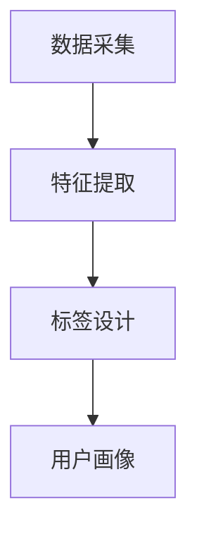

                 

关键词：用户画像、标签体系、数据采集、特征提取、AI创业公司

摘要：本文旨在探讨AI创业公司在构建用户画像和标签体系方面的关键步骤。文章首先介绍用户画像和标签体系的定义及其重要性，然后详细阐述数据采集、特征提取和标签设计的过程，最后探讨其在实际应用场景中的实施方法和未来展望。

## 1. 背景介绍

### AI创业公司的发展现状

随着大数据和人工智能技术的迅猛发展，AI创业公司如雨后春笋般涌现。这些公司利用人工智能技术，为各行各业提供智能化的解决方案，包括但不限于金融、医疗、电商、教育等领域。然而，AI创业公司在发展过程中面临着诸多挑战，如如何准确理解用户需求、如何有效提升用户体验等。

### 用户画像与标签体系的重要性

用户画像是指通过对用户行为数据的分析，构建出用户的综合画像，从而更好地理解用户的需求和偏好。标签体系则是通过给用户打上不同的标签，以实现对用户的精细化管理。用户画像和标签体系在AI创业公司中具有至关重要的作用：

- **提升用户体验**：通过用户画像，AI创业公司可以更准确地了解用户的需求，从而提供个性化的服务和推荐。
- **优化运营策略**：标签体系可以帮助公司对用户进行精准营销，提高转化率和客户满意度。
- **提高决策效率**：基于用户画像和标签体系，公司可以更快速地做出数据驱动型的决策。

## 2. 核心概念与联系

### 用户画像

用户画像是指通过对用户行为数据的收集、处理和分析，构建出用户的综合画像。用户画像包括用户的基本信息、行为数据、兴趣偏好等多个维度。

### 标签体系

标签体系是指通过给用户打上不同的标签，以实现对用户的分类和管理。标签可以是静态的，如性别、年龄等，也可以是动态的，如购物偏好、阅读偏好等。

### 数据采集、特征提取与标签设计的关系

- **数据采集**：数据采集是构建用户画像和标签体系的基础，通过多种渠道收集用户数据。
- **特征提取**：特征提取是将原始数据转化为有用特征的过程，是构建用户画像和标签体系的关键。
- **标签设计**：标签设计是根据特征提取的结果，为用户打上不同标签的过程。

### Mermaid流程图



## 3. 核心算法原理 & 具体操作步骤

### 3.1 算法原理概述

- **数据采集**：通过网站、APP、传感器等渠道收集用户数据，如行为数据、兴趣数据、位置数据等。
- **特征提取**：利用机器学习算法，如聚类、分类等，对用户数据进行处理，提取出有用特征。
- **标签设计**：根据特征提取的结果，为用户打上不同标签，实现对用户的精细化管理。

### 3.2 算法步骤详解

- **数据采集**：确定数据来源，如网站日志、APP 日志、传感器数据等。然后，通过API、爬虫等方式收集数据。
- **数据预处理**：对收集到的数据进行清洗、去重、格式化等处理，确保数据质量。
- **特征提取**：选择合适的机器学习算法，如 K-Means、SVM、随机森林等，对预处理后的数据进行分析，提取出有用特征。
- **标签设计**：根据特征提取的结果，为用户打上不同标签，如“高价值客户”、“高频用户”等。

### 3.3 算法优缺点

- **优点**：能够准确了解用户需求，提高用户体验和运营效果。
- **缺点**：数据采集和特征提取过程复杂，需要大量的计算资源和专业知识。

### 3.4 算法应用领域

- **金融行业**：通过用户画像和标签体系，银行和保险公司可以更精准地了解用户风险偏好，提供个性化的金融服务。
- **电商行业**：通过用户画像和标签体系，电商平台可以推荐用户感兴趣的商品，提高用户购买意愿。

## 4. 数学模型和公式 & 详细讲解 & 举例说明

### 4.1 数学模型构建

用户画像和标签体系的构建通常涉及到以下数学模型：

- **聚类模型**：用于将用户分为不同的群体。
- **分类模型**：用于为用户打上不同的标签。

### 4.2 公式推导过程

- **K-Means聚类公式**：
  $$ 
  \text{聚类中心} \; \mu_i = \frac{1}{N}\sum_{j=1}^{N} x_{ij} 
  $$
  其中，$x_{ij}$ 表示第 $i$ 个用户在第 $j$ 个特征上的取值，$N$ 表示特征总数。

- **SVM分类公式**：
  $$
  w \cdot x + b = 0
  $$
  其中，$w$ 表示权重向量，$x$ 表示特征向量，$b$ 表示偏置。

### 4.3 案例分析与讲解

假设我们有一个电商平台的用户数据，包含年龄、性别、购物频率等特征。我们希望通过聚类模型将用户分为不同的群体，并利用SVM模型为用户打上不同的标签。

- **数据预处理**：对用户数据进行清洗，去除缺失值和异常值。
- **特征提取**：选择年龄、性别、购物频率作为特征，进行K-Means聚类，得到三个用户群体。
- **标签设计**：利用SVM模型，为每个用户群体打上不同的标签，如“高价值客户”、“高频用户”等。

## 5. 项目实践：代码实例和详细解释说明

### 5.1 开发环境搭建

- **工具**：Python、Scikit-learn、Matplotlib等
- **数据**：用户数据集（包括年龄、性别、购物频率等特征）

### 5.2 源代码详细实现

```python
# 导入相关库
import numpy as np
import pandas as pd
from sklearn.cluster import KMeans
from sklearn.svm import SVC
import matplotlib.pyplot as plt

# 读取用户数据
data = pd.read_csv('user_data.csv')

# 数据预处理
data = data.dropna()
data = data.drop_duplicates()

# 特征提取
X = data[['age', 'gender', 'shopping_frequency']]

# K-Means聚类
kmeans = KMeans(n_clusters=3)
kmeans.fit(X)

# SVM分类
svm = SVC()
svm.fit(kmeans.cluster_centers_, data['label'])

# 运行结果展示
plt.scatter(X['age'], X['shopping_frequency'], c=kmeans.labels_)
plt.xlabel('Age')
plt.ylabel('Shopping Frequency')
plt.show()
```

### 5.3 代码解读与分析

- **数据读取与预处理**：从CSV文件中读取用户数据，并进行清洗和去重。
- **特征提取**：选择年龄、性别、购物频率作为特征。
- **聚类与分类**：使用K-Means聚类将用户分为三个群体，然后利用SVM模型为每个群体打上标签。
- **结果展示**：绘制散点图，展示用户在不同特征上的分布。

## 6. 实际应用场景

### 6.1 金融行业

- **应用**：通过用户画像和标签体系，银行可以为不同风险承受能力的用户推荐适合的理财产品。
- **挑战**：如何平衡用户隐私保护和数据利用。

### 6.2 电商行业

- **应用**：通过用户画像和标签体系，电商平台可以推荐用户感兴趣的商品。
- **挑战**：如何准确提取用户兴趣特征，避免过度推荐。

## 7. 工具和资源推荐

### 7.1 学习资源推荐

- **书籍**：《机器学习实战》、《Python机器学习》
- **在线课程**：Coursera、Udacity、edX等平台上的机器学习课程

### 7.2 开发工具推荐

- **Python库**：Scikit-learn、TensorFlow、PyTorch
- **开发环境**：Jupyter Notebook、Google Colab

### 7.3 相关论文推荐

- **用户画像**："User Behavior Modeling for Personalized Recommendation" by User Interest Mining
- **标签体系**："A Multi-Attribute Multi-Label Tag Recommendation Algorithm for Web Images"

## 8. 总结：未来发展趋势与挑战

### 8.1 研究成果总结

用户画像和标签体系在AI创业公司中的应用已经取得了显著成果，但仍有很大的发展空间。

### 8.2 未来发展趋势

- **深度学习**：利用深度学习技术，实现更精准的用户画像和标签体系。
- **跨领域融合**：将用户画像和标签体系与其他领域（如自然语言处理、图像识别等）进行融合，实现更广泛的应用。

### 8.3 面临的挑战

- **数据隐私**：如何在保护用户隐私的同时，有效利用用户数据。
- **算法透明度**：如何提高算法的透明度，增强用户信任。

### 8.4 研究展望

用户画像和标签体系在AI创业公司中的应用将越来越广泛，未来有望实现更高水平的个性化服务和运营策略。

## 9. 附录：常见问题与解答

### 问题1：如何保护用户隐私？

**解答**：通过数据加密、匿名化处理等技术手段，确保用户数据的安全性和隐私性。

### 问题2：用户画像和标签体系的构建是否需要大量的数据？

**解答**：虽然大量的数据可以提升用户画像和标签体系的准确性，但并非绝对。通过合理的数据采集和特征提取，即使在数据量较小的情况下，也可以构建出有效的用户画像和标签体系。

### 问题3：用户画像和标签体系如何更新？

**解答**：用户画像和标签体系应定期更新，以反映用户最新的行为和兴趣变化。可以通过实时数据采集和周期性数据分析来实现。

---

**作者：禅与计算机程序设计艺术 / Zen and the Art of Computer Programming**

