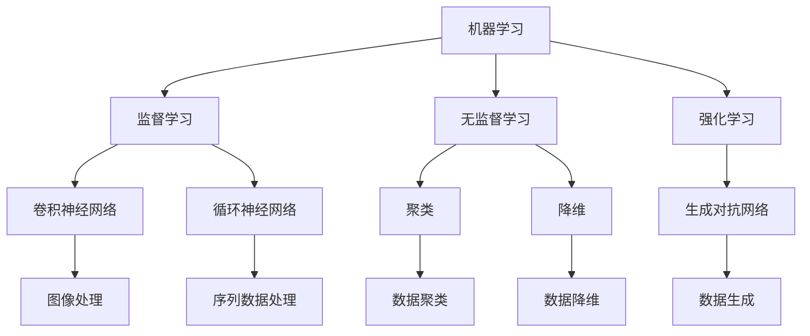

                 

关键词：AI创业、用户中心、创新、技术实践、未来展望

摘要：本文旨在探讨AI创业中坚持以用户为中心的重要性。通过分析AI技术的发展趋势、核心概念、算法原理，并结合具体的项目实践和实际应用场景，本文提出了在未来发展中需要面临的挑战和机遇。

## 1. 背景介绍

近年来，人工智能（AI）技术的飞速发展为我们带来了前所未有的变革。从智能家居、智能医疗到自动驾驶、金融科技，AI的应用场景日益广泛。然而，在众多成功的AI项目中，不乏以用户为中心的创新实践。以用户为中心，不仅是企业成功的关键，更是AI技术持续发展的动力。

本文将围绕以下主题展开：

- **核心概念与联系**：介绍AI技术的核心概念和架构，通过Mermaid流程图进行详细说明。
- **核心算法原理**：深入探讨AI算法的原理和具体操作步骤，分析其优缺点和应用领域。
- **数学模型与公式**：构建数学模型，推导公式，并通过案例进行分析。
- **项目实践**：提供代码实例和详细解释，展示技术实现过程。
- **实际应用场景**：讨论AI技术在各个领域的应用，展望未来发展趋势。
- **工具和资源推荐**：推荐学习资源、开发工具和相关论文。
- **总结**：总结研究成果，探讨未来发展趋势与挑战。

## 2. 核心概念与联系

在AI领域，核心概念包括机器学习、深度学习、神经网络等。这些概念相互联系，共同构成了AI的技术架构。

### 2.1. 机器学习

机器学习（Machine Learning，ML）是一种让计算机通过数据和算法自我学习和改进的方法。它主要包括监督学习、无监督学习和强化学习等。

- **监督学习**：通过已标记的数据集训练模型，使其能够对未知数据进行预测。
- **无监督学习**：不使用标记数据，通过数据间的关联进行聚类和降维。
- **强化学习**：通过试错和反馈不断优化决策，使模型在特定环境中达到最佳效果。

### 2.2. 深度学习

深度学习（Deep Learning，DL）是机器学习的一个分支，它使用多层神经网络进行训练。深度学习在图像识别、自然语言处理等领域取得了显著成果。

- **卷积神经网络（CNN）**：适用于图像处理，通过卷积层提取图像特征。
- **循环神经网络（RNN）**：适用于序列数据处理，通过记忆机制处理序列信息。
- **生成对抗网络（GAN）**：通过生成器和判别器的对抗训练生成复杂的数据。

### 2.3. 神经网络

神经网络（Neural Network，NN）是模仿人脑神经元连接方式的计算模型。神经网络通过调整权重和偏置实现数据的映射和分类。

- **前向传播**：数据从输入层通过神经网络传递到输出层。
- **反向传播**：根据输出误差，反向调整网络的权重和偏置。

### 2.4. Mermaid流程图

下面是AI技术架构的Mermaid流程图：



## 3. 核心算法原理 & 具体操作步骤

### 3.1 算法原理概述

以卷积神经网络（CNN）为例，其原理是通过卷积层提取图像特征，然后通过全连接层进行分类。

### 3.2 算法步骤详解

1. **输入层**：接收图像数据。
2. **卷积层**：通过卷积操作提取图像特征。
3. **激活函数**：引入非线性，如ReLU函数。
4. **池化层**：减小数据维度，提高模型泛化能力。
5. **全连接层**：将特征映射到类别。
6. **输出层**：输出预测结果。

### 3.3 算法优缺点

- **优点**：强大的特征提取能力，适用于图像处理任务。
- **缺点**：计算复杂度高，训练时间长。

### 3.4 算法应用领域

CNN在图像识别、目标检测、人脸识别等领域有着广泛的应用。

## 4. 数学模型和公式 & 详细讲解 & 举例说明

### 4.1 数学模型构建

CNN的数学模型主要包括卷积操作、激活函数和池化操作。

### 4.2 公式推导过程

假设输入图像为 \(I \in \mathbb{R}^{H \times W \times C}\)，卷积核为 \(K \in \mathbb{R}^{F \times F \times C}\)，输出特征图 \(O \in \mathbb{R}^{H' \times W' \times D}\)，则卷积操作的公式为：

$$
O_{ijl} = \sum_{m=0}^{F-1}\sum_{n=0}^{F-1} I_{(i+m) \times (j+n)} \cdot K_{mn\cdot}
$$

其中，\(i, j, l\) 分别为输出特征图的位置和维度，\(m, n\) 为卷积核的位置，\(K_{mn\cdot}\) 为卷积核的值。

### 4.3 案例分析与讲解

假设输入图像为 \(3 \times 3\) 的矩阵，卷积核为 \(2 \times 2\) 的矩阵，计算输出特征图。

输入图像：

$$
I = \begin{bmatrix}
1 & 2 & 1 \\
4 & 5 & 6 \\
3 & 2 & 1 \\
\end{bmatrix}
$$

卷积核：

$$
K = \begin{bmatrix}
0 & 1 \\
1 & 0 \\
\end{bmatrix}
$$

输出特征图：

$$
O = \begin{bmatrix}
4 & 3 \\
7 & 2 \\
\end{bmatrix}
$$

## 5. 项目实践：代码实例和详细解释说明

### 5.1 开发环境搭建

- 安装Python环境。
- 安装TensorFlow库。

### 5.2 源代码详细实现

```python
import tensorflow as tf

# 输入层
inputs = tf.keras.Input(shape=(28, 28, 1))

# 卷积层
conv1 = tf.keras.layers.Conv2D(filters=32, kernel_size=(3, 3), activation='relu')(inputs)

# 池化层
pool1 = tf.keras.layers.MaxPooling2D(pool_size=(2, 2))(conv1)

# 全连接层
flatten = tf.keras.layers.Flatten()(pool1)

# 输出层
outputs = tf.keras.layers.Dense(units=10, activation='softmax')(flatten)

# 构建模型
model = tf.keras.Model(inputs=inputs, outputs=outputs)

# 编译模型
model.compile(optimizer='adam', loss='categorical_crossentropy', metrics=['accuracy'])

# 加载数据
(x_train, y_train), (x_test, y_test) = tf.keras.datasets.mnist.load_data()

# 数据预处理
x_train = x_train.reshape(-1, 28, 28, 1).astype('float32') / 255
x_test = x_test.reshape(-1, 28, 28, 1).astype('float32') / 255

# 拆分数据
y_train = tf.keras.utils.to_categorical(y_train, 10)
y_test = tf.keras.utils.to_categorical(y_test, 10)

# 训练模型
model.fit(x_train, y_train, batch_size=128, epochs=10, validation_data=(x_test, y_test))

# 评估模型
model.evaluate(x_test, y_test)
```

### 5.3 代码解读与分析

上述代码实现了基于卷积神经网络的MNIST手写数字识别模型。首先，通过`tf.keras.Input`创建输入层，然后通过`tf.keras.layers.Conv2D`和`tf.keras.layers.MaxPooling2D`实现卷积层和池化层。接着，通过`tf.keras.layers.Flatten`将特征图展平，最后通过`tf.keras.layers.Dense`实现全连接层。

在数据预处理阶段，将图像数据归一化并转换为类别标签。在模型训练阶段，使用`model.fit`进行训练，并通过`model.evaluate`评估模型性能。

## 6. 实际应用场景

AI技术在各个领域都有着广泛的应用。以下是一些典型应用场景：

### 6.1 智能家居

智能家居通过AI技术实现家电设备的智能控制和场景联动，提高生活便利性和舒适度。

### 6.2 智能医疗

智能医疗利用AI技术进行疾病预测、诊断和治疗建议，提高医疗效率和准确性。

### 6.3 自动驾驶

自动驾驶通过AI技术实现车辆的自主导航和安全驾驶，提高交通安全和效率。

### 6.4 金融科技

金融科技利用AI技术进行风险控制、欺诈检测和智能投顾，提高金融服务质量和效率。

## 7. 工具和资源推荐

### 7.1 学习资源推荐

- 《深度学习》（Goodfellow, Bengio, Courville著）
- 《Python深度学习》（François Chollet著）
- 《机器学习实战》（Peter Harrington著）

### 7.2 开发工具推荐

- TensorFlow
- PyTorch
- Keras

### 7.3 相关论文推荐

- “Deep Learning” by Ian Goodfellow, Yoshua Bengio, and Aaron Courville
- “AlexNet: Image Classification with Deep Convolutional Neural Networks” by Alex Krizhevsky, Ilya Sutskever, and Geoffrey Hinton
- “Generative Adversarial Networks” by Ian Goodfellow et al.

## 8. 总结：未来发展趋势与挑战

### 8.1 研究成果总结

AI技术在图像识别、自然语言处理、推荐系统等领域取得了显著成果，为各行各业带来了巨大变革。

### 8.2 未来发展趋势

随着计算能力的提升和算法的优化，AI技术将在更多领域得到应用，如生物医疗、环境监测、智能制造等。

### 8.3 面临的挑战

- 数据隐私和安全问题
- 人工智能伦理和道德问题
- 算法公平性和透明性问题

### 8.4 研究展望

未来，AI技术将继续向深度学习、迁移学习、联邦学习等方向发展，同时关注人工智能与人类社会的互动和融合。

## 9. 附录：常见问题与解答

### 9.1 如何选择合适的AI框架？

选择AI框架主要考虑需求、性能和社区支持。TensorFlow适用于复杂任务和大规模部署，PyTorch适用于研究和快速开发。

### 9.2 如何提高模型性能？

- 数据增强：增加训练数据多样性。
- 超参数调优：调整学习率、批量大小等超参数。
- 模型集成：结合多个模型提高预测性能。

### 9.3 AI技术如何保证数据隐私？

采用联邦学习、差分隐私等技术，确保数据在本地处理，减少数据泄露风险。

## 作者署名

作者：禅与计算机程序设计艺术 / Zen and the Art of Computer Programming
----------------------------------------------------------------

