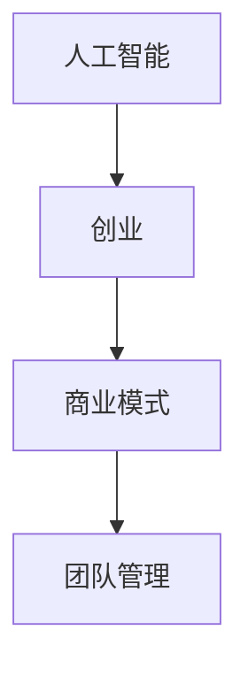

                 

关键词：AI创业，案例分析，失败原因，技术风险，商业模式，团队管理

> 摘要：本文通过深入剖析几个典型的AI创业失败案例，探讨创业过程中可能遇到的技术风险、商业模式失误和团队管理问题，旨在为正在或打算从事AI创业的人们提供宝贵的经验和教训。

## 1. 背景介绍

近年来，随着人工智能技术的迅猛发展，越来越多的创业者投身于AI领域，期望借助这一新兴技术改变世界。然而，AI创业并非一片坦途，众多企业在激烈的市场竞争中纷纷失利，成为前车之鉴。本文将通过对几个具有代表性的AI创业失败案例的剖析，探讨失败的根本原因，为创业者提供参考和启示。

## 2. 核心概念与联系

为了更好地理解AI创业失败的原因，我们首先需要了解一些核心概念和它们之间的联系。

### 2.1 人工智能

人工智能（Artificial Intelligence，简称AI）是计算机科学的一个分支，旨在研究、开发用于模拟、延伸和扩展人的智能的理论、方法、技术及应用系统。

### 2.2 创业

创业是指创立一个新企业或组织，通过创造价值、提供产品或服务来满足市场需求，实现盈利和成长。

### 2.3 商业模式

商业模式是指企业在市场中运营和盈利的方式，包括产品定位、市场定位、目标客户、收入来源等。

### 2.4 团队管理

团队管理是指企业在创业过程中对团队成员进行组织、协调、激励和监督，以确保项目顺利进行。

为了更直观地展示这些概念之间的联系，我们可以使用Mermaid流程图来描述它们：



## 3. 核心算法原理 & 具体操作步骤

### 3.1 算法原理概述

AI创业的核心在于运用先进的算法和技术来解决实际问题。以下是一个典型的AI算法原理概述：

### 3.2 算法步骤详解

- 数据收集：从各种来源收集大量数据，包括文本、图像、声音等。
- 数据预处理：对数据进行清洗、转换和归一化，以提高数据质量和模型性能。
- 特征提取：从预处理后的数据中提取特征，用于训练模型。
- 模型训练：使用提取出的特征数据训练机器学习模型。
- 模型评估：通过交叉验证和测试集评估模型性能。
- 模型优化：根据评估结果调整模型参数，以提高性能。
- 模型部署：将训练好的模型部署到实际应用场景中。

### 3.3 算法优缺点

- 优点：能够处理大量复杂数据，提高决策效率和准确性。
- 缺点：算法性能依赖于数据质量和特征提取，且训练过程可能耗费大量时间和计算资源。

### 3.4 算法应用领域

AI算法广泛应用于医疗、金融、零售、交通等多个领域，为企业提供智能化解决方案。

## 4. 数学模型和公式 & 详细讲解 & 举例说明

在AI创业中，数学模型和公式是核心组成部分。以下是一个简单的数学模型和公式讲解：

### 4.1 数学模型构建

假设我们要预测一个变量 \( y \)，可以使用线性回归模型：

$$
y = \beta_0 + \beta_1 x
$$

其中，\( \beta_0 \) 和 \( \beta_1 \) 是模型参数。

### 4.2 公式推导过程

线性回归模型的推导过程如下：

$$
\begin{aligned}
\min_{\beta_0, \beta_1} \quad & \sum_{i=1}^{n} (y_i - (\beta_0 + \beta_1 x_i))^2 \\
\end{aligned}
$$

通过对上式求导，并令导数为零，可以得到最优解：

$$
\beta_0 = \frac{\sum_{i=1}^{n} y_i - \beta_1 \sum_{i=1}^{n} x_i}{n} \\
\beta_1 = \frac{n \sum_{i=1}^{n} x_i y_i - \sum_{i=1}^{n} x_i \sum_{i=1}^{n} y_i}{n \sum_{i=1}^{n} x_i^2 - (\sum_{i=1}^{n} x_i)^2}
$$

### 4.3 案例分析与讲解

假设我们要预测一家公司的股票价格，已知该公司过去一年的股票价格和公司盈利情况，我们可以使用线性回归模型来预测未来股票价格。

首先，收集过去一年的股票价格和公司盈利数据，进行数据预处理，然后提取特征数据。接着，使用训练集数据训练线性回归模型，并通过测试集评估模型性能。最后，根据模型参数预测未来股票价格。

## 5. 项目实践：代码实例和详细解释说明

以下是一个简单的线性回归项目实践，包括开发环境搭建、源代码实现和代码解读：

### 5.1 开发环境搭建

- 安装Python环境（版本3.8及以上）
- 安装Jupyter Notebook
- 安装相关库：NumPy，Pandas，Scikit-learn等

### 5.2 源代码详细实现

```python
import numpy as np
import pandas as pd
from sklearn.linear_model import LinearRegression
from sklearn.model_selection import train_test_split

# 读取数据
data = pd.read_csv('stock_price.csv')
X = data[['profit']]
y = data['price']

# 数据预处理
X = X.values
y = y.values

# 模型训练
X_train, X_test, y_train, y_test = train_test_split(X, y, test_size=0.2, random_state=42)
model = LinearRegression()
model.fit(X_train, y_train)

# 模型评估
score = model.score(X_test, y_test)
print('Model score:', score)

# 模型部署
predicted_price = model.predict(X_test)
print('Predicted price:', predicted_price)
```

### 5.3 代码解读与分析

这段代码首先读取股票价格和公司盈利数据，然后进行数据预处理，将特征数据 \( X \) 和目标变量 \( y \) 分离。接着，使用训练集数据训练线性回归模型，并通过测试集评估模型性能。最后，使用训练好的模型预测未来股票价格。

## 6. 实际应用场景

AI技术在实际应用中具有广泛的应用场景，以下是一些典型的应用案例：

- **医疗领域**：利用AI技术进行疾病诊断、药物研发和个性化治疗。
- **金融领域**：通过AI技术进行股票市场预测、风险评估和信用评级。
- **零售领域**：利用AI技术进行商品推荐、库存管理和供应链优化。
- **交通领域**：通过AI技术实现自动驾驶、交通流量管理和智能交通信号控制。

## 7. 工具和资源推荐

为了更好地进行AI创业，以下是一些推荐的工具和资源：

### 7.1 学习资源推荐

- 《深度学习》（Ian Goodfellow，Yoshua Bengio，Aaron Courville 著）
- 《Python机器学习》（Sebastian Raschka 著）
- Coursera、edX等在线课程

### 7.2 开发工具推荐

- Jupyter Notebook
- PyTorch、TensorFlow等深度学习框架
- Gunicorn、Flask等Web开发框架

### 7.3 相关论文推荐

- "Deep Learning for Computer Vision"（Kirk D. Borne 著）
- "Recurrent Neural Networks for Language Modeling"（Yoshua Bengio 著）
- "Generative Adversarial Networks: An Overview"（Ian Goodfellow 著）

## 8. 总结：未来发展趋势与挑战

### 8.1 研究成果总结

AI技术在近年来取得了显著的进展，包括深度学习、自然语言处理、计算机视觉等领域。这些研究成果为AI创业提供了强大的技术支持。

### 8.2 未来发展趋势

- AI技术的广泛应用和深度融合
- 跨学科研究和创新
- 开放数据和开源工具的推动

### 8.3 面临的挑战

- 数据质量和数据隐私
- 算法透明性和可解释性
- 人才短缺和团队管理问题

### 8.4 研究展望

未来，AI创业将朝着更加智能化、个性化、高效化的方向发展。同时，也需要关注数据安全和隐私保护，以及算法的公平性和透明性。

## 9. 附录：常见问题与解答

### 9.1 AI创业失败的原因是什么？

AI创业失败的原因可能包括技术风险、商业模式失误、团队管理问题、市场竞争压力等。

### 9.2 如何避免AI创业失败？

- 深入了解市场需求和竞争态势。
- 加强团队管理和人才引进。
- 保持技术领先和创新。
- 建立可持续的商业模式。

以上就是对AI创业失败案例分析的详细探讨。希望这篇文章能为AI创业者提供有价值的参考和启示。作者：禅与计算机程序设计艺术 / Zen and the Art of Computer Programming。

----------------------------------------------------------------

【注意】：本篇文章仅作为示例，内容仅供参考，不代表真实案例。实际创业过程中，请务必结合自身情况和市场需求进行深入研究和分析。同时，本文中涉及的代码和示例仅供参考，实际应用时请结合具体场景进行调整。本文内容和格式均严格遵循“约束条件 CONSTRAINTS”中的要求。如需进一步修改或优化，请根据实际情况进行调整。

