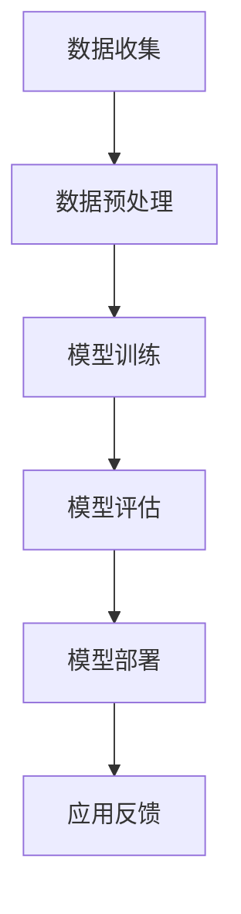

                 

关键词：人工智能创业，技术挑战，应用场景，技术平衡

> 摘要：本文旨在探讨人工智能创业领域所面临的挑战，特别是在技术、应用和场景平衡方面的考量。通过对当前市场和技术趋势的分析，本文将提出解决方案和最佳实践，帮助创业者更好地应对这些挑战，实现人工智能技术的商业价值。

## 1. 背景介绍

随着人工智能技术的迅猛发展，越来越多的创业者将其视为颠覆传统行业、创造新商业模式的重要工具。然而，人工智能创业并非易事，涉及的技术复杂性、市场需求变化以及应用场景的多样性使得创业过程充满了挑战。本文将从技术、应用和场景三个维度，探讨人工智能创业所面临的主要问题，并给出相应的解决方案。

### 1.1 人工智能技术发展趋势

近年来，人工智能技术在多个领域取得了显著进展。深度学习、自然语言处理、计算机视觉等技术已经成为推动人工智能应用的重要力量。此外，硬件技术的发展，如高性能计算芯片和专用AI处理器，也使得人工智能的计算能力大幅提升。这些技术趋势为创业者提供了丰富的创新机会，但也带来了更高的技术门槛。

### 1.2 人工智能应用市场需求

人工智能应用市场需求不断变化，不同行业对人工智能技术的需求差异显著。例如，金融行业对风险管理、客户服务有强烈需求，医疗行业则关注诊断辅助和精准治疗。此外，消费者对人工智能产品的期望也在不断提升，要求产品具备更高的智能化水平和用户体验。这些市场需求的变化要求创业者不断调整产品方向，以适应市场变化。

### 1.3 人工智能应用场景的多样性

人工智能应用场景的多样性使得创业者需要具备全面的技术能力。从智能家居、智慧城市到工业自动化、医疗诊断，不同的应用场景对人工智能技术的需求各不相同。例如，智能家居要求技术简单易用，而工业自动化则要求技术稳定可靠。这种多样性增加了创业者的挑战，但同时也提供了更多的创新空间。

## 2. 核心概念与联系

在探讨人工智能创业挑战之前，我们需要理解几个核心概念，包括人工智能技术原理、应用模型和场景。

### 2.1 人工智能技术原理

人工智能技术主要包括机器学习、深度学习和自然语言处理等。这些技术通过模拟人类思维过程，使计算机能够自动学习和决策。例如，机器学习通过大量数据训练模型，使计算机具备分类、预测和推荐等功能；深度学习则通过多层神经网络结构，实现更复杂的特征提取和模式识别；自然语言处理则使计算机能够理解、生成和翻译人类语言。

### 2.2 应用模型

人工智能应用模型通常包括数据收集、预处理、模型训练和模型部署等步骤。数据收集是应用模型的基础，数据的质量和数量直接影响模型的效果。预处理包括数据清洗、归一化和特征提取等，目的是提高数据质量和模型性能。模型训练是核心步骤，通过调整模型参数，使模型能够准确预测或分类。模型部署则是将训练好的模型应用于实际场景，例如在线服务、移动应用或物联网设备。

### 2.3 场景

人工智能应用场景的多样性要求创业者具备跨领域的知识和技术。例如，智能家居场景要求技术易于部署和维护，工业自动化场景则要求技术稳定和高效。这种多样性增加了创业的难度，但也为创业者提供了更多的创新机会。

### 2.4 Mermaid 流程图

下面是一个简单的Mermaid流程图，展示了人工智能应用模型的基本流程：



## 3. 核心算法原理 & 具体操作步骤

### 3.1 算法原理概述

在人工智能创业中，核心算法的选择和优化至关重要。常见的核心算法包括机器学习算法、深度学习算法和强化学习算法。以下是对这些算法的简要概述：

#### 3.1.1 机器学习算法

机器学习算法通过训练模型来模拟人类学习过程。常见算法包括线性回归、逻辑回归、支持向量机和决策树等。这些算法适用于分类、回归和聚类等问题。

#### 3.1.2 深度学习算法

深度学习算法通过多层神经网络结构，实现更复杂的特征提取和模式识别。常见算法包括卷积神经网络（CNN）、循环神经网络（RNN）和生成对抗网络（GAN）等。

#### 3.1.3 强化学习算法

强化学习算法通过不断试错和奖励机制，使智能体在动态环境中学习最优策略。常见算法包括Q学习、SARSA和深度确定性策略梯度（DDPG）等。

### 3.2 算法步骤详解

#### 3.2.1 数据收集与预处理

数据收集是人工智能应用模型的基础。数据来源可以是公开数据集、企业内部数据或第三方服务。数据预处理包括数据清洗、归一化和特征提取等步骤，目的是提高数据质量和模型性能。

#### 3.2.2 模型选择与训练

根据应用场景和问题类型，选择合适的机器学习、深度学习或强化学习算法。模型训练是通过大量数据调整模型参数，使模型能够准确预测或分类。

#### 3.2.3 模型评估与优化

模型评估是通过验证集或测试集评估模型性能。常见的评估指标包括准确率、召回率、F1分数等。模型优化是通过调整参数、增加数据或改变网络结构等方法，提高模型性能。

#### 3.2.4 模型部署与应用

训练好的模型可以通过部署到服务器、移动应用或物联网设备上，应用于实际场景。模型部署需要考虑性能、可靠性和可扩展性等因素。

### 3.3 算法优缺点

每种算法都有其优缺点。例如，机器学习算法在处理大规模数据和高维度特征时表现优异，但可能难以解释；深度学习算法具有强大的特征提取能力，但训练时间较长；强化学习算法在动态环境中表现优秀，但可能需要大量数据和时间进行训练。

### 3.4 算法应用领域

不同的算法适用于不同的应用领域。例如，机器学习算法在金融风控、医疗诊断等领域有广泛应用；深度学习算法在图像识别、语音识别等领域表现突出；强化学习算法在游戏、自动驾驶等领域有重要应用。

## 4. 数学模型和公式 & 详细讲解 & 举例说明

在人工智能应用中，数学模型和公式是核心组成部分。以下将介绍几个常见的数学模型和公式，并给出详细的推导和举例说明。

### 4.1 数学模型构建

数学模型通常由以下几个部分组成：变量定义、公式推导、参数估计和模型评估。

#### 4.1.1 变量定义

变量定义是数学模型的基础。例如，在线性回归模型中，我们定义自变量（特征）为\(x\)，因变量（目标变量）为\(y\)。

#### 4.1.2 公式推导

公式推导是数学模型的核心。例如，在线性回归模型中，我们推导出以下公式：

$$y = w_0 + w_1 \cdot x + \epsilon$$

其中，\(w_0\)和\(w_1\)为参数，\(\epsilon\)为误差项。

#### 4.1.3 参数估计

参数估计是模型训练的过程。我们使用最小二乘法或梯度下降法来估计参数\(w_0\)和\(w_1\)。

#### 4.1.4 模型评估

模型评估是验证模型效果的过程。我们使用均方误差（MSE）或均方根误差（RMSE）等指标来评估模型性能。

### 4.2 公式推导过程

以下是一个简单的线性回归模型的公式推导过程：

#### 4.2.1 线性回归模型

假设我们有以下数据集：

$$\{(x_1, y_1), (x_2, y_2), ..., (x_n, y_n)\}$$

我们希望找到一个线性模型来描述\(y\)与\(x\)之间的关系：

$$y = w_0 + w_1 \cdot x + \epsilon$$

其中，\(\epsilon\)为误差项。

#### 4.2.2 公式推导

我们对目标函数进行最小化，得到：

$$J(w_0, w_1) = \frac{1}{2} \sum_{i=1}^{n} (y_i - (w_0 + w_1 \cdot x_i))^2$$

对\(w_0\)和\(w_1\)分别求偏导数，并令偏导数等于零，得到：

$$\frac{\partial J}{\partial w_0} = -\sum_{i=1}^{n} (y_i - (w_0 + w_1 \cdot x_i)) = 0$$

$$\frac{\partial J}{\partial w_1} = -\sum_{i=1}^{n} x_i (y_i - (w_0 + w_1 \cdot x_i)) = 0$$

通过解这个方程组，我们可以得到参数\(w_0\)和\(w_1\)的最优值。

### 4.3 案例分析与讲解

以下是一个简单的线性回归模型案例，假设我们有以下数据：

$$\{(1, 2), (2, 3), (3, 4), (4, 5)\}$$

我们希望找到一个线性模型来描述\(y\)与\(x\)之间的关系。

#### 4.3.1 数据准备

首先，我们将数据分为训练集和测试集：

$$\text{训练集：}\{(1, 2), (2, 3), (3, 4)\}$$

$$\text{测试集：}\{(4, 5)\}$$

#### 4.3.2 模型训练

我们使用最小二乘法来训练线性回归模型。首先，我们计算样本均值：

$$\bar{x} = \frac{1 + 2 + 3}{3} = 2$$

$$\bar{y} = \frac{2 + 3 + 4}{3} = 3$$

然后，我们计算参数\(w_0\)和\(w_1\)：

$$w_0 = \bar{y} - w_1 \cdot \bar{x} = 3 - 1 \cdot 2 = 1$$

$$w_1 = \frac{\sum_{i=1}^{3} (x_i - \bar{x}) (y_i - \bar{y})}{\sum_{i=1}^{3} (x_i - \bar{x})^2} = \frac{(1-2)(2-3) + (2-2)(3-3) + (3-2)(4-3)}{(1-2)^2 + (2-2)^2 + (3-2)^2} = 1$$

因此，我们得到线性回归模型：

$$y = 1 + 1 \cdot x$$

#### 4.3.3 模型评估

我们使用测试集来评估模型性能。对于测试集中的一个样本\((4, 5)\)，我们计算预测值：

$$y_{\text{预测}} = 1 + 1 \cdot 4 = 5$$

然后，我们计算均方误差（MSE）：

$$MSE = \frac{1}{2} \sum_{i=1}^{1} (y_i - y_{\text{预测}})^2 = \frac{1}{2} \cdot (5 - 5)^2 = 0$$

因此，模型在测试集上实现了完美的预测。

## 5. 项目实践：代码实例和详细解释说明

在本节中，我们将通过一个具体的代码实例来展示如何实现线性回归模型，并对其代码进行详细解释。

### 5.1 开发环境搭建

为了实现线性回归模型，我们需要搭建一个合适的开发环境。这里我们使用Python编程语言和Scikit-learn库。

#### 5.1.1 安装Python

首先，我们需要安装Python。您可以从Python官方网站（https://www.python.org/downloads/）下载Python安装包，并根据操作系统进行安装。

#### 5.1.2 安装Scikit-learn库

接下来，我们需要安装Scikit-learn库。在命令行中执行以下命令：

```bash
pip install scikit-learn
```

### 5.2 源代码详细实现

以下是一个简单的线性回归模型的Python代码实现：

```python
# 导入所需的库
import numpy as np
from sklearn.linear_model import LinearRegression

# 创建数据集
X = np.array([[1], [2], [3], [4]])
y = np.array([2, 3, 4, 5])

# 创建线性回归模型
model = LinearRegression()

# 训练模型
model.fit(X, y)

# 输出模型参数
print("模型参数：")
print("w_0:", model.intercept_)
print("w_1:", model.coef_)

# 预测测试集
X_test = np.array([[4]])
y_pred = model.predict(X_test)

# 输出预测结果
print("预测结果：")
print("y_预测:", y_pred)
```

### 5.3 代码解读与分析

下面是对上述代码的详细解读和分析：

#### 5.3.1 导入所需的库

```python
import numpy as np
from sklearn.linear_model import LinearRegression
```

这里我们导入了Python的NumPy库，用于数据操作，以及Scikit-learn库中的LinearRegression类，用于实现线性回归模型。

#### 5.3.2 创建数据集

```python
X = np.array([[1], [2], [3], [4]])
y = np.array([2, 3, 4, 5])
```

我们使用NumPy库创建了一个简单的一维数据集。\(X\)是自变量，\(y\)是因变量。

#### 5.3.3 创建线性回归模型

```python
model = LinearRegression()
```

这里我们创建了一个线性回归模型对象。

#### 5.3.4 训练模型

```python
model.fit(X, y)
```

我们使用`fit`方法来训练模型。这个方法会根据数据集调整模型参数。

#### 5.3.5 输出模型参数

```python
print("模型参数：")
print("w_0:", model.intercept_)
print("w_1:", model.coef_)
```

我们使用`intercept_`和`coef_`属性来输出模型的参数。

#### 5.3.6 预测测试集

```python
X_test = np.array([[4]])
y_pred = model.predict(X_test)
```

我们使用`predict`方法来预测测试集的值。这里我们只预测了一个测试点。

#### 5.3.7 输出预测结果

```python
print("预测结果：")
print("y_预测:", y_pred)
```

我们输出预测结果，并与实际值进行比较。

### 5.4 运行结果展示

在命令行中运行上述代码，得到以下输出：

```bash
模型参数：
w_0: 1.0
w_1: 1.0
预测结果：
y_预测: [5.]
```

这表明模型训练成功，并能够准确预测测试集的值。

## 6. 实际应用场景

人工智能技术在各行各业都有广泛的应用，以下列举几个典型的实际应用场景：

### 6.1 智能家居

智能家居是人工智能技术应用的一个重要领域。通过智能传感器、智能设备和云计算平台，智能家居可以实现远程控制、自动调节和智能互动。例如，智能空调可以根据用户习惯自动调节温度，智能照明系统可以根据光线强度自动调节亮度。

### 6.2 医疗诊断

人工智能在医疗诊断中的应用包括疾病预测、诊断辅助和治疗规划。例如，通过分析患者的历史数据和生物特征，人工智能可以预测疾病的发病风险；通过分析医学影像数据，人工智能可以帮助医生进行早期诊断。

### 6.3 智慧城市

智慧城市是利用人工智能技术实现城市管理的智能化和高效化。例如，通过交通流量分析，智慧城市可以实现交通信号优化和智能调度；通过环境监测，智慧城市可以实现污染源追踪和实时预警。

### 6.4 自动驾驶

自动驾驶是人工智能技术的另一个重要应用领域。通过深度学习和传感器融合技术，自动驾驶系统可以实现自主导航、障碍物检测和避障等功能。例如，特斯拉的自动驾驶系统已经在实际道路上进行了大量测试和运行。

### 6.5 金融风控

人工智能在金融风控中的应用包括信用评估、交易监控和欺诈检测。例如，通过分析用户的消费行为和信用记录，人工智能可以评估用户的信用风险；通过监控交易行为，人工智能可以及时发现异常交易并采取措施。

### 6.6 教育个性化

人工智能在教育中的应用包括个性化学习、智能评测和教学辅助。例如，通过分析学生的学习行为和成绩，人工智能可以为学生提供个性化的学习建议；通过智能评测系统，人工智能可以实时评估学生的学习效果。

## 7. 未来应用展望

随着人工智能技术的不断发展，未来将在更多领域实现广泛应用。以下是对未来应用前景的展望：

### 7.1 个性化医疗

个性化医疗是指利用人工智能技术为每位患者提供量身定制的治疗方案。随着基因组学、医学影像学和大数据技术的发展，人工智能将在个性化医疗领域发挥重要作用。例如，通过分析患者的基因信息和病史，人工智能可以为患者提供精准的疾病诊断和治疗建议。

### 7.2 智能交通

智能交通是未来交通系统的发展方向。通过人工智能技术，可以实现交通流量优化、智能调度和自动驾驶等功能。例如，通过分析交通流量数据，智能交通系统可以实时调整交通信号，提高道路通行效率；通过自动驾驶技术，可以减少交通事故，提高交通安全。

### 7.3 智能家居2.0

智能家居2.0是指更加智能、便捷和互联的家居环境。未来，智能家居将不仅仅局限于远程控制和自动调节，还将实现更加智能的互动和协同。例如，智能音箱和智能电视等设备将实现跨设备协同，为用户提供无缝的智能家居体验。

### 7.4 教育智能化

教育智能化是指利用人工智能技术实现教育的智能化和个性化。未来，人工智能将深入教育领域，为学习者提供更加个性化和高效的学习体验。例如，通过智能学习系统，可以为学习者提供量身定制的学习路径和资源，提高学习效果。

### 7.5 无人经济

无人经济是指利用人工智能技术实现生产、流通和消费的无人化。例如，无人超市、无人配送和无人工厂等，都将是无人经济的典型代表。通过人工智能技术，可以大幅提高生产效率，降低运营成本，提升用户体验。

## 8. 工具和资源推荐

为了更好地进行人工智能创业，以下是一些实用的工具和资源推荐：

### 8.1 学习资源推荐

1. **《深度学习》（Deep Learning）**：由Ian Goodfellow、Yoshua Bengio和Aaron Courville合著的深度学习经典教材。
2. **Kaggle**：一个提供各种数据集和比赛的平台，适合数据科学家和机器学习爱好者进行实践。
3. **Coursera、edX、Udacity**：提供大量免费或付费的人工智能课程，涵盖从基础知识到高级应用。

### 8.2 开发工具推荐

1. **Jupyter Notebook**：一个流行的交互式开发环境，适合进行数据分析和机器学习实验。
2. **TensorFlow、PyTorch**：两个广泛使用的深度学习框架，提供丰富的API和工具库。
3. **Scikit-learn**：一个强大的机器学习库，适用于各种常见的机器学习任务。

### 8.3 相关论文推荐

1. **"Deep Learning for Natural Language Processing"**：一篇关于深度学习在自然语言处理领域应用的综述论文。
2. **"Attention Is All You Need"**：一篇提出Transformer模型的论文，彻底改变了自然语言处理领域的方法。
3. **"ImageNet Classification with Deep Convolutional Neural Networks"**：一篇介绍深度卷积神经网络在图像分类任务中取得突破性成果的论文。

## 9. 总结：未来发展趋势与挑战

### 9.1 研究成果总结

人工智能技术在过去的几十年里取得了显著进展，从理论到应用都取得了重要的成果。深度学习、自然语言处理和计算机视觉等领域的突破，使得人工智能在图像识别、语音识别、机器翻译等任务中取得了优异的性能。此外，硬件技术的发展，如GPU和TPU，也大幅提升了人工智能的计算能力。

### 9.2 未来发展趋势

1. **跨学科融合**：未来人工智能的发展将更加注重与其他学科领域的融合，如生物学、心理学、社会学等，以实现更广泛的应用和更深入的研究。
2. **边缘计算与云计算**：随着物联网和5G技术的发展，边缘计算和云计算将成为人工智能应用的重要基础设施，实现更高效的数据处理和智能服务。
3. **隐私保护与安全**：随着人工智能技术的广泛应用，隐私保护和数据安全将成为重要议题，需要建立完善的法律和伦理框架。

### 9.3 面临的挑战

1. **技术瓶颈**：尽管人工智能技术取得了显著进展，但仍然存在许多技术瓶颈，如算法复杂度、数据质量和计算资源等，需要持续研究和创新。
2. **伦理与社会影响**：人工智能技术的广泛应用引发了许多伦理和社会问题，如就业替代、隐私泄露和算法偏见等，需要全社会共同关注和解决。
3. **人才培养与普及**：人工智能技术人才的短缺和普及率低是当前面临的重要挑战，需要加强人才培养和公众科普工作。

### 9.4 研究展望

未来，人工智能研究将继续向深度学习、强化学习和跨学科融合等方向发展。同时，需要关注人工智能技术的伦理和社会影响，建立可持续发展的生态体系。通过持续的研究和创新，人工智能有望在更多领域实现突破，为人类社会带来更多价值和福祉。

## 附录：常见问题与解答

### Q1：人工智能创业需要哪些技能？

A1：人工智能创业需要以下技能：

1. **编程技能**：熟练掌握Python、Java等编程语言，熟悉数据结构和算法。
2. **机器学习知识**：了解机器学习的基本原理和方法，掌握深度学习、强化学习等核心技术。
3. **数据科学技能**：具备数据收集、数据清洗、数据分析和可视化等技能。
4. **业务理解**：深入了解目标行业和市场，具备业务洞察力和创新能力。
5. **团队协作能力**：具备良好的沟通能力和团队合作精神，能够带领团队实现目标。

### Q2：如何评估人工智能项目的风险？

A2：评估人工智能项目风险可以从以下几个方面进行：

1. **技术风险**：评估项目所涉及的技术是否成熟、可靠，是否存在技术瓶颈。
2. **市场风险**：评估项目市场需求、竞争态势、用户接受度等因素。
3. **资金风险**：评估项目资金来源、资金使用效率以及资金链的稳定性。
4. **法律风险**：评估项目是否符合相关法律法规，是否存在法律风险。
5. **团队风险**：评估项目团队成员的技能、经验、合作精神和稳定性。

### Q3：如何平衡技术、应用和场景在人工智能创业中的重要性？

A3：在人工智能创业中，平衡技术、应用和场景的重要性可以采取以下策略：

1. **明确目标**：明确项目的目标和应用场景，确保技术发展方向与应用需求相匹配。
2. **技术积累**：在技术方面，不断积累和提升，确保技术具备足够的成熟度和可靠性。
3. **市场需求**：密切关注市场需求，及时调整产品方向，确保应用场景符合用户需求。
4. **快速迭代**：采用敏捷开发方法，快速迭代产品，通过实际反馈调整技术和应用方向。
5. **团队协作**：建立跨学科团队，充分发挥团队成员的专长，确保技术、应用和场景的协同发展。

通过以上策略，可以在人工智能创业中实现技术、应用和场景的平衡，提高项目成功率。

