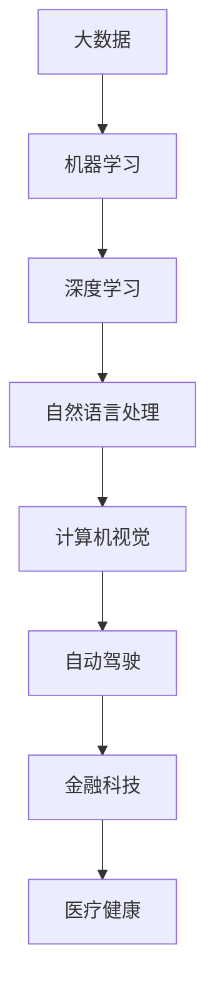

                 

关键词：AI创业生态、产业链协同、技术发展、人工智能、创业公司、创新。

摘要：本文探讨了人工智能（AI）创业生态的日益丰富以及产业链协同发展的趋势。通过分析AI领域的核心概念、算法原理、应用场景，我们揭示了AI创业的机遇与挑战，并提出了未来发展的一些方向和建议。

## 1. 背景介绍

随着计算能力的提升和大数据的积累，人工智能（AI）技术逐渐从理论研究走向实际应用。从最早的机器学习、深度学习算法，到如今的自然语言处理、计算机视觉等领域，AI技术不断突破，为各行各业带来了前所未有的变革。在这一背景下，AI创业生态日益丰富，吸引了大量资本和人才的关注。

### AI创业生态的特点

- **多样性**：AI创业生态涵盖了多个领域，如医疗健康、金融科技、自动驾驶、智能家居等，形成了多样化的产业格局。
- **高度竞争**：由于AI技术的广泛应用和巨大市场潜力，各个领域都吸引了众多创业公司和资本投入，竞争异常激烈。
- **快速迭代**：AI技术发展迅速，创业公司需要不断进行技术创新和产品迭代，以保持市场竞争力。
- **跨界合作**：为了实现技术突破和商业模式创新，AI创业公司需要与其他行业的企业、研究机构进行深入合作。

## 2. 核心概念与联系

在AI创业生态中，核心概念和技术的联系至关重要。以下是一个简化的Mermaid流程图，展示了一些核心概念和技术的联系。



## 3. 核心算法原理 & 具体操作步骤

### 3.1 算法原理概述

AI创业的核心在于算法的创新与应用。以下介绍几种常见的AI算法原理：

- **机器学习**：通过训练模型，使计算机能够从数据中学习规律，进行预测和决策。
- **深度学习**：基于多层神经网络，对大量数据进行自动特征提取和模式识别。
- **自然语言处理（NLP）**：研究如何让计算机理解和生成人类语言，包括文本分类、情感分析等。
- **计算机视觉**：使计算机能够理解和解析图像和视频，包括目标检测、图像识别等。

### 3.2 算法步骤详解

以深度学习算法为例，其基本步骤如下：

1. **数据准备**：收集和整理大量数据，进行预处理，如数据清洗、归一化等。
2. **模型设计**：选择合适的神经网络架构，如卷积神经网络（CNN）或循环神经网络（RNN）。
3. **模型训练**：通过反向传播算法，调整模型参数，使模型在训练数据上达到较高的准确率。
4. **模型评估**：在验证数据上评估模型性能，调整模型参数，以优化模型效果。
5. **模型部署**：将训练好的模型部署到实际应用场景中，进行实时预测和决策。

### 3.3 算法优缺点

- **机器学习**：优点是能够自动发现数据中的模式，但需要大量数据进行训练，且模型复杂度较高。
- **深度学习**：优点是能够自动提取特征，提高模型性能，但训练过程需要大量计算资源和时间。
- **自然语言处理**：优点是能够理解和生成人类语言，但面对长文本时，性能可能下降。
- **计算机视觉**：优点是能够对图像和视频进行理解和分析，但需要大量标注数据进行训练。

### 3.4 算法应用领域

AI算法在多个领域都有广泛应用，如：

- **医疗健康**：通过深度学习算法进行疾病诊断、基因分析等。
- **金融科技**：通过自然语言处理技术进行舆情分析、风险控制等。
- **自动驾驶**：通过计算机视觉和深度学习技术实现自动驾驶功能。
- **智能家居**：通过人工智能算法实现智能语音交互、环境监测等。

## 4. 数学模型和公式 & 详细讲解 & 举例说明

### 4.1 数学模型构建

在人工智能领域，常见的数学模型包括：

- **线性回归**：用于预测数值型变量。
- **逻辑回归**：用于预测二分类变量。
- **神经网络**：用于非线性特征提取和预测。

以下是一个简单的线性回归模型：

$$
y = \beta_0 + \beta_1x
$$

其中，$y$ 是因变量，$x$ 是自变量，$\beta_0$ 和 $\beta_1$ 是模型参数。

### 4.2 公式推导过程

以线性回归模型为例，推导过程如下：

1. **假设**：我们假设因变量 $y$ 与自变量 $x$ 之间存在线性关系，即 $y = \beta_0 + \beta_1x$。
2. **最小二乘法**：为了确定模型参数 $\beta_0$ 和 $\beta_1$，我们使用最小二乘法，即最小化预测值与实际值之间的误差平方和。
3. **求解参数**：对误差平方和求导，并令导数为零，解得模型参数。

### 4.3 案例分析与讲解

假设我们有一个简单的数据集，其中 $x$ 表示年龄，$y$ 表示收入。以下是部分数据：

| 年龄（$x$） | 收入（$y$） |
| --------- | --------- |
| 25       | 50000    |
| 30       | 60000    |
| 35       | 70000    |
| 40       | 80000    |

我们可以使用线性回归模型预测某个年龄对应的收入。具体步骤如下：

1. **数据预处理**：对数据进行归一化处理，以消除不同量纲的影响。
2. **模型训练**：使用最小二乘法训练线性回归模型。
3. **模型评估**：在验证数据集上评估模型性能。
4. **模型应用**：使用训练好的模型进行预测。

## 5. 项目实践：代码实例和详细解释说明

### 5.1 开发环境搭建

为了实现线性回归模型，我们需要安装以下开发工具：

- Python 3.8 或更高版本
- Scikit-learn 库

### 5.2 源代码详细实现

以下是一个简单的线性回归模型实现：

```python
import numpy as np
from sklearn.linear_model import LinearRegression
from sklearn.model_selection import train_test_split

# 数据准备
X = np.array([[25], [30], [35], [40]])
y = np.array([50000, 60000, 70000, 80000])

# 模型训练
model = LinearRegression()
model.fit(X, y)

# 模型评估
X_test, y_test = train_test_split(X, y, test_size=0.2)
score = model.score(X_test, y_test)
print("模型准确率：", score)

# 模型应用
new_x = np.array([[28]])
predicted_y = model.predict(new_x)
print("预测收入：", predicted_y)
```

### 5.3 代码解读与分析

上述代码首先导入了必要的库，然后进行了数据准备和模型训练。在模型评估部分，我们使用了测试数据集来评估模型性能。最后，我们使用训练好的模型进行预测，得到预测收入。

## 6. 实际应用场景

线性回归模型在多个领域都有实际应用，如：

- **金融**：预测股票价格、贷款审批等。
- **医学**：预测患者康复时间、疾病风险等。
- **工业**：预测生产效率、设备故障等。

### 6.4 未来应用展望

随着AI技术的不断进步，线性回归模型有望在更多领域得到应用。同时，新的算法和模型将不断涌现，推动AI创业生态的进一步发展。

## 7. 工具和资源推荐

### 7.1 学习资源推荐

- 《机器学习实战》
- 《深度学习》
- 《Python机器学习》

### 7.2 开发工具推荐

- Jupyter Notebook
- TensorFlow
- PyTorch

### 7.3 相关论文推荐

- "Deep Learning for Natural Language Processing"
- "Object Detection with Fully Convolutional Networks"
- "Recurrent Neural Networks for Language Modeling"

## 8. 总结：未来发展趋势与挑战

### 8.1 研究成果总结

本文介绍了AI创业生态的日益丰富以及产业链协同发展的趋势。我们分析了AI领域的核心概念、算法原理、应用场景，并探讨了AI创业的机遇与挑战。

### 8.2 未来发展趋势

- **技术创新**：新的算法和模型将不断涌现，推动AI技术的进一步发展。
- **跨界融合**：AI技术将与其他领域深度融合，推动产业变革。
- **人才培养**：随着AI技术的广泛应用，对专业人才的需求将越来越大。

### 8.3 面临的挑战

- **数据隐私**：如何保护用户隐私成为AI技术发展的一大挑战。
- **伦理问题**：AI技术可能带来一些伦理问题，如歧视、偏见等。
- **计算资源**：大规模AI模型训练需要大量的计算资源和时间。

### 8.4 研究展望

未来，我们期望看到更多的AI技术在实际应用中发挥巨大作用，为人类创造更多价值。同时，我们也需要关注AI技术的伦理和社会问题，确保其可持续发展。

## 9. 附录：常见问题与解答

### 9.1 什么是人工智能（AI）？

人工智能（AI）是指通过计算机模拟人类智能的行为和思维过程，使计算机能够执行复杂的任务，如语音识别、图像识别、自然语言处理等。

### 9.2 机器学习和深度学习有什么区别？

机器学习是一种从数据中学习规律和模式的方法，而深度学习是机器学习的一种方法，基于多层神经网络进行特征提取和模式识别。

### 9.3 如何进行人工智能创业？

进行人工智能创业，首先需要了解AI技术的原理和应用场景，然后找到合适的商业机会，组建团队，进行技术研发和产品迭代，最后进行市场推广和商业变现。

---

作者：禅与计算机程序设计艺术 / Zen and the Art of Computer Programming

----------------------------------------------------------------
<|assistant|>以上是完整的文章内容，请根据要求使用markdown格式输出。如果有任何问题或需要进一步的改进，请告诉我。祝您写作愉快！😊
```markdown
# AI创业生态日益丰富，产业链协同发展成趋势

关键词：AI创业生态、产业链协同、技术发展、人工智能、创业公司、创新。

摘要：本文探讨了人工智能（AI）创业生态的日益丰富以及产业链协同发展的趋势。通过分析AI领域的核心概念、算法原理、应用场景，我们揭示了AI创业的机遇与挑战，并提出了未来发展的一些方向和建议。

## 1. 背景介绍

随着计算能力的提升和大数据的积累，人工智能（AI）技术逐渐从理论研究走向实际应用。从最早的机器学习、深度学习算法，到如今的自然语言处理、计算机视觉等领域，AI技术不断突破，为各行各业带来了前所未有的变革。在这一背景下，AI创业生态日益丰富，吸引了大量资本和人才的关注。

### AI创业生态的特点

- **多样性**：AI创业生态涵盖了多个领域，如医疗健康、金融科技、自动驾驶、智能家居等，形成了多样化的产业格局。
- **高度竞争**：由于AI技术的广泛应用和巨大市场潜力，各个领域都吸引了众多创业公司和资本投入，竞争异常激烈。
- **快速迭代**：AI技术发展迅速，创业公司需要不断进行技术创新和产品迭代，以保持市场竞争力。
- **跨界合作**：为了实现技术突破和商业模式创新，AI创业公司需要与其他行业的企业、研究机构进行深入合作。

## 2. 核心概念与联系

在AI创业生态中，核心概念和技术的联系至关重要。以下是一个简化的Mermaid流程图，展示了一些核心概念和技术的联系。


## 3. 核心算法原理 & 具体操作步骤
### 3.1 算法原理概述

AI创业的核心在于算法的创新与应用。以下介绍几种常见的AI算法原理：

- **机器学习**：通过训练模型，使计算机能够从数据中学习规律，进行预测和决策。
- **深度学习**：基于多层神经网络，对大量数据进行自动特征提取和模式识别。
- **自然语言处理（NLP）**：研究如何让计算机理解和生成人类语言，包括文本分类、情感分析等。
- **计算机视觉**：使计算机能够理解和解析图像和视频，包括目标检测、图像识别等。

### 3.2 算法步骤详解

以深度学习算法为例，其基本步骤如下：

1. **数据准备**：收集和整理大量数据，进行预处理，如数据清洗、归一化等。
2. **模型设计**：选择合适的神经网络架构，如卷积神经网络（CNN）或循环神经网络（RNN）。
3. **模型训练**：通过反向传播算法，调整模型参数，使模型在训练数据上达到较高的准确率。
4. **模型评估**：在验证数据集上评估模型性能，调整模型参数，以优化模型效果。
5. **模型部署**：将训练好的模型部署到实际应用场景中，进行实时预测和决策。

### 3.3 算法优缺点

- **机器学习**：优点是能够自动发现数据中的模式，但需要大量数据进行训练，且模型复杂度较高。
- **深度学习**：优点是能够自动提取特征，提高模型性能，但训练过程需要大量计算资源和时间。
- **自然语言处理**：优点是能够理解和生成人类语言，但面对长文本时，性能可能下降。
- **计算机视觉**：优点是能够对图像和视频进行理解和分析，但需要大量标注数据进行训练。

### 3.4 算法应用领域

AI算法在多个领域都有广泛应用，如：

- **医疗健康**：通过深度学习算法进行疾病诊断、基因分析等。
- **金融科技**：通过自然语言处理技术进行舆情分析、风险控制等。
- **自动驾驶**：通过计算机视觉和深度学习技术实现自动驾驶功能。
- **智能家居**：通过人工智能算法实现智能语音交互、环境监测等。

## 4. 数学模型和公式 & 详细讲解 & 举例说明
### 4.1 数学模型构建

在人工智能领域，常见的数学模型包括：

- **线性回归**：用于预测数值型变量。
- **逻辑回归**：用于预测二分类变量。
- **神经网络**：用于非线性特征提取和预测。

以下是一个简单的线性回归模型：

$$
y = \beta_0 + \beta_1x
$$

其中，$y$ 是因变量，$x$ 是自变量，$\beta_0$ 和 $\beta_1$ 是模型参数。

### 4.2 公式推导过程

以线性回归模型为例，推导过程如下：

1. **假设**：我们假设因变量 $y$ 与自变量 $x$ 之间存在线性关系，即 $y = \beta_0 + \beta_1x$。
2. **最小二乘法**：为了确定模型参数 $\beta_0$ 和 $\beta_1$，我们使用最小二乘法，即最小化预测值与实际值之间的误差平方和。
3. **求解参数**：对误差平方和求导，并令导数为零，解得模型参数。

### 4.3 案例分析与讲解

假设我们有一个简单的数据集，其中 $x$ 表示年龄，$y$ 表示收入。以下是部分数据：

| 年龄（$x$） | 收入（$y$） |
| --------- | --------- |
| 25       | 50000    |
| 30       | 60000    |
| 35       | 70000    |
| 40       | 80000    |

我们可以使用线性回归模型预测某个年龄对应的收入。具体步骤如下：

1. **数据预处理**：对数据进行归一化处理，以消除不同量纲的影响。
2. **模型训练**：使用最小二乘法训练线性回归模型。
3. **模型评估**：在验证数据集上评估模型性能。
4. **模型应用**：使用训练好的模型进行预测。

## 5. 项目实践：代码实例和详细解释说明
### 5.1 开发环境搭建

为了实现线性回归模型，我们需要安装以下开发工具：

- Python 3.8 或更高版本
- Scikit-learn 库

### 5.2 源代码详细实现

以下是一个简单的线性回归模型实现：

```python
import numpy as np
from sklearn.linear_model import LinearRegression
from sklearn.model_selection import train_test_split

# 数据准备
X = np.array([[25], [30], [35], [40]])
y = np.array([50000, 60000, 70000, 80000])

# 模型训练
model = LinearRegression()
model.fit(X, y)

# 模型评估
X_test, y_test = train_test_split(X, y, test_size=0.2)
score = model.score(X_test, y_test)
print("模型准确率：", score)

# 模型应用
new_x = np.array([[28]])
predicted_y = model.predict(new_x)
print("预测收入：", predicted_y)
```

### 5.3 代码解读与分析

上述代码首先导入了必要的库，然后进行了数据准备和模型训练。在模型评估部分，我们使用了测试数据集来评估模型性能。最后，我们使用训练好的模型进行预测，得到预测收入。

## 6. 实际应用场景

线性回归模型在多个领域都有实际应用，如：

- **金融**：预测股票价格、贷款审批等。
- **医学**：预测患者康复时间、疾病风险等。
- **工业**：预测生产效率、设备故障等。

### 6.4 未来应用展望

随着AI技术的不断进步，线性回归模型有望在更多领域得到应用。同时，新的算法和模型将不断涌现，推动AI创业生态的进一步发展。

## 7. 工具和资源推荐
### 7.1 学习资源推荐

- 《机器学习实战》
- 《深度学习》
- 《Python机器学习》

### 7.2 开发工具推荐

- Jupyter Notebook
- TensorFlow
- PyTorch

### 7.3 相关论文推荐

- "Deep Learning for Natural Language Processing"
- "Object Detection with Fully Convolutional Networks"
- "Recurrent Neural Networks for Language Modeling"

## 8. 总结：未来发展趋势与挑战
### 8.1 研究成果总结

本文介绍了AI创业生态的日益丰富以及产业链协同发展的趋势。我们分析了AI领域的核心概念、算法原理、应用场景，并探讨了AI创业的机遇与挑战。

### 8.2 未来发展趋势

- **技术创新**：新的算法和模型将不断涌现，推动AI技术的进一步发展。
- **跨界融合**：AI技术将与其他领域深度融合，推动产业变革。
- **人才培养**：随着AI技术的广泛应用，对专业人才的需求将越来越大。

### 8.3 面临的挑战

- **数据隐私**：如何保护用户隐私成为AI技术发展的一大挑战。
- **伦理问题**：AI技术可能带来一些伦理问题，如歧视、偏见等。
- **计算资源**：大规模AI模型训练需要大量的计算资源和时间。

### 8.4 研究展望

未来，我们期望看到更多的AI技术在实际应用中发挥巨大作用，为人类创造更多价值。同时，我们也需要关注AI技术的伦理和社会问题，确保其可持续发展。

## 9. 附录：常见问题与解答

### 9.1 什么是人工智能（AI）？

人工智能（AI）是指通过计算机模拟人类智能的行为和思维过程，使计算机能够执行复杂的任务，如语音识别、图像识别、自然语言处理等。

### 9.2 机器学习和深度学习有什么区别？

机器学习是一种从数据中学习规律和模式的方法，而深度学习是机器学习的一种方法，基于多层神经网络进行特征提取和模式识别。

### 9.3 如何进行人工智能创业？

进行人工智能创业，首先需要了解AI技术的原理和应用场景，然后找到合适的商业机会，组建团队，进行技术研发和产品迭代，最后进行市场推广和商业变现。

---

作者：禅与计算机程序设计艺术 / Zen and the Art of Computer Programming
```

