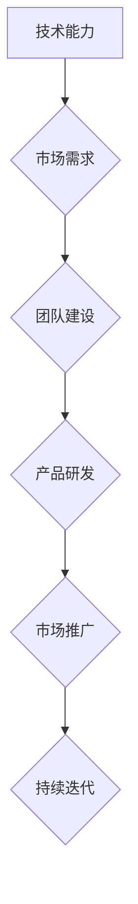

                 

在这个充满机遇与挑战的科技时代，人工智能（AI）无疑是引领变革的重要力量。众多创业者纷纷投身于这片蓝海，希望通过AI技术改变世界。本文将讲述一位95后创始人的AI创业故事，探讨他在选择、挑战与成长中的心得体会。

## 关键词
- AI创业
- 95后创始人
- 创业挑战
- 成长心得

## 摘要
本文将介绍一位95后创始人如何选择AI作为创业方向，面对创业过程中的挑战，以及他从中获得的成长经验。通过他的故事，读者可以了解到在AI创业热潮中，如何正确选择和应对挑战，为未来的创业之路打下坚实的基础。

## 1. 背景介绍

### 1.1 时代背景
随着人工智能技术的迅猛发展，AI正在深刻地改变着各行各业。从自动驾驶、智能制造到医疗健康、金融科技，AI技术的应用前景无限广阔。在这个大背景下，越来越多的年轻人看到了AI创业的巨大潜力，纷纷加入这个行列。

### 1.2 创始人介绍
我们的主角小杨，是一位95后年轻创业者。他本科毕业于一所知名大学的计算机专业，在校期间就展现出了出色的编程能力和创新精神。毕业后，他进入了一家知名互联网公司，担任技术工程师。然而，他并不满足于现状，心中始终燃烧着创业的梦想。

## 2. 核心概念与联系

### 2.1 AI技术概述
人工智能（AI）是指由人制造出的系统所表现出来的智能。AI技术包括机器学习、深度学习、自然语言处理、计算机视觉等多个领域。这些技术通过数据、算法和计算能力，使计算机能够模拟人类的智能行为。

### 2.2 AI创业的关键要素
在AI创业过程中，核心要素包括：
- **技术能力**：掌握前沿的AI技术，能够解决实际问题。
- **市场需求**：了解市场需求，找到商业机会。
- **团队建设**：组建专业、高效的团队，共同推进项目。

### 2.3 Mermaid流程图
下面是AI创业过程中核心概念和联系的Mermaid流程图：



## 3. 核心算法原理 & 具体操作步骤

### 3.1 算法原理概述
在AI创业中，核心算法的原理是解决特定问题的理论基础。例如，在自动驾驶领域，核心算法包括目标检测、路径规划等。这些算法通过大量的数据训练，能够模拟人类的决策过程。

### 3.2 算法步骤详解
以目标检测算法为例，其基本步骤包括：

1. **数据预处理**：对输入图像进行缩放、灰度化等处理。
2. **特征提取**：使用卷积神经网络提取图像特征。
3. **目标检测**：通过分类器判断图像中是否存在目标，并定位目标位置。
4. **结果输出**：将检测结果输出，用于后续处理。

### 3.3 算法优缺点
目标检测算法的优点在于准确率高、速度快；缺点是对复杂场景的处理能力有限，需要大量训练数据。

### 3.4 算法应用领域
目标检测算法广泛应用于自动驾驶、视频监控、人脸识别等领域。

## 4. 数学模型和公式 & 详细讲解 & 举例说明

### 4.1 数学模型构建
以线性回归模型为例，其数学模型为：
\[ y = wx + b \]

### 4.2 公式推导过程
线性回归模型的推导过程主要包括最小二乘法、梯度下降法等。

### 4.3 案例分析与讲解
假设我们要预测房价，可以通过线性回归模型构建数学模型，然后通过训练数据集进行训练，最后得到预测模型。具体步骤如下：

1. **数据收集**：收集历史房价数据。
2. **数据预处理**：对数据集进行清洗、归一化等处理。
3. **模型构建**：选择合适的模型结构，例如线性回归模型。
4. **模型训练**：使用训练数据集训练模型。
5. **模型评估**：使用验证数据集评估模型性能。
6. **模型应用**：使用测试数据集进行预测。

## 5. 项目实践：代码实例和详细解释说明

### 5.1 开发环境搭建
在开发环境搭建方面，我们选择Python作为编程语言，使用TensorFlow作为深度学习框架。

### 5.2 源代码详细实现
下面是一个简单的线性回归模型的Python代码实现：

```python
import tensorflow as tf

# 定义输入层
X = tf.placeholder(tf.float32, shape=[None, 1])
y = tf.placeholder(tf.float32, shape=[None, 1])

# 定义模型参数
w = tf.Variable(tf.random_uniform([1], -1.0, 1.0), name='weight')
b = tf.Variable(tf.zeros([1]), name='bias')

# 定义模型输出
y_pred = w * X + b

# 定义损失函数
loss = tf.reduce_mean(tf.square(y - y_pred))

# 定义优化器
optimizer = tf.train.GradientDescentOptimizer(learning_rate=0.5)
train_op = optimizer.minimize(loss)

# 初始化全局变量
init = tf.global_variables_initializer()

# 训练模型
with tf.Session() as sess:
    sess.run(init)
    for step in range(100):
        _, loss_val = sess.run([train_op, loss], feed_dict={X: X_train, y: y_train})
        if step % 10 == 0:
            print(f"Step {step}, Loss: {loss_val}")

# 模型评估
with tf.Session() as sess:
    sess.run(init)
    y_pred_val = sess.run(y_pred, feed_dict={X: X_test})
    print(f"Test Loss: {tf.reduce_mean(tf.square(y_test - y_pred_val)).eval()}")
```

### 5.3 代码解读与分析
这段代码实现了线性回归模型的基本流程，包括数据输入、模型定义、模型训练和模型评估。

### 5.4 运行结果展示
通过运行代码，我们可以得到模型在训练集和测试集上的损失值。通常情况下，训练集的损失值会逐渐减小，而测试集的损失值会在一定范围内波动。

## 6. 实际应用场景

### 6.1 自动驾驶
自动驾驶是AI技术的重要应用领域。通过目标检测、路径规划等算法，自动驾驶汽车可以实现对道路环境的感知、决策和控制。

### 6.2 智能家居
智能家居通过AI技术实现家电设备的智能控制，提高生活便利性和舒适度。

### 6.3 医疗健康
AI技术在医疗健康领域的应用包括疾病预测、诊断辅助、智能医疗设备等，有望提高医疗水平和效率。

### 6.4 金融科技
金融科技通过AI技术实现智能投顾、风险控制、反欺诈等功能，提高金融服务质量和效率。

## 7. 工具和资源推荐

### 7.1 学习资源推荐
- 《深度学习》（Goodfellow et al.）
- 《Python深度学习》（François Chollet）
- 《AI应用实战》（Roger A. Hurn）
- 《自然语言处理综述》（Daniel Jurafsky & James H. Martin）

### 7.2 开发工具推荐
- TensorFlow
- PyTorch
- Keras
- Jupyter Notebook

### 7.3 相关论文推荐
- "Deep Learning"（Goodfellow et al.）
- "Deep Residual Learning for Image Recognition"（He et al.）
- "Attention Is All You Need"（Vaswani et al.）
- "Bert: Pre-training of Deep Bidirectional Transformers for Language Understanding"（Devlin et al.）

## 8. 总结：未来发展趋势与挑战

### 8.1 研究成果总结
AI技术在近年来取得了显著的进展，不仅在理论研究上取得了突破，在实际应用中也展现出了巨大的潜力。

### 8.2 未来发展趋势
随着计算能力的提升和算法的优化，AI技术将在更多领域得到应用，如生物医疗、能源、环境等。

### 8.3 面临的挑战
AI技术在发展过程中也面临一些挑战，如数据隐私、算法透明性、伦理问题等。

### 8.4 研究展望
未来，AI技术的研究将更加注重跨学科的融合，推动人类社会的进步。

## 9. 附录：常见问题与解答

### 9.1 问题1：AI创业需要什么技能？
AI创业需要掌握深度学习、计算机视觉、自然语言处理等核心技术，同时还需要了解市场需求和团队管理。

### 9.2 问题2：AI创业有哪些风险？
AI创业面临技术风险、市场风险、资金风险等。需要制定合理的商业计划和风险管理策略。

### 9.3 问题3：AI创业有哪些成功案例？
成功案例包括谷歌的AlphaGo、特斯拉的自动驾驶技术、IBM的Watson等。这些案例展示了AI技术的巨大潜力。

---

通过本文，我们了解了95后创始人小杨在AI创业过程中的选择、挑战与成长。他的故事告诉我们，在AI创业的道路上，需要不断学习、勇于创新、善于应对挑战。未来，随着AI技术的不断发展，将有更多的创业者在这个领域取得成功。

## 参考文献
- Goodfellow, I., Bengio, Y., & Courville, A. (2016). *Deep Learning*. MIT Press.
- Chollet, F. (2018). *Python Deep Learning*. Packt Publishing.
- Hurn, R. A. (2018). *AI Applications: Transforming Business with Artificial Intelligence*. Springer.
- Jurafsky, D., & Martin, J. H. (2008). *Speech and Language Processing*. Prentice Hall.

作者：禅与计算机程序设计艺术 / Zen and the Art of Computer Programming

