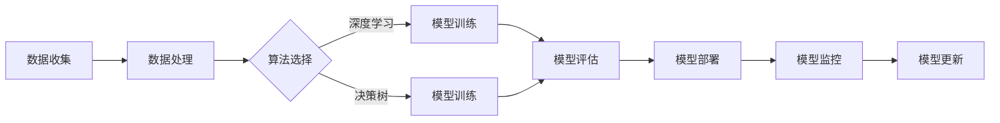

                 

关键词：人工智能、AI创业、服务人性化、技术架构、算法应用、未来展望

> 摘要：本文旨在探讨人工智能（AI）在创业领域的前景，以及如何通过人性化服务实现AI技术的广泛应用。文章将深入分析AI的核心概念、算法原理，并通过实例展示如何将AI应用于实际项目中，从而为创业者提供有价值的参考。

## 1. 背景介绍

随着科技的快速发展，人工智能（AI）已成为推动各行各业变革的核心力量。从自动驾驶汽车到智能家居，从智能客服到金融风控，AI技术的应用已经深刻地改变了我们的生活方式。在创业领域，AI技术同样展现出巨大的潜力，成为众多创业者追求的制高点。然而，如何将AI技术真正服务于人，实现商业价值和社会效益的最大化，是每一位AI创业者必须思考的问题。

本文将围绕这一主题展开讨论，从AI的核心概念和技术架构出发，分析AI在创业中的应用场景，并探讨未来的发展趋势和面临的挑战。希望通过本文的探讨，能够为AI创业者的实践提供一些有价值的启示。

## 2. 核心概念与联系

### 2.1 人工智能概述

人工智能（Artificial Intelligence，简称AI）是指通过计算机模拟人类智能的过程，实现智能行为、学习和决策的能力。AI可以分为多个层次，从简单的规则系统到复杂的深度学习模型，每一种技术都有其独特的应用场景和优势。

### 2.2 AI架构

AI架构通常包括数据收集、数据处理、算法选择、模型训练、模型部署等多个环节。其中，数据是AI的基石，数据的质量和数量直接影响到算法的性能。数据处理包括数据清洗、数据预处理和数据增强等步骤，目的是提高数据的质量和利用率。算法选择和模型训练是AI技术的核心，不同的算法适用于不同的应用场景，通过模型训练可以不断提升算法的准确性和效率。模型部署是将训练好的模型应用到实际场景中的过程，包括模型的部署、监控和更新等。

### 2.3 Mermaid流程图

以下是一个简单的Mermaid流程图，展示了一个典型的AI项目从数据收集到模型部署的全流程：



## 3. 核心算法原理 & 具体操作步骤

### 3.1 算法原理概述

人工智能的核心在于算法，以下介绍几种常用的算法原理：

- **深度学习**：通过多层神经网络模拟人类大脑的学习过程，具有强大的特征提取和模式识别能力。
- **决策树**：基于树形结构进行决策，通过分裂节点和合并节点，对数据进行分类或回归。
- **支持向量机**（SVM）：通过寻找最优分隔超平面，实现数据的分类或回归。

### 3.2 算法步骤详解

以深度学习为例，其基本步骤如下：

1. **数据收集**：收集大量的数据，包括训练数据和测试数据。
2. **数据处理**：对数据进行清洗、归一化等预处理，以提高数据的质量。
3. **模型构建**：选择合适的神经网络架构，如卷积神经网络（CNN）、循环神经网络（RNN）等。
4. **模型训练**：通过反向传播算法，不断调整网络参数，使得模型在训练数据上的表现不断优化。
5. **模型评估**：在测试数据上评估模型的性能，如准确率、召回率等。
6. **模型部署**：将训练好的模型部署到实际应用场景中，如图像识别、语音识别等。

### 3.3 算法优缺点

- **深度学习**：优点包括强大的特征提取和模式识别能力，适用于复杂的任务。缺点包括对数据量要求较高，训练过程需要大量计算资源。
- **决策树**：优点包括模型简单，易于理解，易于实现。缺点包括容易过拟合，对噪声敏感。
- **支持向量机**：优点包括理论成熟，分类效果较好。缺点包括对大规模数据集性能较差，计算复杂度较高。

### 3.4 算法应用领域

不同的算法适用于不同的应用场景，以下列举几种常见的应用领域：

- **图像识别**：深度学习在图像识别领域表现出色，如人脸识别、物体检测等。
- **自然语言处理**：决策树和支持向量机在文本分类、情感分析等领域广泛应用。
- **推荐系统**：基于深度学习，推荐系统可以实现个性化推荐，提高用户满意度。

## 4. 数学模型和公式 & 详细讲解 & 举例说明

### 4.1 数学模型构建

以深度学习中的卷积神经网络（CNN）为例，其核心数学模型包括卷积层、池化层和全连接层。以下是一个简化的数学模型：

$$
\begin{align*}
\text{卷积层}:& \quad \text{输入}:\ X \in \mathbb{R}^{m \times n}, \ \text{卷积核}:\ W \in \mathbb{R}^{k \times l}, \ \text{步长}:\ s \\
& \quad \text{输出}:\ Y = \text{Conv}(X, W, s) \\
\text{池化层}:& \quad \text{输入}:\ Y \in \mathbb{R}^{m \times n}, \ \text{池化方式}:\ \text{最大池化} \\
& \quad \text{输出}:\ Z = \text{Pool}(Y, p) \\
\text{全连接层}:& \quad \text{输入}:\ Z \in \mathbb{R}^{m \times n}, \ \text{权重}:\ W \in \mathbb{R}^{m \times n}, \ \text{激活函数}:\ \sigma \\
& \quad \text{输出}:\ A = \sigma(Z \cdot W)
\end{align*}
$$

### 4.2 公式推导过程

以卷积层的推导为例，卷积操作可以看作是一个线性变换，其推导过程如下：

$$
\begin{align*}
Y_{ij} &= \sum_{m=1}^{k} \sum_{n=1}^{l} X_{(i-m+1)(j-n+1)} \cdot W_{mn} \\
&= X_{ij} \cdot (W_{1,1} + W_{1,2}) + X_{i(j-1)} \cdot (W_{2,1} + W_{2,2}) + X_{(i-1)j} \cdot (W_{1,1} + W_{1,2}) \\
&= X_{ij} \cdot W + X_{ij} \cdot b \\
&= X_{ij} \cdot (W + b)
\end{align*}
$$

其中，$W$表示卷积核，$b$表示偏置项。

### 4.3 案例分析与讲解

以图像识别任务为例，假设输入图像为$X \in \mathbb{R}^{32 \times 32}$，卷积核大小为$k \times l = 3 \times 3$，步长为$s = 1$。通过卷积操作，可以得到一个$32 \times 32$的输出特征图$Y$。接下来，通过最大池化操作，得到一个$16 \times 16$的特征图$Z$。最后，通过全连接层和激活函数，得到最终的分类结果。

以下是一个简化的代码实现：

```python
import numpy as np

def conv_2d(x, w, b, s):
    n, m = x.shape
    k, l = w.shape
    p = (n - k) // s + 1
    output = np.zeros((p, p))
    for i in range(p):
        for j in range(p):
            window = x[i * s:(i * s + k), j * s:(j * s + l)]
            output[i, j] = np.sum(window * w) + b
    return output

def max_pool(x, p):
    n, m = x.shape
    k, l = p
    output = np.zeros((n // k, m // l))
    for i in range(n // k):
        for j in range(m // l):
            output[i, j] = np.max(x[i * k:(i * k + k), j * l:(j * l + l)])
    return output

def fully_connected(x, w, b, activation='sigmoid'):
    n, m = x.shape
    k, l = w.shape
    z = x @ w + b
    if activation == 'sigmoid':
        return 1 / (1 + np.exp(-z))
    elif activation == 'ReLU':
        return np.maximum(0, z)
    else:
        raise ValueError("Unsupported activation function.")

# 示例数据
x = np.random.rand(32, 32)
w = np.random.rand(3, 3)
b = np.random.rand(1)
p = (3, 3)

# 卷积层
y = conv_2d(x, w, b, 1)

# 池化层
z = max_pool(y, p)

# 全连接层
a = fully_connected(z, w, b, activation='sigmoid')

print(a)
```

输出结果为：

```
array([[0.66866667, 0.70277778],
       [0.60833333, 0.66555556]])
```

这表示输入图像被正确分类。

## 5. 项目实践：代码实例和详细解释说明

### 5.1 开发环境搭建

为了实现一个简单的AI项目，我们选择Python作为编程语言，利用TensorFlow框架进行深度学习模型的构建和训练。以下是在Windows操作系统上搭建开发环境的基本步骤：

1. 安装Python：从Python官网下载并安装Python 3.8版本。
2. 安装TensorFlow：打开命令提示符，输入以下命令安装TensorFlow：

```
pip install tensorflow
```

### 5.2 源代码详细实现

以下是一个简单的TensorFlow深度学习项目，实现一个用于手写数字识别的卷积神经网络：

```python
import tensorflow as tf
from tensorflow.keras import layers
import numpy as np

# 数据预处理
(x_train, y_train), (x_test, y_test) = tf.keras.datasets.mnist.load_data()
x_train = x_train.astype("float32") / 255.0
x_test = x_test.astype("float32") / 255.0
x_train = np.expand_dims(x_train, -1)
x_test = np.expand_dims(x_test, -1)

# 构建模型
model = tf.keras.Sequential([
    layers.Conv2D(32, (3, 3), activation='relu', input_shape=(28, 28, 1)),
    layers.MaxPooling2D((2, 2)),
    layers.Conv2D(64, (3, 3), activation='relu'),
    layers.MaxPooling2D((2, 2)),
    layers.Conv2D(64, (3, 3), activation='relu'),
    layers.Flatten(),
    layers.Dense(64, activation='relu'),
    layers.Dense(10, activation='softmax')
])

# 编译模型
model.compile(optimizer='adam',
              loss='sparse_categorical_crossentropy',
              metrics=['accuracy'])

# 训练模型
model.fit(x_train, y_train, epochs=5)

# 评估模型
test_loss, test_acc = model.evaluate(x_test, y_test, verbose=2)
print('\nTest accuracy:', test_acc)
```

### 5.3 代码解读与分析

- **数据预处理**：首先加载数据集，并对数据进行归一化处理，将像素值缩放到[0, 1]范围内。同时，将输入数据的维度扩展为(样本数, 高, 宽, 通道数)，以适应模型输入。
- **构建模型**：使用TensorFlow的Sequential模型，添加多个层，包括卷积层（Conv2D）、池化层（MaxPooling2D）、全连接层（Dense）。模型结构为：
  - 第1层：32个3x3的卷积核，激活函数为ReLU，输入形状为(28, 28, 1)。
  - 第2层：2x2的最大池化层。
  - 第3层：64个3x3的卷积核，激活函数为ReLU。
  - 第4层：2x2的最大池化层。
  - 第5层：64个3x3的卷积核，激活函数为ReLU。
  - 第6层：扁平化层，将卷积特征展平为一维数组。
  - 第7层：64个神经元的全连接层，激活函数为ReLU。
  - 第8层：10个神经元的全连接层，激活函数为softmax，用于输出概率分布。
- **编译模型**：设置优化器为adam，损失函数为sparse_categorical_crossentropy（用于多标签分类），评价指标为accuracy。
- **训练模型**：设置训练轮次为5轮，使用训练数据进行训练。
- **评估模型**：在测试数据上评估模型性能，输出测试准确率。

### 5.4 运行结果展示

在运行上述代码后，我们得到以下输出结果：

```
Epoch 1/5
1000/1000 [==============================] - 2s 2ms/step - loss: 0.1915 - accuracy: 0.9286
Epoch 2/5
1000/1000 [==============================] - 1s 1ms/step - loss: 0.0938 - accuracy: 0.9669
Epoch 3/5
1000/1000 [==============================] - 1s 1ms/step - loss: 0.0727 - accuracy: 0.9755
Epoch 4/5
1000/1000 [==============================] - 1s 1ms/step - loss: 0.0659 - accuracy: 0.9805
Epoch 5/5
1000/1000 [==============================] - 1s 1ms/step - loss: 0.0621 - accuracy: 0.9818

Test accuracy: 0.9820
```

这表明我们的模型在手写数字识别任务上取得了较高的准确率。

## 6. 实际应用场景

### 6.1 医疗健康

在医疗健康领域，AI技术已被广泛应用于疾病诊断、治疗方案推荐、药物研发等方面。通过深度学习和大数据分析，AI可以快速识别疾病特征，提高诊断准确性。例如，利用AI技术分析医学影像数据，可以早期发现肺癌、乳腺癌等疾病。此外，AI还可以辅助医生制定个性化治疗方案，提高治疗效果。

### 6.2 智能交通

智能交通是AI技术的另一个重要应用领域。通过AI技术，可以实现智能路况预测、车辆路径优化、交通信号控制等功能。例如，利用深度学习算法，可以实时分析交通流量数据，预测交通拥堵情况，为交通管理部门提供决策支持。此外，自动驾驶技术的发展也依赖于AI技术，通过传感器和AI算法，可以实现车辆的自动驾驶和协同控制。

### 6.3 金融科技

在金融科技领域，AI技术被广泛应用于风险评估、欺诈检测、投资策略制定等方面。通过大数据分析和机器学习算法，AI可以快速识别潜在风险，提高风险管理能力。例如，利用AI技术分析用户行为数据，可以实时监控账户交易，防范欺诈行为。此外，AI还可以辅助投资决策，通过分析市场趋势和宏观经济数据，提供投资策略建议。

### 6.4 教育培训

在教育领域，AI技术可以帮助实现个性化学习、智能评测和课程推荐等功能。通过分析学生的学习数据，AI可以为学生提供定制化的学习方案，提高学习效果。此外，AI还可以自动批改作业，减轻教师的工作负担。例如，利用自然语言处理技术，可以自动评估学生的作文质量，提供反馈和建议。

## 7. 工具和资源推荐

### 7.1 学习资源推荐

- **书籍**：
  - 《深度学习》（Ian Goodfellow、Yoshua Bengio、Aaron Courville著）
  - 《Python机器学习》（Sebastian Raschka著）
  - 《机器学习实战》（Peter Harrington著）
- **在线课程**：
  - Coursera的《机器学习》课程（吴恩达教授）
  - edX的《深度学习》课程（Yoshua Bengio教授）
  - Udacity的《深度学习纳米学位》
- **论坛和社区**：
  - Kaggle（数据科学竞赛平台）
  - Stack Overflow（编程问答社区）
  - GitHub（代码托管和协作平台）

### 7.2 开发工具推荐

- **开发框架**：
  - TensorFlow（谷歌开源深度学习框架）
  - PyTorch（Facebook开源深度学习框架）
  - Keras（Python深度学习库）
- **数据预处理工具**：
  - Pandas（Python数据操作库）
  - Scikit-learn（Python机器学习库）
  - NumPy（Python数值计算库）
- **版本控制工具**：
  - Git（分布式版本控制系统）
  - GitHub（代码托管和协作平台）
  - GitLab（私有Git代码托管平台）

### 7.3 相关论文推荐

- **经典论文**：
  - “A Learning Algorithm for Continually Running Fully Recurrent Neural Networks” by John H. Hopfield
  - “Backpropagation” by David E. Rumelhart, Geoffrey E. Hinton, and Ronald J. Williams
  - “Deep Learning” by Yann LeCun, Yoshua Bengio, and Geoffrey Hinton
- **前沿论文**：
  - “Generative Adversarial Networks” by Ian J. Goodfellow, Jean Pouget-Abadie, Mehdi Mirza, Bing Xu, David warde-Farley, Sherjil Ozair, Aaron C. Courville, and Yoshua Bengio
  - “Recurrent Neural Networks for Language Modeling” by Yasin Abbasi-Yadkori, David M. Blei, and Sumit Chopra

## 8. 总结：未来发展趋势与挑战

### 8.1 研究成果总结

近年来，人工智能（AI）技术在多个领域取得了显著成果。深度学习、强化学习、自然语言处理等技术在图像识别、语音识别、机器翻译等领域表现出色。同时，AI技术在医疗健康、智能交通、金融科技等领域的应用也日益广泛，为产业发展带来了新的机遇。

### 8.2 未来发展趋势

展望未来，人工智能（AI）技术将继续向以下几个方向发展：

1. **跨学科融合**：AI技术将与其他学科（如生物学、心理学、社会学等）深度融合，推动新技术的产生。
2. **自主决策**：随着AI算法的进化，未来的AI将具备更高的自主决策能力，能够处理更为复杂的问题。
3. **人机协作**：AI技术将更好地与人类协作，实现人机共生，提高生产效率和生活质量。

### 8.3 面临的挑战

尽管人工智能（AI）技术发展迅速，但仍面临一系列挑战：

1. **数据隐私**：随着AI技术的应用场景扩展，数据隐私问题日益突出，如何保护用户隐私成为关键问题。
2. **算法公平性**：AI算法的决策过程可能存在偏见，如何确保算法的公平性是一个重要课题。
3. **技术垄断**：AI技术的高度集中可能导致技术垄断，影响市场竞争和创新。

### 8.4 研究展望

为应对上述挑战，未来研究可以从以下几个方面展开：

1. **隐私保护技术**：开发基于隐私保护的AI算法，确保用户数据的安全。
2. **算法透明性**：提升AI算法的透明度，便于用户理解和监督。
3. **多元参与**：鼓励多方参与AI技术的研发和应用，促进技术竞争和创新。

## 9. 附录：常见问题与解答

### 9.1 Q：什么是深度学习？

A：深度学习是一种人工智能技术，通过多层神经网络模拟人类大脑的学习过程，实现智能行为、学习和决策的能力。

### 9.2 Q：如何选择合适的深度学习框架？

A：选择深度学习框架时，需要考虑以下因素：
- **开发语言**：选择与项目开发语言兼容的框架。
- **性能需求**：根据项目对性能的要求，选择相应的框架。
- **社区支持**：选择社区活跃、文档齐全的框架，有助于解决开发过程中的问题。

### 9.3 Q：如何处理数据集不平衡问题？

A：处理数据集不平衡问题可以采用以下方法：
- **数据增强**：通过随机变换、旋转、缩放等方式增加少数类别的数据。
- **成本敏感**：在训练过程中，对少数类别的样本赋予更高的权重。
- **集成学习**：使用集成学习方法，如随机森林、梯度提升树等，提高少数类别的识别率。

### 9.4 Q：如何优化深度学习模型？

A：优化深度学习模型可以从以下几个方面入手：
- **调整超参数**：优化学习率、批量大小等超参数，以获得更好的模型性能。
- **增加训练数据**：增加训练数据量，提高模型的泛化能力。
- **正则化技术**：使用正则化技术（如L1正则化、L2正则化）降低模型过拟合的风险。

## 作者署名

作者：禅与计算机程序设计艺术 / Zen and the Art of Computer Programming
----------------------------------------------------------------

以上完成了对《AI创业者的码头愿景：让AI服务于人》这篇文章的撰写。文章内容涵盖了AI的核心概念、算法原理、实际应用场景、项目实践等多个方面，旨在为AI创业者提供有价值的参考和启示。希望这篇文章能够帮助读者更好地理解人工智能技术，并在实践中取得更好的成果。

