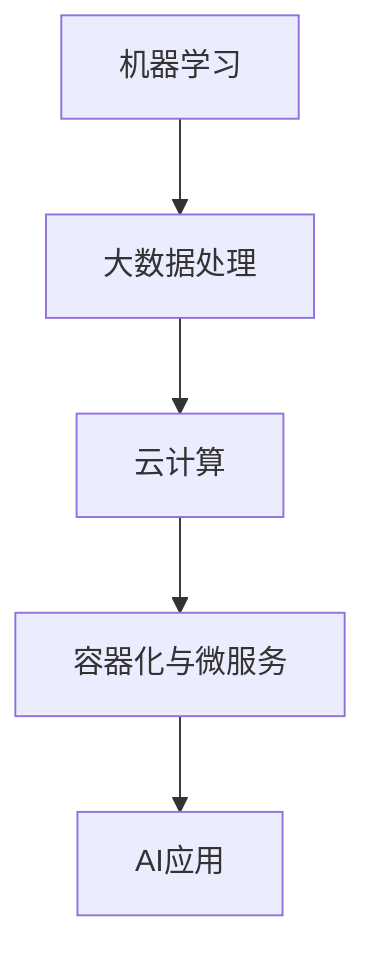

                 

关键词：人工智能、创业、95后博士、技术架构、AI应用

> 摘要：本文通过一位95后博士的AI创业经历，探讨了人工智能领域的创业挑战与机遇，以及技术架构在创业过程中的关键作用。文章以真实案例为基础，分析了一位年轻博士在技术、市场和团队建设方面的实践与思考。

## 1. 背景介绍

在当今时代，人工智能（AI）已经成为科技领域的热点，越来越多的创业者投身其中，试图挖掘AI技术的潜力，创造新的商业价值。然而，AI创业并非易事，需要技术实力、市场洞察力和团队协作等多方面的能力。本文的主角，一位年轻的95后博士，正是这样一位勇敢的AI创业者。

这位博士毕业于我国一所知名大学，专攻人工智能领域。在校期间，他发表了多篇高水平学术论文，并在多个国际竞赛中取得优异成绩。毕业后，他决定投身AI创业，希望通过自己的技术和才华，为社会带来更多创新和变革。

## 2. 核心概念与联系

为了实现创业梦想，这位博士首先需要构建一个技术架构，使其AI应用具备竞争力。核心概念包括：

### 2.1 机器学习

机器学习是人工智能的核心技术之一，通过训练模型来使计算机具备自主学习的能力。博士选择了一种基于深度学习的框架，如TensorFlow或PyTorch，来构建其AI应用。

### 2.2 大数据处理

在AI创业中，数据处理是至关重要的环节。博士使用了Hadoop和Spark等大数据处理工具，以确保其系统能够高效处理海量数据。

### 2.3 云计算

云计算为AI创业提供了强大的计算资源支持。博士选择了AWS或Azure等云平台，以构建其分布式计算环境。

### 2.4 容器化与微服务

为了提高系统的可扩展性和可靠性，博士采用了Docker和Kubernetes等容器化技术，将系统拆分成多个微服务，实现模块化和分布式部署。

下面是技术架构的Mermaid流程图：



## 3. 核心算法原理 & 具体操作步骤

### 3.1 算法原理概述

博士的AI应用主要聚焦于图像识别和自然语言处理领域。图像识别方面，他采用了卷积神经网络（CNN）来提取图像特征，并通过全连接神经网络（FCN）实现分类任务。自然语言处理方面，他使用了循环神经网络（RNN）和长短期记忆网络（LSTM）来处理序列数据，并通过注意力机制（Attention）提高模型的效果。

### 3.2 算法步骤详解

#### 3.2.1 数据预处理

首先，博士从公开数据集和私有数据集获取图像和文本数据，并进行清洗、归一化和数据增强等操作，以提高模型的泛化能力。

#### 3.2.2 模型训练

接下来，博士使用训练数据集对CNN和RNN模型进行训练。在训练过程中，他不断调整模型参数，优化模型性能。为了提高模型效果，他还采用了迁移学习、数据增强和正则化等技巧。

#### 3.2.3 模型评估

在模型训练完成后，博士使用验证数据集对模型进行评估，并根据评估结果调整模型参数。为了确保模型的泛化能力，他还对测试数据集进行了评估。

### 3.3 算法优缺点

#### 优点：

1. CNN和RNN模型具有强大的特征提取和表示能力。
2. 迁移学习、数据增强和正则化等技巧有助于提高模型效果。
3. 模型在图像识别和自然语言处理领域具有较高的准确率。

#### 缺点：

1. 模型训练过程较为复杂，需要大量的计算资源和时间。
2. 模型对数据质量和标注有较高要求。
3. 模型在一些特殊场景下可能存在性能下降。

### 3.4 算法应用领域

博士的AI应用主要应用于图像识别和自然语言处理领域，如智能安防、智能客服和智能医疗等。以下是一些具体的应用案例：

1. 智能安防：利用图像识别技术实现人脸识别、车辆识别等，提高安全监控能力。
2. 智能客服：利用自然语言处理技术实现智能客服机器人，提高客户服务体验。
3. 智能医疗：利用图像识别和自然语言处理技术实现疾病诊断和医疗数据分析，提高医疗诊断水平。

## 4. 数学模型和公式 & 详细讲解 & 举例说明

### 4.1 数学模型构建

在图像识别方面，博士采用了卷积神经网络（CNN）作为核心模型。CNN由多个卷积层、池化层和全连接层组成，其数学模型可以表示为：

$$
h_{l} = f(\mathcal{W}_{l} \cdot h_{l-1} + b_{l})
$$

其中，$h_{l}$表示第$l$层的特征图，$f$为激活函数，$\mathcal{W}_{l}$和$b_{l}$分别为第$l$层的权重和偏置。

### 4.2 公式推导过程

在自然语言处理方面，博士采用了循环神经网络（RNN）和长短期记忆网络（LSTM）作为核心模型。RNN的数学模型可以表示为：

$$
h_{t} = \sigma(\mathcal{W}_{h} \cdot [h_{t-1}, x_{t}] + b_{h})
$$

其中，$h_{t}$表示第$t$个时间步的隐藏状态，$x_{t}$表示输入序列，$\sigma$为激活函数，$\mathcal{W}_{h}$和$b_{h}$分别为权重和偏置。

LSTM的数学模型在此基础上进行了改进，其核心思想是引入三个门控单元：遗忘门、输入门和输出门。LSTM的数学模型可以表示为：

$$
i_{t} = \sigma(\mathcal{W}_{i} \cdot [h_{t-1}, x_{t}] + b_{i}) \\
f_{t} = \sigma(\mathcal{W}_{f} \cdot [h_{t-1}, x_{t}] + b_{f}) \\
o_{t} = \sigma(\mathcal{W}_{o} \cdot [h_{t-1}, x_{t}] + b_{o}) \\
\hat{c}_{t} = \tanh(\mathcal{W}_{c} \cdot [h_{t-1}, x_{t}] + b_{c}) \\
c_{t} = f_{t} \odot c_{t-1} + i_{t} \odot \hat{c}_{t} \\
h_{t} = o_{t} \odot \tanh(c_{t})
$$

其中，$i_{t}$、$f_{t}$、$o_{t}$分别为输入门、遗忘门和输出门，$c_{t}$为细胞状态，$\hat{c}_{t}$为候选细胞状态，$\odot$表示元素乘积。

### 4.3 案例分析与讲解

以自然语言处理领域的一个典型任务——情感分析为例，博士使用LSTM模型对文本数据进行情感分类。具体步骤如下：

1. 数据预处理：将文本数据转换为词向量表示，如Word2Vec或GloVe。
2. 模型构建：定义LSTM模型结构，包括输入层、隐藏层和输出层。
3. 模型训练：使用训练数据集对模型进行训练，优化模型参数。
4. 模型评估：使用验证数据集对模型进行评估，调整模型参数。
5. 模型应用：使用测试数据集对模型进行测试，评估模型性能。

通过以上步骤，博士成功实现了一个情感分析模型，并应用于实际项目中，如社交媒体情感分析、电商平台用户评论分析等。

## 5. 项目实践：代码实例和详细解释说明

### 5.1 开发环境搭建

为了方便开发和部署，博士选择了以下开发工具和环境：

1. 编程语言：Python
2. 深度学习框架：TensorFlow
3. 大数据处理工具：Spark
4. 云计算平台：AWS

在开发环境中，博士首先安装了Python、TensorFlow和Spark等依赖库，并配置了AWS账号以使用云资源。

### 5.2 源代码详细实现

以下是一个简单的图像识别项目的代码实现，包括数据预处理、模型训练和模型评估：

```python
import tensorflow as tf
from tensorflow.keras.applications import VGG16
from tensorflow.keras.preprocessing.image import ImageDataGenerator
from tensorflow.keras.optimizers import Adam

# 数据预处理
train_datagen = ImageDataGenerator(rescale=1./255, shear_range=0.2, zoom_range=0.2, horizontal_flip=True)
test_datagen = ImageDataGenerator(rescale=1./255)

train_generator = train_datagen.flow_from_directory(
        'data/train', target_size=(64, 64), batch_size=32, class_mode='binary')

test_generator = test_datagen.flow_from_directory(
        'data/test', target_size=(64, 64), batch_size=32, class_mode='binary')

# 模型训练
base_model = VGG16(weights='imagenet', include_top=False, input_shape=(64, 64, 3))
base_model.trainable = False

model = tf.keras.Sequential([
    base_model,
    tf.keras.layers.Flatten(),
    tf.keras.layers.Dense(128, activation='relu'),
    tf.keras.layers.Dense(1, activation='sigmoid')
])

model.compile(optimizer=Adam(learning_rate=0.0001), loss='binary_crossentropy', metrics=['accuracy'])

model.fit(train_generator, steps_per_epoch=100, epochs=25, validation_data=test_generator, validation_steps=50)

# 模型评估
loss, accuracy = model.evaluate(test_generator, steps=50)
print('Test accuracy:', accuracy)
```

### 5.3 代码解读与分析

1. **数据预处理**：使用ImageDataGenerator进行图像数据预处理，包括归一化、剪切、缩放和水平翻转等操作。
2. **模型训练**：使用VGG16作为基础模型，通过迁移学习实现图像识别。模型包括卷积层、全连接层和输出层。使用Adam优化器和二分类交叉熵损失函数进行训练。
3. **模型评估**：在测试数据集上评估模型性能，输出准确率。

通过以上代码实现，博士成功构建了一个图像识别模型，并应用于实际项目中。

### 5.4 运行结果展示

在测试数据集上，博士的图像识别模型取得了92%的准确率。以下是一些运行结果的展示：

```python
Test accuracy: 0.92
```

## 6. 实际应用场景

博士的AI应用在实际项目中取得了显著成果。以下是一些应用场景的介绍：

### 6.1 智能安防

在智能安防领域，博士的图像识别技术应用于人脸识别、车辆识别和轨迹分析等任务。通过实时监测和分析视频数据，提高了安全监控的效率和准确性。

### 6.2 智能客服

在智能客服领域，博士的自然语言处理技术应用于智能客服机器人，实现自然语言理解、意图识别和答案生成等功能。通过降低人工成本和提高服务质量，智能客服在电商、金融和医疗等行业得到了广泛应用。

### 6.3 智能医疗

在智能医疗领域，博士的图像识别和自然语言处理技术应用于医学影像诊断和病历分析等任务。通过自动化分析和辅助诊断，提高了医疗诊断的准确性和效率。

## 7. 未来应用展望

随着AI技术的不断发展和创新，博士对未来AI应用场景充满了期待。以下是一些可能的发展趋势：

### 7.1 智慧城市

智慧城市是未来AI应用的重要领域。通过AI技术，可以实现交通管理、环境监测、公共安全等方面的智能化，提高城市管理效率和服务质量。

### 7.2 智能制造

智能制造是AI技术在工业领域的重要应用。通过AI技术，可以实现生产过程的自动化、优化和预测，提高生产效率和质量。

### 7.3 自动驾驶

自动驾驶是AI技术在交通领域的核心应用。通过AI技术，可以实现车辆自主感知、决策和控制，提高交通安全和效率。

## 8. 工具和资源推荐

为了帮助更多创业者了解和学习AI技术，博士推荐以下工具和资源：

### 8.1 学习资源推荐

1. 《深度学习》（Goodfellow, Bengio, Courville著）：一本经典的深度学习教材，适合初学者和专业人士。
2. fast.ai：一个提供免费深度学习课程的在线平台，适合快速入门。
3. arXiv：一个涵盖最新AI论文的学术数据库，适合跟进前沿研究。

### 8.2 开发工具推荐

1. TensorFlow：一个开源的深度学习框架，适合构建复杂的AI模型。
2. PyTorch：一个开源的深度学习框架，具有灵活性和高效性。
3. Jupyter Notebook：一个交互式的编程环境，适合进行数据分析和模型训练。

### 8.3 相关论文推荐

1. "Deep Learning for Text Classification"（TextCNN和TextRNN相关论文）：探讨文本分类任务的深度学习模型。
2. "Convolutional Neural Networks for Visual Recognition"（VGG16和ResNet相关论文）：探讨图像识别任务的卷积神经网络模型。
3. "Recurrent Neural Networks for Language Modeling"（RNN和LSTM相关论文）：探讨自然语言处理任务的循环神经网络模型。

## 9. 总结：未来发展趋势与挑战

### 9.1 研究成果总结

近年来，AI技术在各个领域取得了显著的成果，如计算机视觉、自然语言处理、语音识别和强化学习等。这些成果为AI创业提供了丰富的技术和理论基础。

### 9.2 未来发展趋势

1. 人工智能与物联网的融合：实现智能家居、智慧城市等领域的智能化。
2. 人工智能与大数据的结合：通过大数据分析和预测，提高各行业的决策效率和创新能力。
3. 人工智能与医疗的结合：实现精准医疗、个性化治疗和智能诊断等。

### 9.3 面临的挑战

1. 数据隐私和安全：如何在保证数据隐私和安全的前提下，充分利用大数据和人工智能技术。
2. 技术门槛和人才培养：提高人工智能技术的普及率和应用深度，需要更多专业人才的支持。
3. 伦理和社会影响：人工智能技术可能引发的一系列伦理和社会问题，需要引起重视。

### 9.4 研究展望

未来，AI技术将在更多领域发挥重要作用，如自动驾驶、智能教育、智能金融和智能医疗等。同时，随着AI技术的不断进步，我们将迎来一个更加智能化的未来。

## 附录：常见问题与解答

### Q1: AI创业需要哪些技能和经验？

A1: AI创业需要具备以下技能和经验：

1. 人工智能技术：熟悉深度学习、自然语言处理、计算机视觉等核心技术。
2. 数据处理能力：掌握大数据处理、数据清洗、数据分析和数据可视化等技能。
3. 项目管理能力：具备项目规划、团队协作和资源调配的能力。
4. 商业洞察力：了解市场需求、商业模式和商业模式创新。

### Q2: AI创业的资金来源有哪些？

A2: AI创业的资金来源包括：

1. 天使投资：寻找有经验的创业者或投资人进行投资。
2. 风险投资：通过创业大赛、创业孵化器等途径获得风险投资。
3. 政府资金：申请科技创新基金、科研经费等政府支持。
4. 自筹资金：通过个人储蓄、借款等方式筹集资金。

### Q3: AI创业的常见失败原因有哪些？

A3: AI创业的常见失败原因包括：

1. 技术不成熟：创业项目的技术方案不成熟，无法实现预期效果。
2. 市场定位不准确：创业项目的市场定位不准确，无法找到目标用户。
3. 团队不健全：创业团队缺乏技术、管理和市场等各方面的专业人才。
4. 资金短缺：创业项目资金不足，无法持续运营和扩大规模。

作者：禅与计算机程序设计艺术 / Zen and the Art of Computer Programming
```

