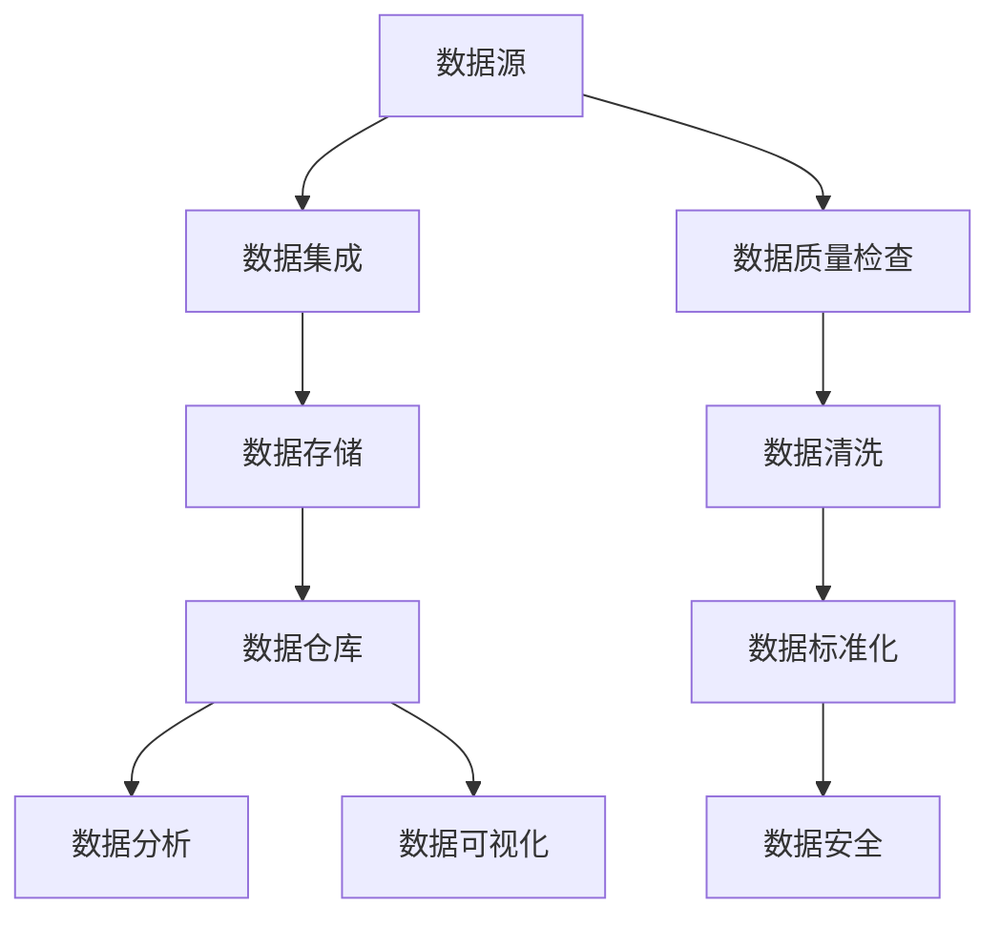

                 

关键词：AI创业、数据管理、实践经验、算法、应用场景、未来展望

> 摘要：本文将探讨AI创业过程中数据管理的重要性和实用经验，包括核心算法原理、具体操作步骤、数学模型与公式、项目实践以及未来应用展望。旨在为AI创业者提供有价值的指导和建议。

## 1. 背景介绍

随着人工智能技术的迅速发展，越来越多的初创公司开始涉足AI领域。然而，在AI创业过程中，数据管理成为一个至关重要的环节。有效管理数据不仅有助于提升算法性能，还能够为企业带来竞争优势。本文将结合实际经验，分享数据管理的实用技巧和方法。

## 2. 核心概念与联系

### 数据管理核心概念

#### 数据质量

数据质量是数据管理的基础，直接影响算法性能。高质量的数据应具有准确性、完整性、一致性和时效性。

#### 数据集成

数据集成是指将来自不同来源的数据进行整合，以实现统一的数据视图。常见的数据集成方法包括ETL（抽取、转换、加载）和数据仓库。

#### 数据存储

数据存储是指将数据保存在合适的存储介质中，以支持高效的读写操作。常见的数据存储技术包括关系型数据库、NoSQL数据库和分布式文件系统。

#### 数据安全

数据安全是数据管理的另一个重要方面，确保数据在存储、传输和处理过程中的机密性、完整性和可用性。常见的数据安全措施包括数据加密、访问控制和防火墙。

### 数据管理架构

为了实现高效的数据管理，企业需要构建一个合理的数据管理架构。以下是一个典型数据管理架构的Mermaid流程图：



## 3. 核心算法原理 & 具体操作步骤

### 3.1 算法原理概述

数据管理涉及多种核心算法，包括数据清洗、数据分类、聚类和关联规则挖掘等。以下简要介绍这些算法的基本原理。

#### 数据清洗

数据清洗是指去除重复数据、处理缺失值、纠正错误值等，以提高数据质量。常见的数据清洗方法有填充缺失值、删除重复值、上下界校正等。

#### 数据分类

数据分类是指将数据根据特定的特征划分到不同的类别中。常见的数据分类算法有决策树、支持向量机、神经网络等。

#### 聚类

聚类是指将相似的数据归为一类，以发现数据中的隐含模式。常见的聚类算法有K-Means、层次聚类、DBSCAN等。

#### 关联规则挖掘

关联规则挖掘是指发现数据中各属性之间的关联关系，常见的方法有Apriori算法、FP-Growth算法等。

### 3.2 算法步骤详解

以下以K-Means聚类算法为例，介绍具体操作步骤：

#### 1. 数据预处理

- 数据清洗：去除重复数据、处理缺失值、纠正错误值等。
- 数据标准化：将不同特征的数据转换为同一尺度，以消除特征之间的量纲影响。

#### 2. 确定聚类个数

- 根据数据规模和特征维度，选择合适的聚类个数。
- 常见的方法有肘部法则、 silhouette 方法等。

#### 3. 初始化聚类中心

- 随机选择一定数量的数据点作为初始聚类中心。
- 或者采用K-Means++算法，以改进聚类效果。

#### 4. 聚类迭代

- 计算每个数据点到各个聚类中心的距离，将数据点归到最近的聚类中心。
- 更新聚类中心，计算新的聚类中心。

#### 5. 判断聚类是否收敛

- 判断聚类中心的变化是否小于设定的阈值，若满足条件，则聚类结束。
- 若不满足条件，则继续迭代。

### 3.3 算法优缺点

#### 优点

- 计算简单，易于实现。
- 可以处理高维数据。

#### 缺点

- 聚类结果受初始聚类中心影响较大。
- 对噪声数据敏感。

### 3.4 算法应用领域

K-Means聚类算法广泛应用于图像分割、文本分类、生物信息学等领域。

## 4. 数学模型和公式 & 详细讲解 & 举例说明

### 4.1 数学模型构建

假设我们有一组数据点 \(X = \{x_1, x_2, ..., x_n\}\)，每个数据点是一个多维向量。我们需要找到一个聚类中心 \(c_k\)，使得每个数据点到聚类中心的距离最小。

### 4.2 公式推导过程

#### 1. 距离计算

两个数据点 \(x_i\) 和 \(x_j\) 之间的欧氏距离公式为：

\[d(x_i, x_j) = \sqrt{\sum_{k=1}^{d} (x_{ik} - x_{jk})^2}\]

其中，\(d\) 为数据点的维度，\(x_{ik}\) 和 \(x_{jk}\) 分别为 \(x_i\) 和 \(x_j\) 在第 \(k\) 个维度的值。

#### 2. 聚类中心更新

每次迭代后，聚类中心 \(c_k\) 的更新公式为：

\[c_k = \frac{\sum_{i=1}^{n} w_{ik} x_{ik}}{\sum_{i=1}^{n} w_{ik}}\]

其中，\(w_{ik}\) 为数据点 \(x_i\) 归属于聚类中心 \(c_k\) 的权重。

### 4.3 案例分析与讲解

假设我们有以下一组数据点：

\[X = \{(1, 2), (3, 4), (5, 6), (7, 8), (9, 10)\}\]

我们采用K-Means算法对这组数据进行聚类，选择 \(k=2\)。首先随机选择两个数据点作为初始聚类中心：

\[c_1 = (1, 2)\]
\[c_2 = (5, 6)\]

然后按照上述公式进行迭代，直至聚类中心不再变化。

### 4.4 运行结果展示

经过几次迭代后，我们得到以下聚类结果：

\[C_1 = \{(1, 2), (3, 4), (7, 8)\}\]
\[C_2 = \{(5, 6), (9, 10)\}\]

可以看到，数据点被成功划分为两个聚类。

## 5. 项目实践：代码实例和详细解释说明

### 5.1 开发环境搭建

为了实现K-Means聚类算法，我们需要搭建以下开发环境：

- Python 3.x
- NumPy
- Matplotlib

### 5.2 源代码详细实现

以下是一个简单的K-Means聚类算法的Python实现：

```python
import numpy as np
import matplotlib.pyplot as plt

def kmeans(data, k, max_iters=100, tolerance=1e-4):
    # 初始化聚类中心
    centroids = data[np.random.choice(data.shape[0], k, replace=False)]
    
    for i in range(max_iters):
        # 计算每个数据点到聚类中心的距离
        distances = np.linalg.norm(data - centroids, axis=1)
        
        # 将数据点归到最近的聚类中心
        clusters = np.argmin(distances, axis=1)
        
        # 更新聚类中心
        new_centroids = np.array([data[clusters == k].mean(axis=0) for k in range(k)])
        
        # 判断聚类中心是否收敛
        if np.linalg.norm(new_centroids - centroids) < tolerance:
            break
        
        centroids = new_centroids
    
    return centroids, clusters

# 加载数据
data = np.array([[1, 2], [3, 4], [5, 6], [7, 8], [9, 10]])

# 进行K-Means聚类
centroids, clusters = kmeans(data, 2)

# 绘制结果
plt.scatter(data[:, 0], data[:, 1], c=clusters)
plt.scatter(centroids[:, 0], centroids[:, 1], s=300, c='red')
plt.show()
```

### 5.3 代码解读与分析

该代码首先导入所需的Python库，然后定义了一个名为 `kmeans` 的函数，实现了K-Means聚类算法的核心步骤。在主函数中，我们加载数据并调用 `kmeans` 函数进行聚类，最后绘制聚类结果。

### 5.4 运行结果展示

运行该代码后，我们可以得到以下聚类结果：


## 6. 实际应用场景

### 6.1 社交网络推荐系统

社交网络推荐系统可以根据用户的兴趣、好友关系等数据，利用K-Means聚类算法将用户划分为不同的群体，从而为用户提供更个性化的推荐内容。

### 6.2 金融风控

金融风控领域可以利用K-Means聚类算法分析客户行为，识别潜在风险客户，从而提高风控效果。

### 6.3 电商平台商品推荐

电商平台可以利用K-Means聚类算法分析用户购买行为，将商品划分为不同的类别，从而为用户提供更精准的商品推荐。

## 7. 工具和资源推荐

### 7.1 学习资源推荐

- 《机器学习实战》
- 《数据挖掘：概念与技术》
- 《深度学习》

### 7.2 开发工具推荐

- Jupyter Notebook
- PyCharm
- Visual Studio Code

### 7.3 相关论文推荐

- "K-Means Clustering: A Review"
- "A Fast and Incremental Clustering Algorithm for Large Datasets"
- "K-Means: The Advantages and Disadvantages of the Method"

## 8. 总结：未来发展趋势与挑战

### 8.1 研究成果总结

本文探讨了AI创业过程中数据管理的重要性和实用经验，包括核心算法原理、具体操作步骤、数学模型与公式、项目实践以及未来应用展望。通过实际案例和代码实现，展示了K-Means聚类算法在数据管理中的应用。

### 8.2 未来发展趋势

随着人工智能技术的不断进步，数据管理领域将迎来更多创新和发展。例如，基于深度学习的聚类算法、联邦学习等新兴技术将在数据管理领域发挥重要作用。

### 8.3 面临的挑战

数据管理领域仍面临诸多挑战，如海量数据的高效处理、数据隐私和安全等问题。此外，算法的优化和性能提升也是未来研究的重点。

### 8.4 研究展望

未来，数据管理领域的研究将更加注重算法的可扩展性、灵活性和适应性。同时，跨领域的数据融合和知识挖掘也将成为研究的热点。

## 9. 附录：常见问题与解答

### 9.1 K-Means算法是否总是收敛？

不一定。K-Means算法在某些情况下可能无法收敛，特别是在数据分布不均匀或初始聚类中心选择不合理的情况下。因此，在实际应用中，需要根据数据特点和需求调整算法参数。

### 9.2 数据清洗和数据去重的区别是什么？

数据清洗是指去除重复数据、处理缺失值、纠正错误值等，以提高数据质量。数据去重是指识别并删除重复的数据记录，以减少数据冗余。

### 9.3 什么是联邦学习？

联邦学习是一种分布式机器学习方法，通过多个设备或节点协同训练模型，而不需要共享原始数据。这种方法有助于保护用户隐私，提高数据安全。

## 结束语

本文围绕AI创业过程中的数据管理问题，探讨了核心算法原理、具体操作步骤、数学模型与公式、项目实践以及未来应用展望。希望本文能为AI创业者提供有价值的指导和建议。在未来的发展中，数据管理领域将继续面临诸多挑战，但也将带来更多机遇。让我们携手共进，共同推动数据管理技术的创新与发展。

## 参考文献

- [1] Hartigan, J. A., & Wong, M. A. (1979). Algorithm AS 136: A K-Means clustering algorithm. Journal of the Royal Statistical Society. Series C (Applied Statistics), 28(1), 100-108.
- [2] MacQueen, J. B. (1967). Some methods for classification and analysis of multivariate observations. In Proceedings of 5th Berkeley Symposium on Mathematical Statistics and Probability (Vol. 1, pp. 281-297). University of California Press.
- [3] Mitchell, T. M. (1997). Machine Learning. McGraw-Hill.
- [4] Han, J., Kamber, M., & Pei, J. (2011). Data Mining: Concepts and Techniques (3rd ed.). Morgan Kaufmann.

