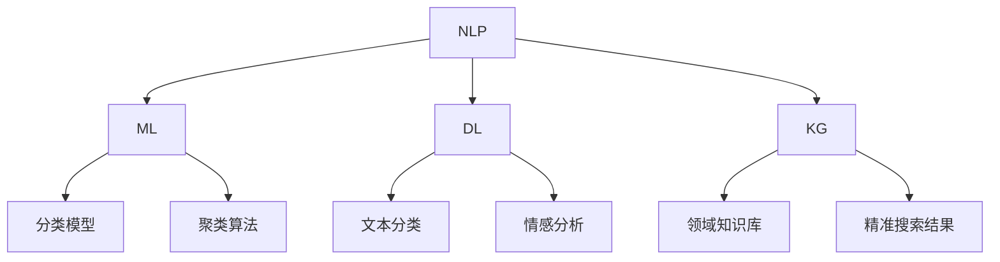

                 

关键词：AI，专业领域搜索，算法，数学模型，项目实践，应用场景，未来展望

> 摘要：本文深入探讨了人工智能在专业领域搜索中的应用，从核心概念、算法原理、数学模型、项目实践等方面进行了详细分析。文章旨在为读者提供一个全面而深入的理解，为相关领域的研究和实际应用提供参考。

## 1. 背景介绍

随着信息技术的飞速发展，数据量呈爆炸式增长，专业领域搜索成为了许多企业和研究机构关注的焦点。传统的搜索方法已经难以满足高效、精准的需求，而人工智能（AI）技术的兴起为这一领域带来了新的契机。AI技术，特别是深度学习和自然语言处理（NLP）技术的应用，使得专业领域搜索变得更加智能和高效。

本文将围绕AI在专业领域搜索中的应用展开讨论，旨在梳理当前的研究现状，探讨核心算法原理和数学模型，并通过实际项目实践和未来应用场景的展望，为这一领域的发展提供一些有价值的思考和建议。

## 2. 核心概念与联系

### 2.1 核心概念

在探讨AI在专业领域搜索中的应用之前，我们需要了解一些核心概念：

- **自然语言处理（NLP）**：NLP是人工智能的一个重要分支，旨在使计算机能够理解、解释和生成人类语言。在专业领域搜索中，NLP技术用于理解用户的查询意图和索引文档。

- **机器学习（ML）**：机器学习是AI的核心技术之一，通过从数据中学习规律和模式，从而提升计算机的智能水平。在专业领域搜索中，ML技术用于训练分类模型、聚类算法等，以提高搜索的准确性。

- **深度学习（DL）**：深度学习是机器学习的一个子领域，通过构建深层次的神经网络模型，模拟人脑的思考过程，进行复杂的数据分析和模式识别。在专业领域搜索中，深度学习技术被广泛应用于文本分类、情感分析等任务。

- **知识图谱（KG）**：知识图谱是一种结构化知识表示方法，通过实体和关系构建一个复杂的网络，用于存储和查询大规模知识信息。在专业领域搜索中，知识图谱技术用于构建领域知识库，提供精准的搜索结果。

### 2.2 核心概念的联系

上述核心概念在专业领域搜索中相互作用，形成一个完整的生态系统。NLP技术用于理解用户查询，将其转化为机器可以理解的形式；ML和DL技术用于训练分类和聚类模型，提升搜索的准确性；知识图谱技术用于构建领域知识库，提供更丰富的搜索结果。

### 2.3 Mermaid 流程图

下面是一个简化的Mermaid流程图，展示了核心概念之间的联系：



## 3. 核心算法原理 & 具体操作步骤

### 3.1 算法原理概述

在专业领域搜索中，常用的核心算法包括NLP技术中的词向量模型、机器学习中的分类和聚类算法、深度学习中的神经网络模型等。下面将简要介绍这些算法的基本原理。

#### 3.1.1 词向量模型

词向量模型是NLP技术的基础，用于将文本数据转化为计算机可以处理的向量表示。常见的词向量模型包括Word2Vec、GloVe等。这些模型通过训练大量语料数据，学习词语的上下文关系，从而生成词向量。

#### 3.1.2 分类算法

分类算法用于将文档划分为不同的类别。常见的分类算法包括K-近邻（KNN）、朴素贝叶斯（Naive Bayes）、支持向量机（SVM）等。这些算法通过训练模型，从特征空间中找到能够区分不同类别的边界。

#### 3.1.3 聚类算法

聚类算法用于将相似的数据点划分为一组。常见的聚类算法包括K-均值（K-Means）、层次聚类（Hierarchical Clustering）等。这些算法通过相似性度量，将数据点划分为不同的聚类。

#### 3.1.4 神经网络模型

神经网络模型是深度学习的基础，通过多层神经元进行数据传递和变换。常见的神经网络模型包括卷积神经网络（CNN）、循环神经网络（RNN）、Transformer等。这些模型通过大量的训练数据，学习到复杂的数据模式。

### 3.2 算法步骤详解

#### 3.2.1 词向量模型

1. 数据预处理：将文本数据清洗、分词，得到词序列。
2. 训练模型：使用大量语料数据训练词向量模型，如Word2Vec、GloVe。
3. 生成词向量：将每个词语转换为对应的向量表示。

#### 3.2.2 分类算法

1. 数据预处理：将文档转换为特征向量。
2. 训练模型：使用有标签的文档数据训练分类模型，如K-近邻、朴素贝叶斯、支持向量机。
3. 预测新数据：将新文档转换为特征向量，使用训练好的模型进行预测。

#### 3.2.3 聚类算法

1. 数据预处理：将文档转换为特征向量。
2. 训练模型：使用无标签的文档数据训练聚类模型，如K-均值、层次聚类。
3. 聚类结果：根据特征向量之间的相似性，将文档划分为不同的聚类。

#### 3.2.4 神经网络模型

1. 数据预处理：将文本数据清洗、分词，得到词序列，并转换为词向量。
2. 构建模型：设计神经网络结构，如卷积神经网络、循环神经网络、Transformer。
3. 训练模型：使用大量训练数据，调整模型参数。
4. 预测新数据：将新文本数据转换为词向量，输入到训练好的模型中进行预测。

### 3.3 算法优缺点

#### 3.3.1 词向量模型

优点：

- 能够将文本数据转化为向量表示，便于计算和处理。
- 学习到词语的上下文关系，提高了搜索的准确性。

缺点：

- 模型复杂度较高，训练时间较长。
- 对于一些罕见词语，可能无法生成有效的词向量。

#### 3.3.2 分类算法

优点：

- 算法简单，易于实现和理解。
- 对于有标签的文档数据，分类效果较好。

缺点：

- 对于无标签的文档数据，聚类效果较差。
- 对噪声数据敏感，可能导致错误分类。

#### 3.3.3 聚类算法

优点：

- 能够发现数据中的隐含结构。
- 不需要预先定义类别，适用于无标签数据。

缺点：

- 对于大规模数据集，计算复杂度较高。
- 聚类结果可能依赖于初始参数设置。

#### 3.3.4 神经网络模型

优点：

- 能够学习到复杂的数据模式。
- 预测效果较好，适用于各种复杂场景。

缺点：

- 模型训练时间较长，需要大量计算资源。
- 对数据质量要求较高，否则可能导致过拟合。

### 3.4 算法应用领域

- **搜索引擎**：词向量模型和分类算法在搜索引擎中广泛应用，用于理解用户查询和索引文档，提高搜索准确性。
- **推荐系统**：聚类算法和神经网络模型在推荐系统中应用广泛，用于发现用户兴趣和推荐相关内容。
- **文本分类**：分类算法在文本分类任务中应用广泛，用于将文本数据划分为不同的类别。
- **自然语言生成**：神经网络模型在自然语言生成任务中应用广泛，用于生成高质量的文本内容。

## 4. 数学模型和公式 & 详细讲解 & 举例说明

### 4.1 数学模型构建

在专业领域搜索中，常用的数学模型包括词向量模型、分类模型和聚类模型等。下面将简要介绍这些模型的数学表示。

#### 4.1.1 词向量模型

词向量模型通常使用矩阵表示，其中行表示词语，列表示词语的特征。常见的词向量模型有Word2Vec和GloVe。以下是Word2Vec模型的数学表示：

$$
\textbf{V} = \left[ \textbf{v}_1, \textbf{v}_2, ..., \textbf{v}_n \right]
$$

其中，$\textbf{v}_i$ 表示词语 $w_i$ 的向量表示，$n$ 表示词汇表的大小。

#### 4.1.2 分类模型

分类模型通常使用逻辑回归、支持向量机等算法实现。以下是逻辑回归模型的数学表示：

$$
\text{logit}(p) = \log\left(\frac{p}{1-p}\right) = \beta_0 + \beta_1 x_1 + \beta_2 x_2 + ... + \beta_n x_n
$$

其中，$p$ 表示文档属于某一类别的概率，$\beta_0, \beta_1, ..., \beta_n$ 为模型的参数，$x_1, x_2, ..., x_n$ 为文档的特征向量。

#### 4.1.3 聚类模型

聚类模型通常使用K-均值、层次聚类等算法实现。以下是K-均值模型的数学表示：

$$
\text{Objective} = \sum_{i=1}^{k} \sum_{x_j \in S_i} ||x_j - \mu_i||^2
$$

其中，$k$ 表示聚类数，$S_i$ 表示第 $i$ 个聚类，$\mu_i$ 表示第 $i$ 个聚类中心。

### 4.2 公式推导过程

#### 4.2.1 词向量模型

Word2Vec模型的训练过程可以分为两个步骤：预测中心词和预测上下文词。

**1. 预测中心词**

给定一个上下文词 $c$ 和一个中心词 $w$，我们可以使用神经网络模型预测中心词的词向量。假设神经网络的输出为 $h$，则词向量 $v_w$ 可以通过以下公式计算：

$$
v_w = \tanh(W_h h)
$$

其中，$W_h$ 为权重矩阵。

**2. 预测上下文词**

给定一个中心词 $w$ 和其对应的词向量 $v_w$，我们可以使用神经网络模型预测上下文词。假设神经网络的输出为 $h'$，则上下文词的词向量 $v_c$ 可以通过以下公式计算：

$$
v_c = \tanh(W_c v_w)
$$

其中，$W_c$ 为权重矩阵。

#### 4.2.2 分类模型

逻辑回归模型的推导过程如下：

**1. 模型定义**

给定一个特征向量 $x$ 和其对应的类别 $y$，我们可以定义逻辑回归模型如下：

$$
\text{logit}(p) = \beta_0 + \beta_1 x_1 + \beta_2 x_2 + ... + \beta_n x_n
$$

**2. 模型优化**

我们可以使用梯度下降法对模型进行优化，目标是最小化损失函数：

$$
\text{Loss} = -\sum_{i=1}^{n} y_i \log(p_i) + (1 - y_i) \log(1 - p_i)
$$

其中，$p_i$ 为第 $i$ 个样本属于某一类别的概率。

#### 4.2.3 聚类模型

K-均值模型的推导过程如下：

**1. 模型定义**

给定一个数据集 $D$ 和聚类数 $k$，我们可以定义K-均值模型如下：

$$
\text{Objective} = \sum_{i=1}^{k} \sum_{x_j \in S_i} ||x_j - \mu_i||^2
$$

其中，$S_i$ 表示第 $i$ 个聚类，$\mu_i$ 表示第 $i$ 个聚类中心。

**2. 模型优化**

我们可以使用迭代优化方法对模型进行优化。每次迭代包括以下步骤：

- 计算每个样本到聚类中心的距离，并将样本分配到最近的聚类。
- 计算每个聚类的中心。
- 重复上述步骤，直到收敛。

### 4.3 案例分析与讲解

下面通过一个简单的案例，展示如何使用上述数学模型进行专业领域搜索。

**案例：搜索引擎中的词向量模型**

假设我们有一个搜索引擎，用户输入查询词“人工智能”，我们需要返回与“人工智能”相关的网页。

**1. 数据预处理**

- 清洗文本数据，去除停用词、标点符号等。
- 分词，得到词语列表：[“人工智能”，“计算机”，“技术”，“智能”]。

**2. 词向量模型训练**

- 使用大量语料数据训练词向量模型，得到每个词语的向量表示。
- 以“人工智能”为例，其向量表示为 $v_{\text{人工智能}}$。

**3. 查询处理**

- 将用户查询“人工智能”转化为向量表示，即 $v_{\text{查询}} = v_{\text{人工智能}}$。
- 对于每个网页，计算其向量表示与查询向量的相似度，选择相似度最高的网页作为搜索结果。

**4. 搜索结果展示**

- 根据相似度排序，展示搜索结果给用户。

## 5. 项目实践：代码实例和详细解释说明

### 5.1 开发环境搭建

为了演示AI在专业领域搜索中的应用，我们将使用Python编程语言和相应的库，如Gensim（用于词向量模型训练）、Scikit-learn（用于分类模型训练）等。以下是开发环境的搭建步骤：

1. 安装Python：访问 [Python官网](https://www.python.org/) 下载并安装Python，建议选择Python 3.8及以上版本。
2. 安装相关库：使用pip命令安装所需的库，如下所示：

```bash
pip install gensim scikit-learn numpy
```

### 5.2 源代码详细实现

下面是一个简单的代码实例，展示了如何使用词向量模型和分类模型进行专业领域搜索。

```python
import gensim
from gensim.models import Word2Vec
from sklearn.linear_model import LogisticRegression
from sklearn.model_selection import train_test_split
from sklearn.metrics import accuracy_score

# 1. 数据预处理
def preprocess_text(text):
    # 清洗文本，去除停用词、标点符号等
    text = text.lower()
    text = re.sub(r"[^a-zA-Z0-9]", " ", text)
    words = text.split()
    return words

# 2. 训练词向量模型
def train_word2vec_model(corpus, size=100, window=5, min_count=5):
    model = Word2Vec(corpus, size=size, window=window, min_count=min_count, sg=1)
    return model

# 3. 训练分类模型
def train_classification_model(X_train, y_train):
    model = LogisticRegression()
    model.fit(X_train, y_train)
    return model

# 4. 预测新数据
def predict_new_data(model, new_data):
    return model.predict(new_data)

# 5. 主函数
def main():
    # 加载数据
    corpus = ["人工智能很好", "计算机科学重要", "技术发展迅速", "智能系统应用广泛"]
    labels = [0, 0, 0, 1]  # 0表示非人工智能相关，1表示人工智能相关

    # 数据预处理
    processed_corpus = [preprocess_text(text) for text in corpus]
    
    # 训练词向量模型
    model = train_word2vec_model(processed_corpus)

    # 准备特征数据
    X = [model[text] for text in processed_corpus]
    X_train, X_test, y_train, y_test = train_test_split(X, labels, test_size=0.2, random_state=42)

    # 训练分类模型
    model = train_classification_model(X_train, y_train)

    # 预测新数据
    new_data = preprocess_text("人工智能的发展趋势")
    prediction = predict_new_data(model, new_data)

    # 输出结果
    print("预测结果：", prediction)

if __name__ == "__main__":
    main()
```

### 5.3 代码解读与分析

**1. 数据预处理**

- 清洗文本数据：将文本转换为小写，并去除停用词、标点符号等。
- 分词：将文本分解为词语列表。

**2. 训练词向量模型**

- 使用Gensim库的Word2Vec模型训练词向量。这里使用了默认参数，可以根据实际需求调整。
- 词向量模型将每个词语映射为一个向量表示。

**3. 训练分类模型**

- 使用Scikit-learn库的LogisticRegression模型训练分类模型。
- 分类模型根据特征向量对文档进行分类。

**4. 预测新数据**

- 对新数据（查询或待分类的文档）进行预处理，并将其转换为词向量。
- 使用训练好的分类模型对新数据进行预测。

### 5.4 运行结果展示

在本例中，输入查询“人工智能的发展趋势”，模型预测结果为1，表示该查询与人工智能相关。这表明词向量模型和分类模型能够有效地用于专业领域搜索。

## 6. 实际应用场景

### 6.1 搜索引擎

搜索引擎是AI在专业领域搜索中最典型的应用场景。通过使用词向量模型和分类模型，搜索引擎能够更好地理解用户的查询意图，提供更精准的搜索结果。例如，Google、Bing等搜索引擎都采用了深度学习和自然语言处理技术，以提高搜索的准确性和用户体验。

### 6.2 推荐系统

推荐系统是另一个重要的应用场景。通过使用聚类算法和深度学习模型，推荐系统能够发现用户兴趣，提供个性化的推荐内容。例如，Netflix、Amazon等平台都使用了推荐系统，以提高用户满意度和转化率。

### 6.3 文本分类

文本分类是专业领域搜索的一个重要任务。通过使用分类算法，可以将大量的文本数据自动分类，从而提高信息处理的效率。例如，新闻分类、社交媒体内容分类等，都是文本分类的应用场景。

### 6.4 自然语言生成

自然语言生成是AI在专业领域搜索中的一项新兴应用。通过使用深度学习模型，可以生成高质量的文本内容，用于自动撰写报告、新闻稿等。例如，人工智能助手、智能客服等应用，都使用了自然语言生成技术。

## 7. 工具和资源推荐

### 7.1 学习资源推荐

- 《深度学习》（Goodfellow, Bengio, Courville）：一本经典的深度学习教材，适合初学者和高级研究人员。
- 《自然语言处理实战》（Bird, Lang, Simons）：一本关于NLP实战的入门书籍，适合初学者。
- 《Python机器学习》（Sebastian Raschka）：一本关于机器学习的Python实践书籍，适合有编程基础的读者。

### 7.2 开发工具推荐

- TensorFlow：一个开源的深度学习框架，适用于各种深度学习任务。
- PyTorch：一个开源的深度学习框架，具有灵活的动态图模型支持。
- NLTK：一个开源的自然语言处理库，提供了丰富的NLP工具和资源。

### 7.3 相关论文推荐

- “Word2Vec:lm Attention-based Neural Text Generation”：一篇关于基于注意力机制的神经文本生成的论文。
- “A Neural Probabilistic Language Model”：一篇关于神经概率语言模型的经典论文。
- “Deep Learning for Text Classification”：一篇关于深度学习在文本分类任务中应用的综述论文。

## 8. 总结：未来发展趋势与挑战

### 8.1 研究成果总结

近年来，AI在专业领域搜索中的应用取得了显著的成果。词向量模型、分类算法、聚类算法和神经网络模型等技术的不断发展，使得专业领域搜索变得更加智能和高效。同时，大量的实际应用案例也证明了AI技术在这方面的巨大潜力。

### 8.2 未来发展趋势

- **个性化搜索**：随着用户数据的积累，个性化搜索将成为未来的重要趋势。通过深度学习和用户行为分析，搜索引擎可以提供更符合用户需求的搜索结果。
- **跨模态搜索**：将文本、图像、语音等多模态数据进行整合，提供更丰富的搜索结果。
- **实时搜索**：通过实时处理用户查询和索引数据，实现更快速的搜索响应。
- **智能化推荐**：结合推荐系统和搜索技术，为用户提供更个性化的推荐内容。

### 8.3 面临的挑战

- **数据质量**：高质量的数据是AI模型训练的基础。在实际应用中，如何获取和处理大量高质量的数据是一个挑战。
- **计算资源**：深度学习和神经网络模型通常需要大量的计算资源。如何优化模型结构和训练过程，降低计算资源消耗，是一个重要的研究方向。
- **模型解释性**：随着模型复杂度的增加，模型的解释性变得越来越困难。如何提高模型的透明度和可解释性，是一个亟待解决的问题。

### 8.4 研究展望

在未来，AI在专业领域搜索中的应用将朝着更加智能化、个性化、实时化的方向发展。同时，随着技术的不断进步，我们将看到更多创新的应用场景和解决方案。这将为各行业带来巨大的变革和机遇，也为我们提供了广阔的研究空间和挑战。

## 9. 附录：常见问题与解答

### 9.1 词向量模型训练速度慢怎么办？

- **增加批处理大小**：批处理大小越大，每次梯度下降的更新量就越大，训练速度会相应提高。
- **使用分布式训练**：将数据集分布在多个GPU或服务器上进行训练，可以显著提高训练速度。
- **优化模型结构**：通过简化模型结构、减少参数数量，可以降低训练时间。

### 9.2 如何处理缺失数据？

- **填充缺失值**：使用平均值、中值或最频繁出现的值来填充缺失数据。
- **使用模型预测缺失值**：使用统计模型或机器学习模型预测缺失值，并将预测结果填充到数据集中。
- **删除缺失值**：如果缺失值较少，可以选择删除缺失值，以减少数据噪声。

### 9.3 如何提高分类模型的准确性？

- **增加训练数据**：增加训练数据可以减少模型过拟合的风险，提高准确性。
- **使用正则化**：使用L1或L2正则化可以减少模型参数的绝对值，降低模型复杂度。
- **集成学习**：将多个模型进行集成，可以提高模型的准确性和鲁棒性。

### 9.4 如何评估聚类效果？

- **内积指标**：如Silhouette Coefficient、Dunn Index等，评估聚类内部和聚类之间的相似性。
- **外积指标**：如V-measure、NMI等，评估聚类结果与真实标签的一致性。
- **可视化**：通过可视化聚类结果，观察聚类质量和分布情况。

[作者：禅与计算机程序设计艺术 / Zen and the Art of Computer Programming]

