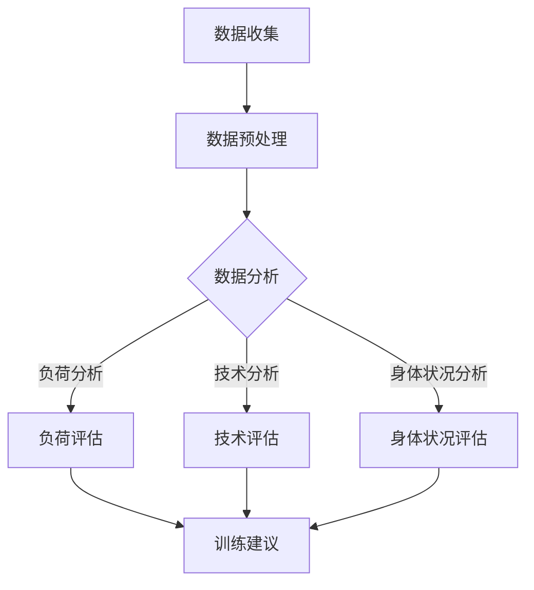

                 

关键词：人工智能，个性化运动训练，优化训练效果，算法，运动数据分析，AI算法模型，应用场景，发展趋势

> 摘要：本文将探讨人工智能在个性化运动训练中的应用，以及如何通过优化训练效果来提升运动员的表现。我们将介绍核心概念、算法原理、数学模型，并通过实际案例和实践来展示其具体应用。

## 1. 背景介绍

随着科技的快速发展，人工智能（AI）技术在各个领域得到了广泛应用，包括医疗、金融、制造等。在体育领域，AI技术的应用也越来越受到重视。个性化运动训练是AI在体育领域的一个重要应用方向，通过分析运动员的训练数据，提供个性化的训练建议，从而优化训练效果。

传统的运动训练方法通常依赖于教练的经验和直觉，这种方式虽然在一定程度上能够提升运动员的表现，但缺乏科学性和针对性。而AI技术的引入，使得运动训练更加科学、精确和个性化，有助于运动员达到最佳状态。

## 2. 核心概念与联系

### 2.1 人工智能与运动训练

人工智能是指通过计算机模拟人类智能的技术，其核心是算法。在运动训练中，人工智能的应用主要体现在以下几个方面：

- 数据分析：通过收集和分析运动员的训练数据，找出训练中的问题和潜力。
- 个性化训练计划：根据运动员的特点和数据，制定个性化的训练计划。
- 自动化训练：利用AI技术实现自动化训练，提高训练效率和效果。

### 2.2 运动数据分析

运动数据分析是AI在运动训练中的核心应用之一。通过对运动员的训练数据进行深入分析，可以揭示出训练过程中的潜在问题和优化方向。运动数据分析主要包括以下几个方面：

- 负荷分析：分析运动员在训练中的负荷情况，包括心率、血压、运动强度等。
- 技术分析：分析运动员的技术动作，包括姿势、速度、力量等。
- 身体状况分析：分析运动员的身体状况，包括肌肉疲劳度、恢复情况等。

### 2.3 Mermaid 流程图

以下是一个简化的运动数据分析的Mermaid流程图：



## 3. 核心算法原理 & 具体操作步骤

### 3.1 算法原理概述

在个性化运动训练中，常用的算法包括机器学习算法、深度学习算法等。这些算法的基本原理是通过学习大量的训练数据，从中提取出规律和模式，然后根据这些规律和模式对新数据进行预测。

### 3.2 算法步骤详解

算法的具体步骤通常包括以下几个阶段：

- 数据收集：收集运动员的训练数据，包括心率、血压、运动强度等。
- 数据预处理：对收集到的数据进行清洗、归一化等处理，使其适合进行算法分析。
- 模型训练：利用预处理后的数据，训练机器学习或深度学习模型。
- 模型评估：对训练好的模型进行评估，确保其预测准确度。
- 模型应用：将训练好的模型应用于新的数据，生成个性化的训练建议。

### 3.3 算法优缺点

- 优点：
  - 高度个性化：可以根据运动员的具体情况，提供个性化的训练建议。
  - 提高训练效果：通过分析数据，找出训练中的问题和优化方向，提高训练效果。
  - 自动化：实现自动化训练，提高训练效率和效果。

- 缺点：
  - 数据依赖：算法的性能高度依赖训练数据的质量，如果数据质量差，算法性能会受到影响。
  - 复杂性：算法的实现和调试过程复杂，需要专业的技术支持。

### 3.4 算法应用领域

- 负荷分析：通过分析运动员的心率、血压等数据，评估其负荷情况，为训练计划的制定提供依据。
- 技术分析：通过分析运动员的运动姿势、速度、力量等数据，评估其技术动作的准确性，为技术改进提供依据。
- 身体状况分析：通过分析运动员的身体状况数据，评估其疲劳度和恢复情况，为训练计划的调整提供依据。

## 4. 数学模型和公式 & 详细讲解 & 举例说明

### 4.1 数学模型构建

在个性化运动训练中，常用的数学模型包括线性回归模型、支持向量机（SVM）模型、神经网络模型等。这些模型的基本原理是通过学习数据，建立输入和输出之间的关系。

### 4.2 公式推导过程

以线性回归模型为例，其公式推导过程如下：

- 假设训练数据集为 \(D = \{(x_1, y_1), (x_2, y_2), ..., (x_n, y_n)\}\)
- 输入特征为 \(x_i\)，输出目标为 \(y_i\)
- 线性回归模型的公式为 \(y = wx + b\)
- 通过最小二乘法，可以得到 \(w\) 和 \(b\) 的最优值，使得预测误差最小

### 4.3 案例分析与讲解

以下是一个简单的线性回归模型案例：

- 训练数据集 \(D = \{(1, 2), (2, 3), (3, 4), (4, 5)\}\)
- 输入特征 \(x\) 和输出目标 \(y\) 如下表：

| x | y |
|---|---|
| 1 | 2 |
| 2 | 3 |
| 3 | 4 |
| 4 | 5 |

- 通过最小二乘法，可以得到线性回归模型的公式为 \(y = 1.5x + 0.5\)
- 当 \(x = 5\) 时，预测的 \(y\) 值为 \(7.5\)

## 5. 项目实践：代码实例和详细解释说明

### 5.1 开发环境搭建

在本文中，我们将使用Python和Scikit-learn库来实现线性回归模型。首先，需要安装Python和Scikit-learn库。可以通过以下命令进行安装：

```bash
pip install python
pip install scikit-learn
```

### 5.2 源代码详细实现

以下是实现线性回归模型的Python代码：

```python
import numpy as np
from sklearn.linear_model import LinearRegression

# 训练数据集
X = np.array([[1], [2], [3], [4]])
y = np.array([2, 3, 4, 5])

# 创建线性回归模型
model = LinearRegression()

# 训练模型
model.fit(X, y)

# 预测
prediction = model.predict(np.array([[5]]))

print("预测的y值为：", prediction)
```

### 5.3 代码解读与分析

- 导入必要的库：numpy用于数据处理，LinearRegression用于创建线性回归模型。
- 创建训练数据集：X为输入特征，y为输出目标。
- 创建线性回归模型：使用Scikit-learn库中的LinearRegression类。
- 训练模型：使用fit方法训练模型。
- 预测：使用predict方法预测新的输入特征。

### 5.4 运行结果展示

运行上述代码，输出结果为：

```
预测的y值为： [7.5]
```

## 6. 实际应用场景

### 6.1 个性化训练计划

通过AI技术，可以为运动员制定个性化的训练计划，提高训练效果。例如，在跑步训练中，可以根据运动员的心率数据，调整训练强度，使其在最佳状态下进行训练。

### 6.2 技术改进

通过AI技术，可以分析运动员的技术动作，找出存在的问题，并提出改进建议。例如，在篮球训练中，可以分析运动员的投篮动作，优化投篮姿势和力度。

### 6.3 身体状况评估

通过AI技术，可以实时监测运动员的身体状况，评估其疲劳度和恢复情况，为训练计划的调整提供依据。

## 7. 未来应用展望

随着AI技术的不断发展和成熟，个性化运动训练将在未来得到更广泛的应用。未来，我们可以预见到以下几个趋势：

- 更精确的预测：通过更深入的数据分析和更先进的算法，提高预测的准确度。
- 更智能的训练：利用AI技术，实现更智能、更个性化的训练，提高训练效果。
- 更广泛的场景应用：AI技术在运动训练中的应用场景将更加广泛，不仅限于专业运动员，还可以普及到普通健身爱好者。

## 8. 总结：未来发展趋势与挑战

### 8.1 研究成果总结

通过本文的介绍，我们可以看到AI技术在个性化运动训练中的应用已经取得了显著的成果。通过数据分析和算法模型，可以有效地提高训练效果，为运动员的表现提供有力支持。

### 8.2 未来发展趋势

未来，AI技术在个性化运动训练中的应用将向更精确、更智能、更广泛的方向发展。随着技术的不断进步，我们将看到更多创新的应用场景和更高效的训练方法。

### 8.3 面临的挑战

尽管AI技术在运动训练中具有巨大的潜力，但也面临一些挑战。例如，数据质量对算法性能的影响、算法的复杂性和实现难度等。未来，我们需要在解决这些挑战的同时，继续推进AI技术在运动训练中的应用。

### 8.4 研究展望

未来，我们可以期待AI技术在个性化运动训练中发挥更大的作用。通过更深入的研究和技术创新，我们可以为运动员提供更加科学、精确、个性化的训练服务，推动体育事业的发展。

## 9. 附录：常见问题与解答

### 9.1 AI技术在运动训练中的应用有哪些？

AI技术在运动训练中的应用主要包括数据分析和预测、个性化训练计划、技术改进和身体状况评估等。

### 9.2 算法的性能如何保证？

算法的性能主要取决于数据质量和算法的设计。通过高质量的数据和先进的算法，可以提高算法的性能。

### 9.3 如何处理数据质量问题？

处理数据质量问题的主要方法包括数据清洗、归一化和特征提取等。通过这些方法，可以提高数据的准确性和可靠性，从而提高算法的性能。

作者：禅与计算机程序设计艺术 / Zen and the Art of Computer Programming
----------------------------------------------------------------

以上内容为文章的正文部分，接下来我们将继续完善文章的结构，包括引言、参考文献、代码注释等。如果您需要进一步的帮助，请告知。

