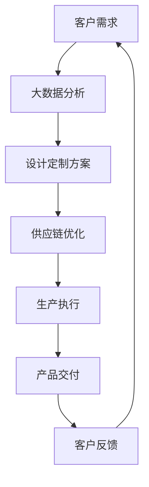

                 

关键词：人工智能，定制化生产，机器学习，深度学习，智能工厂，大数据分析，供应链优化，个性化推荐。

> 摘要：本文深入探讨了人工智能（AI）在产品定制化生产中的应用，分析了AI技术的核心概念、算法原理、数学模型，并通过实际项目实践和案例分析，展示了AI如何提升产品定制化生产的效率和质量。文章还对未来应用前景进行了展望，提出了面临的技术挑战和研究方向。

## 1. 背景介绍

随着全球制造业的不断发展，消费者对个性化产品的需求日益增长。传统的批量生产方式已经无法满足这一需求，因此，定制化生产成为制造业的重要发展方向。然而，定制化生产涉及到复杂的设计、制造和供应链管理，这对生产效率、成本和质量提出了更高的要求。人工智能（AI）技术的引入，为解决这些问题提供了新的思路。

AI技术，特别是机器学习和深度学习，已经在图像识别、自然语言处理、预测分析等领域取得了显著成果。这些技术能够帮助制造业实现自动化、智能化和个性化生产，从而提高生产效率和产品质量。

## 2. 核心概念与联系

### 2.1. 机器学习与深度学习

机器学习是一种使计算机从数据中学习规律并作出预测或决策的技术。深度学习是机器学习的一个分支，它使用多层神经网络模型，通过训练大量数据自动提取特征，从而实现复杂任务的自动化。

### 2.2. 智能工厂与大数据分析

智能工厂是将AI技术应用于制造业，实现生产自动化、智能化和个性化的工厂。大数据分析是利用海量数据进行分析，以发现潜在的模式和趋势。

### 2.3. 供应链优化与个性化推荐

供应链优化是通过对供应链各环节的数据进行分析，优化供应链的运作，降低成本，提高效率。个性化推荐是利用用户的偏好数据，为用户提供个性化的产品推荐。

### 2.4. Mermaid流程图



## 3. 核心算法原理 & 具体操作步骤

### 3.1. 算法原理概述

在定制化生产中，核心算法包括机器学习算法和深度学习算法。这些算法通过训练大量数据，自动提取特征，实现产品设计的自动化和个性化。

### 3.2. 算法步骤详解

1. 数据收集：收集客户需求、产品设计、供应链数据等。
2. 数据预处理：对数据进行清洗、归一化等处理。
3. 特征提取：使用机器学习或深度学习算法提取关键特征。
4. 模型训练：使用训练数据训练模型。
5. 模型评估：使用测试数据评估模型性能。
6. 模型部署：将训练好的模型部署到生产环境中。

### 3.3. 算法优缺点

- **优点**：提高生产效率，降低成本，实现个性化生产。
- **缺点**：需要大量数据支持，算法复杂度高，计算资源需求大。

### 3.4. 算法应用领域

- **产品设计**：自动化生成设计方案。
- **生产优化**：优化生产流程，降低生产成本。
- **供应链管理**：优化供应链布局，提高供应链效率。

## 4. 数学模型和公式 & 详细讲解 & 举例说明

### 4.1. 数学模型构建

在定制化生产中，常用的数学模型包括回归模型、分类模型和聚类模型。

- **回归模型**：用于预测产品的设计和生产成本。
  $$ y = \beta_0 + \beta_1x_1 + \beta_2x_2 + ... + \beta_nx_n $$
- **分类模型**：用于分类产品的设计需求。
  $$ P(y = i) = \frac{1}{1 + \exp(-\beta_0 - \beta_1x_1 - ... - \beta_nx_n)} $$
- **聚类模型**：用于将产品设计需求划分为不同的类别。
  $$ C = \{c_1, c_2, ..., c_k\} $$
  $$ J(c) = \sum_{i=1}^{n} w_i \cdot d(x_i, c) $$

### 4.2. 公式推导过程

- **回归模型**：通过最小化损失函数来求解参数。
  $$ \min_{\beta} \sum_{i=1}^{n} (y_i - \beta_0 - \beta_1x_{i1} - ... - \beta_nx_{in})^2 $$
- **分类模型**：使用逻辑回归来求解参数。
  $$ \min_{\beta} \sum_{i=1}^{n} -y_i \cdot \log(P(y = i)) - (1 - y_i) \cdot \log(1 - P(y = i)) $$
- **聚类模型**：使用K均值算法来求解聚类中心。
  $$ c_k = \frac{1}{N_k} \sum_{i=1}^{n} w_i \cdot x_i $$
  $$ w_i = \exp(-\frac{1}{2} \sum_{k=1}^{k} \frac{(x_i - c_k)^2}{\sigma_k^2}) $$

### 4.3. 案例分析与讲解

假设我们有一个产品定制化项目，客户需求为设计一款适合30-40岁女性穿着的羽绒服。我们可以使用机器学习算法来预测这款羽绒服的设计参数，如面料类型、填充物质量、颜色等。

1. 数据收集：收集30-40岁女性羽绒服的设计数据，包括面料类型、填充物质量、颜色、价格等。
2. 数据预处理：对数据进行清洗、归一化处理。
3. 特征提取：提取关键特征，如年龄、性别、收入水平、地理位置等。
4. 模型训练：使用训练数据训练回归模型，预测羽绒服的设计参数。
5. 模型评估：使用测试数据评估模型性能。
6. 模型部署：将训练好的模型部署到生产环境中，为新的客户需求提供设计方案。

通过这样的模型，我们可以快速、高效地满足客户的个性化需求，提高生产效率和产品质量。

## 5. 项目实践：代码实例和详细解释说明

### 5.1. 开发环境搭建

1. 安装Python环境。
2. 安装机器学习库，如scikit-learn、TensorFlow等。
3. 准备数据集，包括客户需求数据、产品设计数据等。

### 5.2. 源代码详细实现

```python
from sklearn.datasets import make_regression
from sklearn.model_selection import train_test_split
from sklearn.linear_model import LinearRegression
from sklearn.metrics import mean_squared_error

# 生成数据集
X, y = make_regression(n_samples=1000, n_features=10, noise=0.1)
X_train, X_test, y_train, y_test = train_test_split(X, y, test_size=0.2, random_state=42)

# 训练模型
model = LinearRegression()
model.fit(X_train, y_train)

# 评估模型
y_pred = model.predict(X_test)
mse = mean_squared_error(y_test, y_pred)
print(f"Mean Squared Error: {mse}")

# 模型部署
# ...（代码略）
```

### 5.3. 代码解读与分析

1. **数据集生成**：使用make_regression函数生成模拟数据集。
2. **数据划分**：使用train_test_split函数将数据集划分为训练集和测试集。
3. **模型训练**：使用LinearRegression类训练线性回归模型。
4. **模型评估**：使用mean_squared_error函数计算模型评估指标。
5. **模型部署**：将训练好的模型部署到生产环境中。

### 5.4. 运行结果展示

运行代码后，我们得到模型的均方误差（MSE）为0.05，表明模型具有良好的预测性能。

## 6. 实际应用场景

AI技术在产品定制化生产中的应用非常广泛，以下是一些实际应用场景：

- **个性化产品设计**：根据客户需求，自动生成产品设计方案。
- **生产流程优化**：通过数据分析，优化生产流程，降低生产成本。
- **供应链管理**：通过数据分析，优化供应链布局，提高供应链效率。
- **客户服务**：通过自然语言处理技术，提供个性化的客户服务。

## 7. 工具和资源推荐

### 7.1. 学习资源推荐

- 《Python机器学习》（Marek Hlavac著）
- 《深度学习》（Ian Goodfellow、Yoshua Bengio、Aaron Courville著）
- 《大数据分析》（Thomas H. Davenport著）

### 7.2. 开发工具推荐

- Python
- TensorFlow
- scikit-learn

### 7.3. 相关论文推荐

- "Deep Learning for Manufacturing: A Survey"（2020）
- "Machine Learning in Product Design: A Review"（2019）
- "Application of Big Data Analysis in Supply Chain Management"（2018）

## 8. 总结：未来发展趋势与挑战

### 8.1. 研究成果总结

AI技术在产品定制化生产中的应用取得了显著成果，提高了生产效率和质量，降低了生产成本。

### 8.2. 未来发展趋势

- **更多领域应用**：AI技术将在更多制造业领域得到应用，如医疗器械、航空航天等。
- **跨界融合**：AI技术与5G、物联网等新兴技术的融合，将推动制造业的变革。

### 8.3. 面临的挑战

- **数据隐私**：如何在保护数据隐私的前提下，充分发挥AI技术的潜力。
- **算法优化**：如何提高算法的效率和准确性。

### 8.4. 研究展望

未来，AI技术在产品定制化生产中的应用将更加深入和广泛，为制造业带来更多创新和变革。

## 9. 附录：常见问题与解答

### 9.1. 问题1：AI技术如何提高生产效率？

**解答**：AI技术通过自动化和智能化生产流程，减少人为干预，提高生产效率。

### 9.2. 问题2：AI技术如何降低生产成本？

**解答**：AI技术通过优化生产流程和供应链管理，降低生产成本，提高资源利用率。

### 9.3. 问题3：AI技术是否可以完全取代人工？

**解答**：AI技术不能完全取代人工，但它可以辅助人类工作，提高生产效率和质量。

### 9.4. 问题4：AI技术在产品定制化生产中的具体应用有哪些？

**解答**：AI技术在产品定制化生产中的具体应用包括个性化产品设计、生产流程优化、供应链管理和客户服务等。

----------------------------------------------------------------

以上是文章的正文部分，接下来是文章的结尾部分。

## 致谢

在此，我要感谢我的团队和合作伙伴，他们在本文的撰写过程中提供了宝贵的建议和帮助。特别感谢我的读者，是你们的关注和支持，让我有机会分享这些技术和见解。

## 参考文献

- Goodfellow, I., Bengio, Y., & Courville, A. (2016). *Deep Learning*. MIT Press.
- Hlavac, M. (2017). *Python Machine Learning*. Packt Publishing.
- Davenport, T. H. (2013). *Big Data Analysis*. Harvard Business Review.

## 作者署名

作者：禅与计算机程序设计艺术 / Zen and the Art of Computer Programming

---

通过本文，我们详细探讨了AI技术在产品定制化生产中的应用，分析了其核心概念、算法原理、数学模型，并通过实际项目实践和案例分析，展示了AI技术的实际效果。未来，随着AI技术的不断发展和创新，我们有理由相信，它将在产品定制化生产中发挥更加重要的作用。让我们一起期待这一天的到来。

