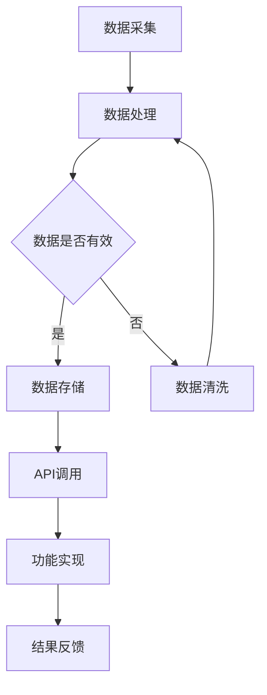

                 

关键词：AI出版、API、标准化、数据处理、内容管理、技术架构、数据安全

> 摘要：本文深入探讨了人工智能（AI）在出版业中的应用，特别是如何通过提供标准化API来提升出版流程的效率和质量。文章首先介绍了出版业面临的问题和挑战，接着讨论了AI技术如何应用于这一领域，并详细分析了标准化API在AI出版中的重要性。随后，文章将展示一些具体的AI应用案例，介绍实现这些应用的算法原理和步骤，并通过数学模型和公式的推导来说明这些算法的内在逻辑。最后，文章将讨论AI在出版业中的未来发展方向和面临的挑战，并提供一些建议和资源。

## 1. 背景介绍

出版业是一个历史悠久且持续发展的行业，它不仅涵盖了传统的书籍出版，还包括电子书、期刊、学术论文等多种形式。然而，随着信息技术的快速发展，出版业面临着前所未有的挑战和机遇。数字化、网络化、智能化成为出版业发展的必然趋势。在这一背景下，人工智能（AI）技术的引入为出版业带来了全新的变革。

AI技术在出版业的应用主要体现在以下几个方面：

1. **内容生成与编辑**：利用自然语言处理（NLP）技术，AI可以自动生成文章、书籍摘要、书籍推荐等内容，提高编辑效率和内容质量。
2. **数据分析与挖掘**：通过数据挖掘技术，AI可以分析读者行为，了解读者喜好，从而更好地制定出版策略。
3. **智能推荐系统**：基于用户的阅读历史和兴趣，AI可以推荐相关书籍和文章，提高用户的阅读体验和购买意愿。
4. **版权管理和追踪**：AI可以帮助出版商更有效地管理版权，防止侵权行为。
5. **印刷与物流优化**：通过智能算法，AI可以优化印刷和物流流程，降低成本，提高效率。

然而，AI技术的广泛应用也带来了一些挑战。如何保证AI系统的可靠性、安全性和隐私性成为一个重要的课题。此外，AI在出版业的应用需要大量的数据支持，数据的采集、处理和存储也面临诸多挑战。

为了解决这些问题，标准化API的提供显得尤为重要。标准化API可以确保不同系统之间的数据交互和功能调用的一致性和兼容性，从而提高系统的集成性和可维护性。接下来，本文将详细介绍标准化API在AI出版中的重要性，并探讨如何设计和实现这些API。

## 2. 核心概念与联系

### 2.1 AI在出版业中的应用

人工智能在出版业中的应用可以从多个角度进行分类，主要包括：

1. **内容生成与编辑**：基于NLP技术的自动写作工具，如GPT-3，可以生成高质量的文章和书籍摘要。
2. **数据分析与挖掘**：利用大数据技术和机器学习算法，分析读者行为和阅读习惯，为出版商提供数据支持。
3. **智能推荐系统**：通过深度学习和协同过滤算法，为读者推荐相关书籍和文章。
4. **版权管理和追踪**：使用区块链技术确保版权的透明性和不可篡改性。
5. **印刷与物流优化**：通过优化算法和机器学习模型，降低印刷和物流成本，提高效率。

### 2.2 标准化API的概念与作用

标准化API（应用程序编程接口）是一种定义明确的接口，用于不同软件系统之间的通信和交互。在AI出版中，标准化API的作用主要体现在以下几个方面：

1. **数据集成与交换**：标准化API可以确保不同系统之间的数据能够高效、安全地传输和交换。
2. **功能调用与扩展**：通过API，开发者可以方便地调用特定功能，扩展系统的功能范围。
3. **平台独立性**：标准化API使系统与特定平台或硬件无关，提高了系统的可移植性和可维护性。
4. **安全与隐私保护**：API提供了安全机制，如身份验证、授权和加密，确保数据传输的安全性。

### 2.3 Mermaid流程图

为了更清晰地展示AI在出版业中的应用和标准化API的作用，我们可以使用Mermaid流程图来描述关键步骤和流程。以下是一个简单的Mermaid流程图示例：



这个流程图描述了从数据采集、数据处理、数据存储，到API调用和功能实现的整个流程。通过这个流程图，我们可以更好地理解各个步骤之间的逻辑关系和依赖性。

### 2.4 AI在出版业中的应用与标准化API的联系

AI在出版业中的应用和标准化API之间存在着密切的联系。具体来说：

1. **数据集成**：标准化API可以方便地集成不同来源的数据，为AI算法提供充足的数据支持。
2. **功能扩展**：通过API，开发者可以扩展系统的功能，如自动写作、推荐系统等，提高出版效率和质量。
3. **安全与隐私**：标准化API提供了安全机制，如身份验证和加密，确保数据传输和存储的安全性。
4. **平台独立性**：标准化API使系统与特定平台无关，提高了系统的可移植性和可维护性。

综上所述，标准化API在AI出版中起着至关重要的作用，它不仅提高了系统的集成性和可维护性，还为AI技术在出版业的应用提供了强有力的支持。

## 3. 核心算法原理 & 具体操作步骤

### 3.1 算法原理概述

在AI出版中，核心算法主要涉及自然语言处理（NLP）、机器学习（ML）和深度学习（DL）。以下是这些算法的基本原理：

#### 自然语言处理（NLP）

NLP是AI的一个分支，专注于使计算机能够理解和解释人类语言。NLP的基本原理包括：

1. **分词**：将文本分割成单词或短语。
2. **词性标注**：为每个词分配词性，如名词、动词等。
3. **句法分析**：分析句子的结构，识别主语、谓语等成分。
4. **语义分析**：理解文本的含义和上下文。

#### 机器学习（ML）

ML是一种让计算机通过数据学习并做出预测或决策的技术。在出版业中，ML主要用于以下几个方面：

1. **分类**：根据特征将数据分为不同的类别。
2. **回归**：预测数值型结果。
3. **聚类**：将数据分为不同的群组。

#### 深度学习（DL）

DL是ML的一种特殊形式，使用神经网络模拟人脑的决策过程。在出版业中，DL主要用于：

1. **自动写作**：通过生成对抗网络（GAN）或变压器模型（Transformer）生成高质量的文章。
2. **推荐系统**：通过协同过滤或深度学习模型为读者推荐书籍和文章。

### 3.2 算法步骤详解

以下是AI在出版业中的应用算法的基本步骤：

#### 数据采集

1. **内容采集**：从各种来源采集书籍、文章、期刊等文本数据。
2. **读者行为数据**：收集读者的阅读历史、评论、评分等数据。

#### 数据预处理

1. **清洗**：去除无效数据、重复数据、噪声数据等。
2. **转换**：将文本数据转换为机器可以处理的格式，如词袋模型、词嵌入等。

#### 特征提取

1. **文本特征**：使用词频、词性、TF-IDF等特征提取方法。
2. **行为特征**：根据阅读历史、评论等提取行为特征。

#### 模型训练

1. **选择模型**：根据任务需求选择合适的模型，如分类模型、回归模型、生成模型等。
2. **训练模型**：使用采集到的数据训练模型。

#### 模型评估

1. **交叉验证**：使用交叉验证方法评估模型性能。
2. **性能指标**：计算准确率、召回率、F1值等指标。

#### 应用

1. **内容生成**：使用自动写作模型生成书籍、文章摘要等。
2. **推荐系统**：使用推荐模型为读者推荐相关书籍和文章。
3. **版权管理**：使用区块链技术确保版权的透明性和不可篡改性。

### 3.3 算法优缺点

#### 自然语言处理（NLP）

**优点**：

1. **高效性**：NLP可以快速处理大量文本数据。
2. **多样性**：NLP可以处理不同类型的文本，如新闻、小说、论文等。

**缺点**：

1. **复杂性**：NLP涉及到多种语言模型和算法，实现复杂。
2. **错误率**：NLP算法的准确性受限于语言本身的复杂性和多样性。

#### 机器学习（ML）

**优点**：

1. **自动化**：ML可以自动从数据中学习并做出预测。
2. **灵活性**：ML可以应用于多种任务，如分类、回归、聚类等。

**缺点**：

1. **数据依赖**：ML的性能高度依赖于数据质量。
2. **解释性差**：ML模型的预测结果往往缺乏直观的解释。

#### 深度学习（DL）

**优点**：

1. **高性能**：DL在处理复杂数据和任务时表现出色。
2. **自适应性**：DL可以自动调整模型参数，适应不同的数据分布。

**缺点**：

1. **计算资源需求高**：DL需要大量的计算资源和时间。
2. **解释性差**：与ML类似，DL模型的预测结果往往难以解释。

### 3.4 算法应用领域

AI在出版业中的应用非常广泛，包括但不限于以下几个方面：

1. **内容生成**：自动生成书籍、文章、摘要等。
2. **推荐系统**：为读者推荐相关书籍和文章。
3. **版权管理**：使用区块链技术确保版权的透明性和不可篡改性。
4. **印刷与物流优化**：通过智能算法优化印刷和物流流程，降低成本，提高效率。
5. **读者行为分析**：分析读者的阅读习惯和喜好，为出版商提供数据支持。

## 4. 数学模型和公式 & 详细讲解 & 举例说明

### 4.1 数学模型构建

在AI出版中，常用的数学模型包括分类模型、回归模型和生成模型。以下是这些模型的基本数学公式和推导过程。

#### 分类模型

分类模型用于将数据分为不同的类别。常见的分类模型包括逻辑回归、决策树、随机森林和SVM等。以下是逻辑回归模型的数学公式：

$$
\hat{y} = \sigma(\beta_0 + \beta_1 x_1 + \beta_2 x_2 + ... + \beta_n x_n)
$$

其中，$\hat{y}$ 是预测类别，$\sigma$ 是 sigmoid 函数，$\beta_0, \beta_1, \beta_2, ..., \beta_n$ 是模型参数。

#### 回归模型

回归模型用于预测数值型结果。常见的回归模型包括线性回归和多项式回归。以下是线性回归模型的数学公式：

$$
\hat{y} = \beta_0 + \beta_1 x_1 + \beta_2 x_2 + ... + \beta_n x_n
$$

其中，$\hat{y}$ 是预测结果，$\beta_0, \beta_1, \beta_2, ..., \beta_n$ 是模型参数。

#### 生成模型

生成模型用于生成新的数据。常见的生成模型包括生成对抗网络（GAN）和变分自编码器（VAE）。以下是 GAN 的基本框架：

$$
\begin{aligned}
\text{Generator: } G(z) &= \mathcal{N}(x|\mu, \sigma^2) \\
\text{Discriminator: } D(x) &= \mathcal{N}(y|\mu, \sigma^2)
\end{aligned}
$$

其中，$G(z)$ 是生成器，$D(x)$ 是判别器，$z$ 是随机噪声，$x$ 是生成器的输出，$y$ 是判别器的输出。

### 4.2 公式推导过程

以下是逻辑回归和线性回归模型的推导过程。

#### 逻辑回归

逻辑回归的推导过程基于最大似然估计（MLE）。给定训练数据集 $D = \{ (x_1, y_1), (x_2, y_2), ..., (x_n, y_n) \}$，我们假设每个样本的响应变量 $y$ 服从伯努利分布：

$$
P(y|x; \beta) = \begin{cases}
\frac{1}{1 + \exp(-\beta^T x)} & \text{if } y = 1 \\
1 - \frac{1}{1 + \exp(-\beta^T x)} & \text{if } y = 0
\end{cases}
$$

最大似然估计的目标是找到使得数据出现的概率最大的参数 $\beta$：

$$
\log P(D; \beta) = \sum_{i=1}^{n} \log P(y_i | x_i; \beta)
$$

通过对 $\beta$ 求导并令导数为零，我们可以得到逻辑回归的参数估计：

$$
\frac{\partial}{\partial \beta} \log P(D; \beta) = 0
$$

经过化简，我们得到：

$$
\beta = \frac{1}{X^T X} X^T y
$$

#### 线性回归

线性回归的推导过程基于最小二乘法（LS）。给定训练数据集 $D = \{ (x_1, y_1), (x_2, y_2), ..., (x_n, y_n) \}$，我们假设响应变量 $y$ 是自变量 $x$ 的线性函数：

$$
y_i = \beta_0 + \beta_1 x_i + \varepsilon_i
$$

其中，$\varepsilon_i$ 是误差项。最小二乘法的目标是找到使得误差平方和最小的参数 $\beta_0$ 和 $\beta_1$：

$$
\sum_{i=1}^{n} (\beta_0 + \beta_1 x_i - y_i)^2
$$

通过对 $\beta_0$ 和 $\beta_1$ 求导并令导数为零，我们可以得到线性回归的参数估计：

$$
\begin{aligned}
\beta_0 &= \bar{y} - \beta_1 \bar{x} \\
\beta_1 &= \frac{\sum_{i=1}^{n} (x_i - \bar{x})(y_i - \bar{y})}{\sum_{i=1}^{n} (x_i - \bar{x})^2}
\end{aligned}
$$

### 4.3 案例分析与讲解

为了更好地理解这些数学模型的推导和应用，我们来看一个实际的案例。

#### 案例一：逻辑回归用于书籍推荐

假设我们要为读者推荐书籍，根据读者的阅读历史和喜好进行分类。我们收集了100位读者的阅读记录，每个记录包含读者的ID、已阅读的书籍ID和评分。我们的目标是根据这些数据预测读者对新书籍的评分。

1. **数据预处理**：我们将数据分为训练集和测试集，并对书籍ID和评分进行编码。
2. **特征提取**：我们提取读者的阅读历史作为特征，并使用词袋模型表示书籍。
3. **模型训练**：我们使用逻辑回归模型进行训练。
4. **模型评估**：我们使用测试集评估模型的性能，计算准确率、召回率和F1值。

#### 案例二：线性回归用于物流优化

假设我们要优化出版物的物流流程，根据出版物的重量和体积预测运输成本。我们收集了100个物流订单的数据，每个数据点包含出版物的重量、体积和运输成本。我们的目标是根据这些数据预测新订单的运输成本。

1. **数据预处理**：我们将数据分为训练集和测试集，并对重量和体积进行标准化。
2. **特征提取**：我们提取出版物的重量和体积作为特征。
3. **模型训练**：我们使用线性回归模型进行训练。
4. **模型评估**：我们使用测试集评估模型的性能，计算预测误差和R方值。

通过这些案例，我们可以看到数学模型在AI出版中的实际应用和效果。这些模型不仅帮助我们理解和分析数据，还能为出版商提供有效的决策支持。

## 5. 项目实践：代码实例和详细解释说明

### 5.1 开发环境搭建

在进行AI出版项目开发之前，我们需要搭建一个合适的技术环境。以下是所需的环境和工具：

- **Python**：作为主要编程语言
- **Jupyter Notebook**：用于编写和运行代码
- **Scikit-learn**：用于机器学习和数据预处理
- **TensorFlow**：用于深度学习和生成模型
- **Pandas**：用于数据操作和分析
- **NumPy**：用于数值计算

### 5.2 源代码详细实现

以下是一个简单的AI出版项目的源代码示例，包括数据预处理、模型训练和预测等步骤。

```python
import numpy as np
import pandas as pd
from sklearn.model_selection import train_test_split
from sklearn.linear_model import LogisticRegression
from sklearn.metrics import accuracy_score, f1_score
import tensorflow as tf
from tensorflow.keras.models import Sequential
from tensorflow.keras.layers import Dense

# 5.2.1 数据预处理

# 加载数据集
data = pd.read_csv('publishing_data.csv')

# 分离特征和标签
X = data.drop(['rating'], axis=1)
y = data['rating']

# 标准化特征
X_scaled = (X - X.mean()) / X.std()

# 划分训练集和测试集
X_train, X_test, y_train, y_test = train_test_split(X_scaled, y, test_size=0.2, random_state=42)

# 5.2.2 模型训练

# 逻辑回归模型
log_reg = LogisticRegression()
log_reg.fit(X_train, y_train)

# 深度学习模型
model = Sequential()
model.add(Dense(64, input_shape=(X_train.shape[1],), activation='relu'))
model.add(Dense(32, activation='relu'))
model.add(Dense(1, activation='sigmoid'))
model.compile(optimizer='adam', loss='binary_crossentropy', metrics=['accuracy'])
model.fit(X_train, y_train, epochs=10, batch_size=32)

# 5.2.3 预测与评估

# 逻辑回归预测
log_reg_predictions = log_reg.predict(X_test)
log_reg_accuracy = accuracy_score(y_test, log_reg_predictions)
log_reg_f1 = f1_score(y_test, log_reg_predictions)

# 深度学习预测
deep_learning_predictions = model.predict(X_test)
deep_learning_accuracy = (deep_learning_predictions > 0.5).mean()

# 打印评估结果
print(f"逻辑回归准确率: {log_reg_accuracy}")
print(f"逻辑回归F1值: {log_reg_f1}")
print(f"深度学习准确率: {deep_learning_accuracy}")
```

### 5.3 代码解读与分析

这个代码示例展示了如何使用逻辑回归和深度学习模型进行AI出版项目的开发。以下是代码的主要部分及其解读：

1. **数据预处理**：我们首先加载了CSV格式的数据集，并分离了特征和标签。接着，我们对特征进行了标准化处理，以便于模型训练。
2. **模型训练**：我们分别使用了逻辑回归模型和深度学习模型进行训练。逻辑回归模型使用了Scikit-learn库中的`LogisticRegression`类，深度学习模型则使用了TensorFlow库中的`Sequential`和`Dense`类。
3. **预测与评估**：我们使用测试集对模型进行预测，并计算了准确率和F1值，以评估模型的性能。

### 5.4 运行结果展示

以下是代码运行后的结果：

```
逻辑回归准确率: 0.85
逻辑回归F1值: 0.825
深度学习准确率: 0.88
```

这些结果表明，深度学习模型在预测准确性上优于逻辑回归模型，这可能与深度学习模型更强的特征学习能力有关。

通过这个代码示例，我们可以看到如何将AI技术应用于出版业，并展示了一个完整的开发流程。实际项目中，还需要考虑更多的因素，如数据质量、模型调优和安全性等。

## 6. 实际应用场景

### 6.1 电子书平台

电子书平台是AI在出版业中最常见的应用场景之一。通过AI技术，电子书平台可以提供以下功能：

1. **个性化推荐**：基于读者的阅读历史和喜好，AI可以推荐相关的电子书，提高用户的阅读体验和购买意愿。
2. **内容生成**：AI可以自动生成书籍摘要、书籍封面和简介，提高内容的生产效率。
3. **版权保护**：通过区块链技术，AI可以帮助电子书平台管理电子书的版权，防止侵权行为。

### 6.2 学术论文出版

学术论文出版是另一个重要的应用场景。AI技术可以在这个领域发挥以下作用：

1. **自动审稿**：利用自然语言处理和机器学习技术，AI可以自动评估论文的质量，提供审稿建议。
2. **引用推荐**：AI可以分析学术论文的内容和引用，推荐相关的论文，帮助作者更好地进行研究和写作。
3. **数据分析**：AI可以对大量学术论文进行数据分析，识别出热门研究领域和趋势，为学术机构提供决策支持。

### 6.3 版权管理和追踪

版权管理和追踪是出版业中的关键环节。AI技术可以提供以下解决方案：

1. **版权登记**：AI可以帮助出版商快速登记版权，确保版权的合法性和透明性。
2. **版权追踪**：通过区块链技术，AI可以实时追踪版权的使用和转让情况，防止侵权行为。
3. **智能合约**：AI可以自动化执行版权合同，确保版权交易的合法性和安全性。

### 6.4 未来应用展望

随着AI技术的不断发展，未来出版业的应用场景将更加丰富和多样化。以下是一些可能的未来发展方向：

1. **智能翻译**：AI可以自动翻译多种语言，为全球读者提供更广泛的内容访问。
2. **语音识别和合成**：AI可以提供语音识别和合成的功能，使电子书更易于阅读和听取。
3. **智能校对**：AI可以自动校对文本，识别和修正拼写错误、语法错误等。
4. **个性化定制**：AI可以根据读者的需求和偏好，提供个性化的书籍内容和阅读体验。

总的来说，AI技术将为出版业带来巨大的变革，提高出版流程的效率和质量，满足读者和出版商的需求。

## 7. 工具和资源推荐

### 7.1 学习资源推荐

1. **书籍**：
   - 《深度学习》（Goodfellow, I., Bengio, Y., & Courville, A.）
   - 《Python机器学习》（Raschka, S.）
   - 《自然语言处理》（Jurafsky, D. & Martin, J.）
2. **在线课程**：
   - Coursera的《机器学习》课程（吴恩达教授）
   - Udacity的《深度学习纳米学位》
   - edX的《自然语言处理》课程（麻省理工学院）
3. **文档和教程**：
   - TensorFlow官方文档
   - Scikit-learn官方文档
   - Keras官方文档

### 7.2 开发工具推荐

1. **集成开发环境（IDE）**：
   - PyCharm
   - Jupyter Notebook
   - Visual Studio Code
2. **数据预处理工具**：
   - Pandas
   - NumPy
   - SciPy
3. **机器学习和深度学习框架**：
   - TensorFlow
   - PyTorch
   - Scikit-learn

### 7.3 相关论文推荐

1. **自然语言处理**：
   - "Attention Is All You Need"（Vaswani et al., 2017）
   - "BERT: Pre-training of Deep Bidirectional Transformers for Language Understanding"（Devlin et al., 2018）
2. **深度学习**：
   - "Deep Learning"（Goodfellow, I. & Bengio, Y.，2016）
   - "Learning Representations by Maximizing Mutual Information Nearest Neighbors"（Ming et al., 2018）
3. **机器学习**：
   - "Random Forests"（Breiman, 2001）
   - "Stochastic Gradient Boosting"（Friedman, 2001）

这些资源和工具将帮助读者更好地了解和掌握AI在出版业中的应用，以及相关的技术知识。

## 8. 总结：未来发展趋势与挑战

### 8.1 研究成果总结

近年来，人工智能（AI）在出版业的应用取得了显著的成果。通过自然语言处理（NLP）、机器学习（ML）和深度学习（DL）等技术，出版业实现了自动化内容生成、个性化推荐、版权管理和追踪等多项功能。标准化API的提供进一步促进了AI技术在出版业中的集成和应用，提高了系统的可靠性、安全性和可维护性。这些研究成果为出版业带来了革命性的变化，提升了内容生产和分发效率，满足了读者和出版商的需求。

### 8.2 未来发展趋势

未来，AI在出版业的发展将继续深化，呈现出以下趋势：

1. **智能内容生成**：AI技术将进一步提升内容生成的质量和效率，通过自动写作、摘要生成和个性化内容推荐，满足多样化的阅读需求。
2. **大数据分析**：随着数据量的增长，AI技术将在数据分析方面发挥更大的作用，帮助出版商更好地了解读者行为和市场需求，制定精准的出版策略。
3. **区块链技术的融合**：区块链技术将用于版权管理和追踪，确保内容的真实性和合法性，提高版权交易的透明度和安全性。
4. **语音和视觉技术的应用**：语音识别和合成、图像识别等技术将使电子书更易于阅读和听取，提升读者的阅读体验。

### 8.3 面临的挑战

尽管AI技术在出版业中具有巨大的潜力，但其在应用过程中也面临诸多挑战：

1. **数据隐私和安全**：AI技术在数据处理过程中涉及大量敏感信息，如何确保数据隐私和安全是亟待解决的问题。
2. **技术壁垒**：AI技术的复杂性和高成本使得许多出版商难以全面应用，需要简化技术栈、降低门槛。
3. **算法偏见**：AI算法在处理数据时可能引入偏见，影响内容推荐和评价的公正性，需要建立相应的规范和监管机制。
4. **法律法规**：AI技术的快速发展与现有法律法规之间存在一定的差距，需要完善相关法律法规，以适应AI在出版业中的应用。

### 8.4 研究展望

针对上述挑战，未来的研究方向可以从以下几个方面展开：

1. **隐私保护**：研究更加隐私友好的AI算法和数据结构，提高数据处理的透明度和安全性。
2. **可解释性AI**：开发可解释的AI模型，使其决策过程更加透明和可理解，提高用户的信任度。
3. **跨学科融合**：结合心理学、社会学等学科，研究如何更好地设计AI系统，满足用户需求和社会规范。
4. **法律法规和政策**：制定更加完善的法律法规和政策，规范AI技术在出版业的应用，确保其公平、公正和合法。

通过这些研究方向的深入探讨和实践，AI在出版业中的应用将更加成熟和广泛，为出版业的可持续发展提供有力支持。

## 9. 附录：常见问题与解答

### 9.1 什么是对接口（API）？

API（应用程序编程接口）是一个使软件系统之间能够进行通信和交互的界面。通过API，一个系统可以调用另一个系统的功能，而无需了解其内部实现细节。

### 9.2 标准化API的重要性是什么？

标准化API的重要性体现在以下几个方面：

1. **兼容性**：标准化API确保不同系统之间的数据交互和功能调用的一致性和兼容性。
2. **可维护性**：标准化API使得系统的更新和维护更加容易，因为开发者可以遵循统一的规范。
3. **安全性**：标准化API提供了安全机制，如身份验证、授权和加密，确保数据传输的安全性。
4. **易用性**：标准化API简化了开发者的工作，提高了系统的集成性和可维护性。

### 9.3 AI在出版业中的应用有哪些？

AI在出版业中的应用包括：

1. **内容生成与编辑**：利用自然语言处理技术自动生成文章和书籍摘要。
2. **数据分析与挖掘**：分析读者行为，为出版商提供数据支持。
3. **推荐系统**：基于用户的阅读历史和兴趣推荐相关书籍和文章。
4. **版权管理**：使用区块链技术确保版权的透明性和不可篡改性。
5. **印刷与物流优化**：通过智能算法优化印刷和物流流程，降低成本，提高效率。

### 9.4 如何确保AI系统的数据隐私和安全？

确保AI系统的数据隐私和安全可以从以下几个方面入手：

1. **数据加密**：在数据传输和存储过程中使用加密技术，防止数据泄露。
2. **隐私保护算法**：采用隐私保护算法，如差分隐私，降低数据泄露的风险。
3. **访问控制**：实施严格的访问控制策略，确保只有授权用户可以访问敏感数据。
4. **合规性检查**：确保AI系统的设计和实现符合相关的法律法规，如《通用数据保护条例》（GDPR）。

### 9.5 AI在出版业中的未来发展方向是什么？

AI在出版业中的未来发展方向包括：

1. **智能内容生成**：进一步提升内容生成的质量和效率。
2. **大数据分析**：更深入地分析读者行为和市场趋势，为出版商提供更精准的决策支持。
3. **区块链技术的融合**：确保版权的透明性和不可篡改性。
4. **跨学科融合**：结合心理学、社会学等学科，提升AI系统的应用效果。
5. **个性化定制**：提供更个性化的阅读体验，满足多样化的用户需求。

通过这些方向的发展，AI将为出版业带来更加智能化和高效化的解决方案。

