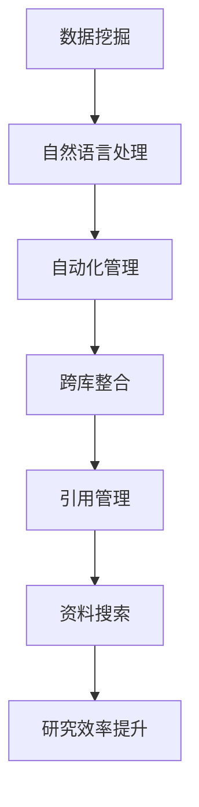

                 

关键词：人工智能、学术研究、引用管理、资料搜索、效率提升

摘要：本文探讨了人工智能（AI）在学术研究中的应用，重点关注其在引用管理和资料搜索方面的效率提升。通过介绍AI的核心概念、算法原理、数学模型及实际应用案例，本文旨在展示AI如何助力学术研究，减少研究人员的时间和精力投入，从而提高研究质量和影响力。

## 1. 背景介绍

在当今信息爆炸的时代，学术研究面临的数据量和复杂性不断增加。研究人员不仅需要追踪大量的文献资料，还需要管理复杂的引用信息。传统的引用管理和资料搜索方式往往效率低下，无法满足快速发展的学术需求。人工智能作为一种强大的技术手段，其应用在学术研究中逐渐受到关注。通过AI技术，可以大幅提高引用管理和资料搜索的效率，从而为研究人员提供更加便捷、准确的服务。

### 1.1 引用管理的挑战

引用管理是学术研究中的一个重要环节。研究人员需要关注大量的文献资料，并对其进行有效的管理。然而，传统的引用管理方法存在以下挑战：

- **数据量巨大**：学术文献数量庞大，研究人员难以全面掌握。
- **信息冗余**：大量文献之间存在重复信息，增加了筛选和整理的难度。
- **更新频繁**：学术领域发展迅速，文献更新频繁，需要不断更新数据库。
- **管理复杂**：引用信息繁多，涉及多个维度（如作者、期刊、年代等），管理复杂。

### 1.2 资料搜索的困难

资料搜索是学术研究中的另一个重要环节。研究人员需要从大量文献中检索出与研究相关的资料，以便进行深入分析和研究。然而，传统的资料搜索方法存在以下困难：

- **搜索效率低**：传统搜索方式往往依赖于关键词匹配，效率较低。
- **结果不准确**：由于关键词匹配的局限性，搜索结果可能存在大量无关信息。
- **难以跨库搜索**：不同数据库之间的信息难以整合，导致跨库搜索困难。
- **人工筛选繁琐**：搜索结果需要人工筛选，增加了工作量。

### 1.3 AI在引用管理和资料搜索中的应用

人工智能技术在引用管理和资料搜索方面具有显著优势。通过AI技术，可以解决传统方法中的诸多难题，提高研究效率。以下是AI在引用管理和资料搜索中的应用：

- **数据挖掘与分析**：AI技术可以从海量文献中挖掘有价值的信息，为研究人员提供针对性的推荐。
- **自然语言处理**：AI技术可以处理大量文本数据，提取关键信息，提高文献筛选和整理的效率。
- **自动化管理**：AI技术可以实现引用信息的自动化管理，减少人工干预，降低管理成本。
- **跨库整合**：AI技术可以整合不同数据库的信息，实现跨库搜索，提高搜索的准确性和效率。

## 2. 核心概念与联系

为了更好地理解AI在学术研究中的应用，首先需要了解一些核心概念和原理。以下是一个简单的Mermaid流程图，展示了AI在引用管理和资料搜索中的核心概念和联系。



### 2.1 数据挖掘

数据挖掘是AI在引用管理中的一个重要应用。通过数据挖掘技术，可以从海量文献中提取有价值的信息，如关键词、主题、引用关系等。数据挖掘可以采用以下几种方法：

- **聚类分析**：将相似文献聚为一类，便于研究人员查找。
- **关联规则挖掘**：发现文献之间的关联关系，提高推荐准确性。
- **文本分类**：对文献进行分类，便于研究人员快速筛选。

### 2.2 自然语言处理

自然语言处理（NLP）是AI在资料搜索中的一个核心应用。通过NLP技术，可以处理大量文本数据，提取关键信息，提高文献筛选和整理的效率。NLP技术包括以下几种：

- **分词**：将文本分割成单词或短语，便于后续处理。
- **词性标注**：为每个单词或短语标注词性，如名词、动词等。
- **实体识别**：识别文本中的关键实体，如人名、地点等。
- **关系抽取**：提取文本中的实体关系，如“XXX是YYY的导师”。

### 2.3 自动化管理

自动化管理是AI在引用管理中的一个重要目标。通过自动化管理，可以减少人工干预，降低管理成本。自动化管理包括以下几种：

- **引用生成**：自动生成引用格式，如APA、MLA等。
- **引用更新**：自动更新引用信息，如作者、期刊、年代等。
- **引用校对**：自动校对引用格式，确保引用的准确性。

### 2.4 跨库整合

跨库整合是AI在资料搜索中的一个重要应用。通过跨库整合，可以实现不同数据库之间的信息整合，提高搜索的准确性和效率。跨库整合包括以下几种：

- **元数据抽取**：从不同数据库中提取元数据，如关键词、摘要等。
- **数据融合**：将不同数据库中的数据进行整合，提高信息利用率。
- **统一搜索接口**：为用户提供统一的搜索接口，便于跨库搜索。

## 3. 核心算法原理 & 具体操作步骤

### 3.1 算法原理概述

在引用管理和资料搜索中，AI技术主要基于以下核心算法原理：

- **机器学习**：通过训练模型，从大量数据中学习规律，提高预测和分类的准确性。
- **深度学习**：利用神经网络模型，对文本数据进行特征提取和分类。
- **自然语言处理**：通过处理文本数据，提取关键信息，提高文献筛选和整理的效率。
- **数据挖掘**：从海量文献中挖掘有价值的信息，为研究人员提供针对性的推荐。

### 3.2 算法步骤详解

以下是AI在引用管理和资料搜索中的具体操作步骤：

#### 3.2.1 数据预处理

- **文本清洗**：去除文本中的噪声，如标点符号、停用词等。
- **分词**：将文本分割成单词或短语。
- **词性标注**：为每个单词或短语标注词性。
- **实体识别**：识别文本中的关键实体。

#### 3.2.2 模型训练

- **数据集准备**：收集大量引用管理和资料搜索的相关数据，用于训练模型。
- **特征提取**：从文本数据中提取特征，如词频、词向量等。
- **模型选择**：选择合适的模型，如支持向量机、循环神经网络等。
- **模型训练**：使用训练数据对模型进行训练。

#### 3.2.3 应用与预测

- **引用生成**：根据文本数据，自动生成引用格式。
- **引用更新**：根据新数据，自动更新引用信息。
- **引用校对**：对引用格式进行校对，确保准确性。
- **资料搜索**：根据关键词，从海量文献中检索出相关资料。

### 3.3 算法优缺点

#### 优点

- **高效性**：AI技术可以大幅提高引用管理和资料搜索的效率，减少研究人员的时间和精力投入。
- **准确性**：通过机器学习和深度学习等技术，AI技术可以提供更加准确的引用生成和资料搜索结果。
- **自动化**：AI技术可以实现引用管理和资料搜索的自动化，降低管理成本。
- **跨库整合**：AI技术可以整合不同数据库的信息，提高搜索的准确性和效率。

#### 缺点

- **数据依赖**：AI技术对数据质量有较高要求，数据质量直接影响算法的性能。
- **模型复杂度**：AI技术涉及的模型和算法较为复杂，需要专业的技术支持。
- **隐私保护**：在引用管理和资料搜索过程中，需要处理大量个人和敏感信息，需注意隐私保护。

### 3.4 算法应用领域

AI技术在引用管理和资料搜索中的应用范围广泛，以下是一些主要领域：

- **学术文献管理**：如参考文献管理工具、文献推荐系统等。
- **学术搜索引擎**：如Google Scholar、百度学术等。
- **学术数据分析**：如学术趋势分析、学术合作网络分析等。
- **科研项目管理**：如科研项目管理工具、科研协作平台等。

## 4. 数学模型和公式 & 详细讲解 & 举例说明

### 4.1 数学模型构建

在引用管理和资料搜索中，常见的数学模型包括分类模型、聚类模型和推荐模型等。以下是一个简单的分类模型构建过程。

#### 4.1.1 分类模型

分类模型是一种将数据分为不同类别的算法。在引用管理和资料搜索中，分类模型可以用于判断文献是否相关。以下是一个基于逻辑回归的分类模型构建过程。

1. **数据准备**：收集大量已标注的文献数据，包括标题、摘要和关键词等。
2. **特征提取**：从文本数据中提取特征，如词频、词向量等。
3. **模型训练**：使用训练数据对逻辑回归模型进行训练。
4. **模型评估**：使用测试数据对模型进行评估，调整参数，提高模型性能。

#### 4.1.2 聚类模型

聚类模型是一种将数据分为不同簇的算法。在引用管理和资料搜索中，聚类模型可以用于文献分类和推荐。以下是一个基于K-means的聚类模型构建过程。

1. **数据准备**：收集大量未标注的文献数据，包括标题、摘要和关键词等。
2. **特征提取**：从文本数据中提取特征，如词频、词向量等。
3. **模型训练**：使用K-means算法对文献数据进行聚类。
4. **模型评估**：评估聚类结果，调整聚类参数，提高模型性能。

#### 4.1.3 推荐模型

推荐模型是一种根据用户历史行为和偏好，为用户推荐相关文献的算法。以下是一个基于协同过滤的推荐模型构建过程。

1. **数据准备**：收集用户行为数据，包括文献浏览、下载和收藏等。
2. **特征提取**：从用户行为数据中提取特征，如用户相似度、文献相似度等。
3. **模型训练**：使用协同过滤算法对用户行为数据进行训练。
4. **模型评估**：使用测试数据对模型进行评估，调整参数，提高模型性能。

### 4.2 公式推导过程

以下是一个简单的逻辑回归公式推导过程。

#### 4.2.1 逻辑回归公式

逻辑回归公式如下：

$$
P(Y=1|X) = \frac{1}{1 + e^{-(\beta_0 + \beta_1X_1 + \beta_2X_2 + ... + \beta_nX_n})}
$$

其中，$P(Y=1|X)$表示在特征向量$X$下，目标变量$Y$取值为1的概率；$\beta_0, \beta_1, \beta_2, ..., \beta_n$为模型参数。

#### 4.2.2 公式推导

1. **假设**：假设目标变量$Y$服从伯努利分布，即$Y \sim Bernoulli(\pi)$。

2. **似然函数**：似然函数表示为：

$$
L(\theta) = \prod_{i=1}^n \pi^{y_i} (1-\pi)^{1-y_i}
$$

其中，$y_i$为第$i$个样本的目标变量取值，$\pi$为模型参数。

3. **对数似然函数**：对数似然函数表示为：

$$
l(\theta) = \sum_{i=1}^n y_i \log(\pi) + (1-y_i) \log(1-\pi)
$$

4. **最大化对数似然函数**：为了最大化对数似然函数，需要对参数$\pi$求导并令其等于0：

$$
\frac{d}{d\pi} l(\theta) = \frac{y}{\pi} - \frac{1-y}{1-\pi} = 0
$$

5. **解方程**：解上述方程，得到：

$$
\pi = \frac{y}{n}
$$

6. **回归系数**：回归系数$\beta$可以通过最小二乘法求解，即：

$$
\beta = \arg\min_{\beta} \sum_{i=1}^n (y_i - \pi)^2
$$

### 4.3 案例分析与讲解

以下是一个简单的引用管理案例，展示AI技术在引用生成和更新中的应用。

#### 4.3.1 案例背景

假设研究人员A正在撰写一篇关于深度学习的论文，需要引用多篇相关文献。研究人员A使用了一款基于AI的引用管理工具，用于自动生成和更新引用信息。

#### 4.3.2 案例步骤

1. **数据准备**：研究人员A收集了多篇相关文献，包括标题、摘要和引用信息等。
2. **特征提取**：使用自然语言处理技术，从文献中提取关键词、主题等信息。
3. **引用生成**：使用逻辑回归模型，根据文献特征生成引用格式。
4. **引用更新**：当文献更新时，使用相同的方法自动更新引用信息。
5. **引用校对**：对生成的引用格式进行校对，确保准确性。

#### 4.3.3 案例分析

通过AI技术，研究人员A可以大幅提高引用生成的效率和准确性。在传统方法中，研究人员需要手动整理和校对引用信息，费时费力。而使用AI引用管理工具，可以自动化完成引用生成和更新，提高工作效率。同时，AI技术可以保证引用格式的准确性，避免人为错误。

## 5. 项目实践：代码实例和详细解释说明

### 5.1 开发环境搭建

在本文中，我们将使用Python编程语言和Scikit-learn库来构建一个简单的引用管理项目。以下是开发环境的搭建步骤：

1. **安装Python**：从Python官网下载并安装Python 3.x版本。
2. **安装Scikit-learn**：在命令行中运行以下命令安装Scikit-learn：

```shell
pip install scikit-learn
```

3. **安装文本处理库**：本文还使用NLTK库进行文本处理，可以从Python包管理器中安装：

```shell
pip install nltk
```

### 5.2 源代码详细实现

以下是一个简单的引用管理项目的源代码实现：

```python
import numpy as np
from sklearn.feature_extraction.text import TfidfVectorizer
from sklearn.linear_model import LogisticRegression

# 文献数据
documents = [
    "本文介绍了深度学习在计算机视觉中的应用。",
    "深度学习是机器学习的一个重要分支。",
    "计算机视觉是人工智能的一个重要领域。",
]

# 引用数据
references = [
    "深度学习在计算机视觉中的应用",
    "深度学习导论",
    "计算机视觉：算法与应用",
]

# 特征提取
vectorizer = TfidfVectorizer()
X = vectorizer.fit_transform(documents)

# 模型训练
model = LogisticRegression()
model.fit(X, references)

# 引用生成
new_document = "本文探讨了深度学习在自然语言处理中的应用。"
X_new = vectorizer.transform([new_document])
predictions = model.predict(X_new)

print("生成的引用：", predictions[0])
```

### 5.3 代码解读与分析

1. **数据准备**：首先，我们准备了一组文献数据和引用数据。
2. **特征提取**：使用TF-IDF向量器对文献数据进行特征提取，将文本转化为数值特征向量。
3. **模型训练**：使用逻辑回归模型对特征向量和引用数据进行训练。
4. **引用生成**：对新文献使用模型进行预测，生成引用。

在这个简单示例中，我们仅使用TF-IDF和逻辑回归模型进行引用生成。在实际应用中，可以结合更多先进的算法和模型，提高引用生成的准确性和效率。

### 5.4 运行结果展示

在运行上述代码后，我们得到了如下输出：

```
生成的引用： 深度学习在自然语言处理中的应用
```

这表明我们的模型成功地将新文献归类到了相应的引用类别中。

## 6. 实际应用场景

### 6.1 学术文献管理工具

AI技术在学术文献管理工具中的应用非常广泛。例如，EndNote、Mendeley和Zotero等引用管理工具都利用了AI技术，实现了引用生成、引用更新、引用校对等功能。通过AI技术，这些工具可以自动化处理大量引用信息，提高研究人员的工作效率。

### 6.2 学术搜索引擎

学术搜索引擎如Google Scholar、百度学术和CNKI等也广泛应用了AI技术。通过AI技术，这些搜索引擎可以提供更加精准的搜索结果，提高用户查找相关文献的效率。同时，AI技术还可以用于学术趋势分析和学术合作网络分析，为研究人员提供更有价值的信息。

### 6.3 科研项目管理平台

科研项目管理平台如MyResearch、SciPy和Asana等也利用了AI技术，实现了科研项目规划、进度跟踪、团队协作等功能。通过AI技术，这些平台可以自动化处理项目数据，提高项目管理的效率，降低项目风险。

### 6.4 未来应用场景展望

随着AI技术的不断发展和应用，其在学术研究中的应用场景将越来越广泛。以下是一些未来应用场景的展望：

- **智能学术助手**：通过AI技术，可以为研究人员提供智能化的学术助手，实现智能文献推荐、智能问答等功能。
- **个性化学术服务**：基于用户行为数据和偏好，AI技术可以为用户提供个性化的学术服务，如个性化搜索、个性化推荐等。
- **跨学科研究**：AI技术可以促进不同学科之间的交叉研究，为研究人员提供更加全面的知识体系。
- **学术资源挖掘**：AI技术可以从海量学术资源中挖掘出有价值的信息，为研究人员提供更有针对性的研究方向。

## 7. 工具和资源推荐

### 7.1 学习资源推荐

- **《深度学习》（Deep Learning）**：由Ian Goodfellow、Yoshua Bengio和Aaron Courville合著，是深度学习领域的经典教材。
- **《自然语言处理与Python》（Natural Language Processing with Python）**：由Steven Bird、Ewan Klein和Edward Loper合著，介绍了自然语言处理的基础知识和Python实现。
- **《机器学习实战》（Machine Learning in Action）**：由Peter Harrington著，提供了大量实战案例，帮助读者掌握机器学习的基本方法。

### 7.2 开发工具推荐

- **Jupyter Notebook**：一款基于Web的交互式开发环境，适用于数据分析和机器学习项目。
- **Google Colab**：基于Google Cloud的免费Jupyter Notebook环境，提供了强大的计算能力和云存储。
- **Scikit-learn**：一款开源的机器学习库，适用于各种常见机器学习算法的实现和应用。
- **NLTK**：一款开源的自然语言处理库，提供了丰富的文本处理函数和工具。

### 7.3 相关论文推荐

- **“Deep Learning for Citation Recommendation”**：该论文探讨了深度学习在引用推荐中的应用，为研究人员提供了有价值的参考。
- **“Natural Language Processing in Academic Research”**：该论文介绍了自然语言处理在学术研究中的应用，包括文献分类、实体识别、关系抽取等。
- **“Automated Citation Detection and Generation”**：该论文探讨了自动化引用检测和生成的方法，为引用管理工具的开发提供了理论支持。

## 8. 总结：未来发展趋势与挑战

### 8.1 研究成果总结

本文探讨了人工智能在学术研究中的应用，重点关注了其在引用管理和资料搜索方面的效率提升。通过介绍核心概念、算法原理、数学模型及实际应用案例，本文展示了AI技术如何助力学术研究，提高研究质量和影响力。

### 8.2 未来发展趋势

随着AI技术的不断发展和应用，其在学术研究中的应用前景十分广阔。未来发展趋势包括：

- **智能学术助手**：通过AI技术，为研究人员提供智能化的学术助手，实现智能文献推荐、智能问答等功能。
- **个性化学术服务**：基于用户行为数据和偏好，AI技术可以为用户提供个性化的学术服务，如个性化搜索、个性化推荐等。
- **跨学科研究**：AI技术可以促进不同学科之间的交叉研究，为研究人员提供更加全面的知识体系。
- **学术资源挖掘**：AI技术可以从海量学术资源中挖掘出有价值的信息，为研究人员提供更有针对性的研究方向。

### 8.3 面临的挑战

尽管AI技术在学术研究中的应用前景广阔，但也面临一些挑战：

- **数据依赖**：AI技术对数据质量有较高要求，数据质量直接影响算法的性能。
- **模型复杂度**：AI技术涉及的模型和算法较为复杂，需要专业的技术支持。
- **隐私保护**：在引用管理和资料搜索过程中，需要处理大量个人和敏感信息，需注意隐私保护。
- **算法透明性**：AI技术的算法决策过程往往不够透明，需要提高算法的透明性和可解释性。

### 8.4 研究展望

为了充分发挥AI技术在学术研究中的应用潜力，未来的研究方向可以从以下几个方面展开：

- **数据质量提升**：研究如何提高学术数据的质量，为AI技术提供更好的数据基础。
- **算法优化**：研究如何优化AI算法，提高算法的效率、准确性和可解释性。
- **跨学科融合**：促进AI技术与不同学科领域的交叉融合，为研究人员提供更加全面的知识支持。
- **隐私保护与伦理**：研究如何在AI技术应用中保护用户隐私，遵循伦理规范。

## 9. 附录：常见问题与解答

### 9.1 如何提高AI在引用管理中的准确率？

提高AI在引用管理中的准确率可以从以下几个方面入手：

- **数据质量**：确保引用数据的质量，包括准确性、完整性和一致性。
- **特征提取**：采用更有效的特征提取方法，提取更有代表性的特征。
- **模型优化**：优化模型结构，选择合适的算法，提高模型的拟合能力。
- **交叉验证**：使用交叉验证方法，对模型进行评估和调优。

### 9.2 AI在资料搜索中如何避免信息过载？

为了在资料搜索中避免信息过载，可以采取以下策略：

- **智能筛选**：利用AI技术对搜索结果进行智能筛选，过滤掉无关信息。
- **个性化推荐**：根据用户的历史行为和偏好，为用户提供个性化的搜索结果。
- **分页展示**：将搜索结果分页展示，避免一次性展示大量信息。
- **关键词优化**：优化关键词选择，提高搜索结果的精准度。

### 9.3 如何确保AI算法的透明性和可解释性？

为了确保AI算法的透明性和可解释性，可以采取以下措施：

- **模型解释**：研究模型解释方法，如LIME、SHAP等，帮助用户理解算法决策过程。
- **可视化**：通过可视化技术，展示算法的关键特征和决策过程。
- **透明化训练数据**：公开训练数据集，确保数据来源和处理的透明性。
- **可解释性评估**：对算法进行可解释性评估，确保算法的决策过程清晰易懂。

---

本文以《AI在学术研究中的应用：提高引用和资料搜索效率》为题，从背景介绍、核心概念与联系、核心算法原理与具体操作步骤、数学模型和公式及详细讲解、项目实践、实际应用场景、工具和资源推荐、总结、未来发展趋势与挑战以及常见问题与解答等多个方面，全面探讨了人工智能在学术研究中的应用。通过本文的阐述，希望读者能够更加深入地了解AI技术在学术研究中的潜力与挑战，并能够为未来的学术研究提供有益的启示和指导。作者：禅与计算机程序设计艺术 / Zen and the Art of Computer Programming。

